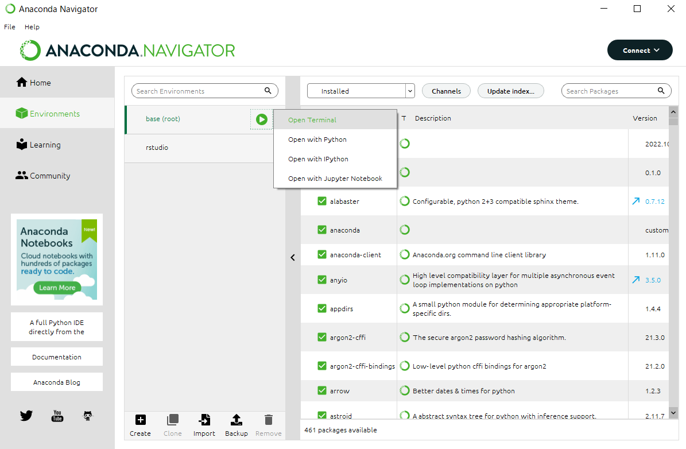
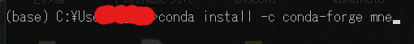
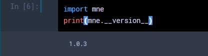

# セットアップ

## MNE-Python とは

<center></center>

[MNE-python](https://mne.tools/stable/index.html) は Python 上で動く EEG/MEG 解析用ソフトウェアです. [EEGLAB](../eeglab/1setup.html) と違い，CUI ベース，つまりプログラムを自分で書いて脳波の解析をします．有料の MATLAB を自分で購入する必要なく誰でも使え，かつオープンソースに様々な発展的な解析が行えるので，近年では取って代わりつつあります．

おすすめは，とりあえず EEGLAB でボタンポチポチして解析の概要を知ってからの方が分かりやすいですが，そうでなくても大丈夫なほど丁寧に Tutorial が創られているので心配無用です．

<center></center>

## 環境構築
既に Python3 on Jupyter notebook がある前提で進めます．これらの[環境構築](../../Simulation/Setup/environment.html)を先に終わらせてください．(もちろん，Python が使える人であれば Jupyter 環境である必要は全くありませんが，ノート共有のために指定しています．不必要であればご自由にどうぞ．)

早速 Anaconda で MNE をダウンロードしていきます．Terminalを開いて

<center></center>


黒い画面に以下を打ち込みます．
> conda install -c conda-forge mne

<center></center>

しばらくして，問題がなければ
> done

と表示されます．

Jupyter notebook を Python で立ちあげて，MNE が問題なく呼び出せるか確認しましょう．

<center></center>

version が表示されれば OK です．

### Update
もし，上記のように Conda のバージョンが低い場合 (2023年9月現在はバージョン1.5が推奨) は，

```
conda update mne
```


などとして推奨のバージョンまでアップデートしておきましょう．チュートリアルのものと関数の仕様などが異なる問題を回避できます．

あるいは，それでも更新できない場合は

```python
pip install -U mne
```

がいいかも．


### MNE-connectivity
デフォルトの MNE-python には，現状 (ver 1.6) はコネクティビティ解析のメソッドがあまり充実していません．そこで，MNE ベースに動く connectivity 用のパッケージである [MNE-Connectivity](https://mne.tools/mne-connectivity/dev/index.html) をインストールします．

Anacondaから

```shell
conda install -c conda-forge mne-connectivity
```

無理だったら
```shell
pip install mne-connectivity
```

とすることでInstallできます．

次回はデータの[インポート](./2import.html)の仕方です．