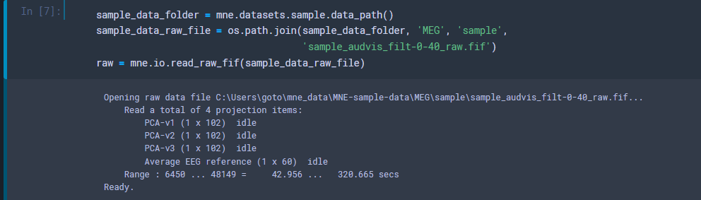
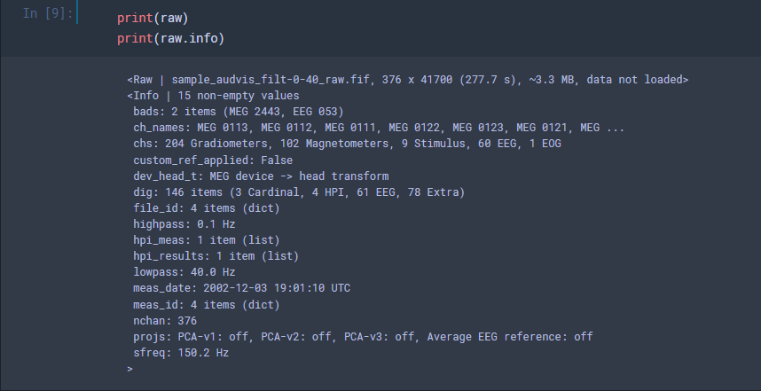
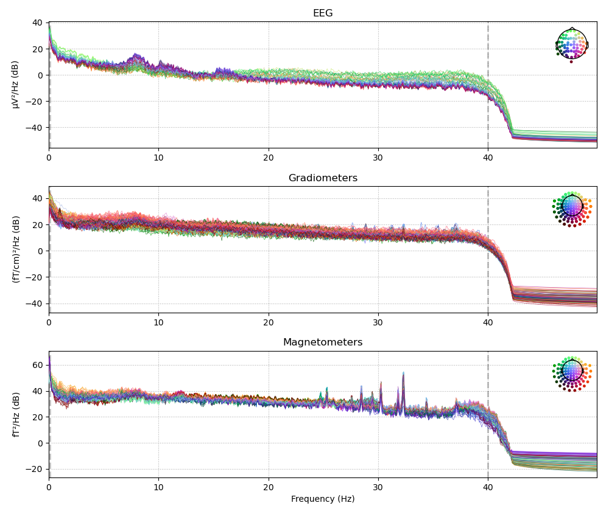
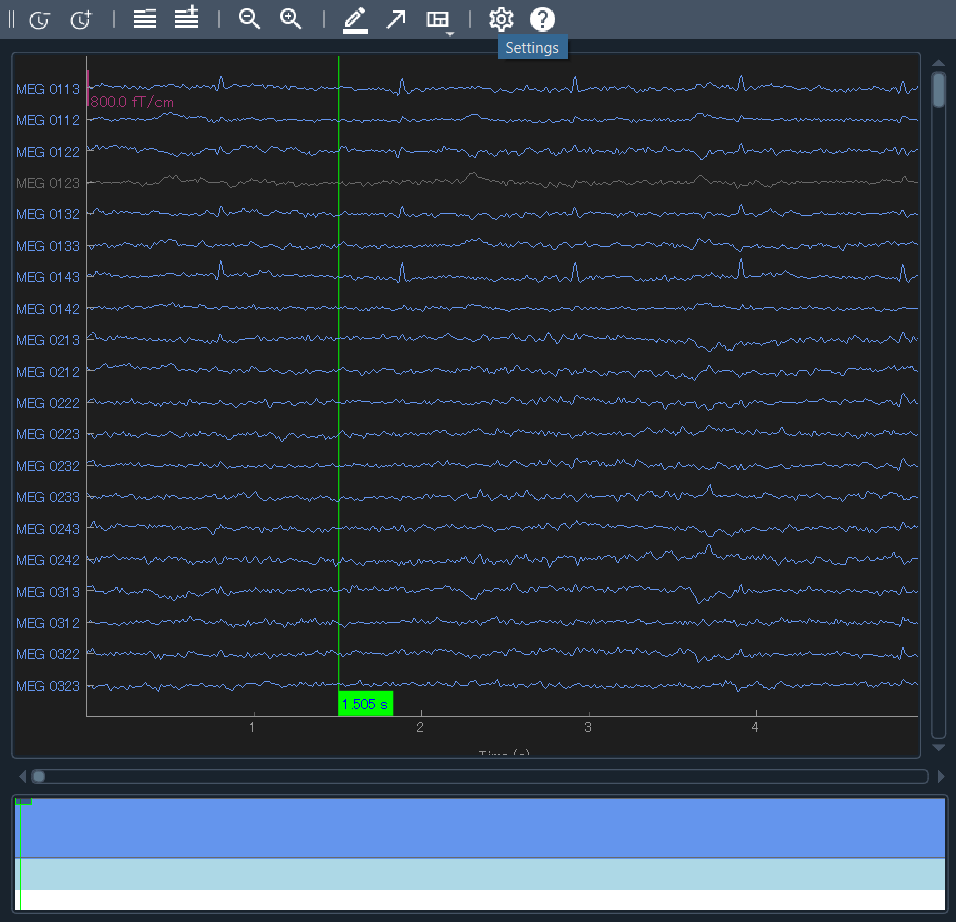
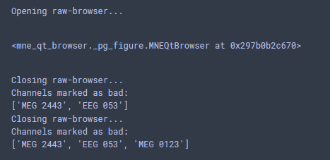

# データのロード

まずは解析するためのデータを読み込んで行きます．

今回のコードは[こちら](./MNE-newbie.ipynb)．

## とりあえずチュートリアル
MNE-python は丁寧なチュートリアルを用意してくれているので，まずはそれに従って進めていきます．

はじめに，サンプルデータを読み込んできます．


```python
import mne
import os

sample_data_folder = mne.datasets.sample.data_path()
sample_data_raw_file = os.path.join(sample_data_folder, 'MEG', 'sample','sample_audvis_filt-0-40_raw.fif')
raw = mne.io.read_raw_fif(sample_data_raw_file)
```

<center></center>

読み込めました．初回は結構時間がかかるかもしれません．

1行目では `sample_data_folder` に MNE 公式が用意しているデータセットがダウンロードされます．自分の場合は
> C/Users/hoge

直下に `mne_data` というフォルダが作られました．いろんなデータが入っています．

2 行目で，そのうち `sample_audvis_filt-0-40_raw.fif` というファイルを指定して，`sample_data_raw_file` に格納しています．これは `sample_audvis_raw.fif` というファイルに対して 40 Hz でローパスフィルタをかけてくれた後のデータです．計算量など削減のため，とりあえずここではフィルタ済みを使っていきます．

3 行目で，指定したファイルを読み込んでいます．ここの関数はデータ構造によって異なります．今回は MEG の fif フォーマットを使っているので，対応した関数です．他に対応しているデータフォーマットは[こちら](https://mne.tools/stable/overview/implementation.html#data-formats) で確認できます．

さて，まずはどんなデータなのかを見てみます．

<center></center>

吐き出させると，色々書いてありました．

- bads: これはノイジーな電極番号とか...?
- ch_names: そのまんまぽい
- chs: 各電極の数


など．フィルター情報なども書かれています．これ便利そう．僕とかはファイル名てきとうにつけてしまうせいで，今見ているファイルがどこまで下処理したものなのか分からなくなることがあります．管理してもらえるのは助かる．


次に，ビルトインの関数で [Power Spectral Density](../Methods/time_frequency.html) を計算して出力させます．
引数では，50 Hz までの周波数 (そもそもフィルタで 40 までになってるが) を，bad チャンネルを除いて表示するように指定しています．

```python
fig = raw.plot_psd(fmax=50, picks="data", exclude="bads")
fig.savefig('../figures/psd_plot.png')  # PNG形式で保存。必要に応じてファイル名や拡張子を変更
```


<center></center>

簡単になんかかっこいいの出ました．うーん，脳波見た感じ，後頭に α 波が乗っていますね！他は特に感想ないです．まあ刺激とか無視してこれだけ見てもね，という話ですね．カラーリングはよく分からないですが，デフォルトでやってくれているようですね．


次に，波形を見てみます．

```python
raw.plot(duration=5)
```

5 秒間の波形を全 ch 分表示します．`n_channels=xx` を指定すると，一部の表示が出来るというようなのが tutorial には書かれていましたけど自分のとこだとなんか上手くいきませんでした．

<center></center>

別ウィンドウで開かれたのがこんな感じ．クリックやスクロールができます．試しに一個 (MEG 0123) をクリックして閉じてみると...

<center></center>

今クリックした `MEG0123` ch が bad チャンネルとして登録されてました．危ない．やり直して消しました．こんな風に目視除去というかラベル付けができるようです．

ともかく，現時点でも所感としてはお手軽にオシャレ脳活動図になりそう．すくなくとも [EEGLAB](../eeglab/eeglab.html) よりは可愛いですね．

次回は[前処理](./3preprocessing.html)に入ります．