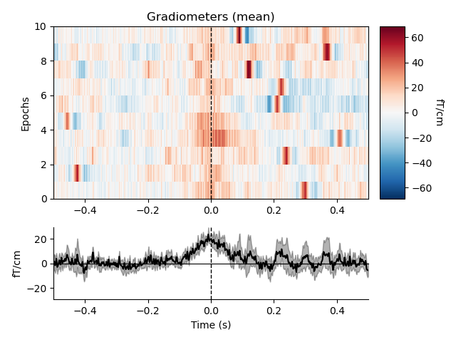
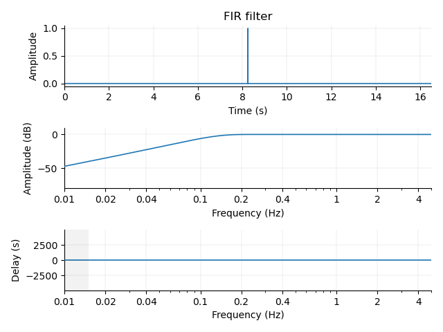
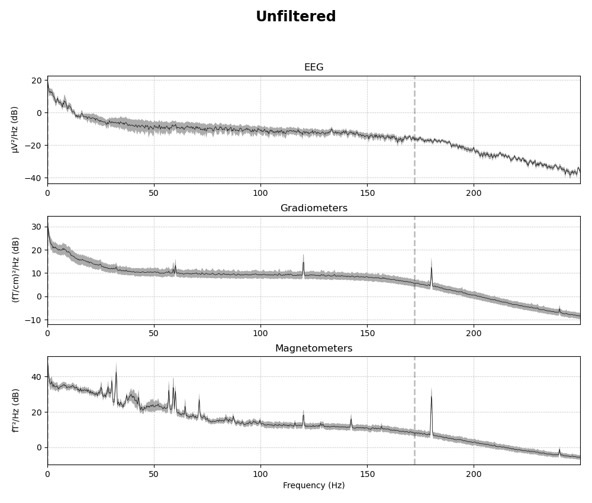
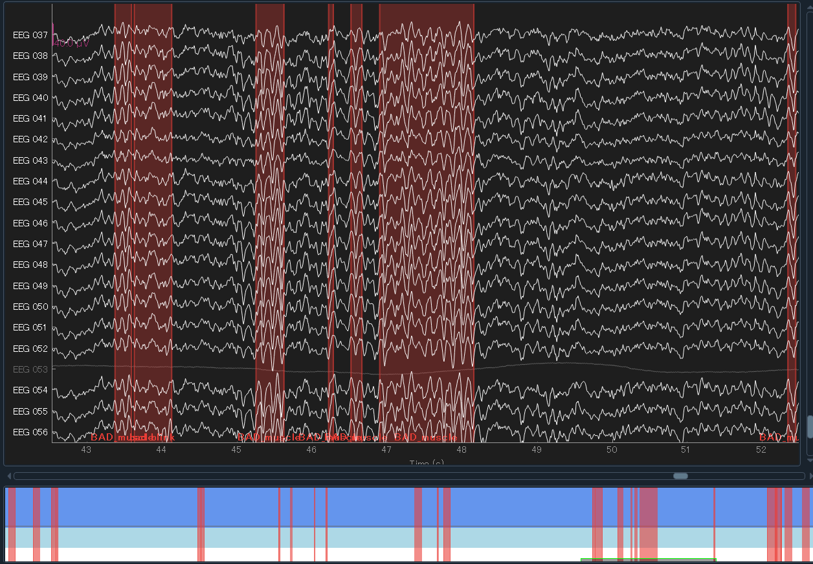

# 前処理

データのロードが分かったところで，データの前処理の仕方を確認していきます．[公式のチュートリアル](https://mne.tools/stable/auto_tutorials/preprocessing/index.html) を参考に進めます．

今回のコードは[こちら](./MNE-newbie.ipynb)．

## まずはロード
まずは，何も前処理が行われていないデータを読み込んできます．データのロードでやった内容通りにすゝめます．

```python {.line-numbers}
sample_data_folder = mne.datasets.sample.data_path()
sample_data_raw_file = os.path.join(
    sample_data_folder, "MEG", "sample", "sample_audvis_raw.fif")
raw = mne.io.read_raw_fif(sample_data_raw_file)
raw.crop(0, 60).load_data()  # just use a fraction of data for speed here
```

最後の5行目，[raw.crop()](https://mne.tools/dev/generated/mne.io.Raw.html#mne.io.Raw.crop) では，計算を速くするために 0~60 秒のデータだけを抜き出しています．実際にはいらないです．

<center></center>

読み込むとこんな画面がでます．

### 位置情報の読み込み

読み込む脳波ファイルの形式によっては，位置情報が入っていないことがあります．位置情報というのは，

<center></center>

Digitized points に格納される情報のようです．今，上に表示しているファイルは筆者が計測した brainvision の脳波で，`eeg, vhdr, vmrk`の 3 ファイルで脳波やその他情報をまとめている形式です．これを読み込むと，位置情報がない `Not available` となっています．

この状態だと，MNE の位置情報を使った関数は使えません．なので位置情報を読み込む必要があります．

まずは，どんな位置情報が使えるか (テンプレートとして用意されているファイル) を確認してみます．

```python
mne.channels.get_builtin_montages()
```

とすると，色々なモンタージュが表示されます．今回はこのうち，`standard_1020` を使っていたのでそれを読み込みます．

```python
raw.set_montage(mne.channels.make_standard_montage('standard_1020'))
```

これで電極の位置情報が読み込めました．


## Re-reference

https://mne.tools/stable/auto_examples/preprocessing/contralateral_referencing.html

多分ここ

## ノイズについて
一応，説明してみます．他のページと内容が重複している部分も多分にあると思いますが...

### ノイズの種類
まず，計測された脳波や脳磁には，脳活動 (だと我々が信じている) 成分以外にも様々な成分由来の信号が含まれています．

たとえば，
- 電源由来のラインノイズ
- 被験者の体動
- 呼吸や心拍由来
- (シールドされていない場合)ヘッドフォンの信号など，感覚刺激由来
- 近くのエレベーターや携帯電話などの電磁波
- 電極の電気抵抗の変化による信号の変化
- 眼球運動やまばたきによる筋電
- 被験者が唾を飲む時の筋電

などと様々です．環境由来のものから，計測機器によるもの，被験者が生きているが故に出てしまうもの，被験者が気合でどうにかできるもの，色々あります．

生体信号解析においては，これらノイズをいかに排除するかがカギになります．

### ノイズとの向き合い方
ノイズとの向き合い方は大きく3つです．即ち
  
- 無視する
- ノイズが含まれる部分を消す
- 修正する

です．無視は分かりやすいですね．そのままです．

ノイズが含まれる部分を消すのは，初心者がやる最初のノイズ除去ステップです．ただし問題は，これによって多くのデータが排除された結果，まともに解析に使えるデータが少なくなってしまう事態が生じることです．

よって，一般には 3 つ目，ノイズだけを除去して clean な信号に"修正する"作業が求められます．ここに職人技を見るわけです．

オーソドックスな方法として，各種フィルター，独立成分分析などがあります．が，そういったなかば自動化された方法に移る前に，まずは明らかな部分を消してあげるのも大事です．

## アーティファクトの確認

さて，早速アーティファクトの検出に移りたいところですが，その前にサンプルデータに対しておまじない的なことをしておきます．

```python {.line-numbers}
ssp_projectors = raw.info["projs"]
raw.del_proj()
```

このサンプルは事前に `SSP projectors` なるものが適用されているのですが，これはいらないので消す作業をするわけです．`SSP projectors` はまたいずれ触ってみます．

<center></center>


分かりにくいですが，先程まであった `Projectors` 項目が消えています．これで生の状態です．

さて，いよいよ色々なノイズ，アーティファクト達を確認していきます．ここでは，特に除去することはせず，眺めるだけです．


### 低周波ドリフト
まずは低周波のドリフト成分です．いくつかの理由で起こり得ます．抵抗値の変化などです．これは一番視覚的にも分かりやすくて，[raw.plot()](https://mne.tools/stable/generated/mne.io.Raw.html#mne.io.Raw.plot) で表示してみると

```python
mag_channels = mne.pick_types(raw.info, meg="mag")
raw.plot(duration=60, order=mag_channels, n_channels=len(mag_channels), remove_dc=False)
```

<center></center>

このうねうねしている部分がそうです．(背景黒，見にくいなぁ...設定でいじれそうだけど)

だいたいは，High-pass フィルタをかけることで消えます．かなりゆっくりめの動きなので，0.1 Hz とかでも消されるはずです．

### ラインノイズ
電源由来のノイズ成分です．
これは [plot_psd()](https://mne.tools/stable/generated/mne.io.Raw.html#mne.io.Raw.plot_psd) で確認してみます．

```python
fig = raw.plot_psd(tmax=np.inf, fmax=250, average=True, picks="data", exclude="bads")
```
<center></center>

これらは周波数スペクトルです．60 の倍数成分に謎のピークが立っていることが分かると思います．アメリカの電源周波数ですね．脳波には乗ってなさそう．なんでなんですかね？

ともかく，こうした成分を抜かずに解析した結果，「このタスクには60Hzの倍数成分が重要なんです！」なんて恥ずかしい主張をしないためにも消す必要があります．

では，Magnetometers の結果の 20~30 Hz のピークはなんでしょうか．おそらく，心拍由来の成分です．これも消したい．

### 心拍 (ECG)

MNE-python は MEG にも使える，というかそっちがメイン？なので，特に心拍に気を使うようです．MEG は ECG の影響が乗りやすい．[create_ecg_epochs()](https://mne.tools/stable/generated/mne.preprocessing.create_ecg_epochs.html#mne.preprocessing.create_ecg_epochs) 関数は，[find_ecg_events()](https://mne.tools/stable/generated/mne.preprocessing.find_ecg_events.html#mne.preprocessing.find_ecg_events) 関数を呼び出して，引数として与えられたデータに対して自動的に心拍成分を抜き出してきて，さらにそのタイミングに合わせこんで加算平均したECGエポックを作成してくれる関数のようです．


```python
ecg_epochs = mne.preprocessing.create_ecg_epochs(raw)
ecg_epochs.plot_image(combine="mean")
```

まず，`ecg_epochs` にエポック化されたECGデータが格納されます．この時点では

<center></center>

なんか色々表示されますが，59個の心拍成分が見つかったようですね．`ecg_epochs` のサイズを見ると

<center></center>

といった形になっています．0成分がエポック数ですね．

出力される画像は以下です．

<div style="display: flex; gap:5px;">
	
	
	
</div>


これでみると，EEGはあまり影響受けてないことが分かりますね．良かった．ともかく，これも排除する対象になります．また，Magnetoの結果から，やはりECGの影響もかなりの低周波で (水平の線として表れている) ，先程の低周波ノイズと重なっていた理由が分かります．

分かりにくいので，低周波ノイズを消して適用しましょう．低周波ノイズを消すには，フィルタ以外にもベースライン補正という方法もあります．

```python
ecg_epochs = mne.preprocessing.create_ecg_epochs(raw, baseline=(-0.5,-0.2))
fig = ecg_epochs.plot_image(combine="mean")
```
<div style="display: flex; gap:5px;">
	
	
	
</div>

横縞がなくなり，綺麗なピークが見れるようになりました．

さらに，[average()](https://mne.tools/stable/generated/mne.Epochs.html#mne.Epochs.average) をとることで ECG エポックを平均化して，[plot_topomap()](https://mne.tools/stable/generated/mne.Evoked.html#mne.Evoked.plot_topomap) によってトポマップに表示することも

```python
avg_ecg_epochs = ecg_epochs.average()
fig = avg_ecg_epochs.plot_topomap(times=np.linspace(-0.05, 0.05, 11))
```
可能です．-0.05 秒から 0.05 秒までの間を 11 分割してトポマップに表示します．

<center></center>

あるいは，チャンネル方向に加算平均した ERP や ERF の形に取り出すと
```python
fig = avg_ecg_epochs.plot()
```

<center></center>


さらにさらに．
```python
fig = avg_ecg_epochs.plot_joint(times=[-0.25, -0.025, 0, 0.025, 0.25])
```

などと，[plot_joint()](https://mne.tools/stable/generated/mne.Evoked.html#mne.Evoked.plot_joint) を使うことで Topomap と併せた表示もできます．これはERP研究なんかでもよく使われる fig の形ですね．今回は，時間を指定していますが特に `times` を指定しない場合には自動で選ばれたピーク部分になるようです．

<center></center>


### 眼球運動 (EOG)
最後に，眼球運動および瞬きについてです．こちらも心拍と同様に[create_eog_epochs()](https://mne.tools/stable/generated/mne.preprocessing.create_eog_epochs.html#mne.preprocessing.create_eog_epochs) が用意されています．心拍とは異なり，EEGは眼電由来成分がめちゃくちゃのります．

```python
eog_epochs = mne.preprocessing.create_eog_epochs(raw, baseline=(-0.5, -0.2))
eog_epochs.plot_image(combine="mean")
eog_epochs.average().plot_joint()
```
<div style="display: flex; gap:5px;">
	
	
	
</div>

<div style="display: flex; gap:5px;">
	
	
	
</div>

たしかに EEG がすんごい．

### まとめ
このように，いろんな理由で乗る様々なノイズがあります．計測の種類や課題の種類によって，どのノイズが特に強いかなどは異なるため，紋切り型のアプローチではなく，まずはこうやって色々と見てみて，何がアーティファクトかを見分ける目を養うことが重要です．

次は，いよいよ除去に入ります．

## バッドチャンネルの除去
### 概要
まずは，明らかにノイジーなチャンネルを "bad channel" として手動でマーキングする方法と，そのデータを周囲のまともなチャンネルのデータから再構成する方法を確認します．

まず，MNE-python では "bad channel" は無視するわけでも消すわけでもなく，解析時に抜いて扱う，ということが出来るようです．引数で調整します．"bad channel" とはいえ，解析結果に影響しないようならあまり無暗に消したくないところですので，これは便利です．

まず，"bad channel" リストを確認します．サンプルだとこれデフォルトで入っていますが，自動で算出されてるのか，何か調整されているのか，ちょっとわかりませんでした．今後の課題です．

<center></center>

ともかく，いまのところ "bad" に入っているのは2つのチャンネルのようです．実際に目視してみます．

```python
picks = mne.pick_channels_regexp(raw.ch_names, regexp="EEG 05.")
raw.plot(order=picks, n_channels=len(picks))
```

```python
picks = mne.pick_channels_regexp(raw.ch_names, regexp="MEG 2..3")
raw.plot(order=picks, n_channels=len(picks))
```

<div style="display: flex; gap:5px;">
	
	
</div>


なるほど，どちらも明らかに他のチャンネルと異なって死んだデータになっています．

ここから，直接いじりたい時には先程もどこかでやったように，クリックして選ぶか，あるいは以下のように普通に python のリストとして扱っていじることが可能です．

```python
original_bads = deepcopy(raw.info["bads"])
raw.info["bads"].append("EEG 050")  # add a single channel
raw.info["bads"].extend(["EEG 051", "EEG 052"])  # add a list of channels
bad_chan = raw.info["bads"].pop(-1)  # remove the last entry in the list
raw.info["bads"] = original_bads  # change the whole list at once
```

通常，MNE-python のあらゆる関数はこうしてマークされた"bad"リストを除外して解析を行うようですが，引数で `exclude=[]` としてあげれば含めることができるようです．たとえば

```python
# default is exclude='bads':
good_eeg = mne.pick_types(raw.info, meg=False, eeg=True)
all_eeg = mne.pick_types(raw.info, meg=False, eeg=True, exclude=[])
print(np.setdiff1d(all_eeg, good_eeg))
print(np.array(raw.ch_names)[np.setdiff1d(all_eeg, good_eeg)])
```

として，`exclude` を入れたリストといれてないリストを作成して差分を見てみると，ちゃんと bad チャンネルである EEG053 がいることが確認できます．なお，[pick_types()](https://mne.tools/stable/generated/mne.pick_types.html#mne.pick_types) では raw の中から，Info が EEG になっているものだけを取り出しています．

<center></center>


### いつ見つけるか
ではこの処理を適用するタイミングがいつなのかです．まず大前提としてですが，ノイジーなチャンネルは何も解析段階に行かずとも分かることが多いです．

実験での計測中，しっかりとモニタリングしていれば暴れているチャンネルが分かります．それらを先に実験ノートにメモしておき，データ処理を始める段階で"bad"リストにぶちこんでやりましょう．

また，それでも抜けがあることを考慮して，ICA などをかける前の段階で plot 関数を使って生波形を目視して調べるのも重要です．そうした作業をおこたり，ノイジーなチャンネルを除外できていない場合にERP/ERFを計算すると以下のようになるようです．

```python
raw2 = raw.copy()
raw2.info["bads"] = []
events = mne.find_events(raw2, stim_channel="STI 014")
epochs = mne.Epochs(raw2, events=events)["2"].average().plot_joint()
```

[find_events()](https://mne.tools/stable/generated/mne.find_events.html#mne.find_events) は，`stim_channel` として指定した "STI 014" の信号を元にトリガー検出し，event 情報を抜き出す関数です．

<center></center>

このうち，EEG は分かりにくいのですが，Gradiometers は分かりやすいです．明らかに一本だけ変なやつがいますね．こうした事態を避けるために，ノイジーなデータは除去すべきです．


いずれにせよ，解析結果がこうなってからでは (ERP なら分かりやすいですが) 解釈も難しく，かつノイズのせいであることにも気付きにくくなってしまいます．出来るだけ早い段階で消す野を心掛けるのが重要そうです．

### Interpolation
日本語知らない．これは，"bad" チャンネルを除去するだけでなく補完する作業です．研究でデータを扱うことを現実的に考えた時，それぞれの被験者から思い思いに悪いチャンネルのデータを消すのは望ましくありません．何故なら，たとえば「Fp1の電極が重要そう」な時，被験者番号 1,5,17 の 3 人はそもそも"bad" だったので消していてデータがありません...といったことになるからです．

また，行列処理的にも1要素 (つまり被験者) でも次元が落ちているのであれば，全体の次元はそこに引きずり込まれます．よって，他の重要なデータも数多く失うことになり，それはとても悲しいことです．

なので，ただ消すのではなく補完する作業をします．

スプライン補完という手法を使います．数学的な背景はまた別にいつか．まあ簡単に言ってしまえば，周辺の電極から再構成する方法です．

早速やってみます．


```python {.line-numbers}
raw.crop(tmin=0, tmax=3).load_data()

eeg_data = raw.copy().pick_types(meg=False, eeg=True, exclude=[])
eeg_data_interp = eeg_data.copy().interpolate_bads(reset_bads=False)

for title, data in zip(["orig.", "interp."], [eeg_data, eeg_data_interp]):
    with mne.viz.use_browser_backend("matplotlib"):
        fig = data.plot(butterfly=True, color="#00000022", bad_color="r")
    fig.subplots_adjust(top=0.9)
    fig.suptitle(title, size="xx-large", weight="bold")
```
まず見やすいように，[raw.crop()](https://mne.tools/dev/generated/mne.io.Raw.html#mne.io.Raw.crop) で時間幅を切ってきます．その後，2 行目でサンプルから EEG データだけを [pick_types()](https://mne.tools/dev/generated/mne.io.Raw.html#mne.io.Raw.pick_types) で抜き出し，3 行目ではそれを interpolate しています．ここでは [interpolate_bads()](https://mne.tools/dev/generated/mne.io.Raw.html#mne.io.Raw.interpolate_bads) 関数を使用しています．これは `bads` リストに入っているセンサーの情報をスプライン補完で埋めてあげ，ついでに `bads` リストを空にします．つまり「もう `bads` なんてない」状態にするものです．

尚，Epocking した後のデータの場合には別の関数で [mne.Epochs.interpolate_bads()](https://mne.tools/dev/generated/mne.Epochs.html#mne.Epochs.interpolate_bads) を使うようです．MNE の Raw, Epochs などのオブジェクトの扱いはまだよく見てないので今度．

結果を分けて plot してみると，


<div style="display: flex; gap:5px;">
	
	
</div>

となっています．赤でハイライトされているのが，bad チャンネルとされていたものですね．比較すると，たしかに Interpolation によってノイジーではなくなっていることが分かります．

どこまで正確にちゃんとした脳活動を再現できるのかと言われると怪しいのですが，それでもただ排除するよりはデータのランクを落とさないので嬉しいメソッドです．


## フィルター
### バンドパスフィルタ
次に，フィルターの適用をします．ラインノイズやドリフトなどを消すため，少なくとも低周波を消す High-pass filter は適用する必要があります．逆に，高周波を消す Low-pass filter の方は，適用しない場合もあります．脳波なんかだとどうせ高周波は見れないとされているので， だいたい 40 Hz とか 60 Hz くらいで切ってしまうことが多いですが，MEG だとその限りでもないようです．


でもとりあえず，ここでは High-pass と Low-pass が出来る Band-pass filter を適用していきます．

テストのため，
```python
raw3 = raw.copy()
raw3.crop(0,60).pick_types(meg=True, eeg=False, stim=True).load_data()
```
まずはデータを短く切って，MEG だけ抜き出してきました．MEG の方がドリフトが分かりやすかったからです．

plot() すると，

<center></center>

このように明らかなドリフトが見られます．これを消しましょう．眺めると，だいたい 10 秒程で山が出来てる，つまり 1 周期で 20 秒程の超低周波成分であることが分かります．

こいつらを消したいので，

```python {.line-numbers}
raw_highpass = raw3.copy().filter(l_freq=0.2, h_freq=None)
with mne.viz.use_browser_backend("matplotlib"):
    fig = raw_highpass.plot(duration=60, proj=False, n_channels=len(raw3.ch_names), remove_dc=False)
fig.suptitle("High-pass filtered at 0.2 Hz", size="xx-large", weight="bold")
```

と，1 行目の filter() 関数を使ってフィルタをかけてみると，

<center></center>


と，先程まであった妙なドリフトが消えていることが確認できます．0.2 Hz としたのは，先程 1 周期で 20 秒程の成分が乗っていると確認したからです．

ここで使ったフィルタは

```python
filter_params = mne.filter.create_filter(
    raw3.get_data(), raw3.info["sfreq"], l_freq=0.2, h_freq=None
)
fig = mne.viz.plot_filter(filter_params, raw3.info["sfreq"], flim=(0.01, 5))
```

と，少し面倒ですが同じパラメータを mne.filter.create_filter() 関数に投げて，その結果を mne.vis.plot_filter() にいれることで表示できます．

<center></center>


では，High-pass だけでなく Band-pass にしてみます．

<center></center>

適用するフィルタはこんな感じです．`h_freq=40` としました．

```python
raw_highpass = raw3.copy().filter(l_freq=0.2, h_freq=40)
with mne.viz.use_browser_backend("matplotlib"):
    fig = raw_highpass.plot(duration=60, proj=False, n_channels=len(raw3.ch_names), remove_dc=False)
fig.subplots_adjust(top=0.9)
fig.suptitle("Band-pass filtered 0.2 - 40 Hz", size="xx-large", weight="bold")
```
<center></center>

High-pass だけの場合に比べて，少しだけジャギジャギ感がなくなったでしょうか．しかしこれで，筋電の影響などもある程度抜くことができます．

### ノッチフィルタ
次に，ノッチフィルタです．EEGは MEGに比べそこまで影響されませんが，電源ノイズの影響を消すためのものです．[notch_filter()](https://mne.tools/stable/generated/mne.io.Raw.html#mne.io.Raw.notch_filter) 関数を使います．周波数はリストにして明示的に渡す必要があるようです．また，適用する信号も選択できるようで，ここではMEGにのみかけています．

```python {.line-numbers}
meg_picks = mne.pick_types(raw.info, meg=True)
freqs = (60, 120, 180, 240)
raw_notch = raw.copy().notch_filter(freqs=freqs, picks=meg_picks)
for title, data in zip(["Un", "Notch "], [raw, raw_notch]):
    fig = data.compute_psd(fmax=250).plot(average=True, picks="data", exclude="bads")
    fig.subplots_adjust(top=0.85)
    fig.suptitle("{}filtered".format(title), size="xx-large", weight="bold")
    add_arrows(fig.axes[:2])
```

実際にノッチフィルタしているのは3行目までです．

<div style="display: flex; gap:5px;">
	
	
</div>

60 Hz の倍数成分を suppression することで抑えています．

## Badスパンのラベル付け (※実際にはICA後が良いかも)
(タイミングについて悩み中．誰か教えてほしいです．EOG や ECG ライクな成分は ICA 使う場合には大分さっぴかれるので，この時点で除外しちゃうよりICA後にも detect されちゃうようなら，とした方が良い気がする)


実験中，たとえばくしゃみや，じっとしていることに耐えられなくなった謎の発狂などのせいである一時期だけデータが頗る悪くなることがあります．

そういった部分も，やはり解析からは除外すべきです．

まずはrawデータのまま，目視で確認する方法．

```python
fig = raw.plot()
fig.fake_keypress("a")  # Simulates user pressing 'a' on the keyboard.
```

例のごとく [raw.plot()](https://mne.tools/dev/generated/mne.io.Raw.html#mne.io.Raw.plot) で波形を見る画面を開いたら，キーボードの `a` キーを押すと Annotation モード，ノイジーな期間の設定，編集モードになります．そこで `Add Description` して，任意の名前をつけてあげると期間を選べるようになり，注釈がつけられます．


<center></center>

このとき，"Bad" や "bad" で始まる名前をつけた期間は，MNEの様々な関数で自動的に除外されます．引数は `refect_by_annotation=True or False` です．たとえば，[mne.Epochs()](https://mne.tools/stable/generated/mne.Epochs.html#mne.Epochs) 関数は今後エポッキングのさいに使う関数ですが，この時に "Bad" が含まれてる期間はエポッキングの対象から外すようです．

### 自動
さて，手動でやるのは面倒なので，自動化です．

```python {.line-numbers}
eog_events = mne.preprocessing.find_eog_events(raw)
onsets = eog_events[:, 0] / raw.info["sfreq"] - 0.25
durations = [0.5] * len(eog_events)
descriptions = ["bad blink"] * len(eog_events)
blink_annot = mne.Annotations(
    onsets, durations, descriptions, orig_time=raw.info["meas_date"]
)
raw.set_annotations(blink_annot)

eeg_picks = mne.pick_types(raw.info, meg=False, eeg=True)
raw.plot(events=eog_events, order=eeg_picks)
```

1 行目で，[mne.preprocessing.find_eog_events()](https://mne.tools/stable/generated/mne.preprocessing.find_eog_events.html#mne.preprocessing.find_eog_events) を使って EOG イベントを raw から探してきます．そういう関数．2 行目から 3 行目は，Annotation を付ける範囲を指定するためのコードですね．

4 行目で，瞬きなので "Bad blink" の名前を設定し，5 行目以降で実際に [Annotation](https://mne.tools/stable/generated/mne.Annotations.html#mne.Annotations) をつけています．10,11 は確認で次の図を出すためのもの．

<center></center>

ちゃんと瞬きぽいところがマークされています．あとは，この状態で Epoch などの関数を走らせれば除外されるというわけですね．

ちなみに，フィルタかけるまえにやってしまうと

<center></center>

のようにジャギジャギしちゃうので，順番はちゃんと意識しましょう．

## 独立成分分析
さて，大雑把に可能な部分はあらかた取り除いたので，あとは独立成分分析 ([ICA](../../Math/Others/ICA.html)) に投げます．簡単に言えば，計測された多チャンネルの信号を独立した信号の集団に分解して，その中で怪しいやつら (眼電や筋電ぽいものなど) を排除していきます．

### ICAのためのフィルター
まずは ICA にかける前に，ハイパスフィルタにかけます．「え？さっきかけたじゃないか」と思われると思いますが，これには意味があります．とりあえず，現状を確認してみます．

<center></center>

0.2-40Hzのバンドパスにかかっています．しかし [MNE の公式](https://mne.tools/stable/auto_tutorials/preprocessing/40_artifact_correction_ica.html) なんかを見ると，ICA にかける前に1Hzくらいでハイパスをかけておきたいようです．

理由としては，心電とか眼球運動とか，これから除きたいノイズ達全てに等しく影響してしまうため，単純に求める信号の独立性が損なわれてしまうからです．

MNEはフィルタをかけたものに対して ICA を計算し，その Component 達をフィルタ前のデータから抜く，といったことが出来るらしいです．なんかよく分からないけどそうらしいです．線形だからということでしょうか．参照は[こちら](https://doi.org/10.1109/EMBC.2015.7319296)．

と，いうことで raw のコピーを作って，そいつに 1 Hz のハイパスフィルタを適用します．

```python
filt_raw = raw.copy().filter(l_freq=1.0, h_freq=None)
```
<center></center>


はい．フィルタかかりました．

### ICA
準備ができたので，ica をかけていきます．

```python {.line-numbers}
ica = ICA(n_components=15, max_iter="auto", method='fastica', random_state=97)
ica.fit(filt_raw)
ica
```

[ICA()](https://mne.tools/stable/generated/mne.preprocessing.ICA.html#mne.preprocessing.ICA) は MNE-python の ICA 関数です．引数としては，
- n_components ... PCA の component をどれくらい使うか
- method ... fastica, infomax, picard のどれを使うか
- random_state ... ICA のシード設定．再現性のために．
- decim ... 計算量削減のためのものです．特に指定しなければ full で頑張る．
- max_iter ... イテレーションの数です．分からない人は気にしなくていい．auto にしていれば max になります．

などがあります．とりあえず，2行目で先程作った `filt_raw` に対して適用しました．3行目はその結果情報を表示します．


<center></center>

fastica を使って，30 の component を出し，説明できたデータの分散は 79.5% だそうです．まあまぁですね．この component の数の指定は難しいですね．脳波だけとかだったら電極数の max でもいいのかも．EEGLAB はそうですよね．Available PCA components の数までなら増やせます．


ともあれ，これだけだと見にくいので

```python
ica.plot_sources(filt_raw)
```
して

<center></center>

波形を見てみました．脳波用に `bad blink` しかいれてなかったですが，ICA000 が Eye blink を綺麗に取れているのが分かるかと思います．

あとは ICA001 や ICA013 なんかは心電図っぽいですね． `bad ecg` を取っていればそれも見えると思います．

さらに，チャンネル名のところを右クリックするとトポマップが見れます．左クリックは reject のための選択になるので注意してください．

<center></center>

ためしに，ICA000 を開いてみました．

```python
ica.plot_properties(raw, picks=[0])
```

などと直接指定しても開けます．
トポマップで見ても，前頭の左右に触れた電位図なので，典型的な眼電です．左下のPSDを見ても，おかしいことが分かります．[脳波の典型的な PSD](https://labeling.ucsd.edu/tutorial/labels) とかけ離れているので，眼電と分かります．


```python
ica.plot_components()
```

コンポーネントの一覧を topomap で見るには上のコードで，そうすると

<center></center>

と，見ることもできます．

### Componentの除外
いよいよ除外作業に入っていきます．
まずは，そのコンポーネントを消すことによってどんなことが起こるかを簡単に見る方法を紹介します．

```python
# blinks
ica.plot_overlay(raw, exclude=[0], picks="eeg")
```

それがこれ．眼電と思われる ICA000 を抜いた場合，eeg がどんな風に変わるかを plot します．

<center></center>

赤線が抜く前，黒線が抜いた後です．上の図は raw データを全チャンネル重ね書きしたもの．下はその平均です．こう見ると，明らかに変な成分がなくなって嬉しいことが起きたのが分かります．

さて，そんな感じで，怪しい component のリストを作ってきたら

```python {.line-numbers}
ica.exclude = [0, 1, 11, 13]
reconst_raw = raw.copy()
ica.apply(reconst_raw)
```

として，いらないコンポーネントを殺します．1 行目は消すコンポーネントのリストです．今回は，明らか眼電，心電の 0,1 の他，心電と思われる 11,13 も消しました．他にも怪しいのはいますが，とりあえずこれくらいで許してあげます．

2 行目では，raw のコピーを作成しています．というのも，[ica.apply()](https://mne.tools/stable/generated/mne.preprocessing.ICA.html#mne.preprocessing.ICA.apply) 関数は元々のrawを上書きしてしまうからです．まだいじりたいので一応．

3 行目で実際に ICA の Reject を適用させます．適用の引数は `reconst_raw = raw` です．`filt_raw` ではないので注意．これはさっき確認したように，MNE-python の ICA はフィルタ前のものにかけれるからです．そうすると，1Hz以上のハイパスで計算された正確な ICA の結果を，0.2 Hz 以上のハイパスにかけていた元々の raw ファイルに適用できるわけです．

結果，

<center></center>

のようになりました．結果を図で見てみます．

適用前と後を左右に並べます．

```python
regexp = r"(MEG [12][45][123]1|EEG 00.)"
artifact_picks = mne.pick_channels_regexp(raw.ch_names, regexp=regexp)
raw.plot(order=artifact_picks, n_channels=len(artifact_picks), show_scrollbars=False)
reconst_raw.plot(
    order=artifact_picks, n_channels=len(artifact_picks), show_scrollbars=False
)
```

すると，

<div style="display: flex; gap:5px;">
	
	
</div>

のように，わりと綺麗に撮れているのが分かります．嬉しいですね．心電をいっぱい取ったから，MEG の方が綺麗になっているかも．


### 自動化
さて，こんなことを全て手作業でやるのも面倒です．自動化する手段を探します．

```python {.line-numbers}
ica.exclude = []
eog_indices , eog_scores = ica.find_bads_eog(raw)
ica.plot_scores(eog_scores)
ica.plot_properties(raw, picks=eog_indices)
```

いったん，`ica.exclude` を空にしてやり直します．MNE には，眼電の情報から眼電らしきコンポーネントを特定してくる関数があります．

[find_bads_eog()](https://mne.tools/stable/generated/mne.preprocessing.ICA.html#mne.preprocessing.ICA.find_bads_eog) は，電極情報としてEOGに登録されている信号をもってきて，それとpearson相関が高いコンポーネントを眼電コンポーネントとしてリストアップしてくれます．

2行目では，それを使って `eog_indices`, `eog_scores` を出しています．それぞれ，コンポーネントのリストとその寄与の強さです．

結果を見てみます．

<center></center>

<center></center>

ICA000 だけが明らかで，実際選ばれたのもICA000オンリーのようです．

同じく，ECG や筋電についても，[find_bads_ecg](https://mne.tools/stable/generated/mne.preprocessing.ICA.html#mne.preprocessing.ICA.find_bads_ecg), [find_bads_muscle](https://mne.tools/stable/generated/mne.preprocessing.ICA.html#mne.preprocessing.ICA.find_bads_muscle) で行えます．


```python
ecg_indices, ecg_scores = ica.find_bads_ecg(raw, method="correlation", threshold="auto")
muscle_indices, muscle_scores = ica.find_bads_muscle(raw, threshold=0.5, sphere='eeglab')
```

ということで，これらで選ばれたものをまとめて `exclude` にいれます．

```python
ica.exclude = eog_indices + ecg_indices + muscle_indices
ica.plot_sources(raw)
```
<center></center>

結果，ICA の 000,001,013 なんかがひかれました．さっき自分で手作業で抜いたものとちょうど一致しています (11は許されましたが)．

あまり恣意的な reject がしたくない人は，この方法が良いかも知れません．今回はこっちを使って進みます．

```python
ica.apply(raw)
```


こんな感じになりました．まぁまぁですかね．心電は取れたけど眼電がまだ甘い．まぁ MEG の方が圧倒的にセンサーが多い状態でかけているので当たり前です．脳波だけでやればもっとましなはず．

## CSD (Current source density)

Volume conduction を低減し，EEG の空間分解能をちょっとあげるために行う球面ラプラシアンを使った下処理です．球面での勾配を微分を使って計算し，点の広がりを抑えるのが目的です．

今回は，別データになりますが筆者の実験で取っていたデータを用いて説明します．

```python {.line-numbers}
import mne
import numpy as np
import matplotlib.pyplot as plt
import os

Data_folder = "D:/EEG/nvq1/"

# s2
s2_path = os.path.join(Data_folder, 's02', '120trial.vhdr')

s2_raw = mne.io.read_raw_brainvision(s2_path, eog=['HEOG', 'VEOG'], preload=True)

# location
s2_raw.set_montage(mne.channels.make_standard_montage('standard_1020'))

# csd
s2_raw_csd = mne.preprocessing.compute_current_source_density(s2_raw)
s2_raw_csd.plot()

s2_raw.compute_psd().plot_topomap()
s2_raw_csd.compute_psd().plot_topomap()
```

まず，11 行目までで被験者の脳波データ (.eeg) を読み込みます．形式は brainvision のものです．その後，14 行目で location ファイルを読み込みます．`.vhdr` の読み込みでは，位置情報が読めないためです．

csd の計算自体は 17 行目の 1 行だけ, [preprocessing.compute_current_source_density()](https://mne.tools/stable/generated/mne.preprocessing.compute_current_source_density.html#mne.preprocessing.compute_current_source_density) で済みます．パラメータは調整できますが，とりあえずデフォルトで良いと思います．

結果をplotしてみると...

<center></center>

<center></center>

上の適用前に比べ，下の適用後の方が綺麗に信号源を見れていそうなことが分かるでしょうか．Delta の眼電なんかは顕著です．

今回はデモ用に，下処理前のデータにかけているので眼電しか見れてない感じもしますが，ここまでにやってきた色々の下処理後に適用すると，よりありがたみが分かるかと思います．練習がてらトライしてみてください．

## イベント検出
いよいよ，イベント情報の検出に移ります．ここはちょっとややこしいようです．というのも，計測環境次第でどんな風にデータが格納されているかが変わるためです．

たとえば，用意されているサンプルデータだと "STIM" channel があるようで，これらを読み込めばトリガー情報が検出できるらしいです．とりあえず使ってみます．

```python
events = mne.find_events(raw, stim_channel="STI 014")
print(events[:5])  # show the first 5
```

[find_events()](https://mne.tools/stable/generated/mne.find_events.html#mne.find_events) を使って探すようです．

<center></center>

こんなのが出てきました．それぞれの数字は，

```python
event_dict = {
    "auditory/left": 1,
    "auditory/right": 2,
    "visual/left": 3,
    "visual/right": 4,
    "smiley": 5,
    "buttonpress": 32,
}
```

という刺激について発されているようです．なお，`event_dict` の中の `/` は，部分的な条件を連結するために使えるようです．つまり，あとでevent=auditory　みたいに探したときには ID の 1,2 が参照される，といった具合です．

```python
fig = mne.viz.plot_events(
    events, event_id=event_dict, sfreq=raw.info["sfreq"], first_samp=raw.first_samp
)
```

[plot_event()](https://mne.tools/stable/generated/mne.viz.plot_events.html#mne.viz.plot_events) は，以下のようにeventの分布を見るために使えます．これで，正しくevent検出が出来ているかを確認できます．

<center></center>


## エポッキング
さて，いろんなノイズを除去し，イベント情報も取得できたところで，エポッキングに入ります．

イベント情報を使ってデータを区切っていく作業です．

エポッキングでは，値ベースでそれぞれの電極，それぞれの時間でのRejectの閾値を決めることができます．つまり，あまりにも大きすぎる値を取っていたり，逆にあまりにも常に小さすぎる値を取っている場合には除外するというものです．

```python
reject_criteria = dict(
    mag=3000e-15,  # 3000 fT
    grad=3000e-13,  # 3000 fT/cm
    eeg=100e-6,  # 100 µV
    eog=200e-6,
)  # 200 µV

flat_criteria = dict(mag=1e-15, grad=1e-13, eeg=1e-6)  # 1 fT  # 1 fT/cm  # 1 µV
```

それぞれ見たまんま，閾値を設定しています．これらを使って

```python {.line-numbers}
epochs = mne.Epochs(
    raw,
    events,
    tmin=-0.2,
    tmax=0.5,
    reject_tmin=-0.2,
    reject_tmax=0,
    reject=reject_criteria,
    flat=flat_criteria,
    reject_by_annotation=False,
    preload=True,
)
epochs.plot_drop_log()
```


と，[mne.Epochs](https://mne.tools/stable/generated/mne.Epochs.html#mne.Epochs) 関数を使って Epocking をします．events はそのまんま，イベント情報を読み込んできて，`tmin, tmax` でエポックの時間幅を指定します．`refect_tmin, reject_tmax` は先程指定した`reject_criteria` を適用する時間幅です．

`reject, flat` で先程指定した閾値を適用し，`reject_by_annotation` も行います．今はいったん False．何故かは次の段落．`preload` はメモリー節約のためのものぽいです．でも True が良いと思う．

<center></center>

さて，本当はこの図は，排除されたエポックはそれぞれどのチャンネルからか，みたいなものを出すんですけど今回はなんと EOG チャンネルからしか抜かれませんでした．すごい．綺麗に処理できている，ということですね．そもそも，今回は一応 eog の除外基準も設けていましたが，なんならいらないと思います．なんでチュートリアルでは入れているのかよく分かりません．

<center>

(本当はこんな感じになるはず)</center>

と，そんなことは良いとして ...**ここで，問題なのがAnnotation** です．このシリーズでは，Annotation を ICA の前に行っていました．しかし，Annotationでラベル付けされた `Bad eye blink` は ICA によって大分消されたのは確認した通りです．

せっかくノイズ除去できたのに，その部分を解析から消されるのでは意味がありません．よって，この段階で Annotation をリセットする，というか実用上はこの時初めてやるので良いと思います．

ということで，各種 Bad イベントの検出と Annotation を行います．

```python {.line-numbers}
# eog
eog_events = mne.preprocessing.find_eog_events(raw)
onsets = eog_events[:, 0] / raw.info["sfreq"] - 0.25
durations = [0.5] * len(eog_events)
descriptions = ["bad blink"] * len(eog_events)
blink_annot = mne.Annotations(
    onsets, durations, descriptions, orig_time=raw.info["meas_date"]
)

# muscle
from mne.preprocessing import annotate_muscle_zscore
threshold_muscle = 10  # z-score
muscle_annot, scores_muscle = annotate_muscle_zscore(
    raw,
    ch_type="eeg",
    threshold=threshold_muscle,
    min_length_good=0.2,
    filter_freq=[110, 140],
)

raw.set_annotations(blink_annot + muscle_annot)
eeg_picks = mne.pick_types(raw.info, meg=False, eeg=True)
raw.plot(order=eeg_picks)
```

1 から 8 行目で眼電ぽい区間の検出，10~19 で筋電ぽい区間の検出をしています．他にも体動を見たりとかあるようなのですが，MEG がベースのようで脳波に使えるか微妙なものが多かったです．

<center></center>


あわせて，こんな感じになりました．筋電がもう少し優しくても良かったかも．z-score ベースで決めるのですが，10 でもこれです．

<center></center>

なかなか...まあとりあえず良しとします．

最後に，[epochs.plot_drop_log()](https://mne.tools/stable/generated/mne.Epochs.html#mne.Epochs.plot_drop_log) でそれぞれのチャンネルがどの程度 epoch を抜かれたかを表示してみると...

<center></center>

となりました．全体のうち21%抜かれていますね．

また，抜かれたものの 10% 以上は "bad blink" でマークしていたものですね．ちょっと抜かれすぎな気もしますが，チュートリアルで設定されている今回の除外基準はかなり厳しめなので，もう少し緩くすれば結果は変わります．

逆に，もう少し厳しめにしておけば良かった...となった際には

```python
stronger_reject_criteria = dict(
    mag=2000e-15,  # 2000 fT
    grad=2000e-13,  # 2000 fT/cm
    eeg=100e-6,  # 100 µV
    eog=100e-6,
)  # 100 µV

epochs.drop_bad(reject=stronger_reject_criteria)
```

などと，[epochs.drop_bad()](https://mne.tools/stable/generated/mne.Epochs.html#mne.Epochs.drop_bad) を使って追加で適用することも可能です.


次で最後です．
これで，イベント情報に基づいてエポッキングが出来たので，いよいよ解析に入る...ために条件ごとのプールを作って終わりです．

`epochs` の中身を見ると...

<center></center>

あらシンプル．
ここで，このサンプルデータの実験条件が

```python
event_dict = {
    "auditory/left": 1,
    "auditory/right": 2,
    "visual/left": 3,
    "visual/right": 4,
    "smiley": 5,
    "buttonpress": 32,
}
```

だったことを思い出します．これらを取り出すには，

```python {.line-numbers}
conds_we_care_about = ["auditory/left", "auditory/right", "visual/left", "visual/right"]
epochs.equalize_event_counts(conds_we_care_about)  # this operates in-place
aud_epochs = epochs["auditory"]
vis_epochs = epochs["visual"]
del raw, epochs  # free up memory
```

のようにします．1 行目，欲しいトリガー情報を持ってきます．2 では，条件ごとにエポック数が異なることにならないよう (エポックの除外のせいでありえる) に，一番少ないエポック数の条件にあわせて他の条件もランダムにエポックを落としています．3,4 行目で新しい `epochs` オブジェクトを作って，終了です．

あとはこれらに対して解析を行っていくことになります．

必要なければ `raw` とかは消しておきましょう．