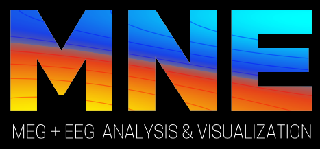
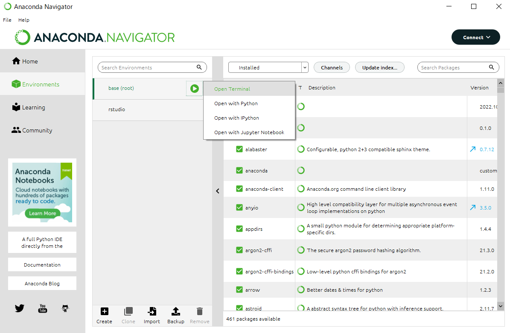
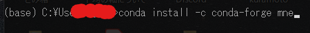
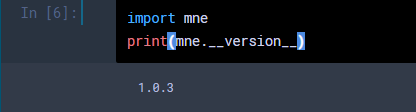

---
html:
  embed_local_images: false
  embed_svg: true
  offline: false
  toc: true

print_background: false
export_on_save:
  html: true

toc:
  depth_from: 1
  depth_to: 6
  ordered: false
---

<div class="header">
  <table class="fixed-table">
    <thead>
      <tr>
        <th class="mokuji">目次</th>
        <th><details><summary> Math </summary><ul class="gnav"><details><summary>基礎数学編</summary>
        <ul class="index">
        <li><a href="../../Math/Basic/basic.html">ホーム</a></li> 
        <li><a href="../../Math/Basic/multiplication.html">掛け算</a></li>     
        <li><a href="../../Math/Basic/trigonometric.html">三角関数</a></li>
        <li><a href="../../Math/Basic/complex.html">複素数</a></li>
        <li><a href="../../Math/Basic/calculus.html">微分・積分</a></li>
        <li><a href="../../Math/Basic/linear_algebra.html">線形代数</a></li>
        <li><a href="../../Math/Basic/statistics.html">基礎統計</a></li>
        </ul></details>
        <ul class="gnav"><details><summary>信号処理編</summary>
        <ul class="index">
        <li><a href="../../Math/Analysis/Analysis.html">ホーム</a></li> 
        <li><a href="../../Math/Analysis/fourier.html">フーリエ変換</a></li>
        <li><a href="../../Math/Analysis/wavelet.html">wavelet変換</a></li>
        <li><a href="../../Math/Analysis/hilbert.html">ヒルベルト変換</a></li>
        <li><a href="../../Math/Analysis/eeg.html">基本の脳波解析</a></li> <li><a href="../../Math/Analysis/phase_analysis.html">位相同期解析</a></li>
        </ul></details>
        <ul class="gnav"><details><summary>統計編</summary>
        <ul class="index">
        <li><a href="../../Math/Statistics/Statistic.html">ホーム</a></li> 
        <li><a href="../../Math/Statistics/distribution.html">確率分布</a></li>
        <li><a href="../../Math/Statistics/central_limit_theorem.html">大数の法則と中心極限定理</a></li>
        <li><a href="../../Math/Statistics/statistic.html">統計量と標本分布</a></li>                                                         <li><a href="../../Math/Statistics/test.html">統計的検定</a></li>
        <li><a href="../../Math/Statistics/anova.html">分散分析</a></li>
        <li><a href="../../Math/Statistics/logistic_regression.html">ロジスティック回帰</a></li>
        </ul></details>
        <ul class="gnav"><details><summary>その他</summary>
        <ul class="index">
        <li><a href="../../Math/Others/Others.html">ホーム</a></li> 
        <li><a href="../../Math/Others/ICA.html">独立成分分析</a></li> 
        <li><a href="../../Math/Others/CCA.html">正準相関分析</a></li>
        <li><a href="../../Math/Others/lagrange.html">ラグランジュの未定乗数法</a></li>
        <li><a href="../../Math/Others/Entropy.html">エントロピーと分布間距離</a></li>
        <li><a href="../../Math/Others/signal_detection.html">信号検出理論</a></li>
        </ul></details>
        </details></th>
        <th><details><summary> Analysis </summary>
        <ul class="gnav"><details><summary>EEGLAB</summary>
        <ul class="index">       
        <li><a href="../../Analysis/eeglab/eeglab.html">ホーム</a></li>                           <li><a href="../../Analysis/eeglab/setup.html">環境構築</a></li>
        <li><a href="../../Analysis/eeglab/import.html">データのインポート</a></li>
        <li><a href="../../Analysis/eeglab/prepro1.html">基本的な下処理</a></li>
        <li><a href="../../Analysis/eeglab/prepro2.html">発展的な下処理</a></li>
        <li><a href="../../Analysis/eeglab/analysis1.html">単被験者での解析</a></li>
        <li><a href="../../Analysis/eeglab/analysis2.html">被験者群での解析</a></li>
        </ul></details>
        <ul class="gnav"><details><summary>MNE-python</summary>
        <ul class="index">
        <li><a href="../../Analysis/MNE/MNE.html">ホーム</a></li>
        <li><a href="../../Analysis/MNE/import.html">データのロード</a></li>
        <li><a href="../../Analysis/MNE/preprocessing.html">前処理</a></li>
        </ul> </details></details></th>
        <th><details><summary> Experiment </summary>
        <ul class="gnav">       </ul> </details></th>
        <th><details><summary> Simulations </summary>
        <ul class="gnav"><details><summary>環境構築</summary>
        <ul class="index">
         <li><a href="../../Simulation/Setup/Setup.html">ホーム</a></li>
        <li><a href="../../Simulation/Setup/environment.html">Python環境構築</a></li>
        <li><a href="../../Simulation/Setup/gpu.html">pythonでのGPUセットアップ</a></li>
        <li><a href="../../Simulation/Setup/jupyter.html">Jupyterセットアップ</a></li>
        <li><a href="../../Simulation/Setup/julia.html">Juliaセットアップ</a></li>
        </ul></details>
        <ul class="gnav"><details><summary>非線形力学</summary>
        <ul class="index">
        <li><a href="../../Simulation/NonlinearDynamics/Nonlinear-dynamics.html">ホーム</a></li>
        <li><a href="../../Simulation/NonlinearDynamics/dynamics.html">力学系とは</a></li>
        <li><a href="../../Simulation/NonlinearDynamics/stability.html">線形安定性解析</a></li>
        <li><a href="../../Simulation/NonlinearDynamics/stability_nonlinear.html">非線形系の安定性解析</a></li>
        </ul></details>
        </details></th>
      </tr>
    </thead>
  </table>
</div>

<h1><span></span>MNE-Python入門</h1>

[MNE-python](https://mne.tools/stable/index.html)はPython上で動く EEG/MEG 解析用ソフトウェアです. EEGLABと違い，CUIベース，つまりプログラムを自分で書いて脳波の解析をします．有料のMATLABを自分で購入する必要なく誰でも使え，かつオープンソースに様々な発展的な解析が行えるので，近年では取って代わりつつあります．

おすすめは，とりあえずEEGLABでボタンポチポチして解析の概要を知ってからの方が分かりやすいですが，そうでなくても大丈夫なほど丁寧にTutorialが創られているので心配無用です．

<center></center>

## 環境構築
既にPython3 on Jupyter notebookがある前提で進めます．これらの[環境構築](../../Simulation/Setup/environment.html)を先に終わらせてください．出来ていれば，

早速AnacondaでMNEをダウンロードしていきます．Terminalを開いて

<center></center>


黒い画面に以下を打ち込みます．
> conda install -c conda-forge mne

<center></center>

しばらくして，問題がなければ
> done

と表示されます．

Jupyter notebookをPythonで立ちあげて，MNEが問題なく呼び出せるか確認しましょう．

<center></center>

versionが表示されればOKです．

### Update
もし，上記のようにCondaのバージョンが低い場合 (2023年9月現在はバージョン1.5が推奨) は，

```
conda update mne
```


などとして推奨のバージョンまでアップデートしておきましょう．チュートリアルのものと関数の仕様などが異なる問題を回避できます．

あるいは，それでも更新できない場合は

```python
pip install -U mne
```

がいいかも．


### MNE-connectivity
デフォルトのMNE-pythonには，現状(ver 1.6)はコネクティビティ解析のメソッドがあまり充実していません．そこで，MNEベースに動くconnectivity用のパッケージである [MNE-Connectivity](https://mne.tools/mne-connectivity/dev/index.html) をインストールします．

Anacondaから

```shell
conda install -c conda-forge mne-connectivity
```

無理だったら
```shell
pip install mne-connectivity
```

とすることでInstallできます．


<div style="text-align: center;">

【[次へ](../../Analysis/MNE/import.html)】

</div>