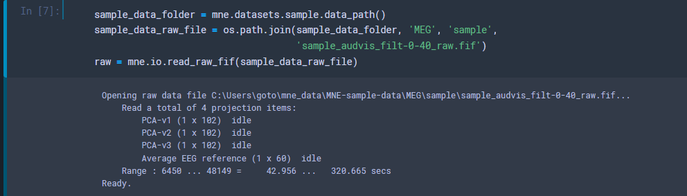
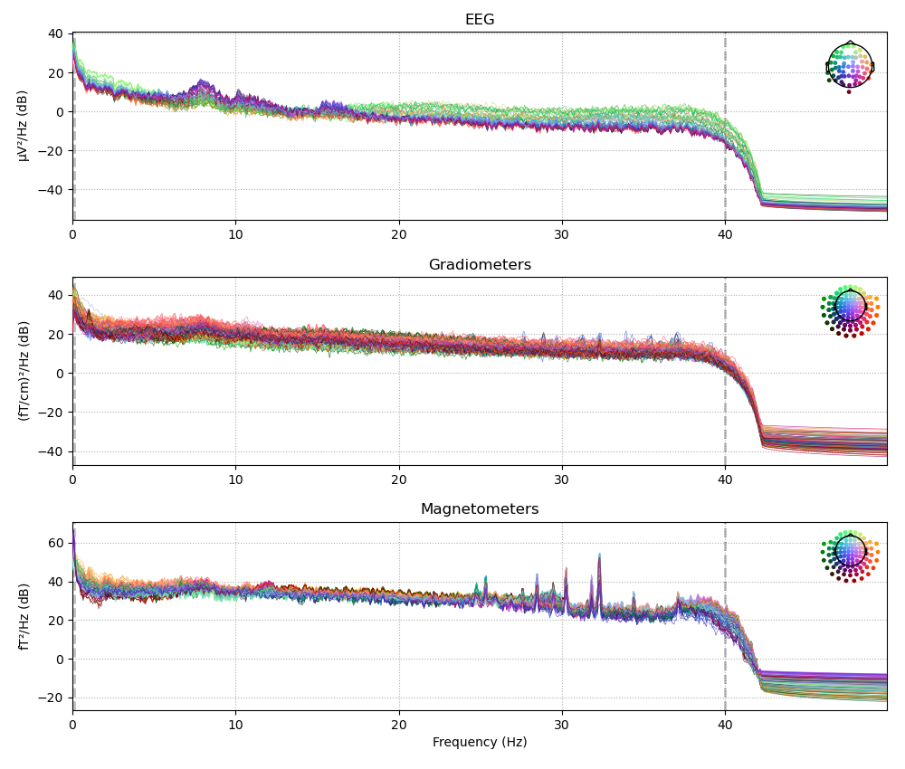
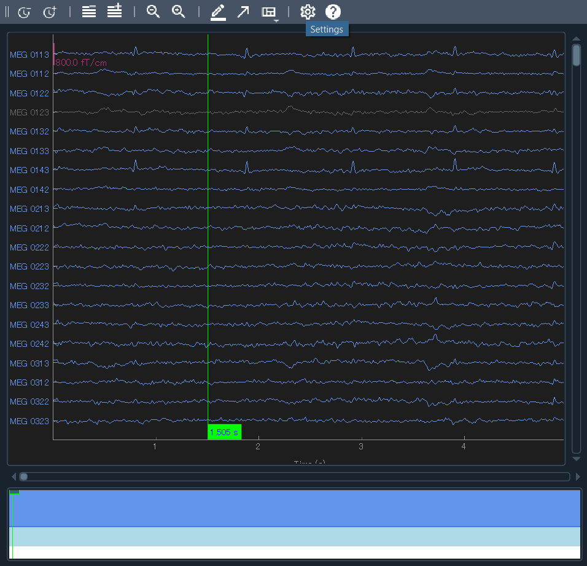
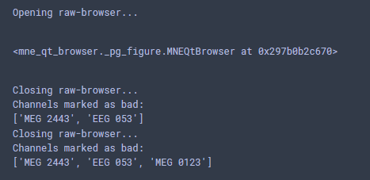

---
html:
  embed_local_images: false
  embed_svg: true
  offline: false
  toc: true

print_background: false

export_on_save:
  html: true
---

<div class="header">
  <table class="fixed-table">
    <thead>
      <tr>
        <th class="mokuji">目次</th>
        <th><details><summary> Math </summary><ul class="gnav"><details><summary>基礎数学編</summary>
        <ul class="index">
        <li><a href="../../Math/Basic/basic.html">ホーム</a></li> 
        <li><a href="../../Math/Basic/multiplication.html">掛け算</a></li>     
        <li><a href="../../Math/Basic/trigonometric.html">三角関数</a></li>
        <li><a href="../../Math/Basic/complex.html">複素数</a></li>
        <li><a href="../../Math/Basic/calculus.html">微分・積分</a></li>
        <li><a href="../../Math/Basic/linear_algebra.html">線形代数</a></li>
        <li><a href="../../Math/Basic/statistics.html">基礎統計</a></li>
        </ul></details>
        <ul class="gnav"><details><summary>信号処理編</summary>
        <ul class="index">
        <li><a href="../../Math/Analysis/Analysis.html">ホーム</a></li> 
        <li><a href="../../Math/Analysis/fourier.html">フーリエ変換</a></li>
        <li><a href="../../Math/Analysis/wavelet.html">wavelet変換</a></li>
        <li><a href="../../Math/Analysis/hilbert.html">ヒルベルト変換</a></li>
        <li><a href="../../Math/Analysis/eeg.html">基本の脳波解析</a></li> <li><a href="../../Math/Analysis/phase_analysis.html">位相同期解析</a></li>
        </ul></details>
        <ul class="gnav"><details><summary>統計編</summary>
        <ul class="index">
        <li><a href="../../Math/Statistics/Statistic.html">ホーム</a></li> 
        <li><a href="../../Math/Statistics/distribution.html">確率分布</a></li>
        <li><a href="../../Math/Statistics/central_limit_theorem.html">大数の法則と中心極限定理</a></li>
        <li><a href="../../Math/Statistics/statistic.html">統計量と標本分布</a></li>                                                         <li><a href="../../Math/Statistics/test.html">統計的検定</a></li>
        <li><a href="../../Math/Statistics/anova.html">分散分析</a></li>
        <li><a href="../../Math/Statistics/logistic_regression.html">ロジスティック回帰</a></li>
        </ul></details>
        <ul class="gnav"><details><summary>その他</summary>
        <ul class="index">
        <li><a href="../../Math/Others/Others.html">ホーム</a></li> 
        <li><a href="../../Math/Others/ICA.html">独立成分分析</a></li> 
        <li><a href="../../Math/Others/CCA.html">正準相関分析</a></li>
        <li><a href="../../Math/Others/lagrange.html">ラグランジュの未定乗数法</a></li>
        <li><a href="../../Math/Others/Entropy.html">エントロピーと分布間距離</a></li>
        <li><a href="../../Math/Others/signal_detection.html">信号検出理論</a></li>
        </ul></details>
        </details></th>
        <th><details><summary> Analysis </summary>
        <ul class="gnav"><details><summary>EEGLAB</summary>
        <ul class="index">       
        <li><a href="../../Analysis/eeglab/eeglab.html">ホーム</a></li>                           <li><a href="../../Analysis/eeglab/setup.html">環境構築</a></li>
        <li><a href="../../Analysis/eeglab/import.html">データのインポート</a></li>
        <li><a href="../../Analysis/eeglab/prepro1.html">基本的な下処理</a></li>
        <li><a href="../../Analysis/eeglab/prepro2.html">発展的な下処理</a></li>
        <li><a href="../../Analysis/eeglab/analysis1.html">単被験者での解析</a></li>
        <li><a href="../../Analysis/eeglab/analysis2.html">被験者群での解析</a></li>
        </ul></details>
        <ul class="gnav"><details><summary>MNE-python</summary>
        <ul class="index">
        <li><a href="../../Analysis/MNE/MNE.html">ホーム</a></li>
        <li><a href="../../Analysis/MNE/import.html">データのロード</a></li>
        <li><a href="../../Analysis/MNE/preprocessing.html">前処理</a></li>
        </ul> </details></details></th>
        <th><details><summary> Experiment </summary>
        <ul class="gnav">       </ul> </details></th>
        <th><details><summary> Simulations </summary>
        <ul class="gnav"><details><summary>環境構築</summary>
        <ul class="index">
         <li><a href="../../Simulation/Setup/Setup.html">ホーム</a></li>
        <li><a href="../../Simulation/Setup/environment.html">Python環境構築</a></li>
        <li><a href="../../Simulation/Setup/gpu.html">pythonでのGPUセットアップ</a></li>
        <li><a href="../../Simulation/Setup/jupyter.html">Jupyterセットアップ</a></li>
        <li><a href="../../Simulation/Setup/julia.html">Juliaセットアップ</a></li>
        </ul></details>
        <ul class="gnav"><details><summary>非線形力学</summary>
        <ul class="index">
        <li><a href="../../Simulation/NonlinearDynamics/Nonlinear-dynamics.html">ホーム</a></li>
        <li><a href="../../Simulation/NonlinearDynamics/dynamics.html">力学系とは</a></li>
        <li><a href="../../Simulation/NonlinearDynamics/stability.html">線形安定性解析</a></li>
        <li><a href="../../Simulation/NonlinearDynamics/stability_nonlinear.html">非線形系の安定性解析</a></li>
        </ul></details>
        </details></th>
      </tr>
    </thead>
  </table>
</div>


<h1><span></span>データのロード</h1>

まずは解析するためのデータを読み込んで行きます．

今回のコードは[こちら](./MNE-newbie.ipynb)．

<!-- @import "[TOC]" {cmd="toc" depthFrom=2 depthTo=4 orderedList=false} -->

<!-- code_chunk_output -->

- [とりあえずチュートリアル](#とりあえずチュートリアル)

<!-- /code_chunk_output -->

## とりあえずチュートリアル
MNE-pythonは丁寧なチュートリアルを用意してくれているので，まずはそれに従って進めていきます．

はじめに，サンプルデータを読み込んできます．

```python
import mne
import os

sample_data_folder = mne.datasets.sample.data_path()
sample_data_raw_file = os.path.join(sample_data_folder, 'MEG', 'sample','sample_audvis_filt-0-40_raw.fif')
raw = mne.io.read_raw_fif(sample_data_raw_file)
```
<center></center>

読み込めました．初回は結構時間がかかるかもしれません．

1行目では `sample_data_folder`にMNE公式が用意しているデータセットがダウンロードされます．自分の場合は
> C/Users/hoge

直下に`mne_data`というフォルダが作られました．いろんなデータが入っています．

2行目で，そのうち`sample_audvis_filt-0-40_raw.fif`というファイルを指定して，`sample_data_raw_file`に格納しています．これは `sample_audvis_raw.fif` というファイルに対して40Hzでローパスフィルタをかけてくれた後のデータです．計算量など削減のため，とりあえずここではフィルタ済みを使っていきます．

3行目で，指定したファイルを読み込んでいます．ここの関数はデータ構造によって異なります．今回はMEGのfifフォーマットを使っているので，対応した関数です．他に対応しているデータフォーマットは[こちら](https://mne.tools/stable/overview/implementation.html#data-formats) で確認できます．

さて，まずはどんなデータなのかを見てみます．

<center></center>

吐き出させると，色々書いてありました．

- bads: これはノイジーな電極番号とか...?
- ch_names: そのまんまぽい
- chs: 各電極の数
...

など．フィルター情報なども書かれています．これ便利そう．僕とかはファイル名てきとうにつけてしまうせいで，今見ているファイルがどこまで下処理したものなのか分からなくなることがあります．管理してもらえるのは助かる．


次に，ビルトインの関数でPower Spectral Densityを計算して出力させます．
引数では，50Hzまでの周波数 (そもそもフィルタで40までになってるが) を，badチャンネルを除いて表示するように指定しています．

```python
fig = raw.plot_psd(fmax=50, picks="data", exclude="bads")
fig.savefig('../figures/psd_plot.png')  # PNG形式で保存。必要に応じてファイル名や拡張子を変更
```


<center></center>

簡単になんかかっこいいの出ました．うーん，脳波見た感じ，後頭にα波が乗っていますね！他は特に感想ないです．まあ刺激とか無視してこれだけ見てもね，という話ですね．カラーリングはよく分からないですが，デフォルトでやってくれているようですね．


次に，波形を見てみます．

```python
raw.plot(duration=5)
```

5秒間の波形を全ch分表示します．`n_channels=xx`を指定すると，一部の表示が出来るというようなのがtutorialには書かれていましたけど自分のとこだとなんか上手くいきませんでした．

<center></center>

別ウィンドウで開かれたのがこんな感じ．クリックやスクロールができます．試しに一個(MEG 0123)をクリックして閉じてみると...

<center></center>

今クリックした`MEG0123`chがbadチャンネルとして登録されてました．危ない．やり直して消しました．こんな風に目視除去というかラベル付けができるようです．

ともかく，現時点でも所感としてはお手軽にオシャレ脳活動図になりそう．すくなくともEEGLABよりは可愛いですね．

<footer>

【[前処理](./preprocessing.html)】

</footer>