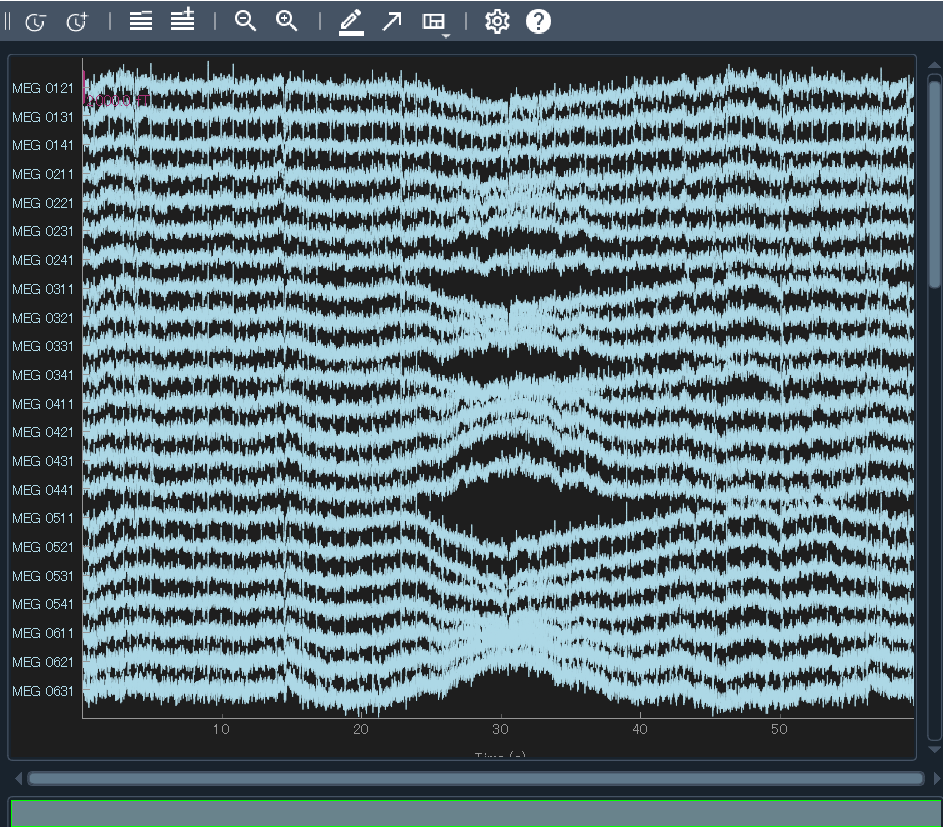

# 脳波の前処理
計測された脳波は信じられないレベルのノイズに埋もれていて，これだけで情報を読み取るのは熟練の麻酔科医くらいでしょう．臨床での単純な信号ならともかく，研究用途の解析をしたいならまずはノイズをどうにかしないことには何も始まりません．よって，何よりもまずはノイズ除去をする必要があります．それが終わった後，実際の解析に向けて (場合によって) データを整形したりする作業が入ります．このページではそれらをまとめて前処理と呼称し，その必要性と内容についてまとめて紹介します．詳述が必要な場合は別ページを切って説明します．

## ノイズの種類
まず，脳波データに乗っている "ノイズ" とは何のことなのでしょうか．それを理解しないことには実験も出来ないし，解析も解釈も出来ません．計測された脳波や脳磁には，脳活動 (だと我々が信じている) 成分以外にも様々な成分由来の信号が含まれています．

たとえば，
- 電源由来のラインノイズ
- 被験者の体動
- 呼吸や心拍由来
- (適切にシールドされていない場合) ヘッドフォンの信号など，感覚刺激呈示ディスプレイ由来の電気信号や振動
- 近くのエレベーターや携帯電話などの電磁波
- 電極の電気抵抗の変化による信号の変化
- 眼球運動やまばたきによる筋電
- 被験者が唾を飲む時の筋電

などと様々です．環境由来のものから，計測機器によるもの，被験者が生きているが故に出てしまうもの，被験者が気合でどうにかできるもの，色々あります．

生体信号解析においては，これらノイズをいかに排除するかがカギになります．いくつかの典型的なノイズパターンを詳述します．

### 低周波ドリフト

電極の抵抗値の変化などの様々な理由で生じる，信号全体が上下にずれていく "ノイズ" です．視覚的にも非常に分かりやすいです．これを未然に防ぐためには

1. 脳波電極にジェルなどを塗布している場合，乾かないようにする
2. 1 が十分満たされる実験の持続時間を予め計算して実験設計をする
3. 実験参加者には極力動かないよう (脳波が欲しい時間窓の間は) にお願いする

などがあるでしょう．

### 電源ノイズ
ラインノイズ，交流ノイズ，ハムノイズなどとも言います．電源経由のノイズ，というか交流電源の周波数です．地域によって 50 Hz, 60 Hz がありますが，いずれもそのままだとデータに強く乗ってしまいます．これを除去しないと 「50/60 Hz に非常に強い脳波が！」なんて恥ずかしい発表をすることになります．この発言の時点で，経験者は皆何があったのかを察します．未然に防ぐことはできません．除去しましょう．もっとも，これほどの高周波は脳波だとそもそもあまり信用できない信号なのでどうでもいい，という見方もあります．

### 心拍
心電図が病院や健康診断の際にも雑に貼った電極で，うるさい環境でもはっきりと計測できるのは皆さんご存じの通りです．心臓はそれだけ強い信号なのに対し，脳波は非常に繊細な信号で，脳波計や MEG はそれを頑張って拾うように敏感に設計されています．ですので，心拍は非常に大きな信号として脳波データにも乗ってしまいます．これまた除去が必要で，未然に防ぐことは難しいでしょう．脳波だとあまり乗らないですが，MEG だとクリティカルです．消す方法として， [ICA](#独立成分分析) が主流でしょう．

### 眼球運動
眼球運動，および瞬きも脳波の天敵 ~(おもちゃ脳波計で製品を作っている人には天使)~ です．脳波が $\mu v$ なのに対し，眼球の筋電は $mv$ です．これだけで，どれだけ邪魔かが分かるかと思います．未然に防ぐには，実験参加者の目をくりぬくしかありません．そのため，多くの研究現場では脳波を測る際に同時に眼電計測用の電極を目の周りに貼っておき，その信号を使って [ICA](#独立成分分析) や脳波データから眼球関連成分を引き算する前処理が行われています．他にも，

- 視覚刺激を用いる場合 (聴覚だけの場合なども可能であれば)，画面に注視点を用意し，なるべくそこを見させる
- 頭部が動くと自動で眼球も動きます．実験中は頭部を固定できるように顎台などを利用する
- それでも動いてしまうときのためにアイトラッカーを併用する

などが考えられます．

### その他の筋電
あらゆる筋肉の動きが脳波計測の敵になります．眼電の時点で分かるかと思いますが，それ以外にも首はほぼ筋肉ですし，その先には腕や背中のでかい筋肉がついています．また仮に発話タスクや表情変化のあるタスクなんてやった日には，顔面の異常に密集 & 複雑な筋肉群からノイズの雪崩が来ます．実験デザインの際には，いかに実験参加者に不必要な筋活動をおこさせないかが重要です．

- リラックスできる，背もたれのある椅子 (キャスターでずれたりしない) に座らせる
- 試行間で任意の休みを取れるようにし，瞬きや小さな姿勢変化，くしゃみなどはそのタイミングでやれるようにする
- 顎台で頭部を固定し，首の筋肉を働かせない
- 心理物理実験の回答は最小限の運動で達成できるように (筆記ではなくボタン押し，しかもノールックで指一本で出来るように，など)

が基本となります．

### その他の電子機器
計測環境のそばに電子機器は置かないようにしましょう．敵です．

- 研究室にお金があれば，電磁シールドをしっかりと使いましょう．
- 刺激呈示/記録用 PC はシールドルームの外 (あるいは遠く) に置き，そこから信号漏れにケアしたケーブルを用いて内部のモニタや刺激呈示装置を制御する
- 実験参加者からスマホは没収し，離しておく
- シールドがないのであれば，実験者は離れ，なるべく電子機器を近くで使用しない

などの工夫ができます．

## ノイズとの向き合い方
上記の tips に気を付けたところで，ノイズは乗ります．ノイズとの向き合い方は大きく3つです．即ち
  
- 無視する
- ノイズが含まれる部分を消す
- 修正する

です．無視は分かりやすいですね．そのままです．愚かに見えるかもしれませんが，リアルタイム性が最重視されるような状況では唯一の方法になる場合もあります．

2つ目，ノイズが含まれる部分を消すのは，初心者がやる最初のノイズ除去ステップです．ただし問題は，これによって多くのデータが排除された結果，まともに解析に使えるデータが少なくなってしまう事態が生じることです．

よって，一般には 3 つ目，ノイズだけを除去して clean な信号に"修正する"作業が求められます．ここに職人技を見るわけです．

オーソドックスな方法として，各種フィルター，独立成分分析などがあります．が，そういったなかば自動化された方法に移る前に，まずは明らかな部分 (極端な話，被験者が寝てしまったり，しゃっくりを起こしたり，くしゃみが止まらなかったりしたタイミング) を消してあげるのも大事です．

## 主なノイズ除去手法
### バッドデータや不必要なデータの除去
使えないデータを削除する手段です．EEG 解析では「データの質を保つためにどこを捨てるか」が重要です．これ以降で紹介する手法を適用するにしても，多くは「全体の傾向から考えてこれは変だ」というような成分を特定しにいきます．ですので，このステップを先にやっておくことは重要です．

**バッドチャンネル除去**は，特定の電極からの信号がノイズに埋もれていたり接触不良で異常値を出している場合に行います．空間的に他の電極とまったく異なる振る舞いをしていたり，常に高い抵抗を示したり，やたら大きな振幅を示すチャンネルが対象になります．解析の前に除去・補間することで，誤った成分が [ICA](#独立成分分析) や平均化に影響するのを防ぎます。

**バッドエポック/トライアル除去**は, 刺激ごとに切り出した短時間のデータ（エポック）の中に，大きなアーティファクト（瞬き，筋電，体動など）が含まれている場合に行います．残すと条件間比較の平均に歪みを生むため，基準を決めて除去しておく必要があります．あるいは脳波だけでなく行動指標などから，「反応時間が極端に外れ値だった＝寝ていた...？」や意図しない回答・挙動が見られた場合のデータなどもこの時点で削除しておきます．詳しくは後ほど，エポッキングのところで．

安静時データの場合でも，刺激ごとに切り出すようなことはせずとも大きな体動が乗っていたり寝ていたり，そういった明らかにおかしな時間があればその期間はまるごと削除することが多々あります．

ただ，バッドデータの除去は解析に扱えるデータが減ることを意味します．トレードオフであることを意識し，適度な閾値を設けることが必要です．

Tips

- 削りすぎ注意．じゃがいもの皮むき & 芽取りみたいなもの
- 酷すぎる場合は先に削っておかないと以降の前処理にも影響する
- とはいえ，以降の前処理によって十分復活できるものもある

### 周波数フィルター
周波数フィルタリングは, EEG 信号から「不要な周波数の成分」を取り除いたり、「関心のある周波数帯だけを残す」ための処理です. 脳波は数 Hz ～ 数十 Hz の振動が重要ですが, 確認したように測定には電源ノイズや筋活動など多様な雑音が混じります, フィルタを使うことで, 解析対象に適した周波数成分に信号を整えられます. 周波数とは何か，はさすがに大丈夫だと思いますが，怪しい人はこっそり[三角関数](../../Math/Basic/2trigonometric.html)を見に行ってみてください．数学的には，フィルタリングには[フーリエ変換](../../Math/Analysis/fourier.html)や[ウェーブレット変換](../../Math/Analysis/wavelet.html)が用いられます．

周波数フィルターは大きく 2 種類あります．

**ノッチフィルタ**は, ある特定の周波数だけを取り除くフィルタです. EEG では特に電源ノイズの周波数をピンポイントで除去するのに使われます. 信号全体には大きな影響を与えず、電源由来の成分だけを抑えることが目的です．ただし注意点として，その結果本来存在していたとしても，同じ周波数の脳波は見れなくなります．注意点としては，電源周波数の 50, 60 Hz だけでなく，その倍数，高調波もケアして100/120 Hz なども消しておくのが得策です．

**バンドパスフィルタ**は、ある範囲（バンド）の周波数成分だけを残す (パス) フィルタです．たとえば 1–40 Hz に設定すると、低周波のドリフトや高周波の筋電をカットし, 典型的な脳波成分（デルタ～ガンマ帯域）に集中できます．解析目的によってはさらに狭いバンド（例：注意を見たいから 8–12 Hz のアルファ帯だけで良いや）を抽出することもあり，脳波律動の研究で最も基本的な手法となっています．また，特定の閾値以上や以下をパスさせる**ハイパス・ローパスフィルタ**もあります．バンドパスフィルタは，低周波を消したいハイパスと高周波を消したいローパスを同時適用するフィルタ，と考えるのが正確なところでしょう．

工夫すればそれ程重かったり時間がかかったりする計算でもないため，簡易脳波計を使ったコンテンツでも最低限これだけは適用されていることが多いように思われます．色々と複雑なので手法の詳細，注意点は別ページ ([周波数フィルタリング](./filter.html)) にまとめます．

Tips

- ノッチフィルタは高調波も考慮しておく
- バンドパスフィルタは a–b Hz で指定した場合, a 以下や b 以上の周波数成分は 0 にはならず少し漏れる

### 独立成分分析

独立成分分析（ICA）は, 多数の信号が混ざり合ったデータから「もとの独立した成分」を推定する方法です. たとえば EEG では、電極ごとに頭皮上の信号が測定されますが, その中には脳活動だけでなく, 上記で確認したように瞬きや筋電など複数の要素が混ざっています. ICA は「これらは互いに統計的に独立しているはずだ」という仮定を使い, 混ざり合った観測データ (脳波のこと) を分離します.

数学的な説明は[ICAの数学](../../Math/Others/ICA.html)，EEG/MEG の場合の詳細は[ICA (実践編)](./ICA.html) にありますので，ここでは難しい式を使わずに言うと，データの中から「なるべく独立して変動するパターン」を見つけ出し，それを成分として別個に取り出すイメージです．

EEG 解析でよく使われるのは、まばたきや心電などの "ノイズ" 成分を ICA で抽出し、それらを除去して「脳由来の成分」に集中する方法です．具体的には，一度独立成分に分解した後，「脳由来ではなさそうな成分」を捨てて「脳由来の成分」だけを戻して信号を再構成します．つまり ICA は, 脳波をきれいにして解析を正確にするために利用されます.

簡単に言えば, 計測された多チャンネルの信号を独立した信号の集団に分解して，その中で怪しいやつら (眼電や筋電ぽいものなど) を排除していきます．

簡易脳波計では無理です．まず，計測信号の次元が少なすぎるので分解できる成分が少ないこと，それから重い計算が必要になるので簡易脳波計を使いたい＝リアルタイム・簡便性を重視する方針と相性が悪いためです．

Tips

- 分解できるのは電極数と同じ成分数まで (1 電極の場合，無力)
- 分解後の成分のうち，どれが脳波でどれが脳波以外かの判断は恣意性がある
- 判断基準は自動化されたものもあるが，一長一短．詳しくは [EEGLAB版](../eeglab/3prepro1.md)や [MNE-Python版](../MNE/3preprocessing.html)参照

## データの整形
ノイズ除去がある程度済んだら，次はデータ解析のための準備が始まります．

### エポッキング
安静時脳波の計測実験でもない限り，基本的には脳波研究で行う実験はなんらかのタスクを数十から数百試行実験参加者に行ってもらうものになっていると思います．これらの試行に共通する脳活動をなんらかの方法で抽出して議論するのが脳波解析の主な目的です．

脳波データは実験中常に計測しているため，休憩時間やタスク間の時間といった，解析には利用しないデータも多く含まれています．なので課題に関係のある部分だけを切り出す必要があり，この切り出したセグメントをエポックと言います．基本的に，刺激開始 (onset) のタイミングを $0$ ms とし，その前後で解析に必要な窓だけを切り出し，休憩中などの不要な部分は捨てます．これによりデータ量を削減し，かつ解析に備えます．

Tips

- 次のベースライン補正に備えて刺激前後の広めの窓を取っておく
- ベースライン，刺激呈示，感覚処理，回答までの一連が収まる長さ
- かつ，見たい周波数帯域のナイキスト周波数も考慮

### ベースライン補正
脳波は計測中，常に頭皮との接触部位で若干ずつ抵抗が変化したりすることで，何もしていなくても値がゆるやかに変化します．その変化とタスク由来の変化を区別するため，それぞれのエポックではタスク直前の数 100 ms~ 数 1000 ms の時間で平均を取り，これをベースラインとしてエポック全体から引く操作がよく行われます．こうすることで，タスク前の脳波からの変化分だけが残るため，エポック間での脳波を比較することが出来るようになるわけです．これをしないと，「課題後半にいくにつれて脳波が強くなってきた．きっとやる気が反映されている！」というような珍発言をすることになります．

注意点として，実験デザインの時から，ここを上手く組み込んでおく必要があります．ベースライン時間は脳活動に変化があってはいけないので，たとえば注視点の画面に切り替わるのが -1500 ms のタイミングだったとしたら，ベースラインに -1500 から 0 を使ってしまうと注視点呈示による ERP がベースラインに乗ってしまいよろしくありません．この場合はたとえば -1000 からとかにしましょう．また，[周波数解析](./frequency.html)や[時間周波数解析](./time_frequency.html)，[位相解析](./ITPC.html)などの，周波数が関わる解析をする際にも要注意です．たとえば 1 Hz の信号は 1 秒に 1 周期という意味です．なのにベースラインが 500 ms しかないとかだと，まともに解析が出来ません．

ベースラインで補正していようと，ノイズまみれで使えない試行はやはり存在します．脳波に比べて筋電は圧倒的に大きな振幅をもった信号であることや，電極が動くことで生じた抵抗の変化による電圧 (計測脳波) への影響などによって，タスク中に被験者がまばたきをしたり体を動かしたりしてしまった試行は汚くなってしまいがちです．こうした試行は，解析しようにも脳波がノイズに埋もれてしまっているので意味をなさなく，むしろ試行で平均化してしまう脳波解析においては害悪でしかありません．よってそうした汚い[エポックを除外](#バッドデータや不必要なデータの除去)しておく必要があります．

Tips

- ナイキスト周波数を考慮し，見たい周波数にあった適切なベースライン長が必要
- ベースラインは「ベース」であること（刺激前の状態によって課題成績が変わる，などの議論は要注意）
- 上記２点を意識した実験デザインを最初からやっておくこと

### CSD変換

### 活動源推定