# 環境構築

## MATLABのダウンロード
MATLAB は MathWorks 社が開発している数値解析ソフトウェア，およびそこで使用されるプログラミング言語です．行列の扱いなどに優れていて，神経科学に限らず科学研究においてデータ解析によく用いられます．我々の扱う脳波や MRI 画像も行列データであるため，その解析に一般に用いられます．

難点は，有料（めっちゃ高い）なことです．こればかりはなんとも...学生ならまだ多少安いですが，一般で購入すると笑えないくらいの額です．ただ読者の多くは所属している機関がライセンス契約をしていると思うので，自腹で買う必要はありません．

ライセンスが提供されている人は所属機関のアナウンスに従って MATLAB のダウンロードをしてください．

ない人は以下の手順に従います．

### ダウンロード

[こちら](https://jp.mathworks.com/products/get-matlab.html?s_tid=gn_getml)の公式ページからダウンロードをします．

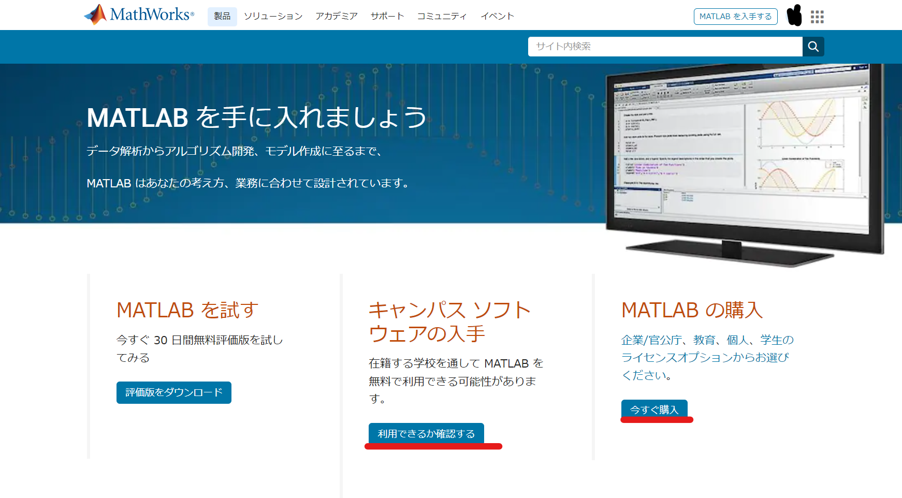

キャンパスソフトウェア，使えると良いですね...自分は使えなかったので自腹でした．

適切なものを選んで手順を進め，購入，ダウンロードしてください．

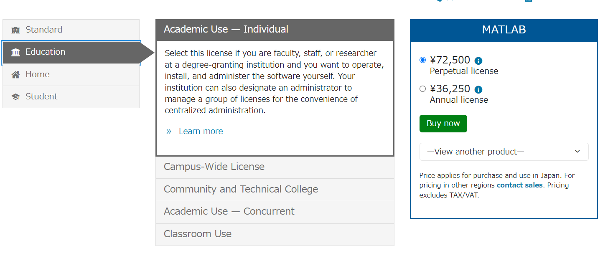

購入/ダウンロードの際，Toolbox の選択をする画面があると思いますが，そこでは基本デフォルトで推奨されているものだけで大丈夫だと思います．Signal Processing Toolbox にチェックが入っていることを確認してください．

また，必須ではないですけど Statistics and Machine learning だったか，そんな名前の Toolbox も入ってると楽だと思います．

無事に購入が出来たら，適切な場所 (C://program files/MATLAB) とかが無難，にダウンロードしてください．完了したら起動してみましょう．

### 画面の確認

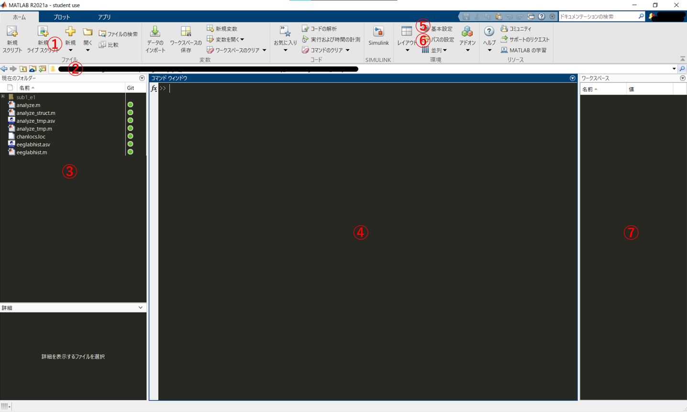

色や配置はちょっと違うと思いますが，だいたい似た画面が出れば成功です．初回起動だと ④ のところになんか "Hello!" みたいなのが表示されているかも知れません．忘れました．

画面の説明です．まず
① はプログラムを書くファイルを新しく作ったり，前に作ったファイルを開いたりするメニューです．ライブスクリプトについてはとりあえず保留．便利だけど必須ではないです．次．

② は現在作業しているディレクトリです．ディレクトリが何かというと，PC の画面でファイルマークみたいなやつを使って「A フォルダの中の B フォルダの中のCという word ファイルを開く」とかいつもやっていますよね．そこでいう A にいるのか B にいるのかを表してます．

③ が，そのディレクトリ内に格納されているファイルの一覧です．薄い灰色になってるのは一個下の階層のディレクトリで，そこをクリックする事でディレクトリの移動が可能です．白文字になっているようなファイル (.mat/.m形式) のファイルをクリックすると右側の画面に開かれます．.m は MATLAB スクリプトファイルで，.mat は MATLAB が扱っている，変数を記録したファイルのようなものです．あとで確認します．

④ はコマンドウィンドウです．Terminal 的な奴．MATLAB にプログラムファイルを通さず直接命令する時に使います．もう少し詳しくいうと，.m ファイルというのはこのコマンドウィンドウに対する命令を小出しにせず一つにまとめたファイルだと考えて ＯＫ です．なのでちょっとした作業はここで行い，壮大な作業だったり保管しておきたい作業は .m 形式にするって使い方で考えておきましょう．

⑤ は MATLAB の設定をいじるやつ．筆者のみたいにかっこいい色とか配置にしたかったら色々いじってみてください．

⑥ パスの設定．あとで出てきますが重要です．説明後述．

## EEGLABのダウンロード

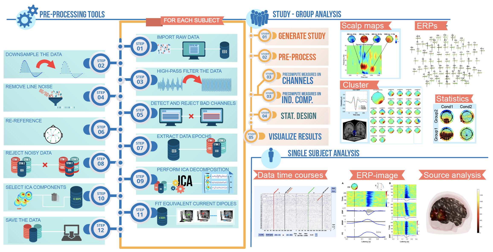

[EEGLAB](http://sccn.ucsd.edu/eeglab/) は MATLAB 上で動く EEG 解析用ソフトウェア，toolbox です. GUI ベース，つまりプログラムを自分で書くことなくボタンをポチポチしてるだけで脳波の解析をすることができます．まずこいつを使って脳波解析の流れに触れていきましょう．

[こちら](https://sccn.ucsd.edu/eeglab/downloadtoolbox.php)から最新 version をダウンロードしてください.

ダウンロードしたら，解凍して保存します．保存先は MATLAB をいれたディレクトリの下，toolbox ディレクトリの中です．

> C://Program Files/MATLAB/R####/toolbox

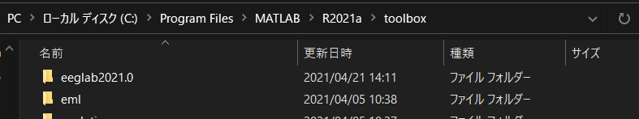

ここでディレクトリ構造を壊さないように気を付けてください．eeglab フォルダの中身をばらまくのではなく，フォルダそのものをここに入れるように注意してください．

ここまで出来たら，MATLAB を起動します．

## EEGLABのpathを通す
さて，EEGLAB はダウンロードしただけだと残念ながら使用できません．たくさんの関数が格納されているのですが，その関数，「命令」を MATLAB に覚えさせるためにはパスを通す必要があります．たとえば

> disp('hoge')

と MATLAB のコマンドウィンドウに打ち込むと，

> hoge

と表示されます．これは disp という関数が，「()内の文字を表示しろ」という命令として MATLAB に登録されているからです．というふうに，EEGLAB に入っている命令を MATLAB に新しく登録する必要があり，それがパスを通すという作業です．

さっそくやっていきます．

この画像に戻ります．

⑥のパスの設定，先程説明を省いたこの項目でそれを行います．クリックしましょう．

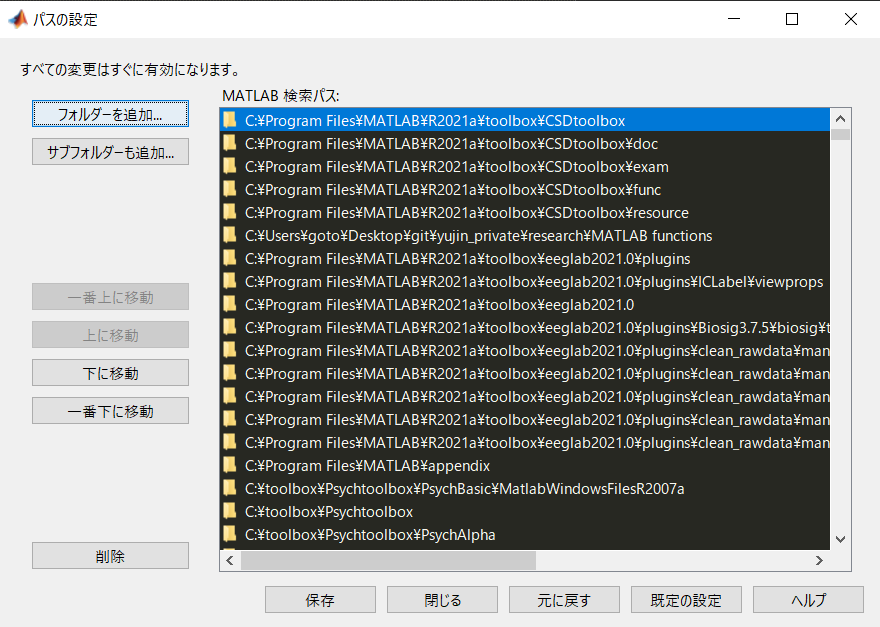

こんな画面が出ると思います．右側に表示されているのが，現在 MATLAB に登録されているパスの一覧です．ここに EEGLAB を追加していきます．

左上のサブフォルダも追加をクリックして，先程ダウンロードした EEGLAB のフォルダを探して選択し，[フォルダの選択] を押してください．右の欄に EEGLAB が追加されたのが確認できたら下のボタンから保存をし，画面を閉じてください．上手くいってれば path が通っているはずです．

MATLAB を再起動して，コマンドウィンドウに

> eeglab

と打って enter を押してみましょう．

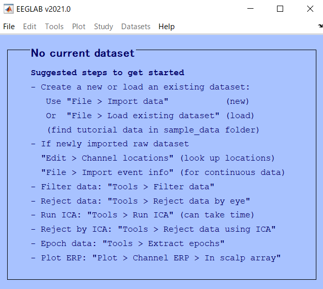

こんな window が表示されればパスの設定は成功です！表示されない場合はパスを上手く通せてないので，もう一度パスの設定をやり直してください．

## 拡張機能
EEGLAB はデフォルトの状態では足りない関数がいくつかあります．関数とはコンピュータに対して出す「命令」で，EEGLAB の青い画面を出すのも，青い画面のボタンを押した時に何かを計算するのも，その結果を画面に表示するのも，全て関数によって命令を送っているからです．

以下では，脳波解析で使いたいのにデフォルトでは入ってない関数を EEGLAB にいれていきます．

### vhdrファイルの読み込み

我々が計測した脳波ファイルの形式，拡張子はいくつかのパターンがあります．そのうち，Brain Vision の計測器を通して記録された脳波データは
- .vhdr
- .vmrk
- .eeg
  
の3つのファイルに分けて記録されます．vhdr はヘッダーファイルで，脳波の電極名やサンプリングレートなどといった情報が記録されています．

eeg が脳波ファイル本体ですが，これは$ 電極 \times タイムポイント$の形の 2 次元配列になっています．どの行がどの電極なのかとかは eeg ファイルを見るだけだと分かりません．そのため vhdr が必要になるわけですね．

vmrk はマーカーファイルです．ここには実験時に我々が出力したトリガー情報が格納されています．

そんな vhdr(&vmrk,eeg) ですが，ダウンロードしてすぐの EEGLAB では読み込むことができません．そこで新たに plugin と呼ばれる関数の集合みたいなものを入れ，読み込めるようにします．[こちら](https://github.com/arnodelorme/bva-io)から，bva-io plugin をダウンロードしてください．

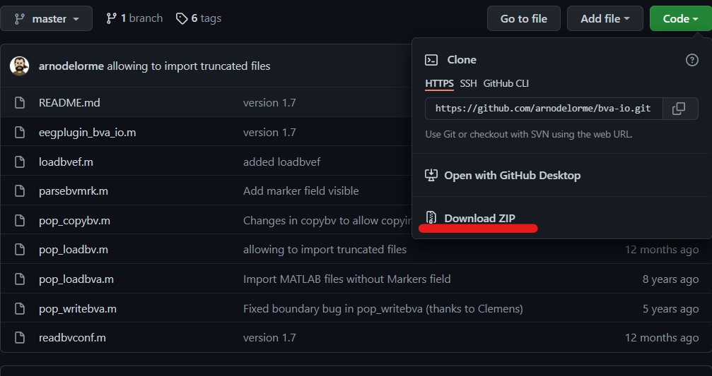

zip をダウンロードしたら，解凍して中身を移動させます．EEGLAB があるフォルダ (指示通りにやっていれば，画像と同じような場所だと思います) を探して，

> eeglabXXXX.X/plugins

というフォルダに，解凍した bva-io-master フォルダを丸ごと移動させます．画像だと他にもいくつか入ってると思いますがとりあえず無視してください．

eeglab/plugins のなかに bva-io-master が入れば OK です．この時，ディレクトリ構造を崩さないように注意してください．

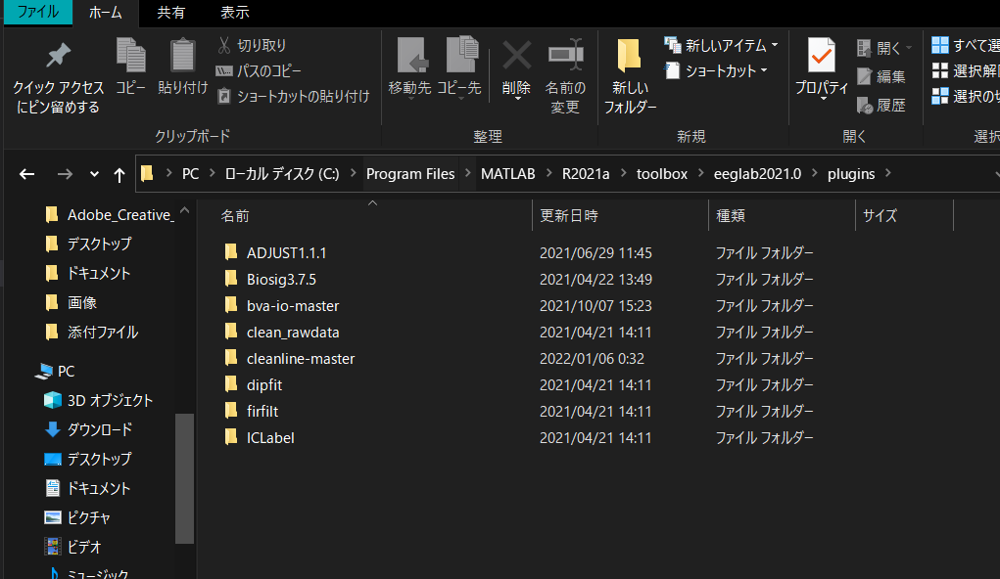

格納が出来たら，今入れた plugin にパスを通します．EEGLAB はMATLAB が操作する関数で，そいつが操作する関数...なので結局，MATLAB 側で呼び出すことができないと plugin を入れても機能を使うことができません．

MATLAB のパス設定画面から，今追加した plugin フォルダ下の bva-io-master を追加してください．

パスの設定ができたら EEGLAB を再起動してみましょう．

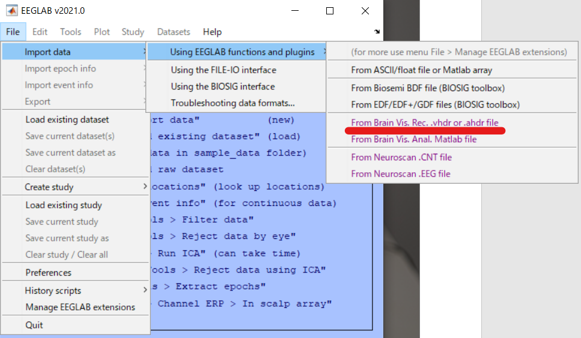

> File -> Import data -> using EEGLAB functions and plugins

に赤線を引いている "From Brain Vis. Rec. .vhdr or .ahdr file" が表示されれば成功です．

### Cleanline
同様に，cleanline plugin もいれておきます．どんなプラグイン，というか何をするやつなのかの詳細はひとまず置いておきます．簡単にいうと，脳波データのノイズ除去に使うやつです．脳波はきっっっったねぇ信号なので，脳波解析の結果の良し悪しはいかにノイズを取り除くかに依存していると言っても過言ではありません．

てことで，そんなノイズ除去関数の一つである cleanline を解放します．[こちら](https://github.com/sccn/cleanline)からダウンロードして，bva-io同様にplugin に入れてパスを通してください．

### ADJUST

これもまあ，ノイズ除去です．[こちら](https://www.nitrc.org/projects/adjust/)からダウンロードしてパスの設定．

### その他
そのほかにも，EEGLAB で解析をやっているうちに欲しいpluginが出てきたり，論文読んでて知らない plugin 使ってるなあ自分もやってみたいなあなんて思ったら，その都度この作業をやってください．

ダウンロードしただけでは使えないので path を通すことを忘れないように．

### 全機能解放

EEGLAB はそこそこ積極的に新しい機能の開発をしているので，最新版になると消されてしまった（別の関数に集約された）機能なんかも存在します．しかし残念ながら，そういった新しい関数の評価が低くて昔の方が良かったなんてことも往々にしてあります．

そこで，最新版では表示してないけど昔は使われていた機能なんかもちゃんとメニューに表示できるように設定をいじります．

> File -> Preference

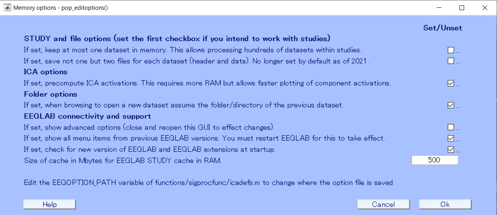

を押して，設定画面を開きます．ここで下から二つ目のチェックボックスにチェックを押してOKを押します．これで機能が解放されます．あとは指示に従って EEGLAB を再起動すると，先程までよりも充実したメニューが見れるようになります．

尚，この操作は別に EEGLAB のバージョンをいじっているわけではないので，解析結果などの挙動が変わってしまう恐れはありません．

次回は脳波データの[読み込み（インポート）](./2import.html)です．