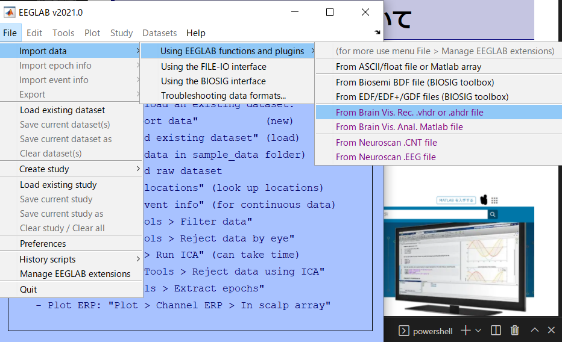
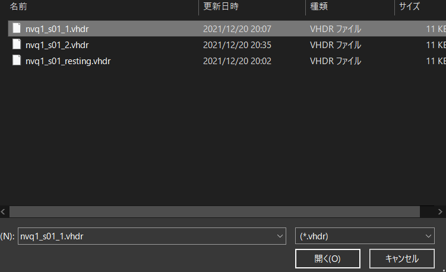
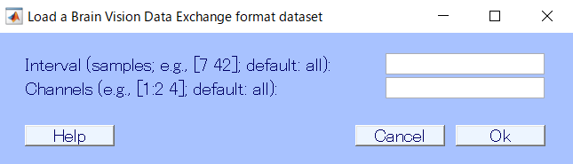
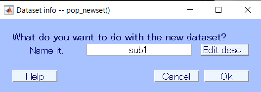
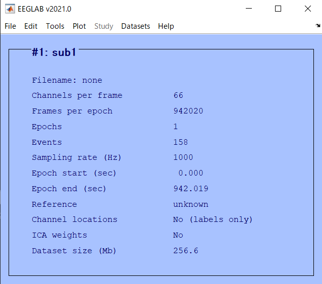
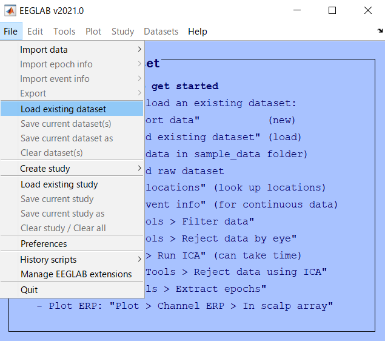
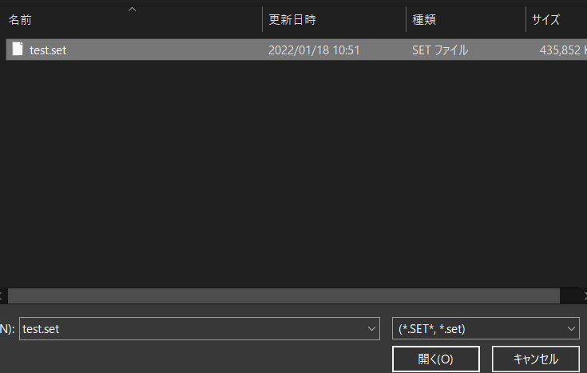

# データのインポート

## 脳波データの拡張子について
脳波データは，計測と記録に使用されたハードおよびソフトウェアによって異なるデータ形式で格納されます．詳しくは調べていませんが，`edf`ファイルだったり`eeg`ファイルだったりです．それぞれimportの仕方が若干違うので注意が必要で，場合によってはそのために別途pluginを引っ張ってくる必要があるので自分のデータ形式に合わせて適宜頑張ってください．

### .vhdrファイル
### .vmrkファイル
### .eegファイル

## インポート
さて，インポートとはデータの読み込みのことです．EEGLAB にこれから解析する脳波データを読み込ませる作業ですね．簡単です.
ここでは，Brain Visionの形式である `.eeg` ファイルを読み込む方法を紹介します．こいつが一番多いんじゃないですかね？

EEGLAB を開いて，

> File -> Import data -> Using EEGLAB functions and plugins -> From Brain Vis. Rec. .vhdr. or .ahdr file

をクリックします．余談ですけど，EEGLAB の UI の嫌なところってこの作業注にカーソルが外れるとメニュー閉じちゃって選びなおしさせられるところなんですよね...ストレスがマッハなので修正してほしいところです．

さて，クリックするとファイルを選択する画面に遷移するはずです．

ここで，読み込みたい `.eeg` ファイルに対応する `.vhdr` ファイルを選択します．

対応する `.eeg .vhdr .vmrk` ファイルはすべて同じ場所に置いて，名前も同じにしておいてください．記録時にデフォルトでそうなっているはずなので，絶対に違う名前にしないように．

`.vhdr` ファイルが選択されたら，同じ名前の `.eeg .vmrk` をEEGLABが読み込みにいきます．名前を変えちゃいけない理由はこれです．

ちゃんとしたデータになっていれば

こんな画面が出てきます．どのチャンネルの脳波データを読み込むかとかなので，通常は何もしなくて良いです．書いてある通り，何も記入しなければ全てのチャンネルの全てのデータを読み込んでくれます．なので空欄のまま ＯＫ を押します．

少し読み込みに時間がかかります

...Now loading...

読み込みが終わるとこんな画面が出てきました．これは，読み込んだデータセットになんて名前をつけるかです．EEGLAB は読み込んだデータを色々といじっていくわけなので途中途中でデータセットとして保存しておくことができます．今回は1人目の被験者の生データなので，sub1 と名付けておきましょうか．OKを押します．

以上の手順で無事に脳波データの読み込みが出来ると，EEGLAB の画面に変化が表れます．先程まではよく分からないことが表示されていたところに，channel の数だとか epoch だとかといった項目が表示されるようになったと思います．これでデータの import は完了です．

## 画面の見方

インポートできた画面の見方を確認しておきましょう．青い部分から見ていきます．

一番上の `#1: sub1` は一つ目の，sub1 という名前のデータセットを読み込んで表示しているという意味です．

- **Filename:**  
これは今読みこんでるファイルの名前です．ファイルといっても，今回読み込んだ `.vhdr` やデータセット `sub1` のことではないので，今は none になっています．ではどんなファイルかというと，EEGLAB で読み込んであれこれ弄ったデータセットを `.set` として保存したものになります．保存の仕方はあとで．

- **Channels per frame:**  
これは読み込まれている電極の数です．眼電や AUX ポートの信号も含んでいるので人によって，実験によって異なります．もしこの数字が明らかにおかしかったりしたらデータがなんかおかしいってことになります．

- **Frames per epoch:**  

エポックと呼ばれる，脳波データのセグメント...うーんブロック毎にどれだけのフレーム，つまりデータ点が含まれているかです．1000 だったら，1000 個のデータ点が記録されていることになります．下に書きますが，今はエポックが 1 個だけになっているので膨大な数字になっていますが，これで ＯＫ です．逆に少なすぎたらおかしいです．
- **Epochs:**  

エポック，脳波データを区切ったセグメントです．脳波の実験をやるときには何試行も課題をやってもらって，その時の脳波を解析するというのが一般的な用途だと思います．この「何試行」をエポックとして切り出して解析するわけですね．今は何もその処理をしてないので 1 個だけ，つまり全データをまとめて一つの塊として扱っています．
- **Events:**  

エポックを切り取るのに使えるトリガーの数です．トリガーは実験プログラム側で何種類も用意することが出来，たとえば刺激呈示，刺激終了，被験者の回答，のそれぞれのタイミングで別個のトリガーを出力させていたとして，それを30トライアルやれば 90 の event がはいることになります．この情報は `.vmrk` にはいっているので，おかしかったら `.vmrk` の確認をしてください．
- **Sampling rate (Hz):**  

脳波がどれだけのサンプリングレートで計測されたかです．これは計測時に決めることなので，ここから上げる事は出来ません．5000 となっていると， 1 秒間に 5000 点の脳波データを計測していることになります．数字が大きい程細かく脳波を測れているので，より高周波の脳波について信頼することが出来るようになります．
- **Epoch start:, Epoch end:**  

エポックを，切り取るときに使用したトリガーの瞬間を基準としてどれだけ前からどれだけ後の時間で切り取っているかです．が，まだ切り取ってないのでここは無視します．
- **Reference:**  

脳波を計測した際にハードウェア側で設定した Reference ではなく，EEGLAB で読み込んでから新たに別の Reference を利用した際に表示されます．今は何もしてないので詳しくは下処理のところで．
- **Channel locations:**  

脳波の電極データはありますが，それぞれの電極が被験者の頭のどの位置に置いてあったのかのデータについてです．`.vhdr` には電極位置の情報はなく，電極名だけが記録されています．よって今は No (labels only) となっていますね．これもあとで読み込みます．
- **ICA weights:**  

説明むずかしいので割愛．下処理の一種です．今は何もしていないのでNo.
- **Dataset size(Mb):** 

読んで文字のごとく，今表示しているデータセットの容量です．まだ何も下処理をしていなく，つまり無駄なデータを多く含んでいるのでめちゃくちゃでかいです．下処理とか進むにつれて減っていきます．  

そのほか，上に表示されているメニューバーはこれから下処理とかやっていくときに触ることにしましょう．

次はいよいよ解析...の前に面倒だけど大事な大事な下処理をやっていきます．

## setファイルの読み込み

下処理の方で確認しますが，ある程度作業が進んだらその時点でのデータを `.set` 形式で保存しておくことができます．

この方法を使って保存したものを，後からもう一度 EEGLAB で読み込みたい場合の操作です．

> File -> Load existing dataset

からファイルを選択します．

これでファイルを選択し，開けば OK．保存した時点でのデータセットが再現されます．

今回で脳波データとイベント情報の読み込みが無事終了したので，次回は解析前の[前処理の仕方]((./3prepro1.html))です．
