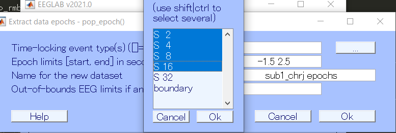
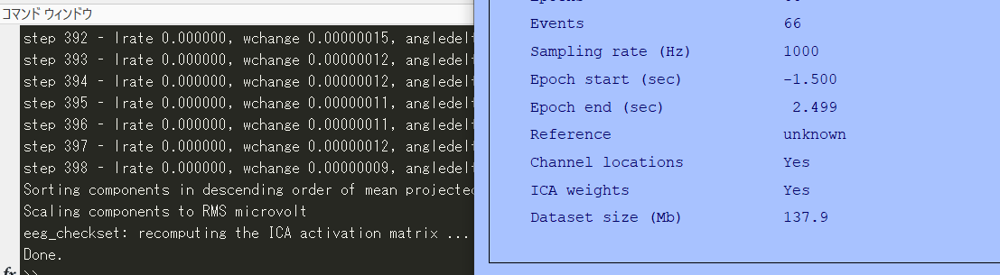

# 基本的な前処理
前処理の必要性については，[脳波データの前処理](../Methods/preprocessing.html) を参照ください．

## リファレンスの再設定
### リファレンスとは

### 全平均
リファレンスの再設定をする場合

全電極の平均をReferenceとして使用する場合

### 特定電極
特定電極の信号をreferenceとして使用する場合

## フィルタリング
### フィルタとは

### eegfilt

## ラインノイズのフィルタ

### Notch filter
[ノッチフィルタ](../Methods/1preprocessing.html#周波数フィルター)でもいいけど

### Cleanline
なんかcleanlineの方が優秀らしい？

色々設定

計算ちう

フィルタしてるだけだし名前はそのままにしよう

### データセットの確認
これはフィルタとは関係ないけどこのタイミングで

クリックで他のデータセットに戻れる

dataset sizeみてみるとめっちゃ減ってる

## 電極位置の読み込み
### 電極位置の必要性
### 電極位置の読み込み
計測した脳波データに対応する電極情報を読み込んでいきます．
> Edit -> Channel locations

をクリックします．

`Look up channel locations?` のウィンドウが開いたら，使用する電極配置のモデルを選択します．デフォルトでは MNI なんとかが選ばれていると思いますが，基本はこれで大丈夫です．そのまま `Ok` を押します．

すると `Edit channel info` のウィンドウが表示されます．これは各チャンネルについて，読み込んだ頭部モデル上でのx,y,z座標や角度などなどの情報の一覧です．いじる必要は基本的にはないはずですが，一応，何も枠が埋まってないチャンネルがないかなどは確認すると良いかもしれません．

reference のチャンネルやAUXポートの信号は当然座標がありませんが，それ以外の普通の EEG channel なら埋められているはずです．

確認が済んだら `Ok` を押してウィンドウを閉じます．また，ここで `Save(other type)` や `Save(as .ced)` を選択することで，使用した脳波計用の location ファイルを出力することもできます．

電極位置の読み込みが無事に終了していれば，メイン画面に戻ったときに `Channel locations` の内容が `No(labels only)` から `Yes` に変わっていると思います．変わっていなければ，何か操作をミスって読み込めてないのでもう一度確認してください．

## 電極の除外

[どうしようもないくらいノイジーな電極は削除](../Methods/1preprocessing.html#バッドデータや不必要なデータの除去)します．目視で削除することもできますが，その基準が恣意的になってしまうことは避けられません．そこで自動で異常な電極を検知して REJECT 判定を出してくれる関数の紹介です．

> Tools -> Automatic channel rejection

を選択します．

`Reject channel` のウィンドウが表示されたら，対象とする電極と除外する基準を選択します．眼電や筋電は脳波に比べたら異質な信号であることは間違いないので対象から外した上で関数にかけます．そのため，たとえば今回筆者が用いたデータだと 66 ch 中最後の 2 ch は眼電だったりと脳波ではないので削って，`1:63`，つまり 1 から 63 の電極のみを対象にしました．

次の除外基準ですが，これは説明にやや統計?の知識が必要になるので省きます．とりあえず Kurtosis で良いと思います．その下の数字もいじらなくていい．結果，電極の数字だけ調整すれば大丈夫です．`Ok` を押して関数を走らせます．

すると数秒計算が走って，そのあと `Scroll componet activities` のウィンドウが開き，ノイズっぽいやばいチャンネルを赤く表示してくれた脳波データの一覧が...

表示されます．赤くなってるのがたしかにやばそうな電極かどうか確認してみてください．納得したら右下の `REJECT` を押して，選択された電極を排除します．

ch を削ったので少し名前を変えてデータセットを保存してみました．ここで確認してみると，`Channels per frame` が今まで 66 だったのに 65 になりましたね．やばい電極を取り除いたからです．ちなみに，どの電極がどんな判定をされていたのかはコマンドウィンドウに表示されているはずです．

今回使ったデータはP6が怒られたようですね．

## エポッキング
以上で，まず最初にやっておくべき下処理は終了です．ここから，少しずつデータに合わせた処理をしていきます．

### エポックの切り出し

では実際に[エポック](../Methods/1preprocessing.html#エポッキング)の切り出しをしてみます．
> Tools -> Extract epochs

をクリックします．

`Extract data epochs` のウィンドウが表示されたら，エポックの切り出しに使う event=トリガーの選択と，event のタイミング前後それぞれ何秒の範囲で各エポックを切り出すのかを指定します．

トリガーの選択は右上の `...` から行います．S2 や S4 というのは実験時に出力していたトリガーによるので，これは実験次第で個数も表記も異なります．複数選択も可能です．選択したらOkを押しましょう．

次に時間の指定ですが，トリガー前はある程度の時間を確保しておいたほうが良いです．理由はあとで説明しますが，だいたい短くて 0.5，長くて2秒もあれば良いかと思います．刺激後にどれだけの時間を切り出すかは実験次第です．解析したい対象の脳活動がどの時間幅で発生しているのかを考えましょう．

ただし，解析の都合上実際の試行時間よりも少し多めに時間窓を区切ることを推奨します．たとえば刺激の呈示が 1.5 秒で，解析に使いたいメインも1.5秒だったとしても，あえて 2 秒まで切り取るというようなことです．理由は解析の時に．

エポックを切り出す時に選択するトリガーですが，最初は解析したい対象の全てを選んでおきましょう．この先も下処理を行うので，この段階で条件毎に分けて取り出していると，それぞれ同じ処理を繰り返す必要があり面倒です．自分は4条件の実験だったので4条件全てを取り出しました．

### ベースライン補正

さて，切り出すエポックを選んでOKを押すと，`Baseline removal` というウィンドウが表示されると思います．これはエポックごとに[ベースライン](../Methods/1preprocessing.html#ベースライン補正)を設定し，脳波データを補正するための機能です．自分はトリガーが出される直前の1.5~2秒の間は注視点を見ているだけの時間なので，この 1.5 秒を使ってベースラインを計算させました．

ベースライン補正も終わったので OK を押します．

メニューに戻ると，先程までと色々変わっています．epoch の数，スタートと終わりの時間などの情報が追加されました．ここで，意図したエポックの数や長さがちゃんと切り出せているのか確認をしておきましょう．

## エポックの除外
ベースラインで補正していようと，ノイズまみれで使えない試行はやはり存在します．脳波に比べて筋電は圧倒的に大きな振幅をもった信号であることや，電極が動くことで生じた抵抗の変化による電圧 (計測脳波) への影響などによって，タスク中に被験者がまばたきをしたり体を動かしたりしてしまった試行は汚くなってしまいがちです．

こうした試行は，解析しようにも脳波がノイズに埋もれてしまっているので意味をなさなく，むしろ試行で平均化してしまう脳波解析においては害悪でしかありません．よってそうした汚いエポックを解析対象から外しておく必要があります．

### 自動で除外

> Tools -> Automatic epoch rejection

を選択します．

除外するエポックの基準を設定します．脳波のスケールからして，1000 μV を超える信号が取れるのはおかしいのでこれを基準 (デフォルト設定) として，それよりもでかい信号が計測されているエポックは除外することにしてみます．

`Ok` を押して計算させると，少したってからこのような plot が表示されるはずです．試行区切りになった脳波データに対して，EEGLAB が reject 判定をしたエポックを確認できます．黄色になっているのが除外判定です．

除外判定だけど残しておいて良いと思ったり，逆に残されているけど明らかに変なのなんかはエポックをクリックすると黄色がついたり外れたり，つまり除外マークのオンオフを切り替えられます．

全体を確認して ＯＫ そうだったら，右下の `REJECT` を押して黄色でマークされたエポックを除外しましょう．

はい．

結果です．先程までは 80 trial だったデータが 66 になりました．テスト用に自分が被験者になって取ったデータなんですけど，途中から気持ち悪くなってしまって動きまくっていたんですよね...多動気味な人には脳計測実験は辛いですよねえ．

### 統計的な方法

他にも，半自動でやってくれるものとして

> Tools -> Reject data epochs -> Reject data (all methods)

があります．これは様々な指標（先程のように振幅の範囲や全試行の平均からの離れ具合など）を用いて，逸脱したエポックを除去するものです．が，自由度が高い分，よく分からないうちは変数の指定が大変でしょうし今は細かく解説しないことにします．

## ICA
ICA は [Independent Component Analysis](../../Math/Others/ICA.html), 独立成分分析とよばれる手法で，簡単に言うと計測された信号をいくつかの成分，Component に分解するものです．脳波の場合，脳波，筋電，眼電，計測機械由来のノイズ...などに分けられます．

与えられた脳波信号を数学的にあれこれしていろんな成分に分解してみて，その結果を眺めて「脳波っぽい」成分以外を削っていきます．早速やってましょう．

### ICAの計算

> Tools -> Decompose data by ICA

ICAの計算アルゴリズムはいくつかの種類があるので選択します．基本は `runica` で良いと思います．そのまま `Ok` を押します．

ICAの計算が始まりました．めっちゃ長いです．結構重めな計算なので，ノートPCなんかを使っている人は割と時間かかります．コーヒーでも入れてゆっくり待ちましょう．

途中でやめたい場合は `Interupt` を押しますが，まぁ辛抱強く待ってください．

完了すると，`Interupt` のウィンドウが閉じてコマンドウィンドウに Done と表示されます．
この時，メニューを見てみると `ICA weights` が Yes になっていれば無事に ICA の計算が終わったことになります．

結果を見てみましょう．

### Componentの手動選択

ICA で分解した成分の中から，本来解析したい「脳波っぽい」成分だけを残し，他のいらない成分を消していきます．まずは ICA の結果確認がてら，手動でやっていきましょう．

> Tools -> Reject data using ICA -> Reject components by map

を開きます．

EEGLAB の ICA は電極数と同じだけの成分に分解します．今回は 65 ch のデータだったので，1-65 のコンポーネントが選択されています．このまま `Ok` を押します．

時間をかけてゆっくりと，65 個のコンポーネント，成分のトポマップが表示されます．トポマップとは頭上での電位分布です．上の出っ張ってるのが鼻で，頭を上から見ているイメージです．赤や青が±で強い電位が乗っている場所です．

さて，この 65 個の中から，「脳波っぽいデータ」「脳波っぽくないデータ」を判断し取り除いていく必要があります．どんな基準で見ていくのかと言うと，大きく

- 電位分布
- 周波数特性
- 試行特異性

になると思います．とりあえず，気になる成分の上の緑の□を押して詳細を見てみましょう．たとえば24個目だと

このような詳細が確認できます．左上が電位分布，右上が試行特異性および ERP，下が周波数特性です．

まずこのコンポーネントは分布的に明らかに右目に偏っているので，眼電と判定できそうです．

試行で見るとだいたい 20~40 トライアルのあたりでめちゃくちゃ出てます．きっとその時疲れて集中力が切れ，目を動かしまくっていたのでしょう．

さらに周波数で見ても怪しいです．脳波は Berger の報告以降一貫して，α 波 (10~15Hzあたり) あたりに強いピークを持つことが知られています．また解析の特性上，低周波ほどパワーが強く高周波になるにつれ弱くなる，右肩下がりの分布になるはずです．しかしこの成分は 20 Hz 以上の高周波が強く，これは筋電が由来であると推定できます．

以上の理由から Reject です．真ん中下の `ACCEPT` をクリックすると，`REJECT` に変わります．Epoch rejection の時同様，こうして reject する成分にマーカーをつけていき，あとでまとめて削除します．色を変えたら `Ok` を押してウィンドウを閉じ，この調子で他の成分も見ていきましょう．

てな具合でこいつらも怪しいので消していきます．

選び終わったら，右下の `Ok` を押して選択を終了します．

さて，明らかにノイジーなやつは良いですが，微妙なところにいるやつだと疑わしきは罰せよ派と，疑わしきは罰せず派がいるので難しいところです．更に「ここら辺の電極のデータを解析したいからなぁ...」なんて研究者の心の声までも聴こえてきたりしてしまうと，恣意的な下処理にならざるを得ません．そこで，やはりおすすめは自動化することです．

### Componentの自動選択(ICLabel)
自動で除去するコンポーネントを選択してくれる関数その 1，[ICLabel](https://eeglab.org/plugins/ICLabel/) を利用する方法です．

> Tools -> Classify components using ICLabel -> Label components

出てきたポップアップでは

デフォルトを選択．

表示するのは全電極，周波数は見たい範囲でてきとうに．`Ok`

表示される結果は，先程みた ICA のトポマップに加え，それぞれのコンポーネントの下に「なにっぽい成文か」の判定結果も表示されています．便利ですね．詳細を見てみましょう．

Eye:97% と，EEGLAB 的にはどう見ても眼電だという結果になりました．このように，この関数は得られたコンポーネントが脳波，筋電，眼電，心拍，計測器由来のノイズ，その他のどれに見えるかの判定をしてくれます．あとはこれに従い，怪しいのを消していく作業をすればOKです．

### Componentの自動選択(ADJUST)
次も同じように，やはり自動でコンポーネントの中身を見て怪しい奴をマークしてくれる [ADJUST 関数](https://www.nitrc.org/projects/adjust/)です．

> Tools -> ADJUST

ADJUSTは判断結果をテキストファイルとして別途出力します．( ~~別にいらないんだけど~~ )名前をてきとうに決めて `Ok`．

やはりトポマップで，削除すべきコンポーネントを選択してくれます．これは...結構ひどいデータですね．我ながら被験者がひどい．向いてないですね自分．

ともかく，赤くなっているのが削除すべきコンポーネントです．詳細をクリックして開いて，削除すべきと思ったら `ACCEPT` のボタンを押して `REJECT` に変えておきましょう．すると赤だったボタンがピンクになります．ピンクは REJECT マーカーです．どんどんやっていきましょう．

終わりました．18？ものコンポーネントを削ることになりましたが，まあやってみましょう．`Ok` を押して終了します．

### Componentの除去
いよいよ，手動なり ICLabel なり ADJUST なりで選択した，削除すべきコンポーネント達を消す手順になります．

> Tools -> Remove components from data

すると，

選択されているコンポーネントの一覧の確認が出ます．

問題なければ `Yes`．

さらに念押しされます．大丈夫なら `Accept` します．
ここでかなり脅されていますが，やらかしたならデータセットから前のバージョンに戻れば良いだけです．気軽にアクセプトしましょう．(ちゃんと作業途中でデータセットを保存している人は，です．)

削除は一瞬で終わります．メニューを見てみると，分かりにくいですがデータ量がちょっと減っているはずです．

## データセットの保存
ここまでで，基礎的な下処理はひとまず終わりです．作業もひと段落なので，ここでデータセットを保存しておきましょう．

保存しておかないと，一度 EEGLAB を閉じてしまったらせっかく行っていた計算結果が消えてしまいます．忘れずに保存しましょう．

さて．データセットの保存は

> File -> Save current dataset

です．どちらでも良いです．

分かりやすく名前をつけておきましょう．

豆知識ですけど，EEGLAB の UI を使って解析とかをやる場合，_(アンダーバー)は下付き文字の記号として使われてしまうので名前に使うのは避けた方が良いです．癖で何回も同じミスして汚い図が出てます．(この記事も多分そう)

今回で基本的な前処理は出来たので，次回はやや[発展的な前処理](./4prepro2.html)です．\
あるいは，基礎の前処理だけで大丈夫な人は[解析](./5analysis1.html)に行ってしまっても大丈夫です．筆者も基本このページに載せたことくらいしかしていません．