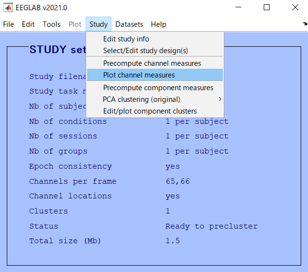
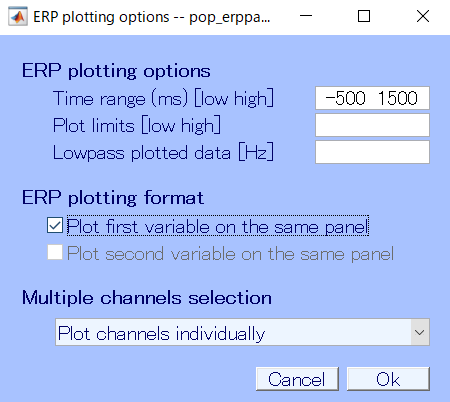
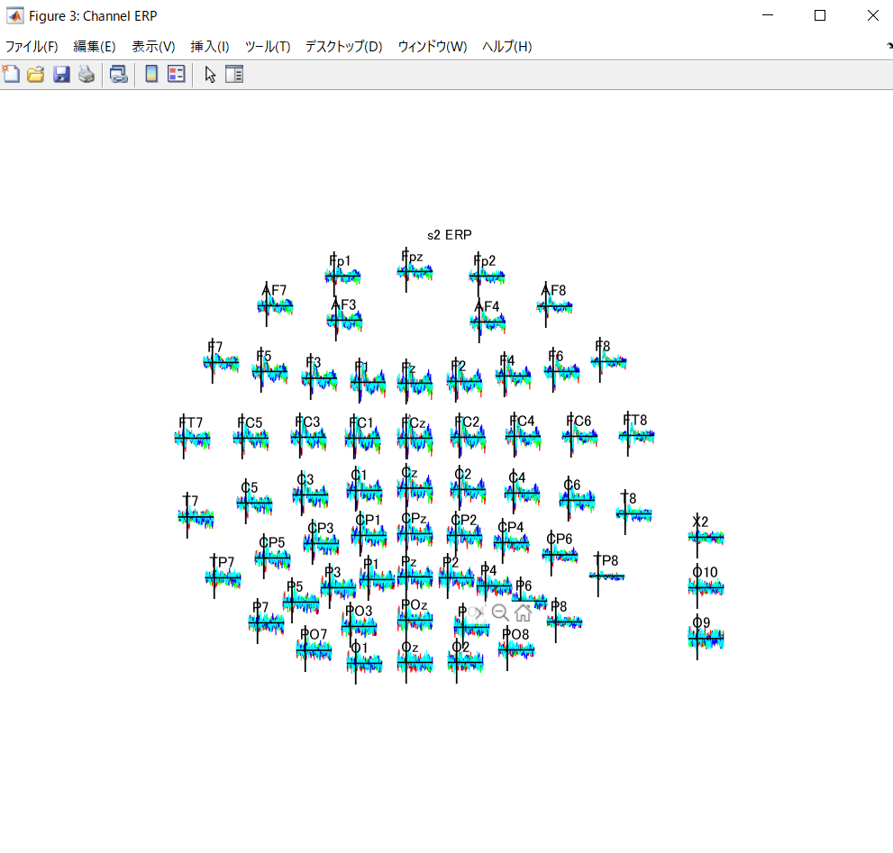
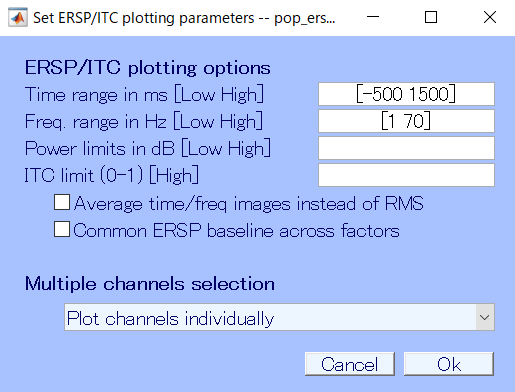
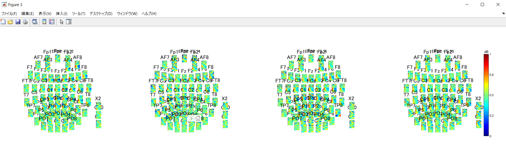
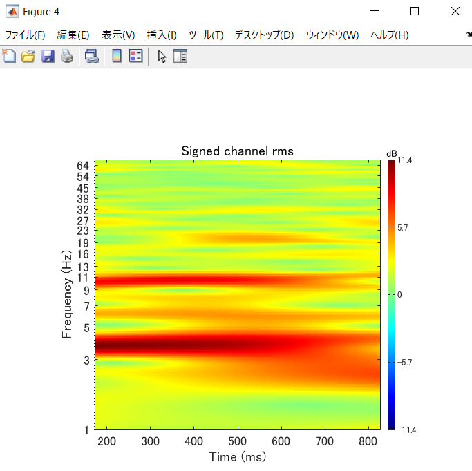
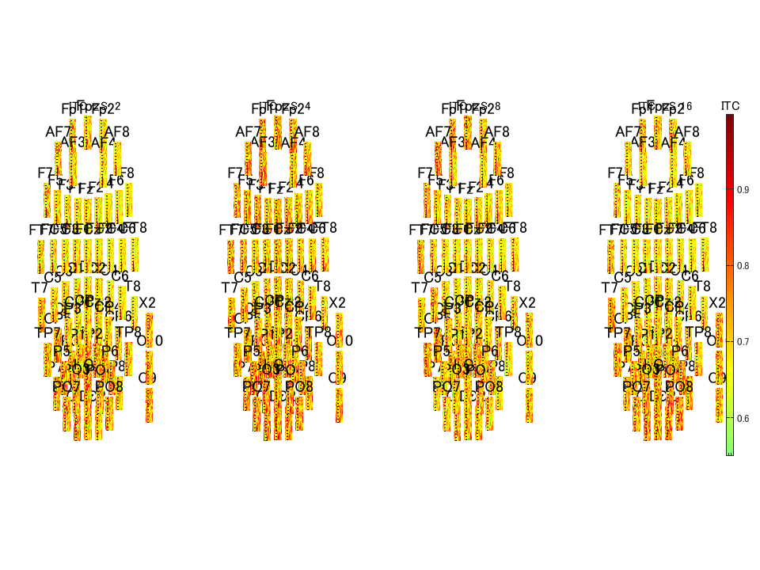

# 被験者群での解析

## STUDYの作成
STUDY を作成するためのデータセットの用意が出来たら，実際に STUDY を作成していきます．

はじめに，STUDY のために設定を少しいじります．
> File -> Preferences

を開き，STUDY and file options の1つ目のチェックボックスにチェックをいれます．STUDY を作る際に計算量を節約するための設定のようなものです．

そのまま Ok を押して保存します．

では STUDY ファイルを作成していきましょう．まず，STUDY にまとめるためのセットファイルを読み込みます．

> File -> load existing dataset

で，下処理をして保存しておいた被験者分のセットファイルを読み込みます．

選択して開きます．

読み込めました．ここまでの画面は今までと何も変わりません．では次に，読み込んだセットファイルを STUDY にまとめます．

> File -> Create study -> Using all loaded datasets

を押し，`Create a new study set` のウィンドウをだします．あるいは，

> File -> Create study -> Browse for datasets

で最初からデータセットをこのタイミングで引っ張ってきても良いです．

ここで，読み込みたかったデータセットが左のリストにいることを確認します．Page を次に送ればさらに 10 人ずつ表示されているはずです．今回はテストなので2人分表示しています．

まずは一番上のランで，study の名前を決めます．ここでは `test` としました．タスク名だとかは使ったことがまだないです．

次に，各データセットに最低限必要な，`subject` 欄を埋めていきます．s01 とか sub1 とかといった命名が多いと思いますがなんでも良いです．

他にもセッションの番号だとか run だとか group だとかがありますが，これは必須ではなく実験によって，研究によって埋めたり埋めなかったり，というか埋めると便利な使い方が出来たりといったものです．今回は入れません．

データセットの確認と，命名が済んだら `Ok` を押しウィンドウを閉じます．

すると画面が変わり，先程まではデータセット用のメニューというかメイン画面だったのがSTUDY用に変わります．

基本は見れば分かると思うので項目の説明は省略．

まずは作成した STUDY の設定を行っていきます．

> Study -> Select/Edit study design(s)

でウィンドウを開きます．

`Edit STUDY design` では，STUDY ファイルでどんな比較というか，全条件全被験者のデータに対してどのような要因の解析をしていくのかの設定を行います．

下の `Edit the independent variables` の欄で `New` を選択，`Add variable` のウィンドウでは，トリガーを使った条件間比較の実験なら `type` を選択し，読み込みたいトリガー情報を全て選択します．

選択したら完成なので `Ok` でウィンドウを閉じます．

最後に，STUDY ファイルに読み込んだセットファイル達を解析にかけます．EEGLAB 側で用意してくれている解析だけですが，一通りの基本の解析はこれでやってくれます．そこが EEGLAB の便利なところです．

> Study -> Precompute channel measures

をクリックして計算の設定を行います．

計算には結構時間が係ると思います．ここら辺まで来るとマシンスペックの影響をかなりうけるので，人によっては何時間もかかったりするかもしれません．

あまりにも長い場合には，根気強く待つか，諦めて計算を軽くするために設定を弄りなおすかが必要です．コマンドウィンドウに `Done` と表示されたら計算が終了で，次のステップに進めます．

いよいよ解析結果とご対面が出来ます．

> Study -> Plot channel measures

から，`View and edit current channels`のウィンドウを開きます．

ここでちょっとパラメータをいじって，下の `Plot ***` を押せば解析結果が表示されます．その際，`Select channel to plot` と `Select subject to plot` から任意の対象を選ぶことで，特定チャンネルのみだったり，特定被験者のみの結果を plot する事も出来ますし，`Sel all` を押しておくことで全ての結果を表示することも選べます．

とりあえず今は，全電極全被験者を選択して進めます．

## ERP
まずは王道，[ERP](../Methods/erp.html) から見ていきます．

`Plot ERPs` の前に，表示する ERP についてオプションの設定を行います．
`Plot ERPs` の間に挟まれた `Params` をクリックして開きます．

`ERP plotting options` で，表示する ERP の時間窓やリミット，フィルタの設定が出来ます．時間窓は最初エポックを切り出すときにはベースラインの計算だったりのためにトリガー前もかなり長め (自分の場合は 500 ms) で取っていましたが，そこは変化がない時間なので plot の時には興味ありません．てきとうに削って plot します．

リミットは別にいらないと思います．特殊な要求の時だけかな．フィルタについても同様で，元々下処理の際にフィルタをかけていると思うのでそんなに気にする必要はありません．ということで時間窓だけ入力して `Ok` を押します．

ではERPを表示しましょう．左の `Plot ERPs` を押します．
少し時間がかかって，下のように条件の数だけトポマップが表示されるはずです．

自分は4条件だったので 4 つのトポマップが表示委されました．それぞれ，全電極のERPがびっしり描画されています．

てきとうに 1 つ選んでクリックしてみればその条件その電極の ERP のみの詳細が表示されます．

この時，視覚実験なら後頭，聴覚実験なら側頭といった対応する領域に，下の画像のように特徴的な反応が見られなかったら，タスクが悪いか下処理が悪いか，いずれにせよ喜ばしくありません．よほど特殊な課題でもない限り，刺激直後 (100-500ms) のあたりに強く上下に揺れが見られるはずです．

見られない場合には下処理で変なことをしてないかもう一度確認し，異常がないようなら実験が悪いです．やり直しを検討しましょう．大体の場合はトリガーのタイミングが上手くいっていません．機械の不調とかで無ければ実験デザインの変更が必要かもしれません．

さて，この状態でも ERP の結果を確認することは可能ですが，条件間での比較をしようと思うと条件ごとに plot をしないといけないため，面倒です．
(余談ですが EEGLAB のこの電極を選ぶ操作，電極が密集している上にメニューバー的なものまで表示されるせいですごいやりにくくて嫌いです．)

そのため，1 つのトポマップに条件毎の波形をまとめて表示してみます．

設定を変えましょう．

ERP plotting format の 1 つ目 (あるいはデザインによっては2つ目) のチェックボックスにチェックを入れ，再度 plot してみます．

 1つのトポマップにまとまりました．詳細表示してみても

こんな感じに条件ごとの波形が重なって見えます．`S2` とかの表示はトリガーの名前ですね．多分どうにかしたらいじれるはずです (figの凡例をクリックして強引に修正する方法もあります)．

これで，ROI が決まっていた場合は対象の電極の ERP で条件間比較をしてやれば ERP 解析ですね．

他にも，左ではなく右側のメニューで all subjects を選択して `Plot ERP(s)` を実行すると，それぞれの被験者で計算した ERP と，被験者平均の ERP を同時に出力するといったことも可能です．

電極1個見てみるとこんな感じ．

あるいは全被験者ではなく被験者単体を選んで実行することで，1 人分だけで plot もできます．

## ERSP
次は[時間周波数解析](../Methods/time_frequency.html)です．同じ画面の下の方にいます．ERSP と，次にやる ITC は同じ計算というか処理の結果として算出される解析手法なので，パラメータはまとめて調節します．見てみましょう．

まず ERP 同様に時間窓です．これも，本来のベースラインである必要はありません．(一個注意点というか，解析の数学上の罠があるのですが最初はあえて嵌りに行きます．)

次に周波数のレンジ．これは見たい範囲をそのまま入れましょう．ただし下処理でフィルタにかけているなら，必ずその範囲内に収まるように plot してください．つまり 4 から 40 Hz とかってフィルタかけたのに 1 から 70 Hz で plot するとかはだめです．多分結果自体は出るのですが，その結果に意味はありません．

あとはパワーに制限をかけることが出来ますがこれは特にやりません．
では plot しましょう．まずは `Plot ERSPs` を押します．

結果が表示されました．ERP 同様，各条件につき全電極の時間周波数 plot が表示されています．ではてきとうな電極を選んで詳細を確認してみましょう．

変ですね．やたら横に間延びしているなぁと思ったら，時間窓が 150 くらいから 850 くらいの狭い範囲に限局されてしまっています．plot のパラメータは先程設定した -500 から 1500 なので，バグを疑ってしまうわけですが，これには訳があり，解析の落とし穴があります．

pre-compute の際，上記のように 1 から 70 Hz の波を，サイクル 3 の波で解析させています．この詳細は[数学の方](../../Math/Analysis/wavelet.html)に投げますが，簡単に言うと周波数解析の計算の際には，ある程度の周期の信号が必要になります．周期の長さは周波数に依存して，低周波なら長く，高周波なら短い時間の信号を使って計算することになります．

今回自分は 1~70 Hz の波で計算させましたので，低周波 (1 Hz) はだいたい 1500 ms に1 回くらい計算ができるという計算になります．これのせいで，plotしようにも前後の 1500 ms はそもそもデータがないことになるので，このような plot になってしまうわけです．

ということで，計算をやり直してみます．1 Hz じゃなく 3 Hz を下限にします．そうすると必要な長さも 1/3 になるので，-500-1500 ms は十分に計算されて使える範囲の窓ということになります．

計算させなおして plot し直し．

無事に求めていた範囲の plot が出せました！
てきとうにだした写真なので結果の良し悪しは許してください．

## ITC
Inter Trial Coherence，Inter Trial Phase Coherence とか Phase Locking Factor とかいろんな呼び方されますが，試行間位相ロッキングを見る解析です．手法の大まかな説明は[こちら](../Methods/phase_analysis.html)．数学的な説明は[こちら](../../Math/Analysis/phase_analysis.html)．

plot の設定は ERSP の時と同様です．

これ．ただし 1 からだと上手くいかなくて計算しなおしをしているので，ここでも周波数のレンジはそれに合わせたものにする必要があります．

また，ITC の上限値の設定ですが，これも普通に使う事を考えれば弄る必要はありません．`Plot ITCs` で plot します．

