# 5. 単被験者での解析
まずは単一被験者のデータだけでできることからやっていきます．

## 条件の切り出し
下処理の段階では全てのイベント，条件を一緒くたにしていじっていましたが，ここからは条件間での比較をしていくため，イベントの分離をする必要があります．

> Edit -> Select epochs or events

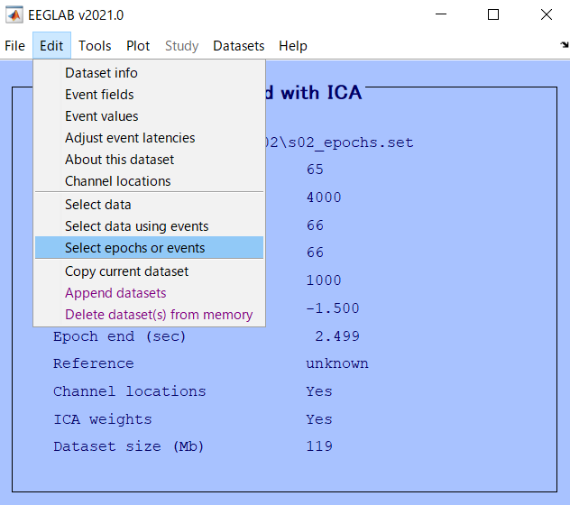

開いたウィンドウでは，今回抜き出す条件を指定します．他はいじらず，3 行目の `type` の右の方にある `...` から，抜き出すイベントを指定します．ここで選択できるのは，下処理のエポックの切り出しの時に選んだものです．

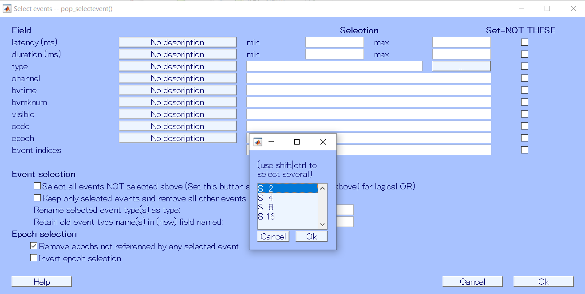

今回はS2を選びました．他のエポックを消していいかと聞かれるので Ok を押し，条件を抜き出します．

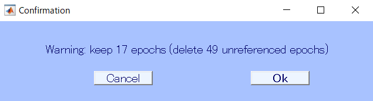

自分の実験ではこれは"セッション a の N 条件"の試行になるため，

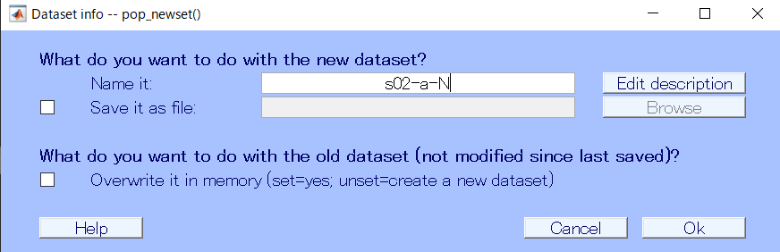

というような名前をつけ，データセットとしました．

無事に切り出せたら

> Datasets

から一個前 (下処理が済んだ状態の，全エポックが入っているデータ) をクリックして戻って，同様の処理を今度は S4 など別の条件についても行っていきます．

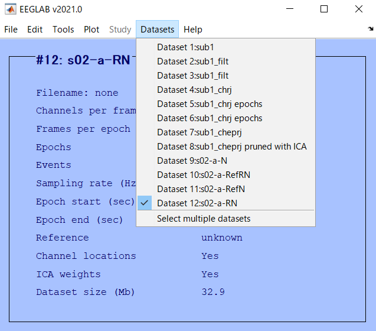

最終的に，それぞれの条件ごとに別個のデータセットが用意できれば完了です．こいつらについて解析をしていきます．

## STUDY

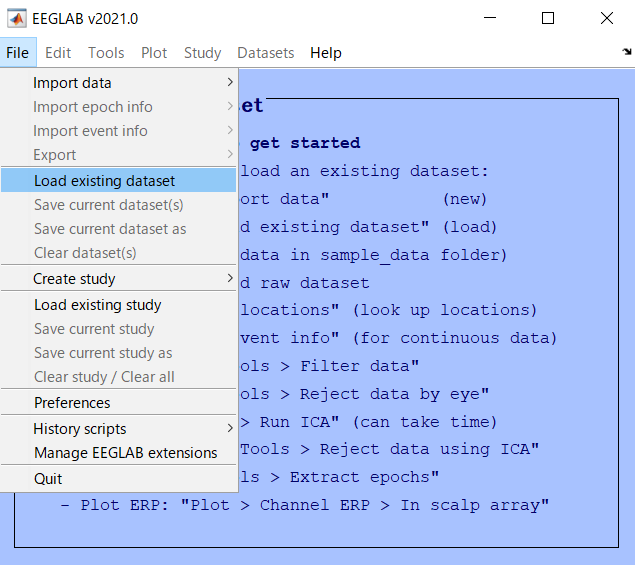

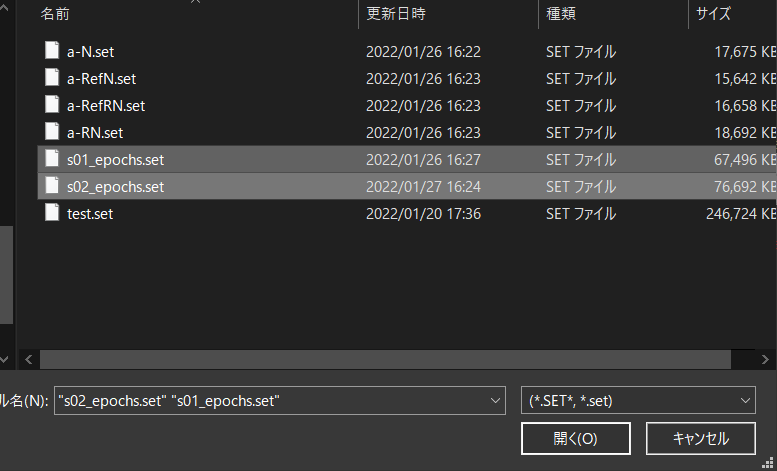

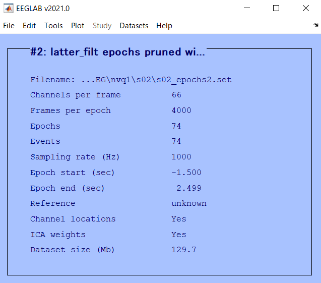

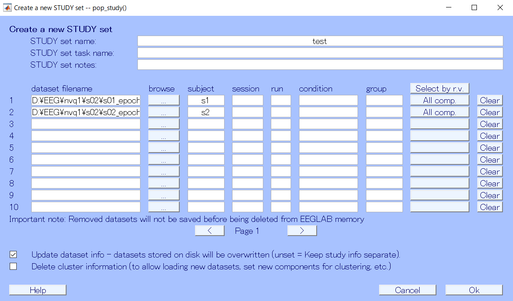

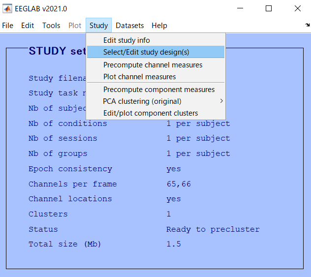

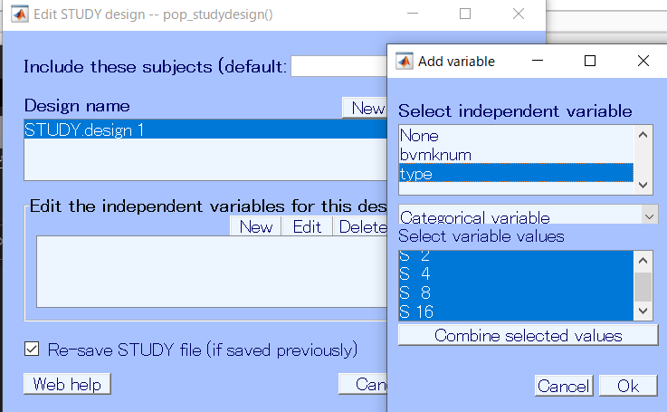

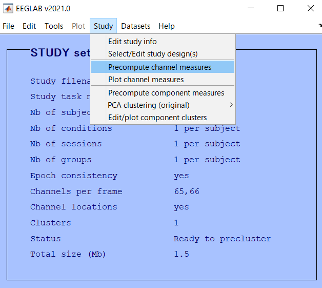

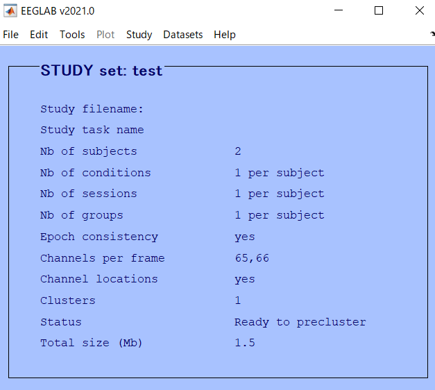

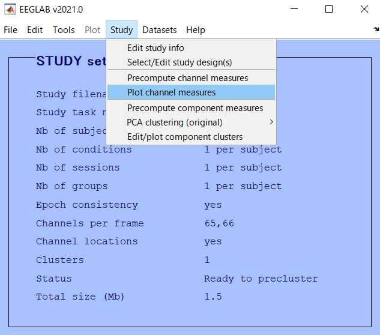

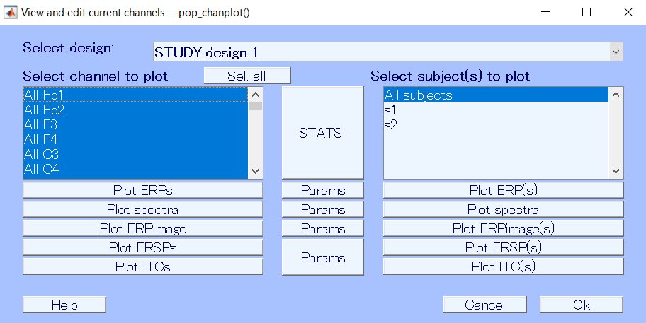

## ERP

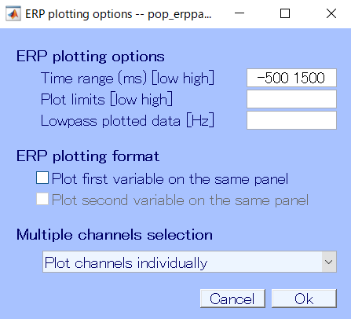

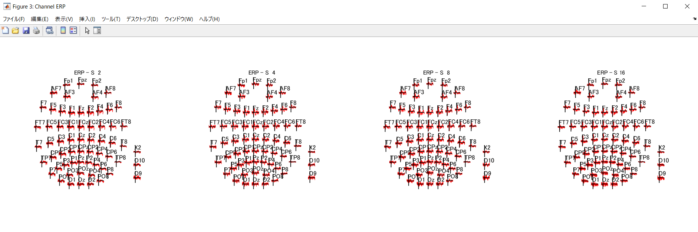

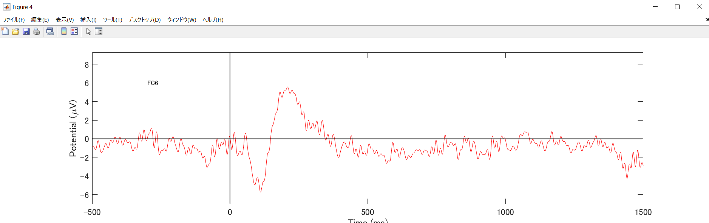

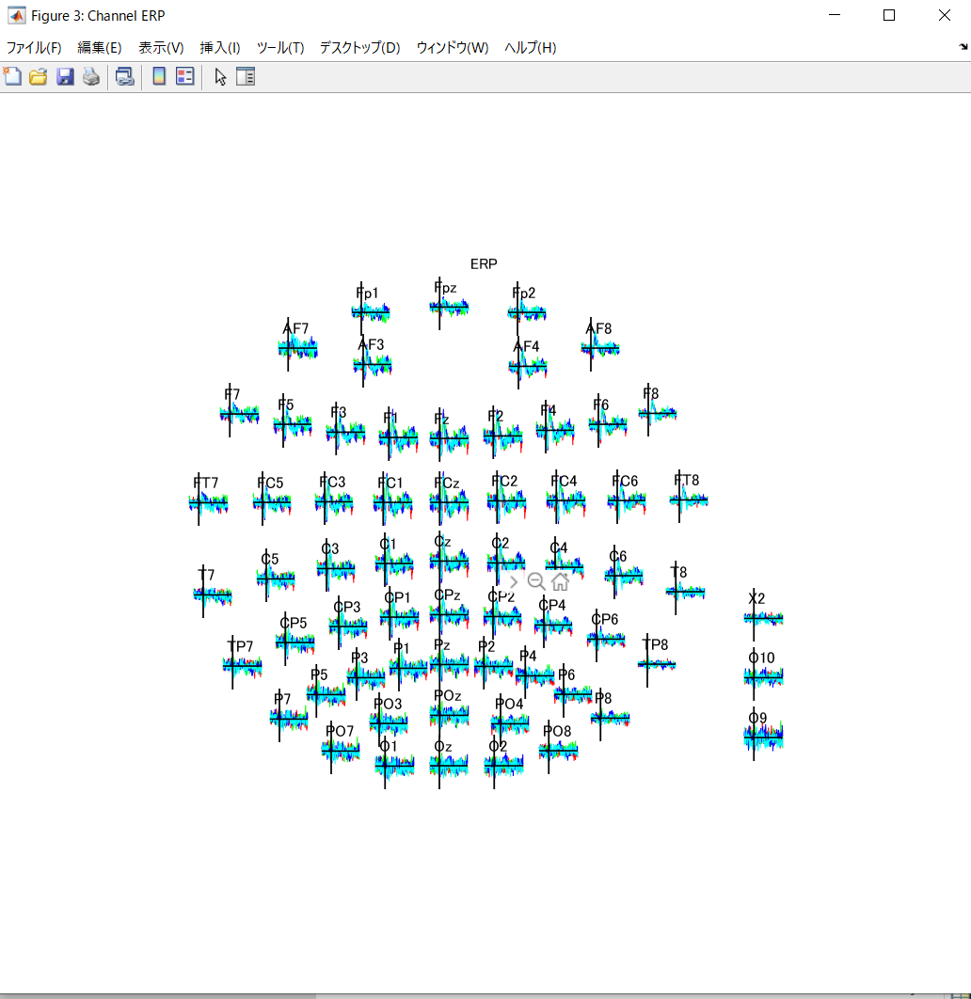

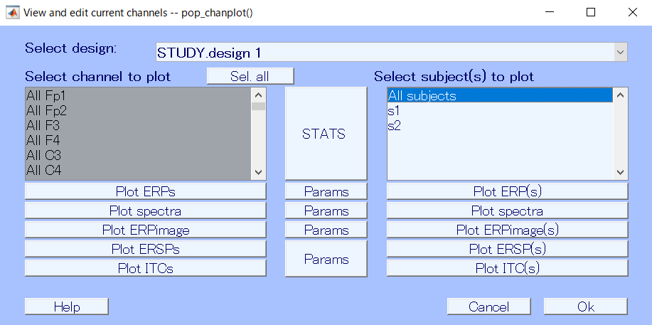

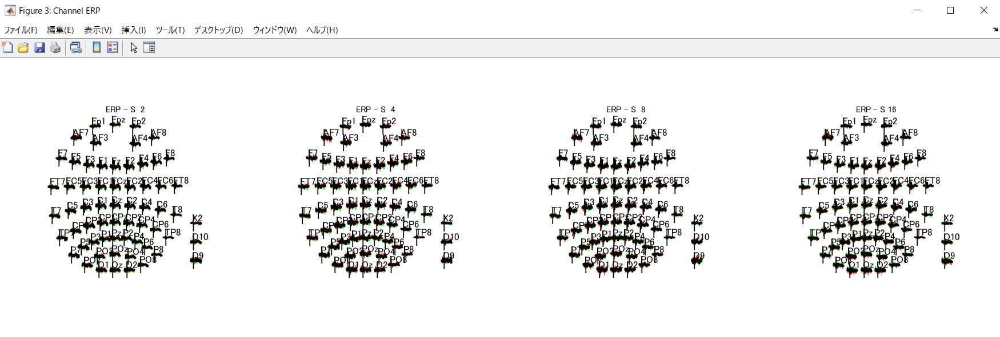

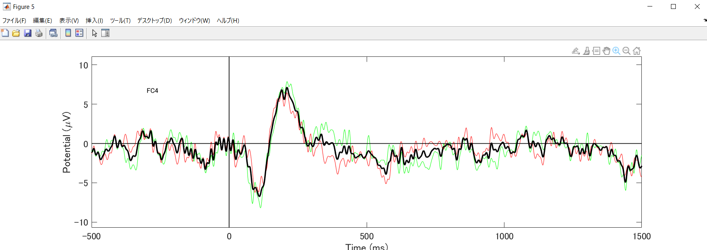

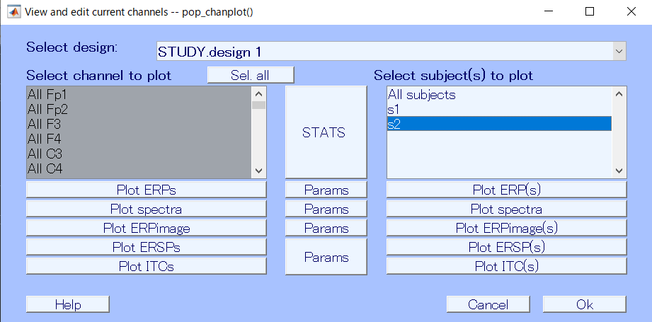

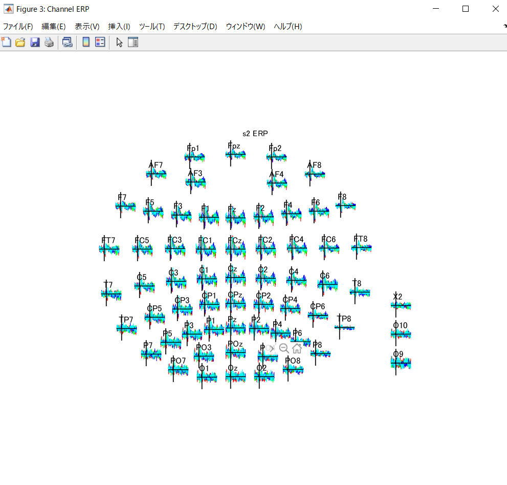

[次回](./analysis2.html)は複数の被験者や実験データを用いてデータ群を作り，解析していきます．