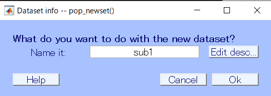

---
html:
  embed_local_images: false
  embed_svg: true
  offline: false
  toc: true

print_background: false
export_on_save:
  html: true

toc:
  depth_from: 1
  depth_to: 6
  ordered: false
---

  <table class="fixed-table">
    <thead>
      <tr>
        <th class="mokuji">目次</th>
        <th>

 Math 
<ul class="gnav">

基礎数学編

        <ul class="index">
        <li><a href="../../Math/Basic/basic.html">ホーム</a></li> 
        <li><a href="../../Math/Basic/multiplication.html">掛け算</a></li>     
        <li><a href="../../Math/Basic/trigonometric.html">三角関数</a></li>
        <li><a href="../../Math/Basic/complex.html">複素数</a></li>
        <li><a href="../../Math/Basic/calculus.html">微分・積分</a></li>
        <li><a href="../../Math/Basic/linear_algebra.html">線形代数</a></li>
        <li><a href="../../Math/Basic/statistics.html">基礎統計</a></li>
        </ul>

        <ul class="gnav">

信号処理編

        <ul class="index">
        <li><a href="../../Math/Analysis/Analysis.html">ホーム</a></li> 
        <li><a href="../../Math/Analysis/fourier.html">フーリエ変換</a></li>
        <li><a href="../../Math/Analysis/wavelet.html">wavelet変換</a></li>
        <li><a href="../../Math/Analysis/hilbert.html">ヒルベルト変換</a></li>
        <li><a href="../../Math/Analysis/eeg.html">基本の脳波解析</a></li> <li><a href="../../Math/Analysis/phase_analysis.html">位相同期解析</a></li>
        </ul>

        <ul class="gnav">

統計編

        <ul class="index">
        <li><a href="../../Math/Statistics/Statistic.html">ホーム</a></li> 
        <li><a href="../../Math/Statistics/distribution.html">確率分布</a></li>
        <li><a href="../../Math/Statistics/central_limit_theorem.html">大数の法則と中心極限定理</a></li>
        <li><a href="../../Math/Statistics/statistic.html">統計量と標本分布</a></li>                                                         <li><a href="../../Math/Statistics/test.html">統計的検定</a></li>
        <li><a href="../../Math/Statistics/anova.html">分散分析</a></li>
        <li><a href="../../Math/Statistics/logistic_regression.html">ロジスティック回帰</a></li>
        </ul>

        <ul class="gnav">

その他

        <ul class="index">
        <li><a href="../../Math/Others/Others.html">ホーム</a></li> 
        <li><a href="../../Math/Others/ICA.html">独立成分分析</a></li> 
        <li><a href="../../Math/Others/CCA.html">正準相関分析</a></li>
        <li><a href="../../Math/Others/lagrange.html">ラグランジュの未定乗数法</a></li>
        <li><a href="../../Math/Others/Entropy.html">エントロピーと分布間距離</a></li>
        <li><a href="../../Math/Others/signal_detection.html">信号検出理論</a></li>
        </ul>

        
</th>
        <th>

 Analysis 

        <ul class="gnav">

EEGLAB

        <ul class="index">       
        <li><a href="../../Analysis/eeglab/eeglab.html">ホーム</a></li>                           <li><a href="../../Analysis/eeglab/setup.html">環境構築</a></li>
        <li><a href="../../Analysis/eeglab/import.html">データのインポート</a></li>
        <li><a href="../../Analysis/eeglab/prepro1.html">基本的な下処理</a></li>
        <li><a href="../../Analysis/eeglab/prepro2.html">発展的な下処理</a></li>
        <li><a href="../../Analysis/eeglab/analysis1.html">単被験者での解析</a></li>
        <li><a href="../../Analysis/eeglab/analysis2.html">被験者群での解析</a></li>
        </ul>

        <ul class="gnav">

MNE-python

        <ul class="index">
        <li><a href="../../Analysis/MNE/MNE.html">ホーム</a></li>
        <li><a href="../../Analysis/MNE/import.html">データのロード</a></li>
        <li><a href="../../Analysis/MNE/preprocessing.html">前処理</a></li>
        </ul> 

</th>
        <th>

 Experiment 

        <ul class="gnav">       </ul> 
</th>
        <th>

 Simulations 

        <ul class="gnav">

環境構築

        <ul class="index">
         <li><a href="../../Simulation/Setup/Setup.html">ホーム</a></li>
        <li><a href="../../Simulation/Setup/environment.html">Python環境構築</a></li>
        <li><a href="../../Simulation/Setup/gpu.html">pythonでのGPUセットアップ</a></li>
        <li><a href="../../Simulation/Setup/jupyter.html">Jupyterセットアップ</a></li>
        <li><a href="../../Simulation/Setup/julia.html">Juliaセットアップ</a></li>
        </ul>

        <ul class="gnav">

非線形力学

        <ul class="index">
        <li><a href="../../Simulation/NonlinearDynamics/Nonlinear-dynamics.html">ホーム</a></li>
        <li><a href="../../Simulation/NonlinearDynamics/dynamics.html">力学系とは</a></li>
        <li><a href="../../Simulation/NonlinearDynamics/stability.html">線形安定性解析</a></li>
        <li><a href="../../Simulation/NonlinearDynamics/stability_nonlinear.html">非線形系の安定性解析</a></li>
        </ul>

        
</th>
      </tr>
    </thead>
  </table>

<h1>02データのインポート</h1>

## 目次

<!-- @import "[TOC]" {cmd="toc" depthFrom=1 depthTo=6 orderedList=false} -->

<!-- code_chunk_output -->

- [目次](#目次)
- [脳波データの拡張子について](#脳波データの拡張子について)
  - [.vhdrファイル](#vhdrファイル)
  - [.vmrkファイル](#vmrkファイル)
  - [.eegファイル](#eegファイル)
- [インポート](#インポート)
- [画面の見方](#画面の見方)
- [setファイルの読み込み](#setファイルの読み込み)

<!-- /code_chunk_output -->

## 脳波データの拡張子について
脳波データは，計測と記録に使用されたハードおよびソフトウェアによって異なるデータ形式で格納されます．詳しくは調べていませんが，`edf`ファイルだったり`eeg`ファイルだったりです．それぞれimportの仕方が若干違うので注意が必要で，場合によってはそのために別途pluginを引っ張ってくる必要があるので自分のデータ形式に合わせて適宜頑張ってください．

### .vhdrファイル
### .vmrkファイル
### .eegファイル

## インポート
さて，インポートとはデータの読み込みのことです．EEGLABにこれから解析する脳波データを読み込ませる作業ですね．簡単です.
ここでは，Brain Visionの形式である `.eeg`ファイルを読み込む方法を紹介します．こいつが一番多いんじゃないですかね？

EEGLABを開いて，

> File -> Import data -> Using EEGLAB functions and plugins -> From Brain Vis. Rec. .vhdr. or .ahdr file

をクリックします．余談ですけど，EEGLABのUIの嫌なところってこの作業注にカーソルが外れるとメニュー閉じちゃって選びなおしさせられるところなんですよね...ストレスがマッハなので修正してほしいところです．

さて，クリックするとファイルを選択する画面に遷移するはずです．

ここで，読み込みたい`.eeg`ファイルに対応する`.vhdr`ファイルを選択します．

対応する`.eeg .vhdr .vmrk`ファイルはすべて同じ場所に置いて，名前も同じにしておいてください．記録時にデフォルトでそうなっているはずなので，絶対に違う名前にしないように．

`.vhdr`ファイルが選択されたら，同じ名前の`.eeg .vmrk`をEEGLABが読み込みにいきます．名前を変えちゃいけない理由はこれです．

ちゃんとしたデータになっていれば

こんな画面が出てきます．どのチャンネルの脳波データを読み込むかとかなので，通常は何もしなくて良いです．書いてある通り，何も記入しなければ全てのチャンネルの全てのデータを読み込んでくれます．なので空欄のままＯＫを押します．

少し読み込みに時間がかかります

...Now loading...

読み込みが終わるとこんな画面が出てきました．これは，読み込んだデータセットになんて名前をつけるかです．EEGLABは読み込んだデータを色々といじっていくわけなので途中途中でデータセットとして保存しておくことができます．今回は1人目の被験者の生データなので，sub1と名付けておきましょうか．OKを押します．

以上の手順で無事に脳波データの読み込みが出来ると，EEGLABの画面に変化が表れます．先程まではよく分からないことが表示されていたところに，channelの数だとかepochだとかといった項目が表示されるようになったと思います．これでデータのimportは完了です．

## 画面の見方

インポートできた画面の見方を確認しておきましょう．青い部分から見ていきます．

一番上の`#1: sub1`は一つ目の，sub1という名前のデータセットを読み込んで表示しているという意味です．

- **Filename:**  
これは今読みこんでるファイルの名前です．ファイルといっても，今回読み込んだ`.vhdr`やデータセット`sub1`のことではないので，今はnoneになっています．ではどんなファイルかというと，EEGLABで読み込んであれこれ弄ったデータセットを`.set`として保存したものになります．保存の仕方はあとで．
- **Channels per frame:**  
これは読み込まれている電極の数です．眼電やAUXポートの信号も含んでいるので人によって，実験によって異なります．もしこの数字が明らかにおかしかったりしたらデータがなんかおかしいってことになります．
- **Frames per epoch:**  
エポックと呼ばれる，脳波データのセグメント...うーんブロック毎にどれだけのフレーム，つまりデータ点が含まれているかです．1000だったら，1000個のデータ点が記録されていることになります．下に書きますが，今はエポックが1個だけになっているので膨大な数字になっていますが，これでＯＫです．逆に少なすぎたらおかしいです．
- **Epochs:**  
エポック，脳波データを区切ったセグメントです．脳波の実験をやるときには何試行も課題をやってもらって，その時の脳波を解析するというのが一般的な用途だと思います．この「何試行」をエポックとして切り出して解析するわけですね．今は何もその処理をしてないので1個だけ，つまり全データをまとめて一つの塊として扱っています．
- **Events:**  
エポックを切り取るのに使えるトリガーの数です．トリガーは実験プログラム側で何種類も用意することが出来，たとえば刺激呈示，刺激終了，被験者の回答，のそれぞれのタイミングで別個のトリガーを出力させていたとして，それを30トライアルやれば90のeventがはいることになります．この情報は`.vmrk`にはいっているので，おかしかったら`.vmrk`の確認をしてください．
- **Sampling rate (Hz):**  
脳波がどれだけのサンプリングレートで計測されたかです．これは計測時に決めることなので，ここから上げる事は出来ません．5000となっていると，1秒間に5000点の脳波データを計測していることになります．数字が大きい程細かく脳波を測れているので，より高周波の脳波について信頼することが出来るようになります．
- **Epoch start:, Epoch end:**  
エポックを，切り取るときに使用したトリガーの瞬間を基準としてどれだけ前からどれだけ後の時間で切り取っているかです．が，まだ切り取ってないのでここは無視します．
- **Reference:**  
脳波を計測した際にハードウェア側で設定したReferenceではなく，EEGLABで読み込んでから新たに別のReferenceを利用した際に表示されます．今は何もしてないので詳しくは下処理のところで．
- **Channel locations:**  
脳波の電極データはありますが，それぞれの電極が被験者の頭のどの位置に置いてあったのかのデータについてです．`.vhdr` には電極位置の情報はなく，電極名だけが記録されています．よって今はNo(labels only)となっていますね．これもあとで読み込みます．
- **ICA weights:**  
説明むずかしいので割愛．下処理の一種です．今は何もしていないのでNo.
- **Dataset size(Mb):** 
読んで文字のごとく，今表示しているデータセットの容量です．まだ何も下処理をしていなく，つまり無駄なデータを多く含んでいるのでめちゃくちゃでかいです．下処理とか進むにつれて減っていきます．  

そのほか，上に表示されているメニューバーはこれから下処理とかやっていくときに触ることにしましょう．

次はいよいよ解析...の前に面倒だけど大事な大事な下処理をやっていきます．

## setファイルの読み込み

下処理の方で確認しますが，ある程度作業が進んだらその時点でのデータを`.set`形式で保存しておくことができます．

この方法を使って保存したものを，後からもう一度EEGLABで読み込みたい場合の操作です．

> File -> Load existing dataset

からファイルを選択します．

これでファイルを選択し，開けばOK．保存した時点でのデータセットが再現されます．

【[次へ](./prepro1.html)】

