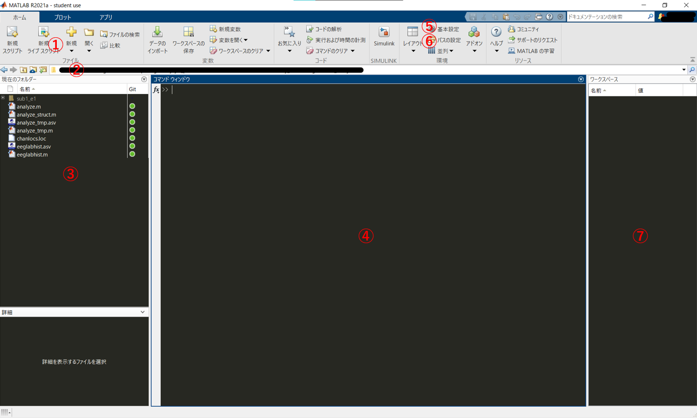

---
html:
  embed_local_images: false
  embed_svg: true
  offline: false
  toc: true

print_background: false
export_on_save:
  html: true

toc:
  depth_from: 1
  depth_to: 6
  ordered: false
---

  <table class="fixed-table">
    <thead>
      <tr>
        <th class="mokuji">目次</th>
        <th>

 Math 
<ul class="gnav">

基礎数学編

        <ul class="index">
        <li><a href="../../Math/Basic/basic.html">ホーム</a></li> 
        <li><a href="../../Math/Basic/multiplication.html">掛け算</a></li>     
        <li><a href="../../Math/Basic/trigonometric.html">三角関数</a></li>
        <li><a href="../../Math/Basic/complex.html">複素数</a></li>
        <li><a href="../../Math/Basic/calculus.html">微分・積分</a></li>
        <li><a href="../../Math/Basic/linear_algebra.html">線形代数</a></li>
        <li><a href="../../Math/Basic/statistics.html">基礎統計</a></li>
        </ul>

        <ul class="gnav">

信号処理編

        <ul class="index">
        <li><a href="../../Math/Analysis/Analysis.html">ホーム</a></li> 
        <li><a href="../../Math/Analysis/fourier.html">フーリエ変換</a></li>
        <li><a href="../../Math/Analysis/wavelet.html">wavelet変換</a></li>
        <li><a href="../../Math/Analysis/hilbert.html">ヒルベルト変換</a></li>
        <li><a href="../../Math/Analysis/eeg.html">基本の脳波解析</a></li> <li><a href="../../Math/Analysis/phase_analysis.html">位相同期解析</a></li>
        </ul>

        <ul class="gnav">

統計編

        <ul class="index">
        <li><a href="../../Math/Statistics/Statistic.html">ホーム</a></li> 
        <li><a href="../../Math/Statistics/distribution.html">確率分布</a></li>
        <li><a href="../../Math/Statistics/central_limit_theorem.html">大数の法則と中心極限定理</a></li>
        <li><a href="../../Math/Statistics/statistic.html">統計量と標本分布</a></li>                                                         <li><a href="../../Math/Statistics/test.html">統計的検定</a></li>
        <li><a href="../../Math/Statistics/anova.html">分散分析</a></li>
        <li><a href="../../Math/Statistics/logistic_regression.html">ロジスティック回帰</a></li>
        </ul>

        <ul class="gnav">

その他

        <ul class="index">
        <li><a href="../../Math/Others/Others.html">ホーム</a></li> 
        <li><a href="../../Math/Others/ICA.html">独立成分分析</a></li> 
        <li><a href="../../Math/Others/CCA.html">正準相関分析</a></li>
        <li><a href="../../Math/Others/lagrange.html">ラグランジュの未定乗数法</a></li>
        <li><a href="../../Math/Others/Entropy.html">エントロピーと分布間距離</a></li>
        <li><a href="../../Math/Others/signal_detection.html">信号検出理論</a></li>
        </ul>

        
</th>
        <th>

 Analysis 

        <ul class="gnav">

EEGLAB

        <ul class="index">       
        <li><a href="../../Analysis/eeglab/eeglab.html">ホーム</a></li>                           <li><a href="../../Analysis/eeglab/setup.html">環境構築</a></li>
        <li><a href="../../Analysis/eeglab/import.html">データのインポート</a></li>
        <li><a href="../../Analysis/eeglab/prepro1.html">基本的な下処理</a></li>
        <li><a href="../../Analysis/eeglab/prepro2.html">発展的な下処理</a></li>
        <li><a href="../../Analysis/eeglab/analysis1.html">単被験者での解析</a></li>
        <li><a href="../../Analysis/eeglab/analysis2.html">被験者群での解析</a></li>
        </ul>

        <ul class="gnav">

MNE-python

        <ul class="index">
        <li><a href="../../Analysis/MNE/MNE.html">ホーム</a></li>
        <li><a href="../../Analysis/MNE/import.html">データのロード</a></li>
        <li><a href="../../Analysis/MNE/preprocessing.html">前処理</a></li>
        </ul> 

</th>
        <th>

 Experiment 

        <ul class="gnav">       </ul> 
</th>
        <th>

 Simulations 

        <ul class="gnav">

環境構築

        <ul class="index">
         <li><a href="../../Simulation/Setup/Setup.html">ホーム</a></li>
        <li><a href="../../Simulation/Setup/environment.html">Python環境構築</a></li>
        <li><a href="../../Simulation/Setup/gpu.html">pythonでのGPUセットアップ</a></li>
        <li><a href="../../Simulation/Setup/jupyter.html">Jupyterセットアップ</a></li>
        <li><a href="../../Simulation/Setup/julia.html">Juliaセットアップ</a></li>
        </ul>

        <ul class="gnav">

非線形力学

        <ul class="index">
        <li><a href="../../Simulation/NonlinearDynamics/Nonlinear-dynamics.html">ホーム</a></li>
        <li><a href="../../Simulation/NonlinearDynamics/dynamics.html">力学系とは</a></li>
        <li><a href="../../Simulation/NonlinearDynamics/stability.html">線形安定性解析</a></li>
        <li><a href="../../Simulation/NonlinearDynamics/stability_nonlinear.html">非線形系の安定性解析</a></li>
        </ul>

        
</th>
      </tr>
    </thead>
  </table>

<h1>01環境構築</h1>

## 目次

<!-- @import "[TOC]" {cmd="toc" depthFrom=1 depthTo=6 orderedList=false} -->

<!-- code_chunk_output -->

- [目次](#目次)
- [MATLABのダウンロード](#matlabのダウンロード)
  - [ダウンロード](#ダウンロード)
  - [画面の確認](#画面の確認)
- [EEGLABのダウンロード](#eeglabのダウンロード)
- [EEGLABのpathを通す](#eeglabのpathを通す)
- [拡張機能](#拡張機能)
  - [vhdrファイルの読み込み](#vhdrファイルの読み込み)
  - [Cleanline](#cleanline)
  - [ADJUST](#adjust)
  - [その他](#その他)
  - [全機能解放](#全機能解放)

<!-- /code_chunk_output -->

## MATLABのダウンロード
MATLABはMathWorks社が開発している数値解析ソフトウェア，およびそこで使用されるプログラミング言語です．行列の扱いなどに優れていて，神経科学に限らず科学研究においてデータ解析によく用いられます．我々の扱う脳波やMRI画像も行列データであるため，その解析に一般に用いられます．

難点は，有料（めっちゃ高い）なことです．こればかりはなんとも...学生ならまだ多少安いですが，一般で購入すると笑えないくらいの額です．ただ読者の多くは所属している機関がライセンス契約をしていると思うので，自腹で買う必要はありません．

ライセンスが提供されている人は所属機関のアナウンスに従ってMATLABのダウンロードをしてください．

ない人は以下の手順に従います．

### ダウンロード

[こちら](https://jp.mathworks.com/products/get-matlab.html?s_tid=gn_getml)の公式ページからダウンロードをします．

キャンパスソフトウェア，使えると良いですね...自分は使えなかったので自腹です．

適切なものを選んで手順を進め，購入，ダウンロードしてください．

購入/ダウンロードの際，Toolboxの選択をする画面があると思いますが，そこでは基本デフォルトで推奨されているものだけで大丈夫だと思います．Signal Processing Toolboxにチェックが入っていることを確認してください．

また，必須ではないですけどStatistics and Machine learning だったか，そんな名前のToolboxも入ってると楽だと思います．

無事に購入が出来たら，適切な場所(C://program files/MATLAB)とかが無難，にダウンロードしてください．完了したら起動してみましょう．

### 画面の確認

色や配置はちょっと違うと思いますが，だいたい似た画面が出れば成功です．初回起動だと④のところになんか"Hello!"みたいなのが表示されているかも知れません．忘れました．

画面の説明です．まず
①はプログラムを書くファイルを新しく作ったり，前に作ったファイルを開いたりするメニューです．ライブスクリプトについてはとりあえず保留．便利だけど必須ではないです．次．

②は現在作業しているディレクトリです．ディレクトリが何かというと，PCの画面でファイルマークみたいなやつを使って「Aフォルダの中のBフォルダの中のCというwordファイルを開く」とかいつもやっていますよね．そこでいうAにいるのかBにいるのかを表してます．

③が，そのディレクトリ内に格納されているファイルの一覧です．薄い灰色になってるのは一個下の階層のディレクトリで，そこをクリックする事でディレクトリの移動が可能です．白文字になっているようなファイル(.mat/.m形式)のファイルをクリックすると右側の画面に開かれます．.mはMATLABスクリプトファイルで，.matはMATLABが扱っている，変数を記録したファイルのようなものです．あとで確認します．

④はコマンドウィンドウです．Terminal的な奴．MATLABにプログラムファイルを通さず直接命令する時に使います．もう少し詳しくいうと，.mファイルというのはこのコマンドウィンドウに対する命令を小出しにせず一つにまとめたファイルだと考えてＯＫです．なのでちょっとした作業はここで行い，壮大な作業だったり保管しておきたい作業は.m形式にするって使い方で考えておきましょう．

⑤はMATLABの設定をいじるやつ．筆者のみたいにかっこいい色とか配置にしたかったら色々いじってみてください．

⑥パスの設定．あとで出てきますが重要です．説明後述．

## EEGLABのダウンロード

[EEGLAB](http://sccn.ucsd.edu/eeglab/)はMATLAB上で動くEEG解析用ソフトウェア，toolboxです. GUIベース，つまりプログラムを自分で書くことなくボタンをポチポチしてるだけで脳波の解析をすることができます．まずこいつを使って脳波解析の流れに触れていきましょう．

[こちら](https://sccn.ucsd.edu/eeglab/downloadtoolbox.php)から最新versionをダウンロードしてください.

ダウンロードしたら，解凍して保存します．保存先はMATLABをいれたディレクトリの下，toolboxディレクトリの中です．

> C://Program Files/MATLAB/R####/toolbox

ここでディレクトリ構造を壊さないように気を付けてください．eeglabフォルダの中身をばらまくのではなく，フォルダそのものをここに入れるように注意してください．

ここまで出来たら，MATLABを起動します．

## EEGLABのpathを通す
さて，EEGLABはダウンロードしただけだと残念ながら使用できません．たくさんの関数が格納されているのですが，その関数，「命令」をMATLABに覚えさせるためにはパスを通す必要があります．たとえば

> disp('hoge')

とMATLABのコマンドウィンドウに打ち込むと，

> hoge

と表示されます．これはdispという関数が，「()内の文字を表示しろ」という命令としてMATLABに登録されているからです．というふうに，EEGLABに入っている命令をMATLABに新しく登録する必要があり，それがパスを通すという作業です．

さっそくやっていきます．

この画像に戻ります．

⑥のパスの設定，先程説明を省いたこの項目でそれを行います．クリックしましょう．

こんな画面が出ると思います．右側に表示されているのが，現在MATLABに登録されているパスの一覧です．ここにEEGLABを追加していきます．

左上のサブフォルダも追加をクリックして，先程ダウンロードしたEEGLABのフォルダを探して選択し，[フォルダの選択]を押してください．右の欄にEEGLABが追加されたのが確認できたら下のボタンから保存をし，画面を閉じてください．上手くいってればpathが通っているはずです．

MATLABを再起動して，コマンドウィンドウに

> eeglab

と打ってenterを押してみましょう．

こんなwindowが表示されればパスの設定は成功です！表示されない場合はパスを上手く通せてないので，もう一度パスの設定をやり直してください．

## 拡張機能
EEGLABはデフォルトの状態では足りない関数がいくつかあります．関数とはコンピュータに対して出す「命令」で，EEGLABの青い画面を出すのも，青い画面のボタンを押した時に何かを計算するのも，その結果を画面に表示するのも，全て関数によって命令を送っているからです．

以下では，脳波解析で使いたいのにデフォルトでは入ってない関数をEEGLABにいれていきます．

### vhdrファイルの読み込み

我々が計測した脳波ファイルの形式，拡張子はいくつかのパターンがあります．そのうち，Brain Vision の計測器を通して記録された脳波データは
- .vhdr
- .vmrk
- .eeg
  
の3つのファイルに分けて記録されます．vhdrはヘッダーファイルで，脳波の電極名やサンプリングレートなどといった情報が記録されています．

eegが脳波ファイル本体ですが，これは$ 電極 \times タイムポイント$の形の2次元配列になっています．どの行がどの電極なのかとかはeegファイルを見るだけだと分かりません．そのためvhdrが必要になるわけですね．

vmrkはマーカーファイルです．ここには実験時に我々が出力したトリガー情報が格納されています．トリガーの詳細は[実験デザイン](../../Experiment/experiment.html)を参照してださい．

そんなvhdr(&vmrk,eeg)ですが，ダウンロードしてすぐのEEGLABでは読み込むことができません．そこで新たにpluginと呼ばれる関数の集合みたいなものを入れ，読み込めるようにします．[こちら](https://github.com/arnodelorme/bva-io)から，bva-io pluginをダウンロードしてください．

zipをダウンロードしたら，解凍して中身を移動させます．EEGLABがあるフォルダ(指示通りにやっていれば，画像と同じような場所だと思います)を探して，
> eeglabXXXX.X/plugins

フォルダに，解凍したbva-io-masterフォルダを丸ごと移動させます．画像だと他にもいくつか入ってると思いますがとりあえず無視してください．

eeglab/pluginsのなかにbva-io-masterが入ればOKです．この時，ディレクトリ構造を崩さないように注意してください．

格納が出来たら，今入れたpluginにパスを通します．EEGLABはMATLABが操作する関数で，そいつが操作する関数...なので結局，MATLAB側で呼び出すことができないとpluginを入れても機能を使うことができません．

MATLABのパス設定画面から，今追加したpluginフォルダ下のbva-io-masterを追加してください．

パスの設定ができたらEEGLABを再起動してみましょう．

> File -> Import data -> using EEGLAB functions and plugins

に赤線を引いている"From Brain Vis. Rec. .vhdr or .ahdr file"が表示されれば成功です．

### Cleanline
同様に，cleanline pluginもいれておきます．どんなプラグイン，というか何をするやつなのかの詳細はひとまず置いておきます．簡単にいうと，脳波データのノイズ除去に使うやつです．脳波はきっっっったねぇ信号なので，脳波解析の結果の良し悪しはいかにノイズを取り除くかに依存していると言っても過言ではありません．

てことで，そんなノイズ除去関数の一つであるcleanlineを解放します．[こちら](https://github.com/sccn/cleanline)からダウンロードして，bva-io同様にpluginに入れてパスを通してください．

### ADJUST

これもまあ，ノイズ除去です．[こちら](https://www.nitrc.org/projects/adjust/)からダウンロードしてパスの設定．

### その他
そのほかにも，EEGLABで解析をやっているうちに欲しいpluginが出てきたり，論文読んでて知らないplugin使ってるなあ自分もやってみたいなあなんて思ったら，その都度この作業をやってください．

ダウンロードしただけでは使えないのでpathを通すことを忘れないように．

### 全機能解放

EEGLABはそこそこ積極的に新しい機能の開発をしているので，最新版になると消されてしまった（別の関数に集約された）機能なんかも存在します．しかし残念ながら，そういった新しい関数の評価が低くて昔の方が良かったなんてことも往々にしてあります．

そこで，最新版では表示してないけど昔は使われていた機能なんかもちゃんとメニューに表示できるように設定をいじります．

> File -> Preference

を押して，設定画面を開きます．ここで下から二つ目のチェックボックスにチェックを押してOKを押します．これで機能が解放されます．あとは指示に従ってEEGLABを再起動すると，先程までよりも充実したメニューが見れるようになります．

尚，この操作は別にEEGLABのバージョンをいじっているわけではないので，解析結果などの挙動が変わってしまう恐れはありません．

【[次へ](./import.html)】

