# オンラインクラウド実験
ここでは，PsychoPy + Pavlovia + クラウドワークスを用いたオンラインクラウド実験の方法についてまとめます．

## 環境の準備
まずは各種サービスのアカウント登録などが必要です．

### PsychoPy
Standaloneの [PsychoPy](https://www.psychopy.org/download.html?utm_source=chatgpt.com) を入れます．PsychoPy は Python を用いた心理学実験用のツールです．今回は実験プログラムのメインはこれで実装します．

ダウンロードできたら，`PsychoPy Builder` を起動してみます．

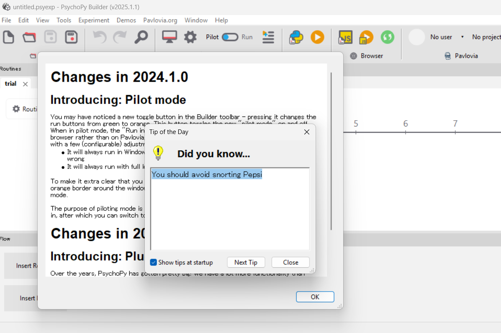

人生に気付きを与えてくれるでしょう．

### Git
Git については細かく説明しませんが， Pavlovia は Git を使って環境の Sync を行うので PC に Git がないと同期エラーが出ます．整えておいてください．

### Pavlovia
オンライン実験を行うためのサービスです．ファイルサイズが大きい実験でもダウンロードのストレスなど低く出来るという長所があります．

まずは [Pavlovia](https://pavlovia.org/) でアカウントの登録 (Register) をします．

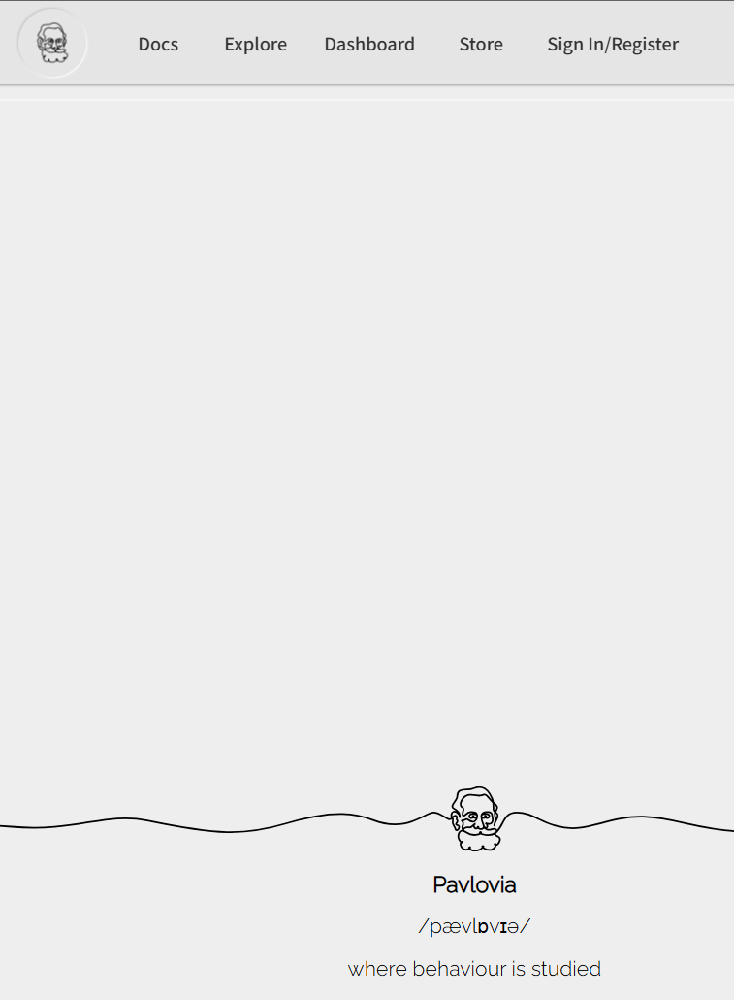

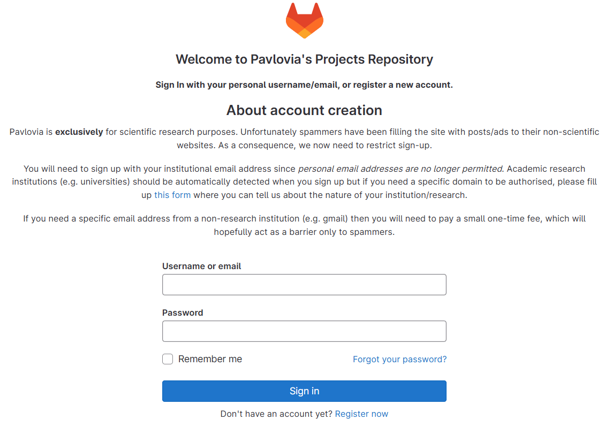

大学などの研究用アカウントが必要です．ない場合は課金．Corfirmation を終えたら，ログインしてみてください．問題なければこのようにアカウント設定ができます．

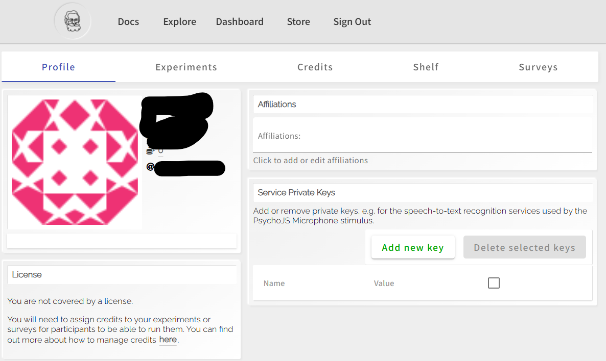

### Pavlovia と PsychoPyの連携
PsychoPy Builderを開き， `Pavlovia,org` メニューの `User`，`Log into Pavlovia` を開き，自分の Pavlovia アカウントでログインします．

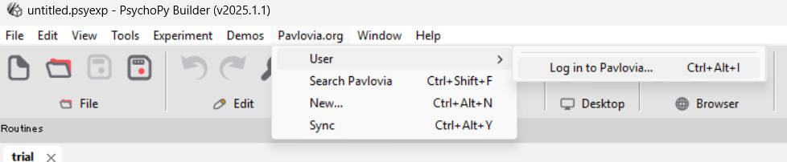

上手くログインできました．

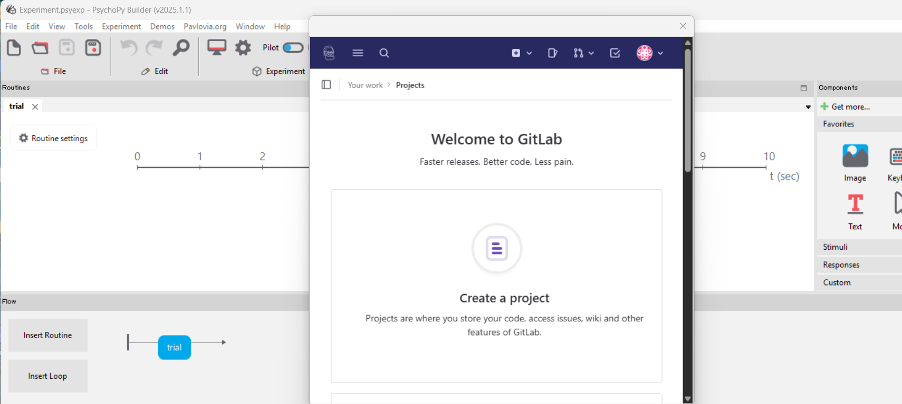

そしたら一度 Pavlovia windowは閉じ，

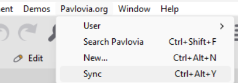

`Sync` を試します．まだ何も Git のrepository設定をしていない場合，下記メッセージが出ます．そのまま作成しましょう．

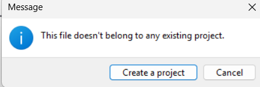

すると下のメニューが表示されるので，任意のProject nameとフォルダの選択をします．フォルダは Git 管理するフォルダなので，この実験プロジェクトの親フォルダにしてください．（実験のメインプログラム(`.psyexp`)，刺激セット，その他ファイルが全て格納されるように．ただし他の関係ないのは含まれないように．たとえば `Desktop` は広すぎ．`Stimuli` は狭すぎです．）

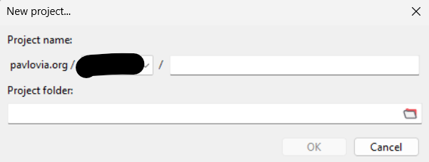

上手くGit連携ができていれば，次のような `PsychoPy Runner` の画面がでます．

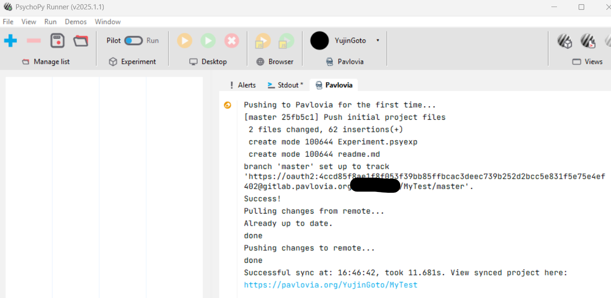

今回は `MyTest` というフォルダを設定しました．上手くmaster branch が作られたのが分かります．いったん Builder の方に戻り，`Experiment settings` を開きます．

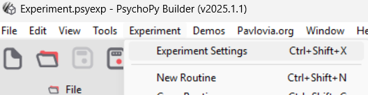

`Online` タブを見るとこのようになっているはずです．

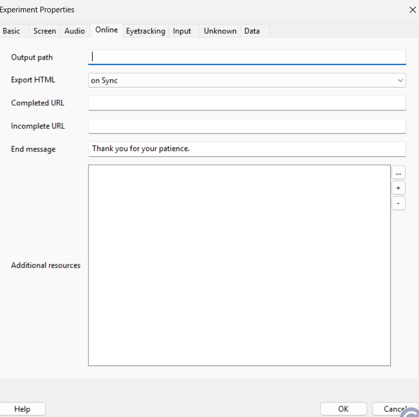

ほとんど空欄ですが，`Export HTML` が on Sync なことを確認してください．これは Git の Push 字に自動で HTML/JS を書きだす設定です．実験終了時の `End message` くらいは好きに変えてよいでしょう．

`Additional resources` や `Completed URL` は後ほど重要ですが一旦放置．

実験用に表示するwebページ (HTML) を作成するため，`File -> Export HTML` を実行します．

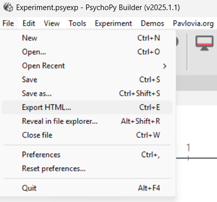

ローカルにhtmlやjsが生成されたことを確認してください．

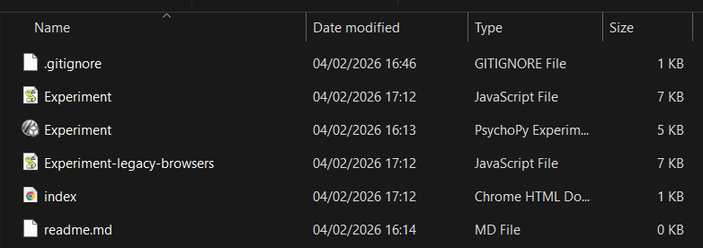

できていれば，`Pavlovia.org-> Sync`をします．PsychoPy 側で何かを変えたら，その都度こうやって同期をしましょう．上手くいけば，ブラウザで Pavlovia プロジェクトを確認しても今追加したファイルが反映されているはずです．Git になれていない人にはややこしいかもしれませんが，とりあえず Sync しまくってください．変なファイルあげちゃって取り消したければ，ローカルでそのファイルを消してからSyncしてしまえば，ひとまずはOKです．

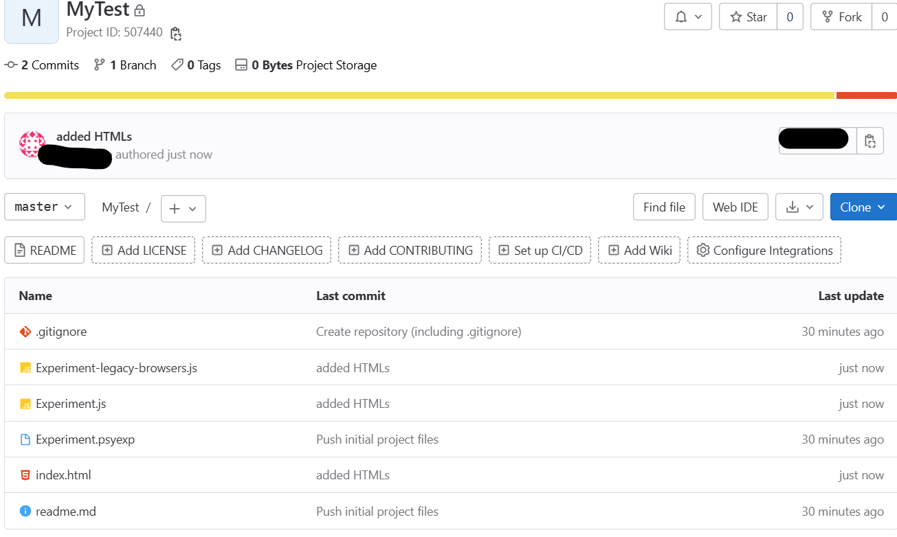

## 動作確認
では，準備が出来たので Online 実験の動作確認をしていきます．まず，今回は`PsychoPy`で特に実験プログラムを作らずデフォルトのままで進めていたので大した実験はできませんが，ちゃんとブラウザで今回作成したプロジェクトの HTML が表示されるのかを確認します．

Runner の方で先程出たメッセージの一番下の url をブラウザに入力しましょう．建てた Project のページが開くはずです．最初は下の写真でいう左下の Status がInactiveなはずですが，左下の Status を`Piloting` にしましょう．すると1時間有効な Pilot のトークン付きURL が発行されます．

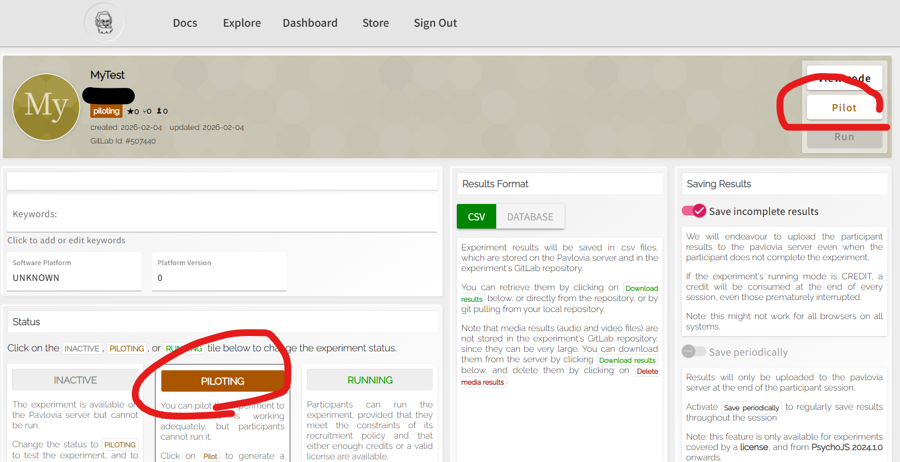

すると右上の赤丸，`Pilot`が押せるようになっているはずなので押します．すると，別タブで `init...` みたいなメッセージが出てこんな画面になるはずです．PsychoPyの実装次第なので若干個人差出るかも．

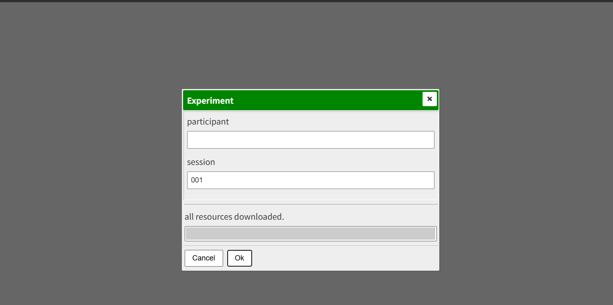

ここで，`Participant` には実験案内の時点で被験者に「CrowdWorksのID(あるいはこちら指定のID)を入力してOKを押してください」等と指示すると，後の照合がやりやすくなります．こうした入力を被験者にやらせたくなければ後ほど `Experiment info` から消すこともできます．とりあえずここではてきとうな文字列を入れて `OK`.

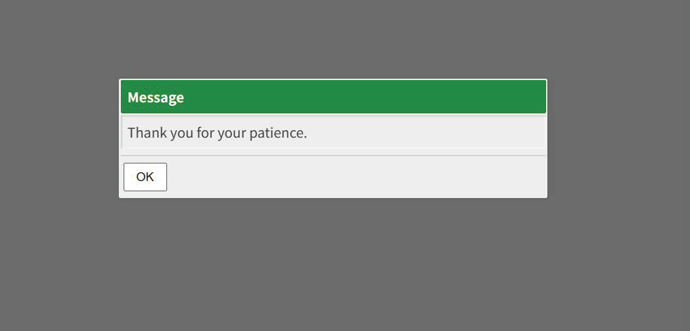

上手くいけば，何やら別ウィンドウが開いて一瞬何かが表示され，感謝されます．これは実験の中身をまだ何も書いていないからで，正常です．

Pavloviaのページ下部で，Resultsのカウントが `submitted:1`になっていることを確認してください．

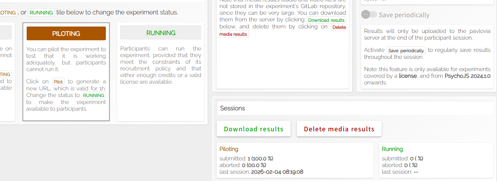

なっていれば，被験者のローカル実験->提出->Pavloviaでの結果記録のループが正常に出来たことになります．また，今は Pilot モードなのでデータはここには格納されず，実験終了時にローカルに吐き出される設定になっています．`RUNNING` にするとサーバーに上がりますが，クレジットを消費してしまうので今はやめておきます．

では次はいよいよ，実験データの中身をちゃんと取得できるかもうちょいまともな実験コードでチェックしていきます．

### 実装
多分将来的にはどこかでまとめますが，PsychoPy Builder での実験プログラムのGUI実装について簡単にまとめます．まずは Builder の画面（下記）の見方からです．

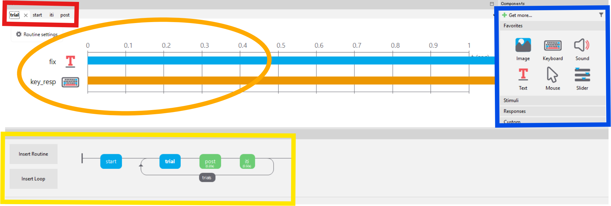

まず，**赤の領域**は「いま編集している Routine」のタブです．PsychoPy Builder では実験は複数の Routine (開始画面，試行，ITIなど) の組み合わせで作ります．ここに並んでいるのはそれぞれの部品の一覧で，クリックするとその Routine の編集画面（オレンジ・青）に切り替わります．どの Routine がどういった順番で実行されるのかはここではなく，後述の黄色領域で設定します．

**オレンジの領域**は，選択中の Routine の時間軸表示です．左側にその Routine を構成する要素（表示，再生する素材）が並び，右の棒がそれぞれの開始や終了タイミングを表します．バーの初めと終わりが Start/Stop に対応しています．この画面では，0秒で始まり無限に続く (回答待ち) 状態です．たとえば「注視点はずっと出し，キー入力は1.0秒から1.5秒の間だけ受け付ける」などの使い分けが見れます．

**青の領域**は，Routine の構成要素のパレットです．好きな要素をここから選んで追加していきます．クリックすると，それぞれの設定ウィンドウが開かれます．たとえば `text` なら表示するテキストの内容や色，大きさ，位置，表示時間などです．

最後に黄色の領域は全体の流れ (Flow) です．ここまでで設定した Routine をどういった順番やループで表示するかを設定します．この画面だと，まず `Start` を行い，その後は `trial`, `post`, `iti` がループで回るようになっています．`Insert Routine` で作成済みの Routine を選び，矢印の中で適切な位置にマウスで挿入します．`Insert Loop` は，ループ構造の導入です．基本的には実験はstart->loop->endの構成になるはずです．

今回はてきとうに Reaction time 課題を作ってみました．内容は下に列挙します．

実装

とりあえず，デフォルトだと背景がグレーで嫌なので `Experiment settings` の `Screen` タブから `Background colour` を選び，black にしました．お好みです．

**Routine**: start, trial, post, iti

1. Start
まず `Insert routine` で (new) から `start` のRoutineを作成．パレットから text を選び，"Press SPACE to start" と内容を入れる．次に keyboard を追加し，Aloowed keys:space, Force end of Routine: ON, Store first keyなどの設定を行う（これは結構どうでもいい）

2. trial
実験の核．Insert routine で trial を追加し，textとして'Now!', あとキー入力の受付用にkeyboard を追加．

text color=whiteとし，それぞれstart=0, duration=''として無限に応答待ちにする．Keyboardの方は別途
- Allowed keys: space（テストなのでspaceでOK. 2択なら f,j 等）
- Store: first key
- Store RT: ON
- Force end of Routine: ON

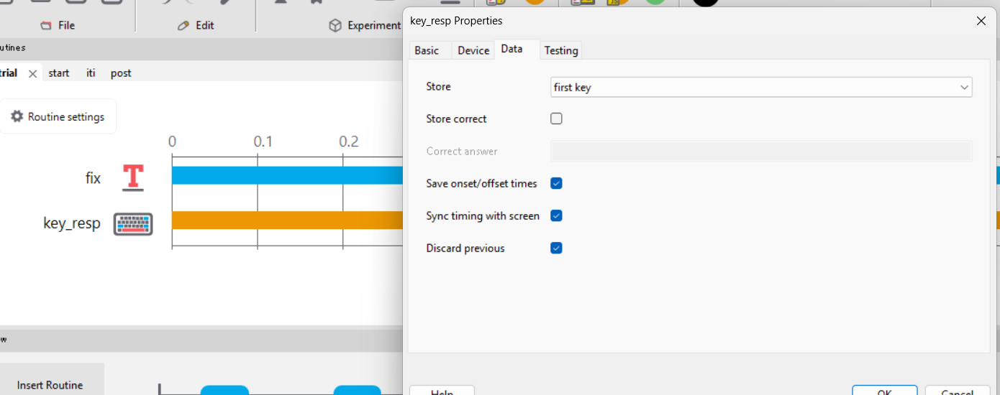

としておく．

3. post
回答受付の合図．
- Insert Routine → post
- post に Text（名前 fix_green）
- Text: +
- Color: green
- Start: 0
- Stop: 0.2（例：200 ms）
- post の Routine settings で Duration を 0.2s にしてもOK

4. 
試行と試行の間の休憩．
- Insert Routine → iti
- iti に Text（名前 fix_grey）
- Text: +
- Color: grey
- Start: 0
- Stop: 0.5（例：500 ms）

として，最後にFlowを下記に整える．

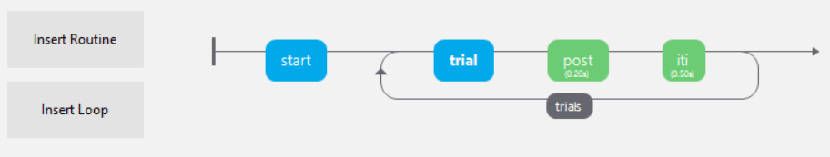

完成したら Pavlovian と Sync させて，もう一度 Pilot を立てます．すると実装した内容が反映されて，実験ぽい画面がちゃんと表示されるはずです．Syncの際，前回から時間がたっていると Pavlovia との連携が切れているかもなので再ログインが必要なこともあるので注意してください．

<video controls muted playsinline preload="metadata" width="720" style="background:#000">
  <source src="../figures/first_demo.mp4" type="video/mp4">
  このブラウザでは動画を再生できません（MP4のエンコード形式を確認）。
</video>

うまくいけばこんな感じ．課題は'Now!'が出たら space を押す，というだけのものです．その実行結果は以下のようなcsvでダウンロードされます．

| start.started | start.stopped | key_start.keys | key_start.rt | key_start.duration | participant | session | date                    | expName    | psychopyVersion | OS                   | frameRate   | trial.started | trial.stopped | key_resp.keys | key_resp.rt | key_resp.duration | post.started | post.stopped | iti.started | iti.stopped | trials.thisRepN | trials.thisTrialN | trials.thisN | trials.thisIndex | trials.ran |
| ------------- | ------------- | -------------- | ------------ | ------------------ | ----------- | ------- | ----------------------- | ---------- | --------------- | -------------------- | ----------- | ------------- | ------------- | ------------- | ----------- | ----------------- | ------------ | ------------ | ----------- | ----------- | --------------- | ----------------- | ------------ | ---------------- | ---------- |
| 0.0003        | 1.6105        | space          | 1.5892       | 0.0003             | hoge        | 1       | 2026-02-04_19h20.27.776 | Experiment | 2024.2.4        | Microsoft Windows 10 | 59.88023952 |               |               |               |             |                   |              |              |             |             |                 |                   |              |                  |            |
|               |               |                |              |                    | hoge        | 1       | 2026-02-04_19h20.27.776 | Experiment | 2024.2.4        | Microsoft Windows 10 | 59.88023952 | 1.6106        | 2.0445        | space         | 0.405       | 0.0               | 2.0446       | 2.5446       | 2.5446      | 3.0452      | 0               | 0                 | 0            | 0                | 1          |
|               |               |                |              |                    | hoge        | 1       | 2026-02-04_19h20.27.776 | Experiment | 2024.2.4        | Microsoft Windows 10 | 59.88023952 | 3.0452        | 3.0292        | space         | 0.2834      | 0.0               | 3.3291       | 3.5292       | 3.5293      | 4.0299      | 1               | 0                 | 1            | 0                | 1          |
|               |               |                |              |                    | hoge        | 1       | 2026-02-04_19h20.27.776 | Experiment | 2024.2.4        | Microsoft Windows 10 | 59.88023952 | 4.03          | 4.0138        | space         | 0.2836      | 0.0               | 4.3136       | 4.5139       | 4.514       | 5.0145      | 2               | 0                 | 2            | 0                | 1          |
|               |               |                |              |                    | hoge        | 1       | 2026-02-04_19h20.27.776 | Experiment | 2024.2.4        | Microsoft Windows 10 | 59.88023952 | 5.0145        | 4.9819        | space         | 0.267       | 0.0               | 5.2815       | 5.4818       | 5.4818      | 5.9825      | 3               | 0                 | 3            | 0                | 1          |
|               |               |                |              |                    | hoge        | 1       | 2026-02-04_19h20.27.776 | Experiment | 2024.2.4        | Microsoft Windows 10 | 59.88023952 | 5.9826        | 5.916         | space         | 0.2335      | 0.0               | 6.216        | 6.4164       | 6.4165      | 6.9171      | 4               | 0                 | 4            | 0                | 1          |
|               |               |                |              |                    | hoge        | 1       | 2026-02-04_19h20.27.776 | Experiment | 2024.2.4        | Microsoft Windows 10 | 59.88023952 | 6.9171        | 6.8342        | space         | 0.2169      | 0.0               | 7.134        | 7.3343       | 7.3343      | 7.8351      | 5               | 0                 | 5            | 0                | 1          |
|               |               |                |              |                    | hoge        | 1       | 2026-02-04_19h20.27.776 | Experiment | 2024.2.4        | Microsoft Windows 10 | 59.88023952 | 7.8352        | 7.8522        | space         | 0.2169      | 0.0               | 8.0521       | 8.2522       | 8.2523      | 8.753       | 6               | 0                 | 6            | 0                | 1          |
|               |               |                |              |                    | hoge        | 1       | 2026-02-04_19h20.27.776 | Experiment | 2024.2.4        | Microsoft Windows 10 | 59.88023952 | 8.753         | 8.8033        | space         | 0.2502      | 0.0               | 9.0033       | 9.2035       | 9.2035      | 9.7043      | 7               | 0                 | 7            | 0                | 1          |
|               |               |                |              |                    | hoge        | 1       | 2026-02-04_19h20.27.776 | Experiment | 2024.2.4        | Microsoft Windows 10 | 59.88023952 | 9.7043        | 9.788         | space         | 0.3002      | 0.0               | 9.988        | 10.1882      | 10.1882     | 10.689      | 8               | 0                 | 8            | 0                | 1          |
|               |               |                |              |                    | hoge        | 1       | 2026-02-04_19h20.27.776 | Experiment | 2024.2.4        | Microsoft Windows 10 | 59.88023952 | 10.689        | 10.763        | space         | 0.317       | 0.0               | 10.963       | 11.2064      | 11.2064     | 11.7071     | 9               | 0                 | 9            | 0                | 1          |

今回は10試行分のループにしたので，対応する数の行でデータが格納されているのが分かります．

## 本番の実験までの流れ
ここまでで基本的な使い方はOKです．本実験として進めるには，Pavlovia の status を `RUUNING` にして配布できる URL を作成し，CrowdWorks などに登録して募集・データ取得，Pavlovia から Results を一括ダウンロードという流れです．

前項まで，Pavlovia の status は Pilot だったので結果はローカルに保存され，サーバーには空データでした．本番では逆になります．URLも固定です．注意点として，**終了画面が出る前にタブを閉じられるとデータが保存されません．**

実際，pilot 段階でも実験の途中で終了してしまうと下記のように'aborted'になります．これはデータの取得が出来てない状態なので，被験者には強く念押しの必要があります．

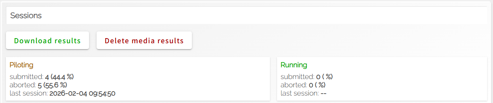

### 参加者照合のためのID
CrowdWorksでは，誰の提出かを後で照合できないと支払い処理ができないので，実験冒頭で CrowdWorks のワーカーIDやこちらで指定した実験参加者IDを `participant` に入力させる必要があります．

### 完了コード
CrowdWorks 側での仕事完了の提出のため，完了コードを日付やparticipant入力値から自動生成し，知らせるなどの工夫が必要になります．

### CrowdWorks の案件作成
必要人数や想定時間，報酬，対象条件，デバイスの指定など，なるべくクリアな実験データを取得するための情報を明記します．提出時には「作業完了報告」で実験終了時に発行した完了コードを貼らせます．

また，データクオリティを保つための「受理条件」も設定，説明しておきます．具体的にはたとえば極端に長いRT,極端な回答（全てYesなど）のデータが提出された場合には報酬が支払えないことなどを説明します．

アンケートの場合などは，逆転項目を使った一貫性の評価などで真面目に回答しているかを判定することも可能です．

なので実験の基本的な流れは，

1. 募集ページで研究内容，参加条件をよく確認してもらう
2. 同意書やアンケートに回答してもらい，問題なければ実験の説明を表示(このページの最後まで問題なく進んだ時点で Pavlovia URL を表示)
3. Pavlovia の実験 url へ移動
4. `participant` 欄にIDを入力してもらう
5. 実験参加
6. 実験終了時，発行された完了コードをコピーしてもらい
7. 参加者はCrowdWorksの作業報告にコードを貼って提出

となります．

### 実験データの確認と報酬支払い
実験が正常に終了された場合， Pavlovia のサーバーにデータがアップロードされます．研究者はこれらを一括ダウンロードし，「提出さｒた完了コード」に対応する行が存在するかを確認します．

対応する行が確かにあり，試行数やデータクオリティが受理条件を満たしていることを確認したら，その参加者からの作業報告を CrowdWorks 上で「承認」します．これにより CrowdWorks 上で決済フローへ進み，報酬が支払われます．却下の場合には支払われません．

この事情により，実験時に入力させる ID は CrowdWorks ID を使わせると照合が楽になります．また完了コードにも participant ID を参照することがおすすめです．

