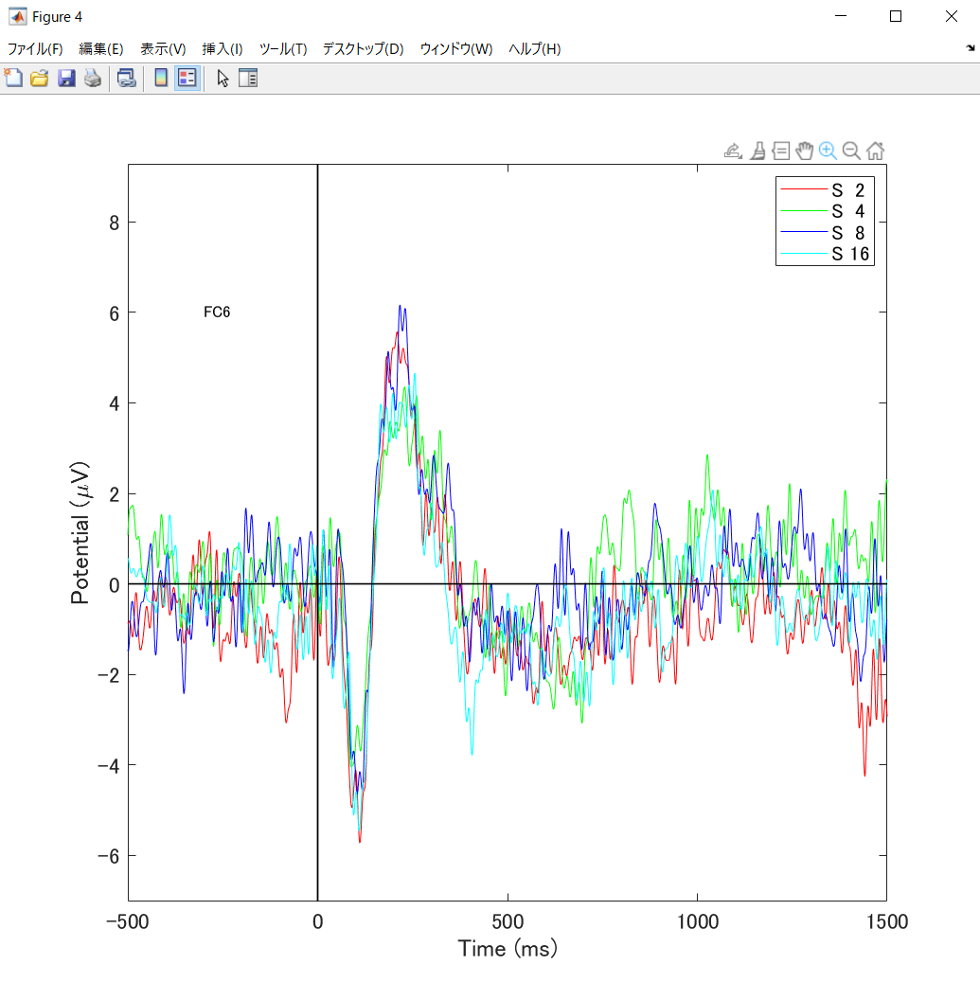
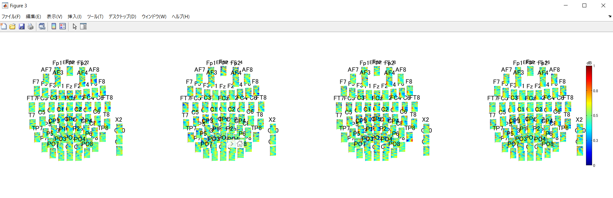
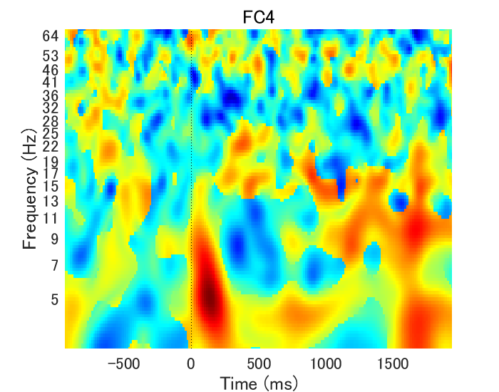

---
html:
  embed_local_images: false
  embed_svg: true
  offline: false
  toc: true

print_background: false

export_on_save:
  html: true
---

  <table class="fixed-table">
    <thead>
      <tr>
        <th class="mokuji">目次</th>
        <th>

 Math 
<ul class="gnav">

基礎数学編

        <ul class="index">
        <li><a href="../../Math/Basic/basic.html">ホーム</a></li> 
        <li><a href="../../Math/Basic/multiplication.html">掛け算</a></li>     
        <li><a href="../../Math/Basic/trigonometric.html">三角関数</a></li>
        <li><a href="../../Math/Basic/complex.html">複素数</a></li>
        <li><a href="../../Math/Basic/calculus.html">微分・積分</a></li>
        <li><a href="../../Math/Basic/linear_algebra.html">線形代数</a></li>
        <li><a href="../../Math/Basic/statistics.html">基礎統計</a></li>
        </ul>

        <ul class="gnav">

信号処理編

        <ul class="index">
        <li><a href="../../Math/Analysis/Analysis.html">ホーム</a></li> 
        <li><a href="../../Math/Analysis/fourier.html">フーリエ変換</a></li>
        <li><a href="../../Math/Analysis/wavelet.html">wavelet変換</a></li>
        <li><a href="../../Math/Analysis/hilbert.html">ヒルベルト変換</a></li>
        <li><a href="../../Math/Analysis/eeg.html">基本の脳波解析</a></li> <li><a href="../../Math/Analysis/phase_analysis.html">位相同期解析</a></li>
        </ul>

        <ul class="gnav">

統計編

        <ul class="index">
        <li><a href="../../Math/Statistics/Statistic.html">ホーム</a></li> 
        <li><a href="../../Math/Statistics/distribution.html">確率分布</a></li>
        <li><a href="../../Math/Statistics/central_limit_theorem.html">大数の法則と中心極限定理</a></li>
        <li><a href="../../Math/Statistics/statistic.html">統計量と標本分布</a></li>                                                         <li><a href="../../Math/Statistics/test.html">統計的検定</a></li>
        <li><a href="../../Math/Statistics/anova.html">分散分析</a></li>
        <li><a href="../../Math/Statistics/logistic_regression.html">ロジスティック回帰</a></li>
        </ul>

        <ul class="gnav">

その他

        <ul class="index">
        <li><a href="../../Math/Others/Others.html">ホーム</a></li> 
        <li><a href="../../Math/Others/ICA.html">独立成分分析</a></li> 
        <li><a href="../../Math/Others/CCA.html">正準相関分析</a></li>
        <li><a href="../../Math/Others/lagrange.html">ラグランジュの未定乗数法</a></li>
        <li><a href="../../Math/Others/Entropy.html">エントロピーと分布間距離</a></li>
        <li><a href="../../Math/Others/signal_detection.html">信号検出理論</a></li>
        </ul>

        
</th>
        <th>

 Analysis 

        <ul class="gnav">

EEGLAB

        <ul class="index">       
        <li><a href="../../Analysis/eeglab/eeglab.html">ホーム</a></li>                           <li><a href="../../Analysis/eeglab/setup.html">環境構築</a></li>
        <li><a href="../../Analysis/eeglab/import.html">データのインポート</a></li>
        <li><a href="../../Analysis/eeglab/prepro1.html">基本的な下処理</a></li>
        <li><a href="../../Analysis/eeglab/prepro2.html">発展的な下処理</a></li>
        <li><a href="../../Analysis/eeglab/analysis1.html">単被験者での解析</a></li>
        <li><a href="../../Analysis/eeglab/analysis2.html">被験者群での解析</a></li>
        </ul>

        <ul class="gnav">

MNE-python

        <ul class="index">
        <li><a href="../../Analysis/MNE/MNE.html">ホーム</a></li>
        <li><a href="../../Analysis/MNE/import.html">データのロード</a></li>
        <li><a href="../../Analysis/MNE/preprocessing.html">前処理</a></li>
        </ul> 

</th>
        <th>

 Experiment 

        <ul class="gnav">       </ul> 
</th>
        <th>

 Simulations 

        <ul class="gnav">

環境構築

        <ul class="index">
         <li><a href="../../Simulation/Setup/Setup.html">ホーム</a></li>
        <li><a href="../../Simulation/Setup/environment.html">Python環境構築</a></li>
        <li><a href="../../Simulation/Setup/gpu.html">pythonでのGPUセットアップ</a></li>
        <li><a href="../../Simulation/Setup/jupyter.html">Jupyterセットアップ</a></li>
        <li><a href="../../Simulation/Setup/julia.html">Juliaセットアップ</a></li>
        </ul>

        <ul class="gnav">

非線形力学

        <ul class="index">
        <li><a href="../../Simulation/NonlinearDynamics/Nonlinear-dynamics.html">ホーム</a></li>
        <li><a href="../../Simulation/NonlinearDynamics/dynamics.html">力学系とは</a></li>
        <li><a href="../../Simulation/NonlinearDynamics/stability.html">線形安定性解析</a></li>
        <li><a href="../../Simulation/NonlinearDynamics/stability_nonlinear.html">非線形系の安定性解析</a></li>
        </ul>

        
</th>
      </tr>
    </thead>
  </table>

<h1>04基本の脳波解析</h1>

フーリエ変換とウェーブレット変換が理解できれば，ひとまず時間周波数解析の話は出来るようになります．ここでは，これらに比べると少し特殊ですが同様によく使う変換である，ヒルベルト変換について確認します．

<!-- @import "[TOC]" {cmd="toc" depthFrom=2 depthTo=4 orderedList=false} -->

<!-- code_chunk_output -->

- [基本の脳波解析](#基本の脳波解析)
- [ERP](#erp)
- [周波数解析](#周波数解析)
- [時間周波数解析](#時間周波数解析)
- [まとめ](#まとめ)

<!-- /code_chunk_output -->

## 基本の脳波解析

脳波の解析は主に三種類の情報を使います．というのも，得られた解析信号から取り出せる情報量が時間，パワー，周波数，位相，の4次元だからです．このうち時間については解析もくそもないので，残り3つが脳波の解析対称というか材料になります．それぞれ時間変化を見るか見ないかがあると考えれば，6種とも言えますかね？

まずパワーについての解析．これは時間を見ないのはちょっと意味がわからないですが，あるとしたら.........んー，やはり思いつかないです．あったら教えてください．

## ERP
パワーや振幅についての時間変化を見るのが，いわゆる事象関連電位(ERP)などの手法です．

たとえば，上の図はある4条件の刺激時の脳波を，電極FC6についてERPをプロットした図です．といっても，この図からは条件間の差はあまり見れなそうなので，**刺激全体に共通して，刺激から150ms後くらいに負の電位が出て，300ms後くらいに正の電位が，それぞれ強く出る**ということなんかが議論できます．

聴覚刺激の実験時脳波なので，音が入力された時に出る反応，といったところでしょうか．昔むかしならこれだけでも論文になっていると思いますが，今ERPを使うとなると，条件間の差だったり，もっと深い議論が必要になります（そもそもERPだけでは神経科学の文脈ではなかなか厳しいものがあると思いますが．）

具体的な計算方法を確認しましょう．脳波を$x$，試行を$k$，タイムポイントを$t$，電極を$n$とすると，ある電極$n_1$のERPは

$$
  ERP_{n_1}(t) = \frac{\sum_k^K x_{k,n_1}(t)}{K}
$$

のような式に表せると思います．この式はあくまで多分って感じで，どこかに載ってたとかじゃないので気持ちだけで考えてください．

ようは$K$回の試行分，取られた脳波$x(t)$を加算平均したものですね．一応，実際の脳波データは試行ごとではなく実験中全体を通して取得されていると思うので，刺激呈示のタイミングでトリミングして時間を揃えるなどの処理が前処理として必要になります．

ERPの意味を考えます．毎回同じような波形が得られていた場合はその形に収束するし，毎回違う波形が得られている場合はERPはほぼフラットになります．平均を取っているから当たり前ですね．

なので解釈としては，「この処理をしている時は電極$n_1$(or 領域A)で○○ ms後に大きな電位が見られる！きっと課題に関係があるはず！」だったり逆に「処理中の脳波なのにフラットってことはこの領域は今回のタスクには関係ないようだ」なんて事になります．

ちなみに脳波の電位は同期的に活動している細胞数とニアリーイコールなので，ERPから同期活動の目星をつけるなんてこともしてる人がいるようです．

あとERPはとにかくその領域が処理に関係あれば乗るはずの活動なので，脳波を得たらまずはERPを見て，ちゃんとデータが取れているかを確認すると良いと思います．視覚刺激を入れてるのに後頭でERPが出ないとなると，計測やデータの前処理など，何かがミスっているはず，などといった使い方です．

## 周波数解析
周波数解析はもう分かりますね．特定の時間窓を区切って，その脳波に含まれていた周波数成分を抜き出してくる議論の方法です．短時間フーリエなどを使います．

「タスクＡをやる時にはどこどこの電極で○○帯域が強くでるけど，タスクＢだとでない．むしろ△△帯域が強くなる！」のような議論ができます．これはERPよりは多少発展だけど，まだまだ古いというか単純なので，これも同様に単体で論文だせるような時代ではないですね．

## 時間周波数解析
周波数解析の時間変化を確認するバージョンです．短時間フーリエの繰り返しや，ウェーブレット変換を使ったりして行います．周波数成分の特性が時間によって変化していく過程を見れるので，持続時間だとかタイミングだとかで議論をすることが出来ます．タスクがユニークだったり，学士や修士の卒論くらいだったらここまででも普通に論文で見るくらいの解析です．EEGLABとかなら数学やプログラムが分からなくてもボタン押してるだけでここまで出来ます．

上は時間周波数解析を，4条件それぞれの脳波から各電極毎に行った図．全ての電極の時間周波数プロットが小さく表示されています．どれか一つを拡大すると，

このようになっています．横軸が時間，縦軸が周波数です．この図だと，刺激呈示直後と1500msあたりに低周波に強い活動が見られます．あとは750msのあたりにも何かぼんやりと見えますね．

とは言っても，この図だけだとなかなか議論が難しいので，刺激の時系列情報や，脳が行うと思われる処理の内容と関連付けて解釈をしていきます．たとえばこの課題では，1500msの聴覚刺激を呈示していたはずです．音の立ち上がりと立下りに反応したのが0,1500msあたりの活動ぽいですね．

## まとめ
基本の解析についてはこんなものでしょうか．詳しい使い方などについては別途，[解析](../../Analysis/Analysis.html)説明しているのでそちらを参照ください．

次に，これらの手法に比べればもう少し発展的な，位相解析について学びます．

【[次へ](../Analysis/phase_analysis.html)】

