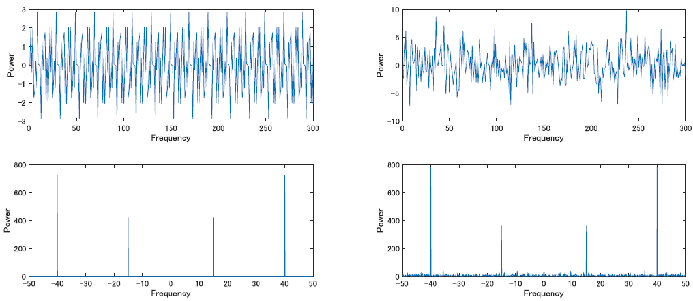

# フーリエ変換

ここでは脳波解析の初歩というか基本．フーリエ変換を学習していきます．基本中の基本というか，これがないと何も解析ができないので頑張りましょう．と言っても，材料は既に[基礎数学編](../Basic/0Basic.html)の方で抑えてあるので，あとは数式を変形したりして学び，実践に使う準備をするだけです．

## オイラーの公式
まずはオイラーの公式の導出からいきます．

基礎数学編では証明を避けつつ，随所に登場させてきたので覚えてはいるかと思います．が，フーリエ変換を理解する上での骨子となる概念ですので，ここで確認しておきます．

やや直感的に分かりにくい公式であるため, 導出より先にその利便性, 利用のされかたに触れてきました．簡単に言うと，三角関数の足し合わせを指数関数の形で表すことが出来る，というものでした．

改めて, オイラーの公式を眺めてみましょう.

$$
\mathrm{e}^{i\theta} = \cos\theta + i\sin\theta
$$

しっかりと理解するため，まずはこいつをちょっと解剖してみます. 数学語を日本語に翻訳すると, おそらくこんな感じになります.

> 指数関数 $\mathrm{e}^x$ の $x$ に角度 $\theta$ を代入し, 虚数単位 $i$ をかけたもの(左辺)が, $\sin$ と $\cos$(こちらも虚数単位 $i$ をかけたもの) の足し算で表した何らかの値と同じ値を表している.

基礎数学編をクリアしていれば，ここまでは良いかと思います．ただ，そうは言っても理解は難しいですよね．いろんな疑問があります．

- なぜ指数関数が三角関数で表せるのか？
- 三角関数の足し合わせってなんだよ？
- 指数関数を虚数にするってなんだよ？？

これらの疑問を解消するため，少しずつ見ていきましょう．

### マクローリン展開
さて, 一旦オイラーの公式は忘れてみましょう.

大学で学ぶ数学, とりわけ微分積分において最初に我々が躓く単元に, テイラー展開・マクローリン展開があります．オイラーの公式は, このマクローリン展開さえ分かれば一瞬で導出する事が可能です．なのではじめに，マクローリン展開について簡単に確認します．

マクローリン展開

無限回微分可能な関数 $f(x)$ について

$$
f(x)  = f(0) + f'(0)x + \frac{f''(0)}{2!}x^2 + \frac{f'''(0)}{3!}x^3 ...\\
= \sum_{k=0}^\infty f^{(k)} (0) \frac{x^k}{k!}
$$

を $f(x)$ のマクローリン展開という．また，マクローリン展開は $f(x)$ の $0$ 周りでのテイラー展開である．

ぱっと見は分からないかも知れませんが，冷静に見てみると，元関数 $f(x)$ を多項式の形で近似しているものだということが分かります．展開，とは多項式に分解，展開するという意味を表すわけですね．ちなみに，定義からマクローリン展開はテイラー展開の特殊形だと分かります．

ここで使われる多項式は, 元関数 $f(x)$ を $x=0$ に固定し，$0,1,2,3...$ と階数を増やして行った高階微分係数から定まっています．

では，何故こんなことをわざわずするのか，この式の何が凄いのかというと, 局所的なある一点 (ここでは $x=0$) での振る舞いだけをみれば元の関数がわかるというところにあります．

言い換えると，$x=0$ の時に最も元関数っぽい一次関数, 二次関数, 三次関数...と $\infty$ に足し合わす事で元関数を表そうって事です．

テイラー展開とは, この時の $x$ の値が $0$ じゃなくてどこでもいいってやつで, マクローリン展開は $x=0$ に限ったものの事です.

### 指数関数と三角関数のマクローリン展開

定義だけ説明されてもやはりよく分からないと思いますので，図で確認すると同時に，この後のオイラーの公式の導出につなげていきます．ということで指数関数と三角関数 $(\sin, \cos)$ $マクローリン展開を見てみましょう．

#### 指数関数

$$
\mathrm{e}^x = \sum_{(k=0)}^\infty \frac{x^k}{x!} = 1 + \frac{x}{1!} + \frac{x^2}{2!} + \frac{x^3}{3!} + ...
$$

#### sin関数

$$
\sin x = \sum_{k=0}^{\infty}(-1)^k \frac{x^{2k + 1}}{(2k + 1)!} = \frac{x}{1!} - \frac{x^3}{3!} + \frac{x^5}{5!} - \frac{x^7}{7!} +  ...
$$

#### cos関数

$$
\cos x = \sum_{k=0}^\infty(-1)^k \frac{x^{2k}}{(2k)!} = 1 - \frac{x^2}{2!} + \frac{x^4}{4!} - \frac{x^6}{6!} + ...
$$

多項式での近似なので，高階微分が増えるごとに精度が良くなっていく過程が確認できるかと思います．これがマクローリン展開です．さて，ではオイラーの公式に行きたいのですが，上の式を見比べてみるとなんとなくsinとcosの式を足すと，指数関数の式に似ていることが分かるでしょうか．

#### オイラーの公式

$$
\mathrm{e}^{i\theta} = \cos\theta + i\sin\theta
$$

実際，オイラーの公式も $\sin$ と $\cos$ を足すと $\mathrm{e}$ の形になることを表しています．気になるので，どうにかいじって等号で結べないか確かめてみます．とりあえず足してみましょう.

$$
\mathrm{e}^x = \sum_{(k=0)}^\infty \frac{x^k}{x!} = 1 + \frac{x}{1!} + \frac{x^2}{2!} + \frac{x^3}{3!} + \frac{x^4}{4!} + ...
$$

$$
\sin x + \cos x = 1 + \frac{x}{1!} - \frac{x^2}{2!} - \frac{x^3}{3!} + \frac{x^4}{4!} + ...
$$

やはり似ています．この時点で，違いは符号だけです．2項ずつ, 符号があってたりあってなかったりしています．

しかしよく考えてみましょう．それぞれの項はn乗になっています. 2の倍数乗した時に符号が変わればいいのですから, ここで虚数単位iの導入に目星をつけます．虚数は2乗すると$-1$になる数でした．

とりあえず指数の方に虚数単位をかけてみましょう.

$$
\mathrm{e}^{ix}
= \sum_{(k=0)}^\infty \frac{ix^k}{x!} = 1 + \frac{ix}{1!} + \frac{i^2x^2}{2!} + \frac{i^3x^3}{3!} + \frac{i^4x^4}{4!} + ...\\
= 1 + i\frac{x}{1!} - \frac{x^2}{2!} - \frac{ix^3}{3!} + \frac{x^4}{4!} + ...
$$

次に, 三角関数の足し合わせの方ですが，分母が奇数の時に $i$ が残ってしまっているので, 奇数に対応している $\sin$ の方に $i$ をかけてみます．

$$
i\sin x = \sum_{k=0}^{\infty}(-1)^k \frac{ix^{2k + 1}}{(2k + 1)!} = \frac{ix}{1!} - \frac{ix^3}{3!} + \frac{ix^5}{5!} - \frac{ix^7}{7!} +  ...
$$

問題なさそうですね．改めて $\cos$ と足してみましょう．

$$
\cos x + i\sin x = 1 + i\frac{x}{1!} - \frac{x^2}{2!} - \frac{ix^3}{3!} + \frac{x^4}{4!} + ...
$$

先程の指数関数の式と見比べると, 見事に一致しています．これでオイラーの公式の証明は完了です．それぞれの関数のマクローリン展開が何故この式の形になるのかの導出は省いてしまいましたが，それを踏まえれば簡単でしたね．

オイラーの公式の証明は何通りかあるようですが,ここでは指数関数と三角関数をマクローリン展開した際に式を見てみると類似していたので，虚数単位$i$を導入して比較してみると等号が成り立つ，というものでした．

### オイラーの公式の有用性
オイラーの公式とは

$$
\mathrm{e}^{i\theta} = \cos \theta + i\sin \theta
$$
でした.

この時, $\theta$ に $\pi$ を代入すると, 更に綺麗な形になるので，こちらの表記も多く見ます.

$$
\begin{align}
\mathrm{e}^{i\pi} = -1 + 0\\
\mathrm{e}^{i\pi} + 1 = 0
\end{align}
$$

実際，角度が $\pi$ の時は $\cos$ が $-1$，$\sin$ が $0$ になるので足すと $-1$ ですから，たしかに成り立つのが分かると思います. 

最も基本である数字 $0$ と $1$, そしてネイピア数, 円周率, 虚数...
数学において偉大と言われる奴らが一堂に会して, あっさりとまとまっていることから，オイラーの公式が人類の至宝などとも言われます．とても綺麗ですね．

オイラーの公式はこのように，三角関数を実数と虚数で足し合わせた時，指数関数に変換できますよというものでした．この性質を使って，次節以降のフーリエ変換が行われます．

## フーリエ変換
いよいよ本節から実際に我々が脳波と戦う際に用いる技の紹介となっていきます. 基礎が理解できていれば, それほどつまずく事もないはずです. 実際筆者は, これまでの内容の理解に非常に時間をかけましたが, これ以降はそれほど時間をかけずに理解を進める事が出来ました. 基本を忘れなければ大丈夫です．数式はどんどんいかつくなりますが，落ち着いて臨んでください．部分部分は既に知っている数式の組み合わせになっているはずです．

### 脳波とは

　そもそも, 解析方法を考える以前に...
　我々は脳波という似非科学チックなものと対峙するわけですが, こいつの特性を知らずに武器を準備するのは非効率ですね. まずは脳波というものがどういったものなのかを考えてみます. 

　脳波とは, 脳に無数に存在する脳神経細胞が刺激を受け, その総量が閾値を超えた時に発生される電気信号 ... の集合体みたいなものでしたね．分からない人はまずそっちを勉強してきてください．

　領域 A に脳細胞が 100 万個あったとしましょう. 

　そのうち, 70 万個が発火していて, 30万個が沈黙していたとします. 領域A直上にある脳波計の電極は, そこら一帯の電気的活動の総和を観測し, 領域Aで強い活動があったと記すわけです．

　この時の「強い活動」というのは, 電極で計測された電気信号の振幅, 100万の細胞電位の総和の値です. 一番素朴に考えると，これが大きい程, 強い活動という解釈がされます．まぁ実際は，ノイズの影響も大きいし電極の抵抗値が変動することの影響などもあるので，こんな単純な議論はなかなかしませんが．

しかし, 元来神経細胞の1回の発火は一瞬のものです. 2つの細胞があったとして, それらが数ms間隔で交互に活動しているとしたら, 片方が発火している間にもう片方は負の方向に電位を発しているわけですから, その総和を取ると細胞1個の発火分にも満たない事になります. これらの計測値が大きな値を取るためには，細胞同士が同期的に活動している必要があります．

これは当然, 数百万単位の細胞が集まった時にも同じ事が言えて, 振幅が小さいからといって脳が活動していない ... という訳ではありません. 単に同期的活動を行っているわけではないという事です.

本来はパルス波っぽい挙動をする神経信号ですが, それらが無数に存在し, 各々のタイミングで活動をしているため, 脳波計の電極によって計測される総和信号は連続的で, 非常に複雑な挙動を取る波となります. 

この波を俗に脳波と言い, 振幅が大きい時には強い活動 (正確には同期した活動) が行われていて, 逆に振幅が小さい時には同期していない, つまりばらばらな活動を行っているといった解釈がなされたりします. 

しかしこのままでは, 複雑すぎて人間の目で見たら何がどうなっているのか全く分からず, 麻酔科医やてんかんの診断をする医者のような特殊な例でもない限り, 「これは○○の脳波だ！」などと言うことはなかなか出来ません. そこで我々は, どうにかしてこのノイズまみれで複雑な挙動をする脳波を解釈し, 脳でどのような活動が行われていたのかを推察する必要があります.

そこで, 最も基礎となるアプローチが...

> 複雑すぎて分からないなら, 単純な波に分解してあげればいいじゃん？？

という発想に基づくものです. どんな信号も, 直交性をもつ波の足し合わせに分解できるみたいな話題が基礎編にありましたよね？あれを利用します．

こうして, 複雑極まりない脳波を, 単純で解釈のしやすい三角関数の足し合わせとして表現しよう！というのが(脳波屋さんにとっての)フーリエ変換のモチベーションです.

上の画像では，一番上のAの脳波が元々の計測信号であり，そこからフーリエ変換による周波数分解によって得られた周波数帯域毎の活動をプロットしたものが表示されています．このように，周波数を分解して議論することが出来るようになるのがフーリエ変換のメリットです．

また，これはやや天下り的ですが，実際脳波は周波数帯域によって司る機能や処理が異なっているといったことが広く言われており，信号の分解による判読性の向上のみでなく，脳機能の理解という意味でも重要な過程となります．

### フーリエ級数展開
さて, フーリエ変換をする目的は, 複雑すぎて解釈できない信号を単純な関数によって表現することでした.

複雑な関数でも, 三角関数の足し合わせで表現できるという事は既に確認しましたね. 脳波のような信号も，時間で変動する 1 次元の値(電位)を記録しているので，時間の関数であると考えることが出来ます．よって，この手法が適用可能です．

三角関数についておさらいすると，その特徴は, 振幅と角周波数だけで定義する事ができる振動的な関数でした. 

角周波数とは, 1s の間にどれだけの角度波が進むかという指標で, 周波数から求める事が出来ます. まあ周波数って考えちゃっても大体おｋです. 

つまりフーリエ変換とは, 複雑な元関数を単純な三角関数の足し合わせと考え, それぞれの振幅を角周波数毎に求める事をさします.

このうち, 元関数 $f(t)$ を単純な三角関数の足し合わせに分解するまでをフーリエ級数展開と言い, 式では以下のようになります. 

$$
f(t) = a_0 + \sum_{\omega=1}^\infty {(a_\omega \cos(\omega t) + b_\omega \sin(\omega t))}
$$

この式の意味は「元関数 $f(t)$ を, $1$ から $\infty$ の角周波数 $(\omega)$ の $\sin, \cos$ 波の足し合わせとして表現する」となります．そのまんまですね．

ここでの $a$ や $b$ はその周波数の波の大きさを決める変数で, それぞれの項毎に異なる値を取ります. 要は振幅の事ですが，今はいまいち分からないかもしれないので，後ほど確認します．

### 複素フーリエ級数

しかし, フーリエ級数展開の式は $\cos$ 部分と $\sin$ 部分を訳て計算する必要があり，その上無限の足し算になるので面倒です. もう少しシンプルな形で表してみましょう．

そこでオイラーの公式を使うわけです．オイラーはまさに，$\cos$ と $\sin$ の足し算をまとめた形でした．

$$
\mathrm{e}^{i\omega t} = \cos\omega t + i\sin\omega t
$$

いつもは角度 $\theta$ が入っているところですが, 今回は脳波の説明からここまでに使用している角周波数 $\omega $ × 時間 $t$ に変形しています. 角周波数 ($\theta/t$) に時間 $(t)$ をかけてるんだから，その時間 $t$ の時の角度 ($\theta$) です．

しかし，ここで一つ問題があります．オイラーの公式には $i$ がありますが, フーリエ級数展開の方には $i$ がありません. このままでは，微妙に似ているが違う形なので指数関数を使ってフーリエ級数展開の式を簡略化することが出来ません．

正直，自分はここの発想が出てこずに時間がかかった記憶がありますが，ここでは早速答えを確認しましょう．

オイラーの公式の裏，のようなものを使います.

$$
\mathrm{e}^{-i\omega t} = \cos\omega t - i\sin\omega t
$$

この式が成り立つのは大丈夫でしょうか．角度が実軸対称に飛んだら, $\cos$ 成分は変わりませんが $\sin$ 成分は符号が反転します. 極座標の絵を描いてぐるぐるしてみれば分かると思います．

さて, 次に普通のオイラーの公式と今の変形版を連立して解いていきます．

$$
\begin{align}
\cos\omega t = \mathrm{e}^{i\omega t}- i \sin\omega t = \mathrm{e}^{-i\omega t}+i\sin \omega t\\
\therefore \sin\omega t = \frac{\mathrm{e}^{i\omega t}-\mathrm{e}^{-i\omega t}}{2i}
\end{align}
$$

こんな感じです．$\cos$ の方も同様にして求めて，フーリエ級数展開の $\cos$ と $i\sin$ を置換すると

$$
f(t) = a_0 + \sum_{\omega=1}^\infty {(a_\omega \frac{\mathrm{e}^{i\omega t}+\mathrm{e}^{-i\omega t}}{2} + b_\omega \frac{\mathrm{e}^{i\omega t} - \mathrm{e}^{-i\omega t}}{2i})}
$$

このような形で表せます．さらにこの式を同類項を抜き出して整理すると

$$
f(t) = a_0 + \sum_{\omega=1}^\infty {(\frac{a_\omega - ib_\omega}{2}\mathrm{e}^{i\omega t})} + \sum_{\omega=1}^\infty {(\frac{a_\omega + ib\omega}{2}\mathrm{e}^{-i\omega t})}
$$

となります．$i\sin$ の方は分母をそろえるため，分母分子両方に$i$をかけてあげればこうなるはずです．

更に $\mathrm{e}^{-i\omega t}$ において $\omega$ を $1$ から $\infty$ まで足すのと, $\mathrm{e}^{i\omega t}$ において $-\infty$ から $-1$ まで足すのは同義なため(図を書けばわかる), $e^{-i\omega t}$ の方を $e^{i\omega t}$ に揃えることでこの3項をうまくくっつけると

$$
f(t) = \sum_{\omega = -\infty}^\infty F_\omega \mathrm{e}^{i\omega t}
$$

とおけます．ここで定数部分はまとめて $F_\omega$ とおいてます. だいぶ簡素な形にまとめることが出来ました．

ここまでがフーリエ級数展開です．いよいよ次で確認するフーリエ変換とは, この係数たちを求める作業のことを指します. 

### フーリエ変換

まずは実際に式を見てみましょう.

$$
F(\omega) = \int_{-\infty}^{\infty} f(t)\mathrm{e}^{-i\omega t} dt
$$

です. さっそくこの式を解読してみましょう. 基礎がしっかりできている人なら自ずと理解できるはずです.

まず, eの肩に $ -i\omega t $ が載っていますね. この形はどこかで見た事があります. そう, オイラーの公式です．

正確には，オイラーの公式にマイナスをかけたやつです. つまり $ \cos\omega t  - i\sin\omega t $ ですね. 

オイラーの公式を使って数式を整理するのは先程フーリエ級数展開の時に使いましたが，ここはあえてもう一度分解することで理解を深めてみましょう．以下の式に変形できそうです.

$$
F(\omega) = \int_{-\infty}^{\infty} f(t)(\cos\omega t - i\sin\omega t) dt
$$

結構読めてきたんじゃないでしょうか.分配法則の分, 更に式を分解してみます.

$$
F(\omega) = \int_{-\infty}^{\infty} f(t)(\cos\omega t) - f(t)(i\sin\omega t) dt
$$

ここまで解してあげれば十分です．式を日本語にして読み解いてみましょう.

まず, 時間 $(t)$ における元関数(ここでは, ある電極で取れた脳波ですね)と, 角周波数 ($\omega$) の $\cos$, $\sin$ 成分それぞれとの内積を取っています. 

フーリエ変換において求めたい係数とは, 「元関数がその角周波数 ($\omega$) の三角関数に如何に似てるか」の指標です. そして関数の類似度の指標は内積で表せるんでしたね．一応，確認をしておきましょうか．

まずは，関数の内積を考えたときのように，イメージのしやすいベクトルで考えてみましょう．ベクトルの分解の場合には，係数を考えるのはとても簡単ですね．

$$
\left( \begin{array}{cc} 5\\ 3\\ \end{array} \right) = \alpha \left(\begin{array}{cc} 1\\ 0\\ \end{array} \right) + \beta \left( \begin{array}{cc} 0\\ 1\\ \end{array} \right)
$$

この時の $\alpha$ と $\beta$ の値を求めよ．簡単ですね．$\alpha = 5$, $\beta = 3$ とすぐに解けると思います．

ただまあ，こうやって感覚じゃなくて計算で求める場合には，下の式のようにする必要があります．

$$
\begin{align}
\alpha = \left(\begin{array}{cc} 5\\ 3\\ \end{array} \right)\left(\begin{array}{cc} 1\\ 0\\ \end{array} \right) = 5+0=5 \nonumber \\
\beta =  \left(\begin{array}{cc} 5\\ 3\\ \end{array} \right)\left(\begin{array}{cc} 0\\ 1\\ \end{array} \right) =0+3=3
\end{align}
$$

そう，内積です．ベクトルを直行成分に分解する際，係数を求めるには元のベクトルと分解先の「直行成分」との内積を求める訳です．

これを，例によって関数に拡張します．関数も結局は数列，ベクトルですからね．そう，フーリエ変換の式はまさに，元関数 $f(t)$ と複素指数関数との内積を計算することで，複素指数関数の係数，すなわち構成する三角関数の大きさを算出してるということになります．

次に, 指数関数の肩が負 ($\mathrm{e}^{-i\omega t}$) になっている理由を確認します.

基礎数学の方で確認したように，内積とはベクトル同士の「似ている度」の指標でした. 普通の数字やベクトルでしたらその内積は正の値になりますが, 今回のように虚数や複素数の場合は内積の結果が複素数の形をとってしまう事になります.

それだと解釈に困ります．3Hz成分には3+4iくらい似ている...などと言われても分かりません．どうにかして虚数成分は消えた感じの結果が欲しいということで，内積の計算の際に共役複素数を使います．

実際, 複素空間での内積の正しい定義は「共役複素数をかける」です. 今までは実数で考えていたので, 気にする事はありませんでしたが複素数の場合はこの方法に則る必要があります．たとえば，$(1,i)$ というベクトルの自分自身との内積をそのまま計算してしまうと，$1-1$ で $0$ になります．自分自身との似ている度を計算したのに，それが $0$ というのはおかしな話で，これは内積の満たすべき性質を損なっていることになります．

改めて，内積の定義をしておきます．

複素ベクトルの内積

2つのベクトル

$$
\bm{a} = \left[
\begin{matrix} a_1 \\ a_2 \\\vdots \\ a_n\end{matrix}
\right], \qquad
\bm{b}=\left[
\begin{matrix} b_1 \\ b_2 \\\vdots \\ b_n\end{matrix}
\right]
$$

に対する内積の定義は，$\bar{k}$ をベクトル $k$ の複素共役とし，

$$ 
(\bm{a}, \bm{b})=\sum_k^n a_k \bar{b_k} = a_1\bar{b_1} + a_2\bar{b_2} + \dots+a_n\bar{b_n}
$$

これを考慮すると，自分自身のとの積の計算方法はこうなります．

$$
\begin{align}
a = \left(\begin{array}{cc}3\\ -5i\\ 2+3i\\ \end{array} \right) \nonumber \\
(a \cdot a) = \sum_k^n a_k \cdot \bar{a_k} = \left(\begin{array}{cc}3\\ -5i\\ 2+3i\\ \end{array} \right)\left(\begin{array}{cc}3\\ 5i\\ 2-3i \end{array} \right) = 9 + 5 + 13= 27
\end{align}
$$

第一成分のように虚数成分を含まない場合には単純な掛け算でしたが，第二・第三成分のように虚数部分を含む場合は虚数成分だけ反転です．

つまり，今までやってた内積の計算方法はたまたま虚数成分がないからそのままかけてただけで，一般的な定義はこちらということですね．

これにより, ある角周波数成分 $\mathrm{e}^{i\omega t}$ が元関数 $f(t)$ にどれだけ含まれている，似ているかを計算する時には，$\mathrm{e}^{-i\omega t}$ と元信号の内積を用いるわけです．

内積の確認が出来たところで，改めてフーリエ変換の式を確認します．

$$
F(\omega) = \int_{-\infty}^{\infty} f(t)\mathrm{e}^{-i\omega t} dt
$$

ある角周波数 $\omega$ の信号と元信号との内積を，信号の $-\infty$ から $\infty$ の時間範囲で計算し，その総和が $F(\omega)$ となっています．内積の総和なので，元関数の中に角周波数 ($\omega$) の成分が多ければ多い程, $F(\omega)$ は大きくなります. 逆に値が小さいという事は内積の値も小さい ... つまり元関数の中に角周波数 ($\omega$) の成分は少ないという事になりますね．

こうした計算を，全ての周波数 $\omega$ で計算することで，時間関数 $f(t)$ だった脳波を，周波数関数 $F(\omega)$ に変換するのがフーリエ変換です．

実際には $F(\omega)$ のうち, 「$x_1Hz$ は成分が大きくて, $x_2Hz$ は成分が小さいね」といった事が分かるようになるわけです.

### フーリエ変換の実用

実際には, フーリエ変換によって無限の周波数成分を抜き出し, それぞれの振幅 (amplitude) もしくは power($amplitude^2$) を求める事で, 「元関数 $(t)$ はそれぞれの周波数をそれぞれの振幅倍した $\sin$ 波の足し合わせで出来ている」などと解釈します.

例えば, 「タスク 1 をやらせた時の被験者は 5 -- 7Hz くらいの脳波がよくでている」「タスク 2 の時には大して (5--7Hzのpowerが) 強くない．ということはタスク 1 と 5 --7Hz の脳波には何か関係がありそうだ」といった具合です. 

人はこれを周波数分解といい, これを使った解析が周波数解析だとかスペクトル解析と呼ばれる種々の解析になります（上の「」に入ってるのも周波数解析による解釈)．

画像は，三角関数を足し合わせて作った関数(左)へのフーリエ変換と，そこにノイズを加えた信号(右)へのフーリエ変換(下)です．

視覚的には，ノイズを印加することによって元々の周波数成分が壊れているように見えますが，フーリエ変換をすることで若干影響を受けつつも元々の成分が強く残っていることが確認できます．これが，脳波を解析する際に周波数分解したくなる理由そのものです．

なお，よく見ると負の周波数も出ている事が分かると思いますが，これはフーリエ変換がマイナス無限から無限の周波数に分解するために出てくるものです．実用上では，(周波数成分への分解という意味では)負の周波数は無視して良いです．

真面目に信号処理，というかフーリエ変換を勉強しようと思った場合にはだいぶ飛ばしちゃってるのでだめなところも多いかと思いますが，筆者的には脳波解析で使うだけの人はこんなくらいでも良いのかなと思いますので，フーリエ変換についての学習はここらへんで止めておきます．

もし気になったり，不満だったりする人は教科書をあたってみてください．