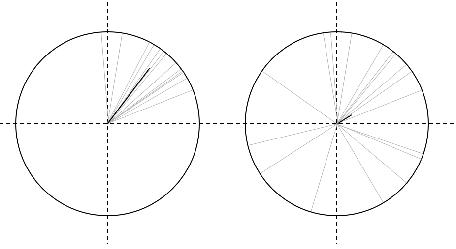
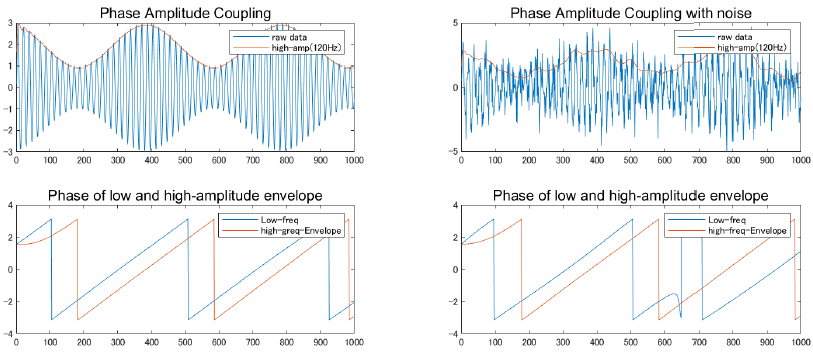

# 脳波の位相同期解析

周波数の解析は[フーリエ](fourier.html)や[ウェーブレット](./wavelet.html)を使って今までにも説明をしてきましたが，位相に関する話はほぼありませんでした．ここでは，脳波で扱える最後の次元，位相を使った解析手法に触れていきます．


## はじめに
位相とは，の説明は大丈夫だと思いますが，「脳波の位相」が何を表しているのかをまず考えていきます．

脳波の位相，はより正確には周波数分解した脳波のそれぞれの周波数についての位相，です．取り出すには複素数である必要があるため，まず[ウェーブレット変換](./wavelet.html)や[ヒルベルト変換](./hilbert.html)を用いて複素信号にします．

そしたら普通に `> angle(x)` のようにすることで，瞬時位相の時系列が取り出せます．

物理的には，それぞれの周波数を持った振動子として捉えられる神経細胞(群)ですが，これらは積分発火型の振動子です．つまり発火する直前くらいのタイミングで受け取った信号に対する反応性が高く，逆に発火した後の不応期とかだと低くなります (シナプス前細胞 Ａ からの信号だけじゃ発火しないし，発火するのは Ａ からの信号をもらったずっと後だからあまり影響がないみたいな)．この特性ゆえ，発火のタイミング，つまり位相が近い振動子同士ほど情報伝達がちゃんと起きるし，可塑性によって強化されてもいきます．

言い換えると，**同期的に活動している神経群同士は互いに影響を及ぼしやすく，それによって同期も強まる**という性質があると考えられます．

この考え方は，[Fries., 2005](https://doi.org/10.1016/j.tics.2005.08.011)なんかで言われていることですね．さらに，[Okun., et al. 2008](https://doi.org/10.1038/nn.2105)などで言われるような興奮性/抑制性の均衡のことなんかを考慮すると，尤もらしい説明に聞こえます．

この前提ゆえに，異なる複数領域の脳波で同期が見られたりした場合，それらの領域は network を形成している，情報のやりとりが行われている，などと考えるのが位相同期解析の基本的な方針です．

あるいは，同じ情報を処理しているのだったら同調したように活動しているはずだよね，という考え方も取られます．が，個人的には上述のような説明の方が妥当というか説得力があるような気がします．

ともあれ，さっそく解析を見ていきましょう．


## 試行間位相同期
位相同期は，何と何の位相が同期しているのかで種類が分けられます．まずは基本の，特定電極の試行間での位相同期を見ます．[ERP](../../Analysis/erp.html) の位相版って感じです．

毎回同じような反応を示す，つまり毎試行位相がそろっているようなものであれば良い結果，そうでなければ微妙な結果が出る解析です．名前は厄介なことに何通りもあって，全部同じ事なのにみんな好き勝手呼んでいます．

Phase-Locking Index (PLI), Phase-Locking Factor (PLF), Inter Trial Coherence (ITC), Inter Trial Phase Coherence (ITPC) などがあります．やめてほしい．そういいつつ筆者も気分で言い分けてる気がします．ごめんなさい．式は

$$
  ITPC(t) = |\frac{\sum_{k=1}^K exp(i \phi_k^f(t))}{K}|
$$

のようになります．ERP 同様，$k$ は試行数，$t$ はタイムポイントで，$f$ は周波数，$i$ は虚数単位，それから $\phi$ は瞬時位相になります．瞬時位相はヒルベルト変換などで求めた解析信号の位相時系列のうちタイムポイント $t$ に対応する値です．

簡単ですね．波形 $x(t)$ そのものの加算平均をする ERP に対し，今回は解析信号の位相に着目して加算平均（正確には複素指数の平均ベクトル長）を計算しているわけです．

結果は0–1の値を取り，試行間で位相がそろっているほど 1 に近付き，そうでないと 0 に近付きます．複素数というか極座標表示なので，加算平均しないで一つのトライアルのみで絶対値を取ると当然1です．

複数の複素指数で加算平均しても 1 に近い値になるのなら同期しているよね，とする解析です．ただ，値自体は試行数によっても変動するので大小の比較とかは難しく，差があるかどうかは数値でなく統計的議論をする必要があります．この点は後ほど詳しく見ます．

<center></center>

上の図が概念図です．それぞれの試行のデータが極座標上の灰色の複素ベクトルで示されています．これらの加算平均したもの，位相同期度が黒の太線で描かれています．左の図は，試行間である程度位相が揃っているので，黒線が長い，つまり同期度が高くなっている一方，右の図はばらばらになっているため，同期度が低くなっています．

特性として，計算の際に振幅は考慮しないために位相のみに影響され，振幅が大きかったり小さかったりしても影響を受けないという点があります．expの前に振幅はついていませんよね．

だからこそ綺麗に同期していれば1になります．これゆえ，$\alpha$ 波などの大きな波に埋もれた小さな $\gamma$ 波の位相が同期しているような状態でもしっかりと検出する事が出来ます．

ただ解釈は (個人的には) ちょっと難しい気がして，ERP 同様に「だからなに？」になりかねないというか，位相が試行間で揃うこと自体が重要だとするような上手な説明が求められるような気もします．

論文としては位相同期を見るのはここ最近でもまだトレンド的なものではありますし，学士の卒論とかでここまでやってれば結構いい感じなんじゃないですかね．

[実際の解析](../../Analysis/Methods/ITPC.html)


## 部位間位相同期
こっちの方が個人的にはしっくりきます．部位間での位相同期です．基本的には，試行間位相同期の発展的な式なのですぐ理解できるかと思います．名前は Phase locking value (PLV) とか Phase Synchronisation Index (PSI) などと言ったりしますが，これも論文によってみんな名前がてきとうすぎて，部位間なのか試行間なのか分かりにくいです．

筆者のラボはそれゆえ，Phase Synchlony Index (PSI)を採用しています．最近筆者も慣れてきましたが，これなら Synchrony なので部位間同期の方だな，と分かりやすいので確かに便利です．

式は下記です．

$$
  PSI(t) = |\frac{\sum_{k=1}^K exp(i (\phi_{k1}^f(t) -\phi_{k2}^f(t) ) )}{K}|
$$

ここで，$\phi$ の下につく $k$ の数字は任意の2つの電極を意味します．二つの電極 (or 領域) の周波数 $f$ の瞬時位相を算出し，そいつらの**位相差について平均ベクトル長**を求めます．下の PSI と見比べてみれば，式の形としては同じものだということが分かるかと思います．

$$
  ITPC(t) = |\frac{\sum_{k=1}^K exp(i \phi_k^f(t))}{K}|
$$

よって，やっぱり位相差が試行間でそろっていれば1，ばらばらなら 0 の値に近付いていきます．解釈としては，どの試行でもこの電極ペアは同じ位相差で活動している，ということで何かしら情報のやり取りがあったと考えます．


[実際の解析](../../Analysis/Methods/PSI.html)

### Phase-lag Index
PSI について少し注意が必要なのは，位相差の具体的な値は考えていない点です．神経系も物理・化学的なワイヤを使って情報通信をしているようなものなので当然伝達のラグはあります．それ以外にも積分発火だから閾値に達するまでのラグもあるし．ワイヤの伝達時間は距離や myelination されているかにもよりますし，何が言いたいかというと**離れた領域の細胞が 100\% ラグなく同期するなんてことはあり得ません**．(余談ですが非線形力学的にも同期している振動子は若干の位相ずれが必ず存在します)．

なのでどんな位相差であっても検出してしまう PSI では，偶然や Volume conduction によるご検出が生じてしまう恐れがあります．Volume conduction とは，共通のソースからのゴースト信号が複数の電極で拾われてしまう現象です．これにより，全く離れたところにあり情報のやり取りもしていない電極間で高い PSI が生じることがあります．

これを避けるために考えられたのが PLI で，発想としては

1. 位相差の大きさは最初から無視
2. 0 や $\pi$ 付近の差は無視 
3. 符号の議論に落とし込む
   
というもので，式は

$$
  PLI(t) = |\frac{\sum_{k=1}^K \mathrm{sgn} [\sin(\phi_{k1}^f(t) -\phi_{k2}^f(t)  )}{K}|
$$

です．変更点として，位相差の計算の後に $\sin$ を取り出し，$\mathrm{sgn}$ (正の値なら1, 負の値なら0に変換する関数) で $-1, 0, 1$ に分類しています．これにより，位相差のベクトルが極座標の上半分あるいは下半分のどちらに向いているかの２値分類 (綺麗に位相差0 mod $\pi$ の場合は 0 になるので，3値でもあるか) を見ることになります．

そして最後にそれらの加算平均した絶対値が取られるので，1 に近い程，「**Volume conduction じゃない理由で位相差が試行間で揃っていた**」と主張することが出来るようになります．


### weighted PLI (wPLI)
PLIにはさらに発展形があります．
### dibiased wPLI
## Cross Frequency Coupling
Cross Frequency Couplingは，異なる周波数成分同士の同期を考える手法です．

### Phase Phase Coupling
二つの振動子を仮定して，高周波と低周波の位相同期を考える手法です．言うまでもなく，周波数が違うので単純に位相を比較しても高周波がどんどん引き離していく事になってしまいます．なので比較のためにはちょっと工夫が必要で，いくつかやり方があるようです．一般に Cross Frequency Coupling といったらこいつを指すことが多いかもです．

まず一つ目のやり方は基本的に，高周波が低周波の倍数であるときのみに成り立つ計算です．低周波の位相を高周波との比の分進めてあげる事で，疑似的に低周波の周波数を引き上げます．その時の位相差がどうなっているかを見るのが手法です．

$$
\begin{align}
  PPC(t) = |\frac{\sum_{k=1}^K exp(i( m \phi_{k1}^{f_{low}}(t) -\phi_{k2}^{f_{high}}(t)  ))}{K}| \\
  where. f_{low}:f_{high} = 1:m \nonumber
\end{align}
$$

もう一つのやり方は，低周波高周波それぞれをバンドパスによって抜き出した上で，更に高周波成分に対し同様の低周波でバンドパスをかけ，現れた低周波を比較する手法です．

$$
  PPC(t) = |\frac{\sum_{k=1}^K exp(i(\phi_{low}(t) - \phi_{A_{high}}(t)))}{K}|
$$

### Phase Amplitude Coupling
低周波の位相と，高周波の振幅位相を比較する手法です．低周波の位相に依存して高周波の活動が modulate されているとか，そういった考え方が出来ます．一般に低周脳波は遠距離通信的な役割を持っているのではないかなどと言われているため，たとえばトップダウンの信号を低周波がもってきて，その情報量 (位相) に依存してローカルな高周波活動，たとえば知覚処理の動態が変化しているのではないか，なんて議論に使われていたりします．


$$
  PAC(t) = |\frac{\sum_{k=1}^K A_{high}(t) exp(i\phi_{low}(t))}{K}|
$$

ここで，$A_{high}$ は高周波成分の瞬時振幅，つまりエンベロープを取るやつです．よって，バンドパスフィルタによって取り出した高周波成分をヒルベルト変換し，絶対値を取る事で求められます．$\phi_{low}$ は低周波成分の瞬時位相です．こちらも低周波をバンドパスで抜き出し，そいつの位相を取り出す事で求められます．

<details markdown="1">
<summary>プログラム</summary>

```  MATLAB
%% Cross Frequency Coupling
%PAC
clear;
clc;
srate=2000;
t = (-pi:1/srate:pi)';
n = length(t);
f_low=5;
f_high = 120;
x1 = ((2.0 + sin(2*pi*f_low*t)) .* sin(2*pi*f_high*t))';
x2 = ((2.0 + sin(2*pi*f_low*t)) .* sin(2*pi*f_high*t)+randn(length(t),1))';

% high-gamma(80-150)Hz amplitude time series
amp_high1 = abs(hilbert(eegfilt(x1, srate, 80, 150)));
amp_high2 = abs(hilbert(eegfilt(x2, srate, 80, 150)));

% theta (4-8)Hz  phase time series
phase_low1 = angle(hilbert(eegfilt(x1, srate, 4, 6)));
phase_low2 = angle(hilbert(eegfilt(x2, srate, 4, 6)));

% phase time series of envelope of high_gamma
phase_env1 = angle(hilbert(eegfilt(amp_high1, srate, 4, 6)));
phase_env2 = angle(hilbert(eegfilt(amp_high2, srate, 4, 6)));

% comupute PAC
pac1 = abs(mean(amp_high1.*exp(1i*phase_low1)));
pac2 = abs(mean(amp_high2.*exp(1i*phase_low2)));

figure;
subplot(2,2,1)
plot(x1)
hold on
plot(amp_high1)
xlim([0,1000])
legend('raw data','high-amp(120Hz)')
title('Phase Amplitude Coupling', 'FontSize', 12, 'FontName', 'Arial')
hold off

subplot(2,2,2)
plot(x2)
hold on
plot(amp_high2)
xlim([0,1000])
legend('raw data','high-amp(120Hz)')
title('Phase Amplitude Coupling with noise',  'FontSize', 12, 'FontName', 'Arial')
hold off

subplot(2,2,3)
plot(phase_low1);
hold on
plot(phase_env1);
xlim([0 1000])
title('Phase of low and high-amplitude envelope', 'FontSize', 12, 'FontName', 'Arial');
legend('Low-freq', 'high-greq-Envelope');
hold off

subplot(2,2,4)
plot(phase_low2);
hold on
plot(phase_env2);
xlim([0 1000])
title('Phase of low and high-amplitude envelope',  'FontSize', 12, 'FontName', 'Arial');
legend('Low-freq', 'high-freq-Envelope');
hold off
```
</details>
<center></center>

[実際の解析](../../Analysis/Methods/PAC.html)

#### Modulation Index
Modulation Index は，Phase Amplitude Coupling がどれだけ起きているかを統計的に議論するためのメソッドです．今度まとめます．


## 同期指標のサンプルサイズ依存性
さて，これまで沢山の位相解析指標を導入してきましたが，多くは余分な変数を除くと，

$$
  R = |\frac{\sum_{n=1}^N e^{i \phi_n}}{N}|
$$

の形になっています．複素ベクトルの平均長です．解析ではこの値が 1 に近い程強い同期として解釈するわけですが，ここには一つ重大な落とし穴があります．

それがサンプルサイズによるバイアスです．R の値は仮に各ベクトルが全くランダムな方向を向いていたとしても，0 になることは (厳密に打ち消しあう方向を向いていない限り)まずありません．そしてサンプル数が多くなるにつれて 0 に漸近していく性質上，少数サンプルだと高い値を取る傾向にあります (極端な話，1 試行では同期度 1 です)．

<center></center>

たとえば，上の図は4条件で計算した [ITPC](##試行間位相同期) の時系列を比較した図です．オレンジと青はほぼ同じ試行数なのに対し，緑と灰は少ない試行数で計算されています．その結果，同じ指標で計算したにも関わらずとんでもない差がついています（しかも刺激呈示の 0 秒以前にも！）．

明らかに誤った解析結果です．少なくとも Pre-stim では 4 条件とも並ぶはずです．この例は極端な試行数で plot していますが，実際にはそれっぽい結果に見えても N 数が違うと裏でこうした現象が生じていて，誤った結果で一喜一憂してしまっている懸念があります．そのため，多くの研究では

1. 条件間でちゃんと試行数を揃えておく
2. 試行数に偏りがあるなら，少ない方に合わせてデータを削減
3. 各条件，刺激前 (-1500–0msなど) をベースラインとして補正
4. 有意差は出たので無知を装う (reviewer ガチャに全てを賭ける)

あたりが対策として取られている印象です．1 は理想ですが，実験によっては無理ですし，2 はもったいないです．ブートストラップとかありますが，それはそれで面倒です．3 は一見良さそうに見えるかもしれません (ERP などはそうしているので)．しかし近年のトレンドとして，刺激直前の位相依存で細胞や脳の応答性が変わるという議論がありますが，3の方式ではそれを台無しにしてしまいます．4 は論外です．

何か...何かないのか...ということで，$N$ に依存して R にかかるバイアスを数学的に求めてみます．

まず計算式

$$
  R = |\frac{\sum_{n=1}^N e^{i \phi_n}}{N}|
$$

について，$\phi_n \sim U(-\pi,\pi)$，つまり $e^{i \phi_n}$ は単位円上のランダムなベクトルと仮定し，この式の期待値を求めていきます．これは純粋に N 依存で生じるバイアスの推定値になります．まず簡単のため

$$
\mathbb{E}[R] = \mathbb{E}[|\frac{\sum_{n=1}^N e^{i \phi_n}}{N}|] = \mathbb{E}[|\frac{\sum_{n=1}^N \cos\phi_n + i\sum_{n=1}^N \sin\phi_n}{N}|]
$$

とし，$X = \sum\cos\phi_n, Y = \sum\sin\phi_n$ とすると，

$$
\mathbb{E}[R]=\mathbb{E}[|X+iY|]/N = \mathbb{E}[\sqrt{X^2+Y^2}]/N
$$

となります．仮定より $\mathbb{E}[\cos\phi]=\mathbb{E}[\sin\phi]=0$，$\text{Var}(\cos\phi)= \text{Var}(\sin\phi)=1/2$ なので，分散の加法性を考えて最後にまとめると，$X, Y\stackrel{\text{iid}}{\sim}  N(0,\frac{N}{2})$ です．

<details markdown="1">
<summary>期待値と分散の計算</summary>
＝＝＝＝＝＝＝＝＝＝＝＝＝＝＝＝＝＝＝＝＝＝＝＝＝＝

一様分布に従う三角関数の積分をします．確率密度部分は普通に 

$\frac{1}{2\pi}$です．分散の定義より，

$$
Var[\cos\theta] = \mathbb{E}[\cos^2\theta]-(\mathbb{E}[\cos\theta])^2.
$$

期待値 $\mathbb{E}[\cos\theta]$ は

$$
\mathbb{E}[\cos\theta] = \frac{1}{2\pi}\int^\pi_{-\pi} \cos \theta d\theta = 0
$$

で，同様に $\mathbb{E}[\cos^2\theta]$ は倍角の公式を使って

$$
\mathbb{E}[\cos^2\theta] = \frac{1}{2\pi}\int^\pi_{-\pi} \frac{1+\cos 2\theta}{2} d\theta = \frac{1}{2}.
$$

よって， $Var[\cos\theta]$ は

$$
Var[\cos\theta] = \frac{1}{2}-0=\frac{1}{2}.
$$

＝＝＝＝＝＝＝＝＝＝＝＝＝＝＝＝＝＝＝＝＝＝＝＝＝＝
</details>

したがって，$\sqrt{X^2+Y^2} \sim Rayleigh(\sigma = \sqrt{N/2})$ と，分子部分が[レイリー分布](https://en.wikipedia.org/wiki/Rayleigh_distribution)（あるいは自由度２の[カイ分布](../Statistics/distribution.html)）の要件を満たすことがわかります．

そうなると，あとはレイリー分布の期待値，分散は 

$$
\begin{align}
\mathbb{E}=\sigma \sqrt{\frac{\pi}{2}}, \\
Var=(2-\frac{\pi}{2})\sigma^2
\end{align}
$$

なので，$X,Y$ の $\sigma$ を代入すると

$$
\mathbb{E}[R]=\frac{\mathbb{E}[\sqrt{X^2+Y^2}]}{N}=\sqrt{\frac{N}{2}}\sqrt{\frac{\pi}{2}}\frac{1}{N} = \sqrt{\frac{\pi}{4N}}
$$

$$
Var(R) = \frac{1-\frac{\pi}{4}}{N}
$$

と，**平均ベクトル長を使った位相同期指標は試行数Nに依存し，サンプルサイズが少ないと大きな推定値・分散になるバイアスが働く**ということが示せました．

実際の解析では，これを考慮した補正を考えるか，あるいはそもそもこうならないようにサンプルサイズを揃えるのが実用上極めて重要になります．

とりあえず，先程のイカれた図に対して，4条件それぞれの ITPC (t)について

$$
\text{ITPC}_{corrected}(t) = \text{ITPC}(t) - \mathbb{E}[R_N]
$$

と，各条件の試行数から出したバイアスを引いてみました．

<center></center>

こんな感じになりました．この図は仮説的にも青とオレンジは刺激直後に緑・グレーと差がつき，グレーのエリアではオレンジだけ差がつくというものだったので概ね予想通りです．わりと良い感じなのではなかろうか．どうなんだろうこれ．やっている論文見たことない（気付いていないだけ？）けれども．．．

本当は分散も使って，

$$
\text{ITPC}_{corrected}(t) = \frac{\text{ITPC}(t) - \mathbb{E}[R_N]}{\sqrt{Var(R_N)}}
$$

として z スコアにする方が良いかなと思っているのですが，現状はそれだとむしろ補正が強すぎて逆のバイアス (少ない $N$ だと極端に小さい ITPC_z が得られる) が生じてしまっている感じ．ひとまずは引き算だけでいいのかなと思っています．

考え方としては，タスクと関係ないところ (位相同期が0) でも乗ってしまっているバイアスを全体から引く，ERP のベースライン補正みたいなものと考えてしまえば納得な気もします．ただこれはオリジナルなので，これを読んでいる方は可能であれば大人しくサンプル数を揃えるのがベターだと思います．

## 部位間同期によるnetwork解析
部位間の同期をPSIなどを使って計算した場合，それぞれの周波数帯域での全脳のコネクティビティマップのようなものを算出することが可能です．

これを用いて，特定の部位間の同期だけでなく脳全体でどのようなネットワークが形成されていたか，またそのネットワークがどのように変化するかを考えることも可能です．

[実際の解析](../../Analysis/Methods/network.html)

### static Functional Connectivity

### dynamic Functional Connectivity