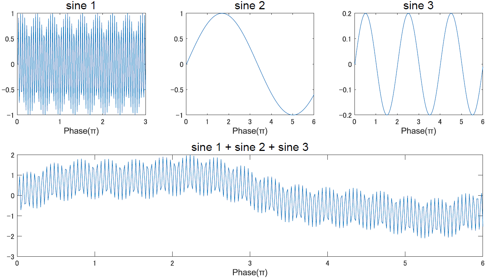

# Wavelet変換
この章では，[フーリエ変換](./fourier.html)の発展...のようなものである Wavelet transform (ウェーブレット変換) について学んでいきます．時間情報を周波数情報に変換する，という考え方はフーリエ変換と一緒ですが，フーリエ変換に存在するいくつかの問題点を解決できるため，脳波解析にはこちらを使うことも多いです．

## フーリエ変換の弱点と定常性
万能に思えるフーリエ変換ですが, 実は脳波を解析しようと思うと弱点があります．

結論から言うと，まず一つ目は

**「元関数 $f(t)$ に定常性を仮定してしまっている」**

です．関数の定常性とは，平均や自己共分散が時間に陽に依存していない，同じ時点数ならどこで切っても同じ形になってる，的な特徴を指します．簡単に言えば，どれだけ時間が経っても同じ関数の形を保っているということです(厳密には違うけどとりあえずの理解として)．

以下が(強い)定常性を満たす関数の例です．

$$
\begin{align}
y = 3\\
y = \sin x
\end{align}
$$

どちらも先の定義を満たしているのがわかるかと思います．三角関数は周期性を持った関数なので，当然定常性を満たすことになります.

下の図のように，単一の三角関数はもちろん，三角関数の和で表される関数も同様に，定常性を満たしています．

<center></center>

さて，ここで問題なのがフーリエ変換の方針です．「すべての関数は，無限の複素サイン波の足し合わせで表現することができる」でしたが，これはより正確には「すべての（定常性をもつ）関数は〜」です.

何故なら，周期関数であるサイン波との積は，元関数が同様に定常性をもつ関数でない場合にはどのタイミングで内積を求めるかによって値が変わってしまいます．
 
これはとても困ります．
元関数の性質を内積によって圧縮しているのに，どのタイミングで計算するかによって値が変わるのでは話になりません．

なのでフーリエ変換をする際には，元関数$f(t)$に定常性を仮定する必要があります．時間に依存した関数ではない，とすることです．逆に言うと，定常性を満たさない関数に対しフーリエ変換は使えません．計算が出来ない訳じゃないけど，正しい分析をすることが出来ません．役立たずです．

<center></center>


これでは脳波の解析に使えません．

普通，脳波はずっと同じ動態を取るなんてことはありえません．脳が体を操作したり感覚の処理を行なっているとする我々の立場が本当に正しいのであれば，脳という処理系は入力の値によってその振る舞いを変えるし，同様に出力を出すためにも振る舞いを変えるはずです．

そもそも，我々のような脳波系研究者はその大前提の元にいろんなタスクをやらせて反応を見ています．

そう，**脳波は定常性を持っていない**のです．困った．フーリエ変換は使えないじゃないか．なんのために苦労して[フーリエ変換](./fourier.html)やったと思ってる．

二つ目，一つ目に含まれているようなものですがあえて分けて言及すると，フーリエ変換は**マイナス無限から無限の積分**をしています．

実験中の○○をしている時の脳波，それも反応した直後の数百msの間だけ，なんて議論には使えないのですね．この意味でも，やはり定常性を仮定するのは微妙なことが分かります．

### 窓付き，短時間フーリエ変換
しかし，逆に考えるとそもそもそんなガチな定常性を持った関数の方が自然には少ないはずです．

どうにかもう少し現実的な妥協案を考えましょう．ということで考案されたのが，窓付フーリエ変換だとか短時間フーリエ変換だとか言うやつらです．

アイデアをざっくりと説明すると，以下のようなものになります．

「確かに無限時間なら定常性がないけど，短い時間の中では定常性を持ってるぽく振る舞うと考えられるのではないか？」


ということで，元関数 $f(t)$ をぶつ切りにしていきます．ぶつ切りにした範囲内ではそうそう変な変化は起きないと仮定して，そのなかでフーリエ変換をします.

<center></center>

上の図では，脳波を見立てててきとうに作成した信号を5つの時間窓に分けています．

この場合，この長い時間窓に対してフーリエ変換をした場合は一通りの周波数特性しか計算できず，その間の被験者の脳活動は一定 (つまり何か同じ処理をしていた) であったという仮定の元計算する事になります．

しかし 5 分割すると，活動が一定であったと仮定するのはこの短い窓の中だけで済みます．実際には，これをもっともっと細かくしていくことで，周波数特性の経時的な変化を見ることが可能になる，といったイメージです．

ただ，ここで一つ問題があります．ただただ元関数を切り取るだけで良いのかというとそうではありません．

連続的な値をとる波を，ある瞬間で無理やり途中で切った場合，断面が変な形になってしまいます．計算的には，一瞬でがくっと切り替わる超超超高周波成分のように解釈されてしまいます．

加えて，そもそもフーリエ変換は時間を無限に積分してましたけど，こうやって窓を作った場合，積分範囲が指定されることになります．あくまで無限範囲の積分という形は保ちましょう．

そこで，どうにかして切り取った「窓」の両脇の影響は減衰させていくため，単純に端に行くにつれて波を小さくしていくことを考えます．

窓の真ん中が一番影響が乗り，端に行くほど影響が小さくなる，いわゆる山形の信号に整形してやるわけです．この山がちょうど切り取った窓の長さに収まる形にしてあげれば，窓の外側の範囲では0の値を取ることになるため，**無限の積分は出来るけど窓の外の範囲からの影響は受けず，かつ端の部分で高周波ノイズがのらない**，という先程の要求を満たすことが出来ます．

<center></center>


今回の図の例だと，全体としては定常性を持っていない信号だとしても短い窓の間は定常性があると仮定し，1つの信号としてフーリエ変換するのではなく5区間で変化していく信号としてフーリエ変換したことになります．

こうすることで疑似的に，周波数スペクトルの時間変化を見る事が出来るわけです．便利ですね．こうした，周波数の時間変化を見ていく解**析を時間周波数解析**と称します．

ちなみに，山形に窓を整形するために，元信号にかけるフィルタのような働きをする関数を，窓関数と言います．よく用いられるのは[正規分布](../Statistics/distribution.html)とかで見る形の，ガウス関数 (下図) です．

<center></center>


ではフィルタはどうやってかけるのかですが，両方の信号 (元信号とフィルタ) の特性を反映させた新しい信号を生成する処理，つまりは畳み込みをします．

というわけで，短時間フーリエ変換 (Short Time Fourier Transform) の式は以下のようになります．

$$
STFT_{f,w}(t, \omega) =X(\omega)= \int_{-\infty}^{\infty} f(\tau)w(\tau - t)\mathrm{e}^{-i\omega \tau} d\tau
$$

ここで $f(t)$ 元関数，$w(t)$ は窓関数です．元関数と窓関数を畳みこんだ信号と複素サインの内積をとっています．

特に，よく使われる窓関数はガウスなので，あえて窓関数を明示的に示す場合の式はこんな感じになります．

$$
STFT_{f,w}(t, \omega) = X(\omega) = \int_{-\infty}^{\infty} f(\tau) \frac{1}{\sqrt{2\pi\sigma^2}}e^{-\frac{{(\tau-t)}^2}{2\sigma^2}}\mathrm{e}^{-i\omega \tau} d\tau
$$

整理すると，短時間フーリエ変換は元信号に窓関数をかけて整形したデータをフーリエ変換にかけることでした．

ためしに，非定常な信号に対する，短時間フーリエを使った時間周波数解析の図を以下に載せます．

<details markdown="1">
<summary>プログラム全体</summary>

``` MATLAB
%% Time frequency analysis

fs = 1000;
long = 5;
t = 0:1/fs:long;
f1 = 1;
f2 = 5;
f3 = 8;
f4 = 10;
f5 = 50;
f6 = 200;

s1 = 0.5*sin(2*pi*f1*t);
s2 = sin(2*pi*f2*t);
s3 = 1.3*sin(2*pi*f3*t);
s4 = 0.5*sin(2*pi*f4*t);
s5 = sin(2*pi*f5*t);
s6 = 1.3*sin(2*pi*f6*t);

S1 = [s1 s2 s3];
S2 = [s4 s5 s6];

subplot(2,2,1)
plot(S1)
xlim([0 3*length(t)])
xlabel('Time(s)' ,'FontName', 'Arial', 'FontSize', 12)
xticks(0:length(t):3*length(t))
xticklabels(0:5:15)

subplot(2,2,2)
plot(S2)
xlim([0 3*length(t)])
xlabel('Time(s)' ,'FontName', 'Arial', 'FontSize', 12)
xticks(0:length(t):3*length(t))
xticklabels(0:5:15)

subplot(2,2,3)
%pspectrum(S, fs, 'spectrogram', 'Leakage', 1, 'OverlapPercent', 0, ...
%'MinThreshold', -10, 'FrequencyLimits', [0, 10]);

spectrogram(S1,128,120,128,fs,'yaxis','MinThreshold',-30)
ylim([0 10])

subplot(2,2,4)
%pspectrum(S, fs, 'spectrogram', 'Leakage', 1, 'OverlapPercent', 0, ...
%'MinThreshold', -10, 'FrequencyLimits', [0, 10]);

spectrogram(S2,128,120,128,fs,'yaxis','MinThreshold',-30)
ylim([0 250])
```

</details>

<center></center>


図は上段が解析の対象となる，定常性のない信号，下段がそれに対する短時間フーリエの結果です．右と左では，対象となる信号の周波数が異なります．右側は全体的に高周波で構成されています．

この図から，とりあえず周波数成分の時間変化は追えていることが分かるかと思います．

しかし，これでもまだ，というか新しい問題が発生してしまいます．上の図を見れば分かりそうなものですが，とにかくその問題を解決するために使えるのが，次以降説明するウェーブレット変換です．

ちなみに補正された良い感じのはこうなります．

<center></center>

見るからに，左の図が綺麗になっています．短時間フーリエをやっていく場合の問題点は，その精度が周波数に依存して変わってしまうという点になります．そこを解決するのが，ウェーブレット変換です．

## 不確定性原理
さて，短時間フーリエ変換の何が問題になっているのかというと，先程の図を見ればわかると思いますが，低周波に対して性能が悪くなるところ(図では)です．

この原因を考え，どうにかして解決して綺麗な図に補正していきます．

さて，何故このような事になってしまうのかですが，窓関数のかけ方に問題があります．

つまり元信号に窓関数をかけてしまっている事です．これにより，どの周波数帯域のデータを見るにしても同じ時間窓を利用する事になっているので，時間窓長は一定で，カーネル (複素サイン) の角周波数 $\omega$ を変数とする事になります．

ここで問題になるのが，周波数分解能と時間分解能のトレードオフ，**不確定性原理**です．今，窓の長さを 100 ms と考えましょう．すると，Hz は 1 秒間に波が何周期繰り返されるかを意味しますから，10 Hz の波だと 1 周期，20 Hz の波なら 2 周期，100 Hz の波なら 10 周期含まれる事になります．

では1Hzはどうなるかというと，下の図の右のように，1/10 周期しか含まれません．これを見て「お，1Hzの波が振幅1で含まれてるな」はさすがのフーリエさんでも判断できません．もはや直線です．

<center></center>


また，窓が 1 秒だった場合も微妙です．フーリエ変換はその信号に繰り返し含まれている周期活動，としてサイン波を検出します．しかし 1 秒で 1 Hz だと 1 周期しか含まれませんが，これが偶然のものなのかちゃんと続いていくものなのか不明です．なので最低限2周期分は窓の長さが欲しいです．

では単純に窓を長くして，2 秒とかにすれば良いのかというとそれもまた違います．今度はそうすると，1Hz みたいな低周波は良くても 50 Hz みたいな高周波だと 100 周期分含まれます．窓の長さは「信号が定常性を持っていると仮定して良い＝そんなに変わらなそう」な範囲が望ましいんでしたね．でも 100 周期もの間全く同じ活動というか特性を維持しているってのはどうなんでしょう．

1 Hz の 2 周期程度だったら変わってなさそうとしても良いけど，100 周期はさすがにどこかで変化してそうです．が，短時間フーリエでは周波数に関係なく，全部まとめて一回のフーリエ変換を欠けてしまいます．

つまり，高周波になるほど時間分解能が上がり周波数分解能が下がる，低周波になるほど時間分解能が下がり周波数分解能が上がる，というジレンマが生じてしまいます．

先ほど確認したように，短時間フーリエでは「元関数に窓関数をかけて，それを変数 $\omega$ のフーリエ変換にかける」ことをします．

こうすると，どんな周波数と内積を取る時も窓の長さは常に一定です．もうわかりましたね．

そう，短時間フーリエでは低周波と高周波でそれぞれ時間と周波数の分解能の良し悪しがトレードオフになっているのです．

<center></center>

上図は短時間フーリエの時空間分解能．時間をあげれば空間が，空間をあげれば時間の分解能が下がる不確定性原理の問題がある．


## Wavelet変換

この問題を解決するためにはどうするか．周波数に依存して窓の長さが変えられるようになれば良いです．つまり**高周波を見たい時には時間窓が短く，低周波を見たい時には長く**する方法を考えます．

こうすると（どうやるのかはさておき)，周波数によって窓の長さが違うので，いれられる波の数も同じ＝時間分解能や周波数分解能が同じ（っぽい）ように計算ができます．これが Wavelet 変換のモチベです．

基本的な方針はフーリエと変わらず，元関数とカーネルとの内積によって周波数成分を抜き出す積分変換です．カーネルとは変換核と称される，○○変換の時に元信号と内積を取る関数の事です．

フーリエの場合は複素サイン波でしたが，ウェーブレット変換はウェーブレットと呼ばれるカーネルを用います．ウェーブレット変換の基本形は以下です．

$$
W_\psi[f(t)]  = T(a,b) = \int_{-\infty}^{\infty} f(t)\psi_{a,b}(t) dt
$$

ここで用いるカーネル $\psi_{a,b}(t)$ が(マザー)ウェーブレットです．フーリエ変換の時は複素サイン $\mathrm{e}^{i2\pi ft}$ があったところです．ウェーブレット変換とは，カーネルにウェーブレットを利用する事によって不確定性原理の壁を乗り越えようとする周波数変換です．

ウェーブレットはフーリエと違って常に形がうねうねと変化します．そこが肝で，不確定性原理を乗り越える秘策になるわけですが...どう変化するのかというと，マザーウェーブレットと呼ばれる原形があって，そいつのパラメータが解析したい周波数や時間によって変化していきます．そうやってマザーウェーブレット $\psi$ が良い感じに調整されて作られるのがウェーブレット達です．

なかなか文字だけだと分かりにくいと思います．「そのマザーウェーブレットってのはどんな形なんだよ」と．

実はこの問いは難しくて，色々あります．マザーの種類がいくつも提案されていて，それぞれ何を使うのかで用途や結果が若干異なります．下の図はどれもマザーウェーブレットです．

<center></center>

色々なマザーウェーブレット．どれも時間(横)方向に局在した窓の形を既に取っている．というよりもそれがマザーの条件の一つ．


このほかにもたくさんありますが，そこから自分の用途などを考えて選択したマザーをどうこうして作るウェーブレットを使って信号の解析をするのがウェーブレット変換です．

式を見ていきましょう．下の式はマザーウェーブレット $\psi$ からウェーブレットを作る公式です．

$$
\psi_{a,b}(t)  = \frac{1}{\sqrt{a}}\psi(\frac{t-b}{a})
$$

$a$ と $b$ が変数で，こいつらを変調させていく事でいろんなウェーブレットを作成し，そいつと元関数との内積を見ていくのがウェーブレット変換です．

フーリエ変換の場合はカーネルの変数は(角)周波数のみでしたが，ウェーブレットはどうやらそれとは違う謎の変数を使うようですね．この変数について考えていきましょう．

まず簡単なのは $b$ の方です．時間 $t$ を調整している訳だから，単純にウェーブレットの位置を動かしてくれます．シフトと言います．つまり元関数のうちどの時間について変換をするかという事です．高校数学で二次関数のグラフを横移動させたときのアレに似てます．これは窓を横にずらしていく役割があります．

次は $a$ です．スケールと言います．$a$ の値を変える事で，窓の幅が変わります．割り算してるしね．$a$ が大きいほど窓は広く，$a$ が小さいほど狭くなります．$\sqrt{a}$ はスケーリングに対して，つまり窓幅に対してエネルギーが一定になるように調整しているだけ．本質は分数のとこにあります．こいつの役割は後述．

フーリエ変換の変数は角周波数 $\omega$ でしたが，ウェーブレットにおいては変数はスケールとシフトになります．もっというと，周波数 $\omega$ は定数として扱われます．

つまり厳密な意味では，色んな周波数に対して内積を見ていくのではないという事．この点がウェーブレットが不確定性原理に打ち勝てる秘訣です．

問題は，そうするとどうやって周波数の区別をするんだという事になります．同じ周波数のままだと周波数分解にならないじゃないかと．

そこで先ほどの変数 $a$ (スケール) の存在意義がわかってきます．下の図から見て取れるように，縮尺を変える事によって中の波の周波数も変わっています．これによって周波数の差を疑似的に?再現しています．なかなかトリッキーというか面白い発想ですよね．筆者だったら思いつかなそう．


<center></center>


こうして作られたウェーブレットをカーネルとして利用して行う変換がウェーブレット変換です．

まとめると短時間フーリエ変換とは，時間窓長を固定し角周波数を変える積分変換．ウェーブレット変換とは，角周波数を固定し時間窓長（全体スケール）を変える積分変換．ということになります．違いが分かったでしょうか．

これゆえ，ウェーブレット変換は短時間フーリエ変換のような課題にあたる事がなく，不確定性原理に苦しむことはありません．

<center></center>

フーリエ変換の不確定性原理について，上の図のように説明しましたが，ウェーブレット変換はこれに対し

<center></center>

のように，周波数に依存して窓長を変える事で対応しています．

### Morlet Wavelet
さて，ウェーブレット変換の概要をつかめたところで，実際に用いられるマザーウェーブレットについて考えていきます．色んな奴がいますが，ここでは脳波解析でよく使われている Morlet Wavelet について解説します．

こいつは非常に単純です．なんていったって複素サインにガウスをかけた奴ですから．式は以下です．

$$
\psi(t) = \frac{1}{\sqrt{2\pi\sigma^2}}e^{-\frac{t^2}{2\sigma^2}}\mathrm{e}^{-i\omega_0 t} dt
$$

morlet wavelet の例は以下の図に表します．実軸，虚軸，時間軸の 3 次元をそれぞれの方向から見た図．4 個目は実数成分と虚数成分を同じ面で見た図．2/$\pi$ ずれています．

<details markdown="1">
<summary>プログラム全体</summary>

``` MATLAB
%% morlet wavelet
fs = 1000;
t  = -1:1/fs:1;
s     = 6/(2*pi*10);

wavelet = exp(1i*2*pi*10*t) .* exp(-t.^2./(2*s^2)); 

figure
subplot(221)
plot(t,real(wavelet))
xlabel('Time (s)'), ylabel('real axis')
title('real part of wavelet')

subplot(222)
plot(t,imag(wavelet))
xlabel('Time (s)'), ylabel('imaginary axis')
title('imaginary part of wavelet') 
 
subplot(223)
plot(real(wavelet),imag(wavelet))
ylabel('real axis'), zlabel('imag axis')
title('real and imaginary part of wavelet')

subplot(224)
plot(t,real(wavelet),'b')
hold on
plot(t,imag(wavelet),'r:')
legend({'real part';'imaginary part'})
```

</details>
<center></center>


ガウス窓付き短時間フーリエと同じノリですね．これを使ったウェーブレット変換が以下になります．

$$
T(a,b) =  \int_{-\infty}^{\infty} f(t) \frac{1}{\sqrt{2\pi\sigma^2}}e^{-\frac{(\frac{t-b}{a})^2}{2\sigma^2}}\mathrm{e}^{-i\omega_0 (\frac{t-b}{a})} dt
$$

ほとんどガウス窓付き短時間フーリエと同じですね！並べてみましょう．


<div class="box" markdown="1">
<div class="title">短時間フーリエ変換</div>

$$
STFT_{f,w}(t, \omega) = X(\omega) = \int_{-\infty}^{\infty} f(\tau) \frac{1}{\sqrt{2\pi\sigma^2}}e^{-\frac{{(\tau-t)}^2}{2\sigma^2}}\mathrm{e}^{-i\omega \tau} d\tau
$$

<div class="title">Morlet Wavelet変換</div>

$$
W_\psi[f(t)] = T(a,\tau) =  \int_{-\infty}^{\infty} f(\tau) \frac{1}{\sqrt{2\pi\sigma^2}}e^{-\frac{(\frac{\tau-t}{a})^2}{2\sigma^2}}\mathrm{e}^{-i\omega_0 (\frac{\tau-t}{a})} d\tau
$$

</div>

とても似ていますね．なお，ウェーブレット変換の変数 $b$ は比較のために今ここでだけ $\tau$ で置いてます．両者の違いは，短時間フーリエは時間(窓長)を固定していて変数 $\omega$ の関数として記述されるのに対し，ウェーブレット変換は周波数を表す $\omega$ は定数 $\omega_0$ で固定され，代わりにスケールが $a$，シフトが $b(\tau)$ の変数によって調整される関数として記述されている点です．

他にも，ガウス窓付き短時間フーリエの方は元信号にガウスをかけてから複素サインと内積を取ってる一方で Morlet Wavelet は複素サインにガウスをかけてから元信号との内積を取っているなどといった違いもあります．多分．

## 解析結果の解釈
では実際に，任意の時系列データに対し周波数解析，時間周波数解析をしていきます．ここはもう数学ないです．主にコードのファイルを参照してください．さて，まずは普通に周波数解析．

<details markdown="1">
<summary>プログラム全体</summary>

``` MATLAB
%% Frequency Analysis
fs = 1000;
t = 0:1/fs:10-1/fs;                      % 10 second span time vector
x2 = (1.3)*sin(2*pi*15*t) ...             % 15 Hz component
  + (1.7)*sin(2*pi*40*t) ...         % 40 Hz component
  + 2.5*randn(size(t)); ...              % Gaussian noise;

n = length(x2);          % number of samples
fourier = zeros(1,fs/2);

for fi=1:length(fourier)
    fourier(fi) = sum(x2.*exp(-1i*2*pi*fi*t));
end

subplot(2,2,[1 2])
plot(x2)

subplot(2,2,3)
plot(abs(fourier)*2/n)
xlim([0 50])
title('Handmade', 'FontName','Arial', 'FontSize', 15)

subplot(2,2,4)
y = fft(x2);
f = (0:length(x2)-1)*(fs/n);     % frequency range
plot(f, abs(y)*2/n)
xlim([0 50])
title('MATLAB fft', 'FontName','Arial', 'FontSize', 15)
```
</details>
<center></center>

上の図はてきとうに作った信号に対しフーリエ変換したものです．コード参照してください．15 Hz と 40 Hz の，振幅がそれぞれ 1.3 と 1.7 の信号を足して，そこにノイズを加えたものに対してフーリエ変換してみました．左は自分で書いたコード，右は関数を使ってます．右の方が細かいのは僕が左側では計算コストをけちったからです．良い感じに同じ結果が出ていますね．

気をつけないといけないのは，ナイキスト周波数だとか複素共役だとかの関係で plot する際に 2 倍したりなんなりをしてるところですが，まぁそこは使う言語や関数にもよるので，詳しくは自分で関数をぐぐってみてください．

こうして得られたのが[周波数解析](../../Analysis/time_frequency.md)です．特定の時系列データをならして，その中に含まれていた周波数成分を抜き出し，それぞれの強さを縦軸にしてプロットしました．脳波に対して行った場合，その特定の時間の間に ○○ Hz，あるいは ○○ 帯域の脳波が強くでているね！なんて話になります．次は[時間周波数解析](../../Analysis/time_frequency.md)．これは前の方でやりましたが再掲します．


<center></center>

図は周波数解析の結果を各時間毎に算出し，並べていったものです．時間がたつにつれて周波数構造がどのように変化するかが分かります．脳波であれば，刺激呈示から $300ms$ くらいたったあたりから○○帯域の活動が強くなってるね！なんて議論になります．

これで，周波数解析に続き時間周波数解析についても確認が終わりました．ここまでくれば，2010年以前のボリューム層の論文程度ならだいたい読むことができると思います．