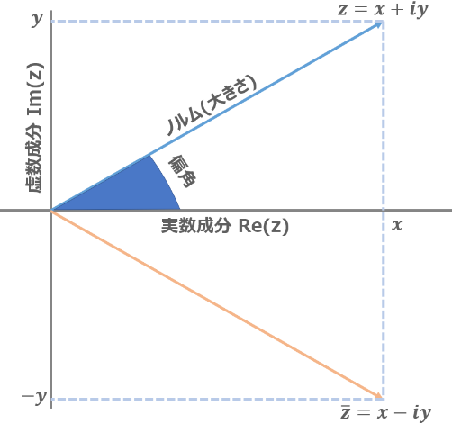
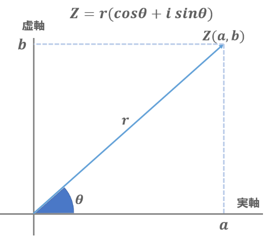

# 複素数

この章では複素数について考えていきます.先に以下を見ておくことを勧めます．

- [様々な数と掛け算](./1multiplication.html)
- [三角関数](./2trigonometric.html)
  
複素数は個人的には，基礎数学の中で一番すごい発明だと思いますが，高校で習った当初は訳も分からず嫌いになりました．

ですが複素数をマスターするという事は, 整数から分数への拡張や, 正の数から負の数への拡張を遥かにしのぐ恩恵を与えてくれるのです. さらに，三角関数の形で表されるフーリエ変換の式を，オイラーの公式を使うことによって簡略化したりと，脳波解析とも非常に密接な関わりがあります．

筆者も例にもれず，高校生の頃は「存在しない数なんて何に使うんだよ，いらないだろ」なんて思ったものですが，現代の筆者なら言えます．「**脳波解析に使います**」．

ということで，やっていきましょう．

## 虚数
まずは複素数の前に，その構成要素である虚数の定義からおさらいをしましょう. 高校で習う領域の中でも, 比較的簡単だったはずです.

虚数とは, 平方すると $-1$ になる数を単位とした数の事です.

1本の直線でしかない実数の問題は, 表現の幅が圧倒的に限られてしまう事です. そこで昔の人類は, 実数軸を2本直角に重ね合わせた直交座標系やベクトルといった考えを用いたわけです.

ベクトルあるいは行列を少し復習しましょう.

これらにおいて, 次元はどうやって定義されていたかというと，直交性・独立性を使っていました．こうする事で，互いに影響しない情報をもった多次元の数というものを考えられるようになりました．が，問題点として次元ごとに独立させちゃってるので，何らかの計算をさせようとしたときに次元ごと計算しないといけなくて，それが故にぐちゃぐちゃしちゃったりします．

なら実数ではない...正確には，$0$ の時（つまり交点）以外に必ず実数と交わらず, 直交性をもった「数」を定義することで二次元の情報を扱えないか？

こうして生まれたのが虚数単位iです. 実数において単位として利用される1の概念と直交する必要があったため, ここで1の平方が$1$である事に注目しました. 

平方して負の値になる数は存在しない. これは中学で習う事ですがこれを厳密に言うと, 「従来の数には存在しない」と解釈したわけです.

そこで, 平方して負の値になる数を考え, これを虚数と名付けました.
実数の単位が$1$なら, 虚数の単位は $1i$ となります. 虚数も $0$ の平方にマイナスをつけようとしたところで0なので, 実数と虚数は $0$ で直交する事になります.

これが虚数の定義ですね． 高校数学では「存在しない数」などと習いますがこれは誤解を招きます. 虚数の意義とは「$y$ 軸」を定義できる事にこそあるのです．

存在しない数があったから, 虚数と名付けたのではなく, 実数と直交性を持った数 = 虚数として使えそうな定義はないものかと考えた時に, 平方すると$-1$ になる数, を考え付いたわけです（多分).

### 虚数の性質
虚数は単位 $i$ がついてるだけなので, 基本的な足し算引き算はすべて実数と同様に扱えます.

$$
3i + 5i  =(3 + 5)i = 8i
$$

ただし掛け算になると少しだけ難しくなり, 虚数同士をかけると数字同士の積にマイナスをつける必要があります. それが虚数の性質だからです．

$$
3i \times 5i = (3\times 5)i^2 = 15 \times -1 = -15
$$

```MATLAB
3*1i + 5*1i        % add
3*1i * 5*1i        % multiply
```

上にあるように，プログラムではそもそも虚数単位と数字を分けて書きます．こう書かれると数字と虚数単位を別に計算させてるのもより実感できます．

余談ですが，プログラムを書くときは変数のiとかと混ざらないようにこのような記法をして虚数単位を区別する書き方が推奨されています．

たとえば
```MATLAB
for i = 1:10
 disp(i*1i)
```
みたいなコードを見れば $i$ と $1i$ を区別する必要が分かると思います．

## 複素数
虚数のおさらいができたところで, 複素数です. 実数も虚数も直線であるため, これらを軸として, 直交座標系っぽいものを考えます.

こうしてできた平面の事を, 複素平面やガウス平面といいます.

さて, ガウス平面を考えた際, とてもうれしい事が数多くあります. まずはそれぞれの軸における長さですが, 実数も虚数も単位が $1(i)$ であるため, 原点からの距離を考えると $\|a\| = \|ai\|$ になっているのです. 

この性質を利用すると, ガウス平面上の任意の点をユークリッド平面（今まで見た事のある関数のグラフのあれ）の点に対応づける事ができ, $(x, y) \neq x + yi$ といった具合に表す事が出来ます. 

何故ユークリッド平面では$(x,y)$なのにガウス平面だと足し算で表せるのかですが，そこが複素数の偉いところです．ユークリッドは$x$も$y$も実数だから別個に書かないといけなかったのだけれど，ガウスの場合は実数と虚数で独立しているから足し算にしても問題ないわけですね．

このように, 実数部分と虚数部分の足し合わせによって, 複素平面（二次元）上の数を表現した数を複素数といいます.

<center></center>

<div class="box" markdown="1">
<div class="title">複素数</div>

$i^2=-1$ を満たし，実数 $1$ と線形独立な数 $i$ を虚数単位とする．

この時，任意の $a,b\in\mathbb{R}$ を係数として $1,i$ の線形結合の形で表される $a+bi$ を複素数と呼ぶ．

</div>
そしてこいつのうれしさは, 直交座標や行列のように複数の数の集まりではなく, ひとつの数として扱える点です！いやほんと，頭良いですよね．

実際，数の定義でも一番上が複素数 $\mathbb{C}$ でしたが，ベクトルや行列は入っていませんでしたね．

<center></center>

つまり，他の数と同じような演算が許されているということです．複数の数を束ねた形をしているのに．とても偉い．


### 数の大幅な拡張
複素数の定義が分かったところで, これが実際にどうやって影響してくるのかについて考えます. 一次元が二次元に拡張されたわけですからその恩恵は計り知れません. 

さらに数の定義からも分かるように，実数は複素数の一部として扱えます．

たとえば $3$ は, 複素数で表すと $3 + 0i$ となります．逆に，複素数から実数成分を抜き出そうとすると，元々あった虚数成分は完全に消えます．独立してますからね．実数で見た3の中には，実は $3+0i$ は勿論 $3+1i, 3-5i$ など様々な形の可能性があるということですね．


### 複素数平面
既に確認したように，複素数平面においては1とiが基底になるのでそれぞれの大きさが何倍されるかの組み合わせによって任意の点 $x+yi$ を作れます．

<center></center>

さらに，複素数はそこから様々な情報を抜き出すことが出来ます．実軸と虚軸の直行性より, 複素数 $z = x + yi$ の横（実部Re）の長さと, 縦（虚部Im）の長さ, 原点との距離, そして実軸との間になす角はそれぞれ

$$
\begin{align}
\mathstrut Re z = x \\
\mathstrut Im z = y \\
|z| = \sqrt{x^2 + y^2} \\
\mathstrut arg z = \tan^{-1} \frac{y}{x}
\end{align}
$$

のように表されます. 

実部と虚部の長さ，大きさについては良いでしょう．絶対値に関しても三平方の定理から分かると思います．

$arg$ で表される角の事は, 偏角と言います. 実軸との角度の事であるので, $\tan$ を使って表す事が出来るというわけですね.

また, 複素数 $z$ を実軸に線対称な点を取った点の事を $\overline{z}$ と表し, 複素共役な点といいます.

$$
\begin{align}
z = x + yi \\
\overline{z} = x - yi
\end{align}
$$


MATLABではそれぞれ，以下のようにして求める事が出来ます．

```MATLAB
x = 3 + 4*1i
real(x)        % 実部
imag(x)        % 虚部
abs(x)         % ノルム，絶対値
angle(x)       % 偏角
conj(x)        % 複素共役
```

## 極形式
複素数 $z$ は $x + yi$ のような表記の仕方以外に, もう一つの表し方ができます.

先程確認したように，複素数 $z$ の絶対値は, 原点との距離を表す実数でした. 範囲は $0$ 以上の実数になります．

偏角の取りうる範囲はどうなるでしょうか？
原点を中心として4つの象限をぐるぐる回るので, $-\pi ～ \pi$ ですね！

この2つに注目して考えます. 
原点からの距離 $(r)$ と偏角 ($\theta$) が分かるという事は, この組み合わせによって，同じく平面上の任意の点を表現できます．原点から見てどの方向に，どれだけ離れているかが分かるわけです．

三角比を使うと，横の長さは $\cos$，縦の長さは $\sin$ で表すことが出来ます．なので実部に $\cos$，虚部に $\sin$ を使って，あとは長さ ($r$) をかけてやることで

$$
z = x + iy = r(\cos \theta + i\sin \theta)
$$

このように表すことが出来ます．ただし，$r\sin\theta$ で導出される数は実数 ($y$) になってしまうため，こちらも虚数単位 $i$ をかける事を忘れないようにしましょう.

<center></center>

さらに，これは余談ですがオイラーの公式を利用する事により極形式はこのように変換する事も出来ます．勉強していることが色々つながってくるの，なんだか楽しいですね．

$$
z = x + iy = r(\cos\theta + i\sin \theta) = r \mathrm{e}^{i\theta}
$$

## 複素数の掛け算
さて, 複素数を $r\mathrm{e}^{i\theta}$ で表せたところで, 複素数の掛け算を改めて考えます.

$$
z_1 z_2 = (x_1 + iy_1)(x_2 + iy_2) = (x_1 x_2 - y_1 y_2) + i(x_1 y_2 +x_2 y_1)
$$

普通に計算するとこうなりますが，極形式を使うと

$$
\begin{align}
z_1 z_2= r_1(\cos\theta_1 + i\sin\theta_1)r_2(\cos\theta_2 + i\sin\theta_2)\\
= r_1r_2\mathrm{e}^{i\theta_1} \mathrm{e}^{i\theta_2} = r_1r_2\mathrm{e}^{i(\theta_1 + \theta_2)}
\end{align}
$$


こうなっているのが分かるでしょうか．

複素数を極座標表示に変換し，掛け算の際には $r$ 部分と三角関数部分を分けて計算します．

この時，三角関数部分はそれぞれオイラーの公式より指数関数に変換が可能で，さらに指数関数の掛け算は肩の部分の足し算に相当するんでしたね．


この式が表す，複素数の掛け算の意味を考えてみましょう．

まず，長さに相当する $r$ はそれぞれの要素の積になっています．その上で興味深いのは，角度に相当する $e^{i\theta}$ は元になったそれぞれの複素数の角度の和になっているところです．

つまり，**複素数同士の掛け算は絶対値をかけた上の回転**を表すということです．


### 虚数の再解釈
ここで再び, 虚数とは何か, 何故平方すると $-1$ になるのかを考えてみます.

任意の複素数を考えます. ここでは仮に $3 + 0i$ とします.

$$
3 + 0i = 3(\cos 0 + i\sin 0) = 3(1 + 0) = 3
$$

こんな感じに表せますね.

ではこれに虚数単位をかけるとどうなるか確認するため，$0+1i$ をかけます. 

$$
i(3 + 0i) = 3i(\cos 0 + i\sin 0) = 3i(1+0) = 3i
$$

そしてこいつと...

$$
3(\cos (0+\frac{\pi}{2}) + i\sin (0 + \frac{\pi}{2})) = 3(\cos\frac{\pi}{2} + i\sin\frac{\pi}{2}) = 3i
$$

極形式で考えた同様の処理は，当然ですが同じ値を取ります．

複素数の積は回転を表すので, つまり **$i$をかけるという事は $\frac{\pi}{2}$ 回転する**という事を意味します．つまり直交です．

基底の条件である，$a$ と $b$ の内積が $0$，直交していることを満たしていることが改めて確認できました．ここでは $1$ と $i$ ですね．

もちろん，$3i$ に更に $i$ をかけると, $-3$ になります. 虚数単位 $i$ を２回かけると $-1$ を掛ける事になる, つまり $\pi$ 回転するのですね！

まだしっくりこないなら，たとえば $\cos0\pi = 1$は$\frac{\pi}{2}$ 回転すると $0$ になり, もう一度かけると $-1$ になります．これは，$\frac{\pi}{2}$ をかける操作によって実数である $1$ が消え(虚数では存在してる)たり，再び実数にもどってきたりしているためであるという捉え方をすることが出来ますね．

## まとめ
このように三角関数と虚数は非常に親和性が高く, そしてオイラーの公式によって指数関数ともつながる非常に重要な概念になっています. 

これで，オイラーの公式

$$
e^{i\theta}  = \cos\theta + i\sin\theta
$$

に出てくる虚数単位 $i$ についてクリアできました．[三角関数](./2trigonometric.html)については既に確認済みなので，あと学習が必要なのは指数関数くらいですね．指数関数については，微分積分と一緒に学ぶと良いらしいです．ということで次回は[微分積分](./4calculus.html)について学習していきます．