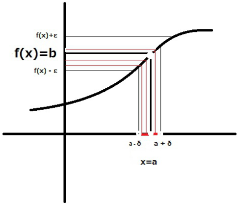
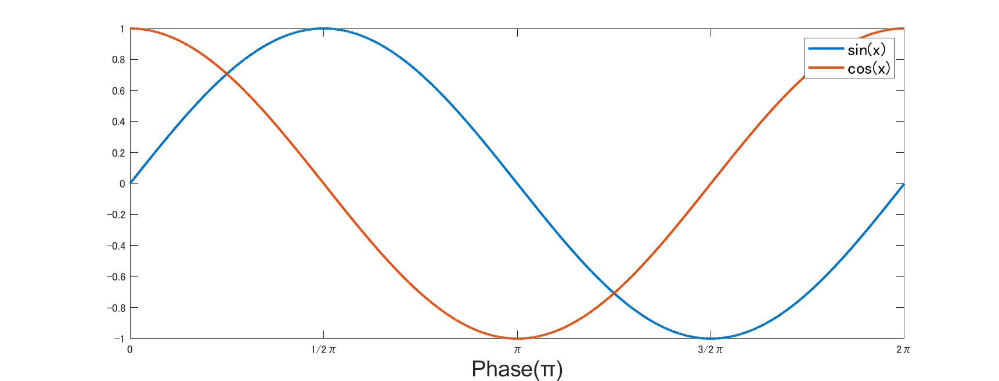
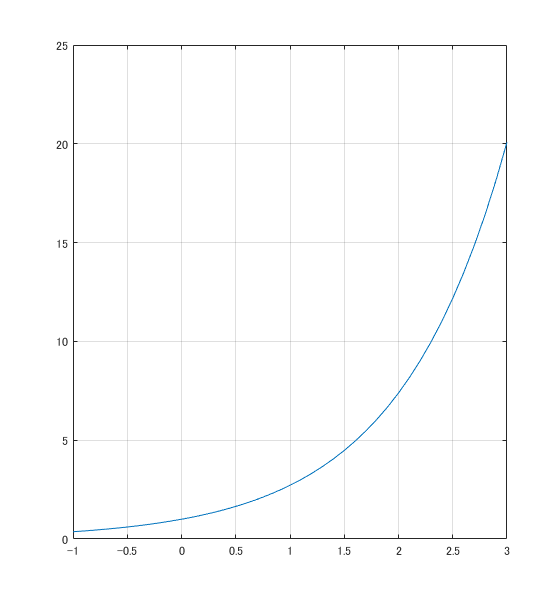
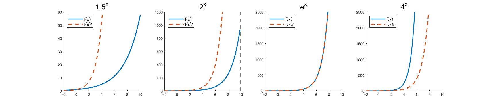
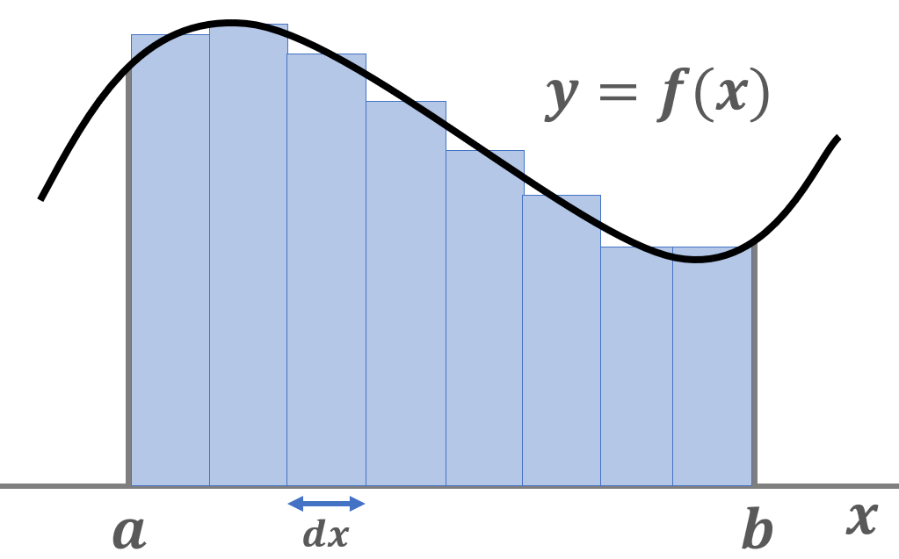
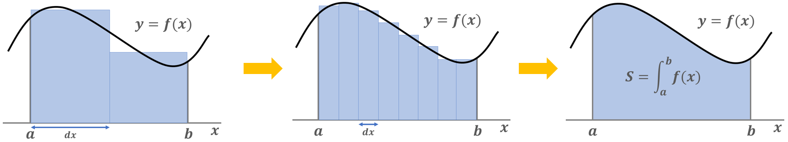
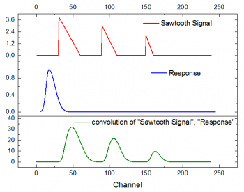

# 微分・積分

この章では微分積分について考えていきます.先に以下を見ておくことを勧めます．

- [様々な数と掛け算](./multiplication.html)
- [三角関数](./trigonometric.html)
- [複素数](./complex.html)

微分積分は高校数学で習うなかでも, 一番意味が分からない分野ですね.

ですが，残念ながら三角関数なんかとは違い信号処理も統計も何もかも，およそ我々の関わるような数学には絶対について回る単元です．また，学んでみれば(少なくとも基礎の部分では)そこまで難しくもありません．

ここさえ終われば，ひとまず信号処理に関する基礎数学は終わりです．頑張りましょう．

## 極限
まず, 微分や積分について学ぶ前に必ず学ぶ必要があるのが，極限についてです．そこから確認していきます．

微分や積分は超極小の範囲について深く考える数学です. この超極小というのがなんなのかから考えます.


超極小...と言ってもだいぶ曖昧な響きです.
　人間の身長の話をしている際にmmの差を持ってきたら極小と言えそうですが, 蟻の体長の話をしている時には大きすぎますね. 


このように, どんなスケールでの話をしていても十分に小さいといえるようなスケールでの話が微分積分です.


実用では「０に限りなく近づく」などといった表現で表され, 数式だとこうなります.

$$
\lim_{x\to0} f(x)
$$

この意味するところは, **関数$f(x)$の$x$を限りなく$0$に近付けた時に関数が返す値**という事になります. つまり $f(x)$ が $2x$ とかであれば

$$
\lim_{x\to0} 2x \fallingdotseq 0
$$

になります. $x=1$の時には$2$，$x=0.5$の時には$1$...と少しずつ小さくなるからです．しかしここで$x$は限りなく$0$に近い値なので実質的にはこの式が返す値も$0$と見做せるので, 等号は成り立ち, 点々は外れます.

$$
\begin{align}
\lim_{x\to0} 2x = 0\\
\lim_{z\to\infty} 2x = \infty
\end{align}
$$

ただ，これでもまだ「限りなく0に近い」って曖昧な表現ですよね. さっきも言ったようにmmなのかμmなのか, どこからが限りないと言っていいのかわかりません. なので，正しい定義を確認しておきます．

<div class="box" markdown="1">
<div class="title">$\epsilon-\delta$ による極限の定義</div>

極限

$$
\lim_{x\to a} f(x) = b
$$

は

$$
\begin{align}
 \forall \varepsilon >0, \exists \delta>0  \quad s.t.  \forall x \in \mathbb{R}, [0 < |x-a|<\delta \Rightarrow |f(x)-b|<\varepsilon]
\end{align}
$$

</div>

のように定義されます. 有名な$\varepsilon - \delta $論法というやつです.


突然ものすごい呪文が出てきました．意味が分からないと思いますが，それは記号の意味を知らないからです．実際，見た目に反して，この式の意味は割と単純です．

**「任意の正の数$\varepsilon $に対し, ある適当な正の数$\delta$が存在し, $\|x-a\|<\delta$ を満たす全ての実数xに対し，$\|f(x)-b\|<\varepsilon$ が成り立つ.」**


$f(x)$と$b$の間の距離が任意の正の数εより狭い範囲において, 必ずその範囲に対応する$x$の値が存在しているといった具合です. これが連続値の定義になるわけですね．

<center></center>

文字だと分かりにくいでしょうが，上の画像をしばらく眺めると意味が分かってくるかと思います．

この定義に従うと，「限りなく近い」の意味がどことなく分かる気がします．「限りなくってのはこれくらいですか？」と具体的な数字を出されたとしても，それよりもっと近いです，と言うのが言える状態，のことを極限というわけですね．


ちなみにこの式はついでに関数の連続性についても定義していて, どんなに小さい範囲で見てもそれより小さい値が存在するということは，関数が切れ目なくしっかりとつながっている＝連続であるという定義にもなります.

## 微分
### 微小な変化率
上で確認できたように，極限を取る目的はある一点に限りなく小さい範囲について考える事でした.

ここで, 関数でも同じ事を考えます.

関数とは，ある変数の値によって定まる数，その式 (e.g. $y = f(x)$) の事でした．微分とは言ってしまえば**変数の変化を極限まで小さくした時，関数の値はどの程度動くか**，という割合を求める操作の事です．

微分の式を見てみましょう．

$$
f'(x) =\lim_{dx \rightarrow 0} \frac{f(x+dx) - f(x)}{dx}
$$

$x$ を $dx$ だけ動かしたときの$y$の変化率，傾きになっているのが分かるでしょうか．思い出してほしいのは中学数学で二点間の傾きを求める式です．一次関数の学習でやった操作で，

$$
\text{傾き} = \frac{y\text{の変化量}}{x\text{の変化量}} = \frac{f(x_2) - f(x_1)}{x_2 - x_1}
$$

というものです．

これを，$x$ の変化量を限りなく小さくした ($dx\rightarrow0$) 版が微分ということですね．

つまり微分とは，その一点での傾き，(二次元だと) 接戦を求める式になっているわけですね．高校の時に微分とは接戦を求める操作であるなんて習いました．ちょっとその説明は良くない気がして，あくまで接戦を求める操作にもなるってだけで本質は「関数の局所的な微小変化率を求める事」です．


また，関数 $y=f(x)$ の微分は本やサイトによって様々な記法があります．以下はすべて同じです．

$$
f'(x) = y' = \frac{dy}{dx} = \frac{df}{dx} = \frac{d}{dx}f = \frac{d}{dx}f(x)
$$

面倒ですね...分野によったりしても好まれるのが違うので，適宜使い分けていく事になります．このシリーズでもいくつかの記法を使っていると思います．

次に，これから特に関係してくる代表的な関数達に対する微分がどういった振る舞いをするのかを確認しておきます．

### 三角関数の微分
はじめに三角関数です．これらに対する微分も，高校時代は暗記で片づけていた人が多いのではないでしょうか．しかし上記の性質が分かっていれば, 実は簡単です. 図を見ながら考えてみてください．

<center></center>

$$
\begin{align}
(\sin x)' = \cos x \\
(\cos x)' = -\sin x \\
(-\sin x)' = -\cos x \\
(-\cos x)' = \sin x
\end{align}
$$

```MATLAB
syms x
diff(cos(x))
diff(cos(x)*(sin(x)))
diff(exp(x))
```

簡単ですね. $\sin$, $\cos$ 関数それぞれがどういった挙動をしているのか, その傾きをすべての点で取ってつなげていったらどうなるかを考えれば, 自ずと分かるはずです．

たとえば $\sin$ は，$0\pi$ の時に $0$，$\frac{\pi}{2}$ に進んだ時には 1 という値を取ります．つまり $\sin$ の局所的な変化は，この範囲ないでは増える方向，プラスの値を取ります．増え方はスタートが最も大きく，そこから少しずつ小さくなりますね．といった具合に，変化率を追っていくと，ちょうど $\cos$ と同じ振る舞いになるわけです．

「微分とは, 局所的な微小変化率を求めること」の実感がわいたでしょうか.

### 指数関数
三角関数の次は指数関数について学びます．微分といったらみたいな面白い性質をもった関数です．ただ，この関数は定義が一般のものと狭義のものがあるせいで最初少し戸惑うので，確認しておきます．

<div class="box" markdown="1">
<div class="title">指数関数</div>

**一般の定義**

$1$ でない定数 $a<0$ に関して，変数 $x$ を $a^x$ へ送る関数を
$$「aを底とする指数関数」$$
と言う．

**狭義の定義**

ネイピア数$e$を底とし，変数$x$を$e^x$へ送る関数を指数関数，あるいは自然指数関数と言う．$\exp x$とも表記する．
</div>

ちなみに $e$ はネイピア数，別名オイラー数です. ネイピア数を使った狭義の定義に従っても，一般の $a$ を底にした指数関数を表現することは可能なため，大学数学以降だと単に指数関数というと狭義の方をさすことが多い気がします．ここでも，そっちについて話します．

わざわざネイピア数に限って関数を定義するような面白さがどこにあるのかというと，$(\mathrm{e}^x)' = \mathrm{e}^x$ つまり, **微分しても値が変わらない**という性質をもつところです.


微分しても値が変わらないって, わけがわからないですよね. ただ聞くだけだと意味が分からないと思います．なので，数学的な証明とかよりも，視覚的な理解を試みてみます．

まず一般に正の $1$ 以上の数を底とする指数関数は, 第一象限で二次関数的な上がり方をし, $(0,1)$ を通って, 第二象限では $x$ 軸に漸近しつつ徐々に横ばいな形をとりますね？

<center></center>

こいつを, x軸方向に様々な点で接線ぽいのを引き, 傾きを推測してみてください. 


面白い事に, こうやって求めた傾きの値をy成分として新しくグラフを書いた $f(x)'$ も指数関数の形をしています．色々変えて振る舞いを見てみましょう．

<center></center>

- 負の方向に行っている時は，指数関数はほぼ横に伸び，その接線の傾きもほとんど変化しない．
- 正の方向に行くほど，指数関数の傾きは急になる．
- 底の値にによって，微分した関数の位置(伸び方?)が変わる．
  
指数関数の微分は，この三つの特徴を持っているわけです．そして，傾きの変化を関数とする操作が微分なのだから，良い感じに底になる数を調整してあげれば，元の関数と全く同じ形になる値があっても不思議じゃない気がします．

<details markdown="1">
<summary>図の出力プログラム</summary>

```MATLAB
% シンボリック変数の定義
syms x
% 各関数の定義
exp_func = exp(x);
sisuu1 = 1.5.^x;
sisuu2 = 2.^x;
sisuu3 = 4.^x;

% 図の表示
figure;
subplot(1,4,1)
hold on
fplot(sisuu1, [-2 10], linewidth=2)
fplot(diff(exp_func), '--', [-2 10], linewidth=2)
ylim([0 60])
title('1.5^x', FontName='Arial', FontSize=15)
legend({'f(x)','f(x)\prime'},'Location','northwest', FontSize=10)
hold off

subplot(1,4,2)
hold on
fplot(sisuu2, [-2 10], linewidth=2)
fplot(diff(exp_func), '--', [-2 10], linewidth=2)
ylim([0 1200])
title('2^x', FontName='Arial', FontSize=15)
legend({'f(x)','f(x)\prime'},'Location','northwest', FontSize=10)
hold off

subplot(1,4,3)
hold on
fplot(exp_func, [-2 10], linewidth=2)
fplot(diff(exp_func), '--', [-2 10], linewidth=2)
ylim([0 2500])
title('e^x', FontName='Arial', FontSize=15)
legend({'f(x)','f(x)\prime'},'Location','northwest', FontSize=10)
hold off

subplot(1,4,4)
hold on
fplot(sisuu3, [-2 10], linewidth=2)
fplot(diff(exp_func), '--', [-2 10], linewidth=2)
ylim([0 2500])
title('4^x', FontName='Arial', FontSize=15)
legend({'f(x)','f(x)\prime'},'Location','northwest', FontSize=10)
hold off
```
</details>
  
そして実際ネイピア数とは, 丁度この形が綺麗に一致する場所に対応する底の値というわけです．図では 2 と 4 の間になっていますが，正確には
$$e=2.7182...$$
あたりの数だそうです．

と，ネイピア数の正体がようやく分かりました．これが実際どんなところで使われているのかというと，様々な数学に利用されています．
たとえば

**オイラーの公式**

$$
\mathrm{e}^{i\theta} = \cos\theta + i\sin\theta
$$

**ガウス関数**

$$
F(x)=\frac{1}{\sqrt{2\pi \sigma^2}}\int_{-\infty}^{\infty}\exp{\left\{-\frac{(x-\mu)^2}{2\sigma^2}\right\}} \mathrm{d}x
$$

などが代表的なものでしょうか．そもそもこの復習プログラムの目的も，オイラーの公式に出てくる指数関数について理解することにありました．
もう一つのガウス関数は，統計とか信号処理をやるときによくでてきます. こちらも今後の学習で使うので，いずれ確認します．


### 常微分と偏微分，全微分
#### 常微分
微分というと，大学以降に常微分だとか偏微分だとかといった言葉を聞いたことがある人もいるかと思います．

ただでさえ微分とかよく分からないとか思っていた人は，その中にも色々あるとか言われても普通に困りますよね．ここでは，そんな微分の仲間たちについて紹介します．学習してみると，実は全然難しくないです．

はじめに，常微分とその他2つの違いについて説明します．その違いは簡単で，変数の数です．先程まで説明に使っていた微分はどれも，変数が 1 つ，$x$ だけについての微分でした．

変数が一つのみの関数の微分を常微分と言います．つまり，**今までやっていたのは常微分**でした．

$$
f'(x) =\lim_{dx \rightarrow 0} \frac{f(x+dx) - f(x)}{dx}
$$

常微分については特に触れません．

では，本題である偏微分と全微分は何かというと，変数が2つ以上の関数に対する微分操作です．

微分の定義は局所的な微小変化率を求める事でした．では変数が 2 つ以上の場合生じる問題が，どの変数についての微小変化率を見るのかという話です．

ということで，全ての変数について微分しましょうとするのが全微分，どれか一つを選んで微分するのが偏微分です．それぞれ見ていきましょう．

#### 偏微分
偏微分は，いくつかある変数のうち特定の変数を選んで微分する操作です．

$$
\frac{\partial f}{\partial x} = \lim_{dx \rightarrow 0} \frac{f(x+dx, y) - f(x, y)}{dx}
$$

常微分では関数が $f(x)$ であったのに対して，$2$ 変数関数である $f(x,y)$ を考えます．その分，$x$ も $y$ も微小変化によって動いた点は $(x+dx, y+dy)$ となります．

しかし偏微分はそのうち片方，ここでは $x$ についてのみ変化量を見たいというものです．よって，$x$ のみ $dx$ が足され，つまり移動し，$y$ は固定されたままになっています．これを **$x$の変化に対する$f(x,y)$の変化，$x$についての偏微分** と言います．$y$ については勿論以下の通り

$$
\frac{\partial f}{\partial y} = \lim_{dy \rightarrow 0} \frac{f(x, y+dy) - f(x, y)}{dy}
$$

3変数以上でもやり方は変わりません．

$$
\frac{\partial}{\partial x}f(x,y,z) = \lim_{dx \rightarrow 0} \frac{f(x+dx, y,z) - f(x, y,z)}{dx}
$$

計算上は，結局のところ偏微分する変数 ($\partial$を使って表す) 以外は定数扱いするだけです．なのでたとえば

$$
f(x,y) = x^3 + 2y^2
$$
という2変数関数に対し，$x$ について偏微分すると，


$$
\frac{\partial f}{\partial x} = \lim_{dx \rightarrow 0} \frac{\{(x+dx)^3 + 2y^2\} - (x^3 + 2y^2)}{dx} = 3x^2
$$

となります．$y$ について偏微分すると $4y$ ですね．

#### 全微分
偏微分が分かれば全微分も簡単です．早速定義していきます．

$$
y = f(x,y)
$$

という2変数関数に対する全微分は

$$
df = f(x+dx, y+dy) - f(x,y) = \frac{\partial f}{\partial x}dx + \frac{\partial f}{\partial y}dy
$$

となります．

解釈しましょう．まず $f(x+dx, y+dy)$ への変化なのだから，関数そのものの変化率を見たいわけですね．関数そのものの変化量になるので，$\partial$ なんかは使わずシンプルに $df$ となります．で，その計算が全ての変数についての偏微分に $dx, dy...$ をかけたものを足し合わせで表せるよって事ですね．何故でしょう？


直観的に，それぞれの変数に対する偏微分を足すというところまでは良いでしょうか．$x,y$それぞれの方向に対する変化量を足せば両方を移動させた時の変化量になるよね，という話です．

では何故，偏微分の形に $dx, dy$ をかけるのかですが，これは偏微分が何をするものだったかを考えれば分かります．

偏微分は，関数のその変数方向での変化率，傾きを出すんでしたね．

傾き $a$ の直線で $b$ 移動したところの点，と考えれば分かるでしょうか．この場合は単純に $ab$ 移動するんでしたね．

たとえば傾きが $a$ の一次関数

$$
y=ax
$$

で $x$ が $x_0$ から $b$ 移動した時の移動量は

$$
y\text{の移動量} = a(x_0-b)-ax
$$

ですよね．全微分の場合，ずらすのはそれぞれ $dx, dy$ なので，傾き (偏微分) に移動距離 $(dx,dy)$ をかける事で移動量を出せるというわけです．

こうして得られた，各変数方向での移動量を足し合わせれば，正味の移動量が分かるよね，というのが全微分でした．

ということで，色々な微分のパターンを見てきたので，ここでまとめておきます．微積分はエッセンスとしてはこの程度で収まるもので，この単元の勉強が難しいのは色々な関数に対する微積を解くために必要なテクニックを覚えるところにあります．

今回は背景を理解するのが目標であって問題を解くのが目標ではないため，このくらいにしておきます．

<div class="box" markdown="1">
<div class="title">微分のまとめ</div>

$$
\begin{align}
f'(x) =\lim_{dx \rightarrow 0} \frac{f(x+dx) - f(x)}{dx} \qquad \text{常微分} \\
\frac{\partial f}{\partial x} = \lim_{dx \rightarrow 0} \frac{f(x+dx, y) - f(x, y)}{dx} \qquad \text{偏微分} \\
df = \frac{\partial f}{\partial x}dx + \frac{\partial f}{\partial y}dy \qquad \text{全微分}
\end{align}
$$
</div>


## 積分
さて, 微分がわかったとこで次は積分のについて考えていきます. 積分はわりと，微分に比べても直観的な理解がしやすいような気がします．

まず, 計算の上でいえる事としては, 微分の逆の操作をするという事です.

$$
\int 2x dx= x^2 + C
$$

こんな具合でしたね. 


```MATLAB
syms x
int(2*x)
```


微分とは微小な増分である $dx$ と $dy$ を用いて，瞬時の変化率を求めるものでしたが, 積分の場合は $dx$ と $y$ を用いて面積を求める操作になります.


関数 $f(x)$ は $x = a$ の時, $f(a)$ という値を取り, $x =b$ の時, $f(b)$ という値を取ります. この時 $x$ の増分 $dx$ は, $x$ 軸での距離を表すので横の長さととらえる事ができ, $f(a)$ あるいは $f(b)$ は縦の長さと考える事ができます.

こうして定義される横と縦を用いて作られる長方形を, $a～b, b～c, c～d..., m～n$ といった範囲で同じように作っていき, それぞれの面積をたすと, 関数$f(x)$ と $x$ 軸の間の,$ a～n$ における面積っぽいものがだせます.

<center></center>

しかしこのとき, 横の長さは単純に $a～b$ といった，1本のブロックごとに決めれば良いとしても，問題になるのは縦の長さです. ブロックの左端に合わせるのか右端に合わせるのか, あるいはその中点にするのか．これによって求められる面積は微妙に異なっていきます．

そもそも，ブロックの幅が広くなるほど，だいぶ荒い削りだし方をすることになるので実際の面積との誤差も大きくなってしまいます．

この問題を解決するため，$x$ 軸上でのブロックの幅を限りなく小さく，つまり $\lim_{x\to 0}$ にしてやります．

横幅が限りなく $0$ に近づいた時, ブロックの左端と右端のとる高さは同じ値となるため, 微小ブロックの形も関数 $f(x)$ にそったものになるはずです.

そして最後に，それらのブロックの面積を全て足し合わせれば, デコボコではなく滑らかな, 関数 $f(x)$ の凹凸にあった面積を導出する事が可能になります．この操作が積分であり，式では

$$
\int_a^b f(x) dx
$$

のように表します．$x$ が $a$ から $b$ の範囲において, それぞれの $f(x) = 高さ$と 微小な$dx = \text{幅}$ をかけたもの = 面積を足し合わせる，ということですね．


```MATLAB
syms x %シンボリック変数
fx = 任意の関数
int(fx, [a b]) % a->bの積分
```

<center></center>


### 足し算としての積分
積分とは微小面積の足し合わせと言いましたが, 足し算は数学記号では $\sum$ で表されたはずです. 何故 $\int$ を使うのでしょうか？

その答えは，$\sum$，つまり総和は離散値の計算にしか使えないからです．


$$
\sum_{k=1}^{n} k
$$

```MATLAB

% 数列の定義
K = [k1 k2 k3 ... kn]
sum(K) % 総和
```

この式と, コードでは, kに入る数字は1からnまでの整数になります. 無限小の幅による微小面積を考えるときにこの方法は使えません．無限小の幅で分けたブロックの面積は，当然無限個存在するからです．


そこで，離散値ではなく連続値に対する足し算的操作の記号として，$\int$ を使っているということです．

足し算として積分を使うことは, ここからの数学では, 頻繁に出てくるので是非感覚として理解してください.

$$
X(\omega) = \mathcal{F}[x(t)] = \int^{\infty}_{-\infty}x(t)e^{(-j \omega t)}dt \\
 x(t) = \mathcal{F}^{-1}[X(\omega)] = \int^{\infty}_{-\infty}X(f)e{(j \omega t)}dt 
$$

たとえばこいつらは複素フーリエ変換とその逆変換の式ですが, これらも $x(t)$ と指数関数の掛け算の $-\infty$ から $\infty$ での総和とかのように解釈する事ができます．

とは言っても，実際 PC に計算させる時には計算を楽にさせるためだったり，そもそも計測されたデータが離散だったりするために積分でなく足し算だったりしますが...

足し算の拡張として積分が扱えるようになったところで, その応用法について考えます. 

### 関数の内積
ベクトルの内積の説明の際には, 関数の内積を定義する際に $\sum$ の代わりに $\infty$ を使いました. その理由は, 上記の通り積分を使う事で, $\sum$ では表現できなかった非整数も演算に組み込む事が出来るからです.


$$
z = \int^{\infty}_{-\infty} f(x)g(x)dx
$$

これが関数の内積の定義です. 
日本語では, **同じ点$x$についての関数$f(x),g(x)$それぞれの値の積を計算し, それをすべて足し合わせる**という意味です. 当然, 直交していれば 0 の値を取るのは変わりません.


### 畳み込み積分
最後はいよいよ, ウェーブレット変換やヒルベルト変換を勉強する上でも必須になる, 畳み込み積分について学びます.

先に定義式を置いておきます.

<div class="box" markdown="1">
<div class="title">畳み込み積分(合成積)</div>

二つの，同一変数をもつ関数
$$
f(t) , g(t)
$$
に対し，両者の畳み込み，あるいは合成積$f*g$は
$$
h(t) = \int^{\infty}_{-\infty} f(\tau) g(t - \tau) d\tau
$$
と定義される．
</div>

式から読み取れる事ですが, まず同じ変数（ここでは時間 $t$ )に対する関数である, $f(t) , g(t)$ が定義されています. 関数の式は任意ですが, 同じ変数に対応している事は重要です. 

次に, 計算結果として求められるのも，$f(t)g(t)$ 同様に $t$ を変数にもつ関数ですね．つまり畳み込みは，二つの関数から一つの関数を得る操作のようです．

そして最後に, 右辺では関数 $f$ の引数は $(\tau)$ となっていて, $g$ の引数も $(t - \tau)$ となっていますね. ここが内積と異なる点です．内積ならどちらも $t$ でしたね．

また, それぞれの関数の引数を足し合わせる事で常に一定の値を取る事も分かります $(\tau + t - \tau = t)$.


$t$を時間とした場合でこの式を説明すると, $\tau$ は定義域の中のある瞬間の時間を指します. よって $f(\tau)$ は「ある時間 $\tau$ における $f(t)$ の値」ですね.

という事は $g(t-\tau)$ は, 時刻 $t$ (つまり現在)から, ある時刻 (関数 $f$ による作用が起きた時) までの時間差を指します. それらの積を $\tau$ で積分するというのがこの式の意味ですね.

例を取ります．

大学院生の皆さんは, いつも悲しく辛い事ばかり経験している事と思います. 本書に載ってるレベルの数学も理解できない辛さ, 実験に誤りがあってデータが取り直しになる悲しみ, 論文のリジェクト...


しかし大抵の場合は，どんな心の痛みも時間が解決してくれます. 


さて, 人生という長い時間軸上では，僕らは絶え間なく心に傷を負う「イベント」が起きるはずです. このイベントで受ける心の傷の大きさは場合によりけりなので, 時間依存の変数, つまり時間関数と捉えられます．

この悲しみの関数を $f(t)$ とします．

しかし先程も言ったように, 普通は心の傷は時間経過で減少していきます. ということで, その減少の仕方を関数 $g(t)$ とします. 同じく時間関数です.

勿論, 中には1年くらいしてから心の傷がぶり返すようなトラウマもありますので, 関数 $g(t)$ の形はなんでもいいです.

　ここで, とある瞬間 $(\tau)$ に研究室内の発表で上司に詰められた時に受けた心の傷を $f(\tau)$ とおきます.

今日は時間$t$の時点です. つまりアカハラ会議から $(t-\tau)$ 日が経過しています. 先程の設定では，傷が癒えるのは時間依存の関数 $g(t)$ によりますから, 今日感じている, あの日のアカハラによる心のダメージ $h(t)$ は

$$
h(t) = f(\tau) g(t-\tau)
$$

で表せます．

改めて, 畳み込みの式を確認してみます.

$$
h(t) = \int^{\infty}_{-\infty} f(\tau) g(t - \tau) d\tau
$$

アカハラ会議のダメージの式を，$-\infty$ から $\infty$ の範囲で, 時間 $\tau$ について積分したものが $h(t)$ になっていますね.

積分が何をする操作だったのかを考えれば, この式の残酷さが分かるはずです．関数 $f(x)$ について, 範囲 $a$ から $b$ までを $x$ で積分というのはつまり...

「$x$ が $a$ から $b$ の範囲の全ての数を取った時の $f(x)$ の値を足し算する」事でした. 


上記のの例で考えるなら, 畳み込みは「時刻 $t$ の時に感じている
苦痛 ($-\infty$ から $\infty$ の間に受けた心の傷の足し算)」です.


- 時刻 $\tau_1$ の時の実験失敗 $f(\tau_1)$ も...
- 時刻 $\tau_2$ の時のアカハラ会議 $f(\tau_2)$ も...
- 時刻 $\tau_3$ の時の論文リジェクト $f(\tau_3)$ も...
- 時刻 $\tau_4$ で未保存のtexファイルを誤って閉じちゃった $f(\tau_4)$ も...


その全てによってＡさんが今この瞬間に受けているストレスを足し算したものが $h(t)$ なわけです. ここで $t$ は現在の時刻です. 

$g(t-\tau)$ によってダメージは小さくなってるので, 実際は $\tau_4$ のダメージは計り知れず, $\tau_1$ のダメージはそれほどではないかもしれませんが, とりあえずそういう事です. 


$h(t)$ には大学院生の辛く惨めで凄惨な日々が詰まっているわけですね．


### つまり畳み込みとは
さて, 皆の心を犠牲にして流れを理解できたところで, 最後に数学的な言葉で畳み込みの確認をします.

$$
h(t) = \int^{\infty}_{-\infty} f(\tau) g(t - \tau) d\tau
$$

この式は, 「全ての瞬間 ($\tau$) に入力 (関数$f$) されたそれぞれの信号が，処理システム (関数$g$）によって変換されていて, その総和が現在出力されている信号 $h(t)$ である」と捉えられます. これを各時間について計算したものが関数 $h(t)$ なので...


畳み込みとは, 「関数 $f$ が関数 $g$ によって変化させられた関数 $h$ を求める処理」というわけですね！！！

脳波の話をするなら, band-pass-filterとかを考えてみて下さい. 生データが, フィルターをかける事で特定周波数帯域のみの信号に変換されますね. 信号処理の話を理解するためには, 畳み込みはかかせない概念です. 

余談ですが, 畳み込みは可換なので, 以下は同じことを指す式です．

$$
h(t) = \int^{\infty}_{-\infty} f(\tau) g(t - \tau) d\tau = \int^{\infty}_{-\infty} f(t-\tau) g(\tau) d\tau
$$

<center></center>

##　最後に
ここまでで，解析数学を学ぶための基礎数学編は終了です．
- [様々な数と掛け算](./multiplication.html)
- [三角関数](./trigonometric.html)
- [複素数](./complex.html)
- [微分・積分](./calculus.html)
  
と，学習してきましたが，ここまでの内容が理解できればオイラーの公式が理解できるはずで，オイラーが分かればフーリエ変換が分かります．フーリエ変換は脳波解析そのものといっても過言ではない程のものです．長い復習お疲れ様でした．

次は，解析数学とは離れますが統計数学をやるための基礎の確認を挟みます．飛ばしても解析の理解には事足りるので，任意で確認してください．