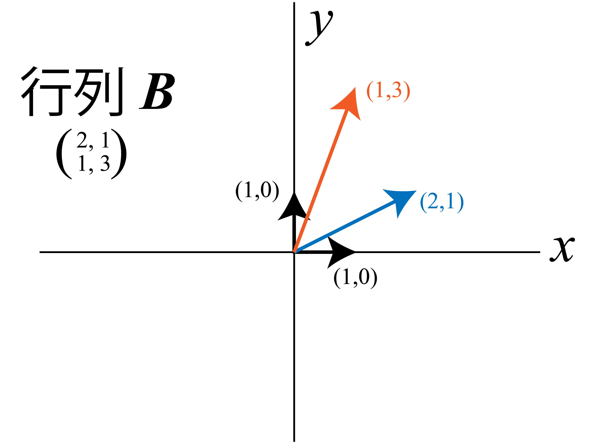

# 線形代数

## 線形代数を学ぶ意義
こういう話は今度

## 固有値，固有ベクトル
ここでは，線形代数を学ぶ中でも特に重要な概念である，固有値と固有ベクトルの考え方，求め方について解説します．主成分分析など，多くの重要な数学的手法を学ぶときに必要になるので，ここではつまらないですが頑張って理解しておきましょう．

### 固有ベクトル
はじめに，固有ベクトルについてです．行列$\bm{A}$の固有ベクトル$\bm{v}$ とは，

**「行列 $\bm{A}$ を掛けても，$\lambda $ 倍されるだけで方向が変わらないベクトル」**

のことを意味します．また，この時の対応する $\lambda$ の値を固有値と言います．意味が分からないと思うので，とりあえず例を考えます．

たとえば，行列 $\bm{A} =   \begin{pmatrix}
    \displaystyle 2 & 0\\
    \displaystyle 0 & 3
  \end{pmatrix}$ を考えます．このベクトルを色んなベクトルに掛けてみます．

まずは，$\begin{pmatrix}
    \displaystyle 1\\
    \displaystyle 0
\end{pmatrix}$，および$\begin{pmatrix}
    \displaystyle 0\\
    \displaystyle 1
\end{pmatrix}$を考えてみます．

$$
\begin{pmatrix}
    \displaystyle 2 & 0\\
    \displaystyle 0 & 3
\end{pmatrix}
\begin{pmatrix}
    \displaystyle 1\\
    \displaystyle 0
\end{pmatrix} =
\begin{pmatrix}
    \displaystyle 2\\
    \displaystyle 0
\end{pmatrix}
\\[1em]
\begin{pmatrix}
    \displaystyle 2 & 0\\
    \displaystyle 0 & 3
\end{pmatrix}
\begin{pmatrix}
    \displaystyle 0\\
    \displaystyle 1
\end{pmatrix} =
\begin{pmatrix}
    \displaystyle 0\\
    \displaystyle 3
\end{pmatrix}
$$

これらは，行列 $\bm{A}$ をかけても，それぞれ $2,3$ 倍されるだけです．つまり，行列 $\bm{A}$ の固有ベクトルは $(1,0), (0,1)$ で，対応する固有値は $2,3$ であることが分かります．

では次に，行列 $\bm{B} =   \begin{pmatrix}
    \displaystyle 2 & 1\\
    \displaystyle 1 & 3
  \end{pmatrix}$ 

を考えます．

$$
\begin{pmatrix}
    \displaystyle 2 & 1\\
    \displaystyle 1 & 3
\end{pmatrix}
\begin{pmatrix}
    \displaystyle 1\\
    \displaystyle 0
\end{pmatrix} =
\begin{pmatrix}
    \displaystyle 2\\
    \displaystyle 1
\end{pmatrix}
\\[1em]
\begin{pmatrix}
    \displaystyle 2 & 1\\
    \displaystyle 1 & 3
\end{pmatrix}
\begin{pmatrix}
    \displaystyle 0\\
    \displaystyle 1
\end{pmatrix} =
\begin{pmatrix}
    \displaystyle 1\\
    \displaystyle 3
\end{pmatrix}
$$

今度は，どちらも $\lambda$ 倍では表すことができなくなっています．つまり， $(1,0),(0,1)$ は行列 $\bm{B}$ の固有ベクトルではありません．

今の計算結果を図にしてみます．

行列 $\bm{A}$ の方はこのように，$(1,0), (0,1)$ ともに長さが伸びるだけです．一方で行列 $\bm{B}$は

このように，行列を作用させたことによって長さだけでなく向きも変化しています．当然，もう一度行列 $\bm{B}$ を作用させたら更に回転します．行列の掛け算が回転を意味していたことを考えれば分かることですが，行列が特殊な形でない限り，$x,y$ 軸方向にどれだけ伸びる...といった単純な考え方は通用しなくなってしまいます．

これが行列のややこしいところです．今やった式の形自体は，$y = Ax$のような，一次関数のような形を取っているのに，その挙動がややこしくなってしまうのです．

### モチベーション
これはたとえば，微分方程式なんかを考えると残念さが分かります．

先程の行列 $\bm{A,B}$ の問題は以下のように書き換えられます．

行列$\bm{A}$
$$
\dot{x} = 2x\\
\dot{y} = 3y\\
\\[1em]
\text{あるいは}
\\[1em]
\begin{pmatrix}
    \displaystyle \dot{x} \\
    \displaystyle \dot{y}
\end{pmatrix}=
\begin{pmatrix}
    \displaystyle 2 & 0 \\
    \displaystyle 0 & 3
\end{pmatrix}
\begin{pmatrix}
    \displaystyle x \\
    \displaystyle y
\end{pmatrix}
$$

行列$\bm{B}$
$$
\dot{x} = 2x + y\\
\dot{y} = x + 3y\\
\\[1em]
\text{あるいは}
\\[1em]
\begin{pmatrix}
    \displaystyle \dot{x} \\
    \displaystyle \dot{y}
\end{pmatrix}=
\begin{pmatrix}
    \displaystyle 2 & 1 \\
    \displaystyle 1 & 3
\end{pmatrix}
\begin{pmatrix}
    \displaystyle x \\
    \displaystyle y
\end{pmatrix}
$$

これらは，$x,y$の時間変化が行列$\bm{A,B}$ との掛け算によって決まるという力学系を考えています．行列が特殊な形でない限り $\bm{A}$ の方が，どれだけ掛けても回転を意識しないで軸方向への伸びを考えればいいだけなので明らかに楽ですよね．

よって，**行列 $\bm{B}$ のような一般のベクトルについても，こういう回転しない不変の軸**を考えたい，という発想が生まれます．

### 求め方

行列 $\bm{A}$ が簡単な形になっていたのは，見ればわかりますが対角成分以外が0という形を取っているからです．これによって $x,y$ 軸以外の方向が関係なくなっているわけです．

このことから， 今考えている問題は $\bm{B}$ をどうにかして $\lambda \bm{I}$という形に表せないか，という問題であることに気付きます．$\bm{I}$ は単位ベクトル.

即ち，

$$
\bm{A}\bm{x} = \lambda \bm{I} \bm{x}
$$

となる $\lambda$ と $\bm{x}$ を探す問題です．なので，

$$
(A - \lambda \bm{I})\bm{x} = 0
$$

を解きます．ここで先程のように $\bm{x}$ を $(x,y)$ とするとこの式は

$$
(A - \lambda \bm{I})\bm{x} \\
\\[1em]
= \begin{pmatrix}
a-\lambda & b \\
c & d-\lambda \\
\end{pmatrix}
\begin{pmatrix}
x \\
y \\
\end{pmatrix}
\\[1em]
= x \begin{pmatrix}
a-\lambda \\
c
\end{pmatrix} + y
\begin{pmatrix}
b\\
d-\lambda
\end{pmatrix} = 
\begin{pmatrix}
0\\
0
\end{pmatrix}
$$

という形で表せます．これを満たす $\bm{x}$ は，自明解として $\bm{x} = \bf{0}$ が自明解として存在しますが，これは除きます．なぜなら，軸になりえないからです．

また， $\begin{pmatrix} a-\lambda \\ c\end{pmatrix}$ と $\begin{pmatrix} b\\ d-\lambda \end{pmatrix}$ が線形独立な場合には先程の自明解以外がありえません．

従って，この問題の解は $\begin{pmatrix} a-\lambda \\ c\end{pmatrix}$ と $\begin{pmatrix} b\\ d-\lambda \end{pmatrix}$ が**線形従属**である，即ち $\begin{pmatrix}
a-\lambda & b \\
c & d-\lambda \\
\end{pmatrix}$ の**行列式が 0** であることを満たす必要がある，ということになります．

線形独立，従属，行列式の関係については行列式の解説を参照してください (今はないけど未来の筆者がやるはず)．

#### 固有値
つまり，

$$
|A - \lambda \bm{I}| = 0
$$

を解く問題に帰着しました．行列式の定義より

$$
|A - \lambda \bm{I}| = 
\begin{vmatrix}
\begin{pmatrix}
a & b \\
c & d \\
\end{pmatrix} -\lambda
\begin{pmatrix}
1 & 0 \\
0 & 1 \\
\end{pmatrix}
\end{vmatrix}\\
\\[1em] =
\begin{vmatrix}
a-\lambda & b \\
c & d-\lambda \\
\end{vmatrix} 
\\[1em]
= (a-\lambda)(d-\lambda) - bc\\
= \lambda^2 - (a+d)\lambda + ad - bc
$$

となります．ここで，行列のトレース $\tau$ および行列式 $\Delta$ を用いると

$$
|A - \lambda \bm{I}| = \lambda^2 - (a+d)\lambda + ad - bc\\
= \lambda^2 - \tau \lambda + \Delta
$$

となり，求める**固有値 $\lambda$の値は**

$$
\lambda_{1,2} = \frac{\tau \pm \sqrt{\tau^2 - 4\Delta}}{2}
$$

と求まります．

#### 固有ベクトル

あとは，得られた固有値を

$$
(A - \lambda \bm{I})\bm{x} = 0
$$

に代入し，計算することで，対応する固有ベクトル $\bm{x}$ も求まります．代入はそれぞれの $\lambda$ で別に行い，別の固有ベクトルを求めます．

たとえば $\lambda = \lambda_1$ に対しては，

$$
\begin{pmatrix}
a-\lambda_1 & b \\
c & d-\lambda_1 \\
\end{pmatrix}
\begin{pmatrix}
    x\\
    y
\end{pmatrix} =
\begin{pmatrix}
    0\\
    0
\end{pmatrix}
$$

を解きます．つまり

$$
\begin{pmatrix}
    (a-\lambda_1)x + by\\
    cx +(d-\lambda_1) y
\end{pmatrix}=
\begin{pmatrix}
    0\\
    0
\end{pmatrix}
$$

この式から，$x,y$ の比が分かります．あとは，この比を満たすものは全て固有ベクトルになります．一般的には，そのうち最小の整数比のものを選んで固有ベクトルとすることが多いです．

たとえば，最小の整数比が1:2だった場合，

$$
固有ベクトル \bm{x} = t
\begin{pmatrix}
1\\
2
\end{pmatrix}
(t\text{は任意定数}, t\neq0)
$$

や，

$$
固有ベクトル \bm{x} = \mathbb{C}
\begin{pmatrix}
1\\
2
\end{pmatrix}
$$

などと表記することが多いです．$\mathbb{C}$は複素数の意．

これによって，何度掛けても回転しない不変の軸を求める事ができました．

### 例題と確認
最後に，本当に回転しない軸が求められたのかを例題で確認してみます．

$\bm{A} =\begin{pmatrix}
1 & 1\\
4 & -2
\end{pmatrix}$　の固有値，固有ベクトルを求め，図示せよ．

まず
$$
\lambda^2 - \tau \lambda + \Delta = 0
$$

を解きます．$\tau, \Delta$をそれぞれ計算して代入すると，

$$
\lambda^2 +\lambda - 6 =0\\
(\lambda+3)(\lambda-2) = 0
$$

となるので，$\lambda = 2,-3$
と固有値が求まります．

対応する固有ベクトルは，

$$
\begin{pmatrix}
    (a-\lambda)x + by\\
    cx +(d-\lambda) y
\end{pmatrix}=
\begin{pmatrix}
    0\\
    0
\end{pmatrix}
$$

より
$\lambda = 2$の時，

$$
\begin{pmatrix}
    -x + y\\
    4x -4y
\end{pmatrix}=
\begin{pmatrix}
    0\\
    0
\end{pmatrix}
\\[1em]
\therefore x=y
$$

と分かります．よって固有ベクトルは $t\begin{pmatrix}
    1\\1
\end{pmatrix}$ です．

$\lambda = -3$の時，

$$
\begin{pmatrix}
    4x + y\\
    4x + y
\end{pmatrix}=
\begin{pmatrix}
    0\\
    0
\end{pmatrix}
\\[1em]
\therefore x= -4y
$$

なので，固有ベクトルは$t\begin{pmatrix}
    -1\\4
\end{pmatrix}$，となります．

では実際，これらの固有ベクトルが行列 $\bm{A}$ をかけても向きが変わらないかを確認してみます．

$$
\begin{pmatrix}
1 & 1 \\
4 & -2 \\
\end{pmatrix}
\begin{pmatrix}
    1\\
    1
\end{pmatrix} =
\begin{pmatrix}
    2\\
    2
\end{pmatrix}
\\[1em]
\begin{pmatrix}
1 & 1 \\
4 & -2 \\
\end{pmatrix}
\begin{pmatrix}
    -1\\
    4
\end{pmatrix} =
\begin{pmatrix}
    3\\
    -12
\end{pmatrix}
$$

どちらも，ちゃんと固有値倍されて同じ向きのままですね．

図にすると以下

固有値，固有ベクトルは，今後様々なことを勉強する上で重要になってくる概念です．手計算ができる必要はそれほどありません (3次元以上の行列になるとかなり面倒になってくる) が，内容は把握しておくことを勧めます．

たとえば，[主成分分析](../Others/PCA.html)や[力学系の線形安定性解析](../../Physics/NonlinearDynamics/stability.html)なんかにはダイレクトに使います．

## 行列の微積分
い，いつか...いつかやるんです...本当です...