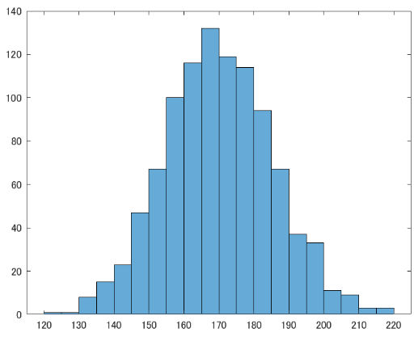
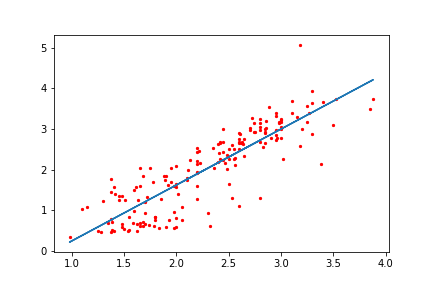

---
html:
  embed_local_images: false
  embed_svg: true
  offline: false
  toc: true

print_background: false

export_on_save:
  html: true
---

<div class="header">
  <table class="fixed-table">
    <thead>
      <tr>
        <th class="mokuji">目次</th>
        <th><details><summary> Math </summary><ul class="gnav"><details><summary>基礎数学編</summary>
        <ul class="index">
        <li><a href="../../Math/Basic/basic.html">ホーム</a></li> 
        <li><a href="../../Math/Basic/multiplication.html">掛け算</a></li>     
        <li><a href="../../Math/Basic/trigonometric.html">三角関数</a></li>
        <li><a href="../../Math/Basic/complex.html">複素数</a></li>
        <li><a href="../../Math/Basic/calculus.html">微分・積分</a></li>
        <li><a href="../../Math/Basic/linear_algebra.html">線形代数</a></li>
        <li><a href="../../Math/Basic/statistics.html">基礎統計</a></li>
        </ul></details>
        <ul class="gnav"><details><summary>信号処理編</summary>
        <ul class="index">
        <li><a href="../../Math/Analysis/Analysis.html">ホーム</a></li> 
        <li><a href="../../Math/Analysis/fourier.html">フーリエ変換</a></li>
        <li><a href="../../Math/Analysis/wavelet.html">wavelet変換</a></li>
        <li><a href="../../Math/Analysis/hilbert.html">ヒルベルト変換</a></li>
        <li><a href="../../Math/Analysis/eeg.html">基本の脳波解析</a></li> <li><a href="../../Math/Analysis/phase_analysis.html">位相同期解析</a></li>
        </ul></details>
        <ul class="gnav"><details><summary>統計編</summary>
        <ul class="index">
        <li><a href="../../Math/Statistics/Statistic.html">ホーム</a></li> 
        <li><a href="../../Math/Statistics/distribution.html">確率分布</a></li>
        <li><a href="../../Math/Statistics/central_limit_theorem.html">大数の法則と中心極限定理</a></li>
        <li><a href="../../Math/Statistics/statistic.html">統計量と標本分布</a></li>                                                         <li><a href="../../Math/Statistics/test.html">統計的検定</a></li>
        <li><a href="../../Math/Statistics/anova.html">分散分析</a></li>
        <li><a href="../../Math/Statistics/logistic_regression.html">ロジスティック回帰</a></li>
        </ul></details>
        <ul class="gnav"><details><summary>その他</summary>
        <ul class="index">
        <li><a href="../../Math/Others/Others.html">ホーム</a></li> 
        <li><a href="../../Math/Others/ICA.html">独立成分分析</a></li> 
        <li><a href="../../Math/Others/CCA.html">正準相関分析</a></li>
        <li><a href="../../Math/Others/lagrange.html">ラグランジュの未定乗数法</a></li>
        <li><a href="../../Math/Others/Entropy.html">エントロピーと分布間距離</a></li>
        <li><a href="../../Math/Others/signal_detection.html">信号検出理論</a></li>
        </ul></details>
        </details></th>
        <th><details><summary> Analysis </summary>
        <ul class="gnav"><details><summary>EEGLAB</summary>
        <ul class="index">       
        <li><a href="../../Analysis/eeglab/eeglab.html">ホーム</a></li>                           <li><a href="../../Analysis/eeglab/setup.html">環境構築</a></li>
        <li><a href="../../Analysis/eeglab/import.html">データのインポート</a></li>
        <li><a href="../../Analysis/eeglab/prepro1.html">基本的な下処理</a></li>
        <li><a href="../../Analysis/eeglab/prepro2.html">発展的な下処理</a></li>
        <li><a href="../../Analysis/eeglab/analysis1.html">単被験者での解析</a></li>
        <li><a href="../../Analysis/eeglab/analysis2.html">被験者群での解析</a></li>
        </ul></details>
        <ul class="gnav"><details><summary>MNE-python</summary>
        <ul class="index">
        <li><a href="../../Analysis/MNE/MNE.html">ホーム</a></li>
        <li><a href="../../Analysis/MNE/import.html">データのロード</a></li>
        <li><a href="../../Analysis/MNE/preprocessing.html">前処理</a></li>
        </ul> </details></details></th>
        <th><details><summary> Experiment </summary>
        <ul class="gnav">       </ul> </details></th>
        <th><details><summary> Simulations </summary>
        <ul class="gnav"><details><summary>環境構築</summary>
        <ul class="index">
         <li><a href="../../Simulation/Setup/Setup.html">ホーム</a></li>
        <li><a href="../../Simulation/Setup/environment.html">Python環境構築</a></li>
        <li><a href="../../Simulation/Setup/gpu.html">pythonでのGPUセットアップ</a></li>
        <li><a href="../../Simulation/Setup/jupyter.html">Jupyterセットアップ</a></li>
        <li><a href="../../Simulation/Setup/julia.html">Juliaセットアップ</a></li>
        </ul></details>
        <ul class="gnav"><details><summary>非線形力学</summary>
        <ul class="index">
        <li><a href="../../Simulation/NonlinearDynamics/Nonlinear-dynamics.html">ホーム</a></li>
        <li><a href="../../Simulation/NonlinearDynamics/dynamics.html">力学系とは</a></li>
        <li><a href="../../Simulation/NonlinearDynamics/stability.html">線形安定性解析</a></li>
        <li><a href="../../Simulation/NonlinearDynamics/stability_nonlinear.html">非線形系の安定性解析</a></li>
        </ul></details>
        </details></th>
      </tr>
    </thead>
  </table>
</div>

<h1><span>06</span>基礎統計</h1>
　ここでは，統計学の基礎となる基本的な要素の説明を行っていきます．統計検定なんかはまた別のところにまとめるので，もっと基礎中の基礎，平均や分散，相関や回帰の話です．ここを抑えておかないと検定や機械学習にはいけないので，復習しておきましょう．


<!-- @import "[TOC]" {cmd="toc" depthFrom=2 depthTo=4 orderedList=false} -->

<!-- code_chunk_output -->

- [尺度水準](#尺度水準)
  - [名義尺度](#名義尺度)
  - [順序尺度](#順序尺度)
  - [間隔尺度](#間隔尺度)
  - [比率尺度](#比率尺度)
- [基本統計量](#基本統計量)
- [基本の統計量](#基本の統計量)
  - [正規化](#正規化)
- [相関と共分散](#相関と共分散)
  - [相関と散布図](#相関と散布図)
  - [回帰](#回帰)
  - [共分散](#共分散)
  - [相関係数](#相関係数)
  - [自己相関](#自己相関)

<!-- /code_chunk_output -->

## 尺度水準
まず何よりも，データ分析において用いるデータの性質について知っておかなければなりません．誰もが知っている平均や分散といった統計の概念は，あらゆるデータについて計算の出来るものではありません．

心理実験の大家である Stevens, S.S. 曰く，我々が扱うデータには4つの種類があります．

##### スティーブンスの尺度水準
- **名義尺度** ... 他と区別し分類するための尺度．カテゴリー．
例： 性別，クラス，国籍，学籍番号
- **順序尺度** ... 順序や大小に意味を持つが，間隔に意味がない尺度．
例： 順位，Likert scale，級位，診断ステージ
- **間隔尺度** ... 順序だけでなく，間隔にも意味を持つ尺度．
例： 気温，西暦，テストの点数
- **比率尺度** ... さらに0が原点となり，比率にも意味を持つ尺度．
例： 身長，速度，給料，時間
#####

定義だけだといまいちわからなくても，例を見てみれば納得ができるはずです．これらの尺度は，それぞれ適用可能な数学的処理が異なります．言い換えると，これから学んでいく「統計量」にも算出可能なものと不可能なものがあるということになります．

また，データがどの尺度かによって，これから学ぶ回帰などの統計処理の際に適用する手法が変わってきます．ここで一旦，それぞれの性質を確認しておきましょう．

### 名義尺度
まず名義尺度について考えます．これはただのカテゴリー，ラベルです．分析の差異にはよくダミー変数と呼ばれる数字に置き換えてしまいます．たとえば男ならば1，女性なら0，とするなどです．

ちなみに男性を1にした理由はフロイト的に考えただけです．何故男性が1なんだとかは言わないでください．男性の方が優秀だから大きい値を振ったわけではありません．フロイトは冗談ですが，実際これは重要な点です．名義尺度に振るダミー変数には，数値的に大小関係は当然ありますが，その大小関係に意味はありません．あくまで名義的なだけです．よって，加減も乗除も意味がないことになります．四則演算が使えないわけですね．

**名義尺度は同一かどうかのみが判定可能**ということになります．

なので各カテゴリ，ラベル，あるいはケースの合計数や頻度，最頻値などを出すことしかできません．平均や分散が無理ということです．

### 順序尺度
次に順序尺度ですが，これは文字通り順序に意味を持ったものです．男女の1,0に順序はありませんでしたが，クラスでの成績順などは意味を持ちます．1位は2位より，2位は3位より点数が高いはずです．そこには優劣が，順序が存在します．名義尺度よりは情報量が増えています．

ですが同時に，四則演算はやはり成り立たないことが分かります．1位の田中君と2位の佐藤君を足したら3位の山田さんになるわけがありませんし，30人のクラスに対して先生が「このクラスの平均順位は15位でした！」なんて言い出した日には，転校を考えます．

**順序尺度は大小関係を持つが，通常の演算は不可能**

ということになります．追加で扱える統計量は，パーセンタイル等です．

### 間隔尺度
ここで使えるものが一気に増えていきます．間隔尺度では，大小関係だけでなく，加減算が可能になります．これはテストの点数や西暦，気温等です．50点のテストにあと10点足せば60点ですし，2000年から20年が経つと2020年です．ですが注意点として，万能なわけではありません．乗除算が出来ないからです．気温が10度から20度になった時，2倍の温度とは言えません．西暦なんかもそうです．

**間隔尺度は加減算が可能**

です．よって一気に扱える量が増え，平均や分散，相関なんかが使えるようになります．

### 比率尺度
最後，比率尺度は四則演算の全てが使用可能です．また重要な点として，0に絶対的な意味があるものです．たとえば，間隔尺度である気温や西暦は，0の場合にも「存在はしている」者として考えられます．気温がない，のではなく，気温が0なわけです．一方，比率尺度である身長は，0の場合には存在していません．身長が0である，とはなりません．

**0が原点であり，四則演算が全て成り立つ**

これが比率尺度です．ただし使える量は大して増えず，変動係数なんかがあります．

このように，Stevens得られるデータの性質を4尺度に分類することに成功しました．これらは名義 < 順序 < 間隔 < 比率尺度と情報量が増えていきます．このページの以降の記述は基本的に，間隔尺度以降で使える概念について考えていきます．名義尺度の使い方についてはまたいずれ (<a href="../../Math/Statistics/logistic_regression.html">ロジスティック回帰</a>)．

## 基本統計量
## 基本の統計量
この節では統計の基礎を学びます. 統計は脳波解析に直接的に使うわけではありませんが, 解析した結果がいいデータなのかゴミデータなのかを判断したりするために必要です. また, 分野問わずどんな論文も統計の知識なくては読むことが出来ません. 幾何学などに比べれば大した事ない量とレベルなので, パパっと身に着けちゃいましょう！！ 

さて, まずは冗談じゃなく小学生でも知ってる統計学から始めましょう.

はじめに，アンケートである学校の男子1000人の平均身長を聞いてみたとしましょうか．

<center></center>

複数の数値データ$x_i = [x_1, x_2, x_3, ...]$が得られた際, とりあえず平均と分散, ついで標準偏差を求めたくなるのは人間の性ですね.


##### 基本統計量
$$
\bar{x} = \frac{\sum_{i=1}^{n} x_i}{n}  \qquad \text{平均}
$$
$$
s^2 = \frac{\sum_{i=1}^{n} (x_i - \bar{x})^2}{n} \qquad \text{分散}
$$
$$
s = \sqrt{s^2} = \sqrt{\frac{\sum_{i=1}^{n} (x_i - \bar{x})^2}{n}} \qquad \text{標準偏差}
$$
#####

```MATLAB
% MATLAB
x = [1 2 3 4]
mean(x)
var(x)
std(x)
```

とりあえず, 平均と分散, 標準偏差の式を書いてみました. 平均は良いですね？全要素を足して要素数で割るだけです.
\
　分散は, 一見ややこしくなってるかもしれませんが各要素と平均の差(偏差)を足して, 同じく要素数で割っています. 標準偏差はその平方根です.
\
　平均とは, 得られたデータのだいたい「真ん中あたり」を指す指標です. 代表値として, 他には中央値とか最頻値とかがいますが, まあ平均値だけ覚えていれば大丈夫です. モブは放置.
\
　分散とは, 偏差の平均的な奴ですね？つまり, 得られたデータはどれだけ平均付近に固まっているか, あるいはバラバラになっているかを指します. 各要素が平均から遠い値であるほど, 偏差とその二乗は大きな値を取ります. 2乗するのは, 符号の影響をなくすためです. そいつらの平均なので, やはり値が大きい程データがばらついているという事になります.
\
　標準偏差は, 分散の平方根です. それだけ. 偏差の特性上, 分散を導出する際にデータを2乗してしまっているため, 分散は元のデータとスケールが違います. 例えば元データが長さだったら, 分散は面積を表してしまいます. なので平方根をとって次元をそろえてあげるわけですね. これで分かりやすくなります.
\
　こいつらは後程アップデートされたりしますが, 基本的にはデータを扱う上で普遍的に利用されるものです. まず確実に理解しておきましょう.

### 正規化
ちなみに, 標準偏差と平均をどう使ってデータを読み解くのかという例として, こんなのもあります.

$$
z_i = \frac{x_i - \bar{x}}{s}
$$


```MATLAB
x = [1 2 3 4]
for i=x
    z([i]) = ((x([i]) - mean(x)) / std(x))
end
z = normalize(x)        // 関数使うとこう
```


正規化(標準化)と言われる処理です. 各要素と平均との偏差を標準偏差で割っていますね. 標準偏差はざっくり言うなら偏差の平均的なやつですので, それと各偏差の比を見ているわけです. こうする事で, 平均0, 分散1のデータに置き換える事が出来るので, それぞれの要素がどれくらい平均から外れているかが分かりやすくなります. zの大きさが1を超えれば平均からかなり(正なら正方向, 負なら負方向に)離れているってわけですね！！

<center></center>

まぁ, 勿論こんな事しないでそのまま眺めるだけでも十分だったりしますが.

## 相関と共分散
次もよくつかわれる基礎です. 2つ以上の変数を持つデータ(たとえばAさん,Bさん ... の身長と体重)の性質を検証する術です. 

### 相関と散布図
相関は非常に簡単です. 


```MATLAB
% 正の相関あり
x = [0:0.1:10]+ rand(1,101)
y = [0:0.1:10]
scatter(x,y)

% 負の相関あり
x = [0:0.1:10] + rand(1,101)
y = [0:-0.1:-10]
scatter(x,y)

% 相関なし
x = rand(1,100)
y = rand(1,100)
scatter(x,y)
```
\
　直交座標軸横軸に変数1, 縦軸に変数2をおいて, あとは得られたデータをすべて対応する位置にデータを点でプロットしていくだけです. こうして得られた, 点を散りばめられた図を散布図だとか相関図と言います.
\
　この図の特徴ですが, データによって点の散らばり方が変わります. たとえば先程の身長と体重の例の場合, 一般的に身長が高い人の方が体重が重い傾向にありますね？これは図では点が右肩上がりの斜めライン付近に多く集まる事を意味します. 
\
　逆に, 右肩上がりの斜めに点が集まるという事は, 一方が上がると他方も上がる, 比例に似た関係にあると言えます. 逆に右肩下がりの場合, 一方が上がると他方が下がる関係ですね！！

<center></center>

\
　前者を正の相関, 後者を負の相関があるといいます.散布図を描いた時の見た目でなんとなくデータ間の関係が分かるわけです. 見た目ではっきり分かるほど点が線状に並ぶ程, 相関が強いと表現されます(図\ref{im:scatter}左, 中はかなり強い). 逆に見た目で何も分からん場合(図\ref{im:scatter}右)は, データ間には相関がないと言えます. 
\
　非常に便利なので, アンケートデータとか取ったらとりあえずプロットしてみると良いです. 


### 回帰

　相関は2つの変数の間に区別を設けず，対等に見て関係を見る方法でしたが，それに対して片方を使ってもう一方を見るのを回帰といいます．つまり変数$\mathbf{x}$によって変数$\mathbf{y}$が決定される様子を表すものです．

　一般に，たとえば身長と体重などどっちがどっちの原因であるとかは考えにくいものに対しては使いませんが，人口とGDPみたいに， どちらかがどちらかの原因になっているかが分かるようなデータに対して使うと，実際どの程度依存しているのかを計算できるものです．この場合，人口が独立変数，GDPが従属変数となります．では回帰ですが，ここでは一番簡単な線形回帰，単回帰分析だけ触れてみましょう．

　単回帰分析は，1つの独立変数をx，従属変数をy軸において散布図を作った際に一番 ``それっぽい'' ところに直線を引く手法です．小学校とかの理科の実験レポートでやりましたね．あれです．

　そう, 近年では意識スカイツリー系イケイケ起業マンたちに「AI」と呼ばれていたりもする，あれです．散布図が描けて, あとは最小二乗法が使えちゃえばAIエンジニアが名乗れるのです．素晴らしい時代ですね．嘘です．とかく，まずはPCにやってもらった結果を見てみましょう．


<center></center>


```MATLAB
x = [0:0.1:10]+ rand(1,101)
y = [0:0.1:10]
mdl = fitlm(x,y)
scatter(x,y)
hold on
plot(mdl)
hold off
```

良い感じですね．たしかにそれっぽいところに線が引かれています．
\
　では次に，PCが何をやったのか自分たちで数学をやってみましょう．先程一瞬でてきた最小二乗法とは，予測値$\hat y_i$と実測値$y_i$の差の全データでの二乗和を最小化する方法を意味し，今回の場合に利用すると以下の計算になります．

$$
\argmin_{a,b} L = \sum_{i=1}^n \{ y_i - (ax_i + b) \}^2
$$

　$\argmin_{a,b} L$は，関数Lが最小値を取るような変数a,bの集合という意味で，つまりここでは二乗和(L)を最小化するようなa,bの組み合わせを探すという意味です．実際のyの値と，直線すなわちxの一次関数で表してみた予測値との誤差を全てのデータについて足し合わせたものが二乗和です．二乗しているのは符号の影響を打ち消すためです．
\
　この二乗和が小さいということは，予測値と実測値のずれが小さいという事になりますね？それを計算するわけです．計算方法はそれぞれ最小値を取るわけですから，偏微分しましょう．合成関数の微分ですね．すると

$$
  \frac{\partial L}{\partial a} = -2\sum_{i=1}^n x_i(y_i -ax_i-b)\\
  \frac{\partial L}{\partial b} = -2 \sum_{i=1}^n (y_i - ax_i -b)
$$

となります．で，こいつらの最小値を求めるわけなので=0として約分したり移項したりして整理すると

$$
  a\sum_{i=1}^n x_i^2 + b\sum_{i=1}^n x_i = \sum_{i=1}^n x_i y_i \\
  a\sum_{i=1}^n x_i + bn = \sum_{i=1}^n y_i
$$

が求められます．

2つ目の式をnで割ると，

$$
  \frac{a\sum_{i=1}^n x_i}{n} + b = \frac{\sum_{i=1}^n y_i}{n}\\
  \therefore a\bar{x} + b = \bar{y}
$$

となります．$\bar{x}$はxの平均でしたね．さて，さらにこいつを先程の1つ目の式に代入して同様にnで割ると

$$
  a\sum_{i=1}^n x_i^2 + (-a\bar{x} + \bar{y})\sum_{i=1}^n x_i = \sum_{i=1}^n x_i y_i \\
  a(\frac{\sum_{i=1}^n x_i^2}{n} - \bar{x}\frac{\sum_{i=1}^n x_i}{n}) = \frac{\sum_{i=1}^n x_i y_i}{n} - \bar{y}\frac{\sum_{i=1}^n x_i}{n}\\
  a(\bar{x^2} - \bar{x}^2) = \bar{xy} - \bar{y}\bar{x}\\
  \therefore a = \frac{\bar{xy} - \bar{y}\bar{x}}{\bar{x^2} - \bar{x}^2} 
$$

と，aについて解く事ができます．bについてもこの式より解くと，最終的に

$$
  a = \frac{\bar{xy} - \bar{y}\bar{x}}{\bar{x^2} - \bar{x}^2} \\
  b = -a\bar{x} + \bar{y}
$$

と，a,bの値を求める事が出来ます．あとはこのパラメータに従った直線を引けば先程の図のような事が出来るわけですね．なおbの値については，分散を使う事で次のように表記することも可能です．

$$
  b = \frac{\sigma_{xy}}{\sigma_x^2}
$$

### 共分散
変数間の関係を探るのに非常に便利な相関ですが, やや客観性にかけていた事に気付くでしょう. 「なんとなく」「それっぽい」などの語彙を多用していたはずです. これでは困ってしまいますので, より客観的に評価する方法を考えます.
\
　それが共分散というやつで, 普通の分散は1変数において偏差の二乗平均を取るわけですが, 共分散では2変数の偏差同士を掛け合わせます. こうする事で, それぞれの偏差の特徴を反映させた新しい分散を定義する事が出来ます. 
\
　それぞれの特徴とは, 偏差の符号です. 1変数分散の場合は単に二乗してしまうため符号は外れますが, 共分散の場合はそれぞれの偏差の符号が異なった場合には負の値を取ります. 偏差の符号が異なるというのは負の相関が, 同じなら正の相関があるという事です.\\
さらに, 絶対値の方も有用な情報をくれます. それぞれの偏差が大きい程, 共分散の絶対値も大きくなるわけです. これは相関の強さを表します.

<center></center>

この２つを合わせる事で, 共分散は次のような性質を持ちます.
\
　共分散は$S_xy$, 変数xと変数yの相関が強い程絶対値が大きくなり, その符号は相関の正負に一致する.
\
　式は以下です.

$$
S_{xy} = \frac{\sum_{i=1}^{n} (x_i - \bar{x})(y_i - \bar{y})}{n}
$$

```MATLAB
x = [0:0.1:10]+ rand(1,101)
y = [0:0.1:10]

Sxy = (sum((x - mean(x)).*(y - mean(y))))/length(x)
cov(x,y)  // 関数を使うとこう(共分散行列)
```

共分散は，式にもあるように$S_{xy}$などに求められるものです．2つの行列の場合，この組み合わせで４つ共分散が計算される事になります．つまり$S_{xy}, S_{xx}, S_{yy}, S_{yx}$です．これらを並べたものが共分散行列と言います．関数covはこれを求めるものです．
\
　いうまでもなく，$S_{xx} = var(x)$です．図の場合の共分散行列を求めると，以下の結果が出ます．高いですね．

 <table>
    <tr>
      <td>1.0000</td>
      <td>0.8555</td>
    </tr>
    <tr>
      <td>0.8555</td>
      <td>1.0000</td>
    </tr>
 </table>

### 相関係数
ただ, 共分散は分散と違い, かけている変数の単位が違うため, 数字自体に意味はない事に注意が必要です. 例えばmmとmgで算出したときと, kmとkgで算出したときとでは同じデータなのに共分散の値が大きく変わってしまいますし, 単純に平方根を取ったところで違う単位系の積になってるので読み取れる情報がありません.
\
　そこで, 共分散版の標準偏差的なものを定義してあげます. それが相関係数です.

$$
r_{xy} = \frac{S_{xy}}{S_x S_y} = \frac{\frac{\sum_{i=1}^{n} (x_i - \bar{x})(y_i - \bar{y})}{n}}{\sqrt{\frac{\sum_{i=1}^{n} (x_i - \bar{x})^2}{n}} \sqrt{\frac{\sum_{i=1}^{n} (y_i - \bar{y})^2}{n}}}
$$

```MATLAB
x = [0:0.1:10]+ rand(1,101)
y = [0:0.1:10]

% 定義より
cov(x,y) / (std(x) * std(y)) // 
% 更に丁寧に書くと...
((sum((x - mean(x)).*(y - mean(y))))/length(x)) / (sqrt(sum((x - mean(x)).^2)/length(x)) * sqrt(sum((y - mean(y)).^2)/length(y)))

% 関数を使うとこう．相関係数行列
corrcoef(x,y)
```
\
　分子が共分散になっているので, 分母にはそれぞれの標準偏差を入れているのですね. これにより相関係数はその単位に関係ない評価が出来るようになります. 当然, 共分散が標準偏差同士をかけたやつよりも上回る事はないので, 相関係数は -1から1の間の値を取ります.\\
　相関係数の値が-1に近い程負の相関が強く, 1に近い程正の相関が強いわけですね！！！便利です！！
\
　コードではやはり，corrcoefで相関係数行列を求めています．相関係数行列は全変数の組み合わせを$n \times n$行列ではきだすものです．対角成分は自分自身との相関なので1で，上半分と下半分は同じ変数の組み合わせなので対称になっています．よって上か下半分の三角形だけ見ればよいです．

### 自己相関
相関係数の亜種みたいなやつです．脳波のような時系列データ(データ$x_i$が時間$t_i$に対応して得らえれているデータ)は，ある時間の値が異なる時間の値に依存して変動するような事が考えられます．たとえば周期性なんかはまさにそうですよね．滑らかに変化するという事は，前の時間の値に依存しているとも言えるわけです．ということで，自分自身の異時点間での相関関係を見たくなるわけで，それが自己相関係数です．
\
　まずはデータを1時点ずらした信号との相関を考えます．すると
\
$$
r = \frac{\frac{\sum_{i=1}^{n-1} (x_i-\bar x)(x_{i+1} - \bar x)}{n-1}}{\frac{\sum_{i=1}^n (x_i - \bar x)^2 /n}{n}}
$$

という式に表せます．分子は$x_i, x_{i+1}$と，1ポイントずらした変数の組なので，組み合わせ(?)は$n-1$組になります．なのでそれらを使って共分散のようなものを計算します．この分子を特に自己共分散と呼びます．
\
　分母は普通の相関係数とは若干異なりますね．相関係数の場合は分母は変数それぞれの標準偏差の積で正規化していました．しかしここでは，変数$x_i, x_{i+1}$はどちらも実質同じ集合なので，標準偏差も同じだと考えれば納得できるかと思います．同じ標準偏差をかけてるのだから，ただの分散ですよね．
\
　まとめると自己相関係数とは，自己共分散を分散で割ったものとなります．上の式の例では時間のずれを1ポイントに指定していますが，別に制約はありません．ただ一般的には，時間のずれが大きくなるにつれて影響も小さくなりますよね．（例外はあります．周期をもってたりとか．）
\
てことで一般化するとこうなります．

$$
r = \frac{\frac{\sum_{i=1}^{n-h} (x_i-\bar x)(x_{i+h} - \bar x)}{n-h}}{\frac{\sum_{i=1}^n (x_i - \bar x)^2 /n}{n}}
$$

ともかく，自己相関の値は負になる場合は次のタイミングには傾向が反転し，正になる場合には傾向が持続するような，そんな時系列データだよねということができます．無論，0に近い程自己相関は低いことになります．


<div style="text-align: center;">

【[解析のための数学へ](../Analysis/Analysis.html)】
</div>