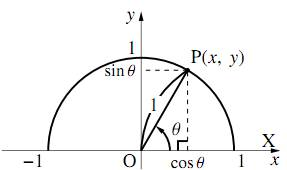
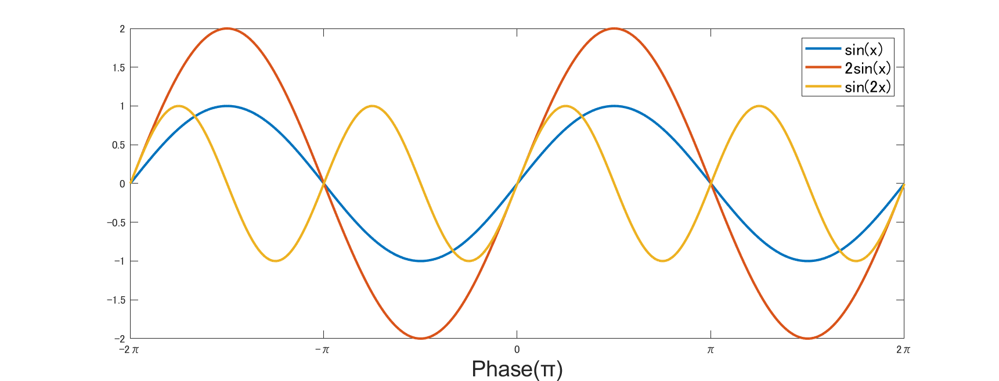
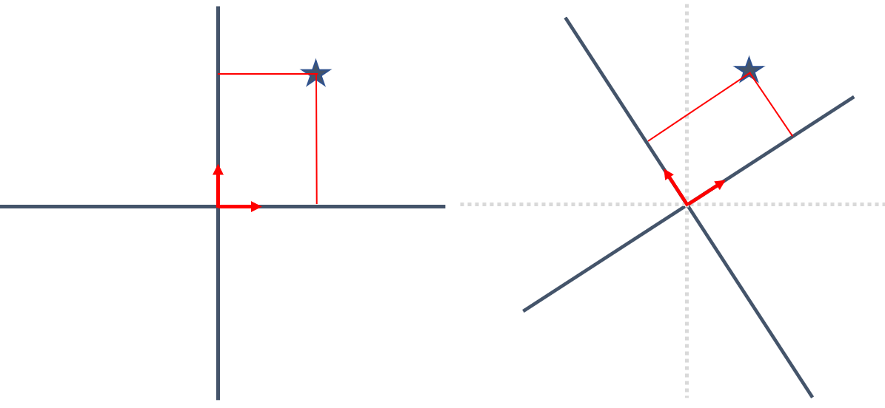
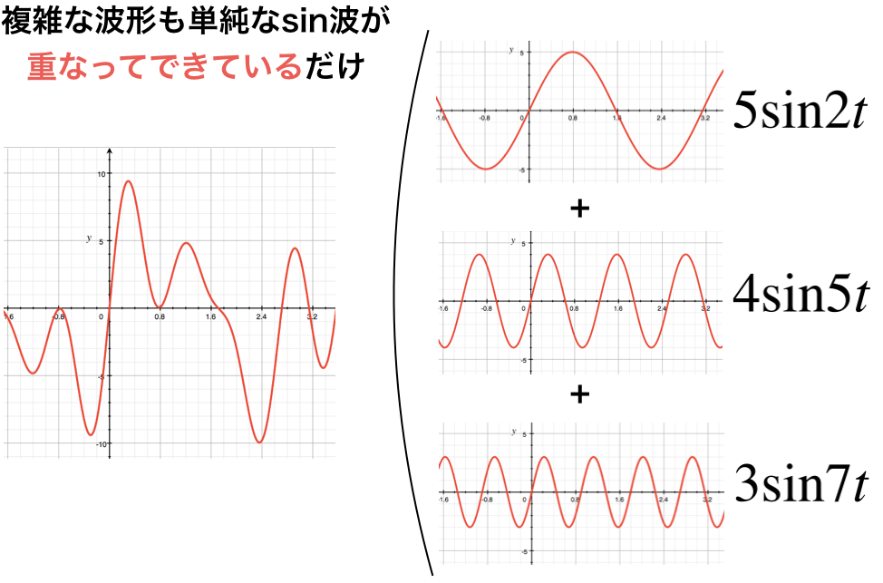

---
html:
  embed_local_images: false
  embed_svg: true
  offline: false
  toc: true

print_background: false

export_on_save:
  html: true
---

<div class="header">
  <table class="fixed-table">
    <thead>
      <tr>
        <th class="mokuji">目次</th>
        <th><details><summary> Math </summary><ul class="gnav"><details><summary>基礎数学編</summary>
        <ul class="index">
        <li><a href="../../Math/Basic/basic.html">ホーム</a></li> 
        <li><a href="../../Math/Basic/multiplication.html">掛け算</a></li>     
        <li><a href="../../Math/Basic/trigonometric.html">三角関数</a></li>
        <li><a href="../../Math/Basic/complex.html">複素数</a></li>
        <li><a href="../../Math/Basic/calculus.html">微分・積分</a></li>
        <li><a href="../../Math/Basic/linear_algebra.html">線形代数</a></li>
        <li><a href="../../Math/Basic/statistics.html">基礎統計</a></li>
        </ul></details>
        <ul class="gnav"><details><summary>信号処理編</summary>
        <ul class="index">
        <li><a href="../../Math/Analysis/Analysis.html">ホーム</a></li> 
        <li><a href="../../Math/Analysis/fourier.html">フーリエ変換</a></li>
        <li><a href="../../Math/Analysis/wavelet.html">wavelet変換</a></li>
        <li><a href="../../Math/Analysis/hilbert.html">ヒルベルト変換</a></li>
        <li><a href="../../Math/Analysis/eeg.html">基本の脳波解析</a></li> <li><a href="../../Math/Analysis/phase_analysis.html">位相同期解析</a></li>
        </ul></details>
        <ul class="gnav"><details><summary>統計編</summary>
        <ul class="index">
        <li><a href="../../Math/Statistics/Statistic.html">ホーム</a></li> 
        <li><a href="../../Math/Statistics/distribution.html">確率分布</a></li>
        <li><a href="../../Math/Statistics/central_limit_theorem.html">大数の法則と中心極限定理</a></li>
        <li><a href="../../Math/Statistics/statistic.html">統計量と標本分布</a></li>                                                         <li><a href="../../Math/Statistics/test.html">統計的検定</a></li>
        <li><a href="../../Math/Statistics/anova.html">分散分析</a></li>
        <li><a href="../../Math/Statistics/logistic_regression.html">ロジスティック回帰</a></li>
        </ul></details>
        <ul class="gnav"><details><summary>その他</summary>
        <ul class="index">
        <li><a href="../../Math/Others/Others.html">ホーム</a></li> 
        <li><a href="../../Math/Others/ICA.html">独立成分分析</a></li> 
        <li><a href="../../Math/Others/CCA.html">正準相関分析</a></li>
        <li><a href="../../Math/Others/lagrange.html">ラグランジュの未定乗数法</a></li>
        <li><a href="../../Math/Others/Entropy.html">エントロピーと分布間距離</a></li>
        <li><a href="../../Math/Others/signal_detection.html">信号検出理論</a></li>
        </ul></details>
        </details></th>
        <th><details><summary> Analysis </summary>
        <ul class="gnav"><details><summary>EEGLAB</summary>
        <ul class="index">       
        <li><a href="../../Analysis/eeglab/eeglab.html">ホーム</a></li>                           <li><a href="../../Analysis/eeglab/setup.html">環境構築</a></li>
        <li><a href="../../Analysis/eeglab/import.html">データのインポート</a></li>
        <li><a href="../../Analysis/eeglab/prepro1.html">基本的な下処理</a></li>
        <li><a href="../../Analysis/eeglab/prepro2.html">発展的な下処理</a></li>
        <li><a href="../../Analysis/eeglab/analysis1.html">単被験者での解析</a></li>
        <li><a href="../../Analysis/eeglab/analysis2.html">被験者群での解析</a></li>
        </ul></details>
        <ul class="gnav"><details><summary>MNE-python</summary>
        <ul class="index">
        <li><a href="../../Analysis/MNE/MNE.html">ホーム</a></li>
        <li><a href="../../Analysis/MNE/import.html">データのロード</a></li>
        <li><a href="../../Analysis/MNE/preprocessing.html">前処理</a></li>
        </ul> </details></details></th>
        <th><details><summary> Experiment </summary>
        <ul class="gnav">       </ul> </details></th>
        <th><details><summary> Simulations </summary>
        <ul class="gnav"><details><summary>環境構築</summary>
        <ul class="index">
         <li><a href="../../Simulation/Setup/Setup.html">ホーム</a></li>
        <li><a href="../../Simulation/Setup/environment.html">Python環境構築</a></li>
        <li><a href="../../Simulation/Setup/gpu.html">pythonでのGPUセットアップ</a></li>
        <li><a href="../../Simulation/Setup/jupyter.html">Jupyterセットアップ</a></li>
        <li><a href="../../Simulation/Setup/julia.html">Juliaセットアップ</a></li>
        </ul></details>
        <ul class="gnav"><details><summary>非線形力学</summary>
        <ul class="index">
        <li><a href="../../Simulation/NonlinearDynamics/Nonlinear-dynamics.html">ホーム</a></li>
        <li><a href="../../Simulation/NonlinearDynamics/dynamics.html">力学系とは</a></li>
        <li><a href="../../Simulation/NonlinearDynamics/stability.html">線形安定性解析</a></li>
        <li><a href="../../Simulation/NonlinearDynamics/stability_nonlinear.html">非線形系の安定性解析</a></li>
        </ul></details>
        </details></th>
      </tr>
    </thead>
  </table>
</div>

<h1><span>02</span>三角関数</h1>

オイラーの公式，ひいては脳波解析を理解するための最初の課題は三角関数を理解する事です．三角関数は様々な便利な性質をもっており，脳波に限らず信号の解析をしていく上で非常に重要，というより一番基礎になる概念かもしれません．しっかりとここで確認しておきましょう．
<!-- @import "[TOC]" {cmd="toc" depthFrom=2 depthTo=4 orderedList=false} -->

<!-- code_chunk_output -->

- [三角比](#三角比)
  - [三角比の公式](#三角比の公式)
- [三角関数](#三角関数)
  - [加法定理](#加法定理)
  - [正弦と余弦](#正弦と余弦)
- [関数の内積](#関数の内積)
  - [関数の直行性](#関数の直行性)
  - [直交性](#直交性)
  - [基底関数としての三角関数](#基底関数としての三角関数)
- [フーリエ変換への一歩](#フーリエ変換への一歩)
  - [オイラーの公式の意義](#オイラーの公式の意義)

<!-- /code_chunk_output -->

## 三角比
三角関数の前に, まずは三角比から復習します. 三角比とは, $\sin x$ や $\cos x$， $\tan x$といった具合に三角形の辺の比を表す幾何学の方法でした. 直角三角形を考えた時, 横の長さが$\cos$, 縦の長さが$\sin$, そして斜辺の長さが$\tan$で表せるのは覚えているでしょうか. 

あくまで辺の比としてだせるので, あとで絶対値の分をかける必要がありますが, それでも非常に便利なものです. 

しかし高校数学では, 結局辺の長さや比を覚えているものでしか使えないため, 三角比の勉強をする意味に苦しんだことと思います.


$$
\sin 45^\circ = \frac{1}{\sqrt{2}} = \frac{\sqrt{2}}2
$$

$$
\cos \pi = -1
$$
こんなやつでした．

sinが縦, cosが横, そしてtanが傾きを表しているので, 基本的な直角三角形であればその場ですぐ計算できます．


<center></center>

とはいえ，一つの角が45°の直角三角形の辺の比とか，わざわざ変な記号を使わなくても覚えているだろと思ったのは筆者だけではないでしょう．


### 三角比の公式
三角比には, いくつか公式があります. 三角比が出たあたりで数学に置いて行かれる人の理由その2ですね．謎の公式を暗記させられることです．

しかしここを暗記で片づけるのは良くない. いったん確認してみましょう.

##### 三角比の公式
$$
\tan \theta = \frac{\sin\theta}{\cos\theta}\\
\sin^2 \theta + \cos^2\theta = 1\\
\tan^2\theta + 1 = \frac{1}{\cos^2\theta}
$$
#####

一つ目，tanについての式は自明ですね. 横の増加量分の縦の増加量なのだから, 傾き，ということ$\tan$ですよね．一次関数の時にやった傾きの定義と同じです．

二つ目の式も簡単ですね，縦の二乗と横の二乗の和が斜めの二乗，三平方の定理です． 三角比は半径1の円で考えることになるので，右辺の1も二乗された値として考えれば，分かりやすいはずです．

最後の式は一見ややこしいですが, 二つ目の式の両辺を $\cos^2\theta$ で割ってみればだせるはずです.

このように, 三角比の公式というのはおまじないではなく, 考えてみれば簡単なことでした. 感覚で理解し, すぐにその場で公式を作れるくらいにしておきましょう．


## 三角関数
さて, 三角比がどんなものか分かったうえで, それぞれの三角比を関数として考えてみます．関数とは，ある変数の値によって定まる数の集合の事です．つまり$x$が1,2,3,...と値をかえていくにつれて変化していく$y$などを指し，$f(x)$などと表します．

$\sin x $は
　$x$が$0 + 2\pi n$の時に0,
　$\frac{\pi}{2} + 2\pi n$の時に1, 
　$\pi + 2\pi n$の時に0, 
　$\frac{3}{2}\pi + 2\pi n$の時に-1
　を常に通り, その間を滑らかな曲線で結んだ関数になります. n の値は単位円上での何周目かを表します.

　$\cos x $も同様にして1 ,0 ,-1 ,0 となっています. 

　$\tan x$ はすこし特殊で, 三角形の斜辺の傾きを表すという性質上, 端がありません. よって x = 0の時には0, で正負方向に対称で$\frac{\pi}{2} + \pi n$で$\infty$ または $-\infty$ を極限としてとんでいきます.

さて, こうした三角比の関数，三角関数の何がすごいのかというと, 超単純な周期関数であることです. 

さらに, 実は $\sin$ と $\cos$ に限って言えば位相が違うだけでその形は全く同じです．

$$
\cos x = \sin (x + \pi/2)
$$

という関係が成り立つということです．実際，それぞれ関数としてMATLABでplotしてみると下のようになることが確認できます．

<details><summary>図の出力コードを展開</summary>

```MATLAB
t = (0:0.0005: 5)';
plot(sin(2*pi*1*t))
hold on
plot(cos(2*pi*1*t))
hold off
```
</details>

<center></center>

### 加法定理
こちらも同じく，三角関数の勉強が嫌いになる理由の一つです．というか日本の数学教育，公式の暗記ばかりさせるから数学力もつかないし嫌いになるしで良くないですよね．更にたちが悪いのは，理解していないものを暗記はしたくないというような(本来であれば)数学が向いているはずの学生が置いて行かれることにあって...と，愚痴はともかく，こちらも証明をしておきます．

どうせなら面白い証明の仕方をということで，オイラーの公式を用いる証明をやってみます．([オイラーの証明](../Analysis/fourier)) 

オイラーの公式より

$$
\mathrm{e}^{i(\alpha + \beta)} = \cos (\alpha + \beta) + i\sin (\alpha + \beta)
$$

指数法則より,
$$
\mathrm{e}^{i(\alpha + \beta)} = \mathrm{e}^{i\alpha} + \mathrm{e}^{i\beta} \\ = (\cos \alpha + i\sin\alpha)(\cos\beta + i\sin\beta) \\
= (\cos\alpha\cos\beta - \sin\alpha\sin\beta)\pm i(\sin\alpha\cos\beta + \cos\alpha\sin\beta)
$$

ここで再び先程の式と見比べると, 式の前半，実部がcos, 後半の虚部がsinの加法になっている事が分かります. ここから三角関数の加法定理は


$$
\sin (\alpha + \beta) = (\sin\alpha\cos\beta + \cos\alpha\sin\beta)\\
\cos (\alpha + \beta) = (\cos\alpha\cos\beta - \sin\alpha\sin\beta)
$$

と証明できます. tanについては，脳波解析では別に使わない...と思っているので今は飛ばします．

### 正弦と余弦
$\sin$と$\cos$の関数の定義は分かりましたが, それがなんで嬉しいのでしょうか？

　これを知るためには, $\sin$と$\cos$の関係はどんなものであるのか考える必要があります.

　ここで前回やった掛け算が出てきます. 
　任意の$\sin$関数と$\cos$関数の積を考えてみます.

$r_1\sin mx $と $r_2\cos nx $です.

ここで$r_1$, $r_2$は振幅, mとnは角周波数を示していますので, 異なる周波数の三角関数になっています.


<center></center>


次にこれらの掛け算を考え, さらにそいつを積分について考えると，実は以下のような関係が成り立ちます.

$$
  \int^\infty_{-\infty} r_1\sin mx r_2\cos nx dx = \int^{2\pi}_0 r_1\sin mx r_2\cos nx dx = 0
$$

　証明は加法定理を使うと出来るのですが，ちょっと面倒なので飛ばしておきます．気になる人は，たとえば[こちら](https://www.geisya.or.jp/~mwm48961/electro/trigono_int2.htm)を参考にしてみてください．

感覚的な話ですが，まず三角関数は $2\pi$周期で同じ波形の繰り返しになっています．また，山と谷がちょうど打ち消しあう関係になっているので，周期ごとに積分する，この場合だと面積を求めると0になるのは分かりやすいと思います．積分についてよく分からない場合，[積分](./calculus)を参考にしてください．

以上の理由より, 積分範囲が$\infty$ から$-\infty$じゃなくて1周期分で良いことが分かります.

　三角関数は0周りの横軸に対して対称な周期関数なので, それぞれが積分すると0なのは自明ですが, かけ合わせることによって波としては複雑になっても, 周期関数である事に変わりはなく, 積分しても0になるのは変わらないわけというわけですね．

```MATLAB
syms x         % シンボリック変数
int(cos(x), [0 2*pi])       % 0 -- 2pi の積分，どちらも当然 0
int(sin(x), [0 2*pi])

% [r1 r2 m n] = [2 3 3 10] の 0--2pi の積分. これも 0
int((2*(sin(3*x))*(3*cos(10*x))), [0 2*pi])  
```

## 関数の内積
さて, ここで掛け算の復習です. ベクトルの内積の定義を覚えているでしょうか．

　ベクトルの内積は，対応する次元の要素を掛け合わせたものの総和でした．[ベクトルの定義](./multiplication)の時に少し確認しましたが，関数もベクトルの一種と考えることが出来ます．

$$
f(x) = 2x
$$
という式を考えた時，$x$とそれに対応する$f(x)$の組を書き出してみると

$$
x = \begin{pmatrix}
  1 \\
  \vdots \\
  2 \\
  \vdots \\
\end{pmatrix}, f(x) = \begin{pmatrix}
  2 \\
  \vdots\\
  4\\
  \vdots
\end{pmatrix}
$$

といった具合になります．ドットで表しているのは，関数は連続な値をとるので自然数に限らないからです．

　このように，考えてしまえば，すごい事がおきます. **関数に内積を定義できる**のですね．

　注意点としては, ベクトルでは総和を$\sum$で表していましたが, 関数の場合はxが離散値ではなく連続値をとるため, 総和は$\sum$でなく$\int$で表すという事です.

##### ベクトル・関数の内積
**ベクトル**
　2つのベクトル$\mathbf{a} = \begin{pmatrix}
  a_1,a_2, ... , a_n\end{pmatrix}\mathbf{b} = \begin{pmatrix}b_1,b_2, ... , b_n\end{pmatrix}$について，その内積は

$$
\sum_{i=1}^n a_i b_i
$$

**関数**
　2つの関数$f(x), g(x)$について，その内積は
$$
f(x)\cdot g(x) = \int_\infty^\infty f(x)g(x)dx
$$

#####


### 関数の直行性
では，関数をベクトルとして捉えることにより，そこに内積を定義できると何が嬉しいのでしょうか．関数においても，両者の関係，あるいは似ている度の算出が出来るようになることです．

ベクトルの内積では，両者の間の角度が内積の値に影響してきました．同じ方向を向いていれば1に近く，真逆を向いていれば-1，そして全くの無関係である直交，$1/2\pi$の時には0を取っていました．

逆に言えば，内積の値からそれぞれのベクトルの向きがどういう関係にあったかが分かるわけです．

ベクトルの内積を関数の内積に拡張する事ができ, ベクトルの内積が0という事は直交を表す...すなわち関数についても直行性を定義する事が出来るのです.

こう考えると，先程の三角関数の積の積分が0になることの面白さが分かります．2つの三角関数の，対応する要素同士をかけたものを更に全要素足し合わせると0になる...つまり内積が0ということです．

**$\sin$と$\cos$などの二つの異なる三角関数は，全て直交している**のですね．

　(ただし，ここでよくある勘違いについて言及しておくと, 直交と直角は別のニュアンスです. あまり図形的なイメージはもたない方が良いです．)

### 直交性
異なる三角関数が2つあると，それらは直交するということはこれまでで分かりました．ではそもそも，それのどこが嬉しいのでしょうか．

これについて考えるには，直交性と基底について理解する必要があります．といっても，そこまで難しいものではなく，既に感覚的に理解されていると思います．

二次元の平面を考えた時，x軸とy軸があれば平面上の任意の点を一意に表現できたことを思い出してください．(2,1)とか，そういった表記です．

あれは，xとyのそれぞれの軸に対し「１」という長さの単位を定義することで，あとはそれぞれが何倍されたのかを表す方式でした．(2,1)であれば，xの単位「１」が2倍，yの単位「１」が1倍された位置，という意味です．

この時の単位になるそれぞれのことを基底ベクトルと言います．先程の例をベクトルの言い方にするなら，基底ベクトルは(1,0)と(0,1)の二つです．これらがそれぞれ2倍と1倍されて，足されているので
$$
2\begin{pmatrix}
  1\\
  0
\end{pmatrix} + 1\begin{pmatrix}
  0\\
  1
\end{pmatrix} = \begin{pmatrix}
  2\\
  1
\end{pmatrix}
$$
というわけですね．

いわゆるxy平面では，基底ベクトルを引き延ばすことで引かれる線が軸になっていました．図では赤い矢印が基底ベクトルです．

<center></center>

実はこの考え方は，$x,y$軸のように必ずしも水平と垂直の2本である必要はありません．図の右のように，基底ベクトル同士が直交しているのであれば成り立ちます．

逆に言うと，直交する基底がn個あれば，n次元空間上での点を一意に定めることが出来るわけで，つまりn次元空間上の全ての点は直交基底の組み合わせによって表現することが可能なわけです．


### 基底関数としての三角関数
ここまでくると察せる方も多いでしょうが，三角関数は内積が0，直交するということで，基底ベクトルの関数版，基底関数として扱うことが可能になるわけです．

改めて，三角関数の内積関係についてまとめると以下になります

##### 三角関数の内積
非負の整数$n,m\in \mathbb{N}$について
$$
\int_{-\infty}^\infty \sin(nx) \cos(mx)dx = 0 \\
\int_{-\infty}^\infty \sin(nx) \sin(mx)dx = \left\{
\begin{array}{ll}
0 & n\neq m \\
\pi & n=m
\end{array}
\right.
 \\
\int_{-\infty}^\infty \cos(nx) \cos(mx)dx = \left\{
\begin{array}{ll}
0 & n\neq m \\
\pi & n=m
\end{array}
\right. 
$$
#####

ここから，三角関数は自分自身以外との内積は全て0，つまり**全ての周波数の三角関数($\cos$と$\sin$も別カウント)が基底関数**となることが分かります．

更に，自明なことですがこれらは全て任意の定数$a$との内積も0です．よって，定数も基底になります．

以上のことより，基底関数となる$-\infty$から$\infty$までの全ての$\cos,\sin$と定数$a$を用いることで，どんなに複雑な関数であろうと，これらの線形和で表すことができることになります．

あとは，それぞれの基底関数が何倍されているのかを算出してあげるだけです．


<center></center>

([宇宙一分かりやすいフーリエ変換](https://www.yukisako.xyz/entry/fourier-transform)より)

ただし，元となった基底の三角関数が周期関数なので，この方法で記述できるのもやはり周期関数に限るという制約はあります．


## フーリエ変換への一歩
前項での内容を式に表すとこうなります. 

$$
f(t) = a_0 + \sum_{n=1}^\infty ({a_n \sin(nt) + b_n\cos(nt)})
$$

任意の時間関数$f(t)$は，基底関数となる，全ての周波数の$\sin,\cos$を係数($a_n,b_n$)倍したものと，定数(基底1の定数倍)である$a_0$の足し合わせで表現できる，という内容です．

脳波の場合だと，定数$a_0$はDC電源の影響などですので，メインはやはり三角関数の部分になります．脳波も時間によって変化する時間関数ととらえる事が出来るので, この方法を用いることで，訳の分からない落書きにしか見えないような脳波を，単純な関数の足し合わせとして表現することが可能になります．

　そしてこの，時間関数$f(t)$を三角関数の和に変換する操作こそが，我々が理解を目指しているフーリエ変換です. ([フーリエ変換の詳しい説明](../Analysis/fourier))

### オイラーの公式の意義

とはいえ, 三角関数を$\infty$に足し合わせるというのも酷な話です．しかも，$\sin,\cos$で同じ周波数でも別々に計算しなければいけません．微分や積分も，面倒です．

　そこでオイラーの公式
$$
e^{i\theta} = \cos\theta + i\sin\theta
$$
の出番です．オイラーの公式を用いる事で, 三角関数の足し合わせ$(\sin+\cos)$は指数関数を使って表せます. これにより，劇的に計算を楽にする事ができるわけです．さらに指数関数なら，微積分の操作も簡便です．

　ただ, オイラーの公式には$\sin$の前に謎の記号 $i$ がついています. 一体これはなんなのでしょうか. 次の章では, 虚数と複素数について学びます.

<div style="text-align: center;">

【[次へ](./complex.html)】

</div>