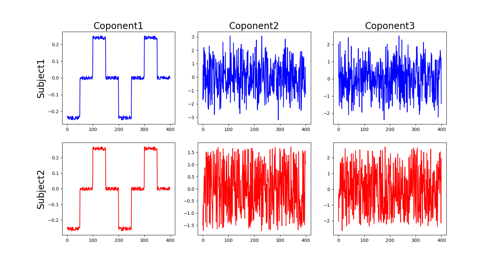

# 正準相関分析 (Canonical Correlation Analysis, CCA)

CCAは[PCA](./PCA.md)とかの仲間です．与えられたデータ群に含まれる共通成分を抜き出す目的で用いられます．


## 定義と用法
正準相関分析 (Canonical Correlation Analysis: CCA) は，二つのデータ集合の間に含まれる共通成分を抜き出します．三つ以上の場合はちょっと難しくなりますが例のごとく一般 CCA みたいなものがあるそうですがここでは置いておきます．

とにかく，データ集合$\bm{x}, \bm{y}$が与えられた時，この二つの集合に共通して含まれる成分をどうにかして取り出すのが CCA の仕事です．

ここまで聞いただけだと特にすごさが分からないと思いますが，こいつの偉さは**それぞれのベクトルの成分は対応している必要がないし，そもそも次元も異なっても良いところ**です．つまり，$\bm{x}$ が 64 次元のベクトルなのに対し$\bm{y}$が 16 次元とかでも良いわけですね．成分同士まったく対応を考えてないからこそできる技です．


脳波なら，64 チャンネル脳波計で取ったデータと 16 チャンネル脳波計で取ったデータから共通の成分を抜き出すといったような事に使えるわけですね．便利です．

ではこれを，数学的にどうやっていくのか考えます．結論から言うと，CCAは与えられたそれぞれの観測データを線形変換した値間の相関係数が最も高くなるようにそれぞれの線形変換のパラメータを求める手法です．以下に数式を使って考えていきます．

<div class="box">
<div class="title">正準相関分析</div>
  $m$ 次元の観測ベクトル $\bm{x}$ と$n$ 次元の観測ベクトル $\bm{y}$ がある時，それぞれ $T$ 個のサンプルがあった場合に得られる $(x_1, y_1)...(x_T, y_T)$ について，以下に示す条件を満たす $\bm{a,b}$ によってそれぞれを線形変換する.
$$
\begin{align}
  u(\bm{x}) = \bm{a}^\top\bm{x},\quad v(\bm{y}) = \bm{b}^\top \bm{y}\\
  \bm{a,b} = \argmax_{a,b}\bm{a}^\top V_{xy} \bf{b} \\
  s.t. \qquad \bm{a}^\top V_{xx} \bm{a} = \bm{a}^\top V_{yy} \bm{a} = 1 \nonumber
\end{align}
$$

ただし，$\bm{x} \in \mathbb{R}^m, \bm{y} \in \mathbb{R}^n$．
</div>

です．

## 導出
さて，見ていきます．ここで観測ベクトル $\bm{x,y}$ はたとえば試行 1 と試行 2 の脳波データとか，被験者 1 と被験者 2 の脳波データとか，そんな感じです．

なので，$\bm{x}$が時系列として取れてると考えると $\bm{x}(t)$は電極分の次元を持つベクトルということになります．

問題設定としては，被験者1と被験者2では計測時の微妙な差とか，個人差とか，そういった諸々があってデータとしては違うんだけど，同じ刺激に対する反応が試行 $m,n$ 個ずつ得られている状況です．

そこで，被験者間で共通の成分を抜き出したいと考えます．そのままでは異なる活動なので，それぞれをよしなに線形変換して，なんか似た感じにしてから比較しよう！という発想です．

現実にはありえませんが極端な話，被験者1は2に比べて電位が2倍くらいになっていたとして，「じゃあ2倍してから比較すれば良いね！」という感じです．

そこで，この $\bm{x}$ を線形変換して得られる成分 $u_n$ を

$$
u_n = \bm{a}^\top \bm{x}_n
$$

とします．各時間 $n$ について，線形変換 $a^\top$ をしたものに置き換えていくわけです．この時の $\bm{x}_n$ は試行の次元を持っていますが，$\bm{a}$ との内積によってならされています．よって $u$ は，ある意味では被験者1の共通成分的なものを抜き出したことになります．

同様に $v_n$ についても

$$
v_n = \bm{b}^\top \bm{y}_n
$$

が得られます．それぞれ添え字を外すと，

$$
u = \bm{a}^\top \bm{x}, \quad v_n = \bm{b}^\top \bm{y}
$$

のように表せます．

そして， CCA は更に，被験者ごとに出したこの代表値同士が，似た挙動を示すことを要求します．

つまり， $u, v$ の類似度が高くなる線形変換 $\bm{a,b}$ を求める (最適化する) のが CCA の仕事，というわけですね．CCA ではこの類似度は相関係数によって評価します．

よって，**$u,v$間の相関係数が最大になるような $\bm{a,b}$ の組み合わせを選ぶ**ことになります．これが $\argmax$ で行われている処理ですね．

ただし，それだけではなく制約条件として，何やら変な奴らが1になるという制約を課しています．一旦これについては置いておきます．

まず，相関係数 (念のため．これは共分散をそれぞれの標準偏差で割ったものです) を求めます．

$$
u = \bm{a}^\top\bm{x},\quad v = \bm{b}^\top \bm{y}
$$

なので，$\bm{a,b}$ の下での相関係数は以下のようになります．

$$
\begin{align}
  \rho({\bm{a,b}}) &= \frac{E[u \ v]}{\sqrt{E[u^2]}\sqrt{E[v^2]}}\nonumber\\
  &= \frac{E[(\bm{a^\top x})(\bm{b^\top y})]}{\sqrt{E[(\bm{a^\top x})(\bm{a^\top x})]}\sqrt{E[(\bm{b^\top y})(\bm{b^\top y})]}}\nonumber\\
  &= \frac{\bm{a^\top}E[\bm{x y^\top}]\bm{b}}{\sqrt{\bm{a^\top}E[\bm{xx^\top}]\bm{a}}\sqrt{\bm{b^\top}E[\bm{yy^\top}]\bm{b}}}\\
  &= \frac{\bm{a^\top}C_{xy}\bm{b}}{\sqrt{\bm{a^\top}C_{xx}\bm{a}}\sqrt{\bm{b^\top}C_{yy}\bm{b}}}
\end{align}
$$

ここで，式 (3) から式 (4) への変形では 
$$
E[\bm{x,y^\top}] = C_{xy}, \quad E[\bm{xx^\top}]=C_{xx}, E[\bm{yy^\top}] = C_{yy}
$$

としています．これらは，分散共分散行列 (C) で得られるそれぞれの成分です．


おっと，説明を忘れていました．ここで用いる観測データですが，どちらも先に**サンプル平均が 0** になるように調整しておきます．つまり全体から平均を引けば良いです．

さて，そんな分散の概念を導入する事で式 (4) の形に相関係数 $\rho$ を整形できました．

ここで，少し頭のいい操作によって更にこいつを簡略化すると，CCA の式が導出できます．

式 (4) の分母と分子には，それぞれ $\bm{a}$ と $\bm{b}$ がいますよね．そのため，これらにそれぞれどんな正のスカラー数をかけても $\rho(\bm{a,b})$ の値は変わらない事が分かります．

これを利用しちゃいます．何をかけても良いんだから，$\bm{a}^\top C_{xx} \bm{a} = \bm{a}^\top C_{yy} \bm{a} = 1$ となるように標準偏差の値を整形してしまいます．具体的にどんな数をかけるのかは場合によるので気にせず，とにかくそう整形したことにします．

すると分母が全部消えるので結局，CCA が解くべき問題 (相関係数$\rho(\bm{a,b})$の最大化) は，以下の問題に帰着します．

$$
\begin{align}
  \bm{a,b} = \argmax_{a,b}\bm{a}^\top C_{xy} \bm{b} \quad \text{s.t.} \quad \bm{a}^\top C_{xx} \bm{a} = \bm{b}^\top C_{yy} \bm{b} = 1
\end{align}
$$

先程いれた仮定，標準偏差が 1 になるという制約条件を満たしつつ，相関係数を最大にする線形変換をする $\bm{a,b}$ を求めるという問題ですね．制約付き2次関数の最大化問題です．


では，この問題を [ラグランジュの未定乗数法](./Lagrange) を用いて解いていきます．分からない人は参照してください．とにかく，ラグランジュの未定乗数法を使うと式(5)は以下の関数の極値問題になります．

$$
\begin{align}
  L(\bm{a,b},\lambda_a, \lambda_b) &= \nonumber\\
  &\bm{a}^\top C_{xy}\bm{b} + \lambda_a(1-\bm{a}^\top C_{xx}\bm{a}) + \lambda_b(1-\bm{b}^\top C_{yy} \bm{b})
\end{align}
$$

ラグランジュ関数 (6) を $\bm{a,b}$ で微分して 0 とおくと，

$$
\begin{align}
  C_{xy} \bm{b} = 2\lambda_a C_{xx} \bm{a}, \qquad C_{xy}^\top \bm{a}=2\lambda_b C_{yy} \bm{b}
\end{align}
$$


という関係式が得られます．

ここで，式(7)のそれぞれに左から$\bm{a^\top, b^\top}$をかけてやると

$$
\begin{align}
  \bm{a}^\top C_{xy} \bm{b} &= 2\lambda_a \bm{a}^\top C_{xx} \bm{a} \nonumber\\
  &= 2\lambda_a \nonumber\\
  \bm{b}^\top C_{xy}^\top \bm{a} &= 2 \lambda_b \bm{b}^\top C_{yy}\bm{b} \nonumber\\
  &=2\lambda_b \nonumber\\
\end{align}
$$

となります．つまり，
- $2\lambda_a = 2\lambda_b = \lambda$ とおけ，さらに
- $\lambda$ はそのまま，今求めようとしている相関係数に関係する値


であるということが分かります．1つ目が成り立つ理由は，相関係数なのでどっちから計算しても一緒です．

以上の情報を使い，改めて式 (7) を行列の形でまとめると以下のようになります．

$$
\begin{align}
  \begin{bmatrix}
    0 & C_{xy}\\
    C_{xy}^\top & 0
  \end{bmatrix}
  \begin{bmatrix}
    \bm{a}\\
    \bm{b}
  \end{bmatrix}=\lambda
  \begin{bmatrix}
    C_{xx} & 0\\
    0 & C_{yy}
  \end{bmatrix}
  \begin{bmatrix}
    \bm{a}\\
    \bm{b}
  \end{bmatrix}
\end{align}
$$

一般化固有値問題に帰着できました．あとはこの問題を解くだけです．固有値が相関係数と等しいことは先程確認した通りなので，最大固有値に対応する固有ベクトルが，求める線形変換 $\bm{a,b}$ であることになります．

あとは一般化固有値問題を解くだけなので，アルゴリズムの説明はこの辺にしておきます．

## 例題

たとえば，以下のような階段状に変化する二つの信号を，ノイズの中から検出する問題を考えます．


<center></center>

てきとうに作った信号．脳波の背景には実はこんなものが隠れていた！という仮定のもと以降を進めます．

次に，こいつらをノイズに埋めます．CCAは二つのデータ群の間で行う処理だったので，こいつらをある電極データに含まれる真の脳波成分だったとして (こんな単純だったらなぁ...)，これが２人の被験者 (Sub1, Sub2) で得られたと仮定して次のようなデータ群を生成します．

<details markdown="1">
<summary>生成した信号のプログラム (clickで展開)</summary>

```python
from sklearn.cross_decomposition import CCA
import numpy as np
import matplotlib.pyplot as plt

sig = np.array([-1]*50 + [0]*50 + [1]*50 + [0]*50 + 
                            [-1]*50 + [0]*50 + [1]*50 + [0]*50, dtype=np.float64)
sig += (np.random.random(sig.shape) - 0.5)*0.1

noise1 = (np.random.random(sig.shape) - 0.5)*20
noise2 = (np.random.random(sig.shape) - 0.5)*20
noise3 = (np.random.random(sig.shape) - 0.5)*20
noise4 = (np.random.random(sig.shape) - 0.5)*20
noise5 = (np.random.random(sig.shape) - 0.5)*20

data1 = np.vstack([sig + noise1,  sig - noise1, sig - noise3, noise4]).T
data2 = np.vstack([sig + noise2,  sig - noise2, noise5]).T
```
</details>

<center></center>

それっぽく作ってみた信号群．Sub2は結構動いちゃって，試行が削られているとしましょう．なので被験者間でデータ数は異なります．

また，プログラムを見ると分かりますがSub1の4試行目，sub2の3試行目は見た目そんな変わりませんが，真の信号成分はもはや0，つまりノイズ100%の信号となっています．

さて，こんな状況で CCA さんはどういう結果を返してくれるでしょうか．

<details markdown="1">
<summary>CCAのプログラム (clickで展開)</summary>

```Python

cca = CCA(n_components=3)  # Set n_components to 2 or less
cca.fit(data1, data2)

y1, y2 = cca.transform(data1, data2)

plt.figure(figsize=(15,8))
plt.subplot(2,3,1)
plt.plot(y1[:,0], color="b")
plt.title('Coponent1', fontsize=20)
plt.ylabel('Subject1', fontsize=20)
plt.subplot(2,3,2)
plt.plot(y1[:,1], color="b")
plt.title('Coponent2', fontsize=20)
plt.subplot(2,3,3)
plt.plot(y1[:,2], color="b")
plt.title('Coponent3', fontsize=20)

plt.subplot(2,3,4)
plt.plot(y2[:,0], color="r")
plt.ylabel('Subject2', fontsize=20)
plt.subplot(2,3,5)
plt.plot(y2[:,1], color="r")
plt.subplot(2,3,6)
plt.plot(y2[:,2], color="r")
plt.savefig('../figures/CCA2.png')
```
</details>


<center></center>


はい！無事に階段成分を抜き出してくれました！素晴らしいです．
今回だとComponet1に定義した階段信号が現れ，2以降はノイズが並んでいます．


たしかに，第一正準相関変数として階段状の成分を抜き出せていますね．要求を満たしています．さて，他にも，知りたいのは第一正準相関変数に線形変換する際に，それぞれの変数がどの程度寄与しているのかなどを調べたいことがあります．

これは線形変換する際の固有ベクトルを確認すれば分かります．見てみると，Sub1とSub2はそれぞれ

$$
\begin{align}
  Sub1 =
  \begin{bmatrix}
   0.9136  && -0.4480 &&  -0.6491\\
   0.4989  &&  0.4517 &&   0.6545\\
   0.4658  &&  0.6629 &&  -0.3163\\
   0.1641  && -0.4768 &&   0.2311\\
  \end{bmatrix}\nonumber\\
  Sub2 =
  \begin{bmatrix}
   0.6191 &&  -0.7045 &&  -0.1879\\
   0.7948 &&   0.7018 &&   0.1872\\
  -0.4362 &&  -0.1553 &&   0.9642\
  \end{bmatrix}\nonumber
\end{align}
$$

となっています．それぞれ，行は元のデータの次元 (今回の例だと trial) で，列は第何正準相関変数がどの程度寄与しているかを表しています．こう見ると，第一正準相関変数である $u_1, v_1$ ，つまり階段成分はそれぞれ，ただのノイズだった Sub1の4試行目， Sub2の3試行目 では弱いことがわかります．


これ，試行で考えてるとちょっと微妙ですが，たとえば脳波のチャンネルで考えるなら「前頭 (Fp1,Fp2, Fz, F4) と頭頂 (Cz,C3,C4...) あたりの寄与が大きいので，こいつらの活動が共通している！！」なんて主張に使うことが出来そうですね．

あるいはより発展的には，別に次元数は一致しなくて良いし同じデータでなくても良いので，脳波とＭＲの結果でだとか，いろいろと応用する事が出来るかもしれません．

いずれ，ICAやPCAなど，他の線形変換を使った手法との違いとかも考えられると良いのかも．


## 補足

いくつか補足を置いておきます．

### 2次以降の成分
以上の説明のなかで CCA は$\argmax$ を解いていたので，相関が最大になる，つまり最大固有値の固有ベクトルしか求めていません．しかし，PCAとかのように第2成分以降も見たい場合があります．その場合は単に，固有値が大きい順に並べていって，対応する固有ベクトルを取るだけです．

ただし注意点として，元の次元以上に取り出すことは出来ません．まぁ他の手法考えても当たり前です． CCA の場合は $\bm{x,y}$ の次元が一致している必要はなく，それぞれ $m,n$ の次元 (先程の脳波の例では試行) のデータを持っています．よって，取り出せる最大成分数は $\min (m,n)$ です．

### 生の CCA は線形な問題にしか使えない
共通成分として埋め込まれている信号が全く等しい場合， CCA は上手く取り出せますが，データによって，つまり被験者間などで定性的には同じでも時系列として全く異なるものが含まれている場合などには上手くいきません．

たとえば，階段状だったとしても時間的，数値的ずれがあったりした場合です．

<center></center>

左がSubject1に埋め込んだ信号，右がSubject2に埋め込んだ信号．似ているのに...


<center></center>

結果はいまいち...

これらの状況に対応するためには，CCA の非線形化が必要になるようです．またいつか．