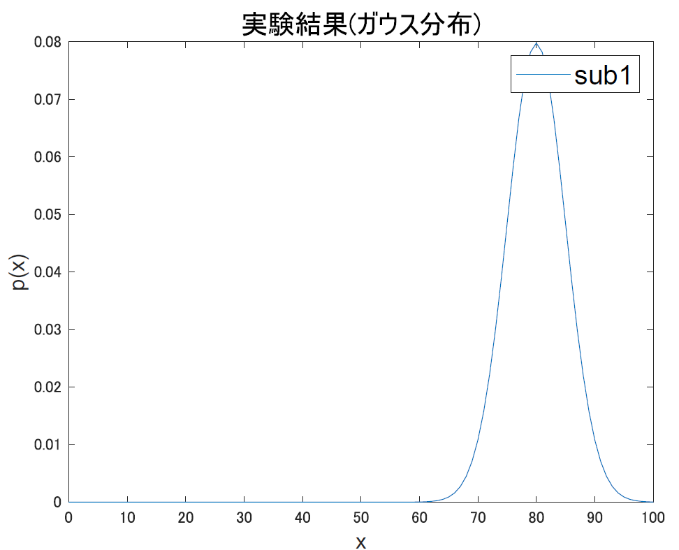
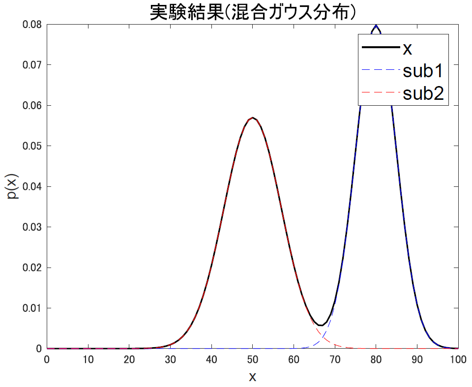
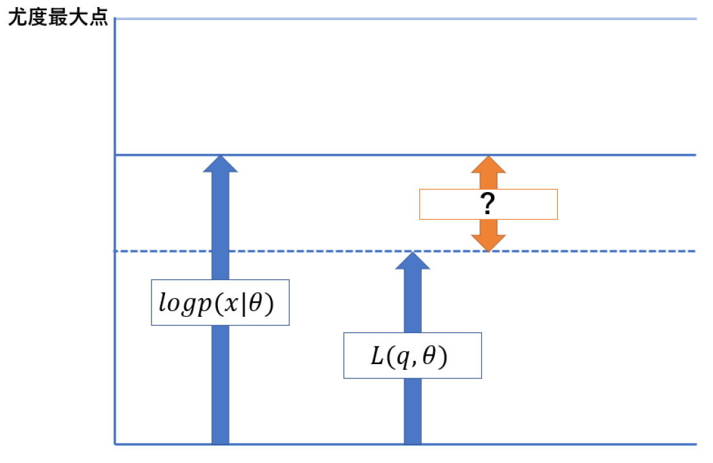
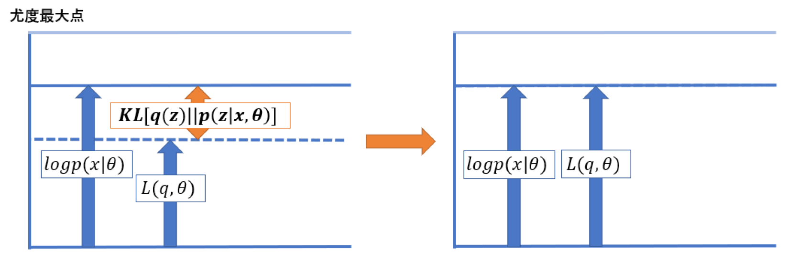
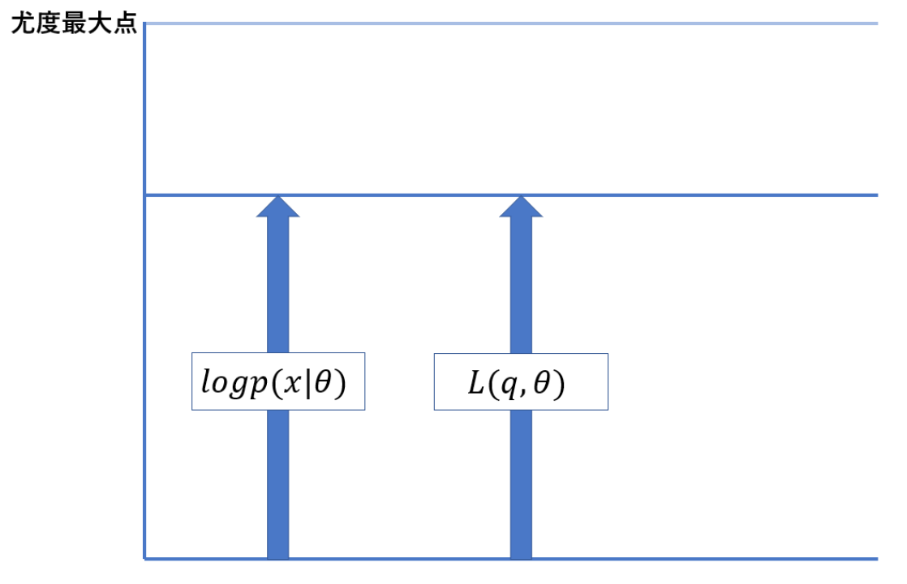
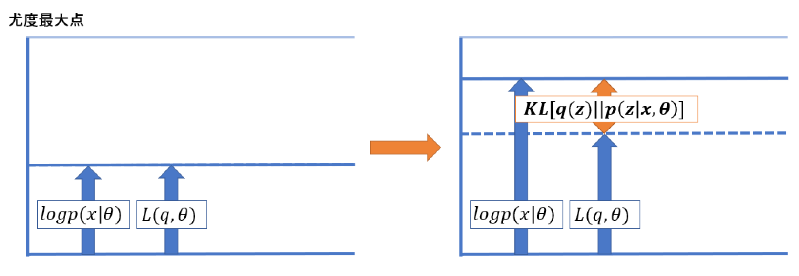

---
html:
  embed_local_images: false
  embed_svg: true
  offline: false
  toc: true

print_background: false

export_on_save:
  html: true
---

  <table class="fixed-table">
    <thead>
      <tr>
        <th class="mokuji">目次</th>
        <th>

 Math 
<ul class="gnav">

基礎数学編

        <ul class="index">
        <li><a href="../../Math/Basic/basic.html">ホーム</a></li> 
        <li><a href="../../Math/Basic/multiplication.html">掛け算</a></li>     
        <li><a href="../../Math/Basic/trigonometric.html">三角関数</a></li>
        <li><a href="../../Math/Basic/complex.html">複素数</a></li>
        <li><a href="../../Math/Basic/calculus.html">微分・積分</a></li>
        <li><a href="../../Math/Basic/linear_algebra.html">線形代数</a></li>
        <li><a href="../../Math/Basic/statistics.html">基礎統計</a></li>
        </ul>

        <ul class="gnav">

信号処理編

        <ul class="index">
        <li><a href="../../Math/Analysis/Analysis.html">ホーム</a></li> 
        <li><a href="../../Math/Analysis/fourier.html">フーリエ変換</a></li>
        <li><a href="../../Math/Analysis/wavelet.html">wavelet変換</a></li>
        <li><a href="../../Math/Analysis/hilbert.html">ヒルベルト変換</a></li>
        <li><a href="../../Math/Analysis/eeg.html">基本の脳波解析</a></li> <li><a href="../../Math/Analysis/phase_analysis.html">位相同期解析</a></li>
        </ul>

        <ul class="gnav">

統計編

        <ul class="index">
        <li><a href="../../Math/Statistics/Statistic.html">ホーム</a></li> 
        <li><a href="../../Math/Statistics/distribution.html">確率分布</a></li>
        <li><a href="../../Math/Statistics/central_limit_theorem.html">大数の法則と中心極限定理</a></li>
        <li><a href="../../Math/Statistics/statistic.html">統計量と標本分布</a></li>                                                         <li><a href="../../Math/Statistics/test.html">統計的検定</a></li>
        <li><a href="../../Math/Statistics/anova.html">分散分析</a></li>
        <li><a href="../../Math/Statistics/logistic_regression.html">ロジスティック回帰</a></li>
        </ul>

        <ul class="gnav">

その他

        <ul class="index">
        <li><a href="../../Math/Others/Others.html">ホーム</a></li> 
        <li><a href="../../Math/Others/ICA.html">独立成分分析</a></li> 
        <li><a href="../../Math/Others/CCA.html">正準相関分析</a></li>
        <li><a href="../../Math/Others/lagrange.html">ラグランジュの未定乗数法</a></li>
        <li><a href="../../Math/Others/Entropy.html">エントロピーと分布間距離</a></li>
        <li><a href="../../Math/Others/signal_detection.html">信号検出理論</a></li>
        </ul>

        
</th>
        <th>

 Analysis 

        <ul class="gnav">

EEGLAB

        <ul class="index">       
        <li><a href="../../Analysis/eeglab/eeglab.html">ホーム</a></li>                           <li><a href="../../Analysis/eeglab/setup.html">環境構築</a></li>
        <li><a href="../../Analysis/eeglab/import.html">データのインポート</a></li>
        <li><a href="../../Analysis/eeglab/prepro1.html">基本的な下処理</a></li>
        <li><a href="../../Analysis/eeglab/prepro2.html">発展的な下処理</a></li>
        <li><a href="../../Analysis/eeglab/analysis1.html">単被験者での解析</a></li>
        <li><a href="../../Analysis/eeglab/analysis2.html">被験者群での解析</a></li>
        </ul>

        <ul class="gnav">

MNE-python

        <ul class="index">
        <li><a href="../../Analysis/MNE/MNE.html">ホーム</a></li>
        <li><a href="../../Analysis/MNE/import.html">データのロード</a></li>
        <li><a href="../../Analysis/MNE/preprocessing.html">前処理</a></li>
        </ul> 

</th>
        <th>

 Experiment 

        <ul class="gnav">       </ul> 
</th>
        <th>

 Simulations 

        <ul class="gnav">

環境構築

        <ul class="index">
         <li><a href="../../Simulation/Setup/Setup.html">ホーム</a></li>
        <li><a href="../../Simulation/Setup/environment.html">Python環境構築</a></li>
        <li><a href="../../Simulation/Setup/gpu.html">pythonでのGPUセットアップ</a></li>
        <li><a href="../../Simulation/Setup/jupyter.html">Jupyterセットアップ</a></li>
        <li><a href="../../Simulation/Setup/julia.html">Juliaセットアップ</a></li>
        </ul>

        <ul class="gnav">

非線形力学

        <ul class="index">
        <li><a href="../../Simulation/NonlinearDynamics/Nonlinear-dynamics.html">ホーム</a></li>
        <li><a href="../../Simulation/NonlinearDynamics/dynamics.html">力学系とは</a></li>
        <li><a href="../../Simulation/NonlinearDynamics/stability.html">線形安定性解析</a></li>
        <li><a href="../../Simulation/NonlinearDynamics/stability_nonlinear.html">非線形系の安定性解析</a></li>
        </ul>

        
</th>
      </tr>
    </thead>
  </table>

<h1>EM アルゴリズム</h1>

<!-- @import "[TOC]" {cmd="toc" depthFrom=2 depthTo=4 orderedList=false} -->

<!-- code_chunk_output -->

- [EM アルゴリズム](#em-アルゴリズム)
- [不完全データ集合](#不完全データ集合)
- [EMアルゴリズムの概要](#emアルゴリズムの概要)
- [変分下界](#変分下界)
- [Eステップ](#eステップ)
- [Mステップ](#mステップ)

<!-- /code_chunk_output -->

## EM アルゴリズム
EMアルゴリズム，いろんなとこでよく聞きますよね．統計モデルとか，自由エネルギー原理とかを勉強するには，変分ベイズが必要になります．そしてその前に EM アルゴリズムはやっとくと楽です．

##### EMアルゴリズム
  確率モデルのパラメータ$\theta$を最尤推定する手法の一つ．観測可能な変数だけでなく，観測が不可能な潜在変数も観測データの振る舞いに影響している場合に使う
#####

ということで，最尤推定の問題を解く手法の一つです．

最尤推定は以下の式でいうところの，尤度$p(x|\theta)$を最大にするようなパラメータを推定する手法でした．

$$
\begin{align}
  p(\mathbf{\theta}|x) \propto p(x|{\theta)p(\theta)}
\end{align}
$$

与えられたデータ集合をX, 尤度関数をL

$$
\begin{align}
  L(\theta) = p(x_1, x_2, ... , x_n | \theta)
\end{align}
$$

として定義すると，最尤推定で解く問題は

$$
\begin{align}
  \hat{\theta} = \argmax_\theta L(\theta)
\end{align}
$$

であり，これはつまり最尤推定解は

$$
\begin{align}
  \frac{\partial}{\partial \theta}\log L(\theta) = 0
\end{align}
$$

の解でした．[統計編](../Statistics/estimation.html#最尤推定)でやってましたね．しかしここで，実は統計編の時には確認していなかった穴があります．その穴を解決するための手法の一つが EM アルゴリズムです．

## 不完全データ集合
さて，その穴とは何かを考えていきます．

たとえば「ある1人の行動指標」を観測変数として試行を繰り返すと，その結果はきっとなんらかの(普通は正規分布が妥当そう)分布に従いますよね．

では次に，「２人の被験者の行動指標」を観測変数とするとどうなるか考えます．まず 2 人のデータがちゃんと区別できるとすると，それは当然

この図の赤と青それぞれの分布のようなものが描けます．ここでは，平均点が80点と50点の２人の被験者を想定してます．

また，どっちの被験者の成績なのかが分からない状態でデータが得られる場合，二つのガウス分布の足し合わせで出来る黒線の分布によってデータ $x$ が取得されることになります．こうしてガウス分布を混ぜて作られる分布を **混合ガウス分布** と言います．

被験者が 1 人の場合，観測変数 $x$ が $\theta(\mu,\sigma)$ のパラメータに従って生成されているので普通に尤度関数を定義できました．が2人の場合どうでしょう．観測変数 $x$ は平均と分散だけでなく，どちらの被験者の結果なのかというもう一つのパラメータが必要になります．そこで，混合ガウス分布の式として

$$
\begin{align}
  p(x|\mu,\sigma,\pi) = \sum_j \pi_j N(x|\mu,\sigma)
\end{align}
$$

を考えます．$\pi$ はどっちの被験者が採用されるか...?多いか...?のパラメータです．ガウス分布に対する重みですね．というわけで，このパラメータ $\pi$ による被験者の決定結果として隠れた変数 $z$ を定義します．これはどっちの被験者が，つまりどちらのガウス分布からデータが生成されるかです．

するとここで考える尤度は $p(x|\theta)$ ではなく $p(x,z|\theta)$ になります．ここで $\theta$ も $(\mu,\sigma)$ から $(\mu, \sigma, \pi)$ になっています．

では尤度関数を定義して，偏微分して最尤解を求めよう...と思ったところで問題が生じます．$z$ が観測できないことです．観測できているのはあくまで $x$ であって，その背景にあった $z$ の値は不明です．こうなると，普通に最尤法を解くことはできなくなってしまいます．

これが最尤法の穴です．このように，データが生成される確率 $p(x,z)$ があった時にこのうち $z$ の情報が観測できないというようなデータ集合のことを不完全データ集合と言います．**EMアルゴリズムとは，不完全データ集合に対する最尤推定問題を解くための手法**である，ということになりそうです．ではようやく，中身に入っていきます．

## EMアルゴリズムの概要
数式を追っていくのはちょっとだけ大変なので，まずはモチベだけ確認します．EMアルゴリズムは，$p(x,z|\theta)$ をどうにかして解き，最尤な $\theta$ を求めるための手法です．ただしこの時，問題になるのは変数 $z$ が観測できないということでしたね．

そのため，まず変数 $z$ も確率変数であると考えて，尤度 $p(x,z|\theta)$ を $z$ 周りで周辺化することで普通の尤度 $p(x|\theta)$ と等しいよねっという風に考えてみます．つまり

$$
\begin{align}
  p(x|\theta) = \sum_z p(x,z|\theta)
\end{align}
$$

ですね．こうして，普通の最尤推定の時の尤度の最大化ではなく，尤度の期待値の最大化問題に置き換え，近似的に $\theta$ を求めていきます．んで，そのために二つのステップ, **Eステップ** と **Mステップ** を繰り返し計算していくから EM アルゴリズムと呼ばれます．そのステップはなんぞやってのは式を見てからにします．

## 変分下界
ということで，まずは例のごとく対数尤度の形に式を書き直します．

$$
\begin{align}
  \log p(x|\theta) = \log \sum_z p(x,z|\theta)
\end{align}
$$

と，いきたいところですがここで新たな問題が生じます．log-sumの形が出てきてしまっていることです．log-sumは解析的には扱いにくくて困る形です．寄り道になりますが，次はどうにかしてこのlog-sumを扱いやすい形に料理することが必要になります

いきなりですがここからなんかすごいアクロバットな事します．僕は思いつかないような技なんですけど...

$$
\begin{align}
  \log p(x|\theta) &= \log \sum_z p(x,z|\theta)\\
  &= \log \sum_z q(z) \frac{p(x,z|\theta)}{q(z)} 
\end{align}
$$

と，確率変数である $z$ についての分布 $q(z)$ を導入し，右辺に $\frac{q(z)}{q(z)}$ をかけます．こうすると，対数と期待値に関する Jansen の不等式 が適用可能になります．

##### Jansenの不等式
  $\log E[X] \geq E \log[X]$
#####

これを使うと，

$$
\begin{align}
  \log p(x|\theta) &= \log \sum_z p(x,z|\theta)\\
  &= \log \sum_z q(z) \frac{p(x,z|\theta)}{q(z)} \geq \sum_z q(z) \log \frac{p(x,z|\theta)}{q(z)}
\end{align}
$$

という関係式が成り立ちます．
この右側の項を

$$
\begin{align}
  L(q,\theta) = \sum_z q(z) \log \frac{p(x,z|\theta)}{q(z)}
\end{align}
$$

として定義すると，

$$
\begin{align}
  \log p(x|\theta) \geq L(q,\theta)
\end{align}
$$

という関係式が得られます．左辺は普通の対数尤度ですね．最尤推定において最大化したいやつです．それが，右辺のLと等号付きの不等式で表されています．

つまり求めたい対数尤度は常に関数 $L$ 以上であるという関係が見えるわけです．これを使うと，$L$ の最大化を進めていけばそれに従って尤度の方も最大化が進んでいくことが分かります．

そう，ここで何をしたかったのかと言うと, 今回求めるのが無理 (未知のパラメータ $z$ のせい) な尤度関数の最大化問題を，別の関数である $Ｌ$ の最大化問題に置き換えたわけですね！

以上の関係は

このようになります．ここで気になるのは，まず尤度と $L$ の間には $0$ 以上の「差」があることです．この差を $0$ に近付けていくことで，$\log p(x|\theta) = L(q,\theta)$ の関係までは $L$ を大きくすることが出来ます．

まずはこの問題を考えます．とりあえず計算してみます．

$$
\begin{align}
  &\log p(x|\theta) - L(q,\theta)\nonumber\\
  &=\log p(x|\theta) - \sum_z q(z) \log \frac{p(x,z|\theta)}{q(z)}\nonumber\\
  &=\log p(x|\theta) - \sum_z q(z) \log \frac{p(z|x,\theta)p(x|\theta)}{q(z)}\nonumber\\
  &=\sum_z q(z) \log p(x|\theta) - \sum_z q(z)(\log p(z|x,\theta)+\log p(x|\theta) -\log q(z))\nonumber\\
  &=-\sum_z q(z)(\log p(z|x,\theta) - \log q(z))\nonumber\\
  &=-\sum_z q(z) \log \frac{p(z|x,\theta)}{q(z)}
\end{align}
$$

色々やってますが，まず 1 行目は普通に先ほどの図でいうオレンジ矢印部分です．2 行目では乗法定理を使って 3 行目の形に書き直し，さらに log の計算を足し算の形にばらしたのが 4 行目です．ここで左側の項にも $\sum q(z)$ がかかっていますが，これは確率分布だから 1 になるので特に意味をなしません．んで $\sum q(z)$ で全体をくくって打ち消しあわせて，分数の形になおしています．

既に勉強済みの人は，この形をよく見るとそのまま[KL距離](./Entropy.html#KL距離)

$$
\begin{align}
  \log p(x|\theta) - L(q,\theta)&= -\sum_z q(z) \log \frac{p(z|x,\theta)}{q(z)}\nonumber\\
  &= KL[q(z)||p(z|x,\theta)]\nonumber
\end{align}
$$

になっていることに気付くでしょうか．てことで，オレンジの部分は $q(z)$ と $p(z)$ の KL 距離になることが分かります．

さて，ここからついに EM アルゴリズムの中身に入っていきます．

まずもう一度与えられている問題を考えると，最尤推定をするために最大化したいのは尤度 $\log p(x|\theta)$ だが，未知の観測不可な要素も孕まれているために普通に尤度の計算が出来ない，ということで $\log p(x,z|\theta)$ を考えて，これによって出てきた関数 $Ｌ$ の最大化をしていこうという問題にすり替えてきました．

関数 $Ｌ$ は $L(q,\theta)$ なので，いじれる変数は2つです．これらそれぞれの変数を使って関数の最大化をしていけばいいわけですね．

それぞれ，**片方を固定した状態でもう片方をその条件下で最適化する**，という作業を繰り返していくのが EM アルゴリズムです． Eテップと M ステップというのは，この 2 変数の最適化ステップに対応しています．つまり

$$
\begin{align}
  \text{E-step:} \qquad \hat{q} &= \argmax_{q}L(q,\theta)\nonumber\\
  \text{M-step:} \qquad \hat{\theta} &= \argmax_{\theta}L(q,\theta)\nonumber
\end{align}
$$

を交互に解く問題です．
順番に見ていきましょう．

## Eステップ

まず，先ほどの図

を見直して明らかなのは，$p(x|\theta)$ と $L(q,\theta)$ の間にある，$KL(q||p)$ を最小化する必要があるという事です．

$L(q,\theta)$ の $\theta$ を固定して，$q$ をいじって $KL(q||p)$ を最小化するステップが E ステップです．

$$
\begin{align}
  q &= \argmax_{q}L(q,\theta)
\end{align}
$$

Eはexpectation, つまり期待値です．もともと

$$
\begin{align}
  \log p(x|\theta) = L(q,\theta) + KL(q||p)\nonumber
\end{align}
$$

なので，ここで KLD が最小化されれば $L$ の最大化になるわけですね．さらに，KLD が 0 ってことは $q=p$ になる，つまり

$$
\begin{align}
  q(z) = p(z|x,\theta)\nonumber
\end{align}
$$

となることを意味します．q の分布が p の事後分布と等しくなったことが分かります．

## Mステップ
次にMステップです．今，Eステップによって

の状態にまで更新されています．ここから何をやれば良いのかですが，真の最大値はまだまだ上にいます．なので $p(x|\theta)$ と一緒に下界を押し上げる必要があります．

E ステップで KLD が最小化され，固定された $\theta$ の元では $\log p(x|\theta)$ が等しくなりましたが，ここで今度は $\theta$ の方の最適化を考えます．$q$ を固定し，$\theta$ を更新するわけですね．

$$
\begin{align}
  \hat{\theta} &= \argmax_{\theta}L(q,\theta)
\end{align}
$$

$\theta$ は $\log p(x|\theta)$ も KLD も条件に入っている変数なので，Lの $\theta$ を更新すると他も更新されます．

まず，Lは $\theta$ について最大化なので当然上に伸びます．

また KLD は 0 以上の値をとるもので，E ステップで 0 になっている状態なので KLD は変わらないか増加するかです．で，元々最大化したい量である $\log p(x|\theta)$ は

$$
\begin{align}
  \log p(x|\theta) = L(q,\theta) + KL[q||p]\nonumber
\end{align}
$$

があるので右辺が増加することによって一緒に増加します．こうして全体が上に押し上げられる感じですね．Mは Maximization のMで，最大化を意味します．

計算はまず $q(z)$ を固定して，$\theta$ の最大化をしていくので，E ステップの時に使っていた $\theta$ を $\theta_{old}$ としておきます．

L 関数の中身を先ほど求めた E ステップの結果を使って書き換えると

$$
\begin{align}
  L(q,\theta) &= \sum q(z) \log \frac{p(x,z|\theta)}{q(z)}\\
  &= \sum p(z|x,\theta_{old})\log p(x,z|\theta) - \sum p(z|x,\theta_{old})\log p(z|x,\theta_{old})
\end{align}
$$

となります．q の分布が事後分布と等しくなるってやつですね．
このうち，第二項は $\theta$ に依存していないので最大化の際は定数と考えていいので，すると

$$
\begin{align}
  L(q,\theta) &= \sum p(z|x,\theta_{old})\log p(x,z|\theta) + const.\\
  &= Q(\theta, \theta_{old}) + const.
\end{align}
$$

と，Q 関数の最大化問題に置き換えて考えられます．Q 関数は完全データの対数尤度 $\log p(x,z|\theta)$ の，E で求めた事後分布 $p(z|x,\theta_{old})$ による期待値であると考えることができます．こいつの最大化によって全体を押し上げるのが M ステップでした．ちなみに，ここで定数としたやつはエントロピーとよばれる量です．が，EM アルゴリズムでは関係ないのでスルー．

$$
\begin{align}
  \theta_{new} = \argmax_{\theta}Q(\theta,\theta_{old})
\end{align}
$$

これが実質の M ステップです．更新の結果 KLD がまた生じているので，またこいつを最小化するEステップをやり直します．で，また KLD が 0 になったら $\theta$ を変えて押し上げる M ステップ．この繰り返しをすることで L を限界まで最大化すると，一緒に値が更新されている対数尤度関数も最大化されるってわけですね．

これをやっているうちに，$\theta$ を更新しても KLD が増加しないところに来ます．こうなったときが最適化終了のタイミングです．
**Expectation と Maximization を繰り返す，期待値最大化法がEMアルゴリズムの正体**でした．

##### EMアルゴリズム
  1. Eステップ: 現在推定されている潜在変数の分布に基づいて，モデルの尤度の期待値を計算．
  2. Mステップ: Eステップの尤度期待値を最大化するパラメータ$\theta$を求める．
  3. Mステップで求まったパラメータは，次のEステップで使われる潜在変数の分布を決定するために用いられる．
  4. この2ステップの繰り返しで値が更新されなくなったところで最適化終了
#####

<footer>

【[ホーム](.././../index.html)】

</footer>