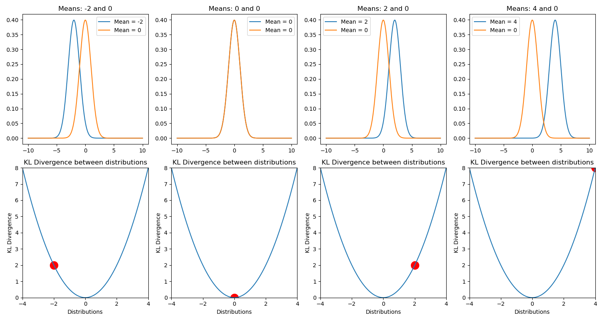

# エントロピーと分布間距離

近年は神経科学に情報理論の議論を輸入するのが流行りになっている気がします．脳波の解析もだし，情報処理の理論もそうだし，いろんなとこで見るのでとりあえず勉強します．

## エントロピー
はじめにエントロピーの考え方を導入しましょう．まずは離散確率変数 $x$ を考えます．観測者がこの変数に対するある値を観測したとき，どれだけの情報量，surpriseを得られるのか．これを考える概念がエントロピーです.

直観的に，起きそうもない事象が得られたら情報量は大きいし，その逆も然りですよね．宝くじで1等があたるのはめちゃくちゃびっくりする，つまり情報量大きいけど，参加賞的なのもらっても何も思いません．つまり情報量は確率分布 $p(x)$ に依存していて，その値によって定まる単調な関数 $h(x)$ といえます．

また，２ つの事象 $x, y$ を考えたとき，これらが独立なら両方を観測したときの情報量は別個に観測したときの情報量の和と等しい (式 (1)) はずです．宝くじが当たる事による surprise によって，帰りに頭に雷が落ちてくる事によって生じる surprise が小さくみたいになることはないですよね？あるかもな．ないってことにしてください．

よって，二つの事象が独立なのであれば情報量について以下の式 (1) が成り立ちます．

$$
\begin{align}
h(x,y) = h(x) + h(y)
\end{align}
$$

次に，これらの事象の同時確率についても単純に積で求められます．宝くじが当たり，かつ頭に雷が降ってくる確率です．

$$
\begin{align}
p(x,y) = p(x)p(y)
\end{align}
$$

もし式(1,2)が分からないようなら基本的な確率が出来てないので，[基礎統計](../../Math/Basic/statistics.html)で勉強してみてください．

さて，ここはちょっとテクいです．

この二つの関係から，「 $x$ と $y$ の確率をかける操作をしたものに対して何らかの処理をしたものが，何らかの処理をした $x$ と $y$ の和になっている」ので，関数 $h(・)$ は対数をとっている事が分かり（ほら，掛け算って対数だと足し算じゃん？），

$$
\begin{align}
h(x) = -\log p(x)
\end{align}
$$

がいえます．$log (x)$ は単調増加で，確率 $p(x)$ は常に $0$ から $1$ の範囲をとるため，$h(x)$ の値を常に正にするため符号を反転させている事に注意です．ここで対数の底に 2 を採用するのが情報理論での一般の使い方で，その場合は $h(x)$ の単位は bit になるようです．

これを使って，信号のサイズ，情報量 (bit) を算出してるわけですね．あとデータの圧縮なんかにも関係するぽいですがそこまでは知らないし触れませんし触れられません．

次に，この値を分布全体に適用する事を考えます．つまり，確率分布そのものが与える情報量です．その指標として，確率変数 $x$ の分布 $p(x)$ に関して $h(x)=-\log p(x)$ の期待値をとることで，情報量の平均を定義します．確率変数の期待値の一般的な計算です．これも分からなければやはり[基礎統計](../../Math/Basic/statistics.html)に行ってください．

$$
\begin{align}
H[x] = - \Sigma_{x} p(x) \log p(x)
\end{align}
$$

式(4)に定義する量をシャノンエントロピーといいます．意外と簡単ですね．もっと難しいと思ってました．

ついでにこれを連続変数にすると微分エントロピー (式 5) が求まります．

$$
\begin{align}
H[x] = - \int_{-\infty}^\infty p(x) \log p(x) dx
\end{align}
$$

言うまでもないと思いますが，$ \Sigma_{x} p(x)$ も $\int p(x)$も1です．

さて，次に当然浮かぶ疑問は，どんな確率分布だとどんなエントロピーが算出されるのか，です．

ちゃんと数学的に証明することも出来るっぽいけど面倒だしそこにあんま興味ないので，simulationしてみます．まずは離散的な確率分布として，

- ベルヌーイ分布
- 二項分布
- 幾何分布
- ポアソン分布

について，これらの分布に従う集合をてきとうに用意してエントロピーを計算してみました．

一様分布が最大だということが分かりますね．エントロピーは予測のしにくさという話だったので，当然といえそうです．

基本的に，幅広い分布の方が高いエントロピーになります．これが一様分布になる理由は，エントロピー $H$ の最大化問題を解けばよいわけですが，確率なので$\sum_i p(x_i)-1 = 0$ が制約になります．[ラグランジュの未定乗数法](./lagrange.html)を使ってあげれば

$$
\begin{align}
  {H} = - \sum_{i} p(x_i) \log p(x_i) + \lambda(\sum_i p(x_i) -1)
\end{align}
$$

となります．これが成り立つ $p(x_i)$ の組は，$i$ によらない定数 $\exp{-1-\lambda}$ となり，つまり全ての $x_i$ が等しい確率で出る一様分布であることがわかります．この時の確率は $p(x_i) = 1/M$ (Mは状態の総数)です．

ちなみに微分エントロピー，つまり連続の場合はガウス分布が最もエントロピー高いようです．

$$
H[x] = - \int_{-\infty}^\infty p(x) \log p(x) dx
$$

微分エントロピー．

一応証明します．

まず平均 $\mu$, 分散が $\sigma^2$ となる分布を考え，そいつらの中でエントロピーを最大化すれば良いので制約条件として，

- $\int_{-\infty}^\infty p(x)dx = 1$
- $\int_{-\infty}^\infty xp(x)dx = \mu$
- $\int_{-\infty}^\infty(x-\mu)^2 p(x)dx = \sigma^2$

を与え，これらの元で微分エントロピーを最大化します．制約条件下での最大化問題なので[ラグランジュ未定乗数法](./lagrange.html)をもってくると

$$
-\int_{-\infty}^\infty p(x) \log p(x) dx + \lambda_1 (\int_{-\infty}^\infty p(x)dx -1) \\+ \lambda_2 (\int_{-\infty}^\infty x p(x)dx-\mu) + \lambda_3 (\int_{-\infty}^\infty(x-\mu)^2p(x)dx-\sigma^2)
$$

を最大化する問題になります．
計算をすると，

$$
\begin{align}
  p(x) = \frac{1}{(2\pi\sigma^2)^{\frac{1}{2}}}exp\{-\frac{(x-\mu)^2}{2\sigma^2}\}
\end{align}
$$

と，たしかに正規分布が出てくるわけです．正規分布の式の導出，統計編だと「なんとなく指数分布をいじると～」みたいに visual を近付けるみたいな方法でやりましたが正しくはこれで導くのが (情報系だととくに) 多いっぽいですね．

てなわけで連続の確率分布においてエントロピー最強は正規分布になるのでした．

他にもエントロピーについて見れる性質があって，まず $p(x)$ が $0$ は困ります．$\log$ にかけた時に計算がこわれるので．無限に吹っ飛びます．

あと，一様分布の比較から分かるようにデータ数が多いほどエントロピーも増大するぽいですね．これもまあ普通に総和とってるんだから当たり前か?

まあこんな感じなので，エントロピーの値だけを見てなにかしらの議論をすることは難しそうですね．エントロピーを増大/減少させるといった変化の議論だとか，そういった使い方の方がナチュラルに見えます．

## KL距離
さて，このエントロピーがどんな事に使えるのか考えていきます．エントロピーは分布の特徴を表す量になっていたわけなので，これを使うと二つの分布の比較，なんてことも出来ることになります．直観的には，全く同じ特徴の分布同士ならそのエントロピーに差はないし，違う分布なら差がある，という感じです．

式にしてみましょう．まず，微分エントロピー ($- \int p(x) \log p(x)$) は確率変数 $x$ の分布 $p(x)$ の元での期待値でした．なら，ここで新しい分布 $q(x)$ を考えたとき，仮にこの分布が同一 ($p(x) = q(x)$) であれば，

$$
\begin{align}
  \int p(x) \log q(x)dx - \int p(x) \log p(x)dx= 0
\end{align}
$$

が成り立つ事になります．同じ分布の元で考えた同じ確率変数の期待値だから，当たり前です．分布 $p(x)$ の元で見た $q(x)$ の期待値が，分布 $p(x)$ の元で見た $p(x)$ の期待値と等しい，ということです．逆にこの分布が異なるものであるほど，この計算の結果は大きな値を取る事になります．

てなわけで，この量をちゃんと正負の調整した上で，「分布 $p(x), q(x)$ の相対エントロピー，あるいはカルバック-ライブラー距離，またはカルバックライブラーダイバージェンス」として以下の式で定義します．

$$
\begin{align}
  D_{\mathrm{KL}}(p||q) &= - \int p(x) \log q(x)dx - (-\int p(x) \log p(x)dx) \\
  &= -\int p(x) \log \frac{q(x)}{p(x)} dx \nonumber
\end{align}
$$

すこしややこしく見えますが，基本的には式 (8) を $\log$ について整理しただけです．簡単ですね.

KL 距離の性質ですが，まず $D_{\mathrm{KL}}(p\|\|q) \geq 0$ です．距離だし．
等号が成り立つのは分布 $p(x), q(x)$ が等しいときのみです．

上の図は，二つの標準偏差 1 で平均値の異なる正規分布間の $D_{\mathrm{KL}}(p\|\|q)$.

それから $D_{\mathrm{KL}}(p \|\| q) \neq D_{\mathrm{KL}}(q \|\| p)$ なことにも気を付けてください．分布 $p(x)$ の元で見た $q(x)$ の期待値と, 分布 $q(x)$ の元でみた $p(x)$ の期待値とは別物ですからね．

それから，対数なので KLD は以下のような表記のこともあります．一緒です．$\log$ の計算の性質を思い出してください．割り算は引き算です(?)

$$
\begin{align}
  D_{\mathrm{KL}}(p||q) =  \int p(x) \log \frac{p(x)}{q(x)} dx
\end{align}
$$

留意してください．

あと，KL "距離" と日本語で呼んでいますが**厳密には距離じゃない**ので注意が必要です．というのも，KLD は以下に示す距離の公理を満たしていないからです．

距離の公理

2点A,Bが与えられたとき, 実数 $d(A,B)$ を与える規則で, 次の性質を満たすものを距離という.

- $d(A, B) \geq 0$
- $d(A, B) = 0 \leftrightarrow A=B$
- $d(A, B) = d(B, A)$
- $d(A, B) + d(B, C) \geq d(A, C)$

このうち，KLD が満たしていないのはなんでしょう？

そう，３つめの対称性ですね！ $D_{\mathrm{KL}} (p\|\|q) \neq D_{\mathrm{KL}} (q\|\|p)$ でした．

あと４つ目，三角不等式も怪しいと思うんですよね．呼んでた資料とかでは特に対称性のとこだけネチネチと言われてましたが，三角不等式はどうなんでしょう？

直観的には微妙だと思ってて，だから KLD の値を単純に比較したりだとかの議論は出来ない気がしている．

じゃあKLDはどう使うんだよって話ですが，最小化したい量として導入してるのが多い気がします.

つまり，予測分布を真の分布に近づけたい，だとかですね．この時に最小化する，分布と分布との距離として使われる量です．

あとは，一様分布と得られたデータ分布との距離を測る，なんて使い方もありました. この場合は正規化的なのして，$D_{\mathrm{KL}} (P\|\|U)$ (U は一様分布) を $0-1$ の値にして使ってましたね．

いまのとこ個人的に分からないのは，$D_{\mathrm{KL}} (A\|\|B)$ と $D_{\mathrm{KL}} (C\|\|D)$ の値を比較した議論 (たとえば，A-B は C-D の 3 倍離れている！) なんてのは出来るのかなってところです．

ユークリッドなら自明に出来ると思うんですけど，これだとなんか出来ない気がする．三角不等式も怪しいし．
どうなんでしょう？今後の課題になってます．

余談ですが，式 (9) の右辺第一項，$-\int p(x) \log q(x)dx$ は交差エントロピー $H(p,q)$ とも言います．分布 $p(x)$ の元で見た $q(x)$ の期待値なので，$p(x)$ の分布を想定したとき，$q(x)$ がどれだけ予測しにくいかとも捉えられます．

これだけでも，交差エントロピー $H(p,q)$ は正解値と推定値の比較なんかの用途で使えるようです．

じゃあ KLD と何が違うのか，というと，ここからは個人的な予想ですが...

問題なのは $p(x)$ 自体の分布が既にもってる情報量，つまり $H(p)$ なんだと思います．

交差エントロピーは計算式をみれば分かるように，$p(x)$ 自体のエントロピーの影響を受けた数値になってしまうため，なんというか「どれくらい外れているか」の指標に使うにはフェアじゃない気がします．

なので交差エントロピーの値から，$p(x)$自体が持っているエントロピーの値を差し引いた量が知りたいわけですね．そうすると式 (9) は

$$
\begin{align}
D_{\mathrm{KL}}(p||q) = H(p,q) - H(p)
\end{align}
$$

とも捉えられますね．あってるのかな？

## 他の分布間距離
確率分布同士の距離を測る指標は $D_{\mathrm{KL}}$ だけでなく，他にも以下のようなのがあるっぽいです．

$$
\begin{align}
\chi^2(Q||P) := \Sigma_{i=1}^k \frac{(p_i - q_i)^2}{p_i} \qquad \qquad  \text{$\chi^2$統計量}\\
L_1(Q||P) := \int |Q(x) - P(x)|dx   \qquad \qquad  \text{$L_1$ノルム} \\
L_2(Q||P) := \int\{ Q(x) - P(x)\}^2 dx   \qquad \qquad  \text{$L_2$ノルム}\\
I_K(Q||P) := \int \{ \sqrt{Q(x)} - \sqrt{P(x)} \}^2 dx    \qquad \qquad  \text{ヘリンジャー距離}\\
\mathbb{D}(Q||P) := \int f(\frac{Q(x)}{P(x)}) Q(x)dx   \qquad \qquad  \text{f-ダイバージェンス}\\
I_\lambda(Q||P) := \int \{ (\frac{Q(x)}{P(x)})^{\lambda} -1 \}Q(x) dx   \qquad \qquad  \text{一般化情報量}\\
D_{\mathrm{KL}}(Q||P) := \int \log(\frac{Q(x)}{P(x)})Q(x) dx   \qquad \qquad  \text{KL情報量}
\end{align}
$$

どれがどんな時にどう使われるとかは調べてないです，でもこれでいくと上３つはよく見る気がする．でもまあ全体的に似てるポイですね．なんとなく哲学というか考え方はどれも似たりよったりな気がします．

## 条件付きエントロピー
エントロピーは式 (4,5) に示す量でしたが，これを条件付き確率 $p(x,y)$ に拡張して考えます．今 $x$ が既知である場合，同時分布 $p(x,y)$ について$y$ を特定するための情報は $-\log p(y\|x)$ なので（これはいいよね？条件付き確率です)，その合計は

$$
\begin{align}
H(y|x) = - \iint p(y,x) \log p(y|x) dy dx
\end{align}
$$

で表され，これは条件付きエントロピーといいます．さらにこれを使えば

$$
\begin{align}
H(x,y) = H(y|x) + H(x)
\end{align}
$$

と書けますね！エントロピーは対数なので，確率の乗法を意味しています．つまり $x$ と$y$ の同時分布を記述する情報量は，$x$ 単体の情報量と $x$ が与えられた元での $y$ の情報量との和になるわけですね．

## 相互情報量
KL距離は分布と分布の距離を測れる便利な指標でした．

これを使った，これまた便利そうな指標の一つが相互情報量です．二つの変数 $x, y$ を考えて，こいつらの同時分布 $p(x,y)$ が得られたとします．この時，この変数２人の間にどんな関係があるのか確認したくなりますよね．他人なのか，それとも親密な関係なのか...まあつまり独立かどうかです．

さて，KL 距離はこの独立性の検証的な使い方が可能で，それがまさに相互情報量の計算です．式を見た方が早いでしょう．

$$
\begin{align}
MI(x,y) = H(x) + H(y) - H(x,y)
\end{align}
$$

$x$ と $y$ が独立であった場合の同時確率の情報量と独立でないときの情報量の離れ具合を見るわけですね．例のごとく対数なので，要は $p(x)p(y)とp(x,y)$ です．これは KLD を使えば式 (15) のように表せます．

$$
\begin{align}
  MI(x,y) &:= D_{\mathrm{KL}}(p(x,y) || p(x)p(y)) \nonumber\\
  &= -\iint p(x,y) \log \frac{p(x)p(y)}{p(x,y)} dxdy
\end{align}
$$

あら簡単．変数 $x,y$ の同時分布と周辺分布積との KLD を見るだけですね．KLD なので，両者が同じ，つまり $x$ と $y$ が独立である時に限って $0$ になる量ってわけですね．

てことは，$x$ と $y$ がずぶずぶの関係であるほど値が大きくなるわけだから，$y$ の値を知る事によって $x$ の不確実性が減った度合を表すと言えそうです．

KLD 同様，符号反転で以下の表記もあります．

$$
\begin{align}
  MI(x,y) := \iint p(x,y) \log \frac{p(x,y)}{p(x)p(y)} dxdy
\end{align}
$$

式 (15) を見れば分かりますが，相互情報量は対称性を持っており，$MI(x,y) = MI(x,y)$ です．なのでどっちがどっちにどの程度依存しているみたいな議論までは出来ません．

## Transfer Entropy
相互情報量は2つの確率変数間の相互依存度のような指標でしたが，どっちがどっちに依存している関係なのか，みたいな因果性まで見れたらかっこいいですよね．そう，それが Transfer Entropyです．

え？いや例えば領域 A の活動が元に領域 B の活動が起きてるとか言いたいじゃないですか．

少し話はそれますけど，やはり我々神経科学者にとって21世紀入ってからの大きな問題の一つが因果性の検証だと思うんですよね．いろんなデータが実験的に得られているけど，基本的には相関でしかなくて．「So what?」なんですよねぇ．なので電気刺激や磁気刺激，古いけど破壊法だったりオプトジェネティクス，最近ではニューロフィードバックなんて手法を使って，追加実験的に因果性の検証をしていくのが流行りになっています．

でも面倒なので，どうせなら計測した脳活動だけで因果関係まで言えたら嬉しいよねってモチベーションで考えられるのが effective connectivity とかで，Transfer entropy はまさに Effective connectivity の一種です．

本題ですが，Transfer Entropy の基本的な考え方はこんな感じっぽいです．まず，因果といってもあくまで情報理論的な観点で見た因果「$y$ の結果，$x$ が起きた」です．ちょっと緩いわけですね．実際，まじな因果の検証とか無理では？とも思いますが．

この「yの結果～」という表現からも分かるように，概念の背景に時間軸がひそんでいます．相互情報量はある同時刻の活動のみを比較するような処理をしていましたが，ここに経時的な変化の考慮も踏まえ，経時的な変化における確率変数同士の依存度を見ていく必要があります．

大丈夫ですかね？ここまでは前提です．

ではコアになる考え方ですが，もし仮に $y$ の結果として $x$ が起きているのであれば，$x$ 単体の時系列を使った $x_{t+1}$ の予測よりは $x$ と $y$ の値を使った $x_{t+1}$ の方が精度が高いですよね．式にするとこう．

$$
\begin{align}
  p(x_{t+1}| \mathbf{x}_t) \nonumber \\
  p(x_{t+1}| \mathbf{x}_t, \mathbf{y}_t) \nonumber
\end{align}
$$

こいつらの値を比較したとき，$x_{t+1}$ の値が $\mathbf{y}_t$ に全く依存していないのであれば，両者に差はなく等しくなるはずですね．

ふう．

ここまで来たらあとは相互情報量の時と一緒です．KLD を使って

$$
\begin{align}
  T_{y\rightarrow x} &:= D_{\mathrm{KL}}(p(x_{t+1}| \mathbf{x}_t, \mathbf{y}_t) || p(x_{t+1}| \mathbf{x}_t)) \nonumber \\ &= -\sum p(x_{t+1}| \mathbf{x}_t, \mathbf{y}_t) \log \frac{p(x_{t+1}| \mathbf{x}_t)}{p(x_{t+1}| \mathbf{x}_t, \mathbf{y}_t)} 
\end{align}
$$

で定義される量を，$y$ から $x$ への Transfer entropy とします．例によって符号反転で

$$
\begin{align}
  T_{y\rightarrow x} = \sum p(x_{t+1}| \mathbf{x}_t, \mathbf{y}_t) \log \frac{p(x_{t+1}| \mathbf{x}_t, \mathbf{y}_t)}{p(x_{t+1}| \mathbf{x}_t)} 
\end{align}
$$

とも表します．この量は $\mathbf{y}$ を知る事によって減少した $x_{t+1}$ の不確かさです．相互情報量とは似ているようで異なります．

また例のごとく式から分かるように $T_{y\rightarrow x} \neq T_{x\rightarrow y}$ です．このことから，Transfer Entropy には向きが含まれており，したがって因果性の議論に使えるわけですね．

因果性といえば他に有名なのは Granger Causality ですが，こいつらの比較はまた今度気が向いたらやってみます．

