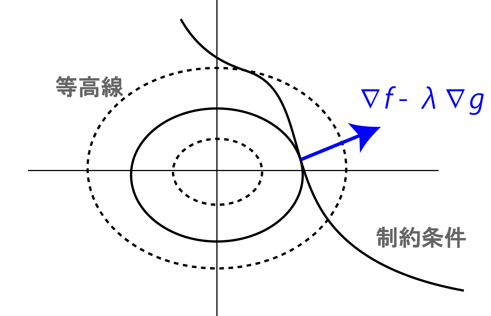
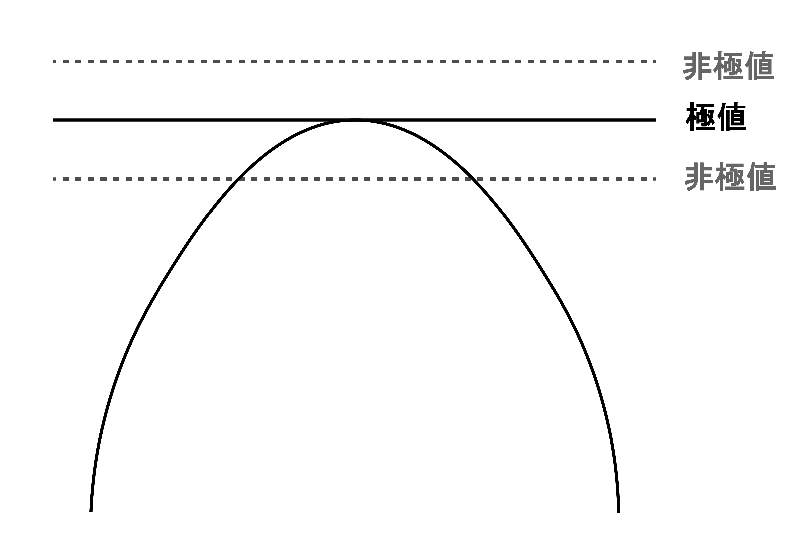
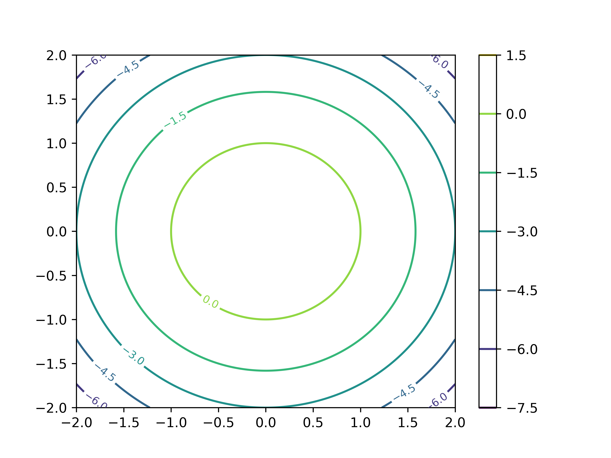
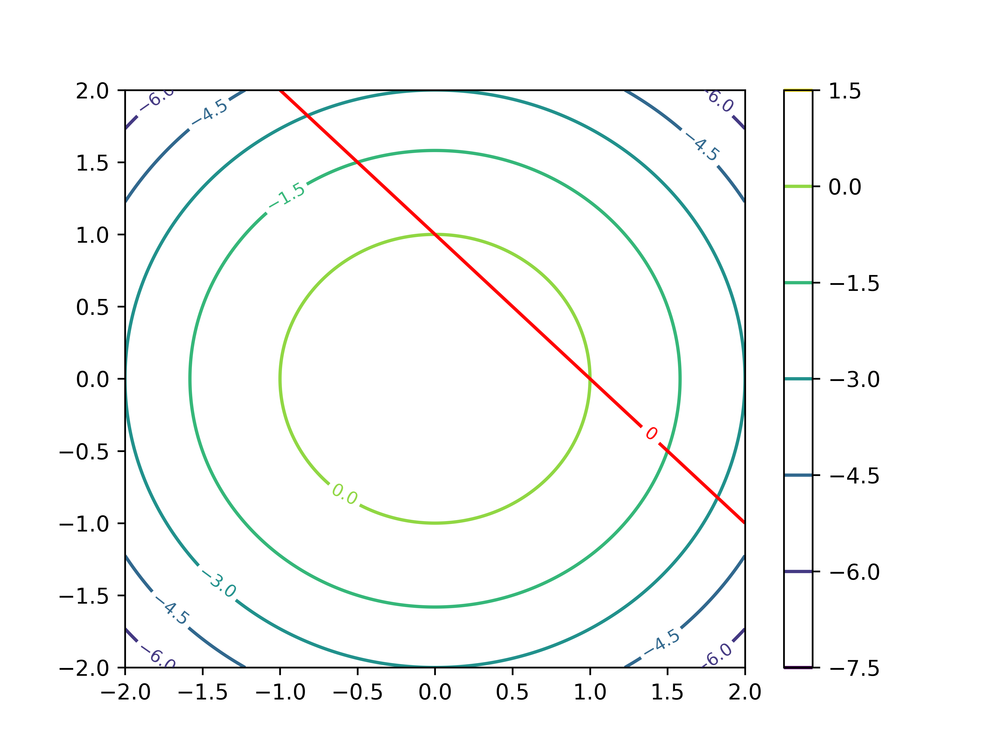
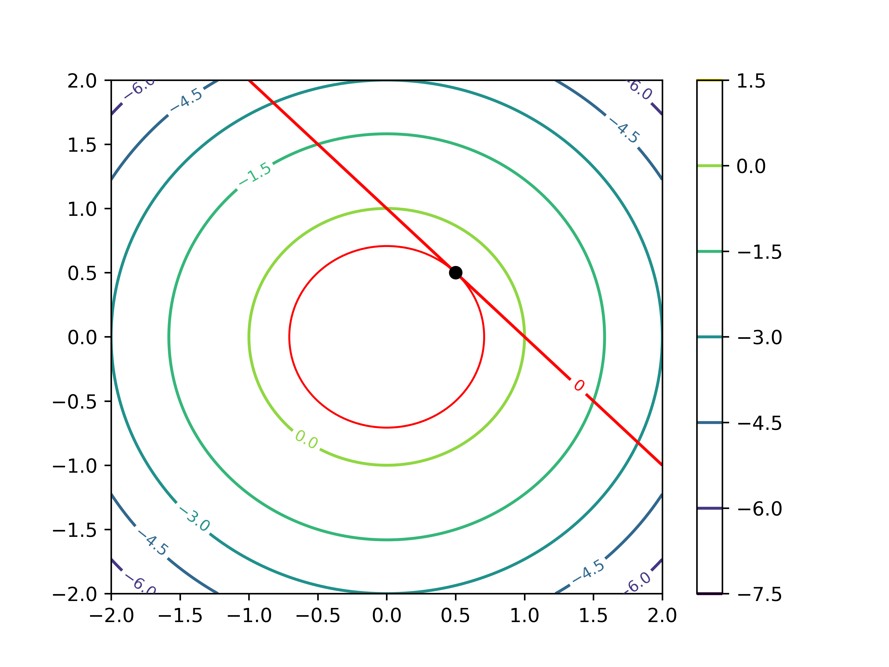

# ラグランジュの未定乗数法

ここでは，条件付きの極値問題を解くときに頻繁に用いられる数学的テクニックである，ラグランジュの未定乗数法を学習します．もう名前からして強そうですが，実際，あらゆる分野で重宝されています．行列分解，最適化，脳波解析は勿論，普通のアンケート調査なんかを相手に用いる多変量解析など，実はあらゆる場面でお世話になります．

初めて見た時は意味が分からなかったので飛ばしていましたが，ちゃんと勉強したら案外そんな事もなかったのでまとめます．これが出来るようになるだけで大分と学習が楽になるので頑張りましょう．

## 定義と用法
まず，式を載せてみます．本来は多次元に拡張可能なものですが，とりあえずここでは簡単のため2次元で載せます．

$\textbf{ラグランジュの未定乗数法}$
>  制約条件 $g(x,y) = 0$ の元で，$f(x,y)$ を最大化する $(x,y)$ を求める問題を考えるとき，**ラグランジュ乗数** $\lambda$ を用いて**ラグランジュ関数** $L$ を
>
>$$
L(x,y,\lambda) = f(x,y) - \lambda g(x,y) \tag{1}
>$$
>
>と置くと，ある $(x_0,y_0)$ が題意の条件を満たすなら，ある $\lambda_0$ が存在し，$(x_0, y_0, \lambda_0)$ において
>
>$$
\frac{\partial L}{\partial x} = \frac{\partial L}{\partial y} = \frac{\partial L}{\partial \lambda} = 0 \tag{2}
>$$
>
>が成り立つ．
{: .box}

といったようなものです．勿論，雑に定義しているので数学的に正しい議論をしようとするともっと仮定とか必要になりますが，今は置いておきます．

最初は何を言ってるか訳が分からない式だと思います．2変数関数の極値問題を考えていて，それが分からないから悩んでいる人に対して「じゃあ3変数にしようか！！」とか意味が分かりません．

さらにここで深くは触れないですけど，実際ラグランジュ使って解いたところで，これで出てきた解＝最大値(最小値)となるとは限らなくて，あくまで停留点，つまり**極値の候補しか分からない**という．

うーん．意味あるのかそれ...なんて考えてしまい，勉強をやめていました．しかしこれから確認するように，考え方はシンプルだし，とてもありがたいものです．

まず，用語ですがラグランジュの"未定"乗数法というからには，未定ななんらかの値を掛け算して解く方法？みたいに捉えられますね．この未定乗数が$\lambda$の事です．それから，何故未定かって正味$\lambda$の値そのものには興味がないというか，どうでもいいのです．$\lambda$を使って表せるという事実が大事．

## ラグランジュの未定乗数法の気持ち
さて，まずは式 (2) の各項について考えていきます．あえて３つ目，$\partial L/ \partial \lambda =0$から考えていきます．と言っても，計算すればすぐ分かりますので式をどうぞ．

$$
  \frac{\partial L}{\partial \lambda} = \frac{\partial(f(x,y) - \lambda g(x,y))}{\partial \lambda} \\
  \\[1ex]
  = -g(x,y) \\
  = 0
$$

普通に，関数$L$を$\lambda$で偏微分するとこうなりますね．ここで，$-g(x,y) = 0$になるのは制約条件として与えられている $g(x,y) =0$ によります．

では残りの二つについて，すなわち$\partial L/ \partial x = \partial L/ \partial y = 0$について考えます．同じくLを展開していくと

$$
  \frac{\partial L}{\partial x} = \frac{\partial f(x,y)}{\partial x} - \lambda\frac{\partial g(x,y)}{\partial x}=0 \\
  \\[1ex]
  \therefore \frac{\partial f(x,y)}{\partial x} = \lambda \frac{\partial g(x,y)}{\partial x} \\
  \\[1ex]
  \frac{\partial L}{\partial y} = \frac{\partial f(x,y)}{\partial y} - \lambda\frac{\partial g(x,y)}{\partial y}=0 \\
  \\[1ex]
  \therefore \frac{\partial f(x,y)}{\partial y} = \lambda \frac{\partial g(x,y)}{\partial y} 
$$

と，それぞれ表せます．ただの移項なのでここまでは大丈夫でしょう．そして，でてきたこの二つの式をベクトルの形に整理すると次のようになります．

$$
  \begin{pmatrix}
    \displaystyle \frac{\partial f(x,y)}{\partial x}\\
    \\
    \displaystyle \frac{\partial f(x,y)}{\partial y}
  \end{pmatrix}
  =\lambda
  \begin{pmatrix}
    \displaystyle \frac{\partial g(x,y)}{\partial x}\\
    \\
    \displaystyle \frac{\partial g(x,y)}{\partial y}
  \end{pmatrix} \tag{3}
$$

綺麗になりました．さて，ここで得られた形は，関数の勾配ベクトルそのものです．勾配ベクトルとは，多変数関数 $f(x_1,...,x_d)$ に対して，その偏微分を並べたベクトル一般に，多変数の関数をそれぞれの変数で偏微分して並べたものです．数学的な記法では($\nabla f$)と書きます．

これを使うと，更に式 (3) を以下のように綺麗に表せます．

$$
  \nabla f = \lambda \nabla g
$$

 $f$ の勾配は $g$ の勾配が $\lambda$ 倍されたものであるという事になります．勾配の定義を思い出してもらうと，その向きはその点で取った接線に垂直な線，法線ベクトルを指します．

よって，この式の意味するところは **$f$ と $g$ の法線ベクトルが平行である**という事になります．平行の定義ですね．

逆説的になりますが，同じ点で得られた法線ベクトルが平行という事は，この二つの関数が接線を共有している，つまり**接している**という事になります．

まとめると，式(2)

$$
\frac{\partial L}{\partial x} = \frac{\partial L}{\partial y} = \frac{\partial L}{\partial \lambda} = 0 
$$

は言い換えると，

$$
\nabla f = \lambda\nabla g \land g(x,y) =0
$$

となります．**$g(x,y) =0$ を満たす中で，$f$ と $g$ の勾配ベクトルが平行，すなわち両者が接している点が，極値の候補**だということですね．
ちなみに，接線が平行であれば法線ベクトルが同じ向きを向いているか，反対方向を向いているか，またその長さがそれぞれどうであるかには興味がありません．そこを調整するために導入されているのが未定乗数 $\lambda$ である，途いう風にも解釈できます．

視覚的に考えてみます．

まず，関数 $f(x,y)$が取り得る値を$x,y$平面上で等高線として表します．
下の図は，それを上から見た図だと思ってください．

次に，与えられた制約条件 $g(x,y) = 0$　の境界を描きます．すると図の曲線のようなものが得られます．制約条件ということは，求める解はこの曲線上のどこかになるわけで，それがちょうど等高線と接する点ということになります．

何故なら，接しておらず交差している場合，制約条件を満たす範囲に$f(x,y) > k, f(x,y) <k$の領域が存在してしまうためです．それならそっちにずれた方が値が大きく(小さく)なりますよね．制約条件にぎりっぎり引っかかる，かすめる時が極値になっているわけです．

図では，点線になっている等高線は境界曲線と接しておらず交差しているため，曲線上にもっと高い，あるいは低い点が存在するはずです．イメージは下の図．

ここら辺は普通に微分の考え方ですね．制約条件を満たしつつ，与えられた関数に従う点を求めるのだから，接点を求めるわけですね．

## 例題
$g(x,y) = x+y-1=0$の制約条件のもと，関数$f(x,y) = 1-x^2-y^2$の最大値を求めよ．

まずはラグランジュを使わず，普通に考えて目安をつけてみましょう．関数 $f$ の等高線を描いてみると，

このようになります．$(0,0)$ を中心として，同心円状に広がっています．ここに，制約条件である $g(x,y)$ を描くと

このような線が得られます．今回聞かれているのは，この光速条件を満たす関数 $f(x,y)$ 上の点であるため，両者が接する点が求めたい解であることが分かります．

さて，この点を求めるのが今回の課題です．制約条件の元の極値問題なので，ラグランジュの未定乗数法を使ってみます．まずラグランジュ関数 $L$ は以下のようになります．

$$
  L(x,y,\lambda) = f(x,y) - \lambda g(x,y) \\
  \qquad \qquad\qquad\qquad= 1-x^2-y^2 -\lambda(x+y-1)
$$

続いて，$x,y,\lambda$のそれぞれについて偏微分すると，

$$
  \frac{\partial L}{\partial x} = -2x-\lambda\\
  \\[1ex]
  \frac{\partial L}{\partial y} = -2y - \lambda\\
  \\[1ex]
  \frac{\partial L}{\partial \lambda} = -x - y +1
$$

が導けます．極値の候補は，これらがゼロになる点なので

$$
  -2x-\lambda = 0\\
  -2y - \lambda = 0\\
  -x - y +1 = 0
$$

の連立方程式を解くと，関数$f$の制約条件$g$の元での最大値は$(\frac{1}{2}, \frac{1}{2})$であり，対応するラグランジュ乗数は -1 である事が分かります．

## いつ使うのか
ここでは，あまり細部について解説はせずに，よく使われるメジャーな手法の中でラグランジュ未定乗数法がどのように使われるのかを確認してみます．

### [主成分分析](./PCA)

### [正準相関分析](./CCA)

$$
x =   \begin{pmatrix}
    \displaystyle x_1\\
    \vdots\\
    \displaystyle x_n
  \end{pmatrix} , 
y =   \begin{pmatrix}
    \displaystyle y_1\\
    \vdots\\
    \displaystyle y_m
  \end{pmatrix}
$$

の $n,m$ 変数データについて，

$$
u = a_1x_1 + a_2x_2 + ... + a_n x_n\\
v = b_1y_1 + b_2y_2 + ... + b_m y_m
$$
としたとき，

$cor(u,v)$ が最大になる $a,b$ を求める．

$$
cor(u,v) = \frac{cov(u,v)}{\sqrt{V[u]}\sqrt{V[v]}}
$$

より，$cor(u,v)$の最大化は，$\sqrt{V[u]} = \sqrt{V[v]} = 1$の時であり，これより

$$
f(a,b) = cov(u,v)\\
g_1(a,b) = V[u]-1 (=0)\\
g_2(a,b) = V[v] -1 (=0)\\
$$

という，制約付きの最適化問題に帰着される．この問題はラグランジュの未定乗数法によって解く．

### Support vector machine (SVM)
機械学習で最もよく使われる古典的な手法の一つであるSVMにも用いられます(というか，機械学習はだいたいが制約付きの最適化問題なので他の手法でも頻繁に使います．) 
## 一般のラグランジュの未定乗数法
最後に，解説は今回はとりあえず省きます (~~筆者がちゃんと勉強できていない~~)が，2次元ではなくより一般の次元，複数の制約条件におけるラグランジュの未定乗数法の形をまとめます．

##### 一般のラグランジュの未定乗数法
>$d$ 変数関数 $f$ の，制約条件 $g_1,...,g_m$ の元での極値を考えると，ラグランジュ関数は
>
>$$
>L(x_1, ...,x_d, \lambda_1,...,\lambda_m ) \\
>= f(x_1,...,x_d) - \sum_{i=1}^m \lambda_i g_i (x_1,...,x_d)
>$$
>
>と表され，題意を満たす点 $(x_1,...,x_d)$ は
>
>$$
>\sum_{i=1}^m \lambda_i \frac{\partial g_i}{\partial x_1} = ... = \sum_{i=1}^m \lambda_i \frac{\partial g_i}{\partial x_d} = 0
>$$
>
>あるいは
>$$
  \frac{\partial L}{\partial x_1} = ... =\frac{\partial L}{\partial x_d} =\frac{\partial L}{\partial \lambda_1} = ...=\frac{\partial L}{\partial \lambda_m} =0
>$$
>
>を満たす．
{: .box}

この時，特に一つ目の条件
$$
\sum_{i=1}^m \lambda_i \frac{\partial g_i}{\partial x_1} = ... = \sum_{i=1}^m \lambda_i \frac{\partial g_i}{\partial x_d} = 0
$$

は，言い換えると

$$
\text{rank}  \left(
\begin{array}{cccc}
\frac{\partial g_1}{\partial x_1} & \ldots & \frac{\partial g_1}{\partial x_d} \\
\vdots & \ddots & \vdots \\
\frac{\partial g_m}{\partial x_1} & \ldots & \frac{\partial g_m}{\partial x_d} 
\end{array}
\right) < m
$$

ということを意味します．ヤコビ行列のrankですね．
