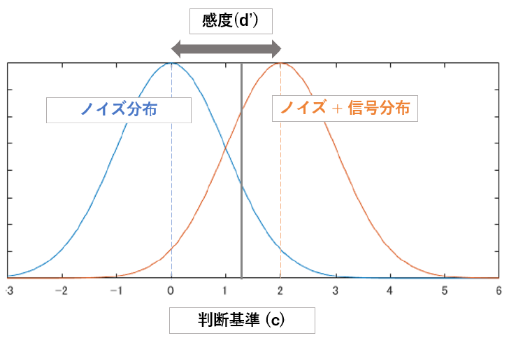
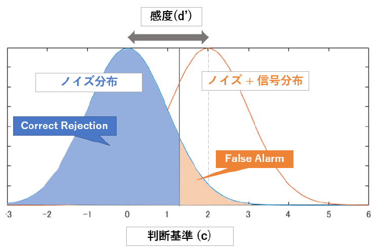

信号検出理論 (Signal Detection Theory) はその名の通り，ある特定の信号があったかどうかを検出する我々のプロセスをモデル化したもので，たとえばAとBという2種類の刺激を使用して，A だと思ったら Yes と回答するようなタスクを考えた際に適用できます．

この場合，被験者は A 刺激を検知したら Yes と，そうじゃないものであったらNoと回答します．この時，どれだけ正確に Yes/No を答えられるか(正答率)が被験者の成績として一般に評価されているわけですが，正答率だけではなくもう少し深く考えた指標を使おうという話です．

## モチベーション
　というのも，実際自分でやってみれば分かるのですが被験者の性格によっても正答率とかは変わってきます．

Yes と No が 25:75 でランダマイズされた実験で考えてみましょう．被験者が保守的な場合，微妙だなと思う刺激に対しては全て No と答えるため，全体的にYes と答える回数が減ります．その結果，Yes/No 比が 15:85 になったけど Yes と答えた刺激の中での正答率は 100% という人がいたり，あるいは逆にとりあえず Yes と答える傾向の人は 40:60 になっていて，刺激 Ａ を Yes と答える確率は 100% だけども誤判定 (B に対して Yes 判定) も高くなってしまっている人がいたり...単純に正答率だけでは比べるのが難しい，というかフェアじゃありません．

そこで使われるのが SDT の指標です．SDTは，2値の正解データ (Yes or No)と，2値の回答データ (yes or no) の組み合わせそれぞれの確率について対応表を作成するところから始まります．統計でおなじみの偽陽性とか偽陰性のあれと一緒です．

| |yes と判断|no と判断|
|----|----|----|
|実際は Yes|ヒット率 (Hit rate; HR)| ミス率 (Miss Rate; MR)|
|実際は No|誤警報率 (False Alerm Rate; FA)|正棄却率 (Correct Rejection Rate; CR) |

これら4つの指標 (HR,MR,FA,CR) を用いて議論するのが信号検出理論の基本です．

それぞれ，**ヒット率**は実際に信号があった際にちゃんと検知できた割合，**ミス率**は本当は信号があったのに検知できなかった割合，**誤警報率**は実際には信号はなかったのにあったと勘違いした割合，**正棄却率**は実際に信号がなくて，検知もしなかった場合を意味します．

ヒット率と正棄却率が 100% になるのが全問正解，最強の被験者ですね．

もちろん実際にはそんなことはなくて，被験者ごとに 4 つの値はめちゃくちゃです．保守的な人はどうしてもミス率が上がるし，積極的な人は誤警報率が上がります．戦略の違いなので，どっちの成績が優秀とか比べようがないですよね．なのでこの 4 指標をそのまま使うのでは不十分です．勿論ただの正答率で議論するよりは多少マシではあります．


これらの指標を元に，**信号のありなしがどういった判断によってなされたのかをモデル化していくのが信号検出理論**です．そんなに難しくないです．


## 信号検出理論
まず，このモデルが置いている仮定から確認します．

それは計測・観測ノイズの存在です．我々の感覚器や脳は常に正確に反応できるわけではないし，たとえば触覚刺激を検出する課題だとしても偶然吹いた風だとか服がこすれるだとか，実験で統制している刺激以外にも様々な要因によって信号を受け取っています．

これによって，全く同じ刺激を与えられたとしても反応は若干異なるわけで，これらをノイズとして考えると，基本的には与える信号とは無関係に常にノイズが与えられているため，信号があったとき (Yes)，なかった時 (No) どちらも反応は確率分布の形をとることになります．自然界のノイズは基本的にガウスノイズとして仮定できるため，正規分布を仮定します．感覚は常に正規分布しているというのは厳密に考えると気になるかもしれませんが，ここではそう置きます．そして多くの場合，これは近似として正しいことが確認されています．

では，被験者が信号を検出するときとしない時の差について考えていきます．まず信号がないとき，これはただノイズのみに依存する正規分布です．信号があるときには，同じように正規分布だが信号の強度に依存してその平均がずれた正規分布が生じます．ノイズ分布とノイズ+信号分布の分散についてはどうするのかですが，面倒なので等分散性を仮定しておきます．

信号検出の課題とはつまり，この枠組みで語るなら得られた刺激がどちらの分布によって生じているのかを判断する仕事になります．しかし問題は，被験者が保守的だったり積極的だったりすると，判断の基準が変わります．保守的な人はノイズ分布はもちろんノイズ＋信号分布の一部から大部分までも含めてノイズ分布から生じたと推定し，積極的な人は逆にノイズ分布の一部も含めて信号分布であると推定する事が考えられます．つまり，二つの分布の平均のほかにもう一つ，被験者個人の反応バイアス，Yes/No のどちらに分類しやすいかという変数も発生します．

<center></center>


二つの分布が分かり，被験者ごとの判断基準(例...合計値が 10 以上だったらYes) が分かってしまえば，先程の表にあったヒット率やミス率も計算できます．単に分布を二つ並べて，線を引いて，線の右左のどちら側かと，本来はどっちの分布に含まれているかで4パターンに分けられますからね．これがそれぞれ先程の4指標に対応しているわけです．


　図にすると以下のようになります．Hit, Miss, False Alarm, Correct Rejection のそれぞれがどちらの分布に属していて，どちらの分布として判定されたのかを確認してください．


<center></center>
<center></center>


では逆に考えると，4指標の値が分かれば二つの分布 (の距離) も判断基準も推定できる事になります．

分布間の距離を **感度 (d')**，判断基準を **反応バイアス (c)** として言います．

### 感度 d'
それぞれ算出法を考えます．感度は定義上は分布の距離なので

$$
\begin{align}
d' = \frac{\mu_{s+n}-\mu_n}{\sigma_n}
\end{align}
$$


となります．これはノイズ+信号分布とノイズ分布の平均の差をノイズ分布の標準偏差で割るということで，つまり分布間の距離がノイズ分布の標準偏差何個分に相当するのかの指標です．

多くの場合，ノイズ分布は標準偏差が 1 の正規分布を仮定するので，その場合は単純に平均の差を意味します．こうして算出される感度 (d') は，二つの分布に対する被験者の心的距離です．区別しやすいもの程距離は離れていて，つまり感度も高くなります．いわゆる"優秀"な成績は感度が高い状態ですね．

これは分布間の距離なので，被験者が積極的か保守的かなどの判断基準 (c) の影響を受けない弁別能力を反映している事が分かるかと思います．


感度は刺激が強く（極端に）なればなるほど高くなるし，学習によっても高くなる傾向があります．実際の場では，より正確には分布の平均位置を出すのは難しいので次のようなステップで感度を求めます．

まず，信号分布に対するヒット率 (ヒットとミスの割合) と，ノイズ分布に対する誤警報率 (CRとFAの割合) を算出します．これは以下の式で得られます．

$$
\begin{align}
  \text{HR} = p(yes|Yes)= \frac{\text{Hit}}{\text{Hit} + \text{Miss}}\\
  \text{FA} = p(yes|No) = \frac{\text{False alerm}}{\text{False alerm} + \text{Correct rejection}}
\end{align}
$$

これらは，それぞれ判断基準より上の信号分布，ノイズ分布の面積に相当します．ノイズ分布と信号分布は平均が違うだけで同形の分布だったので，標準正規分布において右側の面積を積分すると計算したヒット率や誤警報率になる点をそれぞれ求めてやれば，その数値の差はすなわち分布の平均の差と等しくなる事が分かるかと思います．

先ほどの図のオレンジの部分を比較してみてください．同じ灰色の線(判断基準)に対し，オレンジ部分はかなり異なりますね．この差がすなわち分布間の距離ということです．よって以下の計算をします．

$$
\begin{align}
  d' = Z(\text{ヒット率}) - Z(\text{誤警報率})
\end{align}
$$

ここで，$Z()$ は Z 得点です．z得点とは，標準正規分布の平均を基準にした標準偏差数です．その分布の平均からどれだけ離れているかですね．これを二つの分布それぞれについて算出し，その差を求める事で分布間の距離を測るわけです．Ｚを取らないといけない理由は，そもそも独立な異なる分布を比較する際には標準化する必要があったのでしたね．


```MATLAB
% MATLAB code
  dat_ph = hit / (hit + miss);
  dat_pf = fa  / (fa  + cr);
  d' = norminv(dat_ph) -norminv(dat_pf);
```

こうして得られた感度は，大きい値であるほどしっかりとノイズ分布と信号分布を区別できるという事になります．これを使って，Aの被験者とBの被験者のどちらが性格にYesと答えられているかといったような事が分かりますね．

### 反応バイアス c
反応バイアスは，被験者がそもそもYes/Noのどちらかに偏って答えやすいかどうかの指標です．「Yesをうまく検知できたら報酬をあげます」とか，「なるべく間違ってYesと答えないでください」といった指示が実験者から与えられていたり，本人の性格だったりによってどちらに答えやすいかは被験者ごとに異なります．感度はこのバイアスの影響を受けない指標だったわけですが，バイアス自体は以下のようにして求めれます．

$$
\begin{align}
  C = \frac{1}{2} (Z(\text{ヒット率} + \text{誤警報率}))
\end{align}
$$

これは，それぞれの分布の平均が判断基準からどれだけ離れているかの値(Z())の平均です．簡単ですね．この値が負だと被験者はYesと答えやすく，正だとNoと答えやすい，そして０だとバイアスがないという事になります．


### まとめ
信号検出理論は様々な知覚実験に利用できます．たとえば，ある特定の刺激パターン（音でも光でも顔画像でも）を学習し，それを検知したらYesと答えるといった課題はよく見られると思います．これを単純に正答率で評価してしまうと，被験者によって様々な反応バイアスがあるためにあまり正しくない評価になりかねません．そういう時に感度を計算すると便利ですね．そうする事で，たとえば疾患患者は感度が著しく低く，反応バイアスは健常者と変わらないとか，反応バイアスは変わらないが学習刺激に対してだけ感度が上がっていくだとか，そういった議論が可能になります．