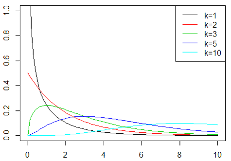

# 分散分析 (ANOVA)

このページでは，論文を読んでいてt検定に並ぶレベルでよく見るはずの，分散分析(Analysis of variance; ANOVA)検定についてまとめていきます．

## k標本問題

これまで，2標本の問題についての統計的検定を主に確認してきました．
たとえば２つの母集団平均$\mu_1, \mu_2$について比較する際には，母分散が既知なのか未知なのか，等分散性を仮定できるのかできないのかといった条件によって検定の方法が変わりました．

ここでは，母集団平均が3つ以上，即ち$\mu_1, \mu_2,...,\mu_a (a \geq 3)$の場合の比較について考えます．この時に用いるのがANOVAになります．

標本がkの時を特に，k標本問題と言いますが，この場合に考える用語について先に定義しておきます．

我々の研究において，実験結果なんらかの影響をおよぼすと考えて設定するものを **因子** と呼び，その因子に対して与え条件を **水準** と呼びます．各水準のデータ数は，必ずしも同じ回数でないといけないわけではありません．

たとえば，A,B,C,Dという4種類の薬を投与した際の病態への影響をテストする場合，薬の種類が因子，A,B,C,Dが水準となります．この場合，因子は薬の種類だけなので1因子実験であるとも表現します．

これに加えて，更になんらかのトレーニングも実施した場合の病態の変化を見るなんてことになると，2因子の実験になります．因子の数が増えると，それぞれの因子の影響だけでなく，それらの相互作用によってもたらされる影響についても考慮する必要があり，複雑化していきます．

まずは簡単のため，1因子の場合から考えていきます．

## なぜt検定ではだめなのか？
そもそもですが，2標本の時にはt検定を使っていたのに，3標本以上になるとなんでANOVAを使わないといけないのでしょうか．

3標本を直接比較する

$$
H_ 0 : \mu_1 = \mu_2 =... = \mu_k
$$
が出来ないからでしょうか．

たしかにそれは難しいでしょうが，別にk標本だったらこれらを分解して，

$$
H_{01} : \mu_1 = \mu_2\\
H_{02} : \mu_2 = \mu_3\\
H_{0k-1} : \mu_{k-1} = \mu_k
$$

と，$k-1$個の帰無仮説に分解してやれば勿論，$t$検定を適用することができます．何故そうしないのでしょう？

なぜ？

操作的には何も問題ありません．式のどこかに間違えがあるとか，そういうことではないです．現に，ここ数十年の心理学研究ではこの手の統計的操作を行っていた研究が多く存在しているのも事実です．

統計的仮説検定は，「この仮説(分布)の下で考えた時，実験で得られたデータが観測される確率は**%だから，これは仮説が正しい/間違っている」という考えに基づいて行われます．

実際，実験で得られたデータが5%とかの非常にレアな確率でしか観測されないものであったら，帰無仮説を棄却＝なにか意味のある差があったはずと考えたくなります．

しかし，5%の確率で観測されるレアな確率は，逆に言うと5%もの確率で観測されうるものです．これを回数繰り返していけば，ざっくり考えても20回に1回は「**本当にレアな5%を引いただけ＝意味のある差はない**」を引き当ててしまうことになります．

これでは，本当は効果のない薬を効果があったと言い張ったり，ありもしない脳活動の差異を検出したりといった事態につながってしまうことになります．なので一般的に，3以上の標本に対してバラバラにt検定を行うことはありません．

（多重比較補正という手段もありますが，ここでは置いておきます）

## 1元配置の分散分析
前項で確認したように，因子，すなわち独立変数の数が1つの場合に用いるのが1元配置の分散分析です．因子が2つなら2元配置の分散分析になります．

さて，ここで記号を導入しておきます．実験で取り上げる独立変数，因子は(A)とし，そのa個の水準は$A_1,...,A_a$，そして各水準のデータ数を$R_1,...,r_a$とします．
さらに$A_i$水準のj番目のデータは$y_{ij}$と表すことにします．

分散分析では，前提となるデータの構造として以下の形を想定します．

$$
y_{ij} = \mu_i + \varepsilon_{ij}, \qquad i=1,2,...,a ; j=1,2,...,r_{i}
 $$

これを一元配置モデルと言い，$\mu_i$は第$i$水準の水準平均であり，そこに加わる誤差項$\varepsilon_{ij}$は全て互いに独立な$N(0,\sigma^2)$に従う実験誤差を意味します．ここで大事なのは，**$\sigma^2$は水準に関わらず一定である** ということです．

２標本の検定の場合，等分散性を仮定していいか考えてだめだった場合はウェルチの検定を使うのでした．あるいは，等分散性を仮定していいのかを確認するためにF検定にかけるという作業が必要でした．

3つ以上の標本の場合についても，等分散性を仮定できるかはバートレットの検定というものにかけることで確認できますが，ひとまず置いておきます．

さて，そんな等分散な水準a個をもったデータ全体の総数を

$$
n = \Sigma r_i
$$

とすれば，データ総数全体での平均を

$$
\mu = \Sigma r_i \mu_i/n
$$

という，データ数で重みをつけた各水準の平均の加重平均によって定義することができ，これを**一般平均**と呼びます．

これを用いると，各水準の平均から一般平均を引いたものとして，正味の効果

$$
\alpha_i = \mu_i - \mu
$$

を定義できます．$\alpha_i$は水準$A_i$の**効果**と言います．

これを用いることで，最初に確認したデータ構造の想定

$$
y_{ij} = \mu_i + \varepsilon_{ij}
$$
を

$$
y_{ij} = \mu + \alpha_i + \varepsilon_{ij}
$$

と書き換えることができます．これは言い換えれば，

データ＝共通効果＋水準の効果＋誤差
という式の形になっています．分散分析では，簡単に言うと

データ＝共通効果＋水準効果＋誤差

データ＝共通効果＋誤差

のどちらで説明するべきなのかを考えることで，因子に意味があったのかどうかを検定していきます．

具体的には，

$$
H_0 : \mu_1=\mu_2=...=\mu_a \\
\therefore (H_0 : \alpha_1 = \alpha_2 = ...= \alpha_a = 0)
$$

を検定します．

分散分析とは，分散に関する検定であるといった誤解が初学者あるあるですが，帰無仮説を見れば分かるように平均についての検定です．では何故分散分析なのかというと，平均についての検定をするために分散を用いるからです．

先に確認したように，分散分析の考え方では水準の効果を考えるときと考えないときのどちらがデータを上手く説明できるかを考えます．

「上手く説明できるか」を定量化するためには，その場合に生じる誤差がどれだけになるかを見れば良いですね．しかし，誤差は正負のどちらの値もとり得るため，そのまま扱うにはやや面倒です．そこで誤差の符号を外すためにも，

$$
S = (y_{ij}-\bar{y})^2
$$

を考えます．$\bar{y}$は推定値と思ってください．データと推定値の差，つまり誤差の二乗を取っています．そして分散分析の場合，この推定値には平均値を用います．水準を考える場合には水準平均との差，考えない場合には一般平均との差を誤差とし，その二乗が$Ｓ$となります．

平均との誤差，偏差の二乗なので，つまり分散ですね．この値を用いて，平均値について検定する手法が「分散」分析です．

(正確には，Sは誤差の二乗なだけで，これデータ数Nで割らないと分散にはなりません．その点はあとで解決されます．)

### 帰無仮説の下での残差平方和
はじめに，帰無仮説の下，即ち水準間の平均に差がない場合のモデル
$$
y_{ij} = \mu + \varepsilon_{ij}
$$

をあてはめた時の$S$(残差平方和という)について考えると，
$$
\mu = \Sigma_i \Sigma_j y_{ij} / n
$$
とおけるので，
$$
S_T = \Sigma_i \Sigma_j (y_{ij} - \bar{y}_{\cdot\cdot})^2 = \Sigma_i \Sigma_j {y_{ij}}^2 - {y_{\cdot\cdot}}^2/n
$$

となる．ただし，ここで簡単のために

ドット記法

$$
y_{i\cdot} = \Sigma_j y_{ij}, \\
y_{\cdot\cdot} = \Sigma_i \Sigma_j y_{ij}, \\
\bar{y_i} = y_{i\cdot}/r_i,\\
\bar{y_{\cdot\cdot}} = y_{\cdot\cdot}/n
$$

を用いています．

### 対立仮説（一元配置モデル）の下での残差平方和
次に，対立仮説となる一元配置モデルにあてはめた場合の残差平方和は
$$
S_e = \Sigma_i \Sigma_j (y_{ij} - \bar{y_{i\cdot}})^2 = \Sigma_i \Sigma_j {y_{ij}}^2 - \Sigma_i {y_{i\cdot}}^2/r_i
$$

となります．

式については，ドット記法と照らし合わせてよく見ればすぐ分かるはずです．

さて，さらにここから，$S_e/\sigma^2, S_T/\sigma^2$という数について考えると，それぞれ平均との差なので平均は0であり，共通の分散で割られているので，$\chi^2$分布に従うことが分かります．

\chi^2$分布

互いに独立で標準正規分布$N(0,1)$に従う確率変数$Z_1,Z_2,...,Z_k$について，次の式から算出される自由度kの変数$\chi^2$が従う確率分布
$$
\chi^2 = Z_1^2 + Z_2 ^2 +...+Z_k^2
$$

それぞれの自由度は，$S_T$については

$$
S_T = \Sigma_i \Sigma_j (y_{ij} - \bar{y}_{\cdot\cdot})^2 = \Sigma_i \Sigma_j {y_{ij}}^2 - {y_{\cdot\cdot}}^2/n
$$
の式から，n-1個，

$S_e$については

$$
S_e = \Sigma_i \Sigma_j (y_{ij} - \bar{y_{i\cdot}})^2 = \Sigma_i \Sigma_j {y_{ij}}^2 - \Sigma_i {y_{i\cdot}}^2/r_i
$$

の式から，n-a個になっていることも分かります．

なぜ？

カッコの中を見てみましょう. $S_T$は

$(y_{ij}-\bar{y_{\cdot\cdot}})$

となっています．

総和を展開すると，前者によってn個の要素が出てきます．後者は全体平均なので1つの値です．総和について考えるとき，$n$個のデータの平均が与えられている場合，$n-1$個のデータが特定された時点で残りの1個の値も定まってしまうため，自由度は$-1$されるのでした．

同様に，$S_e$についても$n$個の総和と，$a$個の水準平均が与えられているので，自由度は$n-a$となるわけです．

&nbsp;

次に，$S_T,S_e$の差分を取ります．これは仮説$H_0$を設けたことによる残差平方和の増加分に相当します．

$$
S_A = S_T - S_e  \\
\qquad \qquad \qquad \qquad  \qquad \qquad \quad= \Sigma_i {y_{i\cdot}}^2/r_i - {y_{\cdot\cdot}}^2/n = \Sigma_i r_i (\bar{y_{i\cdot}} - \bar{y_{\cdot\cdot}})^2
$$

こいつも他同様に，$\sigma^2$で割れば自由度$\nu_A = a-1$の$\chi^2$分布に従うことがわかるかと思います．自由度が何故こうなるかについてはもう良いと思いますが，ここで少し別の導き方をしてみます．遊びです．

$$
S_A = S_T - S_e
$$

でしたが，自由度についても実は

$$
\nu_T - \nu_e = n-1 - (n-a) \\
= a-1 = \nu_A
$$

というふうに，
$$
\nu_A = \nu_T - \nu_e
$$
が成り立つことが分かります．

### 分散分析
分散分析の考え方は，因子を考慮した場合と考慮しない場合で，誤差に差がないのかを検定することであるため，水準内の変動(同じ因子内なので，残る変動は実験誤差によるもののはず)と，水準間の変動(これは各因子の平均からの誤差)が等しいかどうかを確かめれば分かります．

つまり
$$
S_e = \Sigma_i \Sigma_j {(y_{ij} - \bar{y_{i\cdot}})}^2 \qquad: \text{水準内変動}\\
S_A = \Sigma_i r_i {(\bar{y_{i\cdot}} - \bar{y_{\cdot\cdot}})}^2 \qquad: \text{水準間変動}
$$

が等しいのかどうか調べる問題に帰着します．これらは**それぞれ，$\sigma^2_A, \sigma^2_e$で割る**ことで，自由度$\nu_e = n-a, \nu_A = a-1$の$\chi^2$分布に従うのでした．

今，帰無仮説の下ではこれらの分散は等しい ($\sigma^2_A = \sigma^2_e = \sigma^2$) ことになっているので，帰無仮説の下でこの二つの$\chi^2$分布を比較してみると

$$
\frac{S_A/\sigma^2}{S_e/\sigma^2}
$$

となり，$\sigma^2$は打ち消しあい，結局$S$同士の比較になります．同様に，どちらもデータ数Nで割っているため，結局のところ$S$同士の比較は分散の比較になっているわけですね．

更にこの時，$\chi^2$分布同士はそれぞれ自由度で割ったものの比がF分布，つまり

$$
F = \frac{S_A/\nu_A}{S_e/\nu_e}
$$

の形で表される，$F(\nu_A, \nu_e)$に従うことを思い出します．あとは，実際のデータから計算したこれらの値がF分布の何％範囲にいるのかどうかを確認します．

これにより，もしF分布で考えた時にありえないような値だったとしたら，それはきっと「$\sigma^2_A = \sigma^2_e$」とおいた仮定が間違っていたことになるため，帰無仮説を棄却することができます．

これが帰無仮説の下で分散を比較する検定方法，分散分析です．

F値は，二つの分布が等分散である場合，つまり$H_0$の元では1に近い値を取り，逆に等分散でなく，水準ごとの平均に差がある場合には大きい値を取ります．

F値の計算の際，誤差Sの総和を扱っているため，データ数が大きくなることによって値も当然影響を受けることになってしまいますが，これについては自由度で割ることによって勿論解決されます．

F分布は自由度によって形を変えることを思い出してください．

こうして，

１．水準ごとの平均を設けて見た時に「水準内の分散」と「水準間での分散」が等しいのであれば水準ごとに平均を求める意味がない＝水準ごとの平均は等しい．
２．逆に水準内の分散と水準間の分散が異なるのであれば，水準ごとに平均を求める意味がある＝水準ごとの平均は異なる＝**因子はデータに影響する**

と，因子がデータに及ぼす影響について調べることが出来るのがANOVAでした．

### 2元配置以上の場合
2元配置以上，つまり因子が複数ある場合は，計算がまた少し面倒になります．それぞれの因子の効果について調べるのはもちろん，因子の組み合わせによって生じる効果についても考慮する必要があるためです．

が，基本的な計算というか考え方は共通なので，ひとまずここでは1元配置だけ確認しておきます．2元配置以上は，また別の機会にまとめます．多分．

## 効果の推定
### 水準間の平均比較
因子が影響をおよぼすところまでなら，研究者的にはだいたい当たり前というか，あまり面白くありません．たとえば，薬効の研究をしていて結論が「異なる薬を投与した際の健康には違いがある」はあまりにつまらないですよね．

実際のところ，求めたいのはその先である，**水準平均に関する推定**となります．つまり，どの水準の時に平均がどれくらいになるのか，です．

これによって，たとえば$A,B,C,D$のどの薬が一番効果的なのか，といった議論が出来るようになるわけです．

ということで，効果が有意であると分かった因子について，それぞれの水準の平均を比較する推定について考えていきます．

第$i$番目の水準の平均を

$$
\hat{\mu_i} = \bar{y_i}
$$

とするとき，2つの水準があれば，それらの平均を比較することができます．たとえば，水準aに比べて水準bの方が有意に平均が高いか，といった検定をするわけです．

こうした，平均を比較する問題はt検定で行います．t検定は

$$
-t_{\alpha/2} < \frac{\bar{x_1} - \mu}{\sqrt{\sigma^2/n}} < t_{\alpha/2}
$$

が成り立つかどうかを見るものでした．ここで$t_{\alpha/2}$は，t分布の，有意水準として用いる$\alpha$に対応する値です．この式は両側検定のものなので，上下に半分ずつ割り振っています．

基本的には，ANOVAの後にやる水準間の比較も同様の処理です．しかし，いくつか異なる点があるので確認していきます．

### 多重比較

t検定は，2つの群の平均の間に差があるかを検定する手法です．3つ以上の群になった場合，$_nC_2$の数だけ検定をすることになります．

ここで問題になるのが，検定の多重比較です．統計的検定は，得られたデータが仮定（帰無仮説）の下でどれだけあり得ないものかを下に，仮定が正しいかそうでないかを判断するようなものです．

そのため，有意水準5%で考えている場合でも，単純に考えれば20回に1回くらいは「偶然，外れ値を引いただけで本当は仮定が正しかった」という場合が生じます．いわゆる偽陽性です．

この問題があるため，検定を何度も行うのは好ましくありません．実際，最近は特に心理学分野ではこういった統計周りの問題が指摘されやすいです．

では，ANOVAのように複数の群がいる場合に，平均を比較したいときはどうすれば良いのか．それが多重比較補正です．多重比較補正にはいくつかの方法がありますが，どれも共通している点としては，t検定のように2群同士の比較を繰り返した場合，高まってしまう偽陽性の確率を，そのくり返し回数に応じて補正してくれるという点です．

多重比較補正の具体的な方法は他のページに譲るとして，ここでは多重比較補正をあまり意識せず，本質となる作業についてまとめていきます．

### ANOVA版の平均比較
2群の平均を比較するt検定は，

$$
-t_{\alpha/2} < \frac{(\bar{y_A} - \mu) - (\bar{y_B} - \mu)}{\sqrt{\frac{\sigma^2_A}{n_A} + \frac{\sigma^2_B}{n_B}}} < t_{\alpha/2}
$$

のように書けます．帰無仮説では母平均は等しいということになっているので，分子は単純にそれぞれの群の平均である$\bar{y}$同士を比較する形となっています．
分母の標準偏差は，比較する水準ＡとＢそれぞれの分散を足し合わせた上で√をとる形で算出しています．ここらへんの操作については，気になる人は統計の基礎のページで確認してください．

ここでは，特にANOVAの問題設定の場合に若干変わる記法というか，表現について解説します．

まず，ANOVAの場合，$E(\bar{y_i}) = \mu_i, V(\bar{y_i}) = \sigma^2/r_i$です．

さらにここで，ANOVAでは**各水準の分散は等しいという仮定**をおいていたことも使います．これにより

$$
-t_{\alpha/2} < \frac{\mu_A - \mu_B}{\sqrt{({\frac{1}{r_A}} + \frac{1}{r_B})V_e}} < t_{\alpha/2}
$$

と，書き換えることができ，つまり水準平均の差($\mu_A - \mu_B$)の点推定値に対する信頼係数1-$\alpha$の信頼限界は

$$
\mu_A - \mu_B \pm t_{\alpha/2}(\nu_e)\sqrt{(\frac{1}{r_A} + \frac{1}{r_B})V_e}
$$

となります．$\nu_e$はt分布の自由度です．あとは，それぞれの水準のデータを元にこれを計算することで，水準AとB，BとCなどの間に差があるかを検定する事が可能になります．

### バートレットの検定
分散分析では，水準それぞれでの分散が等しいという等分散性の仮定を置いていました．しかし，実際のデータではこの仮定を置いていいのかは自明ではないため，一応確認しておきたいこともあります．

そんな時に使うのが，バートレットの検定です．

今度まとめます．

### まとめ
分散分析の基本については以上になります．まとめると，まずはそれぞれの因子ごとに平均を計算する場合と，全体での平均を計算した場合とで，因子を考慮する方がデータを上手く説明できるのかを考えるのが分散分析です．

その後，どうやら有意らしいと分かった因子については，さらにそれを構成する各水準間で平均に差があったかを検定します．この時注意が必要なのは，検定の回数が2回以上になってしまうために多重比較の補正をしなければいけないということです．

補正方法は色々あって，データによって最適な方法が変わったりするのですが，それについてはまた別の機会にまとめてみます．

一般的には，**Tukey**や**Bonferroni**が有名ですね．