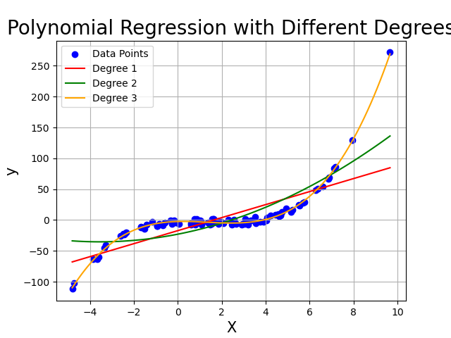

# 線形回帰

線形回帰は，ある目的データを別のいくつかの観測データの線形和として表すことで，両者の関係性を説明し，新たに得られた観測データを元に未知の目的データを推定する用途で用いるモデルです．


## 線形単回帰モデル

線形単回帰モデルとは，2つのデータ変数 ($x$, $y$) について，散布図をプロットし，両者の間の線形な関係 (直線) を求めるモデルです．

[統計の基礎](../Basic/statistics.html)で既にふれているように，その基本は中学校あたりで学習済みです．

<details markdown="1">
<summary>Pythonコード</summary>

```python
# ランダムな線形データの生成
X, y, coef = make_regression(n_samples=100, n_features=1, noise=10, coef=True, random_state=42)

# 線形単回帰モデルの作成とトレーニング
model = LinearRegression()
model.fit(X, y)

# モデルによる予測
y_pred = model.predict(X)

# 図のプロット
plt.figure(figsize=(8, 6))
plt.scatter(X, y, color='blue', label='Data')
plt.plot(X, y_pred, color='red', label='Regression Line')
plt.title('Linear Regression', fontsize=20)
plt.xlabel('Feature', fontsize=15)
plt.ylabel('Target', fontsize=15)
plt.legend()
plt.grid(True)
plt.savefig('../figures/linear.png')
```
</details>

<center></center>

この図では，てきとうに作成したデータ点に対して単回帰を行い，得られた線 (回帰線) を赤で引いてあります．良い感じですね．たしかにそれっぽいところに線が引かれています．

概要はこの程度で十分なので，実際にモデルの中身を見ていきます．

まず，単回帰の場合は**説明変数** $x$, **目的変数** $y$ について

$$
\begin{align}
y = \beta_0 + \beta_1 x
\end{align}
$$

というシンプルな関係性を仮定します．ここで $\beta_{0,1}$ は求める直線の切片，傾きに相当する変数です．特に $\beta_1$ を**回帰係数**といいます．発想は初等数学でやる $y=ax+b$ の関係式と同じです．回帰の目的は，データを最も上手く説明できるような $(\beta_0, \beta_1)$ の組を探すことにあります．

ただ，実際には測定の誤差や，今回考えていない他の要因 ($x_{2,3,...}$) の影響もあって式(1)が綺麗に成り立つことは考えにくいです．毎回多少ずれ $\epsilon$ が生じると考えます．

従って**線形単回帰モデル**はデータの組 (標本) の総数を $n$とした時，

$$
\begin{align}
y_i = \beta_0 + \beta_1 x_i + \epsilon_i
\end{align}
$$

という形になります．ここで, $i = 1,...,n \quad \text{i.i.d.}$ です．

言葉にすると，**得られた $i$ 番目のデータの目的変数 $y_i$ は，だいたい説明変数 $x_i$ の $\beta_1$ 倍に定数 $\beta_0$ を足した値から誤差 $\epsilon_i$ だけずれた位置にいる**，というモデルです．


## 単回帰係数の推定
では次に，得られた線形単回帰モデルの $\beta_{0,1}$ を推定するアルゴリズムについて触れていきます．メジャーどこは大きく2種類あり，最小二乗法と最尤法があります．

### 最小二乗法
最小二乗法では，

**「データに良く当てはまるモデルは，誤差 $\epsilon_i$が全ての $i$ について小さいモデルである」**

と考えます．尤もらしいですね．ちなみに，$\epsilon_i$ については以下の仮定を設けることが多いです．

$$
\begin{align}
\epsilon_1,...,\epsilon_n \quad \text{i.i.d.}\\
E(\epsilon_i)=0\\
V(\epsilon_i)=\sigma^2
\end{align}
$$

誤差はデータごとに独立で，平均0，分散 $\sigma^2$ の同一分布に従うということです．$\sigma^2$ は未知のパラメータなので，必要に応じて推定する必要はあります．

これにより，同時に

$$
\begin{align}
y_1,...,y_n \quad \text{i.i.d.}\\
E(y_i)=\beta_0 + \beta_1 x_i\\
V(y_i)=\sigma^2
\end{align}
$$

となります．

では本題です．

最小二乗法とは，**予測値 $\hat{y_i}$ と実測値 $y_i$ の差の全データでの二乗和を最小化するパラメータを探索する方法**を意味し，今回のモデルについて考えると

$$
\argmin_{\beta_0,\beta_1} S = \sum_{i=1}^n \epsilon_i^2 = \sum_{i=1}^n \{ y_i - (\beta_0 + \beta_1 x_i) \}^2
$$

という問題になります．


$\argmin_{\beta_0,\beta_1} S$は，関数 $S$ が最小値を取るような変数 $\beta_0, \beta_1$ の集合という意味で，つまりここでは二乗和 ($S$) を最小化するような $\beta_0, \beta_1$ の組み合わせを探すという意味です．ここでの関数 $S$ は，実際の $y_i$ の値と，$x_i$ の一次関数で表してみた予測値 $\hat{y_i}$ との誤差を全てのデータ $i$ について足し合わせたものの二乗和です．二乗しているのは符号の影響を打ち消すためです．ずれはプラスにもマイナスにもありますからね．

$\argmin_{\beta_0,\beta_1} S$ はただの問題設定であって，即座に計算できるものではありません．よってこの問題の解法を考えます．

変数それぞれについて，関数 $S$ の最小値を取るわけですから，変数 ($\beta_0, \beta_1$) で偏微分しましょう．すると

$$
\begin{align}
\frac{\partial S(\beta_0, \beta_1)}{\partial \beta_0} = -2 \sum_{i=1}^n (y_i - \beta_1 x_i -\beta_0)\\
\frac{\partial S(\beta_0, \beta_1)}{\partial \beta_1} = -2\sum_{i=1}^n x_i(y_i -\beta_1 x_i- \beta_0)
\end{align}  
$$

となります．で，こいつらの最小値を求めるわけなのでそれぞれを $=0$ として約分したり移項したりして整理すると

$$
\begin{align}
\beta_1 \sum_{i=1}^n x_i + \beta_0 n = \sum_{i=1}^n y_i \\
\beta_1 \sum_{i=1}^n x_i^2 + \beta_0 \sum_{i=1}^n x_i = \sum_{i=1}^n x_i y_i
\end{align}
$$

が求められます．

1 つ目の式を $n$ で割ると，

$$
  \frac{\beta_1\sum_{i=1}^n x_i}{n} + \beta_0 = \frac{\sum_{i=1}^n y_i}{n}\\
  \beta_1 \bar{x} + \beta_0 = \bar{y}\\
  \therefore \hat{\beta_0} = \bar{y} - \hat{\beta_{1}} \bar{x}
$$

となります．$\bar{x}$は $x$ の平均でしたね．さて，さらにこいつを先程の 2 つ目の式に代入して同様に $n$ で割ると

<details markdown="1">
<summary>途中式</summary>

$$
  \beta_1\sum_{i=1}^n x_i^2 + (-\beta_1\bar{x} + \bar{y})\sum_{i=1}^n x_i = \sum_{i=1}^n x_i y_i \nonumber\\
  \beta_1(\frac{\sum_{i=1}^n x_i^2}{n} - \bar{x}\frac{\sum_{i=1}^n x_i}{n}) = \frac{\sum_{i=1}^n x_i y_i}{n} - \bar{y}\frac{\sum_{i=1}^n x_i}{n}\\
  a(\bar{x^2} - \bar{x}^2) = \bar{xy} - \bar{y}\bar{x}\\
$$

</details>

$$
\begin{align}
  \therefore \hat{\beta_1} = \frac{\bar{xy} - \bar{y}\bar{x}}{\bar{x^2} - \bar{x}^2}
\end{align} 
$$

と，$\beta_1$ について解く事ができます．$\beta_0$ についてもこの式より解くと，最終的に

$$
\begin{align}
  \hat{\beta_1} = \frac{\bar{xy} - \bar{y}\bar{x}}{\bar{x^2} - \bar{x}^2} = \frac{S_{xy}}{S_{xx}}\\
  \hat{\beta_0} = -\hat{\beta_1}\bar{x} + \bar{y}
\end{align}
$$

と，$\beta_0, \beta_1$ の値を求める事が出来ます．あとはこのパラメータに従った直線を引けば先程の図のような事が出来るわけですね．

### 最尤法
次は最尤法での求め方です．最尤法では，誤差 $\epsilon_i$ が互いに独立に正規分布 $N(0,\sigma^2)$ に従うことを要請します．

すると，$y_i$ も相互独立に正規分布 $N(\beta_0 + \beta_1 x_i, \sigma ^2)$ に従うことがわかるので， $y_i$ の確率密度関数は

$$
\begin{align}
f(y_i; \beta_0, \beta_1, \sigma^2) = \frac{1}{\sqrt{2\pi\sigma^2}}\exp{[- \frac{\{y_i - (\beta_0 + \beta_1 x_i)\}^2}{2\sigma^2}]}
\end{align}
$$

になります．以降，面倒なので $f(y_i; \beta_0, \beta_1, \sigma^2)$ は単に $f(y_i)$ とします．最尤法とは，与えられた確率密度関数の元で，与えられたデータが得られる確率 (もっともらしさ; **尤度**) の対数 (**対数尤度関数**) が最大になる変数 (この場合は$\beta_0, \beta_1$)を求める方法です．

今，$y_i$ は互いに独立だったのでその尤度は

$$
\begin{align}
L(\beta_0, \beta_1, \sigma^2) = \prod_{i=1}^n f(y_i)
\end{align}
$$

なので，対数尤度関数は

$$
\begin{align}
\log(L(\beta_0, \beta_1, \sigma^2)) = \sum_{i=1}^n \log f(y_i)\\
= -\frac{1}{2\sigma^2}\sum_{i=1}^n \{y_i-(\beta_0 + \beta_1x_i) \}^2-\frac{n}{2}\log(2\pi\sigma^2)
\end{align}
$$

となります．あとは最小二乗法の時同様に偏微分をしていきます．すると

<details markdown="1">
<summary>解法</summary>

まず対数尤度関数のうち $\beta_0, \beta_1$ に依存する項は第一項のみなので，$\beta_0, \beta_1$ については

$$
\begin{align}
\frac{\partial \text{log}L}{\partial \beta_0} =\frac{1}{\sigma^2}\sum_{i=1}^n (y_i- \beta_0 - \beta_1 x_i)=0
\end{align}
$$

$$
\begin{align}
\frac{\partial \text{log}L}{\partial \beta_1} =\frac{1}{\sigma^2}\sum_{i=1}^n x_i (y_i - \beta_0 - \beta_1 x_i)=0
\end{align}
$$

となり，最小二乗法の場合と同じ式になることが分かります．

次に $\sigma^2$ についてですが，これは最小二乗法の時には求めていないパラメータでした．対数尤度関数を偏微分をしてみます．

分かりやすくするため，一度対数尤度関数の第二項ばらします．すると

$$
\begin{align}
-\frac{1}{2\sigma^2}\sum_{i=1}^n \{y_i-(\beta_0 + \beta_1x_i) \}^2-\frac{n}{2}\log(2\pi\sigma^2) \\
= -\frac{1}{2\sigma^2}\sum_{i=1}^n \{y_i-(\beta_0 + \beta_1x_i) \}^2-\frac{n}{2}\log(2\pi) - \frac{n}{2}\log(\sigma^2)
\end{align}
$$

となります．第一項は分母に $\sigma^2$ がいるので微分すると $\frac{1}{2\sigma^4}...$となり，第二項は$\sigma^2$ が含まれないので0，第三項は$\log$ の中に $\sigma^2$ がいるので微分すると $-\frac{n}{2\sigma^2}$になります．

よって整理すると，

$$
\begin{align}
\frac{\partial \text{log}L}{\partial \sigma^2}= \frac{1}{2\sigma^4}\sum_{i=1}^n \{y_i - \beta_0 - x_i\beta_1\}^2 -\frac{n}{2\sigma^2}=0
\end{align}
$$

がでてきます．最後にこれを解くと...

</details>

$$
\begin{align}
  \hat{\beta_1} = \frac{\bar{xy} - \bar{y}\bar{x}}{\bar{x^2} - \bar{x}^2} = \frac{S_{xy}}{S_{xx}}, \quad \hat{\beta_0} = -\beta_1\bar{x} + \bar{y}\\
\hat{\sigma^2} = \frac{1}{n}\sum_{i=1}^n (y_i - \hat{\beta_0}-\hat{\beta_1}x_i)^2
\end{align}
$$

が得られます．結局，回帰係数の推定値は最小二乗法の場合と一致します．

## 線形重回帰モデル
回帰の基本が分かったところで，モデルを多変数に拡張します．目的変数 $y_i,...,y_n$ について，説明変数が $x_{i1},...,x_{np}$ まで，$p$ 個の変数を使って説明されるようなモデルを考えると，

$$
\begin{align}
y_i &= \beta_0 + \beta_1x_{i1} + ... + \beta_{p} x_{ip} + \epsilon_i \nonumber \\
&= \bm{\beta^\top x_i} +  \epsilon_i
\end{align}
$$

とベクトル表記で表せます．

さらに，$y_i, \bm{x_i}, \epsilon_i$ もまだ要素を持っています．それぞれスカラー，ベクトル，スカラーの形ですね．このままで計算するのも面倒 (連立方程式なので) なので，行列の表記を導入します．

$$
\begin{align}
\bm{y} = 
\begin{pmatrix}
    y_1 \\
    \vdots \\
    y_n\\
\end{pmatrix},
X= 
\begin{pmatrix}
    1      & x_{11} & \cdots & x_{1p}\\
    \vdots & \vdots & \ddots & \vdots\\
    1      & x_{n1} & \cdots & x_{np}\\
\end{pmatrix}, \nonumber \\
\bm{\beta} = 
\begin{pmatrix}
    \beta_0 \\
    \vdots \\
    \beta_p\\
\end{pmatrix}, 
\bm{\epsilon} = 
\begin{pmatrix}
    \epsilon_1 \\
    \vdots \\
    \epsilon_n\\
\end{pmatrix}\nonumber
\end{align} 
$$

すると先ほどの式は単に

$$
\begin{align}
\bm{y} = X\bm{\beta} + \bm{\epsilon}
\end{align}
$$

となります．やはり行列は偉大．これが**線形重回帰モデル**です．というかこれのことを線形回帰といったりします．何事も一般化できた方が嬉しいですもんね．この場合，$\bm{\beta} = \beta_0,...\beta_p$ の各要素は**偏回帰係数**， $X$ は**計画行列**と呼ばれます．

### 最小二乗法
ではまず最小二乗法で解いていきます．行列表記での重回帰モデルの誤差二乗和は

$$
\begin{align}
S(\bm{\beta}) = \|\epsilon\|^2 = \|\bm{y} - X\bm{\beta}\|^2
\end{align}
$$


です．ここで $\|\cdot\|$ は **L2ノルム** ($\|\bm{x} = x_1,...,x_n\| = \sqrt{\sum_{i=1}^n x_i}$)です．あとは，この誤差二乗和が最小になる $\bm{\beta}$ を求めるわけですから，偏微分して0とおき，

$$
\begin{align}
\frac{\partial S(\bm{\beta})}{\partial \bm{\beta}} = \frac{\partial}{\partial \bm{\beta}}\|\bm{y} - X\bm{\beta}\|^2=0
\end{align}
$$

という方程式を解くと...


<details markdown="1">
<summary>解法</summary>

まず，ノルムを展開します．

$$
\begin{align}
S(\bm{\beta}) &= \|\epsilon\|^2 = \|\bm{y} - X\bm{\beta}\|^2 \nonumber\\
&= (\bm{y} - X\bm{\beta})^\top(\bm{y} - X\bm{\beta})
\end{align}
$$

整理すると


$$
\begin{align}
\frac{\partial S(\bm{\beta})}{\partial \bm{\beta}} &= \frac{\partial}{\partial \bm{\beta}}(\bm{y} - X\bm{\beta})^\top(\bm{y} - X\bm{\beta}) \nonumber \\
&= \frac{\partial}{\partial \bm{\beta}} [\bm{y^\top y} - 2\bm{y^\top}X\bm{\beta} + \bm{\beta^\top X^\top X \beta}]
\end{align}
$$

ここで $\bm{y^\top y}$ は $\bm{\beta}$ に依存しないため無視して，残りの2項を$\bm{\beta}$ で偏微分します．[行列の微分](../Basic/linear_algebra.html#行列の微積分)のルールに従うと

$$
\begin{align}
\frac{\partial S(\bm{\beta})}{\partial \bm{\beta}} &=
\frac{\partial}{\partial \bm{\beta}} (- 2\bm{y^\top}X\bm{\beta} + \bm{\beta^\top X^\top X \beta}) \nonumber \\
&= -2X^\top\bm{y} + 2X^\top X \bm{\beta}
\end{align}
$$

となります．最小化なので

$$
\begin{align}
-2X^\top\bm{y} + 2X^\top X \bm{\beta}=0\\
\therefore X^\top X \bm{\beta}=X^\top \bm{y} 
\end{align}
$$

となります．あとはこの式を $\bm{\beta}$ について解くと

<div class="box">
<div class="title">進んだ注</div>

ここでは $X^\top X$が正則であることを要請している．計画行列はモデルに使用する説明変数に由来するため，説明変数の選択の際にはこの点を考慮しなければならない．具体的には，計画行列はフルランクであることが求められるため，説明変数間に**多重共線性**が生じてはならない．また同様の理由で，$n < p+1$ となってはならない．分析前に気を付けるべき点である．しかし実務上は，多重共線性が生じることはあまり考えにくいため後者を特に気にするべきかもしれない．これは言い換えると，説明変数は無暗矢鱈に増やせばよいというものではないことを意味し，**オッカムの剃刀**の考え方にも通ずる．
</div>

</details>

$$
\begin{align}
\hat{\bm{\beta}} = (X^\top X)^{-1} X^{\top}\bm{y}
\end{align}
$$

と，最小二乗推定量が求まります．


### 最尤法
次は最尤法での解法です．単回帰の場合と同様に，$\bm{\epsilon} \sim N(0, \sigma^2)$ と仮定すると，$y_i \sim N(\bm{\beta^\top x_i}, \sigma^2)$ となります．従って $y_i$ の確率密度関数は

$$
\begin{align}
f(y_i) = \frac{1}{\sqrt{2\pi\sigma^2}}\exp [-\frac{(y_i - \bm{\beta^\top x_i})^2}{2\sigma^2}]
\end{align}
$$

です．対数尤度関数は

$$
\begin{align}
    \log L(\bm{\beta}, \sigma^2) &= \sum_{i=1}^n \log f(y_i) \nonumber \\
    &= -\frac{1}{2\sigma^2}\sum_{i=1}^n (y_i- \bm{\beta^\top x_i})^2-\frac{n}{2}\log(2\pi\sigma^2) \nonumber \\
    &= -\frac{1}{2\sigma^2}\sum_{i=1}^n \|\bm{y}- X\bm{\beta}\|^2-\frac{n}{2}\log(2\pi\sigma^2)
\end{align}
$$

となります．この対数尤度関数を$\bm{\beta}$ で偏微分し，0となる尤度方程式を解くと

<details markdown="1">
<summary>解法</summary>

基本的にこれまでと同様です．まず尤度方程式の第二項は $\bm{\beta}$ に依存しないので無視して，さらにノルムを展開していきます．

$$
\begin{align}
\frac{\partial \log L(\bm{\beta}, \sigma^2)}{\partial \bm{\beta}} &= -\frac{1}{2\sigma^2}\frac{\partial}{\partial \bm{\beta}} \|\bm{y} - X\bm{\beta}\|^2 \nonumber \\
&=-\frac{1}{2\sigma^2}\frac{\partial}{\partial \bm{\beta}} (\bm{y} - X\bm{\beta})^\top(\bm{y} - X\bm{\beta}) \nonumber \\
&= -\frac{1}{2\sigma^2}\frac{\partial}{\partial \bm{\beta}}  (\bm{y^\top y} - 2\bm{y^\top}X\bm{\beta} + \bm{\beta^\top X^\top X \beta})
\end{align}
$$


ここでやはり $\bm{y^\top y}$ は $\bm{\beta}$ に依存しないため無視して，残りの2項を$\bm{\beta}$ で偏微分します．

$$
\begin{align}
\frac{\partial \log L(\bm{\beta}, \sigma^2)}{\partial \bm{\beta}} &=
-\frac{1}{2\sigma^2} \frac{\partial}{\partial \bm{\beta}} (- 2\bm{y^\top}X\bm{\beta} + \bm{\beta^\top X^\top X \beta}) \nonumber \\
&= -\frac{1}{2\sigma^2}(-2X^\top\bm{y} + 2X^\top X \bm{\beta}) \nonumber \\
&= \frac{1}{\sigma^2}X^\top (\bm{y} - X\bm{\beta})
\end{align}
$$

となります．最小化なので

$$
\begin{align}
\frac{1}{\sigma^2}X^\top (\bm{y} - X\bm{\beta})=0\\
\therefore X^\top X \bm{\beta}=X^\top \bm{y} 
\end{align}
$$

となります．あとはこの式を $\bm{\beta}$ について解くと


$$
\begin{align}
\hat{\bm{\beta}} = (X^\top X)^{-1} X^{\top}\bm{y}
\end{align}
$$

が求まります．次に， $\sigma^2$についてです．
今回は対数尤度関数

$$
\begin{align}
    \log L(\bm{\beta}, \sigma^2) &= \sum_{i=1}^n \log f(y_i) \nonumber \\
    &= -\frac{1}{2\sigma^2}\sum_{i=1}^n \|\bm{y}- X\bm{\beta}\|^2-\frac{n}{2}\log(2\pi\sigma^2)
\end{align}
$$

の第一，第二どちらの項も$\sigma^2$を含んでいます．大人しく微分してみます．すると

$$
\begin{align}
    \frac{\partial \log L(\bm{\beta}, \sigma^2)}{\partial \bm{\beta}} = \frac{1}{2\sigma^4}\sum_{i=1}^n \|\bm{y}- X\bm{\beta}\|^2-\frac{n}{2\sigma^2}
\end{align}
$$

となります．これを0として解くと

$$
\begin{align}
    \hat{\sigma^2} = \frac{1}{n}\| \bm{y} - X \hat{\bm{\beta}}\|^2
\end{align}
$$

となります．よってまとめると，

</details>

$$
\begin{align}
    \hat{\bm{\beta}} = (X^\top X)^{-1} X^{\top}\bm{y}, \quad
    \hat{\sigma^2} = \frac{1}{n}\| \bm{y} - X \hat{\bm{\beta}}\|^2
\end{align}
$$


と，$\bm{\beta}$と $\sigma^2$ が求まります．やはり単回帰の場合と同様に，最小二乗法と解が一致しています．


## 多項式回帰
多項式回帰は，目的変数 $y_i$ を説明変数 $x_i$ の $n$次多項式でモデル化します．このため，非線形なモデルではありつつ，推定の方法としては線形 (推定する対象が未知の母数の1次式だから) のため，重回帰の一種とも言えます．

これまで見てきた線形回帰は，どれもデータの分布が線形なことを前提としていました．多項式回帰を含む非線形のモデルでは，より曲線的なデータ分布に対しても上手くあてはまるモデルを考えることが出来ます．

まずは例を見てみます．

<details markdown="1">
<summary>pythonコード</summary>

```python
# 適当なデータを生成
np.random.seed(0)
X = 2 - 3 * np.random.normal(0, 1, 100)
y = X - 2 * (X ** 2) + 0.5 * (X ** 3) + np.random.normal(-3, 3, 100)
X = X[:, np.newaxis]

# プロットの準備
plt.scatter(X, y, color='blue', label='Data Points')

# 項数を変えて多項式回帰を適用
degrees = [1, 2, 3]
colors = ['red', 'green', 'orange']
labels = ['Degree 1', 'Degree 2', 'Degree 3']

# プロットのためのX値
X_plot = np.linspace(X.min(), X.max(), 100)
X_plot = X_plot[:, np.newaxis]

for i, degree in enumerate(degrees):
    # 多項式特徴量を生成
    polynomial_features = PolynomialFeatures(degree=degree)
    X_poly = polynomial_features.fit_transform(X)

    # 線形回帰モデルをフィット
    model = LinearRegression()
    model.fit(X_poly, y)
    
    # 回帰曲線をプロット
    y_poly_plot = model.predict(polynomial_features.fit_transform(X_plot))
    plt.plot(X_plot, y_poly_plot, color=colors[i], label=labels[i])

# グラフの設定
plt.xlabel('X', fontsize=15)
plt.ylabel('y', fontsize=15)
plt.legend()
plt.grid()
plt.title('Polynomial Regression with Different Degrees', fontsize=20)
plt.savefig('../figures/polynomial.png')
```

</details>


<center></center>

この図の青点がデータの分布です．これに対し，赤緑橙の曲線が多項式回帰の結果です．橙はよく当てはまっている一方，赤や緑は微妙です．

この差は，回帰に使う項の数となります．重回帰の場合には，$x_i$の個数でしたが，多項式回帰ではそれだけでなく，$x_n$ についてそれぞれどこまでべき乗を考えるかがモデル選択にあたって必要になります．

今は $1$ 変数だけなので，$x$ についてなん乗まで計算するかがパラメータとなります．図ではこれを degree と書いています．3乗まで見ると良さそうですね．

多項式回帰のモデルは

$$
\begin{align}
y = \beta_0 + \beta_1 x + \beta_2 x^2 + \cdots \beta_n x^n + \epsilon
\end{align}
$$

です．式の形は重回帰の場合と同じなので，同様にして最小二乗推定値

$$
\begin{align}
\hat{\bm{\beta}} = (X^\top X)^{-1} X^{\top}\bm{y}
\end{align}
$$

を求めることができます．また，これまた重回帰の場合同様に項の数は多ければよいというものでもありません．適切な値を選ぶ必要があります．