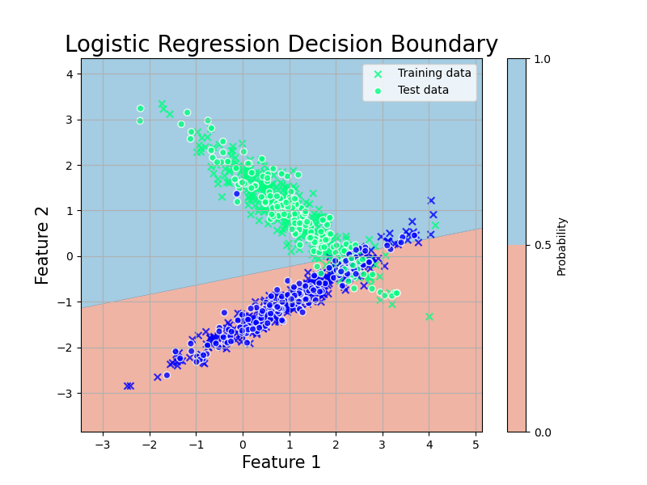

# ロジスティック回帰

ロジスティック回帰は，目的変数がカテゴリカルであったり比率 (0,1) で合ったりする場合に用いる代表的な回帰手法です．[線形回帰](../../Math/Statistics/linear_regression.html)が適用できない (望ましくない) ようなデータに対して利用可能です．筆者が学部生の最初の頃あたりでは，これが出来れば世間的には「データ解析に強い AI エンジニア」を名乗れていたような記憶があります．


## 変数の尺度とダミー変数
データ分析において用いるデータは，必ずしも数量として意味をもつ連続的なものではありません．[統計学の初歩](../Basic/statistics.html#尺度水準)に戻ってみると，Stevens, S.S. による尺度水準の4分類がありました．

<div class="box">
<div class="title">スティーブンスの尺度水準</div>

- **名義尺度** ... 他と区別し分類するための尺度．カテゴリー．
例： 性別，クラス，国籍，学籍番号
- **順序尺度** ... 順序や大小に意味を持つが，間隔に意味がない尺度．
例： 順位，Likert scale，級位，診断ステージ
- **間隔尺度** ... 順序だけでなく，間隔にも意味を持つ尺度．
例： 気温，西暦，点数
- **比率尺度** ... さらに0が原点となり，比率にも意味を持つ尺度．
例： 身長，速度，給料，時間
</div>

ロジスティック回帰はこのうち，名義尺度や順序尺度に対して回帰分析を行いたい時に用いるものです．ただ一般に，単にロジスティック回帰といった場合は名義尺度，つまりカテゴリカルデータの分析に用いるものを指すことが多いです．

では，何故名義尺度や順序尺度には線形回帰ではなく，ロジスティック回帰を使うのでしょうか．まだロジスティック回帰がどんな回帰をするものなのかは分かりませんが，とりあえず例を見てみます．


### ロジスティック回帰の例
下の図は，1日に吸うたばこの本数によって発がん率 (True or False) に影響があるかをplotした仮想図です．癌の有無は，2値データとしてしか観測できませんので，1と0というダミー変数によって表しています．

<details markdown="1">
<summary>Pythonコード</summary>

```python
# データの定義
x = np.array([3, 7, 2, 6, 6, 10, 14, 19, 22, 25,26,27,29, 30]).reshape(-1, 1)
y = np.array([0, 0, 0, 0, 0, 0, 1, 0, 1, 1, 1,1,1,1])

# 線形単回帰モデル
lin_reg = LinearRegression()
lin_reg.fit(x, y)
y_pred_lin = lin_reg.predict(x)

# ロジスティック回帰モデル
log_reg = LogisticRegression()
log_reg.fit(x, y)
x_test = np.linspace(0, 35, 300).reshape(-1, 1)
y_pred_log = log_reg.predict_proba(x_test)[:, 1]

# プロット
plt.figure(figsize=(10, 6))

# 元データのプロット
plt.scatter(x, y, color='black', zorder=5)

# 線形回帰のプロット
plt.plot(x, y_pred_lin, label='Linear Regression', color='blue')

# ロジスティック回帰のプロット
plt.plot(x_test, y_pred_log, label='Logistic Regression', color='red')

# 設定
plt.xlabel('Cigarettes per a day')
plt.ylabel('Cancer')
plt.title('Comparison of Linear and Logistic Regression for categorical data')
plt.legend()
plt.grid(True)

plt.savefig('../figures/logistic1.png')
```
</details>

<center></center>

まず，青の線形回帰モデルより，ロジスティック回帰モデルの方がよく合っていそうではあると思います．

しかし重要なのは，回帰の端のあたりの挙動です．線形回帰は，(0,1)の範囲を飛び出ていることが分かるでしょうか．つまり，こいつに予測をさせると「喫煙本数が27本を超えると，発がん率は100%を超える」や「毎日マイナス本のたばこを吸うと，癌率もマイナスになる」等の意味の分からない予言が出てしまいます．

この問題こそが，名義尺度や順序尺度に線形回帰が使えない理由です．対するロジスティック回帰は，(0,1) の間に収まった関数形をしています．これなら，発がん率が120%なんてことにはなりません．

とりあえず，最低限はここまで理解すればロジスティック回帰の目的はOKです．

## ロジスティック回帰モデル
では，実際にロジスティック回帰を扱うための関数やモデルの導出を行っていきます．

まず，線形回帰の問題点はダミーである目的変数 (y) の値が (0,1) を飛び出してしまうことにありました．それ以外の部分では，先ほどの図をよく見ればたとえば中心 (y=0.5) が一緒だったりするのが分かると思います．

ということで，線形回帰の線を両端で0,1に漸近するような形にゆがめてあげたい気持ちが芽生えます．そこで，$(-\infty, \infty)$ の値を取る変数を $(0,1)$ の範囲に収まるよう変換する**シグモイド関数**あるいは**ロジスティック関数**

$$
\begin{align}
f(y) = \frac{1}{1+\exp(-y)}
\end{align}
$$

<center></center>

を使って回帰線を変換してしまうことを考えます．こうすることで，予測値が[0,1]の範囲に収まります．

これが **ロジスティック回帰**という名前の由来です．目的変数をロジスティック変換して，それに回帰をしているからです．

ということで，線形回帰の $y_i = \bm{\beta}^\top\bm{x_i}$ をロジスティック変換

$$
f(y) = \frac{1}{1+\exp(-y)}
$$

した $y' = p_i$ という新たな変数を考えます．$p$ にしているのは確率からです．$y=1$ である確率はどれほどか，といったモデルを考えます．

すると $y_i = \bm{\beta}^\top\bm{x_i}$ より

$$
\begin{align}
p_i = \frac{1}{1+\exp(-\bm{\beta}^\top\bm{x_i})}, \quad 0 < p_i < 1, \quad -\infty < \bm{x_i} < \infty
\end{align}
$$

となります．これが**ロジスティック (回帰) モデル**です．さらに，これを$\bm{\beta}^\top\bm{x_i}$について解くと...

<details markdown="1">
<summary>Prev解法iew</summary>

まず，

$$
\begin{align}
p_i = \frac{1}{1+\exp(-\bm{\beta}^\top\bm{x_i})}
= \frac{\exp (\bm{\beta^\top x_i})}{1 + \exp (\bm{\beta^\top x_i})}
\end{align}
$$

とし，

$$
\begin{align}
1 - p_i = \frac{1 + \exp (\bm{\beta^\top x_i}) - \exp (\bm{\beta^\top x_i})}{1 + \exp (\bm{\beta^\top x_i})} = \frac{1}{1 + \exp (\bm{\beta^\top x_i})}
\end{align}
$$

も同様に出しておきます．

ここで式6,7の比を取ると

$$
\begin{align}
\frac{p_i}{1-p_i} = \frac{\exp (\bm{\beta^\top x_i})(1+\exp (\bm{\beta^\top x_i}))}{1+\exp (\bm{\beta^\top x_i})} = \exp (\bm{\beta^\top x_i})
\end{align}
$$

と，$\exp (\bm{\beta^\top x_i})$ であることがわかります．よって両辺の対数を取ると

</details>

$$
\begin{align}
\log \frac{p_i}{1-p_i} = \bm{\beta^\top x_i}
\end{align}
$$

が得られます．これは$\bm{x}$の線形式の形で書かれた **ロジスティック (回帰) モデル** の別表現です．この変換は特に，**ロジット変換**といいます．あとはこれを，得られた $\bm{x}$ のもとで最適化する $\bm{\beta}$ を見つけていけばよいということになります．


## パラメータの推定
では，あとは回帰の問題を考えていきます．[線形回帰](./linear_regression.html) の時にはモデルの式が出たら解法として最小二乗法と最尤法がありました．あとで確認しますが，ロジスティック回帰モデルでは最小二乗法を用いることが出来ません．従ってここでは，最尤法を適用することを考えます．

### 最尤法
最尤法では，まず問題に適した対数尤度関数を考えます．

問題設定によってちょっと式が変わってくるので，とりあえず先ほどのたばこの例のように，目的変数が2値変数

$$
y_i = 
\begin{cases}
0 (癌ではない)\\
1 (癌)
\end{cases}
$$

である場合を考えます．この場合，癌である確率 $P$ を $p(y=1|x)$ とし，$n$ 人のデータが独立である ($p(y_i=1|x_i)=p_i$) と考えると $y_i$ の従う分布は[ベルヌーイ分布](./distribution.html#ベルヌーイ分布) $B(1,p_i)$ に従うため，尤度 $L$ は

$$
\begin{align}
L = \prod_{i=1}^n f(y_i;p_i)= \prod_{i=1}^n p_i^{y_i}(1-p_i)^{1-y_i}
\end{align}
$$

となります．例によって積は嫌なので対数を取ると

$$
\begin{align}
\log(L)= \log(\prod_{i=1}^n p_i^{y_i}(1-p_i)^{1-y_i})\\
= \sum_{i=1}^n \{y_i \log p_i + (1-y_i) \log(1-p_i) \}
\end{align}
$$

と対数尤度関数が求まります．

ここで，確率$p_i$については

$$
\begin{align}
p_i = \frac{1}{1+\exp(-\bm{\beta}^\top\bm{x_i})}
\end{align}
$$

でした．
これを先程の対数尤度関数

$$
\begin{align}
\log(L)= \sum_{i=1}^n \{y_i \log p_i + (1-y_i) \log(1-p_i) \} \nonumber
\end{align}
$$
に代入すると

<details markdown="1">
<summary>解法</summary>

まず，
$$
\begin{align}
\log(L)= \sum_{i=1}^n \{y_i \log p_i + (1-y_i) \log(1-p_i) \}
\end{align}
$$
の $\log p_i, \log (1-p_i)$ をそれぞれ

$$
\begin{align}
\log p_i = \log(\frac{\exp (\bm{\beta^\top x_i})}{1 + \exp (\bm{\beta^\top x_i})})=\bm{\beta^\top x_i}-\log(1+\bm{\beta^\top x_i})\\
\log(1-p_i) = \log(\frac{1}{1+\bm{\beta^\top x_i}})=-\log(1+\exp(\bm{\beta^\top x_i}))
\end{align}
$$

と表します．すると

$$
\begin{align}
\log(L) &= \sum_{i=1}^n \{y_i \log p_i + (1-y_i) \log(1-p_i) \}\\
&=\sum_{i=1}^n \{y_i \bm{\beta^\top x_i} - y_i \log (1+\bm{\beta^\top x_i}) \nonumber \\
&-\log (1+\bm{\beta^\top x_i}) + y_i\log (1+\bm{\beta^\top x_i}) \}
\end{align}
$$

となります．これを整理すると

</details>


$$
\begin{align}
\log(L) = \sum_{i=1}^n \{y_i \bm{\beta^\top x_i} -\log(1+\exp (\bm{\beta^\top x_i})) \}
\end{align}
$$

が得られます．これが，ロジスティック回帰で解く尤度方程式です．

[線形回帰](./linear_regression.html#最尤法)の場合，尤度方程式を解析的に解くことが可能で，それにより最尤推定量を得ることができます．しかし，残念なことにロジスティック回帰モデルの場合，これは難しいです．

解析的に解くことが出来ないため，数値計算を利用して近似的に求める必要があります．一般的には，**ニュートン-ラフソン法**等が用いられるそうです．

筆者の勉強が十分でないので，アルゴリズムの詳細はまた後日とします．とにかく，近似的に用いる方法があるようです．

### 最小二乗法
では，最小二乗法が何故使えないのかです．色々あるのですが，まず一番大きいのは

**「誤差がうまく定義できない」**

ということにあります．ロジスティック回帰でいま考えているような問題は， $y_i =0,1$ とかです．これが正規分布に従うことはありません．線形回帰の際には誤差について

$$
\begin{align}
\epsilon_1,...,\epsilon_n \quad \text{i.i.d.}\\
E(\epsilon_i)=0\\
V(\epsilon_i)=\sigma^2
\end{align}
$$

という仮定をおいていました．今回はこれが成り立たないわけですね．従う分布はベルヌーイ分布になってしまいます．また，シグモイド関数がもつ非線形性に対して，最小二乗法が不適切というのもあるそうです．

## ロジスティック回帰モデルによる判別
AIっぽくなってきました．ロジスティック回帰では，

<center></center>

のようにロジスティック関数によって歪んだ回帰を行うことで，2値分類のようなタスクにも扱えるようにするのを目的としていました．

では，今あるデータだけでなく未来に得られるデータについてそのカテゴリを判別する課題を考えていきます．モデルの応用的利用ですね．

普通の線形回帰の場合，与えられる予言の取り得る値は $x$の値によって変わるので，無限にありました．しかしこのロジスティック回帰の場合，元々がカテゴリカルな判別を目的としています (比率の場合もある．その場合は線形回帰と同じように考えてよい)．

そのため，モデルの推定によって

$$
p_i = P(y_i =1|\bm{x_i})
$$

の推定値 $\hat{p_i}$ が得られたとします．この値は(0,1)の範囲に収まります．目的変数は2値なので，適当なところで閾値 $T$ を定めて

$$
\begin{align}
\hat{y_i}=
\begin{cases}
1, \hat{p_i} \geq T \\
0, \hat{p_i} \leq T 
\end{cases}
\end{align}
$$

のように基準を設けます．これにより，観測値を2群に分類することが可能です．研究の場では，得られた生理指標や行動指標から疾患その他を判別するといった用途で使われます．

尚，この結果は真偽と陰陽の組み合わせで4パターン考えられます．それぞれTrue positive (**TP**), false negative (**FN**), false positive (**FP**), true negative (**TN**)です．

これらを用いて得られる

$$
\begin{align}
\text{ACC} = \frac{\text{TP} + \text{TN}}{\text{TP} + \text{FN} + \text{FP} + \text{TN}}
\end{align}
$$

は正解率 (Accuracy rate) と呼ばれる比率で，モデルの評価によく用いられます．

また同様に，

$$
\begin{align}
\text{TPR} = \frac{\text{TP}}{\text{TP} + \text{FN}}
\end{align}
$$

$$
\begin{align}
\text{FPR} = \frac{\text{FP}}{\text{FP} + \text{TN}}
\end{align}
$$

の２つはそれぞれ**True positive rate, False positive rate**という値で，これらもよく用います．特にこれらは，後述する**ROC曲線**を描く際に用います．


## 多群判別
これまで，2値分類の問題でのロジスティック回帰の用法を考えてきましたが，実際には3値以上での分類問題も当然考えられます．

その場合，ロジスティック回帰ではやや大変になってしまい，

- 2値分類を各群の組み合わせ数だけ適用し，その中でもっともスコアが高くなった群に割り当てる
- ある群とそれ以外の群との2値分類を繰り返し，最もスコアが高くなた群に割り当てる

などがあります．ただこれはあまり頭の良い方法ではないので，他に多項ロジスティック回帰やそのほかのモデルを使った判別法があります．

これらについてはまたいつか．

## モデルの評価

### モデル評価基準
ロジスティック回帰の場合でも，比率の推定や判別に寄与している説明変数の組み合わせ最適化には [AIC](./model_evaluation.html#AIC) や [BIC](./model_evaluation.html#BIC) を適用することができます．その場合，ロジスティック回帰モデルに基づく対数尤度関数

$$
\begin{align}
\log(L) = \sum_{i=1}^n \{y_i \bm{\beta^\top x_i} -\log(1+\exp (\bm{\beta^\top x_i})) \}
\end{align}
$$

に，得られた推定値 $\hat{\bm{\beta}}$を代入して

$$
\begin{align}
\text{AIC} = -2\log(L(\hat{\bm{\beta}})) + 2(p + 1)
\end{align}
$$

$$
\begin{align}
\text{BIC} = -2\log(L(\hat{\bm{\beta}})) + (p + 1)\log(n)
\end{align}
$$

と与えられます．

### ROC曲線とAUC
上で確認したように，ロジスティック回帰モデルを使った判別結果は閾値 $T$ によって

$$
\hat{y_i}=
\begin{cases}
1, \hat{p_i} \geq T \\
0, \hat{p_i} \leq T 
\end{cases}
$$

と定められます．当然，$T$ の値次第で TPR や FPR の値は変わります．一般に，TPR が上がると FPR も上がる，トレードオフの関係が成り立っています．従って，良い判別モデルとは，閾値 T を変えていった時に， 最も **TPRが大きく，FPRが小さい** モデルであることになります．

この関係を図にしたのが **ROC曲線**および**AUC (area under the curve)** です．

<details markdown="1">
<summary>Python code</summary>

```python
import numpy as np
import matplotlib.pyplot as plt
from sklearn.datasets import make_classification
from sklearn.linear_model import LogisticRegression
from sklearn.model_selection import train_test_split
from sklearn.metrics import roc_curve, auc

# ランダムな2値分類データセットの生成
X, y = make_classification(n_samples=1000, n_features=2, n_informative=2, n_redundant=0, n_clusters_per_class=1, random_state=42)

# データをトレーニングセットとテストセットに分割
X_train, X_test, y_train, y_test = train_test_split(X, y, test_size=0.3, random_state=42)

# ロジスティック回帰モデルの作成とトレーニング
model = LogisticRegression()
model.fit(X_train, y_train)

# モデルの回帰線と決定境界をプロットするための設定
x_min, x_max = X[:, 0].min() - 1, X[:, 0].max() + 1
y_min, y_max = X[:, 1].min() - 1, X[:, 1].max() + 1
xx, yy = np.meshgrid(np.linspace(x_min, x_max, 500), np.linspace(y_min, y_max, 500))

# モデルによる決定境界
Z = model.predict_proba(np.c_[xx.ravel(), yy.ravel()])[:, 1]
Z = Z.reshape(xx.shape)

# 図のプロット
plt.figure(figsize=(8, 6))
plt.contourf(xx, yy, Z, levels=[0, 0.5, 1], cmap='RdBu', alpha=0.6)
plt.colorbar(label='Probability')
plt.scatter(X_train[:, 0], X_train[:, 1], c=y_train, cmap='winter', marker='x',edgecolors='k', alpha=0.8, label='Training data')
plt.scatter(X_test[:, 0], X_test[:, 1], c=y_test, cmap='winter', edgecolors='white', alpha=0.8, label='Test data')
plt.title('Logistic Regression Decision Boundary', fontsize=20)
plt.xlabel('Feature 1', fontsize=15)
plt.ylabel('Feature 2', fontsize=15)
plt.legend()
plt.grid(True)
plt.savefig('../figures/logistic2.png')
```
<center></center>

```python
# テストデータに対する予測確率
y_scores = model.predict_proba(X_test)[:, 1]

# ROC曲線とAUCの計算
fpr, tpr, thresholds = roc_curve(y_test, y_scores)
roc_auc = auc(fpr, tpr)


plt.plot(fpr, tpr, color='darkorange', lw=2, label='ROC curve (area = %0.2f)' % roc_auc)
plt.plot([0, 1], [0, 1], color='navy', lw=2, linestyle='--')
plt.xlim([0.0, 1.0])
plt.ylim([0.0, 1.05])
plt.xlabel('False Positive Rate', fontsize=15)
plt.ylabel('True Positive Rate', fontsize=15)
plt.title('Receiver Operating Characteristic', fontsize=20)
plt.legend(loc="lower right", fontsize=15)
plt.grid(True)

plt.tight_layout()
plt.savefig('../figures/ROC.png')
```

</details>

<center></center>

**AUC** は ROC 曲線の下の面積です．この図だと 0.94 ですね．TPR が大きく FPR が小さい時に面積は大きくなるので，これはかなり良い例です．論文でもよく使われている指標です．

実用上，青線の $\text{TPR} = \text{FPR}$ となる破線に並行な直線をスライドさせ，ROC 曲線との接線を求めることで最適な閾値 T を選択することが可能です．