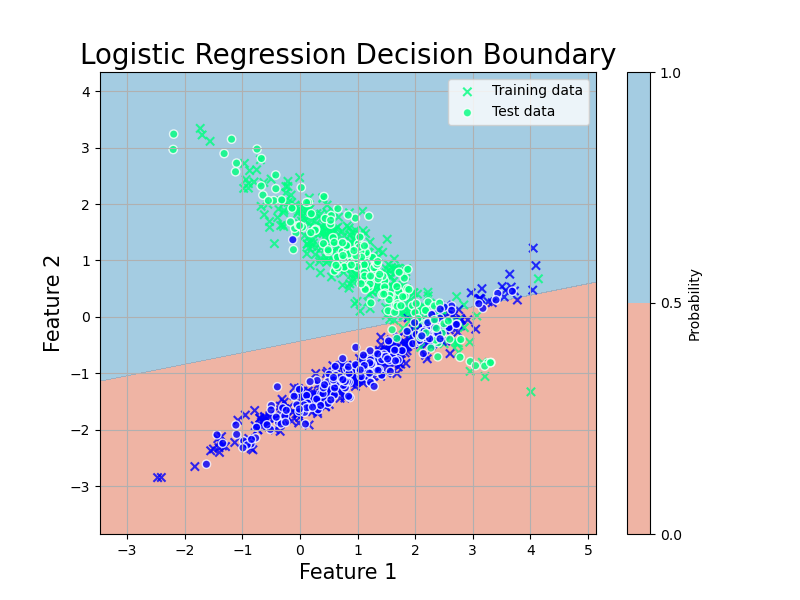
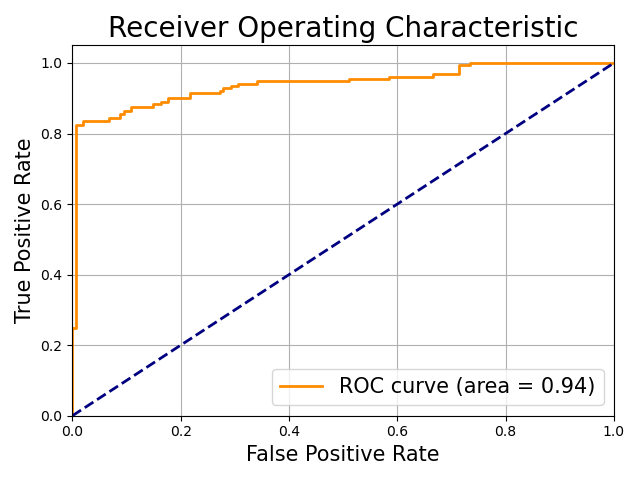

# 統計モデルの評価基準

拝啓

未来の僕へ．いかがお過ごしでしょうか．暇な時間はありますでしょうか．
いずれこのページを埋めてくれることを祈っております．

敬具

## いつかやるのです
## 統計モデルの評価

### クロスバリデーション
### AIC
[KLD](../Others/Entropy.html#KL距離)を参照すると良いかも

### BIC

## 判別分析の評価
### ROC曲線とAUC
判別結果は閾値 $T$ によって

$$
\hat{y_i}=
\begin{cases}
1, \hat{p_i} \geq T \\
0, \hat{p_i} \leq T 
\end{cases}
$$

と定められます．当然，$T$ の値次第で TPR や FPR の値は変わります．一般に，TPR が上がると FPR も上がる，トレードオフの関係が成り立っています．従って，良い判別モデルとは，閾値 T を変えていった時に， 最も **TPRが大きく，FPRが小さい** モデルであることになります．

この関係を図にしたのが **ROC曲線**および**AUC (area under the curve)** です．

<details markdown="1">
<summary>Python code</summary>

```python
import numpy as np
import matplotlib.pyplot as plt
from sklearn.datasets import make_classification
from sklearn.linear_model import LogisticRegression
from sklearn.model_selection import train_test_split
from sklearn.metrics import roc_curve, auc

# ランダムな2値分類データセットの生成
X, y = make_classification(n_samples=1000, n_features=2, n_informative=2, n_redundant=0, n_clusters_per_class=1, random_state=42)

# データをトレーニングセットとテストセットに分割
X_train, X_test, y_train, y_test = train_test_split(X, y, test_size=0.3, random_state=42)

# ロジスティック回帰モデルの作成とトレーニング
model = LogisticRegression()
model.fit(X_train, y_train)

# モデルの回帰線と決定境界をプロットするための設定
x_min, x_max = X[:, 0].min() - 1, X[:, 0].max() + 1
y_min, y_max = X[:, 1].min() - 1, X[:, 1].max() + 1
xx, yy = np.meshgrid(np.linspace(x_min, x_max, 500), np.linspace(y_min, y_max, 500))

# モデルによる決定境界
Z = model.predict_proba(np.c_[xx.ravel(), yy.ravel()])[:, 1]
Z = Z.reshape(xx.shape)

# 図のプロット
plt.figure(figsize=(8, 6))
plt.contourf(xx, yy, Z, levels=[0, 0.5, 1], cmap='RdBu', alpha=0.6)
plt.colorbar(label='Probability')
plt.scatter(X_train[:, 0], X_train[:, 1], c=y_train, cmap='winter', marker='x',edgecolors='k', alpha=0.8, label='Training data')
plt.scatter(X_test[:, 0], X_test[:, 1], c=y_test, cmap='winter', edgecolors='white', alpha=0.8, label='Test data')
plt.title('Logistic Regression Decision Boundary', fontsize=20)
plt.xlabel('Feature 1', fontsize=15)
plt.ylabel('Feature 2', fontsize=15)
plt.legend()
plt.grid(True)
plt.savefig('../figures/logistic2.png')
```
<center></center>

```python
# テストデータに対する予測確率
y_scores = model.predict_proba(X_test)[:, 1]

# ROC曲線とAUCの計算
fpr, tpr, thresholds = roc_curve(y_test, y_scores)
roc_auc = auc(fpr, tpr)


plt.plot(fpr, tpr, color='darkorange', lw=2, label='ROC curve (area = %0.2f)' % roc_auc)
plt.plot([0, 1], [0, 1], color='navy', lw=2, linestyle='--')
plt.xlim([0.0, 1.0])
plt.ylim([0.0, 1.05])
plt.xlabel('False Positive Rate', fontsize=15)
plt.ylabel('True Positive Rate', fontsize=15)
plt.title('Receiver Operating Characteristic', fontsize=20)
plt.legend(loc="lower right", fontsize=15)
plt.grid(True)

plt.tight_layout()
plt.savefig('../figures/ROC.png')
```

</details>

<center></center>

**AUC** は ROC 曲線の下の面積です．この図だと 0.94 ですね．TPR が大きく FPR が小さい時に面積は大きくなるので，これはかなり良い例です．論文でもよく使われている指標です．

実用上，青線の $\text{TPR} = \text{FPR}$ となる破線に並行な直線をスライドさせ，ROC 曲線との接線を求めることで最適な閾値 T を選択することが可能です．