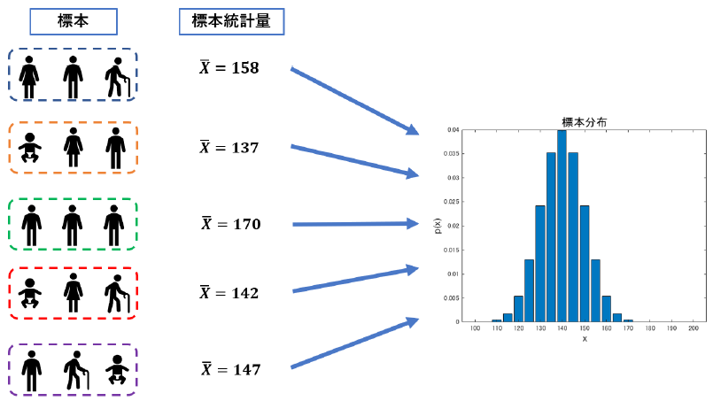
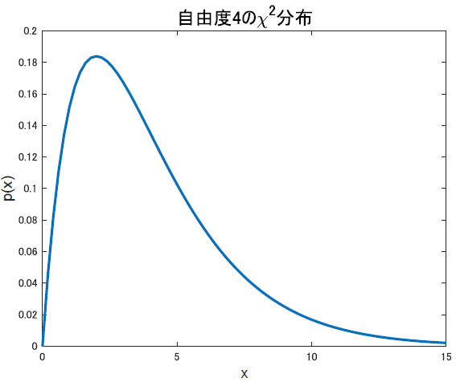
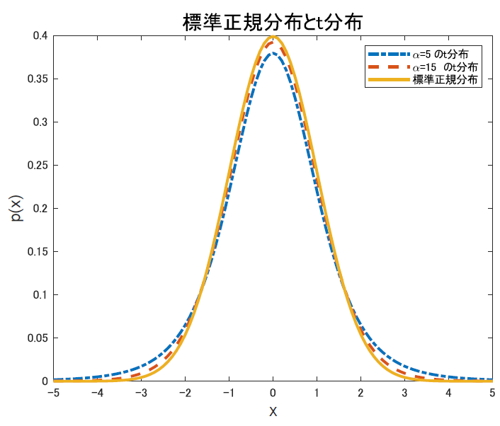

# 統計量と標本分布

突然ですが，筆者は統計を勉強するのが，最初とても嫌でした．なんでかって，統計の議論はお気持ちだけのふわふわしたものに思えていたのです．

たとえば平均に関する検定をしたいとか思った時，「とりあえず正規分布のどのあたりに値するデータが得られたのかを見て，その生起確率を考えて仮説を棄却するt検定をやる」みたいな理解ならB1の頃からしていたわけですが...

何故正規分布？とか，「どのあたり」ってのの決め方は？とか，実際は何の値が正規分布になるのかよく分からん，とか，そんな感じでした．

周波数解析でいえばオイラーの公式もフーリエ変換も知らない感じ．t検定って言葉は知ってるけど「t検定の式」とか言われても分からない．そんな気持ち悪さでした．

そこでちゃんと統計勉強してみて気付いたのが，結局スキップしないでちゃんと**基礎をやりましょう**って話でした．という事で，基礎になっちゃいますがこの章を理解すればあとは検定は自然に導かれます．頑張りましょう．

## 標本分布とは

基礎編で確認したような平均や分散といった話と，これ以降でしていく話とで根本的に違う事があります．それは，今までやっていたような基本的な話は全て，得られたデータの特徴を説明するために要約するような量でした．

つまり，既に得られている既知の分布，データについての統計です．言い換えれば，分析したい対象全てのデータを使っています．

これを，**記述統計**と言います．

一方，我々が研究で使う多くのデータはそう上手くいきませんよね．たとえば，健常者と自閉症患者の脳活動を比較したいという時，世界に存在する全ての健常者と自閉症患者を持ってきて脳活動を測るなんて，考えるまでもなく無理です．

故に，人類の代表として20名とかずつ呼んできますよね．この時，全健常者や全患者の事を**母集団**と称し，呼び出してきた被験者を**標本**と言います．一応，標本は特定のデータではなくデータの集合である事を注意しておきます．筆者は最初それがごちゃごちゃになってました．被験者Ａさんは標本ではなく標本の要素です．

母集団と標本の関係．母集団から代表していくつかのデータを抜き出したものを標本という．標本は無作為に偏りなく抽出する必要がある．図では3つ目の標本は若い男性だけを標本として抽出してしまっているため，データの偏りが強く良い標本の抽出とは言えない．ちなみに日本人の平均身長を140としてるのはマジでてきとーです．

母集団全体を調べる記述統計的な全数調査は不可能なので，我々がやるのは標本の特徴から母集団の特徴を推測する作業で，これを**統計的推測**と言います．

この時，既に母集団が従う分布が特定されている場合，得られた標本から推定するのは母集団の平均や分散といったパラメータ，母数だけで済みます．たとえば正規分布に従うって分かっていれば平均と分散さえ分かれば分布が一意に定まりましたよね．そんな感じ．

このように，特定の分布に従う事は既に分かっている母集団について，あとは分布のパラメータさえ分かれば良い問題を**パラメトリック**な場合と言います．

一方で，母集団が従う分布の形すら分からんという状況．この場合はまず，分布の形も位置もばらつきも，いろんな値を考えていく必要があります．これを**ノンパラメトリック**な場合と言い，一般にノンパラな方が難しいです．

とりあえず本書ではパラメトリックな話を進めていきます．

では，標本統計の流れを見ていきましょう．

まずは母集団から標本を抽出する必要があります．これは考えればわかる事ですが，なるべく母集団の中から偏りなく平等に抽出する必要があります．

たとえば健常者母集団から標本として20代の女性だけ20名呼んでくるようなのは良くないですよね．それでは健常者ではなく健常な20代女性，が母集団になってしまいます．

という風に，なるべく母集団から偏りなく標本を抽出することを**無作為抽出**と言います．

また，母集団から一度抜き出した要素を一度母集団に戻してから次の要素を抽出する事を繰り返して作る標本を**復元抽出**と言います．通常，我々が行う統計では非復元抽出がメインです．

でも介入実験とかで行われる，Crossoverデザインは復元抽出の扱いになるんですかね．そこらへんは詳しくは分からないですが．

以降，特に断らない限り標本は母集団から非復元的に無作為抽出されたものを仮定して議論を進めます．

ここまでは常識．で，ここから先を勉強していく上で簡単なように思えて重要な考え方があります．それが標本と**標本分布**です．

上の図は標本と標本分布の概念図です．ここでは，得られた標本平均の標本分布をplotしています．

標本は母集団から無作為に選んできたいくつかの要素で構成されていました．言ってみれば母集団の部分集合です．すると必然的に，その組み合わせは母集団の数をN，標本の要素数をnとすると

$$
{}_N C_n = \frac{N!}{n!(N-n)!}
$$

通りの標本の取り方が考えられますよね．問題は，こうして得られる標本たちは異なる要素をもっているので，たとえば標本の平均(標本平均)などを求めた際には値が毎回異なります．

標本の取り方によって値が変わるので，標本平均などの値は標本の関数とも言え，その分布を定義する事ができますね．つまりヒストグラムが書けます．

こうして作られる分布の事を，**標本分布**と言います．母集団の持つ母数分布に対して，標本集団の持つ分布ですね．

以上の理由で，標本の取り方によって値が変わってしまうので「てきとうに選んだ標本平均＝母平均！」なんて事は簡単には言えないわけです．

が，実際論文ではそんなことを言ってますよね．どんな時なら，なんで，それを言っていいのかを勉強していきましょう．

## 統計量
母数は母集団のもつパラメータ，母平均や母分散の事でした．それに対し，先程でてきたように標本の平均や標本の分散なんてのを考えるとき，これらを**統計量**と言います．推定や検定なんかは，この統計量を使って母数についてあーだこーだ考える手法とも言えます．ので，ここからはいろんな統計量について考えていきます．

実際，統計量が分かればあとは簡単です．たとえばあの有名なt検定は，t統計量と呼ばれる統計量を使った検定，てな具合です．

まずは母数から確認しましょうか．と言っても，これは[基本の統計](../Basic/statistics)なので皆大丈夫だと思います．

**母平均**
$$
    \mu = \int_{-\infty}^{\infty} x f(x) dx \qquad \text{(連続)}\\
    \mu = \sum_{i=1}^N x_i f(x_i) \qquad \text{(離散)}
$$

**母分散**
$$
    \sigma^2 = \int_{-\infty}^{\infty} (x-\mu)^2f(x)dx \qquad \text{(連続)}\\
    \sigma^2 = \sum_{i=1}^N (x_i-\mu)^2 f(x_i) \qquad \text{(離散)}
$$

定義通りですね．

### 標本平均
で，肝心の標本統計量に行きましょう．まずは標本平均から考えます．$X_i$が具体の要素，$X$が標本集合とし，$n$は要素数とします．するとこれは勿論，

$$
  \bar{X} = \frac{X_1 + X_2+...+X_n}{n} = \frac{\sum_{i=1}^n X_i}{n}
$$

で表されます．こいつの性質ですが，以下を満たします．

$$
  E(\bar{X}) = \mu\\
  V(\bar{X}) = \frac{\sigma^2}{n}\\
  \therefore V(\bar{X}) \propto \frac{1}{n}
$$
  
まず期待値を取ると$E(\bar{X}) = \mu$となります．

「ん？平均の期待値？」となった人は落ち着いて考えてください．標本は選ぶ要素によって違う集合になって，当然計算される標本平均$\bar{X}$の値も毎回違うんでしたね．その分布を考えた，標本平均の標本分布の期待値です．正規分布なら中央の山の部分．

**標本平均の期待値が母平均$\mu$に一致する**って話です．

もう一つ，標本平均の分散，これが1/nに比例するという性質があります．これはつまり[大数の法則](./central_limit_theorem.html)です．標本の要素数が増えるにつれて分散は小さくなり，確率は収束するのでしたね．

ここらへんの議論は直観的には当然な気もするけど，数学的になんで？と言われるとパッと思いつきませんよね．僕はこういったところに気持ち悪さを感じて放置してた結果，この年(M1)でこんな基礎をやる羽目になったので，ちゃんと確認しておきましょう．え？パッと思いつく？ブラウザバックしてください．

簡単に導くと，

$$
E(\bar{X}) = E(\frac{X_1 + X_2 + ...+X_n}{n})\\
             = \frac{E(X_1+X_2+...X_n)}{n}\\
             = \frac{E(X_1) + E(X_2)+...+E(X_n)}{n}\\
             = \frac{\mu+\mu+...+\mu}{n}\\
             =\mu 
$$

となります．まず，期待値を分解できるのは良いでしょうか．期待値の加法性です．そしたら，それぞれの標本$X_i$は全て，平均$\mu$の母集団より生成されているのだから期待値は全て$\mu$になりますよね．なのでその総和をnで割ると$\mu$が出るって寸法です．

分散の方行きましょう

$$
V(\bar{X}) = V(\frac{X_1+X_2+...+X_n}{n})\\
             = V(\frac{1}{n}(X_1 + X_2 +...+ X_n)) \\
             = \frac{1}{n^2}(X_1 + X_2+...+X_n)\\
             = n\frac{\sigma^2}{n^2}\\
             = \frac{\sigma^2}{n}
$$

という流れです．ただし，$V(aX) = a^2 V(X)$という公式を用いています．

当たり前なようですが，これらはちゃんと確認できるとありがたい性質ですね．ようはある程度以上の標本の要素数があれば，ちゃんと母平均に近付ける事を表しています．さらに，分散の方はnが増えれば増えるほど小さくなっていくことも分かります．これは[大数の法則](./central_limit_theorem.html)で示されている事でしたね．

てことで，すくなくとも標本平均についてはちゃんと母平均の議論に使えそうな事が分かりました．めでたし．

### 標本分散
次に，標本分散について考えていきましょう．標本分散は二種類あるのですが，まずは基本の方から．

$$
  s^2 = \frac{1}{n}\{ (X_1-\bar{X})^2 + (X_2-\bar{X})^2 + ...+(X_n - \bar{X})^2 \}\\
      = \frac{1}{n} \sum_{i=1}^n(X_n - \bar{X})^2
$$

これもまあ，分散の基本ですね．特に言うことないと思います．各要素について，標本平均との偏差二乗和の平均を取ったやつですね．以上です.

がしかし，ここで終わらないのがちょっと面倒なところです．実はこの標本分散の定義だと，不都合が生じる事があります．故に，次の形で示す標本分散を用いるのが一般的です．

$$
s^2 = \frac{1}{n-1}\{ (X_1-\bar{X})^2 + (X_2-\bar{X})^2 + ...+(X_n - \bar{X})^2 \}\\
    = \frac{1}{n-1} \sum_{i=1}^n(X_n - \bar{X})^2
$$

nがn-1になりましたね．謎です．導出は下で行いますが，とりあえずこいつは**不偏分散**と呼ばれる量です．大事なのでちゃんと下の説明を理解するよう心がけてみてください．

まず，このn-1は**自由度**と呼ばれる値です．誰だよそいつって思うはずなので説明すると，その式の中で自由な値を取れる値の数の事です．だから何言ってんだよお前説明になってねえよって声が聴こえてきたので更に説明をしていきます．

たとえば，男子の身長の平均を考える時．X={168,170,176,181,150}というグループがいたとします．なんか一人可哀想...なんとかして救ってあげたいですね．

平均は当然，$\sum X /n= 169$で計算できます．１人だけ身長が低いのも可哀想なので，5人目の人には厚底ブーツを内緒であげましょう．もちろん，それでも計算は出来ます．10cm盛ったとしたら平均は171になります．

しかしここで，惨いことをしてみましょう．神様が「お前たち5人の平均身長は169だ」と，ありがたいお言葉をくだすったとします．こうなると大変です．高身長組4人は身長を隠したいとも思っていないので自己申告します．さて，その場合どうなるかというと

$$
  169 = \frac{168+170+176+181+\text{哀れな子羊}}{5}
$$

となってしまうので，なんと彼はどうあがいても身長が150である事がバレてしまいます．これが自由度が4の状況です．**平均が169になるという制約条件を課されたため，4つまで値が決まれば残りの値も一意に定まる**ため，5人目の身長は他の値を取れない，自由に動けない状態になってしまうわけですね．持ってる情報が0です．

標本分散の時もこれが起きます．だからnではなくn-1で割る訳なのですが，もう少し丁寧に解説を続けます．

標本平均を計算する際の式は$\sum X_i$を使っています．これは別になんの制約も課されていないので自由な値を取れるため，自由度はnです．

それに対し，標本分散の計算は$\sum (X_i -\bar{X})^2$を使っています．問題なのは，$X_i$と$\bar{X}$はどちらも同じ標本の値を使っているので標本平均($\bar{X}$)の定義から$\sum (X_i - \bar{X}) = 0$という制約が課されてしまう事です．同じ集合から計算された平均と各要素の差を全部たしたら当然0になりますね？

これはまさに，さっきの身長の例と同様です．合計値の制約があるため自由に振る舞える値の数が1つ減ってしまうわけです．

では，標本分散では自由度が減る事が確認できたので，次に何故n-1で割るのかを考えます．

$\bar{X}$は$\mu$とは違います．勿論期待値は$\mu$ですが，実際に得られた1標本での平均は母平均と一致しません．この$\bar{X}$は，母平均$\mu$を中心として$\frac{\sigma^2}{n}$の範囲で揺らいでいました．この事を踏まえて，もう一度式

$$
s^2 = \frac{1}{n} \sum_{i=1}^n(X_n - \bar{X})^2
$$

を見てみましょう．

標本分散を計算するカッコの中に，$\bar{X}$を含んでいます．こいつはそもそもが平均$\mu$を基準に分散$\frac{\sigma^2}{n}$を孕んでるのでした．なので，

$$
  E(s^2) = \frac{1}{n} \sum_{i=1}^n(X_n - \mu)^2 - \frac{\sigma^2}{n}\\
      = \sigma^2 - \frac{\sigma^2}{n}\\
      = (1-\frac{1}{n})\sigma^2\\
      = \frac{n-1}{n}\sigma^2
$$

となりそうなのが分かるでしょうか．ちょっと厳密には違うかも，怪しいですが大まかには合ってるはず．

こうなるとあとは簡単で，求めたいのは標本分散($s^2$)じゃなくて，標本分散を元にした母分散の計算の仕方です．なので逆算すると

$$
\sigma^2 = \frac{n}{n-1}E(s^2)
$$

となります．これより

$$
\hat{\sigma^2}(=s^2\prime) = \frac{n}{n-1}s^2\\
             = \frac{n}{n-1}\frac{1}{n}\sum_{i=1}^n (X_i - \bar{X})\\
                 = \frac{1}{n-1}\sum_{i=1}^n (X_i - \bar{X})
$$

と，母分散の推定量($\hat{\sigma^2}$)として，標本分散$s^2$の新しい形$s^2\prime$が定義できました．

ふう，自分が結構悩んだので丁寧に説明してみましたが，とりあえず標本分散についてはこんな感じです．

以降，標本分散といった時には暗黙的に不偏分散を意味しているので注意してください．

## 正規分布からの標本

### 正規標本論
正規分布は確率分布としてありふれ，また扱いやすいものである事はこれまでにも何回か説明しました．

さらに，[中心極限定理](central_limit_theorem.html)から，他の分布であっても標本分布を正規分布に近似していく事が出来ると示されているため，標本分布について考える時はとにかく正規分布からの標本について考えるのが大事な事になります．

これが正規標本論．

我々は何かを観測する際，様々な方法をとります．目視だったり定規で長さ測ったり，です．が，これらの観測方法は完璧ではなく，様々なノイズによって若干の誤差を常に孕んでいます．光の屈折とか金属の温度依存での膨張とか，そういうのも含むノイズです．

これらのために，同一の対象を観測していても，常に誤差が生じるわけですが，これらは平均0，分散$\sigma^2$の正規分布に従い，測定の精度によってこの分散の値は変わるというのがガウスが提唱した**誤差理論**です．

大事なのは，一般に何かを観測する際には誤差が生じ，それはガウス分布，つまり正規分布に従うという事です．

これに，対象のもつ真の値という意味で$\mu$を加えると，$X_1...X_n$の確率分布になり，これは$N(\mu, \sigma^2)$に従います．つまり

$$
  f(x) = \frac{1}{\sqrt{2\pi}\sigma}e^{\frac{-(x-\mu)^2}{2\sigma^2}}
$$

ですね．我々が観測する多くの現象はこの分布に従っているぜというのがこれからたくさん出てくる統計の基本で，それは主に以下の理由によります．

- そもそも正規分布に従う現象が多い
- なんらかの変数変換で正規分布に従うのも多い
- 確率変数の和は[中心極限定理](./central_limit_theorem.html)より漸近的に正規分布に従う

まず，最初の理由は良いですね．身長とか，正規分布ですからね．低身長男子は高身長男子と同じくらいレアなので強く生きていきましょう．

次，たとえば体重なんかは1/3乗すると正規分布に従うということが言われているらしいです．不思議．

次，中心極限定理は良いですね．これはつまり，たとえば**標本平均なんかの多くの統計量が正規分布に従う**事を意味します．

ちなみに，平均0，分散1の正規分布は標準正規分布と言って，以下の形で表されるのでした．これも復習しておきます．

$$
  f(x) = \frac{1}{\sqrt{2\pi}}e^{-\frac{x^2}{2}}
$$

まあ普通に代入すれば出ますね．標準，というからには正規分布に従うＸを標準化すればこれになるわけで，

$$
  Z = \frac{X-\mu}{\sigma}
$$

で定義される標準化変数Ｚは，N(0,1)の標準正規分布に従います．

この標準化の作業，しっかり覚えておきましょう．これ以降ありえん出てきます．平均0，分散1になるように変数を変換する方法でしたね．これにより$N(\mu, \sigma^2)$が$N(0,1)$になりました．

### 母分散既知の時の標本平均の分布
さて，ここ以降はいろんな条件の元で，標本平均や標本分散の従う標本分布の性質について学び，様々な統計量を定めていきます．統計量はとても大事で，言っちゃえば○○検定とは「○○統計量が一定の値を超えたかどうか」を調べる作業です．

つまり，ここで色々場合分けして考える統計量それぞれに対応した検定があるわけで，自分が研究をする際にもそのことを意識して適切な検定を選ぶ必要があります．そのためにも気を付けて確認していきましょう．

まずは母数のうち，母分散が既知の時に母平均を考えたいという状況を考えます．母平均を考えるんだから標本平均の分布を見る必要がありますね．

標本平均は以下でした．

$$
  \bar{X} = \frac{1}{n}\sum_{i=1}^n X_i
$$

$X_i$は勿論，$N(\mu, \frac{\sigma^2}{n})$によって生成されます．で，この時$X_i$を標準化すると

$$
  Z = \frac{\bar{X}-\mu}{\sigma/\sqrt{n}}
$$

となり，これは$N(0,1)$に従います．しつこいようですが，標準化とは平均0，分散1になるよう変換する作業です．なのでこの$N(0,1)$を標準正規分布とよぶのでした．

そもそも何故これをするかですが，そのままの分布だと考えている問題によって毎度平均も分散も違うのだからずれまくってしまいますよね．

標準正規分布において，その点より上側の面積，つまり確率が$\alpha$\%になる点の事を$\alpha$パーセント点，と言います．

これを使って検定などをしていきます．p値とかで出てくる0.05とかに関連する奴です．これをどんな平均や分散を持っているデータでも同じように議論するため，標準化が必要なわけですね．

てわけで，母分散既知の時に使う母平均に関する統計量が定義できました．次！
### 標本分散の標本分布
次に，母平均$\mu$，母分散$\sigma^2$の母集団からとられた標本のもつ分散($s^2$)についての標本分布を考えます．

$s^2$の式は

$$
s^2 = \frac{1}{n-1}\sum_{i=1}^n (X_i - \bar{X})^2
$$

でしたね．ガウスの誤差理論でいう，誤差$e_i$の分散$\sigma^2$について求めたいわけですが，とりあえず定義から$e_i$はそれぞれ，$N(0,\sigma^2)$に従っているため，その期待値を取ると勿論

$$
E(e_i^2) = \sigma^2
$$

になります．定義そのまま．この時，n回の試行を行ったとしたら

$$
\sum_{i=1}^n e_i^2
$$

を統計量の基礎として使うことを考えます．分散の総和的な量ですね．

ここで，$\chi^2$分布を思い出しましょう．標準正規分布に従う独立な確率変数$(Z_i)$を考えた時

$$
\chi^2 = \sum_{i=1}^k Z_i^2
$$

で定義される確率変数が従う分布は自由度kの$\chi^2$分布というのでした．こいつは標本分散を扱う議論には必ず出てくる重要な分布です．

実際，これを使うと正規母集団から得られた$X_n$
の標本分散を

$$
s^2 = \frac{1}{n-1}\sum_{i=1}^n (X_i - \bar{X})^2
$$

とするとき，

$$
\chi^2 = \frac{(n-1)s^2}{\sigma^2}
$$

は自由度(n-1)の$\chi^2(n-1)$に従います．簡単に証明ぽい事をすると，まず標本を標準化すると

$$
\frac{X_i-\mu}{\sigma}
$$

となります．で，こいつらは別の標本だから独立なので$\chi^2$分布が使えて，

$$
\sum_{i=1}^n(\frac{X_i-\mu}{\sigma})^2
$$

が，自由度nの$\chi^2$分布に従うことが分かります．

ところで，不変分散$s^2$は

$$
s^2 = \frac{1}{n-1}\sum_{i=1}^n (X_i - \bar{X})^2\\
    (n-1)s^2 = \sum_{i=1}^n (X_i - \bar{X})^2
$$

と変形する事が出来ます．移項しただけ．で，この時先程の式

$$
\sum_{i=1}^n(\frac{X_i-\mu}{\sigma})^2
$$

と見比べると結構似てますね．というか両辺を母分散で割れば同じ形になりそう．実際，割ってみると

$$
  \frac{(n-1)s^2}{\sigma^2} =\sum_{i=1}^n (\frac{X_i-\bar{X}}{\sigma})^2
$$

となって，こちらも$\chi^2$分布に従う事が分かります．がしかし，こちらは母平均ではなく標本平均を用いた標準化のような事をしているため，標本分散の説明の時同様に自由度が一個減っているので，こいつの従う分布は$\chi^2(n-1)$となります．

こいつを使った検定が$\chi^2$検定です．

### 母分散未知の時の標本平均の分布
次，母分散が未知の時の標本平均について考えます．

実際問題，母平均が未知なのに母分散は分かっているとかいう謎な状況は考えにくく，普通はこの状況が最も考えられます．実際，この状況を考えた時の検定がt検定です！論文で見るのってt検定ばっかですよね！

t検定は，t統計量を使った検定だという話を以前しました．なのでこの節の目標はそう，t統計量を導出し，t検定に備えることにあります.

さて，$\bar{X}$の標本分布を考えた時，まずこいつは正規分布$N(\mu, \frac{\sigma^2}{n})$に従うというのは大丈夫でしょうか．[先程](#正規標本論)確認した通りです．

さて，例にもれずこの時のXを標準化してみます．
しつこいようですが，標準化は

$$
Z = \frac{X-\mu}{\sigma}
$$

とする操作です．今回は正規分布$N(\mu, \frac{\sigma^2}{n})$に従っているんだから，

$$
Z = \frac{\bar{X} - \mu}{\sqrt{\sigma^2/n}}
$$

となりますね．こいつは当然，$N(0,1)$に従います．ただし，ここで考えている問題は，母分散である$\sigma^2$が不明なのでした．困った．仕方ないので，標本分散で代用しましょう．そうすると

$$
t = \frac{\bar{X}- \mu}{\sqrt{s^2/n}}
$$

となります．左辺，変わりましたね！tです！

こいつが**スチューデントのt統計量**と呼ばれる量です．ほんでこいつを使った検定が，あとでやりますが**t検定**です．

つまり，正規分布に従う標本平均を標準化しようとした時，悲しい事に母分散が分からなかったので標本分散で代用して標準化モドキをしたのがt統計量です．

モドキなので，もはやこいつは標準正規分布$N(0,1)$には従いません．

むむむ．ではどうなるのでしょう．

ちょっとトリッキーな事をしてみます．

$$
  t = \frac{\bar{X}-\mu}{\sqrt{s^2/n}} = \frac{\bar{X}-\mu}{\sqrt{\sigma^2/n}} / \sqrt{\frac{s^2}{\sigma^2}}
$$

こう変形できるのは分かるでしょうか．まあ普通に掛け算計算すりゃ元のt統計量がでます．さらにさらにこいつを

えいやっ

$$
  t = \frac{\bar{X}- \mu}{\sqrt{\sigma^2/n}} / \sqrt{\frac{(n-1)s^2}{\sigma^2}/(n-1)}
$$

と表せるのも良いでしょうか．1個前の式の分母の，分母と分子の両方に(n-1)をかけました．

なんでこんな複雑なことを...と思うかもしれませんが，よく見てみるとなんと分子の

$$
  \frac{\bar{X}- \mu}{\sqrt{\sigma^2/n}}
$$

は$N(\mu, \frac{\sigma^2}{n})$に従うXが標準化された値なので，標準正規分布$N(0,1)$に従うことが分かります．

さらに

$$
\frac{(n-1)s^2}{\sigma^2}
$$

は自由度n-1の$\chi^2$分布に従います．こう見ると，**t統計量は標準正規分布と$\chi^2$分布の比**になっています．

と，いうことでこのように$N(0,1)$の確率変数Ｚと$\chi^2(k)$の確率変数Ｘがあるとき，

$$
t = \frac{Z}{\sqrt{X/k}}
$$

で定義される確率変数tが従う分布を，自由度kのt分布と定義します．この定義によると，さっきようやっと出てきたt統計量

$$
  t = \frac{\bar{X}- \mu}{\sqrt{s^2/n}}
$$

は自由度n-1のt分布に従うと言えますね！自由度がn-1なのは，$\chi^2$分布側の自由度がn-1だったからです．これは最初に確認したように，t統計量は母分散の変わりに標本分散を使っているから自由度が1つ落ちるんでしたね．

これでt統計量についての説明は終わりです．

## 2標本問題
さっきまでの説明では，どれも一つの母集団から一つの標本を得た場合の話をしていました．ここでは，明らかに異なる母集団から標本を抽出し，そいつらを比較する場合を考えます．

### 母分散が既知の時

まず，1標本の時同様に母分散が既知というレアなケースから考えます．この場合，得られる2つの標本はそれぞれ，$N(\mu_1, \sigma_1^2)$から$X_1...X_m$，$N(\mu_2, \sigma_2^2)$から$Y_1...Y_n$の要素が独立に得られたとします．

この時の，標本平均間の差の分布を考えましょう．

$$
\bar{X} = \frac{1}{m}\sum_{i=1}^m X_i\\
\bar{Y} = \frac{1}{n}\sum_{i=1}^n Y_i
$$

は良いですね．こいつらは当然独立に得られているので，この差である$\bar{X-\bar{Y}}$も正規分布に従い，$N(\mu_1 - \mu_2, \frac{\sigma_1^2}{m} + \frac{\sigma_2^2}{n})$に従います．改めて正規分布の性質って便利ですね．

はい，嫌な予感がしますよね．でも残念，あきらめて標準化します．

$$
Z = \frac{(\bar{X} - \bar{Y})-(\mu_1-\mu_2)}{\sqrt{(\sigma_1^2/m)+(\sigma_2^2/n)}}
$$

思ったほどじゃなかった．良かった．とにかく，この統計量は標準正規分布$N(0,1)$に従います．これを使うことで，2標本の平均の差の検定が出来ます．

### 母分散が未知だが等しいとき
これもまたちょっと特殊に思えるかもですが，母分散は未知だけど等しいことが分かってるときです．2クラスの身長とかだったらこれで良さそうですね．

さて，$\sigma^2$は未知なのでt統計量の時同様に代わりに標本分散を使い，$\bar{X}- \bar{Y}$の分散を考えます．

平均の差の分布は$N(\mu_1 -\mu_2, (\frac{1}{m} - \frac{1}{n})\sigma^2)$となります．先程とは$\sigma_1=\sigma_2=\sigma$でまとめられた点が違います．母分散が共通なので，得られたＸとＹをがっしゃんこさせて新しい全体分散的な量

$$
  s^2 = \frac{\sum_{i=1}^m (X_i-\bar{X})^2 + \sum_{j=1}^n (Y_i - \bar{Y})^2}{m-1 + n-1}
$$

を定義します．それぞれの不偏分散を使ってもう少しこれを整理すると，
$$
s^2 = \frac{(m-1)s_1^2 + (n-1)s_2^2}{m+n-2}
$$

となります．これで$s^2$，つまり標本分散が完成です．またこれを使って

$$
  \frac{(m+n-2)s^2}{\sigma^2}
$$

を考えると，自由度m+n-2の$\chi^2(m+n-2)$に従っていることが分かります．

いったんこれは置いといて，次に平均の差，つまり$N(\mu_1 -\mu_2, (\frac{1}{m} - \frac{1}{n})\sigma^2)$を標準化してみます．すると

$$
Z= \frac{(\bar{X}- \bar{Y}) - (\mu_1 - \mu_2)}{\sqrt{(\frac{1}{m} + \frac{1}{n})\sigma^2}}
$$

になります．

ここでt統計量は標準正規分布$Z/\chi^2$分布だったことを思い出します．

上２つの式はそれぞれ$\chi^2$分布と標準正規分布だったので，こいつらを使って式

$$
  t = \frac{Z}{\sqrt{s^2/\sigma^2}}
$$

をやってみます．こうすると，2式に含まれている未知数である$\sigma^2$が消えて

$$
  t = \frac{(\bar{X}- \bar{Y}) - (\mu_1 - \mu_2)}{s\sqrt{\frac{1}{m} + \frac{1}{n}}}
$$

が算出できます．名前は**2標本t統計量**といって，2標本で母分散が不明だけど等しいと仮定できる時に使う統計量で，**2標本t検定**なんかに使われます．そのままですね．

### 母分散が未知で等しいかも未知
基本むりっぽい．

なんかウェルチの近似法ってので近似的にはいけるぽいんだけど，基本は無理らしいので触れません．怖いし...

### 標本分散の比の分布
最後に，2つの母集団分布の分散の比についての統計量を考えます．

これは，二つの標本平均の差$\bar{X}-\bar{Y}$の分布を考える際に，未知の母分散が等しい事を仮定して2標本のt統計量を定義した事に関係します．

この仮定を置いていいのか悪いのか，それを標本分散の比から調べてみます．

それぞれの標本分散の分布は独立で，$\chi^2$分布に従っているため，$\chi^2$分布同士の比の確率分布が欲しくなります．

もしここで，$s_1^2/s_2^2≃1$なら母数も$\sigma_1^2 = \sigma_2^2=\sigma^2$に近い関係である事と考えられます．

ここで使われるのがＦ分布です．

自由度$k_1, k_2$の独立な$\chi^2$分布AとBがあったとき，

$$
  F = \frac{\frac{A}{k_1}}{\frac{B}{k_2}}
$$

で定義される量は，自由度($k_1,k_2$)のＦ分布$F(k_1,k_2)$に従うと表されます．また，このＦの事を**フィッシャーの分散比**と言います．

さて，本題の$s_1^2, s_2^2$の比ですが，

$$
  \frac{(m-1)s^2}{\sigma_1^2}, \quad \frac{(n-1)s^2}{\sigma_2^2}
$$

はそれぞれ，$\chi^2(m-1), \chi^2(n-1)$に従っています．よってＦ分布が適用できて，

$$
  \frac{\frac{(m-1)s_1^2}{\sigma_1^2} / (m-1)}{\frac{(n-1)s_2^2}{\sigma_2^2} / (n-1)} = \frac{\sigma_2^2}{\sigma_1^2}\frac{s_1^2}{s_2^2}
$$

がF(m-1, n-1)のＦ分布に従うとが分かります．2標本の分散の比の検定に使う統計量はこいつですね．検定は**Ｆ検定**です．

ちなみに，母分散が等しい時は
$$
  F= \frac{s_1^2}{s_2^2}
$$

になります．単純になりますね．全部こうなってくれ．

...全部こうなっていくれ．そう思う人が使うのが，F分布を使った**等分散性の検定**です．[ANOVA](anova.html)なんかに使います．

さて，ネチネチといろんな統計量の定義をしてきました．が，ここまでちゃんと読めた人なら分かるんじゃないでしょうか．もうほぼ終わりですね．あとはこうして定義した統計量を実際のデータで計算して，そいつがどんくらいのパーセント点にいるのか見てけば，いろんな統計的仮説検定が出来るわけです．

こういう使い方をするために，わざわざ標準化してなんかすげえ形に変形してきたわけです．ここまでが分かっちゃえばもう勝ったも同然です．多分，知らんけど．
