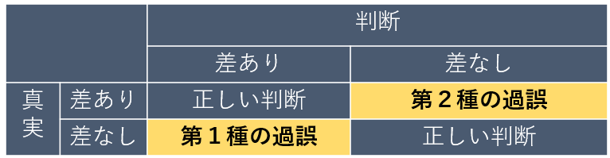
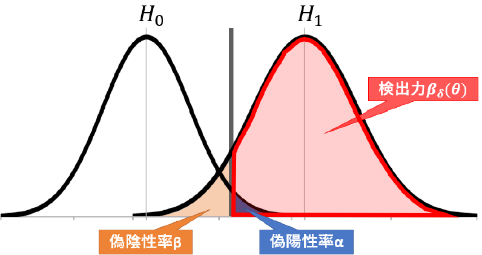

---
html:
  embed_local_images: false
  embed_svg: true
  offline: false
  toc: true

print_background: false

export_on_save:
  html: true
---
| 

 Math 
<ul class="gnav"><li><a href="../Basic/basic.html">基礎数学編</a><ul class="index">     <li><a href="../Basic/calculus.html">掛け算</a></li>             <li><a href="../Basic/trigonometric.html">三角関数</a></li>      <li><a href="../Basic/complex.html">複素数</a></li>             <li><a href="../Basic/calculus.html">微分・積分</a></li>       <li><a href="../Basic/basic.html">基礎統計</a></li>        </ul> <li><a href="../Analysis/Analysis.html">信号処理編</a><ul class="index"><li><a href="../Analysis/fourier.html">フーリエ変換</a></li>                                                  <li><a href="../Analysis/wavelet.html">wavelet変換</a></li>   <li><a href="../Analysis/hilbert.html">ヒルベルト変換</a></li>   <li><a href="../Analysis/eeg.html">基本の脳波解析</a></li>       <li><a href="../Analysis/phase_analysis.html">位相同期解析</a></li>        </ul>                                            <li><a href="../Statistics/Statistics.html">統計編</a><ul class="index"><li><a href="../Statistics/distribution.html">確率分布</a></li>                                                  <li><a href="../Statistics/central_limit_theorem.html">大数の法則と中心極限定理</a></li>                                     <li><a href="../Statistics/statistic.html">統計量と標本分布</a></li>                                                         <li><a href="../Statistics/test.html">統計的検定</a></li>       <li><a href="../Statistics/anova.html">分散分析</a></li>        </ul>
  |                                    

 Analysis 
<ul class="gnav"><li><a href="../../Analysis/eeglab/eeglab.html">EEGLAB</a><ul class="index">                                             <li><a href="../../Analysis/eeglab/setup.html">環境構築</a></li>                                                        <li><a href="../../Analysis/eeglab/import.html">データのインポート</a></li>                                                   <li><a href="../../Analysis/eeglab/prepro1.html">基本的な下処理</a></li>                                                     <li><a href="../../Analysis/eeglab/prepro2.html">発展的な下処理</a></li>                                                         <li><a href="../../Analysis/eeglab/analysis1.html">単被験者での解析</a></li>                                                      <li><a href="../../Analysis/eeglab/analysis2.html">被験者群での解析</a></li>   </ul> 
   |                                    

 Experiment 
<ul class="gnav"><li><a href="../Basic/basic.html">基礎数学編</a><ul class="index">     <li><a href="../Basic/calculus.html">掛け算</a></li>             <li><a href="../Basic/trigonometric.html">三角関数</a></li>      <li><a href="../Basic/complex.html">複素数</a></li>             <li><a href="../Basic/calculus.html">微分・積分</a></li>       <li><a href="../Basic/basic.html">基礎統計</a></li>        </ul> <li><a href="../Analysis/Analysis.html">信号処理編</a><ul class="index"><li><a href="../Analysis/fourier.html">フーリエ変換</a></li>                                                  <li><a href="../Analysis/wavelet.html">wavelet変換</a></li>   <li><a href="../Analysis/hilbert.html">ヒルベルト変換</a></li>   <li><a href="../Analysis/eeg.html">基本の脳波解析</a></li>       <li><a href="../Analysis/phase_analysis.html">位相同期解析</a></li>        </ul> 
 |                                      

 Simulations 
<ul class="gnav"><li><a href="../../Simulation/Simulation.html">環境構築</a><ul class="index">                                             <li><a href="../../Simulation/Setup/environment.html">Python環境構築</a></li>                                                    <li><a href="../../Simulation/Setup/gpu.html">pythonでのGPUセットアップ</a></li>                                                     <li><a href="../../Simulation/Setup/jupyter.html">Jupyterセットアップ</a></li>                                                     <li><a href="../../Simulation/Setup/julia.html">Juliaセットアップ</a></li>
 |                                     
| ----| ---- | ----|----|
<h1>04統計的検定</h1>

このページではいよいよ，統計的仮説検定についてまとめていきます．
基本的に，これと無関係な人は科学系の人にはほとんどいないでしょう．それほど重要というか常識であるが故に，なんとなくで使ってしまっている人も多く，それが原因で心理学分野の再現性問題が特に騒がれているように，しっかりと勉強しておく必要があると思います．

統計検定について書くのは，昨今の情勢的にとても怖いですが...燃やされるなら燃やされるで，自分の理解が進むきっかけを与えてもらえるのだとポジティブに考え，まとめていきます．

頑張りましょう．

## 統計的仮説検定とは

統計的仮説検定とは何か，いつ使うものなのかですが，結論から言えばどの論文にもほぼ必ず出てくる作業ですよね．研究者の掲げる仮説の信憑性を確認するものです．「ある仮説」の元で期待する結果と，実際に得られて観測された結果とを見比べた時，そこにある差が偶然起こったものだと言えるか，否かを評価します．

偶然じゃないのなら，きっとその差には何か意味があるはず，つまり仮説が間違っているという事になります．

これを使って，たとえば1軍と2軍の能力は同等であるという仮説の元に能力テストを行って，結果を比べると明らかに1軍の方が高かったとなれば，残念ながら仮説は間違っていて1軍より2軍の方が優秀であったんだ！のような主張を出来るわけですね．

この発想自体は，我々人間が日頃からやっているようなごく普通の思考プロセスですよね．

与えられた仮説のもとで考えられる範囲を超えた誤差が生じた場合，それは何らかの意味があると考え，このずれは「**有意**である」，と言います．ここから，統計的仮説検定とは即ち仮説の**有意性検定**であるとも言えます．

ではここで問題なのが，どうやってその有意性を判断するのかです．コインを10回投げて，表が何回出るかを使い，コインがいかさまコインじゃないかを判定する問題を考えましょう．一般のコインであれば，確率的に平均を取れば5回表が出るはずですね．

5回表が出たら，普通の人ならイカサマコインではない判定をすると思います．では4回ならどうでしょう？たった10回の試行中なので，僕なら良しとします．では3回は？ここらへんから少し怪しいですね...僕は何とも言えないなぁくらいの評価です．2回まで行くと，ちょっとイカサマを疑っちゃいますね．1回とか0回は許せません．

と，普通に我々が行う思考はこんな感じですね．表が出る確率$p$は$p(表)=1/2$であると考えて，二項分布($Bi(10,1/2)$)の確率分布に従う事を仮説として，その中で与えられたデータ(表が出た回数)が分布のどのあたりにあるのかを考えるわけです．

下の図のような分布ですね．

確率の議論なので，ここでさっきの例をちゃんと計算してみましょう．n=10の2項分布で表が出る回数別にそれぞれの確率を計算すると以下のようになりました．

$$
  x=5 \qquad p = 0.2461 \nonumber \\
  x=4 \qquad p = 0.2051 \nonumber \\
  x=3 \qquad p = 0.1172 \nonumber\\
  x=2 \qquad p = 0.0439 \nonumber
$$

こう見ると，やはり3あたりから怪しくて，2はやばいってのがなんとなく分かりますね．2回だけ表が出る確率は二項分布の元でわずか4.3\%しかないわけですからね．

この時，仮説の元では出るはずがない結果がでたということで，仮説が誤っていたと判断します．この事を，仮説を棄却する，と言います．

また，実用では基本的にこの仮説は否定したい，というか否定される事を想定して設定されるものです(研究であれば，ＡグループとＢグループに差があると言いたいから，差がないという仮説を立てて否定しますね)．故に，こうして否定される仮説の事を特に，帰無仮説とも言います．

反対に，対立的な仮説（コインの例なら，表が出る確率は1/2未満である，とか）を立てて置くこともあります．この仮説を特に，対立仮説と言います．

帰無仮説と対立仮説は互いに反する事象なので，帰無仮説を否定する事は対立仮説を採択する事とほぼ同義，というふうにして使われる事が多いですね．がしかし，注意が必要なのは帰無仮説が$p=0.5$だとして，対立仮説に$p<0.5$を置いたとしたら第三の可能性として$p>0.5$もあります．こうした場合は帰無仮説の否定＝対立仮説の採択とは違うので気を付ける必要があります．

以上の内容を言い換え，改めて仮説検定とは何か考えると，
「用意された仮説が妥当であるか否かを，仮説の元で期待される値と実測値とのずれが有意かどうかで判断し，それに応じて仮説を棄却するか採用するか判定する作業」
であると言えます．

ここまでの内容で，ある程度くらいの脳を持った人なら気付くと思いますが，確率やらを持ってきてそれっぽい空気を出してはいるけど結局最後の有意性の判定が恣意的でしたよね．さっきは「わずか4.3\%しか起こりえないはずの事象を観測するのはおかしい」と決めつけて，コインはイカサマであると判断しました．

その時々の気分で勝手に変えるのも困るので，こうした有意性の判定のためにある基準値を設ける必要があります．それが有意水準($\alpha$)と呼ばれるやつです．

ほら，よく論文とかでも見る$p<0.05$とかのやつです．これはp値が0.05という有意水準を下回っていますよ，つまり有意ですよ，だから帰無仮説を棄却しますよ，という意思表示なわけですね．一般に，有意水準は0.05,0.01などが使われます．p値とはなんぞやはこれから説明します．

しかし有意水準を下回ったからといって，絶対にありえないわけじゃありません．5\%の確率でしかありえない事は，20回に1回程度は起こりうる事でもあります．そのため，帰無仮説や対立仮説をそれぞれ採択したけれども，実際は誤りで他方が正解であったという事が起こってしまいます．
これらの誤りをまとめると以下のようになります．

帰無仮説を棄却したけど実際は偶然で5\%とかの確率を引き当ててしまっていた場合を第一種の過誤，帰無仮説を採択したけど実際は仮説が間違っている場合を第二種の過誤と言います．

また，第一種の加護は偽陽性，第二種は偽陰性とも言います．個人的にはこっちのが分かりやすくて好きです．

もう一つ注意が必要なのは，統計的仮説検定は帰無仮説が否定される事によって対立仮説を採択するといういわゆる背理法を用いているので，厳密には帰無仮説が棄却されなかったからと言ってそれが正しいという事にもならないし，対立仮説が間違っているとも言えません．あくまで，帰無仮説と得られた結果が矛盾しない，というだけにとどまります. 

以上の性質を踏まえ，検定の用いる目的として主に3つの状況が考えられます．

- 帰無仮説を反証し，棄却する目的
- 異常の検知
- 数学的に扱いやすい為おく便宜的な仮定

まず一つ目，これが最も我々が使うものかもですね．先に説明したように背理法的な使い方をして，データに見られる誤差が確率的に偶然で許される範囲かを考え，逸脱していた場合は帰無仮説を棄却して対立仮説を採択するやつ．新薬の効果があるって主張したいから，まずは薬を投与してもしなくても変わりませんよって帰無仮説を設定してそいつを論破してやろうって使い方です．

次に二つ目，異常の検知です．こいつも検定の例だとよく出てきます．本書でも書くと思うけど，工場の生産品の不良品率の話が例によくでてきますね．通常の状態であれば観測されるデータが属しているはずのデータ群として帰無仮説を設定しておいて，こいつが棄却されないならヨシ，されてしまうのなら何か異常があるとするやつです．

最後がちょっと特殊ですが，統計モデルを考える際に使うものぽい．確率変数が正規分布に従うって仮定をいろんなところで置くと思うんですけど，まあこれは中心極限定理があるからある程度信用できるとは言えやはり分からない事なので，あくまで仮定は仮定，仮説です．なので，仮説検定を使ってちゃんとデータがこの分布に従っているのか，つまりここで置いたモデルは妥当なものなのかを検証する際にも使うことが出来ます．便利ですね．

## 仮説と検定関数
と，ここまでの内容は皆さん大体，既に知ってると思います．個人的な話になりますが，統計を勉強する上で特に検定でやる気が起きないの，とにかく数式での説明がないからよく分からないというかイメージしきれないってところなんですよね．という事で，以上の内容を数式使って表していきます．

まず，検定の問題では帰無仮説と対立仮説を置いていました．こいつらは相反するべきものなので，以下のように定義します．

$$
  \Theta = \Theta_0 \cup \Theta_1, \Theta_0 \cap \Theta_1 = \emptyset \text{(空集合)}\\
  H_0: \theta \in \Theta_0 \qquad vs. \qquad H_1:\theta \in \Theta_1
$$

ここで，1つ目の式では$\Theta$は母数空間であり排反な部分集合である$\Theta_0, \Theta_1$に分けられています．こいつらがそれぞれ帰無仮説と対立仮説に対応する母数の集合です．あ，$a \in b$は，aがbに含まれているという意味の記号です．\\

ここで，未知のパラメータである$\theta$がそのどちらに属しているかを表すのが2つ目の式であり，これが帰無仮説と対立仮説(Hypothesis)に相当します．\\\\

例で考えます．ある工場の製品の不良生産品率をpとしたとき，それが許容範囲かどうかを検定する問題で, pがある$p_0$以下であればヨシ，それを超えている場合には生産工程に問題があるとして責任者を減給する事にしましょう．さらに，一般に帰無仮説は$H_0$，対立仮説は$H_1$とする事が多いようなので従うと，ここで考える検定問題は

$$
 H_0 :p\leq p_0 \quad vs. \quad H_1 :p> p_0 
$$

となりますね．閾値として設定した$p_0$以下だったら有意差なし，セーフ，許すとして，超えていたら対立仮説を採択，不良製品率が高すぎるのでこの工場は問題ありとするわけです．

それから前節で説明を忘れていた大事な概念に，両側検定と片側検定があります．これは検定問題の式を考えると分かりやすいですが，

$$
  H_0:\theta = \theta_0\quad vs. \quad H_1:\theta \neq \theta_0
$$

のように，特定の値を決めてそれぴったしなのが帰無仮説，そうでない場合を対立仮説とする場合を両側検定と言います．つまり，分布の右でも左でも関係なく，とにかく帰無仮説で定めた値から逸脱した範囲の場合対立仮説を採択するものです．

一方で，

$$
  H_0:\theta \leq \theta_0 \quad vs. \quad H_1 : \theta > \theta_0
$$

のように（あるいは不等号が逆でも)，決めた値に対してどちらかに超えた場合を検出するものを片側検定と言います．たとえば，ある薬の治療効果を確かめたいという目的で検定をするなら，なんらかの健康の指標が薬の投与によって上昇すれば良いので，上側の片側検定で良さそうですね．このように目的に応じて検定は使い分けられます．

で，我々？検定を使う人？がやる決定dは，$H_0$が正しいのか$H_1$が正しいのかを判断する事です．帰無仮説$H_0$を採択する事をd=0，棄却する事をd=1としておきましょう．

すると決定の結果生じる損失について次のようにまとめられます．これを使って偽陽性や偽陰性について考えていきます．

$$
  L(\theta, d=0) = \left\{
    \begin{array}{l}
    0, \quad if \quad \theta \in \Theta_0\\
    1, \quad if \quad \theta \in \Theta_1
    \end{array}
  \right.\nonumber \\
  L(\theta, d=1) = 1-L(\theta, d=0) 
$$

損失関数については統計編で触れてないと思いますが，まあ「状況」と「判断」を変数としたときの，間違いによって生じる「損失」についての関数です．判断があってれば損失は生まれないし，間違っていれば生まれます．

ここでは，**偽陽性や偽陰性の時に損失が生じれば良い**わけですね．たしかに式では正解が$\Theta_0$なのにd=1，つまり$\theta \in \Theta_0$を否定しちゃったり，逆に$\Theta_1$なのにd=0として$\theta \in \Theta_1$を否定しちゃったりしたときに$L(\theta, d)$は1を取る，つまり損失が生まれる事になっていますね．

そう，偽陽性や偽陰性とはつまり，こうして判断の結果損失が生まれてしまう状態を指します．より一般には，偽陽性と偽陰性はどちらも同じ損失である必要はなく，偽陽性よりも偽陰性の方を，あるいは偽陰性よりも偽陽性の方を厳しくみたいとか色々あると思いますが，ここではとりあえず等価としています．

次に，検定関数$(\delta)$について考えていきます．これは，$X=x$を観測したときに帰無仮説を棄却するなら$1$，採択するなら$0$を取る関数で，要は検定の結果を判断する関数です．そのまんまですね．小泉○○○さんぽい説明になってしまった．

こいつは与えられた統計量によって帰無仮説を棄却する1を取る時と，採択する0を取る事があるので範囲を2分する事が出来，

$$
  A = \{x| \delta(x) = 0\} \qquad R = \{x| \delta(x) = 1  \}\\
  U = A\cup R,\qquad A \cap R = \emptyset
$$

と表現できます．Aはaccept，Rはrejectです．検定関数の値によって，与えられた変数を採択か棄却かに二分しています．またこいつらに重複はなく，これらの和は当然全体集合になります．ここから，Aを採択域，Rを棄却域と言います．\\

検定関数$\delta(x)$は前章で確認したように，与えられた標本$X$を元にした様々な統計量($Z,F,t,\chi^2...$)が使われるのでこいつらをt(X)としておくと，式(\ref{eq:test})は

$$
  A = \{X|t(X) \leq t_0\}, \quad R = \{X|t(X) \geq t_0\}
$$

と表すことが出来ます．この時の$t_0$は，統計量がこの値を超えたら(下回ったら)帰無仮説を棄却するというような値なので，棄却点，あるいは有意点と言います．

有意，ここで初めて出てきました．(所与の帰無仮説の元では)普通に得られるとは考えにくい確率なので，きっとこの結果には意味がある，というニュアンスです．

検定で考える問題はつまり，検定関数に食わせた結果，与えられた統計量が(帰無仮説の)棄却域と採択域のどちらに落ちるのかを判定する事であると言えます．

ではここで，この判定によって生じるリスク(R)についての関数も考えましょう．定義はまず

$$
  R(\theta, \delta) = E_\theta[L(\theta, \delta(X))]
$$

です．リスクとは得られる可能性のある損失についての関数なので，変数として損失関数の式と同様に$\theta$を引っ張りつつ，違いとして$\delta$が入ってきています．これは検定関数の判断の結果の値となるので，判断，即ち損失関数で言うところの$ｄ$と同じですね．

$\theta$と$\delta$を使って表される損失関数，を考えられる$\theta$について期待値を取ったものがリスク関数である，と解釈できます．つまりどの$\theta$だった場合にはどれくらいの損失があるってのを全ての$\theta$について平均するわけです．まだよく分からん人も次の説明を見れば分かります．

さらに，よく考えてみればＬが取る値は1か0だけなので，結局Ｌの期待値ってのは

$$
  E[L] = 0 \times P(L=0) + 1 \times P(L=1)\\
       = P(L=1)
$$

となりますね．L=0となる，つまり偽陽性や偽陰性ではない時は損失が0なのでどんな確率だろうと結局0になり，逆に損失が生じるときには1をかけるだけなので，L=1になる確率と同値って事ですね．単純です．
これを使うと$\delta$のリスク関数は

$$
  R(\theta, \delta) = 
  \left\{
    \begin{array}{l}
    P_\theta(偽陽性)=\alpha, \quad if \quad \theta \in \Theta_0\\
    P_\theta(偽陰性)=\beta, \quad if \quad \theta \in \Theta_1
    \end{array}
  \right.
$$

とまとめられました．つまり，本当は$\Theta_0$が正しいときに生じるリスクは偽陽性である確率，逆に$\Theta_1$の時には偽陰性の確率がリスクになるわけですね．

また，資料によっては偽陽性率を$\alpha$，偽陰性率を$\beta$としておくものもあるので，これ以降採用し，必要に応じて利用していきます．特に偽陽性が$\alpha$なのは，有意水準$\alpha$と混同するじゃないかと悩む人がいるかもしれませんが，後で解消されるのでとりあえず置いておいてください．

言うまでもないことですが，良い判断とはリスクが最小の判断なので，ここで言う偽陽性率と偽陰性率をともに最小化できるのがベストな検定関数という事になります．

また個人的な話になりますが，今まで検定ってすごいふわっとした話ばかりを勉強していたのですけど，こうした数学っぽい形で書いてみるとすごいこう，いいですね．最適化?みたいな話でてきたし．

さて，これも考えるまでもない事ではありますが，偽陽性と偽陰性はトレードオフです．どっちかを極端に抑えればどっちが多く出現するようになってしまいます．

たとえば，読者諸君にもいるかもですが，急に鳴ってビビらせてくるくせに結局何も起きないことが多いから，という理由で携帯電話機に実装されている緊急地震速報などの警報機能を常時OFFにしている人がいます．

あれは「どっかで異常が起きたから，お前のいるとこも危ないはず！！」という予測なので，警報を発したけど何も起きない状況は偽陽性だと考えられそうです．逆に警報を発さなかったけど危険な目にあうのは偽陰性ですね．

警報を切っている人達は，偽陽性を嫌って警報機能を常時OFFにしています．こうすることで偽陽性率は驚異の0\%を叩き出せるわけですが，それと引き換えに偽陰性率は脅威の100\%となります．うーん．これがトレードオフって話です．

閑話休題．

まあとにかく，よくある最適化問題同様，両者のバランスを上手く取りつつ最小化する検定関数を求める必要があります．

## 有意水準と検出力
リスク関数を小さくしていく必要があるが，リスク関数の中身である偽陽性と偽陰性はトレードオフであるというジレンマを抱えている状況でした．

ではどうするのかというと，どうやら統計屋さんの考えとしては偽陽性を抑える方を重視するそうです．なので偽陽性をある限界まで抑え，その範囲内で偽陰性も可能な限り抑えちゃおうっていう考え方です．

そう，この，ある限界というのが，ようやく出てきました，有意水準というわけですね！！

有意水準$\alpha$はだいたいが5\%とか1\%ですが，これはつまり偽陽性率が5\%とかの有意水準以下に抑えられるよという意味なのでした．この関係故に偽陽性率と有意水準がどちらも$\alpha$で表されてるわけです．が，ここで当然生じる問題として，こんなに偽陽性率を小さくしてしまうと偽陰性率は高くなってしまいます．

だから，どっかの節の最後の方でも言いましたが帰無仮説を有意水準の元で棄却できなかったからと言って，帰無仮説が正しいと証明できるわけでもないし，積極的に採択というか主張に使うものではないという事になるのでした．

さらに，こうして式を使って説明していたが故に次の話題，検出力についてもあっさりと説明が出来ます．

この検出力，今まで軽く統計検定の勉強していた人達もあまりなじみのない言葉だと思いますがめっちゃ重要です．てか，これについて知っておかないと後でTwitterで燃やされることになります．ちゃんと確認しておきましょう．

まずは，

$$
  \beta_\delta(\theta) = E_\theta[\delta(X)] = P_\theta(\delta(X)=1)
$$

を定義します．この$\beta_\delta(\theta)$こそ，検出力と呼ばれる指標です．

第三項を見ればわかる通りこいつは，検定関数$\delta$が帰無仮説を棄却する確率(d=1)になります．第二項から第三項への遷移は，$\delta(X)$は1か0の値を取る関数なので，こいつの期待値を考えるのは$\delta(X)$が1をとる確率を考えるのと同義だからです．

図を見つつ，検出力とは何か考えていきます．

まず，帰無仮説$H_0$が間違っていて，対立仮説$H_1$が正しい場合にそれを「検出する」確率であると言えます．この意味で検出力と言うっぽい．

勿論，帰無仮説が正しい場合には誤った対立仮説を検出してしまう，つまり偽陽性の確率($=\alpha$)を意味します．

また，帰無仮説が間違っていて対立仮説があっているのに，検定関数$\delta(x)$の結果帰無仮説を棄却しない確率，つまり偽陰性率$\beta$を考えると

$$
  \beta = 1- \beta_\delta(\theta)\\
  \therefore \beta_\delta(\theta) = 1- \beta
$$

と，検出力$\beta_\delta(\theta)$を別の形で表記する事も出来ます．こちらの表記をする資料も多いので戸惑わないようにしましょう．個人的には$\beta-1$と式の形で特定の量を表されてもキモいので，以降は$\beta_\delta(\theta)$でいきます．

検出力は検定関数に依存していて，こいつは与えられたパラメータに依存しているという事で，パラメータ($\theta$)に依存する関数であるためにこのような表記になります．

この検出力を使うことで

$$
  R(\theta, \delta) = 
  \left\{
    \begin{array}{l}
    P_\theta(偽陽性)=\alpha, \quad if \quad \theta \in \Theta_0\\
    P_\theta(偽陰性)=\beta, \quad if \quad \theta \in \Theta_1
    \end{array}
  \right.
$$

のリスク関数を

$$
  R(\theta, \delta) = 
  \left\{
    \begin{array}{l}
    \beta_\delta(\theta), \qquad if \quad \theta \in \Theta_0\\
    1-\beta_\delta(\theta), \quad if \quad \theta \in \Theta_1
    \end{array}
  \right.
$$

と定義し直す事もできます．こうみると，検出力と偽陽性，偽陰性の関係がより理解できると思います．

さて，こいつの有用性を考えてみましょう．てきとうに，また工場の不良品問題で考えます．不良品率の通常出現率を$p_0=0.01$
として，この水準を満たしているかを調査するため，20個の製品を検査してそのうち1個異常の不良品があったら帰無仮説を棄却するという検定を考えます．つまり不良品が観測される数をxとして

$$
  \delta(x) = 
  \left\{
    \begin{array}{l}
    1, \quad if \quad  x \geq 1\\
    0, \quad otherwise
    \end{array}
  \right.
$$

が検定関数になります．がばがば判定ですけどまあとりあえず．Xの分布は10個のデータが0.01の確率で1か0に分類されるんだから$Bi(10,0.01)$の二項分布ですね．今回仮定している母数は$p_o = 0.01$なので，検出力関数$\beta_\delta(\theta)$の母数パラメータにこの値を入れて検出力を計算すると，

$$
  \beta_\delta(0.01) = P(X \geq 1) = 1-P(X=0) = 1-(1-0.01)^{20}
$$

となりますね．

$\beta_\delta(\theta)$は$\theta \in \Theta_0$の時は偽陽性率でもあるため，有意水準$\alpha$に対して以下の条件を満たさなければなりません．そもそも有意水準とは，偽陽性率がその値以下であるという値でしたからね．定義として満たさなければいけないわけです．

$$
  \beta_\delta(\theta) \leq \alpha, \theta \in \Theta_0
$$

これを満たすのであれば，偽陽性率がちゃんと有意水準を下回っているので大丈夫な検定...？「$\delta$は有意水準$\alpha$の検定である」と言えます．

ただし，ここで$\beta_\delta(\theta)$の最大値は別に$\alpha$の値に一致する必要があるわけでもないということで，

$$
\displaystyle \sup_{\theta \in\Theta_0} \beta_\delta(\theta) < \alpha
$$

であっても問題なく，この時の左辺の事を検定関数$\delta$のサイズとよびます．

左辺のsupの意味は下の条件を満たす中で，与えられた値の上限を意味します．まあ最大値で良いです．だいたい．ちなみに読みはスープらしいです．この資料を書く時まで，ずっと気さくなネイティブアメリカンを舌に宿しながらサァプと読んでいました．恥ずかしい...

が，結局のところ偽陽性を抑えるためにはこの値をめっちゃ小さくすりゃ良いんだけれども偽陰性も抑えるためには大きくしないといけないので，バランス考えると結局サイズは有意水準$\alpha$と同じ値になるのが理想的な検定関数になります．

議論を整理します．工場の例だと，式(\ref{eq:size})は計算すると0.1821となります．むむむ．左辺が0.1821となっているので，右辺，即ち有意水準として使える$\alpha$は0.19以上...結構やばいですね．一応，この検定$\delta$は有意水準0.2の検定の一つと言える事になりますがゴミです．まあ20個も取ってきてそのうち1個でも不良品があったら責任者をクビにするのもえぐい話です，そこそこまぐれを引いちゃうかもだからね．

では20個はやりすぎなので，10個だけ引いてその中に不良品があったらということにしてみましょうか．これなら，不良品率は1\%のはずだったのでまぐれ率は下がりそうですよね．同じく二項分布の$Bi(10,0.01)$から検出力を計算すると，0.0956となりました．これはそこそこ抑えられましたね！有意水準0.1の検定という事になります．実用にギリ耐え......る？くらいの性能になりそうです．

こんな風に，統計検定はまず偽陽性を少なくするようにします．でもその中でも偽陰性が少なくなるように考えると，検定のサイズは有意水準に等しい値となります．そこで検出力を計算してやって，これがちゃんと有意水準より小さい値になっていればその有意水準に耐える検定関数$\delta$だね！となるのでした．

この後各種検定についてまとめていった後，もう一度この検出力が出てきますので覚えておきましょう．上の議論は言い換えれば，検定の結果有意水準$\alpha$で帰無仮説を棄却したぜ！有意差あり！という論文があっても，「n数だったりをよく見て検出力を出すとサイズが$\alpha$よりも大きい値になっていて...おやおやぁ？(ニチャア...)」とかありえるわけですからね．

適切な検定が出来ているのかを確認するために必要になるって話です．実際最近の心理学がやばくねとか言われている理由の一つに直結しています．

## 各種検定
ここで，ようやくお待ちかねの各種検定についてまとめていきます．と言っても，考えている問題に適切な統計量さえ分かっていればあとはそれが有意点を超えるかどうか見るだけなので簡単です．

### 母分散既知の時，母平均に関する検定
例のごとく，$X \sim N(\mu, \sigma^2)$で得られた標本に対して，母分散が既知の状況で母平均に関して検定したい問題を考えます．

帰無仮説と対立仮説は

$$
  H_0 : \mu = \mu_0, \qquad H_1 : \mu \neq \mu_0
$$

とします．母平均が$\mu_0$であると仮定したけどこれであっているのか，それとも違うのか，を検定します．

この時，検定に使う統計量，検定統計量は

$$
  Z = \frac{\sqrt{n}(\bar{X}-\mu_0)}{\sigma}
$$

を用います．両側の検定であれば，有意水準を$\alpha$とすると

$$
  |Z| > Z_{2/\alpha}
$$

を棄却域として設定するわけですね．

$\alpha$が1/2されているのは，上側と下側の両方の確率を足して$\alpha$%になるように調整しているからです．なので片側検定の場合は勿論，仮説が

$$
  H_0 : \mu = \mu_0, \qquad H_1 : \mu > \mu_0
$$

とかになり，

$$
  Z > Z_\alpha \qquad \qquad or \qquad \qquad Z < - Z_\alpha
$$

が棄却域となります．

あとは普通に，実際に得られた標本から標本平均$\bar{X}$を計算して，nはデータ数，$\mu_0$は検定の時仮定した数字，最後に$\sigma$は既知という前提だったので，こいつら全部を使ってＺ値を出します．

Ｚは標準化されているので，どんなデータだろうと正規分布表を参照すれば正規分布のどこに落ちるのかが分かります．この値が$Z_{\alpha}, Z_{\alpha/2}$に比べて棄却域か採択域のどっちに入ってるかみりゃいいわけですね．つまり不等式

$$
  Z > Z_\alpha \qquad \qquad or \qquad \qquad Z < - Z_\alpha
$$

を満たすか確認し，有意か判断します．簡単ですね．

z値を使うのでz検定と言います．

### 母分散未知の時，母平均に関する検定
母分散が既知というのも変な話なので，母分散が未知という状況で母平均に関して検定を考えます．仮説は

$$
  H_0 : \mu = \mu_0, \qquad H_1 : \mu \neq \mu_0
$$

で先程同様です．ただし，

$$
  Z = \frac{\sqrt{n}(\bar{X}-\mu_0)}{\sigma}
$$

のうち$\sigma$が未知という状況なので，こういう時はスチューデントのt統計量

$$
  t = \frac{\sqrt{n}(\bar{X}-\mu_0)}{s}
$$

を使えば良いのでしたね．こいつを使って同様の作業をしていきます．棄却域は

$$
  |t| > t_{\alpha/2}(n-1), \qquad or \qquad t>t_\alpha(n-1), \qquad or \qquad t<-t_\alpha(n-1)
$$

になります．両側か上下の片側の3つの棄却域です．以降はめんどくさいので下側は多分書きません．

こいつは統計量にzではなくtを使っているので，t検定ですね．

z検定に比べ，自由度がn-1なのはt分布だからです．こいつは母分散じゃなく標本分散を使っているから自由度が-1されるんでしたね．

### 母平均の差の検定
二つの独立な母集団から抽出された標本同士から，母平均に差があったのかを検定する問題を考えます．研究でめっちゃ使いますね．健常者群と疾患群でパフォーマンスや脳活動に差があるのかの検定です．

２標本検定なのでまず標本はそれぞれ$X=(X_1,...,X_m) \sim N(\mu_1, \sigma_2^2)$, $Y=(Y_1,...,Y_n) \sim N(\mu_2, \sigma_2^2)$に従い得られます．この時，仮説は

$$
  H_0 : \mu_1 = \mu_2, \qquad H_1 : \mu_1 \neq \mu_0
$$

あるいは

$$
  H_0 : \mu_1 = \mu_2, \qquad H_1 : \mu_1 > \mu_2 \quad or\quad \mu_1 < \mu_2
$$

となります．

この問題も，前章で確認したように$\sigma_1^2, \sigma_2^2$の関係が判明しているのかどうかで用いる統計量が変わりますので注意が必要ですね．

### 母分散既知
まずはそれぞれの母分散既知である場合については式(\ref{eq:z2})の

$$
  Z = \frac{(\bar{X} - \bar{Y})-(\mu_1-\mu_2)}{\sqrt{(\sigma_1^2/m)+(\sigma_2^2/n)}}
$$

を用いるのでした．勿論，この時母分散が共通であっても問題なく，その場合は$\sigma_1^2=\sigma_2^2$なので

$$
  Z = \sqrt{\frac{mn}{m+n}} \frac{\bar{X}- \bar{Y}}{\sigma}
$$

が統計量になります．なので

$$
  |Z| >Z_{\alpha/2}
$$

なら帰無仮説を棄却します．

### 母分散共通，未知
二つの母分散の値については不明だけれど，共通であることは分かっている場合，標本分散として新しく合併した分散

$$
  s^2 = \frac{(m-1)s_1^2 + (n-1)s_2^2}{m+n-2}
$$

を用いるのでした．さらに，こいつを使って2標本でのt統計量

$$
  t = \sqrt{\frac{mn}{m+n}} \frac{\bar{X}- \bar{Y}}{s}
$$

が与えられる事も確認しました．あとはこいつを使ってやれば，

$$
  |t| > t_{\alpha/2}(m+n-2)\qquad or\qquad t>t_\alpha(m+n-2)
$$

の棄却域で母分散が共通である2標本の母平均に差があるのか検定する事が出来ます．t分布の自由度がm+n-2なのは良いですね．自由度がm-1のやつとn-1のやつを合算したからこうなっているのでした．

### 母分散の検定
次は母分散に関する検定です．仮説は

$$
  H_0 : \sigma^2 =\sigma_0^2 \qquad H_1: \sigma^2 \neq \sigma_0^2 \quad or \quad \sigma^2 > \sigma_0^2
$$

です．母分散が$\sigma_0^2$と考えていいのかですね．こいつは，標本平均$s^2$を使って式(\ref{eq:chi})

$$
  \chi^2 = \frac{(n-1)s^2}{\sigma_0^2}
$$

で表せ，自由度n-1の$\chi^2$分布に従うのでした．なのでこいつを統計量として使って，両側検定の場合は

$$
  \chi^2_{1-\alpha/2(n-1)} \leq \chi^2 \leq \chi^2_{\alpha/2(n-1)}
$$

が満たされない場合に帰無仮説を棄却します．絶対値を使って$|\chi^2|$などと表していないのは，$\chi^2$分布は左右非対称な分布だから左右で同じ$\alpha$の点でも値が異なるからです．でもやってることは同じで，左右の端っこは棄却するという意味です．

片側検定の場合は単純に，

$$
  \chi^2 > \chi^2_{\alpha/2(n-1)}\quad,　\qquad \chi^2 < \chi^2_{1-\alpha/2(n-1)} 
$$

の時に棄却すればいいだけです．$\chi^2$を使っているので，$\chi^2$検定です．

## 母分散の比の検定
そして，2標本の平均の比の検定の際に重要になったのが2つの母分散が等しいかどうかでした．これも調べる必要がありましたね．

仮説は

$$
  H_0 : \sigma_1^2 = \sigma_2^2 \qquad H_1 : \sigma_1^2 \neq \sigma_2-2 \quad or \quad \sigma_1^2 >(<) \sigma_2^2
$$

ですね．なんか顔みたいになっちゃって可愛いけど不等号はどっちでもって事です(´・ω・｀)

こいつはフィッシャーの分散比

$$
  F = \frac{\frac{(m-1)s_1^2}{\sigma_1^2} / (m-1)}{\frac{(n-1)s_2^2}{\sigma_2^2} / (n-1)} = \frac{\sigma_2^2}{\sigma_1^2}\frac{s_1^2}{s_2^2}
$$

を使うのでした．われながらこのままだとすげえ見にくいのでちょっといじります．

$$
  F = \frac{\sum_{i=1}^m (X_i - \bar{X})^2/(m-1)}{\sum_{i=1}^n (Y_i - \bar{Y})^2/(n-1)}
$$

同じです．こいつを検定統計量として，Ｆ分布の元で採択域を

$$
  F_{1-\alpha/2(m-1,n-1)} \leq F \leq F_{\alpha/2(m-1,n-1)}
$$

として，外れたら帰無仮説を棄却する（両側検定）か，あるいは

$$
  F < F_{1-\alpha(m-1,n-1)} \quad , \qquad F>F_{\alpha(m-1,n-1)}
$$

として値を比較します．こいつも，単純に絶対値を使ったりせずに$1-\alpha$の形を使っているのは$\chi^2$同様に対称じゃないからです，ていうかＦ分布自体が$\chi^2$で出来てますからね．

統計量にFを使っているので，F検定です．

## 検出力関数とその応用

これまで神経科学，広いくくりで言う心理学の人間がおろそかにしてきた，とても痛い問題．それがこの検出力分析周りの話になります．

正味，資料が少なくて上手くかみ砕けていないのですが，非常に重要な内容な上今後我々がこの界隈で生きていくために必要不可欠になると思われる内容なのでしっかり確認していきます．

検出力関数については[以前](#検出力関数とその応用)で確認しています．

$$
  \beta_\delta(\theta) = E_\theta[\delta(X)] = P_\theta(\delta(X)=1)
$$

二項分布を使った例で計算もしたように，検出力はある確率分布を仮定し，それに従う確率変数がn個与えられたとき，これが有意水準$\alpha$の検定関数$\delta$の元で棄却される確率を表すものでした．

即ち，検出力は

-  得られたデータ自体の性質(d)
- データ数(N)
- 有意水準($\alpha$)

に依存した，3変数関数である...という風にも考えられます．順番に関係を考えていきます．

### 効果量
図のように二つの正規分布を考えた時，t検定なんかは二つの分布の平均値に有意な差があるかを検定するものでした．こいつらの離れ具合を考慮するには，当然平均の差が重要ですが，それに加えてそれぞれの分布の分散も重要になります．分散が小さい程，平均の差は同じでも分布の区別はより明らかになりますもんね．なのでこの分散も考慮して，分布同士の離れ具合を定義する量として効果量

$$
  d = \frac{\mu_1 - \mu_0}{\sqrt{\frac{\sigma_1^2+\sigma_0^2}{2}}}
$$

を導入してみます．この量は分布の平均と標準偏差を使って定義される，分布同士の離れ具合の指標ですね．これはあくまで，2標本の平均比較をする検定の場合ですが．それぞれ他の検定でも同様に効果量が求められます．

別にこいつらの形なんかはどうでも良くて，大事なのは分布の持つ平均と分散によって定義される量であるという事です．

検出力の計算には実際これらの値を使ってましたよね．で，当然検出力はこれらの値に作用される量であったため，効果量もまた検出力に作用すると言えます．というより，平均と分散を使った計算をまとめて，効果量と名付けたって感じでしょうね．

しかし分散を使っているということは...

### 標本数
標本のデータ数Nが効果量に作用する事になりますね．大数の法則，中心極限定理からも分かるように，データ数Ｎが増えるにつれ標本分布の分散は小さくなっていき，$N(\mu, {\sigma}^2/n)$に従う性質がありました．つまりデータ数が増えるにつれ分布同士がかなり離れる形になります．まぁこれは分かりやすいですね．検出力が上がることになります．

データ数がめちゃくちゃ多ければ，たとえどんな微妙な差（効果量）だったとしても有意差ありって計算が出来る事になります．なのでまぁ，統計検定の結果を論文とかに載せるときは有意差ありなしだけじゃなく，効果量までちゃんと報告しておくのが良いですね．有意差をつけるだけなら簡単に出来ます．n増やしてけば良いからですね．「N増やしていけばいい」...うん，よく聞く話ですね．だから心理屋さんが燃やされていたわけです．

### 有意水準
有意水準については言うまでもないですね．これはそのまま，統計検定にかけるときにどこから先を有意とするかみたいな基準なので，検出力にダイレクトに響きます．棄却域を設定するのにこいつが関わってくるからです.

なんてことをまとめて見ると．検出力，分布の平均と分散(効果量)，Ｎ数，有意水準は相互に依存した変数である事が分かります．実際検出力関数を計算する際にもどの分布でもこれらの値を使って検出力を計算できることを確認しました．

という事で，逆に言うと検出力，効果量，有意水準さえあれば，これを満たす適切なＮ数が分かる事になります.

これが検出力分析です．ある目標の検出力，つまり1-偽陰性率を発揮できる有意水準$\alpha$の検定を，なんとなく平均や分散が$\mu,\sigma^2$に従いそうなデータで行いたい場合に，必要なＮ数が出せるわけですね．

具体的には，検出力関数をＮについて解きます．検出力関数がこれらの量に依存するってのがこの議論の出発地でした．

この時，有意水準と検出力は自分で設定します．伝統的には有意水準を0.05として，検出力は0.8か0.5かですが，我々のような業界だと0.8が多いと思います．

これに設定した上で，肝心なのが効果量の部分．これからデータを取ってこれを調べようとしているのに先に必要というのも矛盾して感じられるかもしれません．

ここで必要なのはあくまで，有意差の検定にかけていい標本数の目星をつけるためのものなのでそんなにデータはいりません．5とか，その程度のデータ数を確保して群間で平均などを比較し，検定をせずに見た目で差があるかどうか考えます．

どうやら差がありそうだぞ，となればそこで得られたデータから算出した平均や分散を使って効果量を測定．そのような効果量を検定にかけるに十分なデータの数を検出力関数をＮについて解く事で求めるって手順になります．

差がなさそうな場合ですか？諦めて実験デザインしなおしてください．

ともかくこの，事前に集める少数のデータがpilot実験だったりpre実験だったりと言われるやつです．

以上の流れを整理すると我々がやらないといけないのは，まずは実験をデザインし，pilot実験を少数人数相手にやってみて，どうやら差が出そうだぞとなれば検出力検定にかけて本実験に必要なデータ数の特定をし，その通りにＮを集め，そこで晴れて検定にかけるって流れです．

### 検出力分析の実際
実際には，検出力関数は検定関数が帰無仮説を棄却する確率を意味するので，用いる検定関数によって検出力関数も当然変わります．

検定関数が違うというのは，t検定だとかF検定だとかそういう事です．なので検定の種類だけ検出力関数が定義される事になります．もっとも，普通に帰無仮説を棄却する確率なので確率分布から片側か両側の累積分布関数を算出するだけですが.

なので手計算でいちいちやるのもあほらしく，実用では既にその計算式を実装してくれているツールを使う事が多いです．たとえばGPowerとかですね．写真を貼っておきますが，このツールの使い方みたいな資料は無数に落ちてるのでそちらを参照してください．

\begin{figure}[H]
  \centering
  \includegraphics[width=12cm]{../figures/gpower1.eps}
  \caption{GPower.まずはどんな検定をしたいシチュなのか設定}
\end{figure}

\begin{figure}[H]
  \centering
  \includegraphics[width=12cm]{../figures/gpower2.eps}
  \caption{検出力関数を何について解くのか選ぶ．検出力を含めた4変数のうちどれについて解くかで名前が違う．Nを解くならA priori}
\end{figure}

\begin{figure}[H]
  \centering
  \includegraphics[width=12cm]{../figures/gpower3.eps}
  \caption{片側か両側か，検出力や有意水準はどうするかを設定する．またeffect sizeにはpilot実験から計算した値を食わせる}
\end{figure}

\begin{figure}[H]
  \centering
  \includegraphics[width=12cm]{../figures/gpower4.eps}
  \caption{calculateをおすとなんかでてくる．outputパラを見る感じ，必要なnは15となってるぽい．ついでにX-Yplotを押してみると...}
\end{figure}

\begin{figure}[H]
  \centering
  \includegraphics[width=12cm]{../figures/gpower5.eps}
  \caption{なんかでてくるので，drawしてみると曲線が．これは横軸がpowerで縦軸がN．Nの変化による検出力関数の振る舞いをみてるやつですね．これで見ると，今回設定した検出力0.8に対応するのはNが14~15の付近である事がわかります．}
\end{figure}

めでたし，これでn数の目安がついたので，あとはこの数被験者呼んできて比較すりゃいいわけです．

こうすることで，「その被験者数ってのは何を理由に決めたんですか？」「統計的に有意という事で大変結構ですが，効果量の方はどうなのでしょうか？」「素人質問で恐縮ですが，そういった課題設定の場合，被験者数はどれほどにするべきといった目安はあるのでしょうか」などと言った，こちらの息の根を止める事しか考えてない怖いおじさん達を殴り返す事ができるわけです．

大事ですね！！！

【[次へ](statistic)】

| 

 Math 
<ul class="gnav"><li><a href="../Basic/basic.html">基礎数学編</a><ul class="index">     <li><a href="../Basic/calculus.html">掛け算</a></li>             <li><a href="../Basic/trigonometric.html">三角関数</a></li>      <li><a href="../Basic/complex.html">複素数</a></li>             <li><a href="../Basic/calculus.html">微分・積分</a></li>       <li><a href="../Basic/basic.html">基礎統計</a></li>        </ul> <li><a href="../Analysis/Analysis.html">信号処理編</a><ul class="index"><li><a href="../Analysis/fourier.html">フーリエ変換</a></li>                                                  <li><a href="../Analysis/wavelet.html">wavelet変換</a></li>   <li><a href="../Analysis/hilbert.html">ヒルベルト変換</a></li>   <li><a href="../Analysis/eeg.html">基本の脳波解析</a></li>       <li><a href="../Analysis/phase_analysis.html">位相同期解析</a></li>        </ul>                                            <li><a href="../Statistics/Statistics.html">統計編</a><ul class="index"><li><a href="../Statistics/distribution.html">確率分布</a></li>                                                  <li><a href="../Statistics/central_limit_theorem.html">大数の法則と中心極限定理</a></li>                                     <li><a href="../Statistics/statistic.html">統計量と標本分布</a></li>                                                         <li><a href="../Statistics/test.html">統計的検定</a></li>       <li><a href="../Statistics/anova.html">分散分析</a></li>        </ul>
  |                                    

 Analysis 
<ul class="gnav"><li><a href="../../Analysis/eeglab/eeglab.html">EEGLAB</a><ul class="index">                                             <li><a href="../../Analysis/eeglab/setup.html">環境構築</a></li>                                                        <li><a href="../../Analysis/eeglab/import.html">データのインポート</a></li>                                                   <li><a href="../../Analysis/eeglab/prepro1.html">基本的な下処理</a></li>                                                     <li><a href="../../Analysis/eeglab/prepro2.html">発展的な下処理</a></li>                                                         <li><a href="../../Analysis/eeglab/analysis1.html">単被験者での解析</a></li>                                                      <li><a href="../../Analysis/eeglab/analysis2.html">被験者群での解析</a></li>   </ul> 
   |                                    

 Experiment 
<ul class="gnav"><li><a href="../Basic/basic.html">基礎数学編</a><ul class="index">     <li><a href="../Basic/calculus.html">掛け算</a></li>             <li><a href="../Basic/trigonometric.html">三角関数</a></li>      <li><a href="../Basic/complex.html">複素数</a></li>             <li><a href="../Basic/calculus.html">微分・積分</a></li>       <li><a href="../Basic/basic.html">基礎統計</a></li>        </ul> <li><a href="../Analysis/Analysis.html">信号処理編</a><ul class="index"><li><a href="../Analysis/fourier.html">フーリエ変換</a></li>                                                  <li><a href="../Analysis/wavelet.html">wavelet変換</a></li>   <li><a href="../Analysis/hilbert.html">ヒルベルト変換</a></li>   <li><a href="../Analysis/eeg.html">基本の脳波解析</a></li>       <li><a href="../Analysis/phase_analysis.html">位相同期解析</a></li>        </ul> 
 |                                      

 Simulations 
<ul class="gnav"><li><a href="../../Simulation/Simulation.html">環境構築</a><ul class="index">                                             <li><a href="../../Simulation/Setup/environment.html">Python環境構築</a></li>                                                    <li><a href="../../Simulation/Setup/gpu.html">pythonでのGPUセットアップ</a></li>                                                     <li><a href="../../Simulation/Setup/jupyter.html">Jupyterセットアップ</a></li>                                                     <li><a href="../../Simulation/Setup/julia.html">Juliaセットアップ</a></li>
 |                                     
| ----| ---- | ----|----|