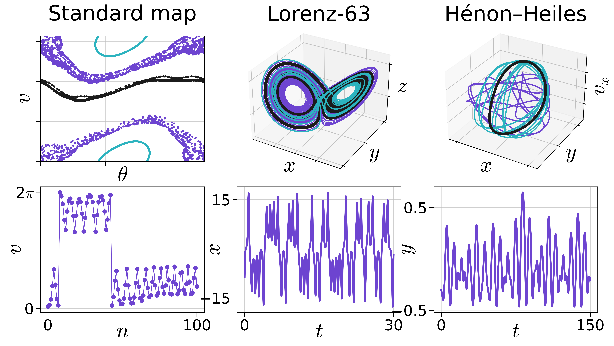

# 非線形力学とは

このシリーズでは，非線形力学の入門をまとめていきます．脳波をはじめ，すくなくともマクロな神経科学の実験法では，たとえば位相の同期解析だとかコネクティビティといった議論が出てきます．非線形力学とは，大雑把に言えば系 (脳) を構成する要素たちがそれぞれ相互に影響を及ぼしあい，時間経過によって変化するといった状況を説明するための物理学の分野です．

非線形力学の考え方，議論，応用...といったことを勉強することは，脳機能計測と解析をやる人にとって無駄ではないはずです．

##　力学系とは
まず初めに，線形とか非線形とかの前に力学系とは何かについて定義を与えます．筆者は個人的に，高校で物理を習った際に「力学」と聞いても，「力の学...？別に自分は壁を押すとかボールを投げるとか，そんなことに興味ないし...」と思っていました．

事実，授業で扱うのはそういった話ばかりで，全く興味をそそられなかった経緯があります．しかしこれはナンセンスで，科学のあらゆる分野に関係するトピックであったということにずっと後になって気付きました．まずはその心を共有しようと思います．

力学系は英語では，**Dynamical system** と言います．力学は **Dynamics**．

なんのことはない，英語を聞くだけで自分の認識の大きな間違いに気付きます．力学は別にボールは投げたら落ちるとかそんな何百年から知られている常識を擦り続ける暇な学問ではなく，ダイナミクスを扱う分野だったのです．

ダイナミクスと言うと聞いたことがある人も多いと思いますが，要は時間発展のことです．**力学系とは，ある規則に従って値が時間発展していく変数(量)の集合のこと**です．もちろん，この規則は確率的だったり，決定論的だったりします．確率的な方はちょっと難しいので，今回は決定論的な力学系についてのみまとめていきます．

また，ある規則，というのはもちろん数式で記述されます．

## 線形と非線形
力学系の意味が確認できたところで，次は線形と非線形の違いについてです．といっても非線形の定義は，線形ではないもの，です．なので線形についてメインで考えます．

系が従う規則が，「係数 $×$ 入出力 (の微分)」の項のみで表すことができる場合を線形な関数と言います．たとえば，入力を $x$, 出力を $y$ とした場合は

$$
y = Ax
$$

と出来るのが線形で，

$$
\begin{align}
y = x^2 \\
y = \log{x}\\
y = e^x + \sin{x}
\end{align}
$$

などは全て非線形な関数です．もう少し正確に見ていくと，ある関数 $f$ が線形であるとは

定義

- 加法性： 任意の $x,y$ に対して，$f(x+y) = f(x) + f(y)$
- 斉次性： 任意の $x$，任意のスカラー $k$ に対して，$f(kx) = kf(x)$

が成り立つということです．

たとえば，$f(x) = 2x$ は $ f(1+2) = 2+4 = f(3)$ で，かつ $3\times f(2) = 12 = f(3\times 2)$ なので，加法性も斉次性も満たす線形な関数ですが，$f(x) = e^x$ などはこれを満たしません．

## 線形力学系と非線形力学系
と，ここまで確認すると，線形力学系と非線形力学系の意味が分かります．線形力学系は線形な規則で時間発展する変数の集合で，非線形力学系は非線形な規則にしたがうものです．

時間発展の仕方は，物理では時間に関する微分方程式で記述されます．線形力学系と非線形力学系の違いは，この微分方程式が線形か非線形か，という問題だとも言い換えられます．

たとえば，バネの運動方程式

$$
m\frac{dt^2}{d^2x} = -kx
$$

は一次の項だけ，つまり非線形な項が出てこないので，線形系です．一方で振り子の運動方程式

$$
m\frac{dt^2}{d^2x} = -k \sin x
$$

は $\sin$ が非線形なので，非線形です．

一般的に，周期運動をするような単純なものでもない限り非線形力学系について解を求めたり議論するのは難しいです．従って多くの場合，基礎教養では線形系や一部の特殊な非線形系ばかりを扱います．

## 非線形力学系と神経科学
なかなか扱いにくい点を置いておけば，非線形力学系では様々な興味深い現象が生じます．これは線形な系では決して見られないことですが，実は自然界にありふれた極めて重要な現象であることも多いです．たとえば，**パターン形成，リズム現象，同期現象，カオス，分岐，自己組織化**といったトピックが代表的です．

### リズム
言うまでもなく，リズムは脳活動を語る上でかかせない概念です．$\alpha, \beta, \gamma$ などの周波数帯域は，周波数になっているようにリズムです．脳波だけでなく fMRI も超低周波のリズム (いわば脳血流オシレーション) として考えることで，同様な議論がされることもあります．またこれを用いることで，「結局 fMRI が見ているのは脳活動のうちどんな成分が反映されているのか」といった議論もなされます．振動子は相互作用しつつも，それぞれの固有周波数を大切にします．これを上手く利用することで，脳は周波数帯域を分けて複数の計算処理を同時に行っているのではないか，という見方が主流です．

### 同期
[ERP](../../Analysis/Methods/erp.html) もそうだし，なにより[位相同期解析](../../Analysis/Methods/PSI.md) なんて名前からしてそのままです．このページの最初に，脳波解析などの背景には非線形力学系の考え方があるといったのはこれに由来します．もちろん，fMRI を使った研究でも同様です．他者間での脳活動「同期」やネットワーク検出の際にも「同期」という言葉が用いられます．ただ脳波に比べ，こちらはやや本来の専門用語の使い方から離れた緩い使われ方が多いようにも思います．

### 分岐
臨界性のモデルを組むときに多用されます．たとえば，急な発作や安静-課題時脳活動の遷移 (相転移) を分岐として解釈する研究や，多安定知覚 ([ルビンの壺](https://ja.wikipedia.org/wiki/%E3%83%AB%E3%83%93%E3%83%B3%E3%81%AE%E5%A3%BA)など) のモデル化などが有名でしょうか．特に Hoph 分岐が良く使われています．また，安定性や分岐という意味では今後やっていくように結合行列があれば計算できるみたいなところもあります．よって，MRI でもわりとやりやすく，実際いろんな試み (Dynamic Causal Modeling, Recurrence Quantification Analysis, dynamic functional connectivity...) がなされています．

### カオス
名前からしてかっこいい．脳波などの時系列に対して Lyapunov exponent や相関次元，フラクタルを計算することで病態や年齢，知能との関連を探るといった試みも盛んです．また，カオスだけでなく安定性やカオス性の評価もよく行われます．簡単なところだと [Spectral Exponent](../../Analysis/Methods/frequency.html#PSD) などがあります．また，特にカオスの淵と呼ばれる秩序だってもカオティックでもない特殊な領域で脳は駆動していると考えるような学説は今でもまぁまぁ強く，自分も2023 年現在はそんな考え方の元に研究を進めています．

### 自己組織化
自己組織化は系が内部相互作用によって自然と秩序だった構造を獲得することです．脳の発達はまさにこれですね．また，ここに非線形項が含まれることによってパターン形成や臨界性といったものが生まれます．また相互作用する振動子が自然と同期ネットワークを生む過程も広く知られ，これは [Kuramoto-model] と呼ばれる有名なモデルです．EEG/MEG の律動は皮質局所回路の自己組織化発振現象だと言えますし，fMRI で見ているような Resting-state network, これが自然と似通った形になるのも，自己組織化の結果と言えるでしょう．最近ではミクロとマクロの中間としてオルガノイド研究が盛んになりつつありますが，あれはまさに自己組織化によって系が形成されていく過程を見れる実験モデルと言えます．

### 次回，線形安定性解析

さて，そんな重要な非線形力学系ですが，先程も触れたように扱いが難しいという難点があります．そこで 1900 年代以降，いくつかの工夫をこらしてどうにか議論を適用する手法が編み出されています．
　
次回は，そんな手法の一つである[線形安定性解析](./1stability.html)について解説します．

## 主なおすすめ文献
- Steven H. Strogatz, [非線形ダイナミクスとカオス](https://amzn.asia/d/a5c49t4), 1994
- George Datseris & Ulrich Parlitz, [Nonlinear Dynamics: A Concise Introduction Interlaced with Code](https://amzn.asia/d/c4zkl1r), 2022
- 桑村 雅隆, [パターン形成と分岐理論―自発的パターン発生の力学系入門―](https://amzn.asia/d/5m93gmX), 2015
- Morris W. Hirsch et al., [力学系入門 ―微分方程式からカオスまで―](https://amzn.asia/d/6k0qMTR), 1974
- 井庭 崇, [複雑系入門―知のフロンティアへの冒険](https://www.nttpub.co.jp/book/detail/4871885607/), 1998
- 林 初男, [脳とカオス](https://amzn.asia/d/5Vm9l8D), 2001
- Gyorgy Buzsaki, [Rhythms of the Brain](https://amzn.asia/d/6tzJvEk), 2006
- 郡 宏, [生物リズムと力学系](https://amzn.asia/d/fjkzTju), 2011
- 蔵本 由紀, 河村 洋史, [同期現象の科学: 位相記述によるアプローチ](https://amzn.asia/d/1osezDu), 2017