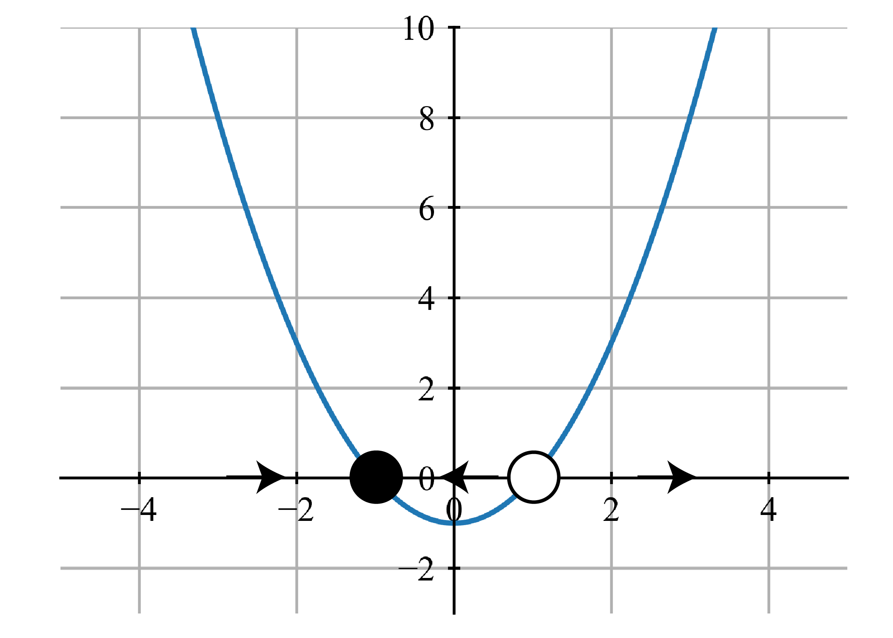

# 線形安定性解析

[前回](./0dynamics.html)，力学系という概念について簡単にまとめました．今回からは，具体的に力学系の理論について触れていきます．

ここで最初に考える力学系の理論とは，「**軌道と安定性という観点から，直接的に微分方程式を解いたりしなくても解の情報を考える方法**」のようなものです．


##　解の軌道
力学系は，系の時間発展の仕方が微分方程式で表されるものでした．この解を求めれば，系の状態が追えるわけですが，解を求めるのはなかなか簡単でもないし，具体的な値というよりも定性的な「どこに向かっていくのか」程度の情報が欲しいこともあります．

そこで用いるのが解の軌道という考え方です．たとえば，振り子の振動についての方程式

$$
\ddot{x} + \frac{g}{L}\sin x = 0
$$

という式について考えます．ちなみにこれは $\dot{x} = y$ として，この式をばらして書くと，

$$
\begin{align}
\dot{x} = y\\
\dot{y} = -\frac{g}{L}\sin x
\end{align}
$$

という二つの式で書ける，非線形の系です．非線形の式なので，この方程式を解くのは結構困難になります．ですがここでは，とりあえずある特定の初期条件に対するこの方程式の解を得る，あるいは得られていたとします．この解は，振り子の位置 $x$ と速度 $y$ の組によって与えられます．

ここで $x$ と $y$ で二次元の平面を考えると，今得られている「ある解」はこの平面内の曲線 (に沿って動く点) として与えられるはずです．位置と速度の変化を表す曲線です．

この曲線のことを，(ある解の) **軌道**と言い，この軌道が描かれる空間のことを**相空間**と言います．今回はある軌道についてだけ考えましたが，任意の初期条件によって別個の軌道が描かれるため，相空間は軌道で埋め尽くされます．

<center></center>

上の図は，振り子の方程式について $L=1$ の時の相空間を plot してみたもので，**相図**と言います．ちなみに，色はベクトルの大きさによって変えています．黄色にいく程，変化が大きいということになります．

相図を見ると色々分かります．たとえばこの問題だと，(少なくともここに描かれている範囲では)

- 全ての軌道は原点 ($x = y = 0$) 周りを回っている
- つまり，周期振動をしている(振り子なので左右に振れ続ける)
- $x$ の絶対値が大きい程，変化は大きい
- $y$ 方向に伸びた楕円軌道を取っている

などでしょうか．力学系の理論では，このように解が時間変化によって空間の中でどのような軌道を描くかに注目します．

今回は先に解をたくさん用意し，それに沿って軌道を描きました．しかし実際には，なかなかこうはいかないし，何よりたくさん解を求めるのは大変な作業です．そこで実用的には，**実際に方程式の解を求めずに軌道を描き，そこから解に関する (先程の箇条書きのような) 情報を取り出す**という逆向きの作業をしたい，というモチベが生まれます．．

## 固定点
### 1次元系
ここからの議論において主役となる，固定点について導入します．たとえば，

$$
\dot{x} = x^2 -1
$$

という $1$ 次元系を考えます．

<center></center>

すると図のような相図が描けます．図の縦軸は $\dot{x}$ なわけですから，横軸に重なっている点では $x$ は変化しないということになります．図では 〇 が置かれている部分です．

これらの，$f(x^*) = 0$ で定義される，流れが沈滞する点のことを**固定点**と言います．あるいは，微分方程式の意味では平衡解なので，単に平衡解，平衡点などと表してある場合もあります．

この固定点ですが，図では黒丸と白丸の二つが描かれています．これらはそれぞれの性質の違いによって書き分けられています．

まず黒丸は，その付近の $x$ (微小摂動$dx$) が吸い寄せられる点です．黒丸 ($x=-1$) の左側では，$\dot{x}$ が正の値を取る，つまり $x$ の値は時間変化に伴って大きくなっていく (右に行く) のに対し，逆に右側の範囲では $\dot{x}$ が負の値を取る，つまり $x$ の値は時間変化に伴って小さくなっていく (左に行く) ことになります．これを**安定**な固定点と言います．

白丸はその逆で，付近の $x$ が全て離れていくかのような挙動を示します．これを**不安定**な固定点と言います．

上図では，この近付いたり離れたりする動きを矢印で表しています．

もっとも，この安定とか不安定というのは微小な摂動に対してのみの議論です．極端な話，$+0.001$ の摂動を与えられた安定固定点は元の黒丸に戻ってきますが，+3されてしまえば不安定固定点をも飛び越えてしまうので，その後は離れていく一方となります．

さて，ここで確認した安定と不安定が，矢印の向きを決めるわけですから，重要な定性的情報の一つとなります．


### 2次元系
1次元の系なんてなんの面白味もないので，固定点の議論を2次元に拡張します．まず，2次元の線形系


$$
\begin{pmatrix}
\dot{x} \\
\dot{y} \\
\end{pmatrix} =
\begin{pmatrix}
a & 0 \\
0 & d \\
\end{pmatrix}
\begin{pmatrix}
x \\
y \\
\end{pmatrix}
$$

を考えてみます．この場合，式を分離すると

$$
\begin{align}
\dot{x} = ax\\
\dot{y} = dy
\end{align}
$$

です．式は分離しているので，それぞれ微分方程式の解を求めてあげると

$$
\begin{align}
\bm{x}(t) = c_1 e^{at}\\
\bm{y}(t) = c_2 e^{dt}
\end{align}
$$


が得られます．これで相図を書こうとすると，$a$ と $d$ の値によって場合分けがなされることが分かります．


<center></center>


これらの相図は全て，中心は固定点になっています．しかし見てわかるように，その近辺での振る舞いには違いがあります．

- 負の値の時には軌道は中心 (固定点) に向かっていき，正の値では遠ざかっていくこと

- $a=d$ の場合，全ての軌道は直線的になること
- $a$ と $d$ の符号が同じ場合，絶対値の小さい方の方向に押し付けられるような軌道が広がること
- $a$ or $d = 0$ の場合，固定点は無数に表れ (直線全体が固定点)，すべての軌道は垂直方向に伸びていくこと
- $a$ と $d$ の符号が逆の場合，片方に対し近付き，片方に対して離れるために双曲型の軌道を描くこと
- $x$ 軸，$y$ 軸を挟んでの対称性があるなど，軸が重要な役割をしていること
  
などが分かります．さて，今回も先に解を求めて相図を描きましたが，以上の議論は解を求めずにも成り立つことが分かるでしょうか．全て $a$ と $d$ の比較によって成り立っていますが，そもそもこの $a,d$ は元の方程式で与えられた係数です．

よって，**方程式を見るだけで，解を求めなくても相図の定性的な情報が読み取れる**ことになります．


## 固有値分解

前節では，方程式からどんな相図が描かれるのかを予想出来るという話をしました．これは一般に成り立つことなのでしょうか？

残念ながら，今回は

$$
\begin{pmatrix}
\dot{x} \\
\dot{y} \\
\end{pmatrix} =
\begin{pmatrix}
a & 0 \\
0 & d \\
\end{pmatrix}
\begin{pmatrix}
x \\
y \\
\end{pmatrix}
$$

という特殊 (非対角成分が $0$) な系の場合の話でした．非対角成分が $0$ で，$a$ と $d$ が独立だったために $x,y$ 軸上で出発した軌道がその軸上に留まるという特殊な状況が成り立っていました．そのため，図の見た目，振る舞いについても議論がしやすかったですが，一般の場合にはこうも行きません．

一般の係数行列

$$
\begin{pmatrix}
\dot{x} \\
\dot{y} \\
\end{pmatrix} =
\begin{pmatrix}
a & b \\
c & d \\
\end{pmatrix}
\begin{pmatrix}
x \\
y \\
\end{pmatrix}
$$


を用いた，一般の系で同じことをするためには，まずは先程の例と類似した直線軌道を求めることが必要です．そこを超えると振る舞いが変わるという，境界線の役割を果たす重要な軌道です．


そこで出てくるのが[固有値分解](../../Math/Basic/linear_algebra.html)です．固有値分解を通して，固有ベクトルという独立なベクトルによって空間を張りなおす作業を行います．

$$
A = \begin{pmatrix}
a & b \\
c & d \\
\end{pmatrix}
$$

の固有値 ($\lambda_1, \lambda_2$)は

$$
\lambda_{1,2} = \frac{\tau \pm \sqrt{\tau ^2 - 4\Delta}}{2}
$$

で求められます．但しここで $\tau = a+d$, $\Delta = ad- bc$ を使いました．$\tau$ は線形代数で言うトレース， $\Delta$ は行列式です．

さらに，求められた固有値から固有ベクトル $\bm{v}_1, \bm{v}_2$ も求められます．固有ベクトルなので，これらのベクトルは線形独立であり，平面全体を張ることが出来ます．

つまり，空間上の任意の点はこれらの線形結合である $x_0 = c_1\bm{v}_1 + c_2\bm{v}_2$ として表せるので， $\bm{x}(t)$ の一般解として

$$
\bm{x}(t) = c_1 e^{\lambda_1 t}\bm{v}_1 + c_2 e^{\lambda_1 t}\bm{v}_2
$$

が得られます．これにより，あとは $\lambda$ と $\bm{v}$ を使って先程の線形独立な例と同じような議論を展開すれば良いです．たとえば，

$$
\begin{pmatrix}
\dot{x} \\
\dot{y} \\
\end{pmatrix} =
\begin{pmatrix}
2 & 3 \\
4 & -1 \\
\end{pmatrix}
\begin{pmatrix}
x \\
y \\
\end{pmatrix}
$$

を考えます．まずは固有値，固有ベクトルを

```python
A = np.array([2,3,4,-1]).reshape(2,2)

np.linalg.eig(A)
```

のように求めると，
```python
(array([ 4.27491722, -3.27491722]),
 array([[ 0.79681209, -0.49436913],
        [ 0.60422718,  0.86925207]]))
```

のような結果が返ってきます．手計算面倒なのでズルしましたが，普通に求められるはずです．この結果より，

$$
\begin{align}
\lambda_1 = 4.27 \\
\lambda_2 = -3.27 \\
\bm{v}_1 = (0.8, 0.6) \\
\bm{v}_2 = (-0.49, 0.87)
\end{align}
$$

と，固有値・固有ベクトルが求められました．（もっと綺麗な例が良かった...）

とりあえず，固有ベクトルを描いてみます．

<center></center>


こうなりました．さらに，それぞれの固有ベクトル方向への拡大率 (スケール) は固有値によって与えられることを思い出すと，

$$
\begin{align}
\lambda_1 = 4.27 \\
\lambda_2 = -3.27 \\
\end{align}
$$

なので，ここに対応する矢印を描き加えて

<center></center>

のようにできます．$\lambda_1$ は正の値なので離れる方向に，$\lambda_2$ は負の値なので固定点に向かって矢印を向けます．また，それぞれの長さは固有値の絶対値によって与えました．

あとは，軸以外の部分についても適当に軌道を充填させていけば相図が (だいたいの精度で) 描けます．$\lambda_1$ 方向に離れ，$\lambda_2$ 方向には寄せられるわけなので，

<center></center>

のような図が描けるはずですね．これは前の図の c と似た挙動ですが，斜めになっているように見えます．この，ずれた軸が先程求めた固有ベクトル $\bm{v}$ の方向です．上の図はてきとうに手書きしてみたものですが，正解はどうでしょうか．

数値計算で plot させてみると...

<center></center>


こうなりました．先程求めた，固有値と固有ベクトルによって手書きした図でも，だいたい同じになることが確認できると思います．(微分方程式を解いてもいないのに！)

## 線形安定性解析
さて，次はもう少し踏み込んで，**どういう力学系の時にはどういう相図が描けるか**を考えてみます．これを解析する操作を**線形安定性解析**と言います．

以前の非対角成分が元々 0 だった行列

$$
\begin{align}
\bm{x}(t) = c_1 e^{at}\\
\bm{y}(t) = c_2 e^{dt}
\end{align}
$$

の相図を場合分けした

<center></center>

を思い出せば分かりますが，どんなパターンになるのかは指数の肩にのる数を比較することで分かります．

一般の係数行列の場合の一般解は

$$
\bm{x}(t) = c_1 e^{\lambda_1 t}\bm{v}_1 + c_2 e^{\lambda_1 t}\bm{v}_2
$$

となるので，固有値を比較するわけです．

まず，固定点の安定性について考えましょう．安定性とは，その近傍の値が時間発展によって集まってくるか，離れていくかでした．先程も作図の際に確認したように，この性質は固有値の符号によって決まります．

つまり

$$
\begin{align}
\lambda_1 <0 \land \lambda_2 < 0  \Longrightarrow \text{安定} \\
\lambda_1 > 0  \lor \lambda_2 >0 \Longrightarrow \text{不安定}
\end{align}
$$

が言えます．今考えているのは2次元の系なので，そのどちらの方向に対しても固有値が負の値であり，集まってくる場合が安定，どちらか片方でも離れていくなら不安定，ということです．

では，直線的な軌道の集まりなのか双曲型なのか，あるいはどちらかに潰れた形になるのか，ぐるぐると回るのかといったことはどうやって見分けるのでしょうか．

大体の結論は上図の通りで，固有値の符号だけでなく絶対値も考えることで分かります．結局，$\lambda_1, \lambda_2$の値がどうなるかを見ればいいだけです．

ここで，固有値は

$$
\lambda_{1,2} = \frac{\tau \pm \sqrt{\tau ^2 - 4\Delta}}{2}
$$

で与えられることを思い出すと，$\lambda$ の取る値について考えるという問題は $\tau, \Delta$ の値について考える問題に帰着させることができます．順番に見ていきましょう．

### $\tau^2 - 4\Delta$
まず，$\tau^2 - 4\Delta$ の値の正負は固有値が実数になるか複素数になるかを決定します．固有値が複素数になる場合というのは，

$$
\bm{x}(t) = c_1 e^{\lambda_1 t}\bm{v}_1 + c_2 e^{\lambda_1 t}\bm{v}_2
$$

の $\lambda$が$(\alpha + i\omega)$ になるということです．$e^{\alpha + i\omega}$ はオイラーの公式を適用することが出来るので，固有値が複素数の場合は，**$\bm{x}(t)$ は $e^{\alpha t}\cos \omega t$ と $e^{\alpha t}\sin \omega t$ の線形結合**であるということになります．

つまり，系の発展は固定点を中心とした回転になります．ただ，固有値次第でその回転が固定点に向かって落ちていくのか，離れていくのか，あるいは閉じた円になっているのかといった分岐が生じます．これは安定性をみれば分かります．

### $\Delta$
次に，$\Delta$ について考えます．$\Delta$ は行列式 ($ad-bc$) ですが，特性方程式を

$$
(\lambda - \lambda_1)(\lambda - \lambda_2)
$$

という形であらわすことで，$\Delta = \lambda_1\lambda_2$ とも表せます．固有値の積なので，この正負は固有値の符号が一致しているかどうかの判定に使えます．つまり $\Delta >0$ なら，どちらも正 (安定) か，どちらも負か (不安定) になります．

$\Delta = 0$ の場合，少なくとも一つの固有値が $0$ になるので，固定点は無数に存在することになります．これは後で載せる図を見ればわかります．

$\Delta <0$ の場合は，ある方向に対しては固定点に対し集まり，ある方向に対しては離れる挙動を示すことになります．

### $\tau$
最後に，$\tau$ について考えます．$\tau$ も特性方程式から，$\lambda_1 + \lambda_2$ と表せます．この正負によって，安定性の判別がつきます．

$$
\begin{align}
\lambda_1 <0 \land \lambda_2 < 0  \Longrightarrow \text{安定} \\
\lambda_1 > 0  \lor \lambda_2 >0 \Longrightarrow \text{不安定}
\end{align}
$$

であることを思い出すと，$\tau$ が正の場合，固有値のうちすくなくとも $1$ つは正の値を取るので不安定，逆に $\tau$ が負の場合，固有値は全て負の値であるため，安定ということになります．（ただしこれは，$\Delta > 0$ の場合です．$\Delta<0$ の場合にはそもそも固有値の符号が違うので，固有ベクトルごとに安定性が違います．ちなみに，この場合も固定点は不安定であるとします）

文字で見るとよく分かりませんが，以上の議論を図にしてみると，以下のようになります．

<center></center>


## 固定点の分類

さて，様々な固定点 $\bm{x^*}$ の種類が分かったところで，それぞれの性質の確認と，命名を行っていきます．

まず，先程の図
<center></center>
から分かることをまとめます．

$τ$ 軸を挟んで右 ($τ >0$) 側では固定点は不安定 (②⑤⑦) になり，その逆では安定 (①③⑥) になります．

また，$\Delta$ の値が $0$ より小さいと双曲型っぽい振る舞い (⑧) になり，$\Delta=0$ の境界では直線的な軌道が無数に描かれます (⑥⑦)．

最後に，$\tau^2 - 4\Delta$ です．これによって描かれる曲線の外側は潰れたような相図 (③⑤)，内側は回転になります (①②④)．そのうち，$τ=0$ の場合は閉軌道を描きます．

もっとも，これらの性質については線形安定性解析の説明の際に行いました．もう少し詳細に見ていきます．

### ノード
③および⑤はそれぞれ**安定ノード**，**不安定ノード**と呼ばれます．これらは，固有値が実数で，かつその符号が同じ状態です．よって，$2$ つの固有方向 (今は2次元で考えているため) に対してどちらも吸い寄せられるか，逆に遠ざかっていきます．

この際，固有値の絶対値の違いによってそれぞれの固有方向に対する速さが生まれます．よって，たとえば安定ノードであればより遅い (絶対値が小さい) 方向に対して叩きつけられるかのようにして固定点に近付きます．

たとえば，

$$
\begin{pmatrix}
\dot{x} \\
\dot{y} \\
\end{pmatrix} =
\begin{pmatrix}
-3 & -2 \\
-3 & -5 \\
\end{pmatrix}
\begin{pmatrix}
x \\
y \\
\end{pmatrix}
$$

という系の相図を考えます．

この例では，固有値を計算すると

> array([-1.35424869, -6.64575131])

です．まず，どちらも負の実数なので固定点は安定ノードですね．また，1つ目の固有値に対応する固有ベクトルを求めてみると，右肩下がりのベクトルです．こちらの方が固有値の絶対値が小さいので，結果的にこの軸に対して叩きつけるかのように軌道が集まってきています．

数値計算で微分方程式を解いてplotした相図の答えを見てみると
<center></center>
です．合っていますね．


ちなみに，先程の一覧にはありませんでしたが二つの固有値が等しい場合
> array([-3,-3])

には，
<center></center>

のような相図になります．直感的ですね．各方向に対する速さが等しいためにこのようになります．この場合を特に，**対称ノード**あるいは**スターノード**と言います．

### サドル
固有値の符号が異なり，固定点から遠ざかる固有方向と近付く固有方向が混在している状況 (⑧) では，この固定点は**サドル点**とよばれます．双曲型っぽいやつです．

たとえば，
$$
\begin{pmatrix}
\dot{x} \\
\dot{y} \\
\end{pmatrix} =
\begin{pmatrix}
3 & -4 \\
-4 & 2 \\
\end{pmatrix}
\begin{pmatrix}
x \\
y \\
\end{pmatrix}
$$

という系について考えます．
固有値を求めると，

> array([ 6.53112887, -1.53112887])

です．固有値の符号が異なるので，安定な方向と不安定な方向が存在します．

相図を描いてみると，
<center></center>

こうなります．

また，この時のそれぞれの固有方向上の集合については，
- **安定多様体:** $t\rightarrow\infty$ で $\bm{x}(t)  = \bm{x^*}$ となる初期条件 $\bm{x_0}$ の集合
- **不安定多様体:** $t\rightarrow -\infty$ で $\bm{x}(t)  = \bm{x^*}$ となる初期条件 $\bm{x_0}$ の集合

と言います．サドル点の場合，多様体以外の典型的な軌道は $t \rightarrow \infty$ で不安定多様体に漸近していきます．この例の場合，右肩下がり方向が不安定多様体なので，そちらに漸近するような振る舞いを見せます．

$t\rightarrow\infty$ で固定点に近付くのは安定多様体上の特殊な集合のみですので，サドル点は不安定な固定点として扱います．

### スパイラル・センター
$Δ >0$ で，$\tau^2 - 4\Delta <0$ の場合，すなわち得られる固有値が複素共役の場合，軌道は回転になります．

固有値が複素数の場合は，**$\bm{x}(t)$ は $e^{\alpha t}\cos \omega t$ と $e^{\alpha t}\sin \omega t$ の線形結合**であることを思い出しましょう．

#### スパイラル
**スパイラル**とは，回転しつつ固定点に近付いていくか，あるいは離れていくかといった振る舞いをする場合の固定点を指します．前者 (①) が安定なスパイラル，後者 (②) が不安定なスパイラルです．

回転の方向は反時計回りとも限らず，固有値の組み合わせ次第になります．

たとえば，

$$
\begin{pmatrix}
\dot{x} \\
\dot{y} \\
\end{pmatrix} =
\begin{pmatrix}
-3 & -4 \\
2 & 2 \\
\end{pmatrix}
\begin{pmatrix}
x \\
y \\
\end{pmatrix}
$$

という系は，固有値を求めると

> array([-0.5+1.32287566j, -0.5-1.32287566j])

と，複素数になります．実部を見ると負になっているので，これは安定なスパイラルです．

相図をだしてみると，

<center></center>

となります．

#### センター
固有値が複素数になる中でも特に， $\tau = 0$ の場合 (④) は，全ての解が周期的 (周期$T = 2\pi/\omega$) になります．

この場合の固定点を，**センター**といいます．

<center></center>

### ボーダーラインについて

以上の議論を整理すると，固定点の分類図はこのようになります．

<center></center>

ここで，孤立していない固定点とは
<center></center>

などのことです．これは固有値の少なくとも1つが0になったために生じます．その結果，ある方向にのみ時間発展で軌道が進むため，このような図になります．

縮退したノードとは，たとえば

$$
\begin{pmatrix}
\dot{x} \\
\dot{y} \\
\end{pmatrix} =
\begin{pmatrix}
3 & 5 \\
0 & 3 \\
\end{pmatrix}
\begin{pmatrix}
x \\
y \\
\end{pmatrix}
$$

などの系で生じる，固有ベクトルが 1 つしかない場合を指します．相図は
<center></center>

です．横方向にひかれた固有方向があり，そこに対してのみ変化があります．勢いあまって固定点より先に行き，今度は反対向きの力で反発するかのような，ちょっと面白い見た目になります．

また，固有ベクトルは 2 つ (独立した2つ) だが固有値が等しい場合は，既に確認したようにスターノードになります．

さて，改めて固定点の分類図
<center></center>

を見ると，**大部分の固定点はサドル点，ノード，スパイラルのどれか**であることが分かります．


一方で，**センター，スターノード，縮退ノード，孤立していない固定点はそれぞれがボーダーライン的な役割**をしていることが見て取れます．図ではこのボーダーラインを色線で表しています．

これはすなわち，同じような方程式でも係数行列の値がほんのちょっと変わっただけで，軌道がガラリと変わる境界線であるということになります．

これらの境界線については，今後の非線形系の議論で重要になるので，理解しておきましょう．


次回は，以上の議論 (線形安定性解析) を[非線形系に適用する](./2stability.md)ことを考えていきます．