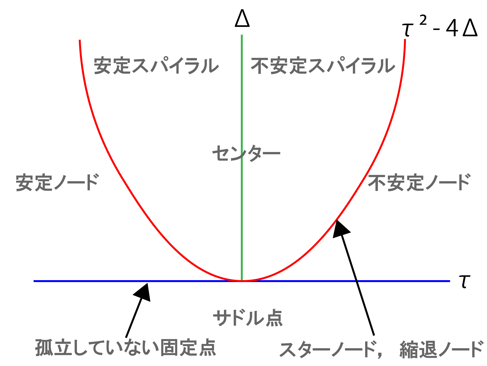
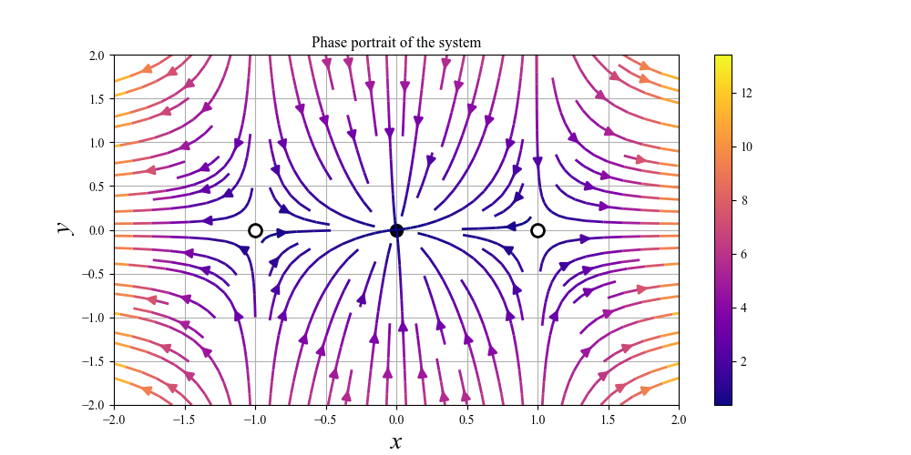

# 非線形系の安定性解析

[前回](./1stability.html)では線形系での安定性解析の方法と，固定点の分類などについて学習しました．今回は，この議論を非線形系に適用することを考えていきます．

## 線形系での安定性解析復習

はじめに，復習です．前回確認した，任意の線形系

$$
\begin{pmatrix}
\dot{x} \\
\dot{y} \\
\end{pmatrix} =
\begin{pmatrix}
a & b \\
c & d \\
\end{pmatrix}
\begin{pmatrix}
x \\
y \\
\end{pmatrix}
$$

の安定性解析の手順は，
<div class="box" markdown="1">

  1. 固定点を求める
  2. 固定点周りで固有値，固有ベクトルを求める
  3. 安定性，固定点の種類について情報を得る
  (4). 相図を描く
</div>

でした．固有値と固定点の種類の対応については

<center></center>

こうでしたね．描かれる相図は

<center></center>

です．

ただしこれは，あくまで系が線形であった場合のことです．非線形な場合，このように単純な図は描けず，非線形な項の影響で局所局所で異なる振る舞いを示すようになります．

例としては，以下の相図です．

<center></center>

見るからに複雑ですね．前回やったような，固有ベクトルを2本引いて，その値のバランスからなんとなく周りの曲線軌道を引く，なんてやりかたは通用しなそうです．

ですが，まぁ上の図をちゃんと出せているように非線形の場合でも相図を描き，安定性を議論することは可能です．今回はその方法を確認します．


## 線形化
さて，結論から言うと非線形系を非線形のままに安定性解析はできません．そのため，線形化という作業を行う必要があります．

考え方としては，非線形系は複雑ではあるけれども，固定点周りのごく狭い範囲では線形系に近似ができるのではないか，という発想に基づきます．この発想の厳密な話は **Heartman-Grobman の定理**によりますが，ここでは細かいことは省きます．

たとえば，先程の相図についても固定点 $(0,0)$ 周りを拡大すると

<center></center>

となります．これは線形な場合の**センター**に似ています．このように，固定点周りで固有ベクトルを求めた場合，あまり離れすぎない (微小範囲) 場合には線形な議論が近似的に成り立ちそうなことが分かります．

そこで，**「(各固定点周りの)微小範囲での線形近似」** を行う，という方針が立ちます．

まずは，系を

$$
\begin{align}
\dot{x} = f(x,y)\\
\dot{y} = g(x,y)
\end{align}
$$

として固定点を $(x^*, y^*)$ で表します．さらに，固定点からの微小な摂動を

$$
\begin{align}
dx = x - x^*\\
dy = y-y^*
\end{align}
$$

で表すとします．ここで，$dx, dy$ がどのように変化するか (成長するか減衰するか) を調べます．まずはこれらの微分方程式を考えます．これで安定性の議論ができます．まずは $\dot{dx}$ について考えます．すると $x^* = 0$ なので

$$
\dot{dx} = \dot{x} = f(x^* + dx, y^* + dy)
$$

となります．方程式が出てきました．次は，これを線形近似するためにテイラー展開を使います．[テイラー展開](../../Math/Analysis/fourier.html#指数関数と三角関数のマクローリン展開)について復習すると

<div class="box tip" markdown="1">
<div class="title">(1 実変数) 関数 $f$ のテイラー展開</div>

点 $a$ を含む実数の閉区間上で無限階微分可能な関数 $f$ が与えられたとき，

$$
f(x) = \Sigma^\infty_{n=0} \frac{f^{(n)}(a)}{n!}(x-a)^{n}
$$

の形に関数を展開する操作
</div>

です．今回は $(x-a)$ の部分，つまり点 $a$ からの微小ずれを $dx$ とします．すると $x-a = dx$ なので $x = a+dx$ とも置き換えられます．さらに今考えているのは固定点周りでの話なので，$a=x^*$ とすると，1変数 $($x$)$ についてだけについては

$$
f(x^* +dx) = f(x^*) + f'(x^*)dx + \frac{1}{2!}f''(x^*)dx^2 + \dots
$$

のようになります．ただし，今回はこれの多変数バージョン

<div class="box tip" markdown="1">
<div class="title">多変数関数 $f$ のテイラー展開</div>

$$
f(x+a, y+b) = \Sigma^\infty_{n=0}\frac{1}{n!}(a\frac{\partial}{\partial x} + b\frac{\partial}{\partial y})^n f(x,y)
$$
</div>
を使います．今考えている問題に適用すると

$$
\begin{align}
\dot{dx} = \dot{x} = f(x^* + dx, y^* + dy)\\
= f(x^*, y^*) + (dx\frac{\partial}{\partial x} + dy\frac{\partial}{\partial y}) f(x^*,y^*) + \dots
\end{align}
$$

となります．今は**線形近似**をしていますし，$dx$ は十分に小さい ($dx <<1$) としているので，**2次以上の項は無視**します．また，第1項の $f(x^*,y^*)$ は定義より $0$ なので，結局

$$
\dot{dx} = (dx\frac{\partial}{\partial x} + dy\frac{\partial}{\partial y}) f(x^*,y^*)
$$

と求まります．

$\dot{dy}$ についても同様にして，

$$
\dot{dy} = (dx\frac{\partial}{\partial x} + dy\frac{\partial}{\partial y}) g(x^*,y^*)
$$

と求めることができます．よって，摂動 ($dx, dy$)は

$$
\begin{pmatrix}
\dot{dx} \\
\dot{dy} \\
\end{pmatrix} =
\begin{pmatrix}
\frac{\partial f}{\partial x} & \frac{\partial f}{\partial y} \\
\frac{\partial g}{\partial x} & \frac{\partial g}{\partial y} \\
\end{pmatrix}_{(x^*,y^*)}
\begin{pmatrix}
dx \\
dy \\
\end{pmatrix}
$$

に従って発展することが分かります．この時の係数行列

$$
A =\begin{pmatrix}
\frac{\partial f}{\partial x} & \frac{\partial f}{\partial y} \\
\frac{\partial g}{\partial x} & \frac{\partial g}{\partial y} \\
\end{pmatrix}_{(x^*,y^*)}
$$

は，点 ($x^*, y^*$) での**ヤコビ行列**とよばれる行列です．さて，この一連の流れを通して，

非線形系を線形化した線形系

$$
\begin{pmatrix}
\dot{dx} \\
\dot{dy} \\
\end{pmatrix} =
A
\begin{pmatrix}
dx \\
dy \\
\end{pmatrix}
$$

が得られました．これ以降は，前回確認した線形系の安定性解析を適用することが出来ます．
<center></center>

これです．
まとめると，非線形系の安定性解析の手順は，

<div class="box" markdown="1">
<div class="title">　非線形系の安定性解析</div>

  1. 固定点を求める
  2. 各固定点についてヤコビ行列を求める
  3. ヤコビ行列の固有値，固有ベクトルを求める
  4. 安定性，固定点の種類について情報を得る
  (5). 相図を描く
</div>

となります．ヤコビ行列を求めるところだけが線形系の場合との違いですね．

## 例題


さっそく，例題を解いてみます．

#### 例1
**系 $\dot{x} = -2x + 2x^3$，$\dot{y} = -3y$ の固定点をすべて求め，線形化を用いてそれらを分類せよ．また，対応する相図を作図せよ**

はじめに，固定点を求めます．

$$
\begin{align}
-2x + 2x^3 =0 \\
-3y = 0
\end{align}
$$

を解くと，固定点は $(-1,0), (0,0), (1,0)$ と分かります．

次に，それぞれの点においてヤコビ行列

$$
A =\begin{pmatrix}
\frac{\partial f}{\partial x} & \frac{\partial f}{\partial y} \\
\frac{\partial g}{\partial x} & \frac{\partial g}{\partial y} \\
\end{pmatrix}=
\begin{pmatrix}
-2+6x^2 & 0\\
0 & -3
\end{pmatrix}
$$

を求めます．固定点 (-1,0) のもとでは，$\tau = (4-3) = 1, \Delta = -12$ となるので，**固定点 (-1, 0) はサドル点**です．同様に， **固定点(1,0) もサドル点**になります．

また，$\lambda_1$ (この場合x軸) が正の値，$\lambda_2$ (この場合y軸) が負の値なので，どちらも不安定多様体は $x$ 軸，安定多様体は $y$ 軸に平行な直線 (線形化が可能な範囲内では) になることも分かります．

次に固定点 $(0,0)$ ですが，こちらは $\tau = -2-3 = -5, \Delta = 6$ となるので，安定なスパイラルか安定なノードです．面倒ですが $\tau^2-4\Delta$ を計算してあげると，$25-24=1$ ですね．よって**固定点 $(0,0)$ は安定ノード**と分かります．

あとは，これらに矛盾しないような相図を描いてみましょう．

<center></center>

こんな感じになるはずです．

では，数値計算による答えを見てみましょう．

<center></center>

合っていますね．数値計算だとベクトルの長さまで簡単に再現できるのが強いですね...


####　例2
**系 $\dot{x} = -2y + 2y^3$，$\dot{y} = -3x$ の固定点をすべて求め，線形化を用いてそれらを分類せよ．また，対応する相図を作図せよ**

固定点を求めます．

$$
\begin{align}
-2y + 2y^3 =0 \\
-3x = 0
\end{align}
$$

を解くと，固定点は $(0,0), (0,-1), (0,1)$ と分かります．

次に，それぞれの点においてヤコビ行列

$$
A =\begin{pmatrix}
\frac{\partial f}{\partial x} & \frac{\partial f}{\partial y} \\
\frac{\partial g}{\partial x} & \frac{\partial g}{\partial y} \\
\end{pmatrix}=
\begin{pmatrix}
0 & -2+6y^2\\
-3 & 0
\end{pmatrix}
$$

を求めます．さらにそこでの固有値も求めます．固定点 $(0,0)$ のもとで固有値，固有ベクトルを求めると，

$\lambda_{1,2} = \pm 2.45$ ，$\bm{v}_1 = (0.63,-0.77), \bm{v}_2 = (0.63, 0.77)$と求まります．

従って $\tau = 0, \Delta = -6$ となるので，**固定点 $(0, 0)$ はサドル点**です．右肩下がり方向には不安定，右肩上がり方向には安定多様体があります．

次に固定点 $(0,1)$ について考えます．同様に固有値，固有ベクトルを求めると，

$$
A =\begin{pmatrix}
\frac{\partial f}{\partial x} & \frac{\partial f}{\partial y} \\
\frac{\partial g}{\partial x} & \frac{\partial g}{\partial y} \\
\end{pmatrix}=
\begin{pmatrix}
0 & 4\\
-3 & 0
\end{pmatrix}
$$

なので，$\lambda_{1,2} =  0 \pm 3.46i$ ，$\bm{v}_1 = (0.76,0.65i), \bm{v}_2 = (0.76, -0.65i)$

と，複素数が出てきます．固有値の実部が0なので，**固定点 $(0,1)$ はセンター**になります．同様に**固定点 $(0,-1)$ もセンター**になります．

問題は，回転の方向がどちら (時計回りか反時計回り) になるかです．これは固有値とかから読み取る方法がちょっと分からなかったのですが，系を見ればすぐ分かります．

$$
\begin{align}
\dot{x} = -2y + 2y^3\\
\dot{y} = -3x
\end{align}
$$

です．求めたセンターの近くの $(x,y)$ の組を与えた時にどう動くかを考えます． センター $(0,1)$ であれば，たとえば $(0,1.5)$ です．式に代入すると，

$$
\begin{align}
\dot{x} = -3 + 2\times 1.5^3 = 3.75 >0\\
\dot{y} = 0
\end{align}
$$

です．$\dot{x}$ が正 ($\dot{y}$ は0)，ということは右向きに力が働いています．センターのすぐ上で右向きに力が働くということは，**時計回り**ですね．

同様に $(0,-1.5)$　も見ると，

$$
\begin{align}
\dot{x} = 3 +2(-1.5)^3 = -3.75 < 0\\
\dot{y} = 0
\end{align}
$$

左向きに力が向いています．センターの下で左向きの力ということは，やはり**時計回り**です．以上の情報を元に相図を描いてみます．

<center></center>

この絵のポイントは，上下のセンターたちが中央のサドルに引き寄せられるために若干ゆがむことと，固定点達から離れたところでは上下のセンターがつながって大きな円を描こうとすること，しかしそれもやはりサドルの影響で歪んで...という構造をとることです．


では，数値計算による答えを見てみましょう．

<center></center>

大体いいですね．

あと2問置いておきます．実際に解いてみてください(いい感じの数字と見た目になる組み合わせ探すの結構大変...)

答え合わせ用の自作プログラムも置いておきます．
(Python です...意気揚々と Julia 環境構築したはいいけど，よく分からんくて結局Python使っています...すみません...)

<details markdown="1">
<summary>正解の相図を出すプログラム(clickで展開)</summary>

```python
# 微分方程式を定義
xdot = "y + y**2"
ydot = "x -x**3"
```

```python
import sympy
import numpy as np
import matplotlib.pyplot as plt

x =sympy.Symbol('x')
y = sympy.Symbol('y')

u = eval(xdot)
v = eval(ydot)

# Find fixed points
points = np.array([])
fixed = sympy.solve([u, v])
for i in range(len(fixed)):
    value = np.array([fixed[i][x],fixed[i][y]])
    points = np.append(points, value)

fixed_points = points.reshape(len(points)//2, 2)

# define Jacobian matrix
Jacobian = sympy.Matrix([[u.diff(x), u.diff(y)], [v.diff(x), v.diff(y)]])


plt.figure(figsize = (10,5))

for point in fixed_points:
    # find eigenvalues around each fixed point
    Jacobian_point = Jacobian.subs([(x,point[0]), (y,point[1])])
    eigenvalues = Jacobian_point.eigenvals()
    eigen= list(eigenvalues.keys())
    #if np.all(re(list(eigenvalues.keys())) < 0):
    for i in range(len(eigen)):
    #if ((re(eigen[0]) < 0) and (re(eigen[1]) < 0)) or ((eigen[0] + eigen[1] ==0) and (eigen[0] * eigen[1] >0)): # Stable fixed points or center
        if (re(eigen[i]) < 0): # Stable fixed points or center
            plt.plot(point[0], point[1], 'ko', markersize=10)  # black circle
        else:
            plt.plot(point[0], point[1], 'wo', mec='k', markersize=10, markeredgewidth=2) # Unstable fixed points
    eigen_sum = np.sum(eigen)
    eigen_multipl = np.prod(eigen)
    if (eigen_sum ==0) and (eigen_multipl >0):
        plt.plot(point[0], point[1], 'ko', markersize=10)  # black circle

y, x= np.mgrid[-2:2:20j,-2:2:20j]

# define the system of ODEs
u = eval(xdot)
v = eval(ydot)

# plot the vector field
strm = plt.streamplot(x, y, u, v,color=np.sqrt(u**2+v**2),cmap='plasma', linewidth=2, arrowsize = 1.5)

# plot the nullclines
#plt.contour(x, y, u, levels=[0], linewidths=2, colors='r')
#plt.contour(x, y, v, levels=[0], linewidths=2, colors='b')

plt.title('Phase portrait of the system')
plt.colorbar(strm.lines)
plt.xlabel("x", fontsize=20, style="italic")
plt.ylabel("y", fontsize=20, style="italic")
plt.grid(True)
plt.savefig("../figures/answer.png")
```

</details>


#### 例3
**系 $\dot{x} = 2x - x^2 -xy$，$\dot{y} = 3y-y^2-xy$ の固定点をすべて求め，線形化を用いてそれらを分類せよ．また，対応する相図を作図せよ**

<details markdown="1">
<summary>解答</summary>

固定点 $(0,0)$：$\lambda_1,2 = 2,3$，$\Rightarrow$ 不安定ノード

固定点 $(0,3)$：$\lambda_1,2 = -1,-3$，$\Rightarrow$ 安定ノード

固定点 $(2,0)$：$\lambda_1,2 = -2,1$，$\Rightarrow$ サドル

<center></center>

なんかおもしろ三角
</details>

#### 例4
**系 $\dot{x} = y + y^2$，$\dot{y} = x-x^3$ の固定点をすべて求め，線形化を用いてそれらを分類せよ．また，対応する相図を作図せよ**

<details markdown="1">
<summary>解答</summary>

固定点 $(-1,-1)$：$\lambda_1,2 = \pm 1.4$，$\Rightarrow$ サドル

固定点 $(-1,0)$：$\lambda_1,2 = \pm 1.4i$，$\Rightarrow$ センター(時計回り)

固定点 $(0,-1)$：$\lambda_1,2 = \pm i$，$\Rightarrow$ センター (反時計回り)

固定点 $(0,0)$：$\lambda_1,2 = \pm 1$，$\Rightarrow$ サドル

固定点 $(1,-1)$：$\lambda_1,2 = \pm 1.4$，$\Rightarrow$ サドル

固定点 $(1,0)$：$\lambda_1,2 = \pm 1.4i$，$\Rightarrow$ センター (時計回り)

<center></center>

きもかわいい
</details>

## n 次元化
以上の議論は $2$ 次元の場合ですが，これを $n$ 次元に拡張します．やることは一緒で，固有値と固有ベクトルを求め，固有値から安定性について議論します．

ただしその判断基準は固有値 2 個ではなく n 個なので，

<div class="box" markdown="1">
<div class="title">固有値の安定性</div>

$$
\begin{align}
\forall_i, Re(\lambda_i) < 0 \Rightarrow 安定 \\
\exists_i, Re(\lambda_i) >0 \Rightarrow 不安定
\end{align}
$$
</div>

となります．ここで，$\lambda$ の実部を取り出している理由は，場合によっては固有値が複素数になることもあるからです．しかしその場合でも，安定かどうかに影響するのは結局軸方向での拡大率なので，実部だけ見るということになります．

3次元以上になると相図を描くのが難しくなりますが，とはいえ議論は同じです．固有ベクトルと固有値を比較することで，これまで通りの議論が可能です．

次回，**リミットサイクル**や**分岐**などといった本格的な非線形力学系のトピックに踏み込みます(時期未定)