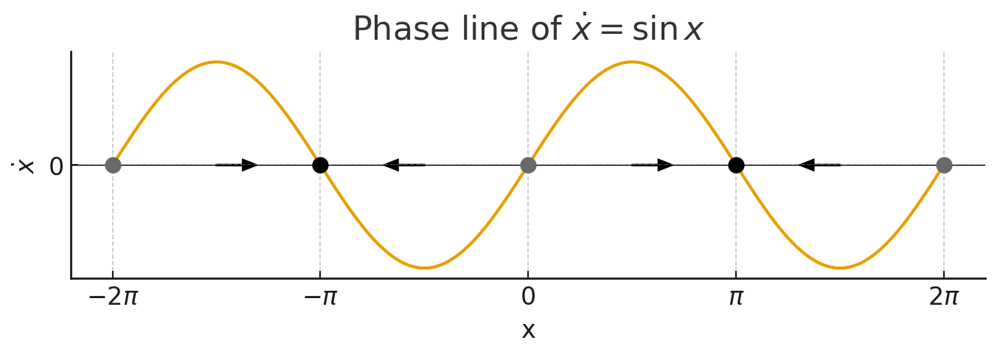

# 勉強会資料： Strogatz, Section 2
この資料は身内勉強会で Steven H. Strogatz, [非線形ダイナミクスとカオス](https://amzn.asia/d/a5c49t4), 1994 の第 2 章を担当した際のまとめ用です．いずれ他ページに吸収されて消えます．

## 用語定義
はじめに前回 (すなわち 1 章) に導入された諸概念を確認する．

### 非線形ダイナミクス (非線形力学) 系
本書のタイトルであり，特定の学問分野を指す複合的理論語であるため以下に分割し，改めて定義する．

#### 非線形
明らかに，線形でないことを意味する．よってここでは線形を定義する．

<div class="box" markdown="1">
<div class="title">定義</div>

写像 $f$ が線形であるとは，
- 加法性： 任意の $x,y$ に対して，$f(x+y) = f(x) + f(y)$
- 斉次性： 任意の $x$，任意のスカラー $k$ に対して，$f(kx) = kf(x)$

の 2 つの性質が満たされることによって定義される．
</div>

従って，これらが満たされない写像 (関数，変換，作用素，射) は非線形である．自然界のほとんどの事象は無数の変数が複雑に相互作用する非線形の問題であるが，一般に非線形の問題は扱うことが難しい．しかし後に見る線形化などの操作によって線形な問題として扱うことはできる．そのためセンス良く線形問題に切り取ったり落とし込んだりするのが 19 世紀までの物理学の歴史であった．

#### ダイナミクス (動力学)
物体の運動やそれにはたらく力，相互作用を記述する旧来的なイメージの力学 (mechanics) とは異なる点に注意．どちらも日本語では力学があてられるが，ここで扱うのは dynamics であり，歴史的に分化した別の語である．この点を意識し，動力学と表すことも多い．平衡系の静的な運動 (静止，等速直線運動など) を扱う静力学 (statics) と対比される，**非平衡状態の動的な運動を扱う力学**である．背景より，元は物理的実態を持つものの運動の記述であったが，定式化が進んだ現在では次に示す力学系とみなせる諸問題に適用される形となった．いわば，**変化を扱う分野，すなわち時間発展する系を扱う分野**である．

#### 力学系 (dynamical system)
なんらかの**一定の規則に従って状態が時間変化するシステム (系)，あるいはその系を記述するための数学的なモデル**のこと．状態の変化に影響を与える数個の要素を変数とし，要素間の相互作用を微分方程式 (時間発展 $D$ が連続の場合) または差分方程式 ($D$ が離散の場合) で記述することでモデル化する．

<div class="box tips" markdown="1">
<div class="title">注1: 系</div>
系とは，**自然界の構造を考察の対象として注目している部分**とそれ以外とした際の前者を指す．後者は外界である．一般に，外界は系に比べて非常に大きく，系は外界から影響を受けても (受けなくても良い) その逆は無いと設定する．高校で習う熱力学の場合，問題の対象とされている箱などが系で，外界として熱浴や実験者が想定される．外界との間で物質の移動を許す系は開放系，許さないのが閉鎖系，エネルギーの移動も許さないと孤立系...と，系に課す仮定によって異なる呼ばれ方，異なる制限法則が成り立つ．たとえば孤立系ではエネルギー保存則，閉鎖系では質量保存則といった具合である．

このように，科学は系 ($S$) と外界 ($E$)，外界から系への作用 ($A: E \to S$)，系の時間発展 ($D$) の仮定に何を置くかで大別することが可能である (多分．)．

</div>


凡例：Det=決定論，Stoch=確率，Lin=線形，NL=非線形，Cont=連続，Disc=離散，Grad=勾配系。

| 分野                  | 系 $S$     | 外界 $E$  | 作用 $A: E\to S$     | 時間発展 $D$                       | 備考                  |
| ------------------- | --------- | ------- | ------------------ | ------------------------------ | ------------------- |
| 古典力学（剛体）            | 位置・運動量    | 外力・拘束   | $+F(t)$            | $\dot x=f(x)+B F$              | Det, NL, Cont       |
| 流体力学                | 速度場・密度場   | 境界・圧力差  | 境界条件・源項            | Navier–Stokes                  | Det/Stoch, NL, Cont |
| 平衡熱力学               | 状態量       | 温度・圧力浴  | 準静的操作              | 勾配流は暗黙                         | 静的理論・ポテンシャル         |
| 非平衡熱力学              | 保存量場      | 温度勾配・駆動 | 流束・反応              | 反応拡散／Langevin                  | Stoch, NL, Cont     |
| 統計力学（Langevin）      | 粒子座標      | 熱浴      | $\gamma\dot x+\xi$ | $\dot x=-\nabla V+\xi$         | Grad, Stoch, Cont   |
| 量子力学（閉鎖）            | 密度行列／波動関数 | なし      | なし                 | $\dot\rho=-i[H,\rho]$          | Det, Lin, Cont      |
| 量子オープン系             | $\rho$    | 環境浴     | 散逸・雑音              | Lindblad 方程式                   | Stoch/Det, Lin      |
| 化学反応動力学             | 濃度ベクトル    | 注入・排出   | 流入出・触媒             | 質量作用則 ODE                      | Det, NL, Cont       |
| 生態系（LV）             | 種個体数      | 資源・狩猟   | キャパ・捕食             | Lotka–Volterra                 | Det, NL, Cont       |
| 疫学（SIR）             | $S,I,R$   | 接触率・介入  | 介入 $u(t)$          | 区分 ODE／ABM                     | Det/Stoch, NL       |
| 神経単一（LIF）           | 膜電位       | 入力電流・雑音 | $I(t)+\xi$         | $\tau\dot V=-V+RI$ + 発火        | Stoch/Det, NL       |
| 神経集団（Wilson–Cowan）  | 集団発火率     | 刺激・雑音   | $I(t)+\xi$         | $\dot r=f(r,W)+I$              | Det, NL, Cont       |
| 脳ダイナミクス（Jansen–Rit） | 集団状態      | 感覚入力    | 伝達・雑音              | 神経質量モデル                        | Stoch/Det, NL       |
| 制御工学（LTI）           | 状態        | 参照・外乱   | $u=Kx+r$           | $\dot x=Ax+Bu+w$               | Det/Stoch, Lin      |
| 強化学習（MDP）           | 信念／状態     | 報酬・環境遷移 | $u=\pi(a\|s)$      | $s_{t+1}\sim P(\cdot\|s,a)$    | Stoch, Disc         |
| 機械学習（SGD）           | 重み        | データ分布   | 勾配・正則化             | $w_{t+1}=w_t-\eta\nabla L+\xi$ | Grad, Disc          |
| 経済（DSGE）            | マクロ変数     | 政策・ショック | 税率・金利              | 差分方程式                          | Stoch, NL, Disc     |
| 地球科学（地殻変動）          | ひずみ場      | 境界駆動    | プレート牽引             | 弾塑性 PDE                        | Det, NL             |
| 言語変化モデル             | 語彙分布      | 社会接触    | 伝播確率               | レプリケータ／ABM                     | Stoch, NL           |
| 計算精神医学              | 潜在信念      | 刺激・報酬   | 観測更新               | POMDP／予測符号化                    | Stoch, Disc/Cont    |


<div class="box tips" markdown="1">
<div class="title">注2: モデル</div>
自然科学におけるモデルとは，自然界のうち特定の部分を，説明，可視化，理解するという目的の下で不都合のない程度に単純化された近似的なコピーである．つまり，**自然界 (相互連結された諸々の原始的事実の総体) と同じ論理構造を保有する数理的・幾何学的像**である．ウィトゲンシュタインは論理哲学論考で言語の有意味な命題全ては世界の諸事態の像であるとし，言語 (命題) と世界とを平行に考えつつその構造を解明した．諸事態の像とならない命題は語りえず，無意味である．この構造に従うと，良いモデルの構築は本質的に自然科学そのものと言える．モデル化の手段は多岐にわたるが，力学系はダイナミクスの数理モデル化を行う．

</div>

### 微分方程式
まず，高校以前に学んできた微分方程式ではない **「方程式」とは，未知である変数を含む式であり，与えられた式 (方程式) を満たす数を見つける** ために解くものである．対する **微分方程式は，未知である関数とその導関数の関係式であり，それを満たす関数を見つける** ための関数方程式の一種である．つまり，微分すると与式になるような関数を探す操作である．物理法則を記述する多くの基礎方程式は時間あるいは空間の微分方程式である．行われる微分の形式によって常微分/偏微分方程式や線形/非線形微分方程式と分けられる．

常微分方程式は一般に以下の形式で表される．ただしここで $x_1,\dots,x_n$ は独立して扱われる変数の数 (図示した際に x,y,z... 座標の軸となるもの) である．

$$
\begin{align}
x_1^{\prime} = f_1(x_1,\dots,x_n)\\
\vdots\\
x_n^{\prime} = f_n(x_1,\dots,x_n)
\end{align}
$$

本書が効果を発揮するのは，一般に解くのが困難になる**非線形常微分方程式 (非線形項を含む形の 1 変数 (時間 $t$) 方程式によって記述される) について，微分方程式を解かずに未知関数の振る舞いに関する定性的 (少しの定量的要素も) な情報を得たい**場合である．具体的には，相空間上での振る舞いについて幾何学的な理解を得る．

<div class="box tips" markdown="1">
<div class="title">注3: 微分の記法</div>

$$
\begin{align}
y^{\prime}=\frac{dy}{dx}\\
y^{\prime \prime} = \frac{d^2 y}{dx^2}\\
\dot{y} = \frac{dy}{dt}\\
\ddot{y} = \frac{d^2y}{dt^2}
\end{align}
$$
</div>


### 自律系と非自律系
時間発展の方程式 $f$ が時間 $t$ を陽に含まない微分方程式系は自律系，含むものは非自律系である．

### 相空間 (phase space) と軌道 (trajectory)
力学系の理論においては，相空間 (分野や文脈によっては状態空間や位相空間とも言う) は対象系の取る状態全てが内包される抽象的な空間である．相空間の次元数は与えられた微分方程式 (の変数) の数に等しい．軌道は，ある初期条件に対して定められた時間発展のルールを適用した際に描かれる点の集合である．したがって解の軌道は相空間内に閉じ込められ，空間全体を完全に埋め尽くす．

たとえば振り子の時間発展は揺れ角 ($\theta$) と角速度 ($\omega$) で記述できる (2 次元相空間内の解の軌道)．この系は，明らかに原点を初期値とした軌道はその場にとどまり，それ以外の場合は振動する (減衰は考えない理想状態とする)．

<center></center>

方程式を解く (初期値によらず，系の発展を解き明かす) ことが難しくとも，上記のように軌道を描くことさえできれば様々な情報が見て取れる．たとえば上記からは，

- 周期運動である．
- つまり初期で描いた軌道から離れることはない (減衰もせず，振りが大きくなることもない)．
- 速度が急激に上がるところと下がるところがある (周期とはいえ楕円であり，円ではない)．
- 特異な初期値 (静止) スタートの場合のみ，この軌道に含まれない

などが分かる．これは振り子の例なので当然であるが，方程式を解かずとも上記のような性質を読み取れるのは多くの問題設定において極めて強力である．たとえば自然界における草食動物と肉食動物の個体数，マッチングアプリの利用者数 (左記と同型の問題であるが)，経済，RLC 回路，脳のダイナミクスなどによく用いられる．脳活動解析の場あで，状態空間モデルという名前でよく用いられている．一般に相空間は多様体であるため，トポロジカルな性質を適用することができる利点もある．


## 2.0. はじめに
本章は 1 次のごく単純な問題のみ，つまり自律系 ($\dot{x} = f(x)$) のみ扱う．仮に $f$ が時間依存の場合，これは $\dot{x} = f(x,t)$ と 2 次の問題となるため本章の範囲ではない．

## 2.1. 幾何学的な考察法
ここでは，微分方程式系をベクトル場として解釈するテクニックを導入する．そのために，まずベクトル場を導入する．

### スカラー場 (scalar field)
おそらく物理やっていなかった人にとっての「場」，あるいは座標系．定義された空間内の点には数を割り当てる．入力が $n$ 次元に対し，1 次元 (スカラー)
を出力する関数．

$$
f: \mathbb{R}^n \to \mathbb{R}
$$

たとえば部屋 (3 次元空間) の温度分布．この場合，各点 (物理的座標位置) には温度という値がある．$3\to1$ 次元へ飛ばされたため，強い弱い，高い低いの議論のみ可能．「$x$ 方向に27度」などとはならない．

### ベクトル場 (vector field)
各点にはスカラーではなくベクトルを割り当てる．従って $n$ 次元の場合，$n$ 次元を返す関数．

$$
f: \mathbb{R}^n \to \mathbb{R}^n
$$

たとえば風や磁場の分布．ある地点での強さだけでなく，向きが定義される．「$x$ 方向に風速 ○○」と言える．よってスカラー場の勾配を取ることでベクトル場を作ることが可能．温度の場合，温度勾配分布になる．磁場や電場もベクトル場である．

画像は別ページ [線形安定性解析](./1stability.html) より．様々なベクトル場の図．詳しくは 5 章．
<center></center>


### 微分方程式の幾何学的解釈
まず，以下の非線形微分方程式を考える．

$$
\dot{x} = \sin x, \quad x(0) = x_0
$$

まず変数は $x$ のみ，1次の微分のみ，ただし $\sin x$ が含まれるのでこれは非線形の常微分方程式である．この系について，以下の問に答えたい．

#### (1) $x_0 = \pi/4$ のとき，すべての $t>0$ に対する解 $x(t)$ の定性的特徴を述べよ．特に $\lim_{t\to \infty} x(t)$ の挙動を説明せよ．
#### (2) 一般の初期条件 $x_0 \in \mathbb{R}$ に対して，$\lim_{t\to \infty} x(t)$ の挙動を説明せよ．

普通に考えると，微分方程式を解けば良いわけだが色々と面倒である．教科書ではまず，微分が $\dot{x}$, つまり時間 $t$ であるため変数分離をし，積分公式などによって解を得ている．

我々の目的は解を得ないで上記問題に答えることなので，今回は解法は省く．

さて，ここでほしい情報は結局，ある $x_0$ から動き出した $x$ がどのような軌道を描くのかという情報である．そこで $x$ を仮想的な粒子の位置と考え， $\dot{x}$ をその速度とする．1次の微分方程式であったので，この 2 変数を直交軸として空間を貼ると，$\dot{x}=\sin x$ はこの直線上のベクトル場となる．図示すると以下のようになる．

<center></center>

<details markdown="1">
<summary>Python code</summary>

```python
import numpy as np
import matplotlib.pyplot as plt

# x range
x = np.linspace(-2*np.pi, 2*np.pi, 400)
dx = np.sin(x)

# figure
fig, ax = plt.subplots(figsize=(8,2))
ax.axhline(0, color="k", lw=0.5)

# plot sin(x)
ax.plot(x, dx, label=r"$\dot{x} = \sin x$")

# fixed points
fixed_points = np.arange(-2*np.pi, 2.5*np.pi, np.pi)
for fp in fixed_points:
    if np.cos(fp) < 0:  # stable
        ax.plot(fp, 0, 'ko', markersize=8)
    else:  # unstable
        ax.plot(fp, 0, 'o', markerfacecolor='dimgray', markeredgecolor='black', markersize=8)

# arrows for vector field on axis, placed midway between fixed points
intervals = list(zip(fixed_points[:-1], fixed_points[1:]))
for left, right in intervals:
    mid = (left + right) / 2
    direction = np.sign(np.sin(mid))
    if direction > 0:
        ax.arrow(mid, 0, 0.4, 0, head_width=0.1, head_length=0.2, fc='k', ec='k')
    elif direction < 0:
        ax.arrow(mid, 0, -0.4, 0, head_width=0.1, head_length=0.2, fc='k', ec='k')

# axis settings
ax.set_xticks(np.arange(-2*np.pi, 2.5*np.pi, np.pi))
ax.set_xticklabels([r"$-2\pi$", r"$-\pi$", "0", r"$\pi$", r"$2\pi$"])
ax.set_yticks([0])
ax.set_xlabel("x")
ax.set_ylabel(r"$\dot{x}$")
ax.set_title("Phase line of $\\dot{x} = \\sin x$")
plt.show()
```

</details>

ただし，$x$ 軸上の矢印はそれぞれの位置で対応するベクトルの向きを表している．正の速度なら進み，負の速度なら後退する．より実践的には向きだけでなく大きさも区別するべきだが，この場合は明らかなため省略した (縦軸方向に小さい時は速度が低い，つまり矢印も短くなる)．

重要なのは $\dot{x}=0$ の各点，すなわち $x \equiv 0\mod \pi$ の区別である．これらの点は微分方程式の平衡解 (そこからスタートするとずっとそこに留まる) に対応しており，力学系，幾何学の言葉では**固定点 (fixed point)**という．

固定点の振る舞いを観察するために周辺の矢印を見ると，両側から挟まれる点と離れていく点の 2 種類があることが分かる．黒丸で表したようにその付近の $x$ (微小摂動 $dx$) が吸い寄せられる $\pi$ などの固定点 (ベクトル場での流れが引き込まれる) は，**安定固定点・アトラクター・シンク**などと称される．逆に灰色の流れが離れていくような固定点を**不安定固定点・リペラー・ソース**などと呼ぶ．

以降，固定点はその安定性に関わらず $f(x^\*)$ と示す．
$x^\*$ を求めるには，$\dot{x}=0$，つまり $f(x^\*)=0$ を解けば良い．

## 2.2-2.4. 線形安定性解析

### 固定点の安定性
固定点が安定か不安定か，すなわち矢印の向きは重要な定性的情報の一つである．しかし $f(x^\*)=0$ を解くだけでは区別がつかない．たとえば先の振り子の例では，解は $k\pi, \forall k\in \mathbb{Z}$ であるが，どれが安定かは分からない．そこでここでは，安定性についてもう少し細かく考えることで，図を描く前から情報を得ることを目指す．

改めて先程の図

<center></center>

を考えると，与えられた微分方程式の形によらず相図においては $\dot{x}$ が正の値を取る時は右に，つまり $x$ の値は時間変化に伴って大きくなっていくのに対し，$\dot{x}$ が負の値を取る間は $x$ の値は時間変化に伴って小さくなっていくことが分かる．つまり **固定点での傾き $f'(x^\*)$ が負の場合，固定点は安定である**ことがわかる．**逆に正の傾きであれば固定点は不安定**である．

#### 数学的説明
この問題は， $x^\*$ に対して小さな摂動 $\eta$ を与えた際，$\eta(t)$ が成長するか減衰するかの議論であり，その従う微分方程式を考えれば良い．$x^\*$ が定数であることから，

$$
\dot{\eta} = \frac{d(x-x^*)}{dt} = \dot{x} = f(x^* + \eta)
$$

である．ここで[テイラー展開](../../Math/Analysis/fourier.html)を用いると

$$
f(x^*+\eta) = f(x^*) + \eta f'(x^*) + \mathcal{O} (\eta^2)
$$

が得られる．固定点なので $f(x^\*)=0$ で，$f'(x^\*)\neq 0$ なら $\mathcal{O}\eta^2$ は無視できるので，結局

$$
\dot{\eta} \approx \eta f'(x^*)
$$

と書ける．$\eta$ についての線型方程式になるので，この操作を **$x^\*$ のまわりの線形化**と呼ぶ．この式は明らかに，摂動 $\eta(t)$ が$f'(x^\*)>0$ なら指数関数的に成長し，逆なら減衰することを意味する．ただし，もし $f'(x^\*)=0$ の場合，2次の項が支配項になるのでそちらが安定性を決める．が一般に言えることは無くなる．この例は[例題](#例題)で触れる．より一般の議論は議論が多次元に拡張された際，**ハートマン・グロブマンの定理**で与えられる．

また同時に，摂動の成長/減衰速度は $f'(x^\*)$ の大きさに比例することも分かる．この値が大きい程，摂動は急速な成長や減衰を示す．よってその逆数 $1/\|f'(x^\*)\|$ は時間スケールになり，特に傾きが負の場合には安定固定点へ引き込まれる時間を表す．

<div class="box tip" markdown="1">
<div class="title">(1 実変数) 関数 $f$ のテイラー展開</div>

点 $a$ を含む実数の閉区間上で無限階微分可能な関数 $f$ が与えられたとき，

$$
f(x) = \Sigma^\infty_{n=0} \frac{f^{(n)}(a)}{n!}(x-a)^{n}
$$

の形に関数を展開する操作
</div>

### 大域安定，局所安定
もっとも，安定や不安定というのが必ず成り立つのは十分に小さい摂動 (横方向のズレ) に対してのみである．先の例でも，$+0.001\pi$ の摂動を与えられた安定固定点は元に戻るが，$+1.001\pi$ されてしまえば不安定固定点をも飛び越えてしまうので，その後は離れていく．一般に，2 つ以上の固定点を持つ場合には安定性の議論は十分に狭い範囲 (他の固定点までの範囲) でのみ成り立つ．

相空間内の全ての初期状態から開始した (つまり，あらゆる摂動に対し) 軌道が近付く唯一の安定固定点を**大域的に安定**と言い，そうでない**安定固定点は局所的に安定**という．振り子の例は複数の固定点が存在するため，ここまでの議論を踏まえると固定点 $\forall k\in \mathbb{Z}, 2k\pi$ は局所的な不安定，$(2k-1)\pi$ は局所的な安定固定点ということが言える．

## 例題
### 2.2.1. $\dot{x} = x^2-1$ のすべての固定点を求め，それらの安定性を分類せよ．

<details markdown="1">
<summary>解法</summary>

まず，$x^2-1 = 0$ を解き，$x^\*=\pm 1$ を得る．相図を描くと以下のようになる．従って $x^\*=-1$ は局所安定， $x^\*=1$ は局所不安定固定点である．一応，微分すると $f'(x) = 2x$ であることからも同様の結論が導ける．つまり $2x^\*$ に$\pm 1$を代入なので符号がそのまま反映される．$\dot{x}$ 軸を挟んで対称なことが図を描かずともわかる．

<center></center>
 
</details>

A. 固定点は $x^\*=-1$ (安定)，および $x^\*=1$ (不安定) である．

### 2.2.2. 電気回路の問題．そちらの前提知識が確認できないため省略．

### 2.2.3. $\dot{x}=x-\cos x$ に対応する相図を描き，すべての固定点の安定性を決定せよ．

<details markdown="1">
<summary>解法</summary>

相図は教科書の通り．$y=x$, $y=\cos x$ を別に描く方法が使える．もちろん普通に相図を描くのでも良く，その場合は以下のようになるらしい．

<center></center>

ともかく，固定点は明らかに $x^\*=\cos x^\*$ であり唯一の解である．また $f'(x) = 1+\sin x$ なので，$f'(x^\*)>0$ は大域不安定な固定点である．つまり全ての点はここから離れる．

<details markdown="1">
<summary>Python code</summary>

```python
import numpy as np
import matplotlib.pyplot as plt
from mpmath import findroot, cos, sin

# define f and derivative
f = lambda x: x - np.cos(x)
fp = float(findroot(lambda x: x - cos(x), 0.7))  # Dottie number

# x range
x = np.linspace(-4, 4, 800)
dx = f(x)

# figure
fig, ax = plt.subplots(figsize=(8,2.4))
ax.axhline(0, color="k", lw=0.6)
ax.plot(x, dx, label=r"$\dot{x}=x-\cos x$")

# fixed point (unstable -> gray fill + black edge)
ax.plot(fp, 0, 'o', markerfacecolor='dimgray', markeredgecolor='black', markersize=9)
ax.text(fp, max(dx)*0.12, fr"$x^\ast\approx{fp:.6f}$", ha='center', va='bottom')

# vector field arrows on axis: choose positions in two intervals
left_positions  = np.linspace(-3.5, fp-0.2, 5)
right_positions = np.linspace(fp+0.2, 3.5, 5)

for pos in left_positions:
    ax.arrow(pos, 0, -0.5, 0, head_width=0.12, head_length=0.2, fc='k', ec='k', length_includes_head=True)
for pos in right_positions:
    ax.arrow(pos, 0,  0.5, 0, head_width=0.12, head_length=0.2, fc='k', ec='k', length_includes_head=True)

# axes
ax.set_xlim(-4,4)
ax.set_xticks(np.arange(-4,5,1))
ax.set_yticks([0])
ax.set_xlabel("x")
ax.set_ylabel(r"$\dot{x}$")
ax.set_title("Phase line and fixed point for $\\dot{x}=x-\\cos x$")
ax.legend(loc="upper left")
plt.show()

print(f"Fixed point x* ≈ {fp:.12f}")
print(f"Stability derivative f'(x*) = 1 + sin(x*) ≈ {1+float(sin(fp)):.6f}")

```

</details>

</details>

A. 固定点は不安定な $x^\*=\cos x^\*$ のみである．

### 2.4.1. 線形安定性解析を用いて $\dot{x} = \sin x$ の固定点の安定性を決定せよ

<details markdown="1">
<summary>解法</summary>

まず固定点 $x^\*$ は $\sin x=0$，つまり $k\pi, \forall k \in \mathbb{Z}$ である．またその安定性は

$$
f'(x^*) = \cos k \pi = {
\begin{aligned}
1 \quad if k\equiv 0 \\
-1 \quad if k\equiv 1
\end{aligned}
 } (\mod 2)
$$

より，

</details>

A. 固定点は $k\pi, \forall k \in \mathbb{Z}$ であり，$k$ が偶数なら不安定，奇数なら安定である．

### 2.4.2. ロジスティック方程式の固定点を線形安定性解析を用いて分類し，それぞれの場合について特徴的な時間スケールを求めよ

<details markdown="1">
<summary>解法</summary>

ロジスティック方程式とは個体数 $N$ の時間発展を $r$ (内的自然増加率) と $K$ (環境収容力)のバランスで説明するモデルであり，以下の微分方程式で表される．

$$
\dot{N} = rN(1-\frac{N}{K})
$$

まず固定点を求める ($rN(1-\frac{N}{K} = 0$ を解く) と，$N^\*=0, K$ である．また $f'(N) = r-\frac{2rN}{K}$ である．$N$ に $N^\*$ を代入して符号を見ることで (r, -r)，安定性が求められる．またどちらについても特徴的な時間スケールは $\frac{1}{\|f'(N^\*)=r,-r\|}$ より

</details>

A. $N^\*=0$ は不安定， $N^\*=K$ は安定．時間スケールはどちらも $1/r$ である．

### 2.4.3. $f'(x^\*)=0$ の時，固定点の安定性について何が言えるのか？

<details markdown="1">
<summary>発想</summary>

$f'(x^\*) =0$ ということは, 固定点の左右それぞれについて，$\x{dot}$ が正，負，あるいはゼロのいずれであるかによって振る舞いが変わる．たとえば

<center></center>

<details markdown="1">
<summary>Python code</summary>

```python
import numpy as np
import matplotlib.pyplot as plt

def plot_phase(ax, f, title, xlim=(-1.5,1.5)):
    x = np.linspace(xlim[0], xlim[1], 800)
    dx = f(x)
    ax.axhline(0, lw=0.6, color='k')
    ax.plot(x, dx, color='C0')
    # fixed point at 0
    ax.plot(0, 0, 'o', markerfacecolor='none', markeredgecolor='black', markersize=6)
    # arrows along axis
    if np.any(dx != 0):
        left_positions = np.linspace(xlim[0]+0.1, -0.2, 4)
        right_positions = np.linspace(0.2, xlim[1]-0.1, 4)
        for pos in np.concatenate([left_positions, right_positions]):
            d = np.sign(f(pos))
            if d > 0:
                ax.arrow(pos, 0, 0.3, 0, head_width=0.06, head_length=0.12, length_includes_head=True, color='k')
            elif d < 0:
                ax.arrow(pos, 0, -0.3, 0, head_width=0.06, head_length=0.12, length_includes_head=True, color='k')
    ax.set_xlim(*xlim)
    ax.set_xticks([-1,0,1])
    ax.set_yticks([0])
    ax.set_xlabel("x")
    ax.set_ylabel(r"$\dot{x}$")
    ax.set_title(title, fontsize=10)

fig, axes = plt.subplots(2,2, figsize=(10,6))

plot_phase(axes[0,0], lambda x: -x**3, r"$\dot{x}=-x^3$ (stable)")
plot_phase(axes[0,1], lambda x:  x**3, r"$\dot{x}=x^3$ (unstable)")
plot_phase(axes[1,0], lambda x:  x**2, r"$\dot{x}=x^2$ (semi-stable)")
plot_phase(axes[1,1], lambda x: 0*x,   r"$\dot{x}=0$ (neutral)")

plt.tight_layout()
plt.show()

```
</details>

のようになる．それぞれ
- 左上：$\dot{x} = - x^3$ → 安定
- 右上：$\dot{x} = x^3$ → 不安定
- 左上：$\dot{x} = - x^3$ → 半安定 (half-stable, 左から安定，右から不安定)
- 左上：$\dot{x} = - x^3$ → 中立 (すべての点が固定点)

とも呼ばれる．今後分岐などを学ぶ際によく出てくる．なので結局，
</details>

A. 何も言えない．
