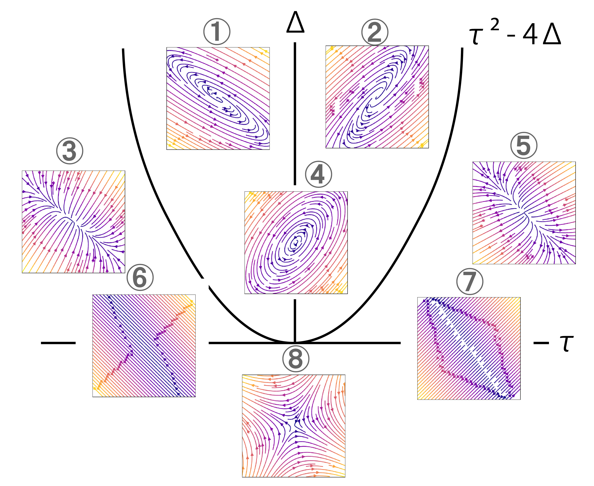
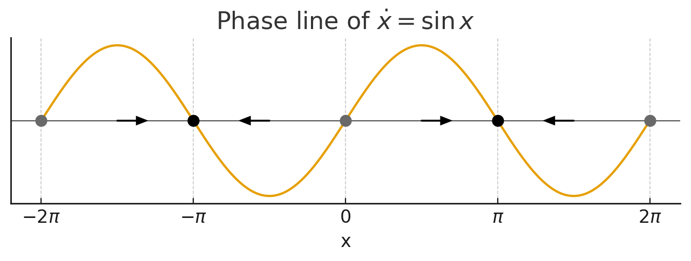

# 勉強会資料： Strogatz, Section 2
この資料は身内勉強会で Steven H. Strogatz, [非線形ダイナミクスとカオス](https://amzn.asia/d/a5c49t4), 1994 の第 2 章を担当した際のまとめ用です．いずれ他ページに吸収されて消えます．

## 用語定義
はじめに前回 (すなわち 1 章) に導入された諸概念を確認する．

### 非線形ダイナミクス (非線形力学) 系
本書のタイトルであり，特定の学問分野を指す複合的理論語であるため以下に分割し，改めて定義する．

#### 非線形
明らかに，線形でないことを意味する．よってここでは線形を定義する．

写像 $f$ が線形であるとは，

定義

- 加法性： 任意の $x,y$ に対して，$f(x+y) = f(x) + f(y)$
- 斉次性： 任意の $x$，任意のスカラー $k$ に対して，$f(kx) = kf(x)$

の 2 つの性質が満たされることによって定義される．従って，これらが満たされない写像 (関数，変換，作用素，射) は非線形である．自然界のほとんどの事象は無数の変数が複雑に相互作用する非線形の問題であるが，一般に非線形の問題は扱うことが難しい．そのためセンス良く線形な問題に切り取ったり落とし込んだりするのが 19 世紀までの物理学の歴史である．

#### ダイナミクス (動力学)
物体の運動やそれにはたらく力，相互作用を記述する旧来的なイメージの力学 (mechanics) とは異なる点に注意．どちらも日本語では力学があてられるが，こちらは dynamics であり，歴史的に分化した別の語である．この点を意識し，動力学と表すことも多い．平衡系の静的な運動 (静止，等速直線運動など) を扱う静力学 (statics) と対比される，非平衡状態を扱う力学である．背景より，元は物理的実態を持つものの運動の記述であったが，定式化が進んだ現在では次の力学系とみなせる諸問題に適用される形となった．いわば，変化を扱う分野，すなわち時間発展する系を扱う分野である．

#### 力学系 (dynamical system)
なんらかの一定の規則に従って状態が時間変化するシステム (系)，あるいはその系を記述するための数学的なモデルのこと．状態の変化に影響を与える数個の要素を変数とし，要素間の相互作用を微分方程式 (時間発展 $D$ が連続の場合) または差分方程式 ($D$ が離散の場合) で記述することでモデル化する．

注1: 系

系とは，自然界の構造を考察の対象として注目している部分とそれ以外とした際の前者を指す．後者は外界である．一般に，外界は系に比べて非常に大きく，系は外界から影響を受けても (受けなくても良い) その逆は無いと設定する．高校で習う熱力学の場合，問題の対象とされているのが系で外界として熱浴や実験者が想定される．外界との間で物質の移動を許す系は開放系，許さないのが閉鎖系，エネルギーの移動も許さないと孤立系...と，系に課す仮定によって異なる呼ばれ方，異なる制限法則が成り立つ．たとえば孤立系ではエネルギー保存則，閉鎖系では質量保存則といった具合である．

このように，科学は系 ($S$) と外界 ($E$)，外界から系への作用 ($A: E \to S$)，系の時間発展 ($D$) の仮定に何を置くかで大別することが可能である (多分．)．

凡例：Det=決定論，Stoch=確率，Lin=線形，NL=非線形，Cont=連続，Disc=離散，Grad=勾配系。

| 分野                  | 系 $S$     | 外界 $E$  | 作用 $A: E\to S$     | 時間発展 $D$                       | 備考                  |
| ------------------- | --------- | ------- | ------------------ | ------------------------------ | ------------------- |
| 古典力学（剛体）            | 位置・運動量    | 外力・拘束   | $+F(t)$            | $\dot x=f(x)+B F$              | Det, NL, Cont       |
| 流体力学                | 速度場・密度場   | 境界・圧力差  | 境界条件・源項            | Navier–Stokes                  | Det/Stoch, NL, Cont |
| 平衡熱力学               | 状態量       | 温度・圧力浴  | 準静的操作              | 勾配流は暗黙                         | 静的理論・ポテンシャル         |
| 非平衡熱力学              | 保存量場      | 温度勾配・駆動 | 流束・反応              | 反応拡散／Langevin                  | Stoch, NL, Cont     |
| 統計力学（Langevin）      | 粒子座標      | 熱浴      | $\gamma\dot x+\xi$ | $\dot x=-\nabla V+\xi$         | Grad, Stoch, Cont   |
| 量子力学（閉鎖）            | 密度行列／波動関数 | なし      | なし                 | $\dot\rho=-i[H,\rho]$          | Det, Lin, Cont      |
| 量子オープン系             | $\rho$    | 環境浴     | 散逸・雑音              | Lindblad 方程式                   | Stoch/Det, Lin      |
| 化学反応動力学             | 濃度ベクトル    | 注入・排出   | 流入出・触媒             | 質量作用則 ODE                      | Det, NL, Cont       |
| 生態系（LV）             | 種個体数      | 資源・狩猟   | キャパ・捕食             | Lotka–Volterra                 | Det, NL, Cont       |
| 疫学（SIR）             | $S,I,R$   | 接触率・介入  | 介入 $u(t)$          | 区分 ODE／ABM                     | Det/Stoch, NL       |
| 神経単一（LIF）           | 膜電位       | 入力電流・雑音 | $I(t)+\xi$         | $\tau\dot V=-V+RI$ + 発火        | Stoch/Det, NL       |
| 神経集団（Wilson–Cowan）  | 集団発火率     | 刺激・雑音   | $I(t)+\xi$         | $\dot r=f(r,W)+I$              | Det, NL, Cont       |
| 脳ダイナミクス（Jansen–Rit） | 集団状態      | 感覚入力    | 伝達・雑音              | 神経質量モデル                        | Stoch/Det, NL       |
| 制御工学（LTI）           | 状態        | 参照・外乱   | $u=Kx+r$           | $\dot x=Ax+Bu+w$               | Det/Stoch, Lin      |
| 強化学習（MDP）           | 信念／状態     | 報酬・環境遷移 | $u=\pi(a\|s)$      | $s_{t+1}\sim P(\cdot\|s,a)$    | Stoch, Disc         |
| 機械学習（SGD）           | 重み        | データ分布   | 勾配・正則化             | $w_{t+1}=w_t-\eta\nabla L+\xi$ | Grad, Disc          |
| 経済（DSGE）            | マクロ変数     | 政策・ショック | 税率・金利              | 差分方程式                          | Stoch, NL, Disc     |
| 地球科学（地殻変動）          | ひずみ場      | 境界駆動    | プレート牽引             | 弾塑性 PDE                        | Det, NL             |
| 言語変化モデル             | 語彙分布      | 社会接触    | 伝播確率               | レプリケータ／ABM                     | Stoch, NL           |
| 計算精神医学              | 潜在信念      | 刺激・報酬   | 観測更新               | POMDP／予測符号化                    | Stoch, Disc/Cont    |

注2: モデル

自然科学におけるモデルとは，自然界のうち特定の部分を，説明，可視化，理解するという目的の下で不都合のない程度に単純化された近似的なコピーである．つまり，自然界 (相互連結された諸々の原始的事実の総体) と同じ論理構造を保有する数理的・幾何学的像である．たとえばウィトゲンシュタインは論理哲学論考で言語の有意味な命題全ては世界の諸事態の像であるとし，言語 (命題) と世界とを平行に考えつつその構造を解明した．諸事態の像とならない命題は語りえず，無意味である．この構造に従うと，モデルの構築は本質的に自然科学そのものと言える．モデル化の手段は多岐にわたるが，とりわけ数理モデル化が好まれ，力学系の目的もこれにあたる．

### 微分方程式
まず，微分方程式ではない方程式とは未知数である変数を含む式であり，与えられた式 (方程式) を満たす数を見つけるために解くものである．対する微分方程式は，未知である関数を含む式である関数方程式の一種であり，未知関数とその導関数の関係式として与えられ，それを満たす関数を見つけるための式である．つまり，微分すると与式になるような関数を探す操作．物理法則を記述する多くの基礎方程式は時間あるいは空間の微分方程式である．行われる微分の形式によって常微分/偏微分方程式や線形/非線形微分方程式と分けられる．

常微分方程式は一般に以下の形式で表される．ただしここで $x_1,\dots,x_n$ は独立して扱われる変数の数 (図示した際に x,y,z... 座標の軸となるもの) である．

$$
\begin{align}
x_1^{\prime} = f_1(x_1,\dots,x_n)\\
\vdots
x_1^{\prime} = f_n(x_1,\dots,x_n)
\end{align}
$$

本書が効果を発揮するのは，一般に解くのが困難になる非線形常微分方程式 (非線形項を含む形の 1 変数 (時間 $t$) 方程式によって記述される) について，微分方程式を解かずに未知関数の振る舞いに関する定性的 (少しの定量的要素も) な情報を得たい場合である．具体的には，相空間上での振る舞いについて幾何学的な理解を得る．

注3: 微分の記法

$$
\begin{align}
y^{\prime}=\frac{dy}{dx}\\
y^{\prime \prime} = \frac{d^2 y}{dx^2}\\
\dot{y} = \frac{dy}{dt}\\
\ddot{y} = \frac{d^2y}{dt^2}
\end{align}
$$

### 自律系と非自律系
時間発展の方程式 $f$ が時間 $t$ を陽に含まない微分方程式系は自律系，含むものは非自律系である．

### 相空間 (phase space) と軌道 (trajectory)
力学系の理論においては，相空間・状態空間 (・位相空間) は対象系の取る状態全てが内包される抽象的な空間である．相空間の次元数は与えられた微分方程式 (の変数) の数に等しい．軌道は，ある初期条件に対して定められた時間発展のルールを適用した際に描かれる点の集合である．したがって解の軌道は相空間内に閉じ込められ，空間全体を完全に埋め尽くす．たとえば振り子の時間発展は揺れ角 ($\theta$) と角速度 ($\omega$) で記述できる (2 次元相空間内の解の軌道)．この系は明らかに，原点を初期値とした軌道はその場にとどまり，それ以外の場合は振動する (今，減衰は考えない理想状態とする．ここにモデル化のセンスが出る．)．

<source src="https://ja.wikipedia.org/wiki/%E3%83%95%E3%82%A1%E3%82%A4%E3%83%AB:Pendulum_120deg.gif" type="video/webm" />

方程式を解く (初期値によらず，系の発展を解き明かす) ことが難しくとも，上記のように軌道を描くことさえできれば様々な情報が見て取れる．たとえば上記からは，

- 周期運動である．
- つまり初期で描いた軌道から離れることはない (減衰もせず，振りが大きくなることもない)．
- 速度が急激に上がるところと下がるところがある (周期とはいえ楕円であり，円ではない)．
- 特異な初期値 (静止) スタートの場合のみ，この軌道に含まれない

などが分かる．これは振り子の例なので当然であるが，自然界における草食動物と肉食動物の個体数，マッチングアプリの利用者数 (左記と同型の問題であるが)，経済，RLC 回路，脳のダイナミクスなど多くの問題設定において極めて強力である．この考えは脳活動解析の場でも，状態空間モデルという名前で用いられている．一般に相空間は多様体であるため，トポロジカルな性質を適用することができる．

## 2.0. はじめに
本章は 1 次のごく単純な問題のみ扱う．つまり自律系 ($\dot{x} = f(x)$) のみ扱う．仮に $f$ が時間依存の場合，これは $\dot{x} = f(x,t)$ と 2 次の問題となる．

## 2.1. 幾何学的な考察法
ここでは，微分方程式系をベクトル場として解釈するテクニックを導入する．

### スカラー場 (scalar field)
おそらく物理やっていなかった人にとっての「場」，あるいは座標系．定義された空間内の点には数を割り当てる．入力が $n$ 次元に対し，1 次元 (スカラー)
を出力する関数．

$$
f: \mathbb{R}^n \to \mathbb{R}
$$

たとえば部屋 (3 次元空間) の温度分布．この場合，各点 (物理的座標位置) には温度という値がある．$3\to1$ 次元へ飛ばされたため，強い弱い，高い低いの議論のみ可能．「$x$ 方向に27度」などとはならない．

### ベクトル場 (vector field)
各点にはスカラーではなくベクトルを割り当てる．従って $n$ 次元の場合，$n$ 次元を返す関数．

$$
f: \mathbb{R}^n \to \mathbb{R}^n
$$

たとえば風や磁場の分布．ある地点での強さだけでなく，向きが定義される．「$x$ 方向に風速 ○○」と言える．よってスカラー場の勾配を取ることでベクトル場を作ることが可能．温度の場合，温度勾配分布になる．

画像は別ページ [線形安定性解析](./1stability.html) より．様々なベクトル場の図．詳しくは 5 章．

