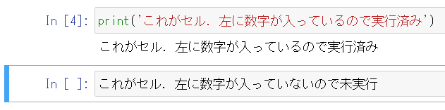
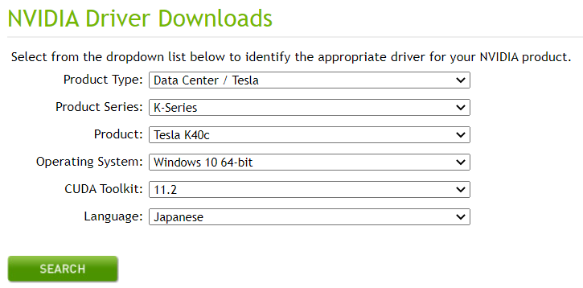
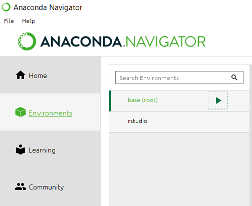
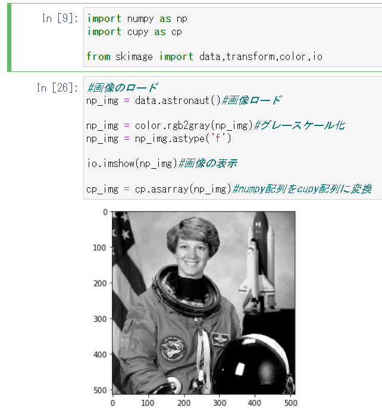
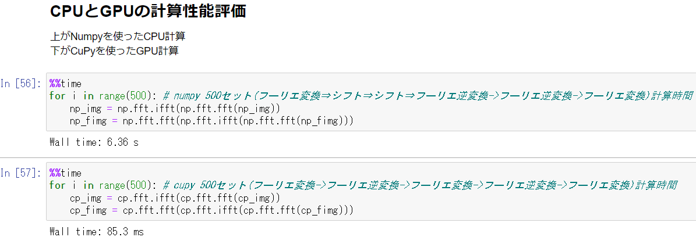

# 実行環境について

本編でシミュレーションやデモを構築，実行していく環境，およびその構築方法についてまとめておきます．基本的に，言語は Python を使用していきます．\
（Julia も使ってみることがあるので，[別のページ](./julia.html)で環境構築をしておきます．)


## Jupyter notebookの導入
Jupyter Notebook とは，ブラウザ上で対話形式にプログラムを実行できる環境です．データ分析によく使うツールの1つです．

<center></center>

Jupyter Notebook 上でプログラム開発，実行を行うメリットは，プログラムを途中で切って個別に実行していくことが出来ることにあります．これにより，結果をすぐに，段階的に見ることが出来ますし，デバッグも楽になります．

<center></center>

このため，初心者に優しく，また開発中やデバッグ中のお試し計算量 (時間) も落とすことが出来ます．

今回は，そんな Jupyter Notebook を使って Python のプログラムを開発する環境を整えていきます．プログラミング言語として Python を採択する理由は，まず第一に無料であること，ニューラルネットに関係するライブラリや資料がありふれていること，ユーザ数が多いことなどです．

### Anacondaのインストール
はじめに，Jupyter Notebook をいれるために Anaconda と呼ばれる，データサイエンスに特化した Python および R の無料のディストリビューションを入れていきます．


Anaconda は OS に制限なく，いれるだけでデータサイエンスに使うパッケージはだいたい一緒にインストールされ，また開発環境の整備などの面で強力なサポートを持つという優れモノです．

Python を使ってプログラミングを始めようとすると，だいたいの初心者が**開発環境の構築に苦しむ**ことになりますが，それを（ある程度）避けられます．というのも，Python は様々なライブラリから必要な関数，モジュールを import して使っていくのですが，これらのバージョンが合っていないと衝突して上手く動かないなんてことがよく起きるのです．Anaconda はそこらへんを精査してくれます．

さっそく入れていきましょう．

[Anacondaのインストール](https://www.anaconda.com/products/distribution)

<center></center>

自身の OS にあったバージョンを選択し，Download，Install してください．`Next`,`I agree` などを押してデフォルトのまま進めます．

Anaconda のインストール先を選択する際，基本的にはデフォルトのままで良いのですが，日本語のフォルダが含まれているとエラーを吐くらしいので，その場合は適宜インストール先を変更してください．

途中でてくる path の Advanced option はやらなくて良いので，そのまま Install.


### Anacondaの起動
Install が上手くいっていれば，Windows や Mac の検索で `Anaconda` と打つと `Anaconda Navigator` がいるはずです．起動します．

<center></center>

いろんなアプリが表示されているはずです．ここから，更に使いたいものを `Install` することで，使用できる `Launch` の表示に切り替わります．

簡単な説明に書いてある通り，それぞれ Python や R (特に VScode なんかは他にも使える) の統合開発環境ですので，便利です．今回の本命である Jupyter Notebook 以外にも，VScode, RStudio あたりは使っている人がかなり多いですね．

多分，Jupyter Notebook は初期の段階で Install 済みになっているはずです．なっていなければ Install してください．これで Python の開発環境が(ひとまず)整いました．

### Jupyter Notebookの起動

では早速，Jupyter Notebook を起動します．`Launch` を押してください．あるいは，OS の検索画面から直接起動しても構いません．自分は普段そうしています．

<center></center>

どちらでもOKです．

起動すると，なにやら黒い画面が起動し，

<center></center>

その後ブラウザが開いて，このような画面が表示されるはずです．されない場合，黒い画面の下の方に「この url をブラウザで検索してね」みたいなメッセージが表示されているはずなので，それに従うと下の画面に移ります．

<center></center>

ここに表示されているフォルダは，ご自身のローカルのものです．開発ファイルを起きたい場所にディレクトリ操作で移動します．

<center></center>

移動したら，そこで右上の `New` から Python3 を選択し，新しくファイルを作成します．

開いたらまず，名前をつけましょう．最初は `Untitle` になっている左上のファイル名をクリックし，任意の名前に変えます．

<center></center>

これで準備完了です．

### 動作テスト
いよいよ，Jupyter を使った Python プログラムの開発です．Jupyter Notebook では，セルと呼ばれる単位ごとにプログラムを実行させていきます．In の [] の中には，そのセルが実行された順番が表示されています．

これを使って，セルをあえて1個飛ばして実行するというようなことも可能です．

- セル間の移動は，移動したいセルをクリック
- セルの実行は Windows なら `Ctrl-Enter`，Mac は `⌘-Enter`(たしか)
- セルを実行して次のセルに移る場合は，`Shift-Enter`


<center></center>

いくつかのセルを作って，色々試してみましょう．ついでに，その他のメニューの操作も軽く確認しておきます．

<center></center>

上にある `File` などからは，よくある保存などの操作が行えます．自分は基本的には使わないです．保存は `Ctrl-s` で出来ますし．

同じく，その下のフロッピーアイコンからも保存が，+アイコンからはセルの追加が，といったようにセル操作が可能です．が，こちらも自分は基本コマンドで行っています．

<center></center>

コマンドを使ったその他の操作については，Shortcutsを参照してください．

とりあえず，この一連の操作が出来たら基本的な使い方は問題ありません．

### その他の便利機能
#### Markdown

Jupyter Notebookにはこれ以外にも，様々な便利機能があります．たとえば，Markdown 記法．

<center></center>


セルの設定を `code` から `markdown` に変更することで，Notebook 内に Markdown のメモを入れ込むことが出来ます．他の環境では頑張ってコメントアウトしていても，箇条書きだとかハイライトだとか，分かりやすい記法が出来ないせいでイマイチ伝わらない...そんなことありますよね．

<center></center>

Markdown セルを実行すると，こんな感じになります．便利ですね．余談ですが，このサイトも全て markdown で書いています．一部 CSS や JS を実装してはいますが，基本的にはこのページの内容・見た目くらいなら markdown は簡単に書けます．

#### .pyの出力
Jupyter Notebook を使ってプログラム開発を行うと，ファイルの拡張子は `.ipynb` という特殊なものになります．これは Notebook でしか実行できないファイルなので，シンプルな python プログラムとして実行したかったり，作成したプログラムをモジュール化して別のプログラムに import したくなった時には `.py` として保存する必要があります．

<center></center>

そんな時には，`File` メニューから `.py` としてダウンロードすることが可能です．

他にも，様々な拡張子でのダウンロード，というより変換が可能です．Print Preview からでも良いですが，たとえば pdf に変換することで，Notebook の内容をそのまま，つまりコードも書かれた状態で共有することが出来ます．markdown の説明なんかも挟んでいれば，ミーティングとかに使うには便利ですね．

#### 他者との共有
Notebookは他者と共有して使うことも可能です．が，今回は自分がぼっちであまり良さを魅せられないので割愛します．仲間がいる人は調べてみてください．


## GPUの使用
マストではありません．

GPU とは何か，といった話は割愛します．分からない人のために，語弊を招きつつもメリットだけ説明すると，ここでは (特定の条件下では) 計算が超早くなる方法を説明していきます．

とはいえ，普通に使っている分には問題ありません．大規模な計算を回すようになり，高速化を求めるようになった場合に検討する事項です．

さて，早速 GPU を使って Jupyter notebook, というより python のプログラミングをしていく準備を整えます．かなり面倒です．

### GPUドライバのインストール

まずは GPU のドライバをインストールします．いや，その前に GPU が入っているか確認しましょう．Windows ならデバイスマネージャーを起動し，`ディスプレイアダプター`を確認します．

<center></center>

ここに，NVIDIA と頭についたものがあれば OK です．無ければ以降の設定は出来ません．頑張ってお金を稼ぎましょう．


既に入っていれば問題ありませんが，何もしていない場合には GPU のドライバをインストールする必要があります．PC の検索で `NVIDIA Control Panel` が見つからない，あるいはエラーで開けない場合，インストールしてくる必要があります．


[NVIDIAのダウンロードページ](https://www.nvidia.com/Download/index.aspx?lang=en-us)から，自分の GPU にあったドライバをインストールしてきます．

たとえば自分は

<center></center>

ですね．入力した内容が正しいことを確認し，ダウンロードしましょう．

ここで CUDA Toolkit が入っていない場合には，~~こちらも入れる必要があります．(多分です．自分は先にCUDAを入れていたので分かりません)~~ 

CUDA Toolkit をインストールする際，GPU のバージョンにあったドライバが自動でインストールされるらしいです．最初からこちらをやるでも良いかもですね．

[CUDA Toolkit](https://developer.nvidia.com/cuda-toolkit) から，こちらも同様に自身の環境に合うバージョンをダウンロードしてください．network でも local でも構わないらしいです．

<center></center>

インストール時のoptionは基本的にデフォルト設定からいじらず，インストールします．

さて，どちらも無事に終わっていれば，`NVIDIA Control Panel` が開けるはずです．

<center></center>

起動したら，こんな画面が表示されれば成功です．GPUを利用することが出来る状態になりました．

### CuPyのインストール
次に，Python で GPU を使うために必要になる，CuPy というライブラリをインストールします．これが色々と Conflict を起こしがちなのですが，Anaconda ベースの皆さんには怖くないはずです．蛇さんが勝手にやってくれます．


CuPy は，Python の数値計算時によく使う NumPy と呼ばれるライブラリの関数を基本的にトレースした互換性の高いライブラリで，NumPy で提供されている関数を NVIDIA の GPU で実行するようにしたものです．NVIDIA の GPU がないと無理といったのは，この CuPy が使えないことに起因します．

[CuPy 公式](https://docs.cupy.dev/en/stable/install.html)から，CuPy をインストールします．Anaconda がない場合，自身の CUDA 等のバージョンに合わせて適切な方法を取らないと上手く動きませんが，Anaconda は簡単です．

Anaconda Navigator を起動します．左のタブから，Environment を選びます．

<center></center>

このような画面が出たら，base (root) の三角を押し，terminal を起動します．

```conda install -c conda-forge cupy```

を実行することで，Anaconda が環境にあった CuPy を自動でインストールしてくれるはずです．ただし，この場合は自分のドライバがサポートしているバージョンの中で最新のものがインストールされるので，何か特別の理由があって CUDA のバージョンを指定したい場合は

```conda install -c conda-forge cupy cudatoolkit=xxx```

などと指定することも可能です．xxx にバージョンを入れてください．

しばし待つと，問題なければインストールが完了します．

### CuPyのテスト
インストールが終わったら，動作テストを行います．Notebook を開き，

```python
import numpy as np
import cupy as cp
```

を実行してみてください．エラーを吐かなければインストールは無事成功しています．

では，CPU で計算する NumPy と GPU で計算するCuPyの性能比較をしてみましょう．基本的な使い方は一緒です．

```python
import numpy as np
import cupy as cp

from skimage import data,transform,color,io

np_img = data.astronaut()#画像ロード

np_img = color.rgb2gray(np_img)#グレースケール化
np_img = np_img.astype('f')

io.imshow(np_img)#画像の表示

cp_img = cp.asarray(np_img)#numpy配列をcupy配列に変換
```
をセルにいれ，実行しましょう．すると

<center></center>

のように画像が表示できるはずです．skimage がない場合はインストールしてきてください．

これを NumPy, CuPy でそれぞれ無駄に疲れるフーリエ変換させてみます．

```python
%%time 
for i in range(500): # numpy 500セット(フーリエ変換⇒シフト⇒シフト⇒フーリエ逆変換->フーリエ逆変換->フーリエ変換)計算時間
    np_img = np.fft.ifft(np.fft.fft(np_img))
    np_fimg = np.fft.fft(np.fft.ifft(np.fft.fft(np_fimg)))

%%time
for i in range(500): # cupy 500セット(フーリエ変換->フーリエ逆変換->フーリエ変換->フーリエ逆変換->フーリエ変換)計算時間
    cp_img = cp.fft.ifft(cp.fft.fft(cp_img))
    cp_fimg = cp.fft.fft(cp.fft.ifft(cp.fft.fft(cp_fimg)))
```

<center></center>

それぞれ実行してみると，CPU が 6 秒超えなのに対し，GPU は 85 ms でした．かなり高速です．この差は実行する環境次第で変わりますが，問題によっては GPU の方が早いことが確認できました．