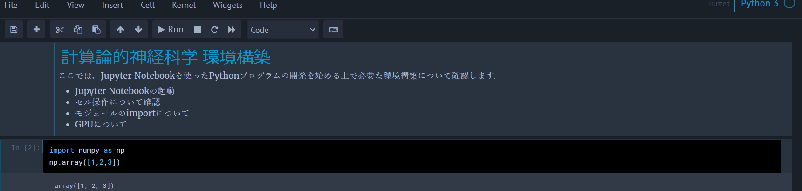
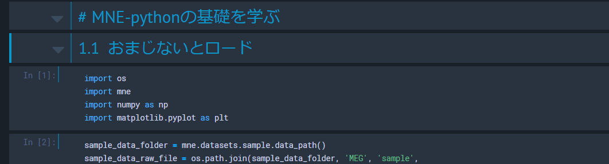
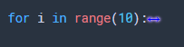
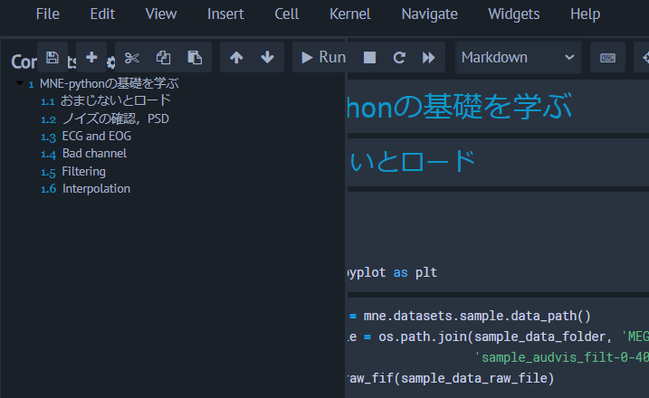
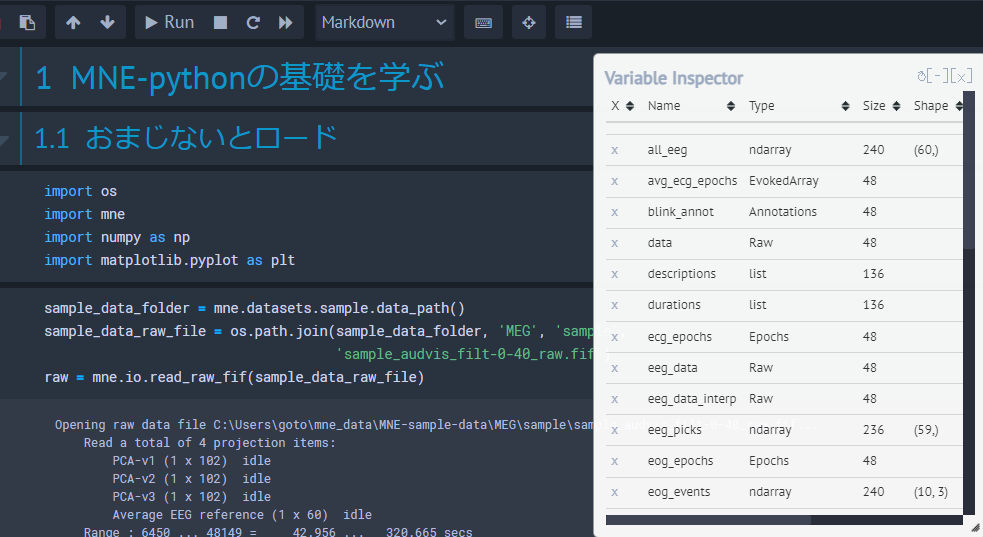

# Jupyter Notebookのカスタム

趣味です．ただの趣味．
人によっては全く興味がないと思うのですが，個人的に Jupyter Notebook は見た目がださかったり，ちょっと使い勝手が悪いと思うことがあったのでカスタムの仕様と方法を貼っておきます．

備忘録兼，筆者のスクリーンショットを見て気になった人のためのページになります．

## 見た目の変更
早速ですが，Jupyter Notebook って背景真っ白でちょっとださいし，何より目が疲れますよね．

なので，ここではそんな Jupyter の見た目をおしゃれに，目に優しくしていきます．時代は SDGs です．


<center></center>

こんな感じになりました．色なんかは各自である程度好きに変える事ができます．

### jupyter_contrib_nbextensionsのインストール

```sh
conda install -c conda-forge jupyter_contrib_nbextensions
```

で，まずは Jupyter の拡張機能をいじるための nbextension を追加します．
conda コマンドなことに注意です．

これで，色々といじれるようになります．

上手くいくと，Jupyter notebook の Home を開くと

<center></center>

のように，`Nbextensions` タブが作成されます．

### jupyter-themeのインストール

jupyter の見た目を良い感じにしてくれるカラーテンプレートをいれます．

```sh
conda install -c conda-forge jupyterthemes
```

これでいれるのは完了です．選べるカラーテーマの一覧は

```sh
jt -l
```

で表示できます．
<center></center>


選ぶ際には，

```sh
jt -t chesterish
```

などとします．更に，他にも細かい設定を加えることができますので，自分は

```sh
jt -t chesterish -T -cellw 90% -f roboto -fs 9 -tf merriserif -tfs 11 -nf ptsans -nfs 11 -dfs 8 -ofs 8
```

としています．お好みで色々調べてみてください．

## Vimキーバインド
### jupyter-vim-binding
筆者は vimmer です．Emacs なんてものを使う変人もいるようですが，vim の方が圧倒的に便利です．chrome の拡張機能なんかにも vim をいれているのですが，これがないと作業なんてできたものじゃないので必須です．

jupyter notebook でも，操作をいちいちマウス触らずに，しかもホームポジションから手を動かさずに行いたいので，拡張で vim key-bind をいれます．

```sh
jupyter --data-dir
```

で，jupyter が入っている場所を特定します．表示されたパスを使って

```sh
mkdir -p $(jupyter --data-dir)/nbextensions
cd $(jupyter --data-dir)/nbextensions
git clone https://github.com/lambdalisue/jupyter-vim-binding vim_binding
jupyter nbextension enable vim_binding/vim_binding
```

を続けて実行します．これで，Jupyter で vim の key-bind が使えるようになりました！万歳．

### Vimキーバインドの設定
このままでも結構便利になっている（たとえば `hjkl` での移動）のですが，モード切り替えのために Esc を押さないといけないのは面倒です．せめてそれくらいはカスタムしておきたい．ということで，

> ~/.jupyter/custom/custom.js

を編集しました．

コードは

<details markdown="1">
<summary>詳細</summary>

```js
// Configure CodeMirror Keymap
require([
  'nbextensions/vim_binding/vim_binding',   // depends your installation
], function() {
  CodeMirror.Vim.map("jj", "<Esc>", "insert"); // jj setting!
});

// Configure Jupyter Keymap
require([
  'nbextensions/vim_binding/vim_binding',
  'base/js/namespace',
], function(vim_binding, ns) {
  // Add post callback
  vim_binding.on_ready_callbacks.push(function(){
    var km = ns.keyboard_manager;
    // Allow Ctrl-2 to change the cell mode into Markdown in Vim normal mode
    km.edit_shortcuts.add_shortcut('ctrl-2', 'vim-binding:change-cell-to-markdown', true);
    // Update Help
    km.edit_shortcuts.events.trigger('rebuild.QuickHelp');
  });
});
```

</details>

にまとめました．これによって，とりあえず `jj` での挿入モード抜け出しを可能とし，あとはセルのマークダウンとコードモード変更を `Ctr-2` で変更できるようにしました．


### 色の修正
しかし，vim キーバインド有効にしてしまうと，選択中のセルが白くハイライトされることになってしまい，とても見にくくなります．


<center></center>

なので改めて，ハイライト時の色を設定する必要があります．

> ~/.jupyter/custom/custom.css

を調整していきます．

> div.cell.edit_mode {

という行を見つけ，その直前に下記をいれます．

```css
/* Jupyter cell is in normal mode when code mirror */
.edit_mode .cell.selected .CodeMirror-focused.cm-fat-cursor {
background-color: #000000 !important;
}
/* Jupyter cell is in insert mode when code mirror */
.edit_mode .cell.selected .CodeMirror-focused:not(.cm-fat-cursor) {
background-color: #000000 !important;
}
```


これで，ハイライトされたセルの色が白く塗りつぶされないようになりました．闇の vim 環境の完成です．

<center></center>

## その他便利な Nbextensions

その他にも導入している機能です．`Nbextensions` タブから On/Off を切り替えることが出来ます．

(まとめながら他にも便利なの見つけて導入しているので一貫性がないです)

<center></center>

この画面で，チェックマークを入れているものが有効化されている機能です．先程コードベースで有効化した VIM binding にもチェックが入っていますね．

### Collapsible Headings
Collapsible headings は，マークダウンを使ってメモやタイトルを入れている人にとっては嬉しくなる機能で，マークダウンの # ごとにセルを折りたたむことが出来るようになります．

<center></center>
<center></center>

うれしい

### Hinterland
楽しそうな名前．これはコードの自動補完です．

<center></center>

### Skip-Traceback
エラーメッセージをみじかく畳みます．

<center></center>

もちろん，ちゃんと見たい際にはプルダウンから
<center></center>


見れます．

### Tree filter
Jupyter notebook の Home でファイルを検索できます．

<center></center>

これ，地味に嫌だったのでとても助かる．

### Code font size
コードのフォントサイズを変更するボタンを追加します．

虫眼鏡で調整します．

<center></center>

プロジェクタとかに写すとき助かる．あと眼鏡忘れてきたときとか．

### Snippets Menu

頻出のコードをスニペットとして登録しておき，引っ張ってくることが出来ます．デフォルトで色々ありますが，自前のを定義することも可能です．
たとえば
<center></center>

をクリックすると（これまた僕の環境と色が...面倒な...）

<center></center>

こうやっていれてくれます．


### Codefolding

コードを折りたたむ機能です．
<center></center>

こういう for 文が...

<center></center>

こうやって折りたためます．

### ExcuteTime
各セルの実行時間を出してくれます．コードの速さを追及したい時なんかに便利になります．あとついでに，最後に実行されたのがいつだったかも記録してくれるので version 管理とかにも役立ちます．
<center></center>

### Table of Contents(2)
目次を作成してくれます．

<center></center>

ここを押すと...

<center></center>

このように，マークダウンから目次を引っ張ってきてくれます．なんか僕のだと位置が被っちゃってイラつきますが，調整自体はできるはずです．

設定次第で，1 版最初のセルに自動で目次を作るといった事もできます．

### Variable Inspector

あまりに便利．変数一覧をだしてくれます．

<center></center>

メニューバーの目次の隣のひし形のマークを押すとでます．型やサイズなども見れるのでとても重宝します．