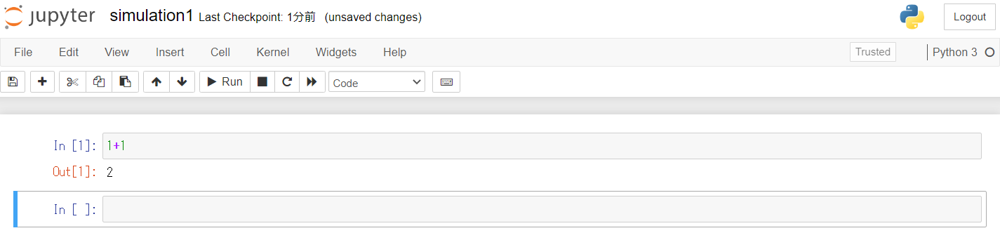
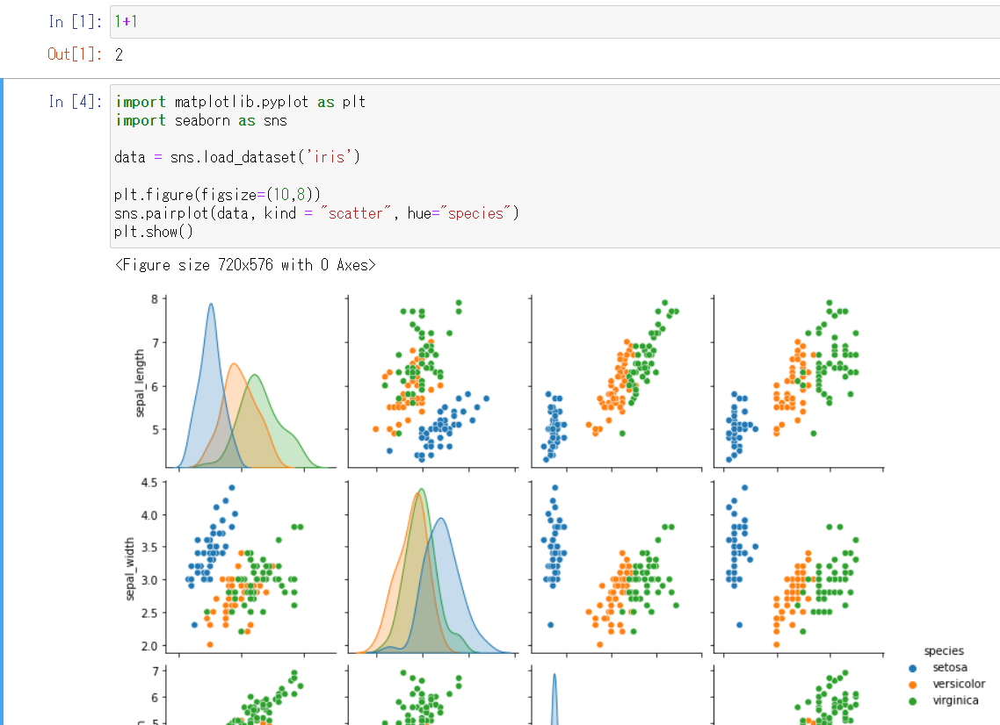
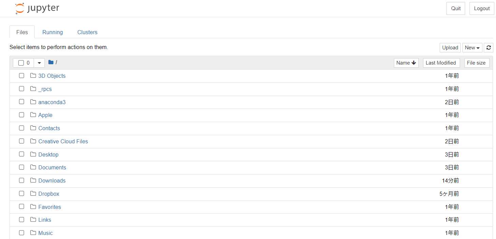
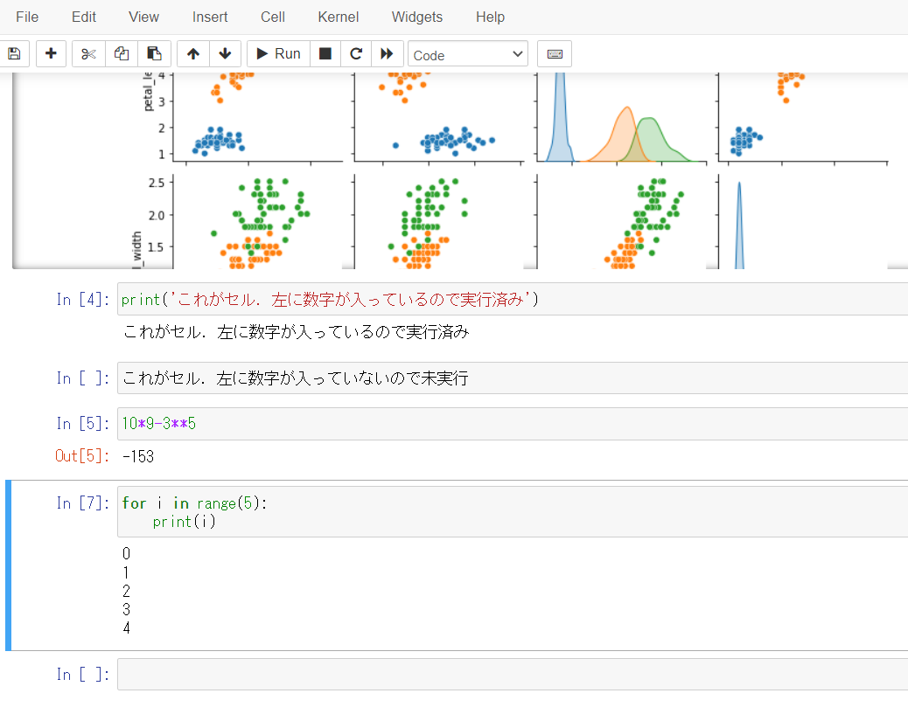
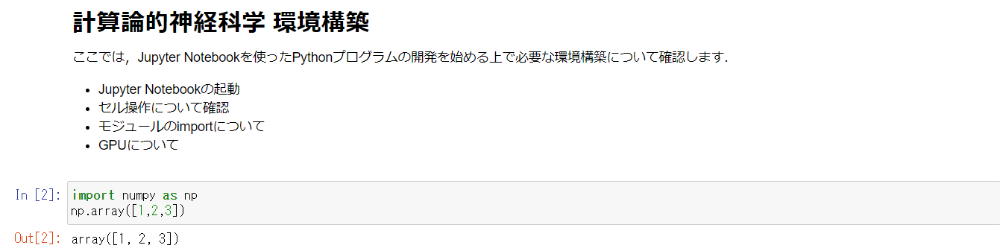
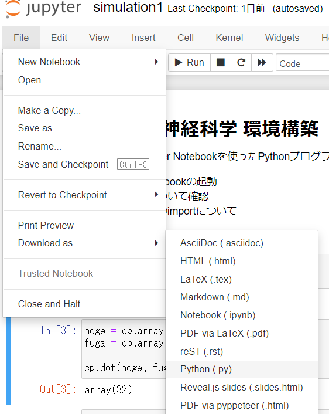
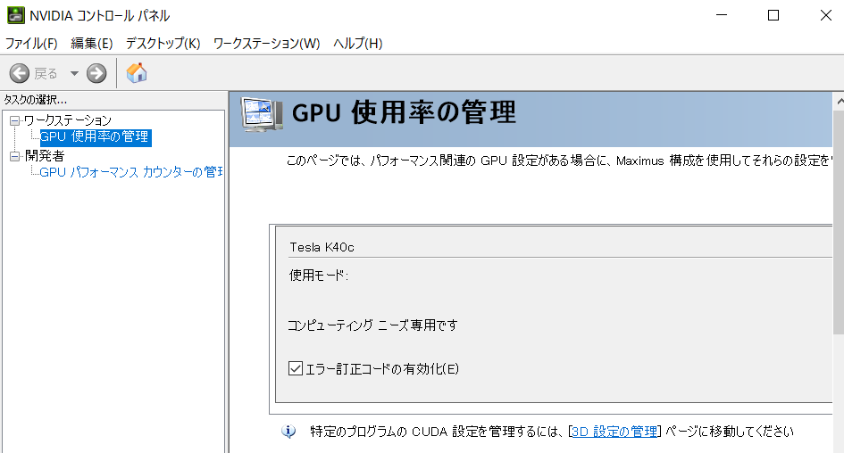

---
html:
  embed_local_images: false
  embed_svg: true
  offline: false
  toc: true

print_background: false

export_on_save:
  html: true
---


<div class="header">
  <table class="fixed-table">
    <thead>
      <tr>
        <th class="mokuji">目次</th>
        <th><details><summary> Math </summary><ul class="gnav"><details><summary>基礎数学編</summary>
        <ul class="index">
        <li><a href="../../Math/Basic/basic.html">ホーム</a></li> 
        <li><a href="../../Math/Basic/multiplication.html">掛け算</a></li>     
        <li><a href="../../Math/Basic/trigonometric.html">三角関数</a></li>
        <li><a href="../../Math/Basic/complex.html">複素数</a></li>
        <li><a href="../../Math/Basic/calculus.html">微分・積分</a></li>
        <li><a href="../../Math/Basic/linear_algebra.html">線形代数</a></li>
        <li><a href="../../Math/Basic/statistics.html">基礎統計</a></li>
        </ul></details>
        <ul class="gnav"><details><summary>信号処理編</summary>
        <ul class="index">
        <li><a href="../../Math/Analysis/Analysis.html">ホーム</a></li> 
        <li><a href="../../Math/Analysis/fourier.html">フーリエ変換</a></li>
        <li><a href="../../Math/Analysis/wavelet.html">wavelet変換</a></li>
        <li><a href="../../Math/Analysis/hilbert.html">ヒルベルト変換</a></li>
        <li><a href="../../Math/Analysis/eeg.html">基本の脳波解析</a></li> <li><a href="../../Math/Analysis/phase_analysis.html">位相同期解析</a></li>
        </ul></details>
        <ul class="gnav"><details><summary>統計編</summary>
        <ul class="index">
        <li><a href="../../Math/Statistics/Statistic.html">ホーム</a></li> 
        <li><a href="../../Math/Statistics/distribution.html">確率分布</a></li>
        <li><a href="../../Math/Statistics/central_limit_theorem.html">大数の法則と中心極限定理</a></li>
        <li><a href="../../Math/Statistics/statistic.html">統計量と標本分布</a></li>                                                         <li><a href="../../Math/Statistics/test.html">統計的検定</a></li>
        <li><a href="../../Math/Statistics/anova.html">分散分析</a></li>
        <li><a href="../../Math/Statistics/logistic_regression.html">ロジスティック回帰</a></li>
        </ul></details>
        <ul class="gnav"><details><summary>その他</summary>
        <ul class="index">
        <li><a href="../../Math/Others/Others.html">ホーム</a></li> 
        <li><a href="../../Math/Others/ICA.html">独立成分分析</a></li> 
        <li><a href="../../Math/Others/CCA.html">正準相関分析</a></li>
        <li><a href="../../Math/Others/lagrange.html">ラグランジュの未定乗数法</a></li>
        <li><a href="../../Math/Others/Entropy.html">エントロピーと分布間距離</a></li>
        <li><a href="../../Math/Others/signal_detection.html">信号検出理論</a></li>
        </ul></details>
        </details></th>
        <th><details><summary> Analysis </summary>
        <ul class="gnav"><details><summary>EEGLAB</summary>
        <ul class="index">       
        <li><a href="../../Analysis/eeglab/eeglab.html">ホーム</a></li>                           <li><a href="../../Analysis/eeglab/setup.html">環境構築</a></li>
        <li><a href="../../Analysis/eeglab/import.html">データのインポート</a></li>
        <li><a href="../../Analysis/eeglab/prepro1.html">基本的な下処理</a></li>
        <li><a href="../../Analysis/eeglab/prepro2.html">発展的な下処理</a></li>
        <li><a href="../../Analysis/eeglab/analysis1.html">単被験者での解析</a></li>
        <li><a href="../../Analysis/eeglab/analysis2.html">被験者群での解析</a></li>
        </ul></details>
        <ul class="gnav"><details><summary>MNE-python</summary>
        <ul class="index">
        <li><a href="../../Analysis/MNE/MNE.html">ホーム</a></li>
        <li><a href="../../Analysis/MNE/import.html">データのロード</a></li>
        <li><a href="../../Analysis/MNE/preprocessing.html">前処理</a></li>
        </ul> </details></details></th>
        <th><details><summary> Experiment </summary>
        <ul class="gnav">       </ul> </details></th>
        <th><details><summary> Simulations </summary>
        <ul class="gnav"><details><summary>環境構築</summary>
        <ul class="index">
         <li><a href="../../Simulation/Setup/Setup.html">ホーム</a></li>
        <li><a href="../../Simulation/Setup/environment.html">Python環境構築</a></li>
        <li><a href="../../Simulation/Setup/gpu.html">pythonでのGPUセットアップ</a></li>
        <li><a href="../../Simulation/Setup/jupyter.html">Jupyterセットアップ</a></li>
        <li><a href="../../Simulation/Setup/julia.html">Juliaセットアップ</a></li>
        </ul></details>
        <ul class="gnav"><details><summary>非線形力学</summary>
        <ul class="index">
        <li><a href="../../Simulation/NonlinearDynamics/Nonlinear-dynamics.html">ホーム</a></li>
        <li><a href="../../Simulation/NonlinearDynamics/dynamics.html">力学系とは</a></li>
        <li><a href="../../Simulation/NonlinearDynamics/stability.html">線形安定性解析</a></li>
        <li><a href="../../Simulation/NonlinearDynamics/stability_nonlinear.html">非線形系の安定性解析</a></li>
        </ul></details>
        </details></th>
      </tr>
    </thead>
  </table>
</div>

<h1><span>01</span>実行環境について</h1>

本編でシミュレーションやデモを構築，実行していく環境，およびその構築方法についてまとめておきます．基本的に，言語はPythonを使用していきます．
（Juliaも使ってみることがあるので，[別のページ](./julia.html)で環境構築をしておきます．)

<!-- @import "[TOC]" {cmd="toc" depthFrom=2 depthTo=4 orderedList=false} -->

<!-- code_chunk_output -->

- [Jupyter notebookの導入](#jupyter-notebookの導入)
  - [Anacondaのインストール](#anacondaのインストール)
  - [Anacondaの起動](#anacondaの起動)
  - [Jupyter Notebookの起動](#jupyter-notebookの起動)
  - [動作テスト](#動作テスト)
  - [その他の便利機能](#その他の便利機能)
- [GPUの使用](#gpuの使用)
  - [GPUドライバのインストール](#gpuドライバのインストール)
  - [CuPyのインストール](#cupyのインストール)
  - [CuPyのテスト](#cupyのテスト)

<!-- /code_chunk_output -->


## Jupyter notebookの導入
Jupyter Notebookとは，ブラウザ上で対話形式にプログラムを実行できる環境です．データ分析によく使うツールの1つです．

<center></center>

Jupyter Notebook上でプログラム開発，実行を行うメリットは，プログラムを途中で切って個別に実行していくことが出来ることにあります．これにより，結果をすぐに，段階的に見ることが出来ますし，デバッグも楽になります．

<center></center>

このため，初心者に優しく，また開発中やデバッグ中のお試し計算量(時間)も落とすことが出来ます．

今回は，そんなJupyter Notebookを使ってPythonのプログラムを開発する環境を整えていきます．プログラミング言語としてPythonを採択する理由は，まず第一に無料であること，ニューラルネットに関係するライブラリや資料がありふれていること，ユーザ数が多いことなどです．

### Anacondaのインストール
はじめに，Jupyter NotebookをいれるためにAnacondaと呼ばれる，データサイエンスに特化したPythonおよびRの無料のディストリビューションを入れていきます．


AnacondaはOSに制限なく，いれるだけでデータサイエンスに使うパッケージはだいたい一緒にインストールされ，また開発環境の整備などの面で強力なサポートを持つという優れモノです．

Pythonを使ってプログラミングを始めようとすると，だいたいの初心者が**開発環境の構築に苦しむ**ことになりますが，それを（ある程度）避けられます．というのも，Pythonは様々なライブラリから必要な関数，モジュールをimportして使っていくのですが，これらのバージョンが合っていないと衝突して上手く動かないなんてことがよく起きるのです．Anacondaはそこらへんを精査してくれます．

さっそく入れていきましょう．

[Anacondaのインストール](https://www.anaconda.com/products/distribution)

<center></center>

自身のOSにあったバージョンを選択し，Download，Installしてください．```Next```,```I agree```などを押してデフォルトのまま進めます．

Anacondaのインストール先を選択する際，基本的にはデフォルトのままで良いのですが，日本語のフォルダが含まれているとエラーを吐くらしいので，その場合は適宜インストール先を変更してください．

途中でてくるpathのAdvanced optionはやらなくて良いので，そのままInstall.


### Anacondaの起動
Installが上手くいっていれば，WindowsやMacの検索で`Anaconda`と打つと`Anaconda Navigator`がいるはずです．起動します．

<center></center>

いろんなアプリが表示されているはずです．ここから，更に使いたいものを`Install`することで，使用できる`Launch`の表示に切り替わります．

簡単な説明に書いてある通り，それぞれPythonやR(特にVScodeなんかは他にも使える)の統合開発環境ですので，便利です．今回の本命であるJupyter Notebook以外にも，VScode, RStudioあたりは使っている人がかなり多いですね．

多分，Jupyter Notebookは初期の段階でInstall済みになっているはずです．なっていなければInstallしてください．これでPythonの開発環境が(ひとまず)整いました．

### Jupyter Notebookの起動

では早速，Jupyter Notebookを起動します．`Launch`を押してください．あるいは，OSの検索画面から直接起動しても構いません．自分は普段そうしています．

<center></center>

どちらでもOKです．

起動すると，なにやら黒い画面が起動し，

<center></center>

その後ブラウザが開いて，このような画面が表示されるはずです．されない場合，黒い画面の下の方に「このurlをブラウザで検索してね」みたいなメッセージが表示されているはずなので，それに従うと下の画面に移ります．

<center></center>

ここに表示されているフォルダは，ご自身のローカルのものです．開発ファイルを起きたい場所にディレクトリ操作で移動します．

<center></center>

移動したら，そこで右上の`New`からPython3を選択し，新しくファイルを作成します．

開いたらまず，名前をつけましょう．最初は`Untitle`になっている左上のファイル名をクリックし，任意の名前に変えます．

<center></center>

これで準備完了です．

### 動作テスト
いよいよ，Jupyterを使ったPythonプログラムの開発です．Jupyter Notebookでは，セルと呼ばれる単位ごとにプログラムを実行させていきます．Inの[]の中には，そのセルが実行された順番が表示されています．

これを使って，セルをあえて1個飛ばして実行するというようなことも可能です．

- セル間の移動は，移動したいセルをクリック
- セルの実行はWindowsなら`Ctrl-Enter`，Macは`⌘-Enter`(たしか)
- セルを実行して次のセルに移る場合は，`Shift-Enter`


<center></center>

いくつかのセルを作って，色々試してみましょう．ついでに，その他のメニューの操作も軽く確認しておきます．

<center></center>

上にある`File`などからは，よくある保存などの操作が行えます．自分は基本的には使わないです．保存は`Ctrl-s`で出来ますし．

同じく，その下のフロッピーアイコンからも保存が，+アイコンからはセルの追加が，といったようにセル操作が可能です．が，こちらも自分は基本コマンドで行っています．

<center></center>

コマンドを使ったその他の操作については，Shortcutsを参照してください．

とりあえず，この一連の操作が出来たら基本的な使い方は問題ありません．

### その他の便利機能
##### Markdown
Jupyter Notebookにはこれ以外にも，様々な便利機能があります．たとえば，Markdown記法．

<center></center>


セルの設定を`code`から`markdown`に変更することで，Notebook内にMarkdownのメモを入れ込むことが出来ます．他の環境では頑張ってコメントアウトしていても，箇条書きだとかハイライトだとか，分かりやすい記法が出来ないせいでイマイチ伝わらない...そんなことありますよね．

<center></center>

Markdownセルを実行すると，こんな感じになります．便利ですね．

##### .pyの出力
Jupyter Notebookを使ってpythonのプログラム開発を行うと，ファイルの拡張子は`.ipynb`という特殊なものになります．これはNotebookでしか実行できないファイルなので，シンプルなpythonプログラムとして実行したかったり，作成したプログラムをモジュール化して別のプログラムにimportしたくなった時には`.py`として保存する必要があります．

<center></center>

そんな時には，`File`メニューから`.py`としてダウンロードすることが可能です．

他にも，様々な拡張子でのダウンロード，というより変換が可能です．Print Previewからでも良いですが，たとえばpdfに変換することで，Notebookの内容をそのまま，つまりコードも書かれた状態で共有することが出来ます．markdownの説明なんかも挟んでいれば，ミーティングとかに使うには便利ですね．

##### 他者との共有
Notebookは他者と共有して使うことも可能です．が，今回は自分がぼっちであまり良さを魅せられないので割愛します．仲間がいる人は調べてみてください．


## GPUの使用
マストではありません．

GPUとは何か，といった話は割愛します．分からない人のために，語弊を招きつつもメリットだけ説明すると，ここでは(特定の条件下では)計算が超早くなる方法を説明していきます．

とはいえ，普通に使っている分には問題ありません．大規模な計算を回すようになり，高速化を求めるようになった場合に検討する事項です．

さて，早速GPUを使ってJupyter notebook, というよりpythonのプログラミングをしていく準備を整えます．かなり面倒です．

### GPUドライバのインストール

まずはGPUのドライバをインストールします．いや，その前にGPUが入っているか確認しましょう．Windowsならデバイスマネージャーを起動し，`ディスプレイアダプター`を確認します．

<center></center>

ここに，NVIDIAと頭についたものがあればOKです．無ければ以降の設定は出来ません．頑張ってお金を稼ぎましょう．


既に入っていれば問題ありませんが，何もしていない場合にはGPUのドライバをインストールする必要があります．PCの検索で`NVIDIA Control Panel`が見つからない，あるいはエラーで開けない場合，インストールしてくる必要があります．


[NVIDIAのダウンロードページ](https://www.nvidia.com/Download/index.aspx?lang=en-us)から，自分のGPUにあったドライバをインストールしてきます．

たとえば自分は

<center></center>

ですね．入力した内容が正しいことを確認し，ダウンロードしましょう．

ここでCUDA Toolkitが入っていない場合には，~~こちらも入れる必要があります．(多分です．自分は先にCUDAを入れていたので分かりません)~~ 

CUDA Toolkitをインストールする際，GPUのバージョンにあったドライバが自動でインストールされるらしいです．最初からこちらをやるでも良いかもですね．

[CUDA Toolkit](https://developer.nvidia.com/cuda-toolkit)から，こちらも同様に自身の環境に合うバージョンをダウンロードしてください．networkでもlocalでも構わないらしいです．

<center></center>

インストール時のoptionは基本的にデフォルト設定からいじらず，インストールします．

さて，どちらも無事に終わっていれば，`NVIDIA Control Panel`が開けるはずです．

<center></center>

起動したら，こんな画面が表示されれば成功です．GPUを利用することが出来る状態になりました．

### CuPyのインストール
次に，PythonでGPUを使うために必要になる，CuPyというライブラリをインストールします．これが色々とConflictを起こしがちなのですが，Anacondaベースの皆さんには怖くないはずです．蛇さんが勝手にやってくれます．


CuPyは，Pythonの数値計算時によく使うNumPyと呼ばれるライブラリの関数を基本的にトレースした互換性の高いライブラリで，NumPyで提供されている関数をNVIDIAのGPUで実行するようにしたものです．NVIDIAのGPUがないと無理といったのは，このCuPyが使えないことに起因します．

[CuPy公式](https://docs.cupy.dev/en/stable/install.html)から，CuPyをインストールします．Anacondaがない場合，自身のCUDA等のバージョンに合わせて適切な方法を取らないと上手く動きませんが，Anacondaは簡単です．

Anaconda Navigatorを起動します．左のタブから，Environmentを選びます．

<center></center>

このような画面が出たら，base(root)の三角を押し，terminalを起動します．

```conda install -c conda-forge cupy```

を実行することで，Anacondaが環境にあったCuPyを自動でインストールしてくれるはずです．ただし，この場合は自分のドライバがサポートしているバージョンの中で最新のものがインストールされるので，何か特別の理由があってCUDAのバージョンを指定したい場合は

```conda install -c conda-forge cupy cudatoolkit=xxx```

などと指定することも可能です．xxxにバージョンを入れてください．

しばし待つと，問題なければインストールが完了します．

### CuPyのテスト
インストールが終わったら，動作テストを行います．Notebookを開き，
```python
import numpy as np
import cupy as cp
```

を実行してみてください．エラーを吐かなければインストールは無事成功しています．

では，CPUで計算するNumPyとGPUで計算するCuPyの性能比較をしてみましょう．基本的な使い方は一緒です．

```python
import numpy as np
import cupy as cp

from skimage import data,transform,color,io

np_img = data.astronaut()#画像ロード

np_img = color.rgb2gray(np_img)#グレースケール化
np_img = np_img.astype('f')

io.imshow(np_img)#画像の表示

cp_img = cp.asarray(np_img)#numpy配列をcupy配列に変換
```
をセルにいれ，実行しましょう．すると

<center></center>

のように画像が表示できるはずです．skimageがない場合はインストールしてきてください．

これをNumPy, CuPyでそれぞれ無駄に疲れるフーリエ変換させてみます．

```python
%%time 
for i in range(500): # numpy 500セット(フーリエ変換⇒シフト⇒シフト⇒フーリエ逆変換->フーリエ逆変換->フーリエ変換)計算時間
    np_img = np.fft.ifft(np.fft.fft(np_img))
    np_fimg = np.fft.fft(np.fft.ifft(np.fft.fft(np_fimg)))

%%time
for i in range(500): # cupy 500セット(フーリエ変換->フーリエ逆変換->フーリエ変換->フーリエ逆変換->フーリエ変換)計算時間
    cp_img = cp.fft.ifft(cp.fft.fft(cp_img))
    cp_fimg = cp.fft.fft(cp.fft.ifft(cp.fft.fft(cp_fimg)))
```

<center></center>

それぞれ実行してみると，CPUが6秒超えなのに対し，GPUは85msでした．かなり高速です．この差は実行する環境次第で変わりますが，問題によってはGPUの方が早いことが確認できました．

<div style="text-align: center;">

【[GPU](./gpu.html)】【[シミュレーション](./simulation.html)】

</div>