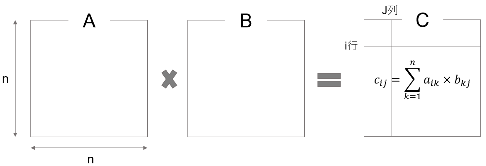
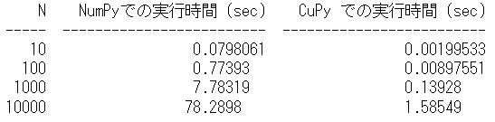

---
html:
  embed_local_images: false
  embed_svg: true
  offline: false
  toc: true

print_background: false

export_on_save:
  html: true
---

<div class="header">
  <table class="fixed-table">
    <thead>
      <tr>
        <th class="mokuji">目次</th>
        <th><details><summary> Math </summary><ul class="gnav"><details><summary>基礎数学編</summary>
        <ul class="index">
        <li><a href="../../Math/Basic/basic.html">ホーム</a></li> 
        <li><a href="../../Math/Basic/multiplication.html">掛け算</a></li>     
        <li><a href="../../Math/Basic/trigonometric.html">三角関数</a></li>
        <li><a href="../../Math/Basic/complex.html">複素数</a></li>
        <li><a href="../../Math/Basic/calculus.html">微分・積分</a></li>
        <li><a href="../../Math/Basic/linear_algebra.html">線形代数</a></li>
        <li><a href="../../Math/Basic/statistics.html">基礎統計</a></li>
        </ul></details>
        <ul class="gnav"><details><summary>信号処理編</summary>
        <ul class="index">
        <li><a href="../../Math/Analysis/Analysis.html">ホーム</a></li> 
        <li><a href="../../Math/Analysis/fourier.html">フーリエ変換</a></li>
        <li><a href="../../Math/Analysis/wavelet.html">wavelet変換</a></li>
        <li><a href="../../Math/Analysis/hilbert.html">ヒルベルト変換</a></li>
        <li><a href="../../Math/Analysis/eeg.html">基本の脳波解析</a></li> <li><a href="../../Math/Analysis/phase_analysis.html">位相同期解析</a></li>
        </ul></details>
        <ul class="gnav"><details><summary>統計編</summary>
        <ul class="index">
        <li><a href="../../Math/Statistics/Statistic.html">ホーム</a></li> 
        <li><a href="../../Math/Statistics/distribution.html">確率分布</a></li>
        <li><a href="../../Math/Statistics/central_limit_theorem.html">大数の法則と中心極限定理</a></li>
        <li><a href="../../Math/Statistics/statistic.html">統計量と標本分布</a></li>                                                         <li><a href="../../Math/Statistics/test.html">統計的検定</a></li>
        <li><a href="../../Math/Statistics/anova.html">分散分析</a></li>
        <li><a href="../../Math/Statistics/logistic_regression.html">ロジスティック回帰</a></li>
        </ul></details>
        <ul class="gnav"><details><summary>その他</summary>
        <ul class="index">
        <li><a href="../../Math/Others/Others.html">ホーム</a></li> 
        <li><a href="../../Math/Others/ICA.html">独立成分分析</a></li> 
        <li><a href="../../Math/Others/CCA.html">正準相関分析</a></li>
        <li><a href="../../Math/Others/lagrange.html">ラグランジュの未定乗数法</a></li>
        <li><a href="../../Math/Others/Entropy.html">エントロピーと分布間距離</a></li>
        <li><a href="../../Math/Others/signal_detection.html">信号検出理論</a></li>
        </ul></details>
        </details></th>
        <th><details><summary> Analysis </summary>
        <ul class="gnav"><details><summary>EEGLAB</summary>
        <ul class="index">       
        <li><a href="../../Analysis/eeglab/eeglab.html">ホーム</a></li>                           <li><a href="../../Analysis/eeglab/setup.html">環境構築</a></li>
        <li><a href="../../Analysis/eeglab/import.html">データのインポート</a></li>
        <li><a href="../../Analysis/eeglab/prepro1.html">基本的な下処理</a></li>
        <li><a href="../../Analysis/eeglab/prepro2.html">発展的な下処理</a></li>
        <li><a href="../../Analysis/eeglab/analysis1.html">単被験者での解析</a></li>
        <li><a href="../../Analysis/eeglab/analysis2.html">被験者群での解析</a></li>
        </ul></details>
        <ul class="gnav"><details><summary>MNE-python</summary>
        <ul class="index">
        <li><a href="../../Analysis/MNE/MNE.html">ホーム</a></li>
        <li><a href="../../Analysis/MNE/import.html">データのロード</a></li>
        <li><a href="../../Analysis/MNE/preprocessing.html">前処理</a></li>
        </ul> </details></details></th>
        <th><details><summary> Experiment </summary>
        <ul class="gnav">       </ul> </details></th>
        <th><details><summary> Simulations </summary>
        <ul class="gnav"><details><summary>環境構築</summary>
        <ul class="index">
         <li><a href="../../Simulation/Setup/Setup.html">ホーム</a></li>
        <li><a href="../../Simulation/Setup/environment.html">Python環境構築</a></li>
        <li><a href="../../Simulation/Setup/gpu.html">pythonでのGPUセットアップ</a></li>
        <li><a href="../../Simulation/Setup/jupyter.html">Jupyterセットアップ</a></li>
        <li><a href="../../Simulation/Setup/julia.html">Juliaセットアップ</a></li>
        </ul></details>
        <ul class="gnav"><details><summary>非線形力学</summary>
        <ul class="index">
        <li><a href="../../Simulation/NonlinearDynamics/Nonlinear-dynamics.html">ホーム</a></li>
        <li><a href="../../Simulation/NonlinearDynamics/dynamics.html">力学系とは</a></li>
        <li><a href="../../Simulation/NonlinearDynamics/stability.html">線形安定性解析</a></li>
        <li><a href="../../Simulation/NonlinearDynamics/stability_nonlinear.html">非線形系の安定性解析</a></li>
        </ul></details>
        </details></th>
      </tr>
    </thead>
  </table>
</div>

<h1><span>02</span>CuPyを使ったGPU演算</h1>

ニューラルネットを実装し，テストをするためには莫大な計算量が必要になります．この全てをCPUにやらせるのは骨が折れるため，GPUを使ったPythonプログラミングのためにCuPyの勉強をしていきます．

<!-- @import "[TOC]" {cmd="toc" depthFrom=2 depthTo=4 orderedList=false} -->

<!-- code_chunk_output -->

- [GPUとは](#gpuとは)
  - [CPUとの違い](#cpuとの違い)
    - [役割](#役割)
    - [得意とする演算処理](#得意とする演算処理)
    - [コア数](#コア数)
    - [実行時間](#実行時間)
- [CUDA](#cuda)
- [CuPy](#cupy)
  - [CuPyとは](#cupyとは)
  - [CuPyによるNumPyの互換プログラム](#cupyによるnumpyの互換プログラム)
- [CuPy.ElementwiseKernel](#cupyelementwisekernel)
  - [配列のindexing](#配列のindexing)
- [Oja's hebbian ruleの実装](#ojas-hebbian-ruleの実装)
    - [確認](#確認)
    - [速度比較](#速度比較)

<!-- /code_chunk_output -->


## GPUとは
GPUとは，Graphics Processing Unitの略で，リアルタイム画像処理に特化した演算装置です．例えば，3Dのゲームなどでは，ぬるぬる動く映像表現を実現するために膨大な演算が必要になります．これを担当するために使われるもので，定期的に並列な演算処理を行うことを得意とします．
<center></center>

上の画像のようなリアルな映像を，リアルタイムに更新していくためには常に尋常じゃない規模の計算を行う必要があります．そのため，現在のGPUの多くは高速でポリゴンの移動や回転，行列演算を行い，座標の変換やフィルタ...と様々な演算が可能なように進化しています．

最近では，GPUが多数のデータに対して並列的に(単純な)数値計算をくり返し適用可能であることに着目して，データサイエンスなどに利用するGPGPUと呼ばれるものも登場しています．これを利用することにより，CPU(通常，コンピュータが演算処理に使うもの)ベースで動くコンピュータより遥かに早く計算をさせることが可能なため，ニューラルネットの実装には欠かせない技術になります．

### CPUとの違い
CPU(Central Processing unit)とは，コンピュータの中枢を担う演算装置で，大脳のようなものです．PCでプログラムを実行する際にも，特に特別なことをしない限りは演算は全てCPUによって行われます．GPUがグラフィックに特化して仕事をしているのに対し，CPUはコンピュータ全体の処理を担当します．HDDやOS，キーボードやマウスなど，ありとあらゆるところから送られてくる情報をまとめて処理するものです．

そんな大役を担うCPUなので，当然計算性能はすさまじく高く，複雑な処理が得意です．しかしその一方，複雑な計算に耐えるように設計されているので単純な計算だろうと堅実に，順番に取り組むので，時間がかかってしまう傾向があります．コアと呼ばれる実行単位のようなものも少ないため，大量に計算を投げつけられるのが苦手です．

以下，CPUとGPUの違いを確認してみます．

#### 役割
- CPU ... 全ての演算処理
- GPU ... グラフィック専門

#### 得意とする演算処理
- CPU ... 連続的で複雑な演算処理
- GPU ... 並列的な単純な演算処理

#### コア数
- CPU ... 数個程度
- GPU ... 数千個

#### 実行時間
- CPU ... 大規模な計算を投げられると遅い
- GPU ... CPUの数倍から100倍以上の速度も可能．ただしコア1つだとCPUに遥かに劣る．人海戦術が強み．

と，このように大規模なニューラルネットを実装使用と思った時も，CPUよりGPUの方が計算に向いていることが分かります．ニューラルネットの各ニューロンで行われる計算は一つ一つは大した事ありませんが，それが何百個も集まり，さらに多層になりと，計算量が増えていくにつれてGPUのありがたみが生きてきます．

## CUDA
そんなGPUですが，製造の大手企業に[NVIDIA](https://www.nvidia.com/ja-jp/)社があります．NVIDIAは，自社製のGPUを使って汎用の演算処理を行うための実行環境として，CUDAを提供しています．

自分の環境で，本来ならCPUが行うはずの計算をGPUに投げて肩代わりしてもらうためには，これが必要になります．導入方法については[環境構築](environment.html)にて説明しました．

更に，このCUDAをPythonから呼び出す方法としてCuPyを導入していました．


Pythonでやる時には，基本的にはこのCuPyの使い方をマスターすれば良いわけですが，そもそもCuPyを使うためにCUDAの知識が多少必要になるっぽいので確認していきます．

ここではまずCUDAについて理解するために直接いじってみます．CUDAプログラミングは，C言語ベースになっているようです．あまり慣れていないので面倒だけど，行列の積を解く問題を考えます．参考は[こちら](https://www.gsic.titech.ac.jp/supercon/main/attwiki/index.php?plugin=attach&refer=SupercomputingContest2016&openfile=gpu-prog16-1ow.pdf)．


<center></center>

画像のような問題は，C言語だと以下のようになります．

```C
for (i = 0; i < n; i++) { // i行目，
    for (j = 0; j < n; j++) { // 第j列に注目
        for (k = 0; k < n; k++) { // 次元数分，下の計算をやる
            c[i][j] += a[i][k]*b[k][j]; // cijはaikとbkjの積
        } } }
```

この計算を，CPUに行わせると，次元数に応じてかなり大きな回数の計算を行うことになるため，時間がかかってしまいます．ここでGPUの出番です．GPUは，性能は低いけども計算が可能な演算装置，コアがたくさんいます．こいつらにそれぞれ，自分の担当の$C_{ij}$
```C
for (k = 0; k < n; k++) { // 次元数分，下の計算をやる
        c[i][j] += a[i][k]*b[k][j]; // cijはaikとbkjの積
}
```
を割り振って計算してもらえば，一つ一つのコアがやる計算はとても少なくなるため，超高速化が可能になるわけです．CUDAではこの際，分担してくれるコア達のことをスレッドと呼ぶようです．

では実際，そのような分担はどうやってやらせるのでしょうか．答えを確認すると以下のようになるようです．

<details><summary>プログラム全体</summary>

```C
#include <stdio.h>
#include <stdlib.h>

__global__ void mm_gpu(double *A, double *B, double *C, int n)
{
    int i, j, k;
    i = blockIdx.y * blockDim.y + threadIdx.y;
    j = blockIdx.x * blockDim.x + threadIdx.x;
    // 自身の番号から担当 (i,j) を決める
    if (i >= n || j >= n) return; // 行列からはみ出す部分は計算しない
    for (k = 0; k < n; k++) { // 総和の計算
        C[i*n+j] += A[i*n+k] * B[k*n+j]; // C[i][j] += A[i][k] * B[k][j]
    }
}

int main(int argc, char *argv[])
{
    int i, j, n;
    double *A, *B, *C;
    double *DA, *DA, *DC;
    n = atoi(argv[1]); // 行列の大きさ
    // A, B, Cのためにホストメモリを確保
    A = (double *)malloc(sizeof(double)*n*n);
    B = (double *)malloc(sizeof(double)*n*n);
    C = (double *)malloc(sizeof(double)*n*n);
    // A, Bの内容を設定し、Cをゼロクリア(略)
    // A, B, Cのためにデバイスメモリを確保
    cudaMalloc((void**)&DA, sizeof(double)*n*n);
    cudaMalloc((void**)&DB, sizeof(double)*n*n);
    cudaMalloc((void**)&DC, sizeof(double)*n*n);
    // A, B, Cの内容を、ホストメモリからデバイスメモリへコピー
    cudaMemcpy(DA, A, sizeof(double)*n*n, cudaMemcpyHostToDevice);
    cudaMemcpy(DB, B, sizeof(double)*n*n, cudaMemcpyHostToDevice);
    cudaMemcpy(DC, C, sizeof(double)*n*n, cudaMemcpyHostToDevice);
    // GPUカーネル関数を呼び出す!! 約n*n個のスレッドを使う
    mm_gpu<<<dim3((n+BS‐1)/BS, ((n+BS‐1)/BS)), dim3(BS, BS)>>>
        (DA, DB, DC, n);
    // 結果のCを、デバイスメモリからホストメモリへコピー
    cudaMemcpy(C, DC, sizeof(double)*n*n, cudaMemcpyDeviceToHost);
    // Cを出力などに利用(略)
    return 0;
}
```

</details>

CUDAのプログラムは，xx.cuという拡張子で，Cベースで書かれます．これらは，概要としては
- CPUがGPUのメモリ上にデータ用領域を確保
- CPUがGPUに入力されたデータを転送
- CPUがGPUカーネル関数を呼び出し
- **GPUが計算**
- CPUがGPUの計算結果をCPUに送信

の段階に分かれているようです．このうち，GPUが計算する部分が一番最初の記述，

```C
__global__ void mm_gpu(double *A, double *B, double *C, int n)
{
    int i, j, k;
    i = blockIdx.y * blockDim.y + threadIdx.y;
    j = blockIdx.x * blockDim.x + threadIdx.x;
    // 自分の背番号から担当する (i,j) を決める
    if (i >= n || j >= n) return; // 行列からはみ出す部分は計算しない
    for (k = 0; k < n; k++) { // 総和を計算する部分
        C[i*n+j] += A[i*n+k] * B[k*n+j]; // C[i][j] += A[i][k] * B[k][j]に相当
    }
}
```

に値します．この部分をGPUカーネル関数と言い，それ以外の部分をホスト関数と言います．ホスト関数はCPU側で動くものですね．ということで，この関数，というかプログラムに対して引数として何をいれて(CPU->GPU)，何を出力させるか(GPU->CPU)をよく考えることと，そのためにどんな計算領域が必要になるか，あるいは用意させるか，そして最後に，どの変数はGPUからCPUに送信するのかなどを色々と工夫することが可能になりそうです．

一般に，CPUとGPUで情報のやり取りが生じると時間がかかってしまうらしいので，たとえばAとBを引数にしてCを算出するプログラムを考えた場合，GPUからはＣだけ送られれば十分なのでAとBは送らないといったことをすると高速化できるそうです．

このあたりは
```C
cudaMemcpy(DA, A, sizeof(double)*n*n, cudaMemcpyHostToDevice);
cudaMemcpy(DB, B, sizeof(double)*n*n, cudaMemcpyHostToDevice);
cudaMemcpy(DC, C, sizeof(double)*n*n, cudaMemcpyHostToDevice);
```

の記述が関係するらしいです．引数は順に，転送先，転送元，サイズ(?)，Host(CPU)からDevice(GPU)なのか，あるいはその逆か，の4つになります．この例では，CPUからGPUに3つの変数を送っています．ここら辺については，また必要になったら掘り下げていきます．

次に，GPUにどれだけのスレッドを使わせるかを指定する記述です．

```C
// GPUカーネル関数を呼び出す!! 約n*n個のスレッドを使う
    mm_gpu<<<dim3((n+BS‐1)/BS, ((n+BS‐1)/BS)), dim3(BS, BS)>>>
        (DA, DB, DC, n);
```

mm_gpuは関数の名前で，<<<>>>が使用するスレッドの数の指定になるようです．これもよく分からない．(DA,DB,DC,n)は関数に渡したい引数のようですね．いずれにせよ，ここの記述によって，どれだけスレッドを使用するのか，(=どれだけGPUに頑張らせるのか？)を指定できるようです．

ともかく，これで呼び出された関数が

```C
__global__ void mm_gpu(double *A, double *B, double *C, int n)
{
    int i, j, k;
    i = blockIdx.y * blockDim.y + threadIdx.y;
    j = blockIdx.x * blockDim.x + threadIdx.x;
    // 自身の担当する (i,j) を決める
    if (i >= n || j >= n) return; // 行列からはみ出す部分は計算しない
    for (k = 0; k < n; k++) { // 総和
        C[i*n+j] += A[i*n+k] * B[k*n+j]; // C[i][j] += A[i][k] * B[k][j]に相当
    }
}
```

ということになりそうです．解読します．

まず，最初の__global__はGPUカーネル関数の印です．そしてvoid以降が関数の定義で，関数名および引数の指定をしています．

次にintであるiとjを使って，自身の担当する要素を指定しています．blockやらthreadやらが出てきてよく分かりませんが，とりあえずこれがそれぞれの割り当てになります．

それぞれのスレッド？の担当が決まったら，あとはそれに合わせて計算を割り振るだけです．

それぞれの計算機に課される仕事は，自身の担当する$C_{ij}$を計算することです．このサンプルコードだとABCの形はn*nの長さをもった1次元配列の形を取っているので，たとえば$C_{ij}$は`C[i*n+j]`でアクセスできます．

ということで
```C
for (k = 0; k < n; k++) { // 総和
        C[i*n+j] += A[i*n+k] * B[k*n+j]; // C[i][j] += A[i][k] * B[k][j]に相当
    }
```
つまり
$$
C_{ij} = \sum_{k=0}^{n-1} A_{ik} \times B_{kj}
$$

をするだけとなります．

CPUの場合は，一つの計算機というか単位が計算を担当するため，順番に処理しないといけなくなり，実装としては

```C
for (i = 0; i < n; i++) { // i行目，
    for (j = 0; j < n; j++) { // 第j列に注目
        for (k = 0; k < n; k++) { // 次元数分，下の計算をやる
            c[i][j] += a[i][k]*b[k][j]; // cijはaikとbkjの積
        } } }
```

のように3重のループ構造になっていました．このうち，2つのループをなくして別々のユニットに計算させるのがCUDAプログラムのメリットでした．

## CuPy
以上のように，CUDAを使ったGPUプログラミングの基本がなんとなく読めてきたところで，本題のCuPyの使い方を確認します．

### CuPyとは
CuPyはPreferred Networks社が開発しているオープンソースの高速な行列計算ライブラリです．中身としては，NumPyのGPU版のようなもので，基本的にはNumPyベースで動くプログラムであればnpをcpに変えるだけで動いてくれます．

DeepLearningのフレームワークであるChainerのバックグラウンドでも動いているようです．


### CuPyによるNumPyの互換プログラム
まずは軽く使い方を確認していきます．GitではCuPy.ipynbです．

まずは必要なライブラリのimport
<details><summary>code</summary>

```Python{.line-numbers}
import numpy as np
import cupy as cp

from skimage import data,transform,color,io
import time
```
</details>

次に，性能評価をするためにフーリエ変換にかける画像を読み込みます．

```Python{.line-numbers}
np_img = data.astronaut()#画像ロード

np_img = color.rgb2gray(np_img)#グレースケール化
np_img = np_img.astype('f')

io.imshow(np_img)#画像の表示

cp_img = cp.asarray(np_img)#numpy配列をcupy配列に変換
```

ここで，numpyで定義した配列をcupy配列に変換するためには`cp.asarray`関数を使用します．おそらくですが，これをあまりやりすぎると計算が遅くなると思うので極力forには含みません．

では早速，計算性能の比較をしていきます．まずはNumPy，つまりCPUで計算させる普通のプログラムです．

```Python{.line-numbers}
times_cpu = []  # CPUの計算時間保存用

for N in [10,100,1000,10000]:
    time_start = time.time()
    
    for i in range(N):
        sainokawara = np.fft.fft(np.fft.ifft(np.fft.fft(np_img)))
        
    time_end = time.time()
    elapsed_time = time_end - time_start  # 経過時間
    
    times_cpu.append(elapsed_time)
```

同様にCuPyも．
<details><summary>code</summary>

```Python{.line-numbers}
times_gpu = []  # GPUの計算時間保存用

for N in [10,100,1000,10000]:
    time_start = time.time()
    
    for i in range(N):
        sainokawara = cp.fft.fft(cp.fft.ifft(cp.fft.fft(cp_img)))
        
    time_end = time.time()
    elapsed_time = time_end - time_start  # 経過時間
    
    times_gpu.append(elapsed_time)
```
</details>

CuPyはNumPyのnpをcpに変換しただけです．これで計算が済んだので，結果を比較してみます．

<details><summary>code</summary>

```Python{.line-numbers}
import tabulate

# N ごとの実行時間の差
N = [10, 100, 1000, 10000]
times_cpu = np.asarray(times_cpu)
times_gpu = np.asarray(times_gpu)

# tabulate を用いてテーブルを作成
table = tabulate.tabulate(
    zip(N, times_cpu, times_gpu),
    headers=['N', 'NumPyでの実行時間 (sec)', 'CuPy での実行時間 (sec)'])

print(table)
```
</details>

<center></center>

圧倒的にCuPyの方が早いことが確認できました．NumPy自体が行列演算に特化したライブラリなので，それをさらにGPUで行うためにこのように早くなるわけですね．CUDAのプログラムを書かなくてもGPUが利用できるのはとても便利です．

ちなみに，この速さはあくまでcp(np)を使った演算をしているからですので，同じように行列の演算であってもnpを使わない実装をしていた部分に関してはむしろ遅くなってしまいます．

たとえば，forで回しまくっていたプログラムであれば，これをGPUに投げ渡してしまうと1つのユニット，それもCPUよりも貧弱な計算能力のものに全て計算を任せるわけですから，途方もない時間かかってしまいます．

従って，**CuPyベースのプログラムでは，cp関数での計算以外は高速化できない**ことになります．

たとえば，自分が書いていたコードですが

```Python
for post_neuron in range(len(self.x)):
    self.W[post_neuron] += self.learning_rate * (self.x[post_neuron] * self.x         - cp.square(self.x[post_neuron]) * self.W[post_neuron])
```

という記述が，逐次的に呼び出されていた場合，cupyを使うことでむしろ遅くなります．これが仮に

```Python
for post_neuron in range(len(self.x)):
    cp.dot(a,b)
```
のような記述だったら早かったはずです．しかし，これではやや不便です．numpyの関数にない計算をさせたいことだってたくさんあります．

## CuPy.ElementwiseKernel
npをcpに変えるのは，CPUに最適化された実装からGPUに最適化された実装への変換を意味します．

しかし，そもそもCPUへの最適化も難しく，あるいは開発者の頭が足りず，Pythonのforループで頑張って実装していた部分をGPUで早くしたい．というモチベーションもあり得ます．

そんな時につかうのがCuPyのElementwiseKernelという機能で，CUDAのGPUカーネルの中身を直接書いてCUDAを呼び出すことが出来ます．

メリットとして，上で見てきたようにブロックやスレッドの数，メモリ管理のようなよく分からなかった部分は触らず(勝手に調整してくれる)に，GPUにやってもらいたい計算部分(=GPUカーネル関数)のみを書けるということがあります．

やっていきます．

まずはシンプルに，二つの正方行列の和を計算させます．

```Python{.line-numbers}
X = cp.arange(25).reshape(5, 5)
Y = cp.arange(25).reshape(5, 5)

# ありものの関数で計算
arimono = cp.add(X,Y)

# カーネル関数を定義、生成
mat_add_kernel = cp.ElementwiseKernel(
        in_params='int32 x, int32 y', # input parameterを指定する．型の指定はしないとっぽい．Cだからかな
        out_params='float32 z',       # output parameterの指定．
        operation=\                   # 実行する関数の中身を記述する．これでnpにないものも使える
        '''
        z = x + y;
        ''',
        name='mat_add_kernel')        # 関数名

# カーネル関数の呼び出し
Z = mat_add_kernel(X, Y)

print('cp.add = \n', arimono)
print('carnel = \n', Z)
```

てきとうに，XとYの2つの正方行列を定義し，その和を計算させています．
この程度であれば，numpyおよびcupyの.add関数で計算可能ですので，ひとまずさせておいて，自分で実装したものと計算結果を比較してみます．

実装の詳細はとりあえず省き，結果を出してみると
<center></center>

と一致していることが分かります．型は違っていますが，わざとです．とりあえず，CuPy.ElementwiseKernelで普通のcp関数を再現できることが確認できました．

では実際の実装について見ていきます．

```Python{.line-numbers}
# カーネル関数を定義、生成
mat_add_kernel = cp.ElementwiseKernel(
        in_params='int32 x, int32 y', # input parameterを指定する．型の指定はしないとっぽい．Cだからかな
        out_params='float32 z',       # output parameterの指定．
        operation=\                   # 実行する関数の中身を記述する．これでnpにないものも使える
        '''
        z = x + y;
        ''',
        name='mat_add_kernel')        # 関数名

# カーネル関数の呼び出し
Z = mat_add_kernel(X, Y)
```

GPUに関連するのはこの部分だけです．11,12行目は，それ以前で定義した関数を呼び出しているだけなので，中身自体は9行です．CuPy.ElementwiseKernelでのカーネル関数の定義には4つの要素が必要になるようなので，順に確認していきます．

- in_params
- out_params
- operation
- name

まず，`in_params`は引数です．この関数を呼び出すさいに用いる変数ですね．12行目で関数を呼び出す際，XとYが引数として与えられています．関数の定義時には，この関数がどういった値を受け取って動作するのかを型とともに指定してやる必要があります．Cっぽいですね．ここでは，正方行列の定義は普通に整数値だったのでint32を型として，2つの引数がくると定義しました．

次に，`out_params`です．こちらはそのまま，出力されるパラメータの定義ですね．12行目で呼び出された後はZに格納される値の定義です．単純にint同士の和なのでintで良いですが，型の指定が大事ってことを強調するためにfloatにしてみました．実際結果を見てみても，kernel関数にやらせた方では出力の値がfloatになっていたと思います．

次，`operation`ですが，ここに具体的な計算の内容を記述することになります．今回は行列の和なので単純に足し算だけ書いています．

最後に`name`ですが，こちらは関数の名前です．といっても，1行目でも既に指定しているのでよく分かりません．必要なんですかねこれ．

### 配列のindexing
個人的に，GPUを使いたくなった理由は自作のニューラルネットワークにシナプス可塑性を導入した際，膨れ上がった計算時間を短縮することでした．シナプスの繋がりは，細胞数の二乗になるため，


```Python{.line-numbers}
for t in range(入力刺激の長さ):
    # リザバー結合重み行列の更新
    for post_neuron in range(ニューロン数):
        for pre_neuron in range(ニューロン数):
            W[post_neuron, pre_neuron] += 増加分(仮にX[post]*X[pre])
```
<details><summary>正確なコード</summary>

```Python{.line-numbers}
# 変数
T = 500        # 入力時系列の長さ
N_x = 200      # 中間層の数
N_in = 1       # 入力層の数
N_out = 1      # 出力層の数
activation_func = np.tanh   # 活性化関数
learning_rate = 0.000001   # 可塑性の学習率
np.seed = np.random.seed(seed=0)

# 入力時系列データ
U = np.random.randn(T,1)

# 入力から中間層への結合重みの初期化
Win = np.random.uniform(-1,1,(N_x, N_in))

# 中間層の状態ベクトルの初期化
x = np.zeros(N_x)
W = np.random.uniform(-1,1,(N_x, N_x))

train_len = len(U)

# 時間発展
for n in range(train_len):
    x_in = np.dot(Win, U[n])
    x = x + activation_func(np.dot(W, x) + x_in)
        
    # リザバー結合重み行列の更新
    for post_neuron in range(N_x):
        W[post_neuron] += learning_rate * (x[post_neuron] * x         - np.square(x[post_neuron]) * W[post_neuron])
        
    # リザバー結合重み行列の更新(for 書き下し)
    #for post_neuron in range(N_x):
    #    for pre_neuron in range(N_x):
    #        W2[post_neuron, pre_neuron] += learning_rate * (x[post_neuron] * x[pre_neuron]         - np.square(x[post_neuron]) * W2[post_neuron, pre_neuron])
```

</details>

のような実装が必要になります．このような多重for文はcupyにそのまま渡してしまうと計算が重くなりすぎるので，elementwisekernelを使って上手く計算させる必要があります(多分).

```Python{.line-numbers}
hebbian = cp.ElementwiseKernel(
        in_params='float64 W, float64 X',
        out_params='W',
        operation=\
        '''
        W[post][pre] += x[post] * x[pre];
        
        ''',
        name='hebbian')
```

のような実装を目指します．

ここでXはニューロンの状態ベクトル，Wはその組み合わせ間のシナプス結合重み行列です．たとえば$W_{32}$は2個目のニューロンから3個目のニューロンへの結合重みです．この重みをhebb則に従って調整するためには，シナプス前細胞と後細胞の活動を，配列Wのインデックスに従って参照する必要があります．

cp.ElementwiseKernelでは，添え字アクセスを使うには，引数の指定の際に **raw**をつけます．これによって，指定した引数に対し特殊変数iを使うことが出来るようになります．

また，インデックス処理の際には出力する配列の大きさは先に決めておく必要があるようです．それに関係し，関数の呼び出しの際にも引数として出力変数を指定します．

挙動を確認してみます．

```Python{.line-numbers}
X = cp.zeros(25).reshape(5, 5).astype(cp.int16)
Y = cp.zeros_like(X) # yにあらかじめ出力の入れ物を用意
Z = cp.zeros_like(X) # yにあらかじめ出力の入れ物を用意

kernel = cp.ElementwiseKernel(
    in_params = 'raw int16 X, int16 shift, int16 width',  # x に raw を指定
    out_params = 'int16 Y, int16 Z',
    operation=\
    '''
    Y = X[i]+shift;
    Z = i;
    ''',
    name='kernel')

kernel(X,2,X.shape[1],Y,Z) # 引数に出力も追加しなければならない

print('Y = \n', Y)
print('Z = \n', Z)
```

<center></center>

上のコードでは，5*5に並んだ0の配列Xが与えられ，indexを取得しています．これを利用し，Xの各要素(といっても0ですが)に2を足したものをＹとしました．ここまでは普通です．

次にZですが，こちらはXから取得したindexそのものの配列です．中身を確認してみると，0から24の数字が振られています．**rawによるindexingは行を無視した通し番号**になるということですね．

これにより，多次元配列での実装で(x,y)にアクセスしたいなどといった際には多少工夫が必要です．


## Oja's hebbian ruleの実装
以上の勉強内容を踏まえて，冒頭のシナプス可塑性を実装してみたのが以下の記述です．

```C{.line-numbers}
kernel = cp.ElementwiseKernel(
    in_params = 'raw float64 W, raw float64 x, int16 width, float64 learning_rate',
    out_params = 'raw float64 W_new',
    operation=\
    '''
    int x_idx = i%width; // pre synapse
    int y_idx = i/width; // post synapse
    
    W_new[i] = learning_rate * (x[y_idx]*x[x_idx] - x[y_idx]*x[y_idx]*W[i]);
    ''',
    name='kernel')
```

入力として，
- 可塑性が効く前の結合重み行列 W
- ニューロン状態ベクトル x
- ニューロンの個数 width
- 学習率 learning_rate

を読み込み，出力として
- 可塑性が効いた後の結合重み行列 W_new

を排出しています．このうち，結合重み行列からindexを取得し，行と列からそれぞれシナプス前後のニューロンの指定を行うために`x_idx` `y_idx`を定義しました．これらを用いて，OjaのHebbian ruleに従って差分を計算する関数です．mainのプログラムは

<details><summary>code</summary>

```Python{.line-numbers}
kernel = cp.ElementwiseKernel(
    in_params = 'raw float64 W, raw float64 x, int16 width, float64 learning_rate',
    out_params = 'raw float64 W_new',
    operation=\
    '''
    int x_idx = i%width; 
    int y_idx = i/width;
    
    W_new[i] = learning_rate * (x[y_idx]*x[x_idx] - x[y_idx]*x[y_idx]*W[i]);
    ''',
    name='kernel')

# 変数
T = 500        # 入力時系列の長さ
N_x = 200      # 中間層の数
N_in = 1       # 入力層の数
N_out = 1      # 出力層の数
activation_func = cp.tanh   # 活性化関数
learning_rate = 0.000001   # 可塑性の学習率
cp.seed = cp.random.seed(seed=0)

# 入力時系列データ
U = cp.random.randn(T,1)
train_len = len(U)

# 初期化
Win = cp.random.uniform(-1,1,(N_x, N_in)) # 入力結合重み行列
x = cp.zeros(N_x) # ニューロンの状態ベクトル
W = cp.random.uniform(-1,1,(N_x, N_x))　# 中間層結合重み行列

W_new = cp.zeros_like(W) # kernelのための入れ物

for n in range(train_len):
    # ニューロン状態の更新
    x_in = cp.dot(Win, U[n]) # 入力の読み込み
    x = x + activation_func(cp.dot(W, x) + x_in) # ニューロン更新
        
    # リザバー結合重み行列の更新
    W += kernel(W,x,W.shape[0], learning_rate, W_new, size=(W.shape[0] * W.shape[1])) # 引数に出力も追加
```
</details>

のようになります．

#### 確認
不安になったので，一応numpyの実装と同じ挙動なのかを確認します．NumpyとCupyはrandom関数のseedが異なる値になるようなので，
- numpyで計算した結果
- numpyで生成した配列をcpに変換してから計算した結果
が等しいかどうかを確認します．

<details><summary>Numpy</summary>

```Python{.line-numbers}
# 変数
T = 500        # 入力時系列の長さ
N_x = 200      # 中間層の数
N_in = 1       # 入力層の数
N_out = 1      # 出力層の数
activation_func = np.tanh   # 活性化関数
learning_rate = 0.000001   # 可塑性の学習率
np.seed = np.random.seed(seed=0)

# 入力時系列データ
U = np.random.randn(T,1)

# 入力から中間層への結合重みの初期化
Win = np.random.uniform(-1,1,(N_x, N_in))

# 中間層の状態ベクトルの初期化
x = np.zeros(N_x)
W = np.random.uniform(-1,1,(N_x, N_x))

train_len = len(U)

# 時間発展
for n in range(train_len):
    x_in = np.dot(Win, U[n])
    x = x + activation_func(np.dot(W, x) + x_in)
        
    # リザバー結合重み行列の更新
    for post_neuron in range(N_x):
        W[post_neuron] += learning_rate * (x[post_neuron] * x         - np.square(x[post_neuron]) * W[post_neuron])
        
    # リザバー結合重み行列の更新(for 書き下し)
    #for post_neuron in range(N_x):
    #    for pre_neuron in range(N_x):
    #        W2[post_neuron, pre_neuron] += learning_rate * (x[post_neuron] * x[pre_neuron]         - np.square(x[post_neuron]) * W2[post_neuron, pre_neuron])
```
</details>

<center></center>

<details><summary>Numpy -> Cupy</summary>

```Python{.line-numbers}
kernel = cp.ElementwiseKernel(
    in_params = 'raw float64 W, raw float64 x, int16 width, float64 learning_rate',
    out_params = 'raw float64 W_new',
    operation=\
    '''
    int x_idx = i%width; 
    int y_idx = i/width;
    
    W_new[i] = learning_rate * (x[y_idx]*x[x_idx] - x[y_idx]*x[y_idx]*W[i]);
    ''',
    name='kernel')

# 変数
T = 500        # 入力時系列の長さ
N_x = 200      # 中間層の数
N_in = 1       # 入力層の数
N_out = 1      # 出力層の数
activation_func = cp.tanh   # 活性化関数
learning_rate = 0.000001   # 可塑性の学習率
np.seed = np.random.seed(seed=0)

# 入力時系列データ
U = np.random.randn(T,1)
U = cp.asarray(U)

# 入力から中間層への結合重みの初期化
Win = np.random.uniform(-1,1,(N_x, N_in))
Win = cp.asarray(Win)

# 中間層の状態ベクトルの初期化
x = cp.zeros(N_x)
W = np.random.uniform(-1,1,(N_x, N_x))
W = cp.asarray(W)

train_len = len(U)

W_new = cp.zeros_like(W)


for n in range(train_len):
    x_in = cp.dot(Win, U[n])
    x = x                  + activation_func(cp.dot(W, x)                  + x_in)
        
    # リザバー結合重み行列の更新
    W += kernel(W,x,W.shape[0], learning_rate, W_new, size=(W.shape[0] * W.shape[1])) # 引数に出力も追加
```
</details>

<center></center>

一致しています．無事にCPUのプログラムをGPUに変換できています．


#### 速度比較
結果，どれだけ早くなるのかを確認します．

```Python{.line-numbers}
import tabulate

# N ごとの実行時間の差
T = [500,5000,44100]
times_cpu = np.asarray(times_cpu)
times_gpu = np.asarray(times_gpu)

# tabulate を用いてテーブルを作成
table = tabulate.tabulate(
    zip(T, times_cpu, times_gpu),
    headers=['T(length of input)', 'CPU での実行時間 (sec)', 'GPU での実行時間 (sec)'])

print(table)
```

まず，入力時系列の長さを変化させていった時のCPU，GPUそれぞれの計算時間を比較します．


次に，同様にニューロンの数を変化させて比較します．
<details><summary>code</summary>

```Python{.line-numbers}
import tabulate

# N ごとの実行時間の差
N = [200,1000,2000]
times_cpu = np.asarray(times_cpu)
times_gpu = np.asarray(times_gpu)

# tabulate を用いてテーブルを作成
table = tabulate.tabulate(
    zip(N, times_cpu, times_gpu),
    headers=['N(Size of reservoir)', 'CPU での実行時間 (sec)', 'GPU での実行時間 (sec)'])

print(table)
```
</details>


どちらも，GPUを使うことで計算時間が大幅に短縮されているのが確認できました．

<div style="text-align: center;">

【[シミュレーション](./simulation.html)】

</div>