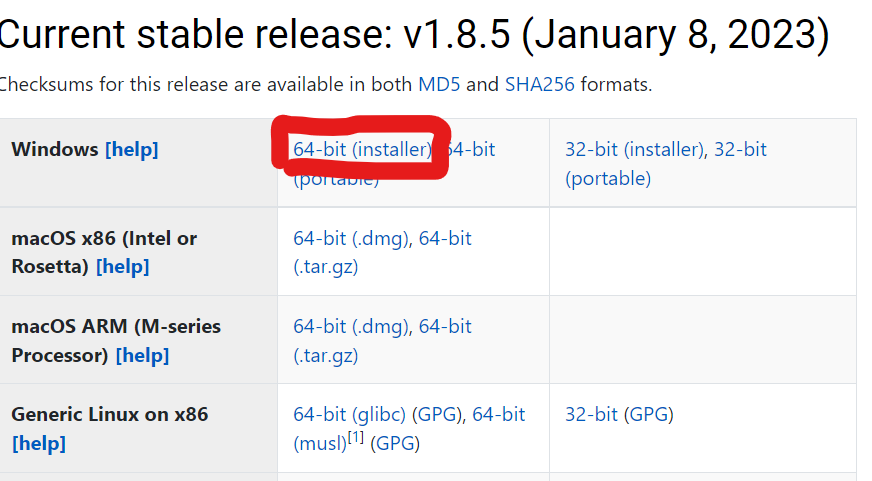
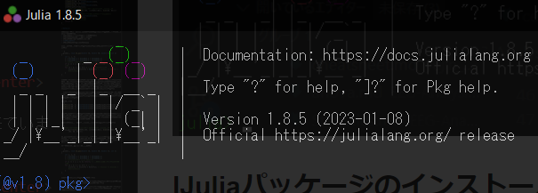
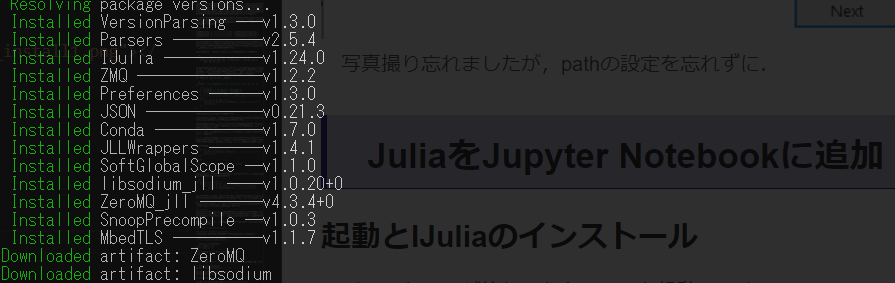
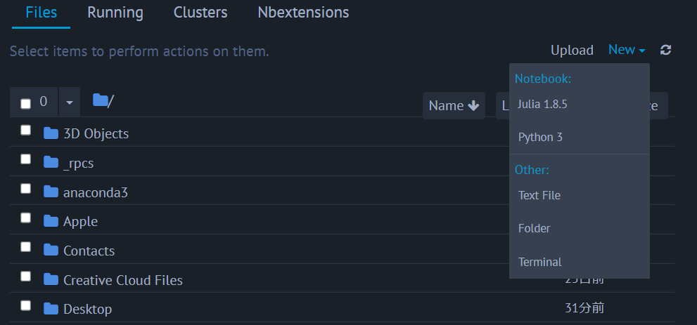
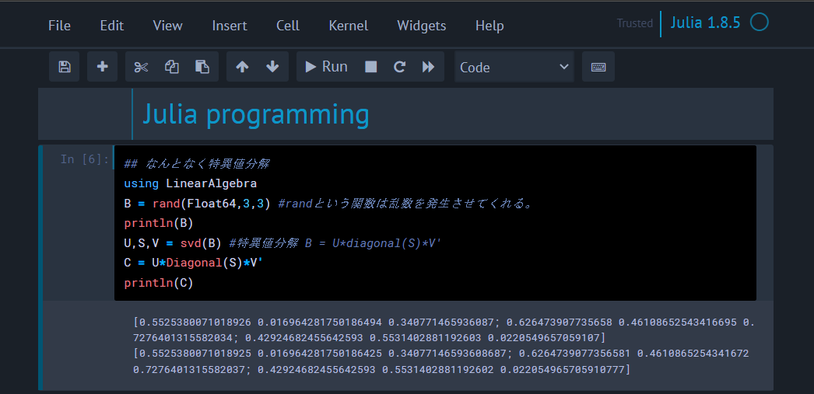
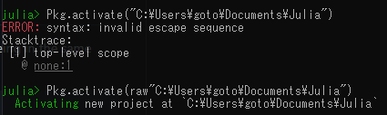

# Julia on Jupyter notebook

Julia を Jupyter notebook で使えるようにする方法


## Juliaとは
Julia は 2012 年と比較的最近開発されたプログラミング言語で，機械学習や数値計算と相性が良い言語として近年のデータサイエンス界隈で評価されています．
なんかできたかも
<center></center>

構文がシンプルであること，計算処理が高速であることが主な人気の理由のようです．といっても，Python でも Numpy 使ったり Cupy で GPU 使ったりした場合に比較するとどうなのかはよく知りません．とりあえず，

- 無料でオープンソース
- 高速でハイパフォーマンス
- Python や C の関数が呼び出せる
- 動的言語だけど静的型付けの導入も出来る

あたりが主な特徴ぽいです．

難点は，**ともかく教材が少ない**ことです．プログラミングにある程度精通していないと，困った時に参考にできる記事も少ないし，ハードルが高いです（特に日本語の資料は本当に少ない）．これは即ち，ライブラリが少なく様々な機能を自分で実装する必要があるということでもあります．

あと，Python と違って汎用性が低いので，上記のような用途以外で使おうと思うと Python に劣ります．

が，それでも得意分野で Python と比べたら**処理速度 30 倍**なんてうたわれている言語ですので，今回は導入してみます．だいたい C と同等以上の処理速度ですね．動的なのにそれはすごいです．

## Juliaのダウンロード

### Download
まずは[公式のダウンロードページ](https://julialang.org/downloads/)から自分のバージョンにあったものをダウンロードします．


<center></center>

筆者はwindowsなので，囲った部分です．Macの人はMacを選びます．

### Install
インストーラーのダウンロードが終わったらクリックして実行．デフォルト設定のままでOKなのでInstall.

<center></center>

起動を簡単にするため，PATHの設定はチェックしておくことをおすすめします．

<center></center>

完了したら，`Run Julia` にチェックをつけ，Finish します．

<center></center>


## JuliaをJupyter Notebookに追加
以上の内容が出来ていれば，とりあえず Julia を利用することは出来るようになったはずです．しかし筆者は Jupyter を開発環境として使いたいので，その連携を進めていきます．

Jupyter Notebook がない場合には先に[こちら](./environment.html)から環境構築をしてください．
筆者みたいにおしゃれにするのは[こちら](./jupyter.html).

### 起動とIJuliaのインストール
インストールが終わったら，julia を起動します．
前項で ```Run Julia``` にチェックがついていれば勝手につくと思いますが，そうしていなかった場合は普通に検索して起動してください．

<center></center>

こんな感じの画面が表示されれば，julia のインストールは正常に出来ています．

<center></center>


可愛いですね．\ が文字コードの関係で ￥ になっているのはご愛敬ということで．ちょっと使ってみた感じ，なかなか独特な使用方法になっている気がします．そこらへんは後々紹介しますが，とりあえず環境構築を進めちゃいます．

### IJuliaパッケージのインストール
Julia を Jupyter Notebook で使うためには IJulia をいうパッケージが必要らしいです．インストールしましょう．

Julia でのパッケージインストールには `]` を使います．これを打つとプロンプトの表示が `julia` から `(@v1.x) pkg` に変わるはずです．数字の部分はバージョンによって異なります．自分の場合は


<center></center>

となります．

> add IJulia

と入力し，実行することでIJuliaのインストールが開始します．

進行中...
<center></center>

完了したらバックスペースを押して，通常の画面にもどります．

### Jupyter notebookとの接続

IJulia のインストールが完了したら，Jupyter Notebook で Julia を呼び出せるはずです，Jupyter Notebook を起動してください．


<center></center>

New ファイルの作成画面に，Python だけでなく Julia が表示されるようになっているはずです．これで，Jupyter Notebook を使って Julia が書けるようになりました．

<center></center>


## パッケージマネージャ(Pkg)について

Julia を使っていると，拡張でパッケージをいれたくなることがあります．Julia では，それらの拡張パッケージのインストール，更新，削除などは Julia 組み込みの Pkg を通して行うことになります．

Pkg を利用する方法は 2 種類です．一つは先程も行ったように `]` を type することで Pkg モード?に切り替える方法で，これをするとプロンプトの表示が

<center></center>

のように，`pkg` に切り替わります．この状態では Julia の関数は効かず，`pkg` の関数のみが work する状態になります．脱出するにはバックスペースです．

あるいは，もう一つのやり方は Julia のプロンプトのまま，

```julia
using Pkg; Pkg.add("IJulia")
```

のように記述することです．意味するところは一緒ですが，このやり方だと記述が面倒な分，モードの切り替えはなしですみます．

`add` 以外にも代表的なコマンドを以下にまとめます．

- add **  ... (**パッケージの追加)
- update **  ... (**パッケージの更新)
- update ... (全てのパッケージの更新)
- rm ** ... (**パッケージの削除)

### addの注意点

`PyCall` というパッケージを入れていた時に生じた問題です．このパッケージは，Julia から Python を呼び出す時に使われるものなのですが，その時どの Python を呼び出すねんってところで怒られた，というか不具合が生じました．

筆者はよくある汚い環境を使ってしまっているため，普通に Python3 と，Anaconda 環境の Python3 と Python2 が混在しています．こういった場合，PyCall が呼び出す Python のディレクトリを明示的に与えてあげる必要があったりするようです．

やり方は
```julia
using Pkg
ENV["PYTHON"] = "C:\\Users\\...\\python.exe"

Pkg.build("PyCall")
```

のようにすることです．これで，呼び出す python のバージョンを指定した上で PyCall を入れることが出来ました．

### Juliaのすごいところ
と，ここまでは Python の `pip install` などと何も変わらなそうです．しかし Julia の Pkg とそれらの大きな違い，Julia のすごいところは，環境ごとにこれらのパッケージの依存関係を管理できることです．

今，Pkgを使っている際のプロンプトは `(v1.x)` のような表示になっていると思います．これは最初，Julia のバージョンであると説明しました．つまりローカル環境の大元の環境となります．

しかしこのプロンプトが表示している真の意味は，**今現在のアクティブ環境**となります．つまり，Pkg によって改変される環境のことです．

そう，Julia は，というより Pkg は，プロジェクトごとに扱うパッケージの種類やバージョンを切り替えることができるというわけです！

実験してみます．まずはカレントディレクトリを確認します．

<center></center>

適切な場所に移動しました．Julia のおもちゃ箱で遊んでいきます．また余談ですが，Julia は \ を文字列として利用してしまうので，2 個使いましょう．あるいは

<center></center>

のように，`raw` をつけることでもパスの指定が出来ます．

さて，ではここに新しい環境を作ってみます．

<center></center>

1. `activate xxx` で新しくアクティブ環境を設定します．プロジェクト名は xxx です．プロンプトの表示が，`tutorial` に変わったことが確認できます．
2. この環境の情報を取得するには，`status` を使います．今は何も追加しない空の環境として定義したので，empty となっています．
3. `add` を使って，example パッケージを追加しました．これが終了すると，もう一度 `status` を使った際に今加えたパッケージが表示されています．

このように，環境，つまりプロジェクトごとにパッケージを指定できるのがメリットです．さらに，この際いれていたパッケージの依存関係は `Project.toml` に保存されています．

このファイルごとプロジェクトを共有することで，**「他者がダウンロードして自分の環境で実行しようとした時にバージョンの関係で動かない...」なんて自体を回避する**ことが出来ます．

たとえば，[Nonlinear Dynamics (George Datseris, Ulrich Parlitz, 2022)](https://github.com/JuliaDynamics/NonlinearDynamicsTextbook) の公開しているプロジェクトを自分のローカルに展開して試したい場合，彼らの README にもあるように，ダウンロードしたプロジェクトに対して


```julia
Pkg.activate("path/to/the/downloaded/project/folder")
Pkg.instantiate()
```

をしてあげれば，このプロジェクトで使用されているパッケージが全て (しかもバージョンを合わせて) インストールされ，すぐに実行可能になるわけです！！

<center></center>

上の画像はちょっと失敗しているのもあるっぽいけど，まあそれでも便利です．


### ダウンロードしたプログラムの実行
ということで，さっそく [Nonlinear Dynamics (George Datseris, Ulrich Parlitz, 2022)](https://github.com/JuliaDynamics/NonlinearDynamicsTextbook) の 1-1 の図を出力してみます．

<center></center>

まずは Pkg を使ってアクティブ環境を切り替えて，必要なパッケージの読み込みをさせます．その後はコピペで進めます．おまじないらしきものたちの実行．

問題なく動いたので，図の出力部分を実行してみました．無事に下の図が得られましたので，動作チェック終了です．

<center></center>

Julia，というかそれを使った非線形物理学の勉強楽しみ．

## 動作確認
ということで，環境構築は無事終了です．しかしせっかくなので，ちょっとだけ自分でコードして動かしてみたいと思います．

### 実際に力学系のプロットをやっていく．

とりあえず Lorenz 系の視覚化を目指します．

ローレンツ方程式には，1963 年の Lorenz63 モデルと 96 年の 96 モデルがありますが, ここでは次元数が低い 63 モデルの方をプロットしてみます．

モデルは以下の通りです．

$$
\begin{align}
\dot{x} = \sigma(y-x)\\
\dot{y} = -xz+\rho x - y\\
\dot{z} = xy-\beta z\\
\end{align}
$$

まずは Julia の `DynamicalSystems` パッケージを読み込みます．線形および非線形の力学系で遊ぶ際に使える便利機能が盛りだくさんです．

今回は，
1. Lorenz 系の方程式と初期値のセットを与えて
2. どのように発展するのかの軌道を `trajectory` 関数で計算させ
3. 呼び出した Python の matplotlib を使って視覚表示

をさせてみます．

```julia
using DynamicalSystems
using PyCall
#@pyimport matplotlib.pyplot as plt
#@pyimport mpl_toolkits.mplot3d as mpl3
```

まずは必要なパッケージの読み込み．下二つは Python の matplotlib を呼び出すためのものなんですけど，いまいち毎回必要なのか初回 only なのか分からなかったです．とりあえずおまじない．

次にローレンツ系の方程式を与えます．

```julia
function lorenz_rule(u,p,t)
    σ, ρ, β = p
    x, y, z = u
    dx = σ*(y - x)
    dy = x*(ρ - z) - y
    dz = x*y - β*z
    return SVector(dx, dy, dz)
end
```

ここで面白いのが，（他の言語でもあるのかもしれないけど知らなかった)，Julia は TeX 形式で特殊記号を直接扱えることです．

`\sigma`

とタイプして Tab を押すことで，プログラム内で記号 $\sigma$ を使えます．面白い．

```julia
p = [10.0, 28.0, 8/3]
u_theta = [0.0, 10.0, 0.0]

lorenz = ContinuousDynamicalSystem(lorenz_rule, u_theta, p)

T = 100.0
deltat = 0.01
A = trajectory(lorenz, T; deltat)
```

初期値などなどの設定．ここで素晴らしいのは，`trajectory` だけで勝手に軌道を計算してくれることですね．とても便利です．

```julia
fig = plt.figure()
fig.add_subplot(projection="3d")

plot(A[:,1], A[:,2], A[:,3], "-", color="r", lw=0.5)
title("Lorenz63")
plt.show()
```

結果は python の matplotlib で表示．なんか浮気しているみたいでソワソワしますが，こんな簡単に呼び出せるのは重宝しますね．記法も一緒です．

あ，あと注意点は，Julia の index は 1 始まりです．気持ち悪いですが，ここは慣れる必要がありますね．Python の記法なので間違えそうです．

実際にこれで表示されたのが

<center></center>

です！！できた！！

### ヘルプの使い方およびソースコードの見方
また，Julia の function については

`?trajectory`

のようにタイプすることで詳細をみることが出来ます．

<center></center>


下の方見ると，この関数は DifferentialEquations を呼び出しているようです．今度はそっちを調べるといった形に深堀っていけば理解が深まるはずです．

また，プログラムがある程度触れる or 勤勉な人なら，実際に数学ソースコードを見たいと思うはずです．そういった場合には

<center></center>

のように `@edit` コマンドを使うことでソースを開くことが出来ます．面白いのはこれ，多分普通に関数のソースなわけではなく，【この場合のソース】が表示されるんですかね？引数の指定までしないといけなかったので...

結果はたとえば以下のようになります．

<center></center>
