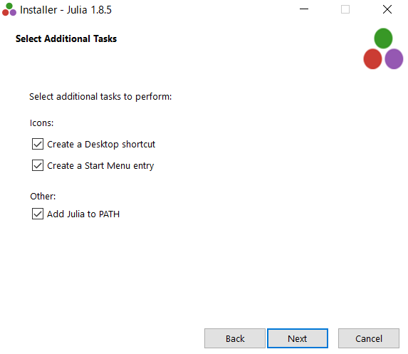
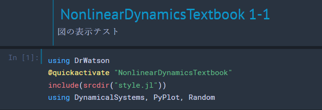

---
html:
  embed_local_images: false
  embed_svg: true
  offline: false
  toc: true

print_background: false

export_on_save:
  html: true
---
<div class="header">
  <table class="fixed-table">
    <thead>
      <tr>
        <th class="mokuji">目次</th>
        <th><details><summary> Math </summary><ul class="gnav"><details><summary>基礎数学編</summary>
        <ul class="index">
        <li><a href="../../Math/Basic/basic.html">ホーム</a></li> 
        <li><a href="../../Math/Basic/multiplication.html">掛け算</a></li>     
        <li><a href="../../Math/Basic/trigonometric.html">三角関数</a></li>
        <li><a href="../../Math/Basic/complex.html">複素数</a></li>
        <li><a href="../../Math/Basic/calculus.html">微分・積分</a></li>
        <li><a href="../../Math/Basic/linear_algebra.html">線形代数</a></li>
        <li><a href="../../Math/Basic/statistics.html">基礎統計</a></li>
        </ul></details>
        <ul class="gnav"><details><summary>信号処理編</summary>
        <ul class="index">
        <li><a href="../../Math/Analysis/Analysis.html">ホーム</a></li> 
        <li><a href="../../Math/Analysis/fourier.html">フーリエ変換</a></li>
        <li><a href="../../Math/Analysis/wavelet.html">wavelet変換</a></li>
        <li><a href="../../Math/Analysis/hilbert.html">ヒルベルト変換</a></li>
        <li><a href="../../Math/Analysis/eeg.html">基本の脳波解析</a></li> <li><a href="../../Math/Analysis/phase_analysis.html">位相同期解析</a></li>
        </ul></details>
        <ul class="gnav"><details><summary>統計編</summary>
        <ul class="index">
        <li><a href="../../Math/Statistics/Statistic.html">ホーム</a></li> 
        <li><a href="../../Math/Statistics/distribution.html">確率分布</a></li>
        <li><a href="../../Math/Statistics/central_limit_theorem.html">大数の法則と中心極限定理</a></li>
        <li><a href="../../Math/Statistics/statistic.html">統計量と標本分布</a></li>                                                         <li><a href="../../Math/Statistics/test.html">統計的検定</a></li>
        <li><a href="../../Math/Statistics/anova.html">分散分析</a></li>
        <li><a href="../../Math/Statistics/logistic_regression.html">ロジスティック回帰</a></li>
        </ul></details>
        <ul class="gnav"><details><summary>その他</summary>
        <ul class="index">
        <li><a href="../../Math/Others/Others.html">ホーム</a></li> 
        <li><a href="../../Math/Others/ICA.html">独立成分分析</a></li> 
        <li><a href="../../Math/Others/CCA.html">正準相関分析</a></li>
        <li><a href="../../Math/Others/lagrange.html">ラグランジュの未定乗数法</a></li>
        <li><a href="../../Math/Others/Entropy.html">エントロピーと分布間距離</a></li>
        <li><a href="../../Math/Others/signal_detection.html">信号検出理論</a></li>
        </ul></details>
        </details></th>
        <th><details><summary> Analysis </summary>
        <ul class="gnav"><details><summary>EEGLAB</summary>
        <ul class="index">       
        <li><a href="../../Analysis/eeglab/eeglab.html">ホーム</a></li>                           <li><a href="../../Analysis/eeglab/setup.html">環境構築</a></li>
        <li><a href="../../Analysis/eeglab/import.html">データのインポート</a></li>
        <li><a href="../../Analysis/eeglab/prepro1.html">基本的な下処理</a></li>
        <li><a href="../../Analysis/eeglab/prepro2.html">発展的な下処理</a></li>
        <li><a href="../../Analysis/eeglab/analysis1.html">単被験者での解析</a></li>
        <li><a href="../../Analysis/eeglab/analysis2.html">被験者群での解析</a></li>
        </ul></details>
        <ul class="gnav"><details><summary>MNE-python</summary>
        <ul class="index">
        <li><a href="../../Analysis/MNE/MNE.html">ホーム</a></li>
        <li><a href="../../Analysis/MNE/import.html">データのロード</a></li>
        <li><a href="../../Analysis/MNE/preprocessing.html">前処理</a></li>
        </ul> </details></details></th>
        <th><details><summary> Experiment </summary>
        <ul class="gnav">       </ul> </details></th>
        <th><details><summary> Simulations </summary>
        <ul class="gnav"><details><summary>環境構築</summary>
        <ul class="index">
         <li><a href="../../Simulation/Setup/Setup.html">ホーム</a></li>
        <li><a href="../../Simulation/Setup/environment.html">Python環境構築</a></li>
        <li><a href="../../Simulation/Setup/gpu.html">pythonでのGPUセットアップ</a></li>
        <li><a href="../../Simulation/Setup/jupyter.html">Jupyterセットアップ</a></li>
        <li><a href="../../Simulation/Setup/julia.html">Juliaセットアップ</a></li>
        </ul></details>
        <ul class="gnav"><details><summary>非線形力学</summary>
        <ul class="index">
        <li><a href="../../Simulation/NonlinearDynamics/Nonlinear-dynamics.html">ホーム</a></li>
        <li><a href="../../Simulation/NonlinearDynamics/dynamics.html">力学系とは</a></li>
        <li><a href="../../Simulation/NonlinearDynamics/stability.html">線形安定性解析</a></li>
        <li><a href="../../Simulation/NonlinearDynamics/stability_nonlinear.html">非線形系の安定性解析</a></li>
        </ul></details>
        </details></th>
      </tr>
    </thead>
  </table>
</div>

<h1><span>00</span>Julia on Jupyter notebook</h1>

JuliaをJupyter notebookで使えるようにする方法


## Juliaとは
Juliaは2012年と比較的最近開発されたプログラミング言語で，機械学習や数値計算と相性が良い言語として近年のデータサイエンス界隈で評価されています．
なんかできたかも
<center></center>

構文がシンプルであること，計算処理が高速であることが主な人気の理由のようです．といっても，PythonでもNumpy使ったりCupyでGPU使ったりした場合に比較するとどうなのかはよく知りません．とりあえず，

- 無料でオープンソース
- 高速でハイパフォーマンス
- PythonやCの関数が呼び出せる
- 動的言語だけど静的型付けの導入も出来る

あたりが主な特徴ぽいです．

難点は，**ともかく教材が少ない**ことです．プログラミングにある程度精通していないと，困った時に参考にできる記事も少ないし，ハードルが高いです（特に日本語の資料は本当に少ない）．これは即ち，ライブラリが少なく様々な機能を自分で実装する必要があるということでもあります．

あと，Pythonと違って汎用性が低いので，上記のような用途以外で使おうと思うとPythonに劣ります．

が，それでも得意分野でPythonと比べたら**処理速度30倍**なんてうたわれている言語ですので，今回は導入してみます．だいたいCと同等以上の処理速度ですね．動的なのにそれはすごいです．

## Juliaのダウンロード

### Download
まずは[公式のダウンロードページ](https://julialang.org/downloads/)から自分のバージョンにあったものをダウンロードします．


<center></center>

筆者はwindowsなので，囲った部分です．Macの人はMacを選びます．

### Install
インストーラーのダウンロードが終わったらクリックして実行．デフォルト設定のままでOKなのでInstall.

<center></center>

起動を簡単にするため，PATHの設定はチェックしておくことをおすすめします．

<center></center>

完了したら，```Run Julia```にチェックをつけ，Finishします．

<center></center>


## JuliaをJupyter Notebookに追加
以上の内容が出来ていれば，とりあえずJuliaを利用することは出来るようになったはずです．しかし筆者はJupyterを開発環境として使いたいので，その連携を進めていきます．

Jupyter Notebookがない場合には先に[こちら](./environment.html)から環境構築をしてください．
筆者みたいにおしゃれにするのは[こちら](./jupyter.html).

### 起動とIJuliaのインストール
インストールが終わったら，juliaを起動します．
前項で```Run Julia```にチェックがついていれば勝手につくと思いますが，そうしていなかった場合は普通に検索して起動してください．

<center></center>

こんな感じの画面が表示されれば，juliaのインストールは正常に出来ています．

<center></center>


可愛いですね．\が文字コードの関係で￥になっているのはご愛敬ということで．ちょっと使ってみた感じ，なかなか独特な使用方法になっている気がします．そこらへんは後々紹介しますが，とりあえず環境構築を進めちゃいます．

### IJuliaパッケージのインストール
JuliaをJupyter Notebookで使うためにはIJuliaをいうパッケージが必要らしいです．インストールしましょう．

Juliaでのパッケージインストールには```]```を使います．これを打つとプロンプトの表示が```julia```から```(@v1.x) pkg```に変わるはずです．数字の部分はバージョンによって異なります．自分の場合は


<center></center>

となります．

> add IJulia

と入力し，実行することでIJuliaのインストールが開始します．

進行中...
<center></center>

完了したらバックスペースを押して，通常の画面にもどります．

### Jupyter notebookとの接続

IJuliaのインストールが完了したら，Jupyter NotebookでJuliaを呼び出せるはずです，Jupyter Notebookを起動してください．


<center></center>

Newファイルの作成画面に，PythonだけでなくJuliaが表示されるようになっているはずです．これで，Jupyter Notebookを使ってJuliaが書けるようになりました．

<center></center>


## パッケージマネージャ(Pkg)について

Juliaを使っていると，拡張でパッケージをいれたくなることがあります．Juliaでは，それらの拡張パッケージのインストール，更新，削除などはJulia組み込みのPkgを通して行うことになります．

Pkgを利用する方法は2種類です．一つは先程も行ったように`]`をtypeすることでPkgモード?に切り替える方法で，これをするとプロンプトの表示が

<center></center>

のように，pkgに切り替わります．この状態ではJuliaの関数は効かず，pkgの関数のみがworkする状態になります．脱出するにはバックスペースです．

あるいは，もう一つのやり方はJuliaのプロンプトのまま，

```Julia
using Pkg; Pkg.add("IJulia")
```

のように記述することです．意味するところは一緒ですが，このやり方だと記述が面倒な分，モードの切り替えはなしですみます．

add以外にも代表的なコマンドを以下にまとめます．

- add **  ... (**パッケージの追加)
- update **  ... (**パッケージの更新)
- update ... (全てのパッケージの更新)
- rm ** ... (**パッケージの削除)

### addの注意点

PyCallというパッケージを入れていた時に生じた問題です．このパッケージは，JuliaからPythonを呼び出す時に使われるものなのですが，その時どのPythonを呼び出すねんってところで怒られた，というか不具合が生じました．

筆者はよくある汚い環境を使ってしまっているため，普通にPython3と，Anaconda環境のPython3とPython2が混在しています．こういった場合，PyCallが呼び出すPythonのディレクトリを明示的に与えてあげる必要があったりするようです．

やり方は
```Julia
using Pkg
ENV["PYTHON"] = "C:\\Users\\...\\python.exe"

Pkg.build("PyCall")
```

のようにすることです．これで，呼び出すpythonのバージョンを指定した上でPyCallを入れることが出来ました．

### Juliaのすごいところ
と，ここまではPythonの`pip install`などと何も変わらなそうです．しかしJuliaのPkgとそれらの大きな違い，Juliaのすごいところは，環境ごとにこれらのパッケージの依存関係を管理できることです．

今，Pkgを使っている際のプロンプトは`(v1.x)`のような表示になっていると思います．これは最初，Juliaのバージョンであると説明しました．つまりローカル環境の大元の環境となります．

しかしこのプロンプトが表示している真の意味は，**今現在のアクティブ環境**となります．つまり，Pkgによって改変される環境のことです．

そう，Juliaは，というよりPkgは，プロジェクトごとに扱うパッケージの種類やバージョンを切り替えることができるというわけです！

実験してみます．まずはカレントディレクトリを確認します．

<center></center>

適切な場所に移動しました．Juliaのおもちゃ箱で遊んでいきます．また余談ですが，Juliaは\を文字列として利用してしまうので，2個使いましょう．あるいは

<center></center>

のように，`raw`をつけることでもパスの指定が出来ます．

さて，ではここに新しい環境を作ってみます．

<center></center>

1. `activate xxx`で新しくアクティブ環境を設定します．プロジェクト名はxxxです．プロンプトの表示が，`tutorial`に変わったことが確認できます．
2. この環境の情報を取得するには，`status`を使います．今は何も追加しない空の環境として定義したので，emptyとなっています．
3. `add`を使って，exampleパッケージを追加しました．これが終了すると，もう一度`status`を使った際に今加えたパッケージが表示されています．

このように，環境，つまりプロジェクトごとにパッケージを指定できるのがメリットです．さらに，この際いれていたパッケージの依存関係は`Project.toml`に保存されています．

このファイルごとプロジェクトを共有することで，**「他者がダウンロードして自分の環境で実行しようとした時にバージョンの関係で動かない...」なんて自体を回避する**ことが出来ます．

たとえば，[Nonlinear Dynamics (George Datseris, Ulrich Parlitz, 2022)](https://github.com/JuliaDynamics/NonlinearDynamicsTextbook)の公開しているプロジェクトを自分のローカルに展開して試したい場合，彼らのREADMEにもあるように，ダウンロードしたプロジェクトに対して


```Julia
Pkg.activate("path/to/the/downloaded/project/folder")
Pkg.instantiate()
```

をしてあげれば，このプロジェクトで使用されているパッケージが全て (しかもバージョンを合わせて) インストールされ，すぐに実行可能になるわけです！！

<center></center>

上の画像はちょっと失敗しているのもあるっぽいけど，まあそれでも便利です．


### ダウンロードしたプログラムの実行
ということで，さっそく[Nonlinear Dynamics (George Datseris, Ulrich Parlitz, 2022)](https://github.com/JuliaDynamics/NonlinearDynamicsTextbook)の1-1の図を出力してみます．

<center></center>

まずはPkgを使ってアクティブ環境を切り替えて，必要なパッケージの読み込みをさせます．その後はコピペで進めます．おまじないらしきものたちの実行．

問題なく動いたので，図の出力部分を実行してみました．無事に下の図が得られましたので，動作チェック終了です．

<center></center>

Julia，というかそれを使った非線形物理学の勉強楽しみ．

## 動作確認
ということで，環境構築は無事終了です．しかしせっかくなので，ちょっとだけ自分でコードして動かしてみたいと思います．

### 実際に力学系のプロットをやっていく．

とりあえずLorenz系の視覚化を目指します．

ローレンツ方程式には，1963年のLorenz63モデルと96年の96モデルがありますが, ここでは次元数が低い63モデルの方をプロットしてみます．

モデルは以下の通りです．
$$
\dot{x} = \sigma(y-x)\\
\dot{y} = -xz+\rho x - y\\
\dot{z} = xy-\beta z\\
$$

まずはJuliaの`DynamicalSystems` パッケージを読み込みます．線形および非線形の力学系で遊ぶ際に使える便利機能が盛りだくさんです．

今回は，
1. Lorenz系の方程式と初期値のセットを与えて
2. どのように発展するのかの軌道を`trajectory`関数で計算させ
3. 呼び出したPythonのmatplotlibを使って視覚表示

をさせてみます．

```Julia
using DynamicalSystems
using PyCall
#@pyimport matplotlib.pyplot as plt
#@pyimport mpl_toolkits.mplot3d as mpl3
```

まずは必要なパッケージの読み込み．下二つはPythonのmatplotlibを呼び出すためのものなんですけど，いまいち毎回必要なのか初回onlyなのか分からなかったです．とりあえずおまじない．

次にローレンツ系の方程式を与えます．

```Julia
function lorenz_rule(u,p,t)
    σ, ρ, β = p
    x, y, z = u
    dx = σ*(y - x)
    dy = x*(ρ - z) - y
    dz = x*y - β*z
    return SVector(dx, dy, dz)
end
```

ここで面白いのが，（他の言語でもあるのかもしれないけど知らなかった)，JuliaはTeX形式で特殊記号を直接扱えることです．

`\sigma`

とタイプしてTabを押すことで，プログラム内で記号$\sigma$を使えます．面白い．

```Julia
p = [10.0, 28.0, 8/3]
u_theta = [0.0, 10.0, 0.0]

lorenz = ContinuousDynamicalSystem(lorenz_rule, u_theta, p)

T = 100.0
deltat = 0.01
A = trajectory(lorenz, T; deltat)
```

初期値などなどの設定．ここで素晴らしいのは，`trajectory`だけで勝手に軌道を計算してくれることですね．とても便利です．

```Julia
fig = plt.figure()
fig.add_subplot(projection="3d")

plot(A[:,1], A[:,2], A[:,3], "-", color="r", lw=0.5)
title("Lorenz63")
plt.show()
```

結果はpythonのmatplotlibで表示．なんか浮気しているみたいでソワソワしますが，こんな簡単に呼び出せるのは重宝しますね．記法も一緒です．

あ，あと注意点は，Juliaのindexは1始まりです．気持ち悪いですが，ここは慣れる必要がありますね．Pythonの記法なので間違えそうです．

実際にこれで表示されたのが

<center></center>

です！！できた！！

### ヘルプの使い方およびソースコードの見方
また，Juliaのfunctionについては

`?trajectory`

のようにタイプすることで詳細をみることが出来ます．

<center></center>


下の方見ると，この関数はDifferentialEquationsを呼び出しているようです．今度はそっちを調べるといった形に深堀っていけば理解が深まるはずです．

また，プログラムがある程度触れる or 勤勉な人なら，実際に数学ソースコードを見たいと思うはずです．そういった場合には

<center></center>

のように`@edit`コマンドを使うことでソースを開くことが出来ます．面白いのはこれ，多分普通に関数のソースなわけではなく，【この場合のソース】が表示されるんですかね？引数の指定までしないといけなかったので...

結果はたとえば以下のようになります．

<center></center>


<div style="text-align: center;">

【[Home](../Simulation.html)】

</div>
