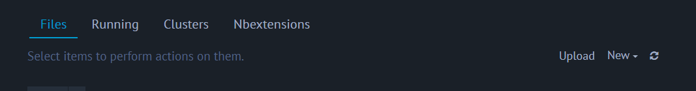
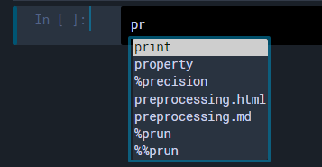
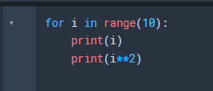

---
html:
  embed_local_images: false
  embed_svg: true
  offline: false
  toc: true

print_background: false

export_on_save:
  html: true
---

<div class="header">
  <table class="fixed-table">
    <thead>
      <tr>
        <th class="mokuji">目次</th>
        <th><details><summary> Math </summary><ul class="gnav"><details><summary>基礎数学編</summary>
        <ul class="index">
        <li><a href="../../Math/Basic/basic.html">ホーム</a></li> 
        <li><a href="../../Math/Basic/multiplication.html">掛け算</a></li>     
        <li><a href="../../Math/Basic/trigonometric.html">三角関数</a></li>
        <li><a href="../../Math/Basic/complex.html">複素数</a></li>
        <li><a href="../../Math/Basic/calculus.html">微分・積分</a></li>
        <li><a href="../../Math/Basic/linear_algebra.html">線形代数</a></li>
        <li><a href="../../Math/Basic/statistics.html">基礎統計</a></li>
        </ul></details>
        <ul class="gnav"><details><summary>信号処理編</summary>
        <ul class="index">
        <li><a href="../../Math/Analysis/Analysis.html">ホーム</a></li> 
        <li><a href="../../Math/Analysis/fourier.html">フーリエ変換</a></li>
        <li><a href="../../Math/Analysis/wavelet.html">wavelet変換</a></li>
        <li><a href="../../Math/Analysis/hilbert.html">ヒルベルト変換</a></li>
        <li><a href="../../Math/Analysis/eeg.html">基本の脳波解析</a></li> <li><a href="../../Math/Analysis/phase_analysis.html">位相同期解析</a></li>
        </ul></details>
        <ul class="gnav"><details><summary>統計編</summary>
        <ul class="index">
        <li><a href="../../Math/Statistics/Statistic.html">ホーム</a></li> 
        <li><a href="../../Math/Statistics/distribution.html">確率分布</a></li>
        <li><a href="../../Math/Statistics/central_limit_theorem.html">大数の法則と中心極限定理</a></li>
        <li><a href="../../Math/Statistics/statistic.html">統計量と標本分布</a></li>                                                         <li><a href="../../Math/Statistics/test.html">統計的検定</a></li>
        <li><a href="../../Math/Statistics/anova.html">分散分析</a></li>
        <li><a href="../../Math/Statistics/logistic_regression.html">ロジスティック回帰</a></li>
        </ul></details>
        <ul class="gnav"><details><summary>その他</summary>
        <ul class="index">
        <li><a href="../../Math/Others/Others.html">ホーム</a></li> 
        <li><a href="../../Math/Others/ICA.html">独立成分分析</a></li> 
        <li><a href="../../Math/Others/CCA.html">正準相関分析</a></li>
        <li><a href="../../Math/Others/lagrange.html">ラグランジュの未定乗数法</a></li>
        <li><a href="../../Math/Others/Entropy.html">エントロピーと分布間距離</a></li>
        <li><a href="../../Math/Others/signal_detection.html">信号検出理論</a></li>
        </ul></details>
        </details></th>
        <th><details><summary> Analysis </summary>
        <ul class="gnav"><details><summary>EEGLAB</summary>
        <ul class="index">       
        <li><a href="../../Analysis/eeglab/eeglab.html">ホーム</a></li>                           <li><a href="../../Analysis/eeglab/setup.html">環境構築</a></li>
        <li><a href="../../Analysis/eeglab/import.html">データのインポート</a></li>
        <li><a href="../../Analysis/eeglab/prepro1.html">基本的な下処理</a></li>
        <li><a href="../../Analysis/eeglab/prepro2.html">発展的な下処理</a></li>
        <li><a href="../../Analysis/eeglab/analysis1.html">単被験者での解析</a></li>
        <li><a href="../../Analysis/eeglab/analysis2.html">被験者群での解析</a></li>
        </ul></details>
        <ul class="gnav"><details><summary>MNE-python</summary>
        <ul class="index">
        <li><a href="../../Analysis/MNE/MNE.html">ホーム</a></li>
        <li><a href="../../Analysis/MNE/import.html">データのロード</a></li>
        <li><a href="../../Analysis/MNE/preprocessing.html">前処理</a></li>
        </ul> </details></details></th>
        <th><details><summary> Experiment </summary>
        <ul class="gnav">       </ul> </details></th>
        <th><details><summary> Simulations </summary>
        <ul class="gnav"><details><summary>環境構築</summary>
        <ul class="index">
         <li><a href="../../Simulation/Setup/Setup.html">ホーム</a></li>
        <li><a href="../../Simulation/Setup/environment.html">Python環境構築</a></li>
        <li><a href="../../Simulation/Setup/gpu.html">pythonでのGPUセットアップ</a></li>
        <li><a href="../../Simulation/Setup/jupyter.html">Jupyterセットアップ</a></li>
        <li><a href="../../Simulation/Setup/julia.html">Juliaセットアップ</a></li>
        </ul></details>
        <ul class="gnav"><details><summary>非線形力学</summary>
        <ul class="index">
        <li><a href="../../Simulation/NonlinearDynamics/Nonlinear-dynamics.html">ホーム</a></li>
        <li><a href="../../Simulation/NonlinearDynamics/dynamics.html">力学系とは</a></li>
        <li><a href="../../Simulation/NonlinearDynamics/stability.html">線形安定性解析</a></li>
        <li><a href="../../Simulation/NonlinearDynamics/stability_nonlinear.html">非線形系の安定性解析</a></li>
        </ul></details>
        </details></th>
      </tr>
    </thead>
  </table>
</div>

<h1><span>03</span>Jupyter Notebookのカスタム</h1>

趣味です．ただの趣味．
人によっては全く興味がないと思うのですが，個人的にJupyter Notebookは見た目がださかったり，ちょっと使い勝手が悪いと思うことがあったのでカスタムの仕様と方法を貼っておきます．

備忘録兼，筆者のスクリーンショットを見て気になった人のためのページになります．

<!-- @import "[TOC]" {cmd="toc" depthFrom=2 depthTo=4 orderedList=false} -->

<!-- code_chunk_output -->

- [見た目の変更](#見た目の変更)
  - [jupyter_contrib_nbextensionsのインストール](#jupyter_contrib_nbextensionsのインストール)
  - [jupyter-themeのインストール](#jupyter-themeのインストール)
- [Vimキーバインド](#vimキーバインド)
  - [jupyter-vim-binding](#jupyter-vim-binding)
  - [Vimキーバインドの設定](#vimキーバインドの設定)
  - [色の修正](#色の修正)
- [その他便利なNbextensions](#その他便利なnbextensions)
  - [Collapsible Headings](#collapsible-headings)
  - [Hinterland](#hinterland)
  - [Skip-Traceback](#skip-traceback)
  - [Tree filter](#tree-filter)
  - [Code font size](#code-font-size)
  - [Snippets Menu](#snippets-menu)
  - [Codefolding](#codefolding)
  - [ExcuteTime](#excutetime)
  - [Table of Contents(2)](#table-of-contents2)
  - [Variable Inspector](#variable-inspector)

<!-- /code_chunk_output -->


## 見た目の変更
早速ですが，Jupyter Notebookって背景真っ白でちょっとださいし，何より目が疲れますよね．

なので，ここではそんなJupyterの見た目をおしゃれに，目に優しくしていきます．時代はSDGsです．


<center></center>

こんな感じになりました．色なんかは各自である程度好きに変える事ができます．

### jupyter_contrib_nbextensionsのインストール

```sh
conda install -c conda-forge jupyter_contrib_nbextensions
```

で，まずはJupyterの拡張機能をいじるためのnbextensionを追加します．
condaコマンドなことに注意です．

これで，色々といじれるようになります．

上手くいくと，Jupyter notebookのHomeを開くと

<center></center>

のように，`Nbextensions`タブが作成されます．

### jupyter-themeのインストール

jupyterの見た目を良い感じにしてくれるカラーテンプレートをいれます．

```sh
conda install -c conda-forge jupyterthemes
```

これでいれるのは完了です．選べるカラーテーマの一覧は

```sh
jt -l
```

で表示できます．
<center></center>


選ぶ際には，
```sh
jt -t chesterish
```

などとします．更に，他にも細かい設定を加えることができますので，自分は

```sh
jt -t chesterish -T -cellw 90% -f roboto -fs 9 -tf merriserif -tfs 11 -nf ptsans -nfs 11 -dfs 8 -ofs 8
```

としています．お好みで色々調べてみてください．

## Vimキーバインド
### jupyter-vim-binding
筆者はvimmerです．Emacsなんてものを使う変人もいるようですが，vimの方が圧倒的に便利です．chromeの拡張機能なんかにもvimをいれているのですが，これがないと作業なんてできたものじゃないので必須です．

jupyter notebookでも，操作をいちいちマウス触らずに，しかもホームポジションから手を動かさずに行いたいので，拡張でvim key-bindをいれます．

```sh
jupyter --data-dir
```

で，jupyterが入っている場所を特定します．表示されたパスを使って

```sh
mkdir -p $(jupyter --data-dir)/nbextensions
cd $(jupyter --data-dir)/nbextensions
git clone https://github.com/lambdalisue/jupyter-vim-binding vim_binding
jupyter nbextension enable vim_binding/vim_binding
```

を続けて実行します．これで，Jupyterでvimのkey-bindが使えるようになりました！万歳．

### Vimキーバインドの設定
このままでも結構便利になっている（たとえばhjklでの移動）のですが，モード切り替えのためにEscを押さないといけないのは面倒です．せめてそれくらいはカスタムしておきたい．ということで，

> ~/.jupyter/custom/custom.js

を編集しました．

コードは

<details><summary>詳細</summary>

```js
// Configure CodeMirror Keymap
require([
  'nbextensions/vim_binding/vim_binding',   // depends your installation
], function() {
  CodeMirror.Vim.map("jj", "<Esc>", "insert"); // jj setting!
});

// Configure Jupyter Keymap
require([
  'nbextensions/vim_binding/vim_binding',
  'base/js/namespace',
], function(vim_binding, ns) {
  // Add post callback
  vim_binding.on_ready_callbacks.push(function(){
    var km = ns.keyboard_manager;
    // Allow Ctrl-2 to change the cell mode into Markdown in Vim normal mode
    km.edit_shortcuts.add_shortcut('ctrl-2', 'vim-binding:change-cell-to-markdown', true);
    // Update Help
    km.edit_shortcuts.events.trigger('rebuild.QuickHelp');
  });
});
```

</details>

にまとめました．これによって，とりあえずjjでの挿入モード抜け出しを可能とし，あとはセルのマークダウンとコードモード変更をCtr-2で変更できるようにしました．


### 色の修正
しかし，vimキーバインド有効にしてしまうと，選択中のセルが白くハイライトされることになってしまい，とても見にくくなります．


<center></center>

なので改めて，ハイライト時の色を設定する必要があります．

> ~/.jupyter/custom/custom.css

を調整していきます．

> div.cell.edit_mode {

という行を見つけ，その直前に下記をいれます．

```css
/* Jupyter cell is in normal mode when code mirror */
.edit_mode .cell.selected .CodeMirror-focused.cm-fat-cursor {
background-color: #000000 !important;
}
/* Jupyter cell is in insert mode when code mirror */
.edit_mode .cell.selected .CodeMirror-focused:not(.cm-fat-cursor) {
background-color: #000000 !important;
}
```


これで，ハイライトされたセルの色が白く塗りつぶされないようになりました．闇のvim環境の完成です．

<center></center>

## その他便利なNbextensions

その他にも導入している機能です．`Nbextensions`タブからOn/Offを切り替えることが出来ます．

(まとめながら他にも便利なの見つけて導入しているので一貫性がないです)

<center></center>

この画面で，チェックマークを入れているものが有効化されている機能です．先程コードベースで有効化したVIM bindingにもチェックが入っていますね．

### Collapsible Headings
Collapsible headings は，マークダウンを使ってメモやタイトルを入れている人にとっては嬉しくなる機能で，マークダウンの#ごとにセルを折りたたむことが出来るようになります．

<center></center>
<center></center>

うれしい

### Hinterland
楽しそうな名前．これはコードの自動補完です．

<center></center>

### Skip-Traceback
エラーメッセージをみじかく畳みます．

<center></center>

もちろん，ちゃんと見たい際にはプルダウンから
<center></center>


見れます．

### Tree filter
Jupyter notebookのHomeでファイルを検索できます．

<center></center>

これ，地味に嫌だったのでとても助かる．

### Code font size
コードのフォントサイズを変更するボタンを追加します．

虫眼鏡で調整します．

<center></center>

プロジェクタとかに写すとき助かる．あと眼鏡忘れてきたときとか．

### Snippets Menu

頻出のコードをスニペットとして登録しておき，引っ張ってくることが出来ます．デフォルトで色々ありますが，自前のを定義することも可能です．
たとえば
<center></center>

をクリックすると（これまた僕の環境と色が...面倒な...）

<center></center>

こうやっていれてくれます．


### Codefolding

コードを折りたたむ機能です．
<center></center>

こういうfor文が...

<center></center>

こうやって折りたためます．

### ExcuteTime
各セルの実行時間を出してくれます．コードの速さを追及したい時なんかに便利になります．あとついでに，最後に実行されたのがいつだったかも記録してくれるのでversion管理とかにも役立ちます．
<center></center>

### Table of Contents(2)
目次を作成してくれます．

<center></center>

ここを押すと...

<center></center>

このように，マークダウンから目次を引っ張ってきてくれます．なんか僕のだと位置が被っちゃってイラつきますが，調整自体はできるはずです．

設定次第で，1版最初のセルに自動で目次を作るといった事もできます．

### Variable Inspector

あまりに便利．変数一覧をだしてくれます．

<center></center>

メニューバーの目次の隣のひし形のマークを押すとでます．型やサイズなども見れるのでとても重宝します．


<div style="text-align: center;">

【[シミュレーション](./simulation.html)】

</div>