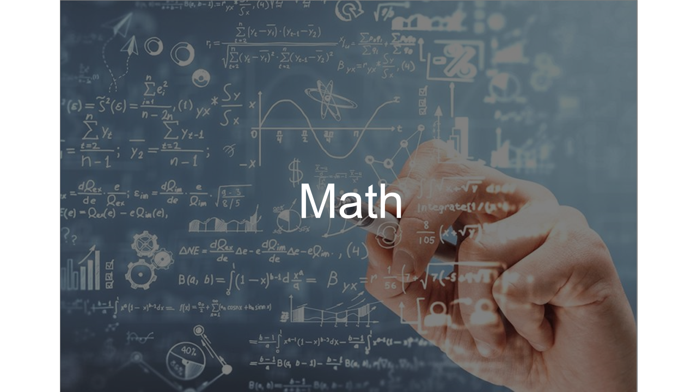
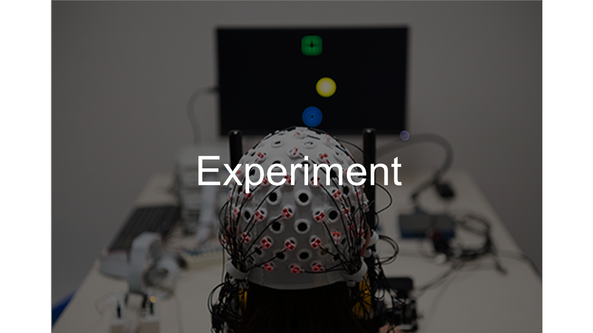

  <table class="fixed-table">
    <thead>
      <tr>
        <th class="mokuji">目次</th>
        <th>

 Math 
<ul class="gnav">

基礎数学編

        <ul class="index">
        <li><a href="./Math/Basic/basic.html">ホーム</a></li> 
        <li><a href="./Math/Basic/multiplication.html">掛け算</a></li>     
        <li><a href="./Math/Basic/trigonometric.html">三角関数</a></li>
        <li><a href="./Math/Basic/complex.html">複素数</a></li>
        <li><a href="./Math/Basic/calculus.html">微分・積分</a></li>
        <li><a href="./Math/Basic/linear_algebra.html">線形代数</a></li>
        <li><a href="./Math/Basic/statistics.html">基礎統計</a></li>
        </ul>

        <ul class="gnav">

信号処理編

        <ul class="index">
        <li><a href="./Math/Analysis/Analysis.html">ホーム</a></li> 
        <li><a href="./Math/Analysis/fourier.html">フーリエ変換</a></li>
        <li><a href="./Math/Analysis/wavelet.html">wavelet変換</a></li>
        <li><a href="./Math/Analysis/hilbert.html">ヒルベルト変換</a></li>
        <li><a href="./Math/Analysis/eeg.html">基本の脳波解析</a></li> <li><a href="./Math/Analysis/phase_analysis.html">位相同期解析</a></li>
        </ul>

        <ul class="gnav">

統計編

        <ul class="index">
        <li><a href="./Math/Statistics/Statistics.html">ホーム</a></li> 
        <li><a href="./Math/Statistics/distribution.html">確率分布</a></li>
        <li><a href="./Math/Statistics/central_limit_theorem.html">大数の法則と中心極限定理</a></li>
        <li><a href="./Math/Statistics/statistic.html">統計量と標本分布</a></li>                                                         <li><a href="./Math/Statistics/test.html">統計的検定</a></li>
        <li><a href="./Math/Statistics/anova.html">分散分析</a></li>
        <li><a href="./Math/Statistics/logistic_regression.html">ロジスティック回帰</a></li>
        </ul>

        <ul class="gnav">

その他

        <ul class="index">
        <li><a href="./Math/Others/Others.html">ホーム</a></li> 
        <li><a href="./Math/Others/ICA.html">独立成分分析</a></li> 
        <li><a href="./Math/Others/CCA.html">正準相関分析</a></li>
        <li><a href="./Math/Others/lagrange.html">ラグランジュの未定乗数法</a></li>
        <li><a href="./Math/Others/Entropy.html">エントロピーと分布間距離</a></li>
        <li><a href="./Math/Others/signal_detection.html">信号検出理論</a></li>
        </ul>

        
</th>
        <th>

 Analysis 

        <ul class="gnav">

EEGLAB

        <ul class="index">       
        <li><a href="./Analysis/eeglab/eeglab.html">ホーム</a></li>                           <li><a href="../../Analysis/eeglab/setup.html">環境構築</a></li>
        <li><a href="./Analysis/eeglab/import.html">データのインポート</a></li>
        <li><a href="./Analysis/eeglab/prepro1.html">基本的な下処理</a></li>
        <li><a href="./Analysis/eeglab/prepro2.html">発展的な下処理</a></li>
        <li><a href="./Analysis/eeglab/analysis1.html">単被験者での解析</a></li>
        <li><a href="./Analysis/eeglab/analysis2.html">被験者群での解析</a></li>
        </ul>

        <ul class="gnav">

MNE-python

        <ul class="index">
        <li><a href="./Analysis/MNE/MNE.html">ホーム</a></li>
        <li><a href="./Analysis/MNE/import.html">データのロード</a></li>
        <li><a href="./Analysis/MNE/preprocessing.html">前処理</a></li>
        </ul> 

</th>
        <th>

 Experiment 

        <ul class="gnav">       </ul> 
</th>
        <th>

 Simulations 

        <ul class="gnav">

環境構築

        <ul class="index">
         <li><a href="./Simulation/Setup/Setup.html">ホーム</a></li>
        <li><a href="./Simulation/Setup/environment.html">Python環境構築</a></li>
        <li><a href="./Simulation/Setup/gpu.html">pythonでのGPUセットアップ</a></li>
        <li><a href="./Simulation/Setup/jupyter.html">Jupyterセットアップ</a></li>
        <li><a href="./Simulation/Setup/julia.html">Juliaセットアップ</a></li>
        </ul>

        <ul class="gnav">

非線形力学

        <ul class="index">
        <li><a href="./Simulation/NonlinearDynamics/Nonlinear-dynamics.html">ホーム</a></li>
        <li><a href="./Simulation/NonlinearDynamics/dynamics.html">力学系とは</a></li>
        <li><a href="./Simulation/NonlinearDynamics/stability.html">線形安定性解析</a></li>
        <li><a href="./Simulation/NonlinearDynamics/stability_nonlinear.html">非線形系の安定性解析</a></li>
        </ul>

        
</th>
      </tr>
    </thead>
  </table>

# 脳波研究のおぼえがき

    Yujin Goto, 生理学研究所    最終更新：2024.10.31　

\
\
本稿は主に脳波を用いた神経科学研究者を志す学生が勉強する必要があるであろうアレコレをまとめ，筆者自身の備忘録ついでに後進の効率的な学習をサポートすることを目的とし作成していきます．

アカデミアの怖い世界では 'Publish or Perish' なんて言いますが，このシリーズは筆者のいわば '**Publish before you Perish**' の精神に則ったものです．筆者自身が大して業績を残せなかったとしても，より優秀な後進が，より早く学習を進め人類の叡智に貢献するよう後押しすることで許してもらおうという気持ちです．

間違いのないように尽くしますが，至らぬ点も多いかと思いますのであくまで参考程度によろしくお願いします．

コンテンツとしては大きくこんな感じ

|||
|:-----------:|:------------:|
|||